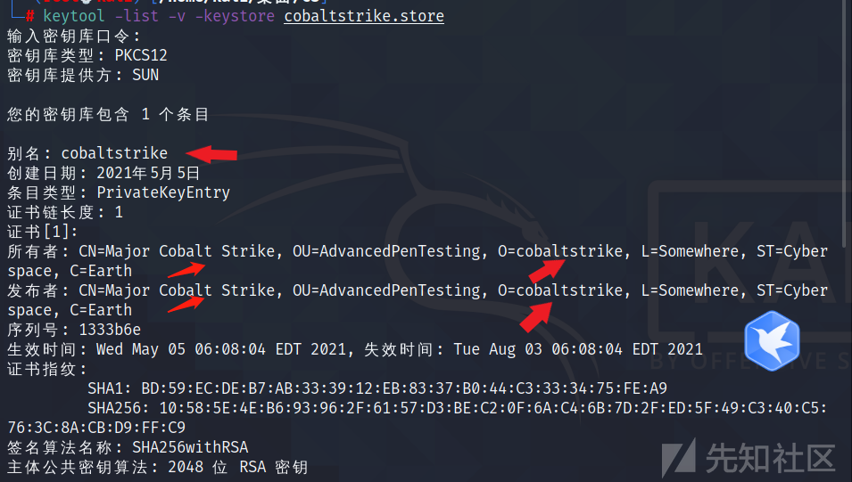
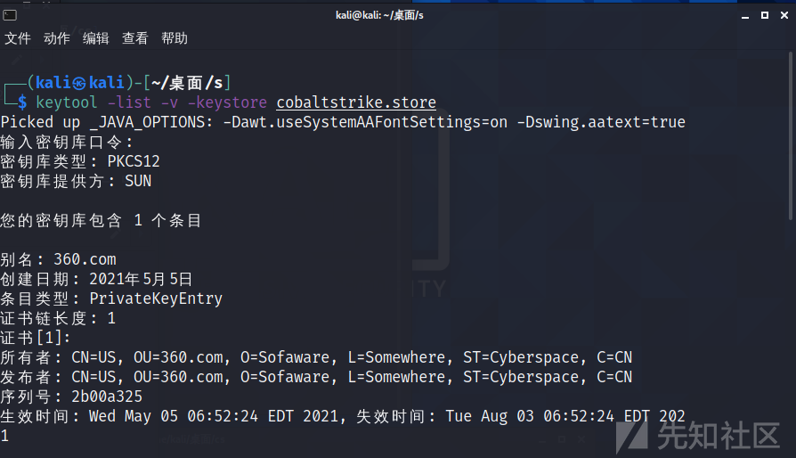
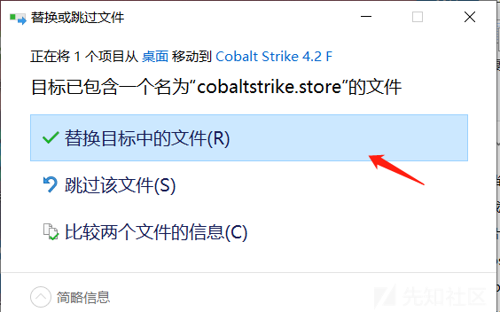
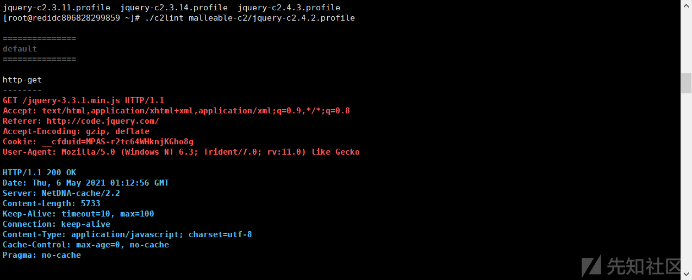
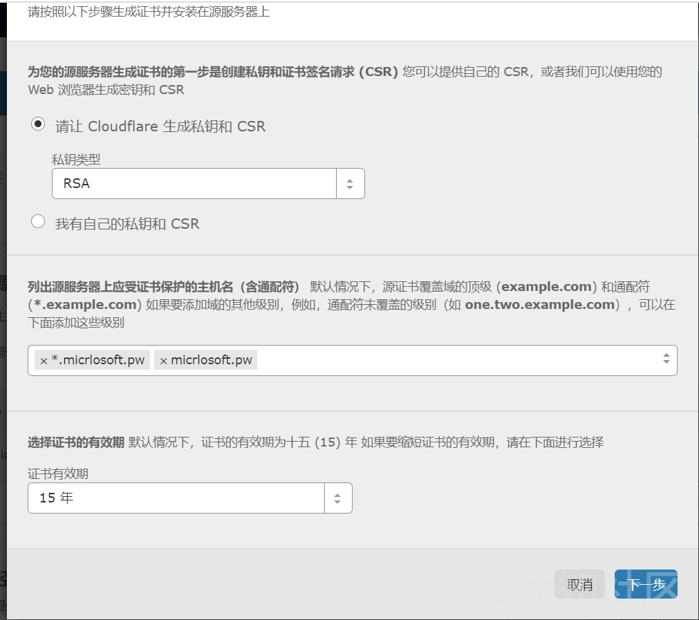

# CobaltStrike特征隐藏 - 先知社区

CobaltStrike特征隐藏

- - -

## 前言

最近有很多同学私信我，说咋渗透？没有一个完整渗透流程？工具不会用？

[](https://xzfile.aliyuncs.com/media/upload/picture/20210513223120-e2541066-b3f7-1.jpeg)

今天他来了，这次给同学们带来，cs特征隐藏，

cs的基础用法，网上也有一大堆，先知社区也有很多大佬写得很详细了，我这里就不在讲了。

## CobaltStrike概述

Cobalt Strike是一款美国Red Team开发的渗透测试神器，常被业界人称为CS。  
成为了渗透测试中不可缺少的利器。其拥有多种协议主机上线方式，集成了提权，凭据导出，端口转发，socket代理，office攻击，文件捆绑，钓鱼等功能。同时，Cobalt Strike还可以调用Mimikatz等其他知名工具，因此广受黑客喜爱。  
项目官网:[https://www.cobaltstrike.com](https://www.cobaltstrike.com/)

[](https://xzfile.aliyuncs.com/media/upload/picture/20210506234029-62ff36b8-ae81-1.png)

俗称cs别名（多人运动），顾名思义，能够多人在线，搞事情

[](https://xzfile.aliyuncs.com/media/upload/picture/20210506234045-6bf4ac08-ae81-1.jpeg)

但是，cs这么强，cs的特征早被waf厂商标记了，你想想，好不容易搞下的目标，一连cs，就被waf提取到异常，分析下你的cs流量，ban了你的ip，cs权限就不又么得了，甚至被厉害的bt，溯源，万一你的密码简单，bt暴力破解你的cs，那不就被人一锅端了，

[cs暴力破解脚本](https://github.com/shanfenglan/bruteforce_cs_pwd)

[](https://xzfile.aliyuncs.com/media/upload/picture/20210506234057-735ffd9e-ae81-1.jpeg)

这时候，就要隐藏我们的cs了，给他加buff，让waf发现不了

[](https://xzfile.aliyuncs.com/media/upload/picture/20210506234105-77f31a8a-ae81-1.jpeg)

## CobaltStrike特征隐藏的几种常见方法

### 1.修改默认端口

**编辑文件teamserver进行启动项修改**

vim teamserver

[](https://xzfile.aliyuncs.com/media/upload/picture/20210506234112-7c53345c-ae81-1.png)

修改为7896

[](https://xzfile.aliyuncs.com/media/upload/picture/20210506234116-7ef6b120-ae81-1.png)

然后启动

[](https://xzfile.aliyuncs.com/media/upload/picture/20210506234122-82607e54-ae81-1.png)

### 2去除证书特征

Cobalt Strike默认的证书，已经被waf厂商标记烂了，我们要重新生成一个新的证书，这里我们用JDK自带的keytool证书工具来生成新证书。

**Linxu**

直接使用，keytool命令

```plain
keytool
密钥和证书管理工具

命令:

 -certreq            生成证书请求
 -changealias        更改条目的别名
 -delete             删除条目
 -exportcert         导出证书
 -genkeypair         生成密钥对
 -genseckey          生成密钥
 -gencert            根据证书请求生成证书
 -importcert         导入证书或证书链
 -importpass         导入口令
 -importkeystore     从其他密钥库导入一个或所有条目
 -keypasswd          更改条目的密钥口令
 -list               列出密钥库中的条目
 -printcert          打印证书内容
 -printcertreq       打印证书请求的内容
 -printcrl           打印 CRL 文件的内容
 -storepasswd        更改密钥库的存储口令

使用 "keytool -command_name -help" 获取 command_name 的用法
```

在keystore里，包含两种数据：

密钥实体（Key entity）—— 密钥（secret key）又或者是私钥和配对公钥（采用非对称加密） 可信任的证书实体（trusted certificate entries）——只包含公钥

**修改CS的证书文件**

[](https://xzfile.aliyuncs.com/media/upload/picture/20210506234312-c3fae4f8-ae81-1.png)

查看下cs的默认证书，口令为`123456`

```plain
keytool -list -v -keystore cobaltstrike.store
```

[](https://xzfile.aliyuncs.com/media/upload/picture/20210506234319-c7d53682-ae81-1.png)

可以看到，cs的默认证书的Alias name 、Onwer 和 Issuer 的信息，特征都比较明显。

该命令生成一个新的cs证书

```plain
360
keytool -keystore cobaltstrike.store -storepass 123456 -keypass 123456 -genkey -keyalg RSA -alias 360.com -dname "CN=US, OU=360.com, O=Sofaware, L=Somewhere, ST=Cyberspace, C=CN"

baidu
keytool -keystore cobaltStrike.store -storepass 123456 -keypass 123456 -genkey -keyalg RSA -alias baidu.com -dname "CN=ZhongGuo, OU=CC, O=CCSEC, L=BeiJing, ST=ChaoYang, C=CN"
```

[](https://xzfile.aliyuncs.com/media/upload/picture/20210506234332-cfe229fc-ae81-1.png)

[](https://xzfile.aliyuncs.com/media/upload/picture/20210506234337-d308e382-ae81-1.png)

把新生成的证书替换掉默认的证书‘

[](https://xzfile.aliyuncs.com/media/upload/picture/20210506234406-e3e2c2fe-ae81-1.png)

**Windows**

在JDK 1.4以后的版本中都包含了这一工具，它的位置为`<JAVA_HOME>\bin\keytool.exe`。

[](https://xzfile.aliyuncs.com/media/upload/picture/20210506234411-e700baf4-ae81-1.png)

```plain
C:\Users\28601.DESKTOP-7QBTS9F\Downloads\Compressed\kvm_client_windows\jre\bin\keytool.exe -keystore cobaltstrike.store -storepass 123456 -keypass 123456 -genkey -keyalg RSA -alias 360.com -dname "CN=US, OU=360.com, O=Sofaware, L=Somewhere, ST=Cyberspace, C=CN"
```

[](https://xzfile.aliyuncs.com/media/upload/picture/20210506234417-ea73f37c-ae81-1.png)

[](https://xzfile.aliyuncs.com/media/upload/picture/20210506234624-36049cd8-ae82-1.png)

### 3.设置混淆配置文件

我们cs的客户端/服务端的流量通信，大部分流量审计软件，都能检测到cs默认的通信流量，所以cs开发团队，设置了配置文件，让用户直接设置客户端/服务端双向通信的流量格式以及软件相应配置,来绕过流量审计

```plain
cs官网给出的配置文件编写指南
https://www.cobaltstrike.com/help-malleable-c2

官方也给出了一个可修改的配置文件
https://github.com/rsmudge/Malleable-C2-Profiles
```

有兴趣的同学可自行看看配置如何写，我这边就直接github的了，地址如下

```plain
https://github.com/xx0hcd/Malleable-C2-Profiles/tree/master/normal
https://github.com/threatexpress/malleable-c2
```

这里使用伪造jQuery的C2-Profile

查看配置是否可用：./c2lint malleable-c2/jquery-c2.4.2.profile

[](https://xzfile.aliyuncs.com/media/upload/picture/20210506234629-39254520-ae82-1.png)

启动配置./teamserver 服务器ip cs密码 混淆配置文件

[](https://xzfile.aliyuncs.com/media/upload/picture/20210506234634-3c190794-ae82-1.png)

抓包看流量，确实改变了

[](https://xzfile.aliyuncs.com/media/upload/picture/20210506234641-407e970e-ae82-1.png)

### 4.部署Nginx反向代理

现在我们的cs服务器登录端口隐藏了，流量也做了混淆，着次就要把，cs监听端口，给隐藏起来了，要不然，默认geturl，就能获取到我们的shellcode，加密shellcode的密钥又是固定的(3.x 0x69，4.x 0x2e)，所以能从shellcode中解出c2域名等配置信息。

不修改特征的话nmap 一扫就出来

```plain
nmap [ip][port] --script=grab_beacon_config.nse
```

修改这个特征有两个方法，

1.修改源码加密的密钥，

```plain
参考：Bypass cobaltstrike beacon config scan

https://cloud.tencent.com/developer/article/1764340
```

2.限制端口访问，让一般的扫描器扫不了出开，

这里我们用nginx做反向代理，通过ua过滤流量，然后防火墙限制端口只能让127.0.0.1访问shellcode端口

先到我们的服务器上安装nginx服务

```plain
找到nginx安装路径
whereis nginx
```

[](https://xzfile.aliyuncs.com/media/upload/picture/20210506234649-455a7f04-ae82-1.png)

打开配置编辑nginx配置文件

一般在安装路径的**config/nginx.conf**

```plain
vim /usr/local/nginx/conf/nginx.conf //具体看个人的nginx安装位置
在http中的server中配置中添加
        location ~*jquery {
            if ( $http_user_agent != "Mozilla/5.0 (Windows NT 6.3; Trident/7.0; rv:11.0) like Gecko")
            {
                return 404;
            }
            proxy_pass http://127.0.0.1:2095;
        }
```

配置中的**ua**根据你的**profile**文件中设置的**ua**所定

**profile中的ua也可以自行修改**

[](https://xzfile.aliyuncs.com/media/upload/picture/20210506234805-72ab4e84-ae82-1.png)

设置防火墙只能让127.0.0.1访问监听端口

```plain
iptables -I INPUT -p TCP --dport 2095 -j DROP
iptables -I INPUT -s 127.0.0.1 -p TCP --dport 2095 -j ACCEPT
service iptables restart
```

直接访问域名，直接跳转404

[](https://xzfile.aliyuncs.com/media/upload/picture/20210506234809-752b6824-ae82-1.png)  
4.png)

设置cs监听

[](https://xzfile.aliyuncs.com/media/upload/picture/20210506234841-8825c050-ae82-1.png)

直接生成exe，抓包测试，正常上线

[](https://xzfile.aliyuncs.com/media/upload/picture/20210506234854-8fb67396-ae82-1.png)

### 5.https上线

默认的HTTPS的Beacon上线机器用的证书，及其容易被查出来，被识别，这里我们可以用自己的证书

我们可以直接在cloudflare上申请，非常方便,选择默认的pem格式

```plain
https://www.cloudflare.com/zh-cn/ssl/
```

分别复制内容保存为key.pem和chain.pem上传到cs的服务器上，再在nginx配置文件中启用证书。

[](https://xzfile.aliyuncs.com/media/upload/picture/20210506234904-95893812-ae82-1.png)

为cobalt strike 配置证书  
1.生成xxx.com.store文件

```plain
openssl pkcs12 -export -in /api.xxx.com/sss.pem -inkey /api.xxx.com/ssk.pem -out api.xxx.com.p12 -name api.xxx.com -passout pass:123456
keytool -importkeystore -deststorepass 123456 -destkeypass 123456 -destkeystore api.xxx.com -src
```

2.将生成的api.xxx.com.store放到cs目录下，修改teamserver文件最后一行,将cobaltstrike.store修改为api.xxx.com.store和store文件对应的密码。（有必要的话，把端口号也可以改了并设置iptables只允许特定ip访问）

```plain
java -XX:ParallelGCThreads=4 -Dcobaltstrike.server_port=40120 -Djavax.net.ssl.keyStore=./api.xx
```

3.将 keystore 加入 Malleable C2 profile 中

```plain
https-certificate {
     set keystore “api.xxx.com.store”;
     set password “123456”;
}
```

然后启动cs设置listener。

再通过nohup ./teamserver IP password amazon.profile &启动后抓上线包，证书就是自己申请的了

# 最后

​ 我的博客开通了，还望大佬多多指点

​ [kosakd.top](https://kosakd.top/)
