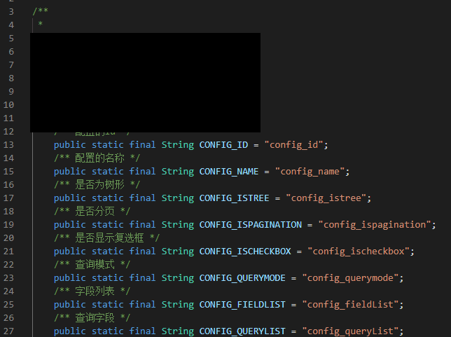
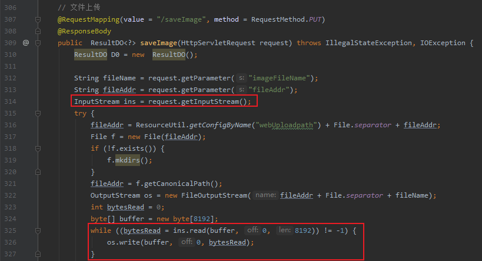
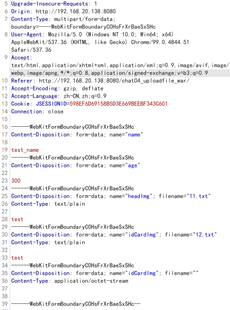
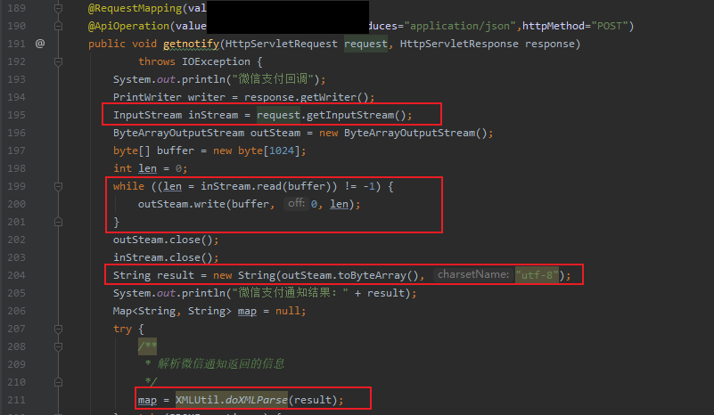

## CodeQL 提升篇之路由收集

- - -

### [0x00 Spring MVC](#toc_0x00-spring-mvc)

在上篇文章[CodeQL 提升篇](https://tttang.com/archive/1415/)介绍了 CodeQL 的更多细节内容，而本篇带来的是如何使用 CodeQL 来获取应用的路由信息（目前适用 SpringMVC）。  
对于实现这块的想法来源主要是阅读了 xsser 和楼兰的文章 (相关文章链接在本文末尾)，目前已将功能实现并考虑了更多可能出现的场景，尽量做到可以获取正确请求内容。

用途：  
1\. 提取出来后可以直接扔给 xray 或者结合类似洞态 IAST 扫描  
2\. 在使用 CodeQL 检测漏洞得到 path 之后可以更加快获取到路由信息方便测试  
3\. 可以收集作指纹检测  
4\. 可以通过批量访问快速检测出哪些请求是可以不经过身份验证的，以重点关注这些方便挖掘前台漏洞  
5\. 等等（主要看使用者）

路由信息主要由以下几部分组成：请求方法类型、请求路径、请求参数、请求头。那么开始依次介绍如何获取以上内容。

### [0x01 参数的提取](#toc_0x01)

#### [注解中定义请求参数名](#toc_)

[](https://storage.tttang.com/media/attachment/2022/03/28/c5a4b918-6207-4b84-b871-5e81ae083aee.png)

当使用了`@RequestParam`注解，并且在`value`中定义了值，那么该值就应该是获取的参数名的标准。  
实现就只要获取`value`值，其不为空即可

```bash
string getRequestParam(Method m){
    exists(Parameter p, Expr e, Annotation a | 
        p = m.getAParameter()
        and a = p.getAnAnnotation()
        and a.getType().hasQualifiedName("org.springframework.web.bind.annotation", "RequestParam")
        and e = a.getValue("value")
        and e.getParent().toString() = "RequestParam"
        and e.toString() != "\"\""
        and result = e.toString()
    )
}
```

#### [从 controller 方法体中获取参数](#toc_controller)

这里指定`request`对象类型是`ServletRequest`或其子类，调用方法为`getParameter`，返回值为`getParameter`方法第一个参数

```bash
string getFuncBlockParam(Method m){
    exists(Parameter p, MethodAccess ma, Interface interface | 
        p = m.getAParameter()
        and interface.getAnAncestor().hasQualifiedName("javax.servlet", "ServletRequest")
        and ma.getMethod().overridesOrInstantiates*(interface.getAMethod())
        and ma.getMethod().hasName("getParameter")
        and ma.getCaller() = m
        and ma.getQualifier() = p.getAnAccess()
        and result = ma.getArgument(0).toString()
    )
}
```

当`request.getParameter`的参数传入的是静态变量，其中已经硬编码配置好参数名的情况  
[](https://storage.tttang.com/media/attachment/2022/03/28/d4e5f984-ee3b-4fad-972b-e618f806c76a.png)

又或者是从某个对象中获取，内容不是已经确定好的，是不能够完成这种情况，只有在代码中已经硬编码好参数名的情况才能收集  
[](https://storage.tttang.com/media/attachment/2022/03/28/07c613a4-bf58-4ae6-8f91-5a853a0867c1.png)

这里使用官方的`CompileTimeConstantExpr`，它可以很方便的解决我们当前这种问题，能够完成硬编码变量和字符串拼接的情况。

```bash
string getFuncBlockParam(Method m){
    exists(Parameter p, MethodAccess ma, Interface interface | 
        p = m.getAParameter()
        and interface.getAnAncestor().hasQualifiedName("javax.servlet", "ServletRequest")
        and ma.getMethod().overridesOrInstantiates*(interface.getAMethod())
        and ma.getMethod().hasName("getParameter")
        and ma.getCaller() = m
        and ma.getQualifier() = p.getAnAccess()
        and result = ma.getArgument(0).(CompileTimeConstantExpr).getStringValue()
    )
}
```

#### [请求参数封装在 entity 对象中](#toc_entity)

首先先将其他类型参数确定好规则，也就是`int`、`string`等类型参数。然后其他类型则可能是 entity 类中从中获取，但还要从中区分情况，一般哪些属性存在 setter 方法则参数为这些属性名，但偶尔也会出现特殊情况，比如存在有参构造函数，将传入参数赋值给某个属性，那么该参数则为请求参数之一。  
比如下面`Entity1`类中存在 2 个请求参数`newshop`、`scheme`。

```bash
public class Entity1 {
    private String scheme;
    private String ssp;
    private String newshop;

    public Entity1(String newshop){
        this.newshop = newshop;
    }

    public String getNewshop() {
        return newshop;
    }

    public String getScheme() {
        return scheme;
    }

    public void setScheme(String scheme) {
        this.scheme = scheme;
    }
}
```

如果要更加准确请求参数，那么需要关注构造方法中传入的参数名而不应该是赋值的属性名，setter 方法也是如此（一般来说很少会有开发这样不规范编写），如下面案例所示：  
那么这里请求参数应该是`shop`、`sc`

```bash
public class Entity1 {
    private String scheme;
    private String ssp;
    private String newshop;

    public Entity1(String shop){
        this.newshop = shop;
    }

    public String getNewshop() {
        return newshop;
    }

    public String getScheme() {
        return scheme;
    }

    public void setSc(String sc) {
        this.scheme = sc;
    }
}
```

那么 ql 的代码编写如下，没有为上面那些特殊情况进行判断。  
`fw`表示赋值字段的表达式，`getRHS`表示该表达式中=右侧部分；将其和构造方法中参数调用的表达式比较，如果相等说明构造方法的参数是用来赋值给类字段的。  
第二个谓词则是根据存在 setter 方法获取参数

```bash
string getEntityConstructorParam(Constructor cs, FieldWrite fw){
    ((fw.getRHS().(ExprParent).(Expr) = cs.getAParameter().getAnAccess() or
    fw.getRHS().(ExprParent).(Expr).getAChildExpr() = cs.getAParameter().getAnAccess() or
    fw.getRHS().(ExprParent).(Expr).getAChildExpr().getAChildExpr() = cs.getAParameter().getAnAccess() or
    fw.getRHS().(ExprParent).(Expr).getAChildExpr().getAChildExpr().getAChildExpr() = cs.getAParameter().getAnAccess())
    )
    and result = fw.getField().toString()
}

string getEntitySetterParam(Class c, Field f){
    exists( SetterMethod sm| sm.isPublic() and c.getAMethod() = sm and
    sm.getName().toLowerCase().substring(3, sm.getName().length()) = f.getName().toLowerCase() and
    sm.getName().matches("set%") and result = f.toString())
}
```

如果参数类型不是基本类型或者字符类型则可能是 entity 类那么就调用`getEntityConstructorParam`、`getEntitySetterParam`谓词  
非 entity 类则判断是否存在`@RequestParam`注解并且为空，参数类型也不是 request 等则直接确认其为请求参数

```bash
Annotation getParamAnAnnotation(Parameter p){
    result  = p.getAnAnnotation()
    and result.getValue("value").toString() = "\"\""
    and not result.toString() = "RequestParam"
    and not result.toString() = "MatrixVariable"
    and not result.toString() = "PathVariable"
}

string getFuncParam(Method m){
(
    exists(Parameter p |  p = m.getAParameter() and
    (
        if not p.getType() instanceof PrimitiveType and not p.getType() instanceof BoxedType and not p.getType() instanceof NumberType and not p.getType().toString() = "String"
        then
            exists(Class c |
                c = p.getType() and
                if not c.fromSource()
                then result = getNotFromSourceParam(c)
                else
                    exists(Field f, FieldWrite fw, Constructor cs |
                        c = p.getType() and f = c.getAField() and cs = c.getAConstructor() and fw.getField() = f and
                        if fw.getEnclosingCallable().getName() = cs.getName()
                        then result = getEntityConstructorParam(cs, fw)
                        else result = getEntitySetterParam(c, f)
                    )
            )
        else (
            if not p.hasAnnotation()
            then result = p.toString() and not p.getType().hasName(["HttpServletRequest", "HttpServletResponse"])
            else p.getAnAnnotation() = getParamAnAnnotation(p) and result = p.toString())
    )
)
)
}
```

当 entity 类不在源码当中时则会调用到当前谓词，因为有的项目通过 MAVEN 创建的数据库其中 jar 包是没有源码的，那么这种 entity 类没办法通过正常途径获取，因为获取不到`private`修饰的字段、函数中的语句  
那么这里只能粗略的根据 setter、getter 获取到字段名、其返回类型都是相同，并且通过污点跟踪找到有调用到该字段的 getter 方法，那么可以确认存在该参数

```bash
string getNotFromSourceParam(Class c){
    exists(Method m, Method setM, Method getM, string fieldName,EntityParamTaintConfig ecfg,DataFlow::Node globalSource, DataFlow::Node globalSink |
        m.getParameter(0).getType() = c and not c.fromSource()
        and c.getAMethod() = setM and c.getAMethod() = getM
        and setM.getName().matches("set%")
        and getM.getName().matches("get%")
        and setM.getName().toLowerCase().substring(3, setM.getName().length()) = getM.getName().toLowerCase().substring(3, getM.getName().length())
        and setM.getAParamType() = getM.getReturnType()
        and fieldName = setM.getName().substring(3, 4).toLowerCase() + setM.getName().substring(4, setM.getName().length())
        and result = fieldName
        and ecfg.hasFlow(globalSource, globalSink)
        and globalSource.asParameter().getType() = globalSink.asExpr().(MethodAccess).getQualifier().getType()
        and globalSink.asExpr().(MethodAccess).getMethod() = getM
    )
}

class EntityParamTaintConfig extends TaintTracking::Configuration {
    EntityParamTaintConfig() { this = "EntityParamTaintConfig" }

    override predicate isSource(DataFlow::Node source) {
         source instanceof RemoteFlowSource
        and not source.asParameter().getType() instanceof PrimitiveType and not source.asParameter().getType() instanceof NumberType and not source.asParameter().getType().toString() = "String" and not source.asParameter().getType() instanceof BoxedType
    }

    override predicate isSink(DataFlow::Node sink) {
        exists(MethodAccess ma | 
            sink.asExpr() = ma
            and ma.getQualifier().getType() = sink.getEnclosingCallable().getAParameter().getType()
            )
    }

    override predicate isAdditionalTaintStep(DataFlow::Node src, DataFlow::Node sink){
        exists(MethodAccess ma |
            (ma.getMethod() instanceof GetterMethod or ma.getMethod() instanceof SetterMethod or ma.getMethod().getName().matches("get%") or ma.getMethod().getName().matches("set%"))
            and
             src.asExpr() = ma.getQualifier()
            and sink.asExpr() = ma
            )
    }
}
```

> 以上的规则是没有考虑是否存在 setter 方法名和属性名不一致使用注解的情况、也没有深入到流中确定哪些属性有 getter 调用减少获取无用的参数

#### [在某个调用链中获取参数](#toc__1)

使用全局污点跟踪，将参数依次提取出，目前是考虑了 request 对象  
定义全局污点跟踪`ParamTaintConfig`，source 为 spring controller 的方法，sink 为`RemoteFlowSource`，并且添加了`isAdditionalTaintStep`将 setter 和 getter 连接起来避免中断

```bash
class ParamTaintConfig extends TaintTracking::Configuration {
    ParamTaintConfig() { this = "ParamTaintConfig" }

    override predicate isSource(DataFlow::Node source) {
        exists(SpringControllerMethod scm | 
            scm = source.asExpr().getEnclosingCallable()
            )
        }

    override predicate isSink(DataFlow::Node sink) {
      sink instanceof RemoteFlowSource
    }

    override predicate isAdditionalTaintStep(DataFlow::Node src, DataFlow::Node sink){
        exists(MethodAccess ma |
            (ma.getMethod() instanceof GetterMethod or ma.getMethod() instanceof SetterMethod or ma.getMethod().getName().matches("get%") or ma.getMethod().getName().matches("set%"))
            and
             src.asExpr() = ma.getQualifier()
            and sink.asExpr() = ma
            )
    }
}
```

通过污点追踪找到参数，`getParameter`方法的第 1 个就是了，和前面一样需要考虑其为普通字符串文本还是调用变量硬编码的情况

```bash
string getFlowParam(Method m){
    exists(ParamTaintConfig cfg, DataFlow::Node source, DataFlow::Node sink, MethodAccess ma, Expr e |
         cfg.hasFlow(source, sink)
        and source.asExpr().getEnclosingCallable() = m
        and ma.getMethod().hasName("getParameter")
        and ma = sink.asExpr().(MethodAccess)
        and not sink.asExpr().getEnclosingCallable() = m
        and result = ma.getArgument(0).(CompileTimeConstantExpr).getStringValue()
        )
    )
}
```

#### [文件上传](#toc__2)

> MultipartFile

当参数类型为`MultipartFile`时进行处理：`@RequestParam("file1") MultipartFile f1`  
查询规则：

```bash
string getRequestParam(Method m){
    exists(Parameter p, Expr e, string paramValue | 
        p = m.getAParameter() and
        e = p.getAnAnnotation().getValue("value")
        and e.getParent().toString() = "RequestParam"
        and ((
            e.toString() != "\"\""
            and not p.getType().hasName("MultipartFile")
            and stringParamValue(p.getType()) = paramValue
            and result = p.toString() + "_" + p.getType().getName() + "=" + paramValue
        ) or (
            // p.getType().hasName("MultipartHttpServletRequest")
            e.toString() = "\"\""
            and paramValue = p.getType().getName()
            and paramValue = "MultipartFile"
            and result = p.toString() + "_Multipart" + "=filename.jpg"
        ) or (
            // p.getType().hasName("MultipartHttpServletRequest")
            e.toString() != "\"\""
            and paramValue = p.getType().getName()
            and paramValue = "MultipartFile"
            and result = e.(CompileTimeConstantExpr).getStringValue() + "_Multipart" + "=filename.jpg"
        )
        )
    )
}
```

> `MultipartHttpServletRequest`

如下使用`MultipartHttpServletRequest`

```bash
MultipartHttpServletRequest multipartRequest = (MultipartHttpServletRequest) request;
Map<String, MultipartFile> fileMap = multipartRequest.getFileMap();
for (Map.Entry<String, MultipartFile> entity : fileMap.entrySet()) {
    MultipartFile file = entity.getValue();// 获取上传文件对象
}
```

查询规则：

```bash
string getFuncBlockParam(Method m){
    // m instanceof SpringRequestMappingMethod and
    // (
    exists(Parameter p, MethodAccess ma | 
        (p = m.getAParameter() and p.getType().getName().toLowerCase().indexOf("request") > -1
        and ma.getMethod().hasName("getParameter") and ma.getCaller() = m and ma.getQualifier() = p.getAnAccess()
        and result = ma.getArgument(0).(CompileTimeConstantExpr).getStringValue() + "_String=test"
        )
    )
    or 
    exists(TypeAccess ta | 
        // m.hasName("importExcel")
        // and m.getDeclaringType().hasQualifiedName("com.zzjee.tms.controller", "TmsMdDzController")
        ta.getEnclosingCallable() = m
        and ta.getType().hasName("MultipartHttpServletRequest")
        and result = "ParamIsRandom_Multipart=filename.jpg"
    )
}
```

> `request.getParts`方法

使用`request.getParts()`方法进行文件上传

```bash
exists(MethodAccess ma, Interface interface |
    // m.hasName("upload5")
    interface.hasQualifiedName("javax.servlet.http", "HttpServletRequest")
    and ma.getEnclosingCallable() = m
    and ma.getMethod().hasName("getParts")
    and ma.getMethod().hasNoParameters()

    and ma.getQualifier().getType() = interface
    and ma.getMethod().overridesOrInstantiates*(interface.getAMethod())
    and result = "ParamIsRandom_Multipart=filename.jpg"
)
```

当然，上面这些都需要处理像在 entity 类中获取参数的情况，代码就不再列举了。

#### [InputStream](#toc_inputstream)

有的直接通过调用`request.getInputStream()`进行写文件，或者是反序列化也可能直接通过该方式  
[](https://storage.tttang.com/media/attachment/2022/03/28/e0a2f6be-0d83-4d27-adfc-481f1493abc7.png)

从方法体中获取

```bash
exists(Parameter p, MethodAccess ma, Interface interface | 
    p = m.getAParameter()
    and interface.hasQualifiedName("javax.servlet", "ServletRequest")
    and ma.getMethod().overridesOrInstantiates*(interface.getAMethod())
    and  (
        (ma.getMethod().hasName("getParameter") and ma.getCaller() = m and ma.getQualifier() = p.getAnAccess()
        and result = ma.getArgument(0).(CompileTimeConstantExpr).getStringValue() + "_String=test")
        or (ma.getMethod().hasName("getInputStream") and ma.getCaller() = m and ma.getQualifier() = p.getAnAccess()
            and ma.getMethod().hasNoParameters() 
            and result = "ParamIsRandom_InputStream=test")
    )
)
```

#### [其他可能出现的类型参数](#toc__3)

> Enum 枚举类

比如这里有个 Entity 类，其中有个字段`inquiry`其类型为`InquiryType`  
[](https://storage.tttang.com/media/attachment/2022/03/28/331950ac-8979-4bb4-924f-d1b7a90c6a08.png)

而`InquiryType`类是一个枚举类，那么请求参数`inquiry`值则为`comment`、`feedback`、`suggestion`其中之一  
[](https://storage.tttang.com/media/attachment/2022/03/28/b36cd17f-452a-4a45-b5cb-aa3ee2e7395c.png)

代码编写：  
首先定义一个谓词，用来返回所有符合的字段名称

```bash
string getEnumField(Class c){
    exists(Field f | 
    c instanceof EnumType
    and f = c.getAField()
    and f.getType().(RefType) = c
    and result = f.getName()
    )
}
```

将枚举类型的字段名通过`/`进行拼接

```bash
exists(Class c |
    p.getType() = c
    and c instanceof EnumType
    and paramValue = concat(string i| i in [getEnumField(c)] | i, "/")
    and result = p.toString() + "_Enum=" + paramValue
)
```

最后返回结果类似如下：  
[](https://storage.tttang.com/media/attachment/2022/03/28/4c680fc3-d12a-4eb3-bc0d-971f0c9914c8.png)

> Date

当定义`Date`类型参数如下，`da`参数格式为`2022/11/11 11:11:11`，`da1`参数格式为`2022-11-11 11:11:11`，`da2`参数格式为`2022/11/11 11:11:11`，

```bash
@RequestMapping("/requestparam/test5")
public String test5(@DateTimeFormat(iso= DateTimeFormat.ISO.DATE, pattern = "yyyy/MM/dd HH:mm:ss")Date da,
                    @DateTimeFormat(iso= DateTimeFormat.ISO.DATE, pattern = "yyyy-MM-dd HH:mm:ss")Date da1,
                    Date da2) {
    return (da.toString() + "\r\n" + da1.toString() + "\r\n" + da2.toString() + "\r\n" + da3.toString() + "\r\n" + da4.toString());
}
```

最后编写代码如下：

```bash
bindingset[bool]
string paramDateParse(Type t, Annotation a, boolean bool){
    (
        a.toString() = "DateTimeFormat"
        and a.getValue("pattern").(CompileTimeConstantExpr).getStringValue().matches("yyyy/MM/dd%")
        and result = "_Date=2022/11/11 11:11:11"
    // ) or exists(Annotation a | a = p.getAnAnnotation()
    ) or (
        a.toString() = "DateTimeFormat"
        and a.getValue("pattern").(CompileTimeConstantExpr).getStringValue().matches("yyyy-MM-dd%")
        and result = "_Date=2022-11-11 11:11:11"
    // ) or exists(Annotation a | a = p.getAnAnnotation()
    ) or (
        a.toString() = "DateTimeFormat"
        and a.getValue("pattern").toString() = "\"\""
        and result = "_Date=2022-11-11 11:11:11"
    // ) or exists(Annotation a | t.(RefType).hasQualifiedName("java.util", "Date")
    ) or (t.(RefType).hasQualifiedName("java.util", "Date")
        // and not a.toString() = "DateTimeFormat"
        and bool = true
        and result = "_Date=2022/11/11 11:11:11"
    )
}
```

> Map、List、数组 (String\[\])

这里用到了`stringParamValue`谓词这是自定义的一个，主要是传入基本等类型然后返回一个默认值。  
数组使用到`Array`来处理；当`Map`和`List`使用到泛型的情况则使用`ParameterizedType`

```bash
bindingset[param]
string paramParse(Type t, string param){
    (
        // String[]等数组类型
        result = param + "_Array_" + t.(Array).getElementType().getName() + "=" + stringParamValue(t.(Array).getElementType())
    ) or (
        t.(ParameterizedType).getGenericType().getAnAncestor().getSourceDeclaration().hasQualifiedName("java.util", "List")
        and result = param + "_List_" + t.(ParameterizedType).getTypeArgument(0).getName() + "=" + stringParamValue(t.(ParameterizedType).getTypeArgument(0))
    ) or (
        t.(ParameterizedType).getGenericType().getAnAncestor().getSourceDeclaration().hasQualifiedName("java.util", "Map")
        and result = param + "_Map[" + stringParamValue(t.(ParameterizedType).getTypeArgument(0)) + "]_" + t.(ParameterizedType).getTypeArgument(1).getName() + "=" + stringParamValue(t.(ParameterizedType).getTypeArgument(1))

    ) or (t.(RefType).getAnAncestor().getSourceDeclaration().hasQualifiedName("java.util", "List")
        and not t.(ParameterizedType).getGenericType().getAnAncestor().getSourceDeclaration().hasQualifiedName("java.util", "List")
        and result = param + "_List_String=test"
    ) or (t.(RefType).getAnAncestor().getSourceDeclaration().hasQualifiedName("java.util", "Map")
        and not t.(ParameterizedType).getGenericType().getAnAncestor().getSourceDeclaration().hasQualifiedName("java.util", "Map")
        and result = param + "_Map_String=test"
    )
}
```

> `WebRequest`、`NativeWebRequest`

除了常见的`HttpServletRequest`还有以上 2 个，而`NativeWebRequest`是`WebRequest`子类。  
在代码中直接使用`getAnAncestor`谓词检测是否是`ServletRequest`、`WebRequest`继承关系

```bash
ma.getQualifier().getType().(RefType).getAnAncestor().getSourceDeclaration().hasQualifiedName("javax.servlet", "ServletRequest")
or ma.getQualifier().getType().(RefType).getAnAncestor().hasQualifiedName("org.springframework.web.context.request", "WebRequest")
```

> `InputStream`、`Reader`

也是检测字段/参数类型是否为`InputStream`、`Reader`

```bash
(
    t.(RefType).getAnAncestor().getSourceDeclaration().hasQualifiedName("java.io", "InputStream")
    and result = "ParamIsRandom_InputStream=test"
) or (
    t.(RefType).getAnAncestor().getSourceDeclaration().hasQualifiedName("java.io", "Reader")
    and result = "ParamIsRandom_Reader=test"
)
```

#### [ModelAttribute](#toc_modelattribute)

在同一个类中`populateModel`方法使用了`@ModelAttribute`注解，并且其参数使用了`@RequestParam`注解，那么访问 **/requestparam/test8** 则必须带上`aaa`参数。  
或者`NModel`方法中没有使用了`@RequestParam`注解，但是在`test1`方法中会从`model`对象中获取`attributeNameb`属性，那么是有必要传入参数`b`的

```bash
@ModelAttribute
public void populateModel(@RequestParam String aaa, Model model) {
    model.addAttribute("attributeName", aaa);
}

@RequestMapping("/requestparam/test8")
public String test() {
    return "123";
}

@ModelAttribute
public void NModel(String b, Model model) {
    model.addAttribute("attributeNameb", b);
}

@RequestMapping("/requestparam/test9")
public String test1(Model model) {
    return model.get("attributeNameb");
}
```

代码编写：

```bash
string getRequestParamModelAttribute(Method m){
    exists(Method newM |
        newM = m.getDeclaringType().getAMethod()
        and not newM = m
        and newM.getAnAnnotation().getType().hasQualifiedName("org.springframework.web.bind.annotation", "ModelAttribute")
        // 只有当当前方法有定义 Model 类型的参数或者其子类，那么可能存在从 Model 中获取属性则有必要获取请求参数
        // 另一种情况是使用 ModelAttribute 注解的方法其中参数有使用到 RequestParam 注解那么必须获取该参数作为请求参数
        and (exists(Type t | t = m.getAParamType() and t.(RefType).getAnAncestor().hasQualifiedName("org.springframework.ui", "Model"))
            or newM.getAParameter().getAnAnnotation().getType().hasQualifiedName("org.springframework.web.bind.annotation", "RequestParam"))
        and (result = getRequestParam(newM)
            or result = getFuncParam(newM)
            or result = getFuncBlockParam(newM)
            or result = getFlowParam(newM)
        )
    )
    // 在当前方法的类中没有使用到 ModelAttribute 注解定义的方法，则使用默认谓词
    or result = getRequestParam(m)
}
```

注：注解为`@RequestAttribute`时，该参数则不作为请求参数传入

#### [为请求参数设置默认值](#toc__4)

首先定义一个谓词，为各种类型设置默认值，比如`int`则为 0，`String`则为`test`

```bash
/**
* 设置参数不同数据类型的默认值，设置了基本类型、String、StringBuilder、StringBuffer、BigInteger 等类型
*/
string stringParamValue(Type type){
    exists(BoxedType boxedType, PrimitiveType primitiveType, string value|
    (
        ((type = primitiveType or (type = boxedType and boxedType.getPrimitiveType() = primitiveType))
            and value = getADefaultValue(primitiveType).toString())
        or (type.hasName(["StringBuilder", "StringBuffer", "String", "StringJoiner"]) and value = "test")
        or (type.hasName(["BigInteger", "BigDecimal"]) and value = "0")
    )
    // and m instanceof SpringControllerMethod
    and result = value
    )
}
```

比如为`getRequestParam`谓词收集的参数设置默认值

```bash
string getRequestParam(Method m){
    exists(Parameter p, Expr e, string paramValue | 
        p = m.getAParameter() and
        e = p.getAnAnnotation().getValue("value")
        and e.getParent().toString() = "RequestParam"
        and e.toString() != "\"\"" 
        and stringParamValue(p.getType()) = paramValue
        and result = p.toString() + "_" + p.getType().getName() + "=" + paramValue
    )
}
```

### [0x02 请求路径](#toc_0x02)

主要讲下 RESTful API 的情况，会使用到 PathVariable/MatrixVariable 注解。  
`@PathVariable`注解：绑定映射注解中的 URL 占位符的值并赋给方法参数，占位符使用`{}`格式。也支持带条件的 URL 参数正则，比如`"/sex/{sex:M|F}"`，这种情况不考虑，或者以后有时间再完善  
`@MatrixVariable`注解可以通过`name`、`value`来定义参数名，如果不定义则默认使用方法参数，并且`name`、`value`不能同时存在。  
`pathVar`用来绑定路径变量的名称

当比较复杂的情况就是像下面：**/entity4/path1Int;bb=aaValue/path2String;cc=ccValue;ee=eeValue/path3String**

```bash
@GetMapping("/entity4/{path1}/{path2}/{path3}")
public String entity(@PathVariable Integer path1, @PathVariable String path2, @PathVariable String path3, @MatrixVariable(name="bb", pathVar="path1") String aa, @MatrixVariable(value="cc") String dd, @MatrixVariable String ee) throws IOException, ClassNotFoundException {
    System.out.println(aa);
    System.out.println(dd);
    System.out.println(ee);
    return "path1";
}
```

这一块我在 ql 中编写处理了很久，因为 ql 不太擅长这种复杂的模式

这里先获取请求路径赋值给`pathstring`，绑定的方法参数名赋值给`pathVar`

```bash
string getMethodMappedPath(){
    // this.hasName("pathVars") and
    exists(Annotation a, Parameter p, string pathstring | 
        a = getAnAnnotation() and a.getType() instanceof SpringRequestMappingAnnotationType
        and pathstring = a.getValue(["value","path"]).(CompileTimeConstantExpr).getStringValue() 
        and if pathstring.indexOf("{") > -1
        then
            exists(string pathVar |  
                p = this.getAParameter()
                and p.getAnAnnotation().toString() = "PathVariable"
                and pathVar = p.toString()
                // 这里会调用方法处理存在MatrixVariable注解的情况
                and getMatrixVariableParam(pathstring, pathVar) = result
            )
        else
            result = pathstring
    )
}
```

处理`MatrixVariable`注解，两种情况一个有使用`pathVar`和不使用的，不使用`pathVar`其默认值是`"\n\t\t\n\t\t\n\ue000\ue001\ue002\n\t\t\t\t\n"`，并且参数是可以随意跟在任何路径后面，这种情况则是在名称后面加上`^^^`来进行区分

```bash
bindingset[pathstring, pathVar]
string getMatrixVariableParam(string pathstring, string pathVar){
    exists(Parameter p, Method m| 
        m = this and 
        p = m.getAParameter()
        and if m.getAParameter().getAnAnnotation().toString() = "MatrixVariable"
        then
            // 使用MatrixVariable注解，pathVar和传入的pathVar匹配
            (exists(Expr e, Annotation annotation | 
                p.getAnAnnotation().getValue("pathVar").(CompileTimeConstantExpr).getStringValue() = pathVar
                and e.getParent().toString() = "MatrixVariable"
                and e.getEnclosingCallable() = m
                and ((e = p.getAnAnnotation().getValue(["value", "name"])
                    and e.toString() != "\"\""
                    and result = pathstring.replaceAll("{" + pathVar + "}", pathVar + "_Param" + ";" + e.(CompileTimeConstantExpr).getStringValue())
                ) or (result = pathstring.replaceAll("{" + pathVar + "}", pathVar + "_Param" + ";" +  p.toString())
                    and annotation = p.getAnAnnotation()
                    and annotation.toString() = "MatrixVariable"
                    and "" = annotation.getValue("value").(CompileTimeConstantExpr).getStringValue()
                    and "" = annotation.getValue("name").(CompileTimeConstantExpr).getStringValue()
                    )
                    )
                )
            // 处理当使用MatrixVariable注解但没有通过pathVar指定PathVariable绑定的变量，则通过如下方式处理，标记^^^
            // 因为这种情况比较特殊，可以跟在当前任一路径点后面作为参数
            ) or (exists(Annotation annotation | 
                result = pathstring.replaceAll("{" + pathVar + "}", pathVar + "_Param" + ";"+  p.toString() + "^^^")
                and not annotation.getValue("pathVar").toString().regexpFind("[a-zA-Z0-9]+", _, _) = ""
                and not m.getAParameter().getAnAnnotation().getValue("pathVar").(CompileTimeConstantExpr).getStringValue() = pathVar
                and "" = annotation.getValue("value").(CompileTimeConstantExpr).getStringValue()
                and "" = annotation.getValue("name").(CompileTimeConstantExpr).getStringValue()
                and annotation = p.getAnAnnotation()
                and annotation.toString() = "MatrixVariable"
                )
            )
        else
            // 不存在MatrixVariable注解时，{}占位的路径名添加_Param标记
            result = pathstring.replaceAll("{" + pathVar + "}", pathVar + "_Param")
    )
}
```

这里对请求路径进行处理

```bash
string gethandlePath(){
    exists(string d |  
    concat(string i| i in [getMethodMappedPath()] | i.toString() , "&") = d
    and if (d.indexOf("_Param") > -1 and d.indexOf("{") > -1) or(d.indexOf("_Param") > -1 and d.indexOf("^^^") > -1)
    then
        // 如果存在 PathVariable/MatrixVariable 注解的情况会进入这里
        if d.indexOf("^^^") > -1 and not d.indexOf("{") > -1
        then
            // 如果只有 MatrixVariable 并且没有指定 pathVar 则把^^^特征剔除掉
            result = gethandleMVNo(d)
        else
            exists(string newb, string g2, string c, string d1, string pp11, string out |
                concat(string i| i in [gethandleMVNo(d)] | i.toString() , "&") = out
                and pp11 = out.splitAt("&")
                and newb = any(pp11.regexpFind("\\{([a-zA-Z0-9]+)\\}", _, _))

                and ((out.indexOf(";") > -1
                    and g2 = any(string aa | 
                        aa =  [out.splitAt("&")]
                        | aa.regexpFind(newb.substring(1, newb.length() -1)  + "_Param"+ ";([;a-zA-Z0-9=]+)", _, _)
                        )
                ) or (not out.indexOf(";") > -1
                and g2 = any(string aa | 
                    aa =  [out.splitAt("&")]
                    | aa.regexpFind(newb.substring(1, newb.length() -1)  + "_Param", _, _)
                        )
                    ))

                and c = pp11.regexpFind("\\{([a-zA-Z0-9]+)\\}", _, _)
                and c = "{" + g2.substring(0, c.length()-2) + "}"
                and d1 = pp11.replaceAll(c, g2)
                and result = d1
            )
    else
        //直接返回
        result = d
    )
}

bindingset[d]
string gethandleMVNo(string d){
    if d.indexOf("^^^") > -1
    then
    exists(string b,  string dd, string t, string copyd, string groupd ,string pp11 | 
        b = concat(string i| i in [d.regexpFind(";([a-zA-Z0-9=]+\\^\\^\\^)", _, _)] | i.toString() , "&&")
        and groupd=b.replaceAll("&&", "").replaceAll("^^^", "")
        and (dd.indexOf("&&") > -1 or not dd.indexOf("^^^") > -1)
        and t in [d.splitAt("&")] and  dd =t.replaceAll(b.splitAt("&&"), groupd)
        and copyd = d.replaceAll(b.splitAt("&&"), groupd).replaceAll(b.splitAt("&&"), groupd).replaceAll(b.splitAt("&&"), groupd)
        and not copyd.indexOf("^^^") > -1
        and exists(int ii, string newop | 
            min(copyd.indexOf(groupd)) =ii
            and exists(string x, int x1, int x2 | x in [copyd.splitAt("&")] and copyd.indexOf(x) = x1 
            and x.indexOf(groupd) = x2 and ii = x2+x1 and x = newop)

            and (newop = pp11 or (dd.replaceAll(groupd, "")=pp11 and pp11 != newop.replaceAll(groupd, "")))
        )
        and result = pp11
    )
    else
        result = d
}
```

这里会再次调用`gethandlePath`谓词，因为当出现多个`{path}`的时候，前面只能处理 2 个，这里再调用一次则处理 3 个，再多的情况不考虑了。如果需要，可以再添加一个方法调用当前方法

```bash
string gethandlePathTwo(){
    exists(string d |  
        concat(string i| i in [gethandlePath()] | i.toString() , "&") = d
        and if d.indexOf("_Param") > -1 and d.indexOf("{") > -1 
        then
        exists(string a , string b,  string g2, string c, string d1, string out| 
            concat(string i| i in [gethandleMVNo(d)] | i.toString() , "&") = out and
            a = concat(string i| i in [d] | i.toString() , "&").splitAt("&")
            and b = any(a.regexpFind("\\{([a-zA-Z0-9]+)\\}", _, _))
            and ((out.indexOf(";") > -1
                and g2 = any(string aa | 
                    aa =  [out.splitAt("&")]
                    | aa.regexpFind(b.substring(1, b.length() -1)  + "_Param"+ ";([;a-zA-Z0-9=]+)", _, _)
                    )
            ) or (not out.indexOf(";") > -1
            and g2 = any(string aa | 
                aa =  [out.splitAt("&")]
                | aa.regexpFind(b.substring(1, b.length() -1)  + "_Param", _, _)
                    )
                ))

            and c = a.regexpFind("\\{([a-zA-Z0-9]+)\\}", _, _)
            and c = "{" + g2.substring(0, c.length()-2) + "}"
            and d1 = a.replaceAll(c, g2)
            and result = d1
        )
        else
            result = d
        )
}
```

### [0x03 请求方法](#toc_0x03)

从 mapping 注解中获取请求类型是什么，使用`GetMapping`则为`GET`请求类型，`RequestMapping`注解指定了`method`则再进行相应的判断，如果没有指定，则默认为其设置`GET/POST`

```bash
class RequestMethodType extends Method{
    RequestMethodType(){
        this instanceof Method
    }

    Class getController(){
        result = this.getDeclaringType()
    }

    string getControllerMethodType(){
        exists(Annotation a | a = getAnAnnotation() 
        and (((a.getValue(["method"]).toString().matches("%GET") or a.getValue(["method"]).getAChildExpr().toString().matches("%GET") or a.getType().toString() = "GetMapping") and result = "GET")
        or ((a.getValue(["method"]).toString().matches("%POST") or a.getValue(["method"]).getAChildExpr().toString().matches("%POST") or a.getType().toString() = "PostMapping") and result = "POST")
        or ((a.getValue(["method"]).toString().matches("%PUT") or a.getValue(["method"]).getAChildExpr().toString().matches("%PUT") or a.getType().toString() = "PutMapping") and result = "PUT")
        or ((a.getValue(["method"]).toString().matches("%DELETE") or a.getValue(["method"]).getAChildExpr().toString().matches("%DELETE") or a.getType().toString() = "DeleteMapping") and result = "DELETE")
        or (not "method" in [getAnnotationMethodName(a)] and a.getType().toString() = "RequestMapping" and result = "GET/POST")
        ))
    }

    /**
     * 用来筛选注解中有使用的参数名
    */
    string getAnnotationMethodName(Annotation a){
        exists(Expr e | 
         (e = a.getAValue("method") and result = "method")
         or (e = a.getAValue("value") and result = "value")
         or (e = a.getAValue("params") and result = "params")
         or (e = a.getAValue("headers") and result = "headers")
         or (e = a.getAValue("consumes") and result = "consumes")
         or (e = a.getAValue("produces") and result = "produces")
        )
    }

    string getMethodMethodType(){
        if
          getAnAnnotation().getType() instanceof SpringRequestMappingAnnotationType
        then
            exists(Annotation a | a = getAnAnnotation() 
            and (((a.getValue(["method"]).toString().matches("%GET") or a.getValue(["method"]).getAChildExpr().toString().matches("%GET") or a.getType().toString() = "GetMapping") and result = "GET")
            or ((a.getValue(["method"]).toString().matches("%POST") or a.getValue(["method"]).getAChildExpr().toString().matches("%POST") or a.getType().toString() = "PostMapping") and result = "POST")
            or ((a.getValue(["method"]).toString().matches("%PUT") or a.getValue(["method"]).getAChildExpr().toString().matches("%PUT") or a.getType().toString() = "PutMapping") and result = "PUT")
            or ((a.getValue(["method"]).toString().matches("%DELETE") or a.getValue(["method"]).getAChildExpr().toString().matches("%DELETE") or a.getType().toString() = "DeleteMapping") and result = "DELETE")
            or (not "method" in [getAnnotationMethodName(a)] and a.getType().toString() = "RequestMapping" and result = "GET/POST")
            ))
        else
          result = ""
      }

      string getMethodType(){
        result = getMethodMethodType() and
        if result = ""
        then result = getControllerMethodType()
        else result = result
      }
}
```

### [0x04 Content-Type](#toc_0x04-content-type)

获取 ContentType，如果函数参数有`RequestBody`注解则判定为 json，如果 Mapping 注解中存在`consumes`值并且不为空，则值为 content-type，其他情况则默认为`application/x-www-form-urlcoded`

```bash
class RequestContentType extends Method{
    RequestContentType(){
        // this instanceof SpringControllerMethod
        this instanceof Method
        // and this instanceof Method and this.hasName("callable")
    }


    /**
     * 获取ContentType，如果函数参数有RequestBody注解则判定为json
     * 如果Mapping注解中存在consumes值并且不为空，则值为content-type
     * 其他情况则默认为application/x-www-form-urlcoded
    */
    string getContentType(){
        (
            this.getAParameter().getAnAnnotation().toString()  = "RequestBody"
            and result = "Content-Type: application/json"
        ) or (
                    result = "Content-Type: " + this.getAnAnnotation().getValue("consumes").getAChildExpr().(CompileTimeConstantExpr).getStringValue().toLowerCase().trim()
                    or result = "Content-Type: " +  this.getAnAnnotation().getValue("consumes").(CompileTimeConstantExpr).getStringValue().toLowerCase().trim()
                )
        or (if this.getAnAnnotation().toString() = "GetMapping" or this.getAParameter().getAnAnnotation().toString() = "RequestBody"
            then result = ""
            else not exists(string contentType | 
                (
                    contentType = this.getAnAnnotation().getValue("consumes").getAChildExpr().(CompileTimeConstantExpr).getStringValue().toLowerCase().trim()
                    or contentType = this.getAnAnnotation().getValue("consumes").(CompileTimeConstantExpr).getStringValue().toLowerCase().trim()
                ) and contentType != ""
            ) and result = "Content-Type: application/x-www-form-urlcoded"
        )
    }
}
```

### [0x05 代码融合](#toc_0x05)

在参数中通过`concat`进行拼接，并对参数为空的情况下，使用`replaceAll`替换过滤掉，最后只要调用`getUrl`即可获取完整数据

```bash
string getParam(Method m){
    exists(string param | 
        param = "?" +
        concat(string i| i in [getRequestParamModelAttribute(m)] | i, "&")
        + "&" + concat(string i| i in [getFuncParam(m)] | i, "&")
        + "&" + concat(string i| i in [getFuncBlockParam(m)] | i, "&")
        + "&" + concat(string i| i in [getFlowParam(m)] | i, "&")
        and result = param.regexpReplaceAll("\\?&&&$", "").replaceAll("?&&", "?").replaceAll("?&", "?").replaceAll("&&", "").regexpReplaceAll("&$", "")
    )
}

string getPath(Method m) {
    exists(MappingMethod mm |
        result = mm.getMappedPath() and mm = m
        )
}

string getMethodType(Method m) {
    exists(RequestMethodType mm |
        mm = m and result = concat(string i| i in [mm.getMethodType()] | i, "/")
    )
}

string getContentType(Method m) {
    exists(RequestContentType mm |
        mm = m and result = concat(string i| i in [mm.getContentType()] | i, "&")
        )
}

string getUrl(){
    exists(SpringRequestMappingMethod m |
        result = getMethodType(m) + " " + getPath(m) + getParam(m) + " " + getContentType(m)
        )
}
```

### [0x06 最后结果产出处理](#toc_0x06)

[](https://storage.tttang.com/media/attachment/2022/03/29/77f61831-3fab-4b44-a662-cb2a65b1e465.png)

#### [请求类型](#toc__5)

存在`GET/POST`、`POST`、`GET`、`PUT`等，自行选择  
[](https://storage.tttang.com/media/attachment/2022/03/28/48195258-f958-4bb9-b841-cc96c4236806.png)

#### [请求路径](#toc__6)

请求路径大部分生成的没什么问题，可能存在问题的比如正则。这种则需要额外通过脚本处理  
[](https://storage.tttang.com/media/attachment/2022/03/28/97f74722-13b6-4a86-9390-b18cefb54378.png)

#### [参数](#toc__7)

`age_int=0`：参数名为`age`，类型为`int`，默认值设置为 0  
`ajaxRequest_boolean=true`：参数名为`ajaxRequest`，类型为`boolean`，默认值设置为`true`  
`inquiryDetails_String=test`：参数名为`inquiryDetails`，类型为`String`，默认值设置为`test`

```bash
POST /form/?age_int=0&ajaxRequest_boolean=true&inquiryDetails_String=test&name_String=test&phone_String=test&subscribeNewsletter_boolean=true Content-Type: application/x-www-form-urlcoded
```

`additionalInfo`参数为`Map`类型，其 key 默认设置为`test`并且参数值类型为 String。例如最后请求是 **?additionalInfo\[test\]=value**  
`inquiry`参数是`Enum`枚举类型，其值是`comment/feedback/suggestion`其中之一。例如最后请求是 **inquiry=comment**  
`birthDate`参数是`Date`类型，默认值为`2022-11-11 11:11:11`

```bash
POST /form/?additionalInfo_Map[test]_String=test&age_int=0&ajaxRequest_boolean=true&birthDate_Date=2022-11-11 11:11:11&currency_BigDecimal=0&inquiryDetails_String=test&inquiry_Enum=comment/feedback/suggestion&name_String=test&percent_BigDecimal=0&phone_String=test&subscribeNewsletter_boolean=true Content-Type: application/x-www-form-urlcoded
```

`path1`参数为`int`类型  
`bb`参数为`String`类型

```bash
GET /entity4/path1_Integer_Param;bb_String=test/path2_StringBuffer_Param;ee_String=test/path3_String_Param
```

#### [Content-Type](#toc_content-type)

大部分可以直接从结果中取，也有可以支持多种类型，json、xml 都能接收。在默认情况下 POST 请求类型默认设置的为`application/x-www-form-urlcoded`，文件上传的需要额外处理，下面章节有描述。

```bash
POST /entity4/path1?foo_String=test&fruit_String=test Content-Type: application/json&Content-Type: application/xml
```

#### [文件上传](#toc__8)

[](https://storage.tttang.com/media/attachment/2022/03/28/517fc71a-b2a0-49f2-b6d6-acb090eb8c2c.png)

参数有`age`：数字类型  
`headImg`：文件类型  
`idCardImg`：文件类型  
`name`：字符类型  
默认的`Content-Type`为`application/x-www-form-urlcoded`，需要检测参数是否存在`_Multipart`，存在则需要将`Content-Type`替换为上传类型`multipart/form-data`

```bash
GET/POST /upload4.do?age_Integer=0&headImg_Multipart=filename.jpg&idCardImg_Multipart=filename.jpg&name_String=test Content-Type: application/x-www-form-urlcoded
```

那么构造的请求则是如下：  
[](https://storage.tttang.com/media/attachment/2022/03/28/8c361d3a-7387-4e8b-87fe-793a7e3e4f59.png)

`ParamIsRandom`表示参数名为任意

```bash
GET/POST /upload3.do?ParamIsRandom_Multipart=filename.jpg&ParamIsRandom_Multipart=filename.jpg Content-Type: application/x-www-form-urlcoded
```

#### [InputStream 等](#toc_inputstream_1)

当参数存在`_InputStream`时，表明 body 内容为任意

```bash
PUT /tokens/saveImage?ParamIsRandom_InputStream=test&fileAddr_String=test&imageFileName_String=test Content-Type: application/x-www-form-urlcoded
```

当然也可能存在一些特殊情况，如下为 xml 格式，具体可以查询代码修改请求 body 内容  
[](https://storage.tttang.com/media/attachment/2022/03/28/9fdbb4bb-a9c6-4576-921c-a59a1557b6e0.png)

### [0x07 TODO](#toc_0x07-todo)

1.  `Mapping`注解中使用`headers`表示需要带上的 header 头
2.  `GetMapping`注解中使用`produces`表示 Context-Type 类型，可能需要添加该项
3.  `Mapping`注解中设置了`params`表示需要带上的参数名，可以没有值
4.  Date 类型目前只考虑了`@DateTimeFormat(iso=ISO.DATE)`
5.  Entity 类中实现`PathVariable`  
    RESTful 风格，在 Entity 类中绑定参数，  
    `java @GetMapping("dataBinding/{foo}/{fruit}") public String dataBinding(@Valid JavaBean javaBean, Model model){}`
6.  RESTful 风格，使用`PathVariable`等注解，目前可能存在问题，而且导致代码量较大，后期可能去除该项，直接取注解等信息然后通过 Python 额外处理
7.  参数存在`@Valid`注解对参数进行校验，将该类中在字段的注解定义了规范
8.  参数类型为`Map`则需要找到`Map.get`获取参数值的地方获取参数名（优先处理完成该项）
9.  setter 和构造函数传入参数和字段名不一致情况，是否需要考虑
10.  当接口的方法中使用`Mapping`等注解配置好，其实现类中再重写相应的方法，这种情况下实现类没有任何注解则需要额外考虑这种情况
11.  是否可以适用 Struts2

### [0x08 最后](#toc_0x08)

最终代码和文章中的会有出入，主要是希望按照层次来依次介绍，讲解下思路，具体可以阅读 Github 上的代码。  
代码已上传至 Github：[https://github.com/ice-doom/CodeQLRule](https://github.com/ice-doom/CodeQLRule)

楼兰：[CodeQL 与 XRay 联动实现黑白盒双重校验](https://mp.weixin.qq.com/s/iW7EGEAylqcltYgGo_KdvA)  
xsser：[CodeQL 静态代码扫描之实现关联接口、入参、和危险方法并自动化构造 payload 及抽象类探究](https://mp.weixin.qq.com/s/xrA1z3CoIHfPXFntlztOCQ)
