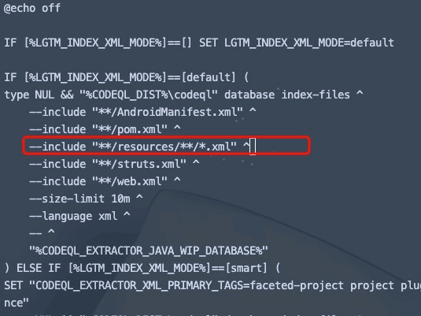

## CodeQL 踩坑指南 - Java

- - -

## [0x00 背景](#toc_0x00)

讲解这东西的大师傅们太多了，不班门弄斧了，这里仅针对一些踩过的坑点提供一些自己的解决方案，希望能对一些师傅提供点帮助。

## [0x01 坑 I - Lombok](#toc_0x01-i-lombok)

### [场景](#toc_)

在构建一些小型 cms 和自己的一些项目时，突然发现构建好的数据库内源码比实际的源码少了一大半，导致很多规则分析的 flow 直接断掉了，什么规则扫描结果都没有。

### [原因](#toc__1)

构建好的数据库文件夹下，源码是存放在 src.zip 下的。通过 vscode 的插件，将数据库添加后也可以看到构建加载后的源码。通过对比源码，发现丢失的 java 文件都存在 lombok 注解（@Data/@Sl4j)。  
[](https://storage.tttang.com/media/attachment/2022/03/22/338e9d2f-87cf-4c96-994b-a32855273fb0.png)

这里的原因就是由于项目使用了 lombok。根据官方[Github Issue](https://github.com/github/codeql/issues/8363)可得知，lombok 代码在编译期间使用注释处理器转换为正确的 Java 代码。这会干扰 CodeQL 分析器，该分析器会在源代码转换为有效的 Java 代码之前“查看”源代码，从而导致它跳过此类文件。

### [解决方案](#toc__2)

按照官方的思路，解决方式就是将所有文件还原为不使用 lombok 的方式。还原的方案主要有两种：

**1.通过 Lombok.jar 直接还原文件**

在官方的[Github Issue](https://github.com/github/codeql/issues/4984#:~:text=Unfortunately%20Lombok%20does%20not%20work%20with%20the%20CodeQL,the%20source%20files%20before%20running%20CodeQL%20as%20follows%3A)提供了一种方式。

下载项目对应版本的 lombok.jar(或者从 External Libraries 寻找下载好的依赖 jar 包)，运行：

`java -jar lombok.jar delombok . -d "delombok-code"`  
这会将当前目录下的所有使用了 lombok 的代码还原为不使用的状态，并存放在 delombok-code 这个目录下。

但是在实际测试中，这种方式不会对项目内关联的代码进行还原，比如自己定义的一些 TO 类，在这种方式的还原下只会被还原成 Object，而不是实际的 TO 对象。可能会对代码分析造成一定的影响。

**2\. 使用 maven-delombok**  
这种方式的好处在于可以在 maven build 的过程中来对 lombok 进行还原，可以很好的解决依赖关系，不会出现上述还原为未定义的 Object 的场景。

在 pom 文件内增加：

```bash
 <build>
        <plugins>
            <plugin>
                <groupId>org.projectlombok</groupId>
                <artifactId>lombok-maven-plugin</artifactId>
                <version>1.18.4.0</version>
                <executions>
                    <execution>
                        <phase>generate-sources</phase>
                        <goals>
                            <goal>delombok</goal>
                        </goals>
                        <configuration>
                            <encoding>UTF-8</encoding>
                            <addOutputDirectory>false</addOutputDirectory>
                            <sourceDirectory>src/main/java</sourceDirectory>
                            <outputDirectory>${project.basedir}/src/main/lombok</outputDirectory>
                        </configuration>
                    </execution>
                </executions>
            </plugin>
        </plugins>
</build>
```

由于将所有的还原 lombok 指向目录/src/main/lombok，所以在 maven 编译的时候，我们希望编译的是 lombok 还原后的目录，这样 codeql 才能够读取整个有效的过程，所以需要修改 sourceDirectory

```bash
<build>
        <sourceDirectory>${project.basedir}/src/main/lombok</sourceDirectory>
        ......
</build>
```

这里提供一个脚本，快速插入 lombok-plugins，将脚本放置项目根目录并运行`python3 delombok.py ./pom.xml`即可。

```bash
import os
import re
import subprocess
import xml.etree.ElementTree as ET
import sys

def delbankline(file):
    with open(file, 'r') as f:
        lines = [x for x in f.readlines() if not re.search(r'^\s+$', x)]
    with open(file, 'w') as fw:
        fw.writelines(lines)

def delombok(file):
    with open(file, 'r+') as f:
        lines = f.readlines()
        f.seek(0)
        f.truncate()
        for line in lines:
            # f.write(line.replace('src/main/java', 'src/main/lombok'))
            line = line.replace("<directory>${project.basedir}/src/main</directory>",
                                "<directory>${project.basedir}/src/main/lombok</directory>")
            line = line.replace('src/main/java', 'src/main/lombok')
            f.write(line)

    tree = ET.ElementTree()
    # 去掉ns0标签
    XML_NS_NAME = ""
    XML_NS_VALUE = "http://maven.apache.org/POM/4.0.0"
    ET.register_namespace(XML_NS_NAME, XML_NS_VALUE)
    tree.parse(file)
    root = tree.getroot()
    pre = (re.split('project', root.tag))[0]
    # 生成元素
    sourceDirectory = ET.Element("sourceDirectory")
    goal = ET.Element("goal")
    phase = ET.Element("phase")
    groupId = ET.Element("groupId")
    artifactId = ET.Element("artifactId")
    version = ET.Element("version")
    # 赋值
    sourceDirectory.text = "${project.basedir}/src/main/lombok"
    goal.text = "delombok"
    phase.text = "generate-sources"
    groupId.text = "org.projectlombok"
    artifactId.text = "lombok-maven-plugin"
    version.text = "1.18.4.0"
    # 打包
    goals = ET.Element("goals")
    goals.append(goal)
    addOutputDirectory = ET.Element("addOutputDirectory")
    addOutputDirectory.text = "false"
    sourceDirectory2 = ET.Element("sourceDirectory")
    sourceDirectory2.text = "src/main/java"
    outputDirectory = ET.Element("outputDirectory")
    outputDirectory.text = "${project.basedir}/src/main/lombok"
    encoding = ET.Element("encoding")
    encoding.text = "UTF-8"
    configuration = ET.Element("configuration")
    configuration.append(encoding)
    configuration.append(addOutputDirectory)
    configuration.append(sourceDirectory2)
    configuration.append(outputDirectory)
    execution = ET.Element("execution")
    execution.append(phase)
    execution.append(goals)
    execution.append(configuration)
    executions = ET.Element("executions")
    executions.append(execution)
    plugin = ET.Element("plugin")
    plugin.append(groupId)
    plugin.append(artifactId)
    plugin.append(version)
    plugin.append(executions)

    # 多条件判断
    build = root.find(pre + "build")
    if build is None:
        build = ET.Element("build")
        root.append(build)
    build.insert(0, sourceDirectory)
    plugins = build.find(pre + "plugins")
    if plugins is None:
        plugins = ET.Element("plugins")
        build.insert(0, plugins)
    plugins.insert(0, plugin)
    # 写入
    tree.write(file, encoding="utf-8", xml_declaration=True)

def relombok(file):
    #删除自带的 Lombok 插件
    tree = ET.ElementTree()
    # 去掉 ns0 标签
    XML_NS_NAME = ""
    XML_NS_VALUE = "http://maven.apache.org/POM/4.0.0"
    ET.register_namespace(XML_NS_NAME, XML_NS_VALUE)
    tree.parse(file)
    root = tree.getroot()
    pre = (re.split('project', root.tag))[0]
    build = root.find(pre + "build")
    if build is None:
        return
    plugins = build.find(pre + "plugins")
    if plugins is None or len(plugins)==0:
        return
    for plugin in plugins:
        for child in plugin:
            if child.text == "lombok-maven-plugin":
                plugins.remove(plugin)
    # 写入
    tree.write(file, encoding="utf-8", xml_declaration=True)

if __name__ == "__main__":
    file = sys.argv[1]
    delbankline(file)
    relombok(file)
    delombok(file)
    print("finish!!")
```

## [0x02 坑 II - 扩展文件](#toc_0x02-ii-)

### [场景](#toc__3)

在看官方提供的 ql 规则时候，有一个特殊的规则引起了注意：[MyBatisMapperXmlSqlInjection.ql](https://github.com/github/codeql/blob/main/java/ql/src/experimental/Security/CWE/CWE-089/MyBatisMapperXmlSqlInjection.ql)

他做的事情是扫描 Mapper 配置 Mybatis XML 的${}的 SQL 注入，但是在我们的源代码中，完全没有看到相关的 Mybatis 的 Mapper XML 文件。所以规则扫描一直无效。

### [原因](#toc__4)

原因归结于我们没有把对应的 xml 文件加入到我们的数据库中，在默认的配置中，codeql 仅加载了四种 xml 文件，分别为：

```bash
AndroidManifest.xml
pom.xml
struts.xml
web.xml
```

### [解决方案](#toc__5)

结局方案主要有两种方式。  
**1.拆分`codeql database create`**  
这种方式是在官方的 Github Issue 发现的，将 codeql database create 拆分为几个步骤，并在中间的过程增加配置。

```bash
codeql database init --source-root <YourSourcePath> --language java <YourDBPath>
codeql database trace-command --working-dir=<YourSourcePath> <YourDBPath> <BuildCommand>
codeql database index-files --language properties --include-extension .properties --working-dir=<YourSourcePath> --exclude=target <YourDBPath>
codeql database index-files --language xml --include-extension .xml --working-dir=<YourSourcePath> --exclude=target <YourDBPath>
codeql database finalize <YourDBPath>
```

**2.修改`pre-finalize`**  
这里参考了[楼兰师傅的文章](https://mp.weixin.qq.com/s/egjA2xFm_ziGHjJ7IxOCbg)学到了一种新的方式。  
上面这种方法在日常的使用中很麻烦，每次构建分析前还得运行脚本来构建。因此这种方法与方法 1 对比，提升了很大的便捷性。

这种方法只提供 xml 文件的扩展，如果需要扩展其他类型文件，还需要自己手动增加。(因为 --language 参数不同）

**windows:**  
在 codeql-cli/java/tools/pre-finalize.cmd 插入`--include "**/resources/**/*.xml" ^`  
[](https://storage.tttang.com/media/attachment/2022/03/22/c903de27-b357-4d30-87af-32fd7e5edfcd.png)

**linux:**  
在 codeql-cli/java/tools/pre-finalize.sh 插入`--include "**/resources/**/*.xml"`  
[](https://storage.tttang.com/media/attachment/2022/03/22/ca1a34d6-3deb-47ff-a350-5f32509d5431.png)

**加入 properties 扩展：**  
linux 为例：  
在 codeql-cli/java/tools/pre-finalize.sh 的结尾找到：`if [ "${LGTM_INDEX_PROPERTIES_FILES:-false}" == "true" ]`  
删除掉这个 if 判断，即可默认加载 properties。

注意，这种方法都加入了 size-limit 的限制，.xml 默认限制 10MB，.properties 默认限制 5MB。

## [0x03 坑 III - 分析缓慢](#toc_0x03-iii-)

### [场景](#toc__6)

在一些巨型项目中，一次构建 + 分析可能需要花费 10-15 分钟，如果在构建的过程中发现忘记加载某些文件，这个过程就要再来一次，重复几次，一天的时间就无了。

### [原因](#toc__7)

大型的项目构建速度缓慢，规则分析也很缓慢。

### [解决方案](#toc__8)

**使用 mvnd 来代替 mvn 提速**  
因为我测试的项目大部分使用 mvn 管理，而在 codeql 中，mvn 默认的构建命令为：  
`mvn clean package -f "pom.xml" -B -V -e -Dfindbugs.skip -Dcheckstyle.skip -Dpmd.skip=true -Denforcer.skip -Dmaven.javadoc.skip -DskipTests -Dmaven.test.skip.exec -Dlicense.skip=true -Drat.skip=true`

首先下载并安装[mvnd](https://github.com/apache/maven-mvnd), 官方的手册已经比较清晰。

然后修改 codeql 构建命令，并使用 mvnd 进行构建  
`codeql database create codeqlDB --language=java --command="mvnd clean package -f "pom.xml" -B -V -e -Dfindbugs.skip -Dcheckstyle.skip -Dpmd.skip=true -Denforcer.skip -Dmaven.javadoc.skip -DskipTests -Dmaven.test.skip.exec -Dlicense.skip=true -Drat.skip=true`

如果 mvnd 没有配置的话，还需要使用`-s settings.xml`指定 mvn 的 setting 配置文件。

大概优化的时间在 20-30s 左右，不同的项目优化效果不同。

**规则分析参数调优**  
对于经常需要用到的规则，codeql 支持生成 qlo 的缓存文件，这样下次再分析其他数据库时，就不需要再次 compile 而是直接进入规则分析了。  
`codeql query compile --warnings=hide --fast-compilation --dump-qlo`  
对应目录下会生成规则同名的 qlo 文件。这样在下次分析这个 ql 时，codeql 会自动找到这个 qlo 作为缓存，加快了 compile 的过程。

## [0x04 优化 I - python 库](#toc_0x04-i-python)

### [场景](#toc__9)

在经历上述坑点之后，我的数据库构建已经成为了一个很复杂的过程。经常需要各种脚本来辅助。脚本的代码就会出现很丑陋的：`os.system("codeql database xxxxxx ......")`, 令人难以忍受。

### [解决方案](#toc__10)

偶然在 Github 发现了一个非官方的[python-codeql 库](https://github.com/AlexAltea/codeql-python), 封装了大量常用的 codeql 操作。  
安装：  
`pip3 install git+https://github.com/AlexAltea/codeql-python.git`  
使用：

```bash
import codeql

# Open databases from files or folders
db = codeql.Database('path/to/db.zip')

# Queries return a CSV-like array of arrays
results = db.query('select "Hello"')
assert(results[0][1] == 'Hello')

# Queries with external libraries are supported as well
codeql.set_search_path('path/to/codeql')
results = db.query('''
    import cpp
    from BlockStmt block    
    select block
''')

# Create temporary databases from inlined sources
db = codeql.Database.from_cpp('''
    int main() {
        return 1337 + 1337 + 1337;
    }
''')
results = db.query('''
    import cpp
    from Literal literal where
        literal.getType() instanceof IntType and
        literal.getValue().toInt() = 1337
    select literal
''')
assert(len(results[1:]) == 3)
```

## [0x05 优化 II - 部分规则 Demo](#toc_0x05-ii-demo)

有了坑 II 的支持，现在已经可以扫描如 spring boot 内的配置文件了。例如 H2-Console 的 JNDI 注入。

在这个规则中，检测了两个事情：  
1\. 是否存在 com.h2database.h2 这个 jar.  
2\. 是否开启了 spring.h2.console.enabled

```bash
import java
import semmle.code.configfiles.ConfigFiles
import semmle.code.xml.MavenPom

private class H2databaseDependency extends Dependency {
  H2databaseDependency() {
    this.getAChild("groupId").getTextValue() = "com.h2database" and
    this.getAChild("artifactId").getTextValue() = "h2"
  }
}

class ApplicationProperties extends ConfigPair {
  ApplicationProperties() { this.getFile().getBaseName() = "application.properties" }
}

from H2databaseDependency dependency, ApplicationProperties ap
where
  ap.getFile()
      .getParentContainer()
      .getAbsolutePath()
      .matches(dependency.getFile().getParentContainer().getAbsolutePath() + "%") and
  exists( |
    ap.getNameElement().getName() = "spring.h2.console.enabled" and
    ap.getValueElement().getValue() = "true"
  ) and
  not ap.getFile().getAbsolutePath().matches("%test/resources%")
select ap, "该配置存在 H2 Database JNDI 注入漏洞"
```

这里只是抛砖引玉，有了配置文件，可以快速的对比 SCA，来检查是否使用了存在漏洞的三方 jar 包。

## [0x06 结尾](#toc_0x06)

暂时想到的就这些，还有一些从网络上学到的一些小东西就不丢人现眼了...如果有错误或其他的一些小 tips，恳求各位师傅指点一二。🙇
