# F5 BIG-IP 身份验证绕过漏洞 CVE-2023-46747 分析

**原文链接：[Compromising F5 BIG-IP With Request Smuggling | CVE-2023-46747](https://www.praetorian.com/blog/refresh-compromising-f5-big-ip-with-request-smuggling-cve-2023-46747/ "Compromising F5 BIG-IP With Request Smuggling | CVE-2023-46747")  
译者：知道创宇 404 实验室翻译组**

## 概述

在对 F5 BIG-IP 虚拟版研究中我们发现了一个身份验证绕过漏洞，该漏洞会导致 F5 系统受到攻击，其中 Traffic Management User Interface (TMUI) 处于公开状态。该绕过编号为[CVE-2023-46747，与](https://www.cve.org/CVERecord?id=CVE-2023-46747)[CVE-2022-26377](https://www.cve.org/CVERecord?id=CVE-2022-26377)密切相关。在本文中，我们将讨论识别漏洞的方法，介绍引起该漏洞的潜在问题，并解释我们将请求走私转变为严重风险问题所采取的步骤。

### 写在前面

近期，攻击者利用在野环境中的两个重要的 F5 CVE 漏洞进行了攻击。其中第一个是在 2020 年发布的 CVE-2020-5902。简单来说，这是一个 Apache httpd 服务对 URL 中的`“/..;/”`字符的解释与后端 Apache Tomcat 服务不同的问题。Orange Tsai 原创研究，发现了解析器漏洞类别，并[于 2018 年在 BlackHat](https://i.blackhat.com/us-18/Wed-August-8/us-18-Orange-Tsai-Breaking-Parser-Logic-Take-Your-Path-Normalization-Off-And-Pop-0days-Out-2.pdf)上进行了展示。Orange 演示文稿中的幻灯片很好地解释了这个问题（见图 1）：

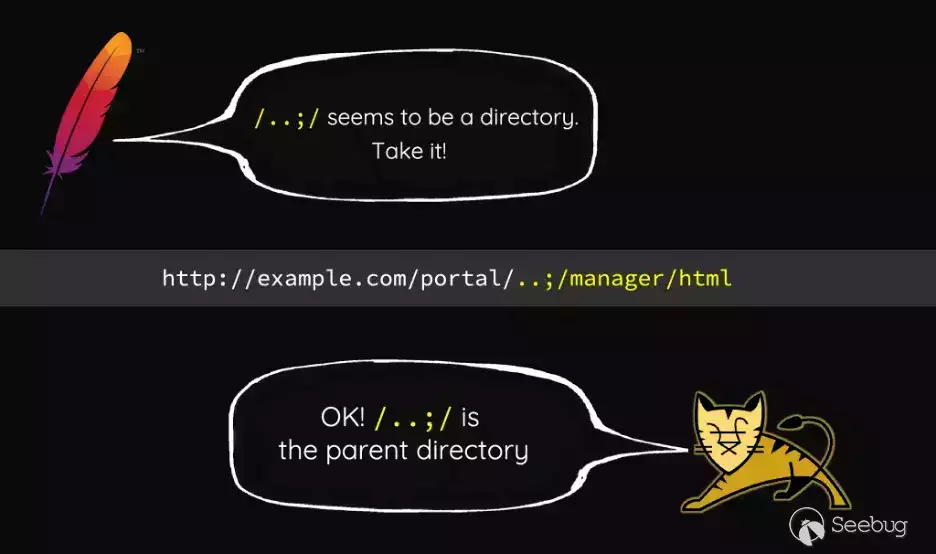

图 1：Orange Tsai 的 Blackhat 2018 演示

CVE-2020-5902 的概念证明是一个简单的 HTTP 请求，用于绕过身份验证要求并向“tmshCmd.jsp”端点发送请求，该端点在系统上执行 tmsh 命令。以下是绕过身份验证的 curl 请求示例：

```bash
curl -k 'https://<host>:<port>/tmui/login.jsp/..;/tmui/locallb/workspace/tmshCmd.jsp?command=list+auth+user+admin'
```

攻击者在野利用了该漏洞，CISA 发布了有关该活动的[公告](https://www.cisa.gov/news-events/cybersecurity-advisories/aa20-206a)。"/tmui" API 包含了与此漏洞相关的处理程序代码。

F5 的第二个漏洞于 2022 年进行披露，编号为 ([CVE-2022-1388](https://my.f5.com/manage/s/article/K23605346))。由于 HTTP 逐跳标头的处理方式，设置标头“Connection: X-F5-Auth-Token”会导致“X-F5-Auth-Token”标头不会在请求中后端代码处理中出现。在没有该头部的情况下，后端代码并不会停止处理，导致请求成功通过，仿佛已经经过了身份验证。

下面的示例请求（来自此[概念证明](https://github.com/alt3kx/CVE-2022-1388_PoC)）导致代码执行"/mgmt/tm/util/bash" API 是一个执行命令并返回结果的端点。

```bash
POST /mgmt/tm/util/bash HTTP/1.1
Host: <redacted>:8443
Authorization: Basic YWRtaW46
Connection: keep-alive, X-F5-Auth-Token
X-F5-Auth-Token: 0
{"command": "run" , "utilCmdArgs": " -c 'id' " }
```

此身份验证漏洞涉及 F5 BIG-IP API 的不同组件，即“/mgmt”处理程序。

F5 已经修补了这两个漏洞，并进一步更新了“/tmui”API 中的相关 JSP 处理程序以限制其功能。现在，“fileRead.jsp”处理程序将不再读取任意文件（它仅限于一个非常小的子集），并且“tmshCmd.jsp”处理程序不会执行任意 tmsh 命令（它是“ilx”相关功能的一个小子集）。

## F5 BIG-IP 攻击面

我们使用一个[AWS Marketplace 模板](https://aws.amazon.com/marketplace/pp/prodview-lphsy6izllsmq?sr=0-1&ref_=beagle&applicationId=AWSMPContessa)部署了默认的 F5 安装，并开始在服务器上识别组件。

```bash
[admin@localhost:Active:Standalone] ~ # cat /etc/os-release
NAME="CentOS Linux"
VERSION="7 (Core)"
ID="centos"
ID_LIKE="rhel fedora"
VERSION_ID="7"
PRETTY_NAME="CentOS Linux 7 (Core)"
ANSI_COLOR="0;31"
CPE_NAME="cpe:/o:centos:centos:7"
HOME_URL="https://www.centos.org/"
BUG_REPORT_URL="https://bugs.centos.org/"
CENTOS_MANTISBT_PROJECT="CentOS-7"
CENTOS_MANTISBT_PROJECT_VERSION="7"
REDHAT_SUPPORT_PRODUCT="centos"
REDHAT_SUPPORT_PRODUCT_VERSION="7"
[admin@localhost:Active:Standalone] ~ # uname -r
3.10.0-862.14.4.el7.ve.x86_64
```

根据操作系统的标志和内核版本，可以知道该设备运行在于 2018 年发布的 CentOS 7.5-1804 上。可以注意到一个特定组件的版本标志：

```bash
[admin@localhost:Active:Standalone] ~ # httpd -version
Server version: BIG-IP 67.el7.centos.5.0.0.5 (customized Apache/2.4.6) (CentOS)
Server built: Jul 11 2023 09:24:58
```

### 易受攻击的 Apache 版本

F5 设备上的 Apache 版本是基于 2.4.6 版本进行定制的，开发人员需要维护大量[安全补丁](https://httpd.apache.org/security/vulnerabilities_24.html)以确保系统安全。根据之前的[Qlik Sense Enterprise 漏洞研究](https://www.praetorian.com/blog/qlik-sense-technical-exploit/)，对与 HTTP 请求走私相关的潜在漏洞有了额外的关注。从之前讨论过的 2020 年和 2022 年的 F5 漏洞中得知，前端和后端系统对请求解释方式的差异可能导致身份验证绕过问题。

确定了一个可能影响定制 Apache 2.4.6 版本的请求走私漏洞，即[CVE-2022-26377](https://www.cve.org/CVERecord?id=CVE-2022-26377)。有趣的是，F5 甚至在他们发布的[公开知识库文章](https://my.f5.com/manage/s/article/K000132643)中承认此漏洞是一个问题。尽管他们将受影响的主要支持版本的 F5 BIG IP 都列为“受影响”，但他们并没有发布修复该漏洞的补丁。我们推测，F5 可能认为该问题无法被实质性地利用，以造成直接的安全影响，只存在更多假设或理论上的风险。

CVE-2022-26377 的最初的报告者写了一篇[博客文章](https://ricterz-me.translate.goog/posts/2022-03-03-a-new-attack-method-ajp-request-smuggling.txt?_x_tr_sl=auto&_x_tr_tl=en&_x_tr_hl=en&_x_tr_pto=wapp)，描述了对该漏洞的直接利用。我们决定追踪运行在服务器上的定制 httpd 软件中的此请求走私问题。

### AJP 和 Tomcat

下一步是确定 F5 设备是否使用 AJP。查看“/usr/share/tomcat/conf/server.xml”确认了 Tomcat 上使用了 AJP 连接器，这是请求走私漏洞的先决条件。

```bash
<Service name="Catalina">

<!-- Define an AJP 1.3 Connector on port 8009 -->

<Connector port="8009" protocol="AJP/1.3"

redirectPort="8443"

enableLookups="true"

address="127.0.0.1"

maxParameterCount="32500"

tomcatAuthentication="false" />
```

我们还观察到 Apache httpd 配置（/etc/httpd/conf.d/proxy\_ajp.conf）使用 AJP 将请求路由到运行 Apache Tomcat 应用程序的后端应用程序（参见图 2）。

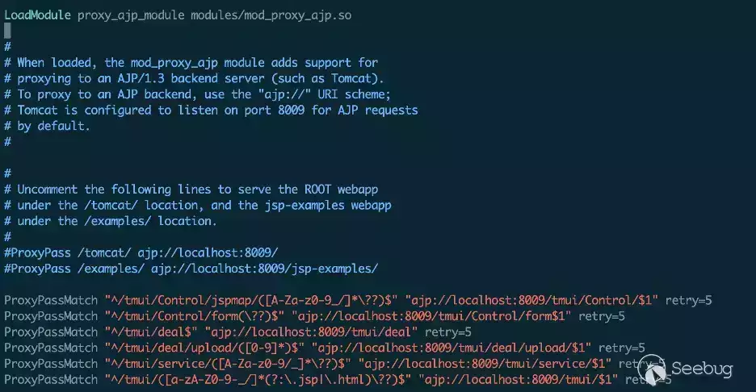

图 2：用于路由 AJP 请求的 httpd 配置

所有 AJP 路由规则都要求初始请求 URI 包含“/tmui/”端点。由于此要求，[CVE-2022-1388](https://my.f5.com/manage/s/article/K23605346)中用于从“/mgmt”API 运行命令的功能将无法通过 AJP 请求隧道访问。

## F5 流量管理用户界面 (TMUI) 概述

F5 流量管理用户界面 (TMUI) 通过 Apache httpd 中的 ProxyPassMatch 路由规则将所有 HTTP 请求路由到后端的不同服务。对于“/tmui”端点的请求最终被转发到监听在 8009 端口上的 AJP 服务（参见图 3）。检查监听该端口的进程可以找到相关的 Java 进程，如图 4 所示。


图 3：Java 进程监听端口 8009


图 4：Tomcat 监听 8009 的 java 进程

查看 Tomcat 部署目录后，“tmui.xml”文件提供了有关在何处查找相关“/tmui”文件的更多信息（见图 5）。


图 5：tomcat 部署 XML 文件包含 TMUI 代码的基目录

在“/usr/local/www/tmui”目录中，servlet 的“web.xml”文件包含相关处理程序的映射信息，如图 6 所示：

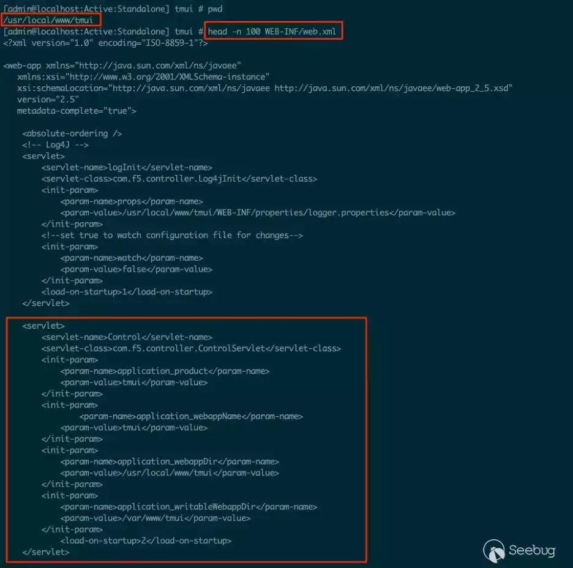

图 6：Tomcat 服务器的 TMUI API 的 web.xml 映射

这些文件确认 Tomcat 服务于监听端口 8009 的 AJP 进程，并且“/usr/local/www/tmui”目录包含相关的 Java 代码和处理程序。

## 验证 AJP 走私

乍一看，点击任何`/tmui/` URL 似乎足以触发 AJP 请求走私。

作为第一步，[RicterZ 的博客文章](https://ricterz-me.translate.goog/posts/2022-03-03-a-new-attack-method-ajp-request-smuggling.txt?_x_tr_sl=auto&_x_tr_tl=en&_x_tr_hl=en&_x_tr_pto=wapp)中获取了示例 AJP 有效负载实现，并将其指向我们知道会公开暴露的 URL——登录页面。

```bash
$ xxd raw.dat
00000000: 0008 4854 5450 2f31 2e31 0000 012f 0000  ..HTTP/1.1.../..
00000010: 0931 3237 2e30 2e30 2e31 00ff ff00 0161  .127.0.0.1.....a
00000020: 0000 5000 0000 0a00 216a 6176 6178 2e73  ..P.....!javax.s
00000030: 6572 766c 6574 2e69 6e63 6c75 6465 2e72  ervlet.include.r
00000040: 6571 7565 7374 5f75 7269 0000 012f 000a  equest_uri.../..
00000050: 0022 6a61 7661 782e 7365 7276 6c65 742e  ."javax.servlet.
00000060: 696e 636c 7564 652e 7365 7276 6c65 745f  include.servlet_
00000070: 7061 7468 0001 532f 2f2f 2f2f 2f2f 2f2f  path..S/////////
00000080: 2f2f 2f2f 2f2f 2f2f 2f2f 2f2f 2f2f 2f2f  ////////////////
00000090: 2f2f 2f2f 2f2f 2f2f 2f2f 2f2f 2f2f 2f2f  ////////////////
000000a0: 2f2f 2f2f 2f2f 2f2f 2f2f 2f2f 2f2f 2f2f  ////////////////
000000b0: 2f2f 2f2f 2f2f 2f2f 2f2f 2f2f 2f2f 2f2f  ////////////////
000000c0: 2f2f 2f2f 2f2f 2f2f 2f2f 2f2f 2f2f 2f2f  ////////////////
000000d0: 2f2f 2f2f 2f2f 2f2f 2f2f 2f2f 2f2f 2f2f  ////////////////
000000e0: 2f2f 2f2f 2f2f 2f2f 2f2f 2f2f 2f2f 2f2f  ////////////////
000000f0: 2f2f 2f2f 2f2f 2f2f 2f2f 2f2f 2f2f 2f2f  ////////////////
00000100: 2f2f 2f2f 2f2f 2f2f 2f2f 2f2f 2f2f 2f2f  ////////////////
00000110: 2f2f 2f2f 2f2f 2f2f 2f2f 2f2f 2f2f 2f2f  ////////////////
00000120: 2f2f 2f2f 2f2f 2f2f 2f2f 2f2f 2f2f 2f2f  ////////////////
00000130: 2f2f 2f2f 2f2f 2f2f 2f2f 2f2f 2f2f 2f2f  ////////////////
00000140: 2f2f 2f2f 2f2f 2f2f 2f2f 2f2f 2f2f 2f2f  ////////////////
00000150: 2f2f 2f2f 2f2f 2f2f 2f2f 2f2f 2f2f 2f2f  ////////////////
00000160: 2f2f 2f2f 2f2f 2f2f 2f2f 2f2f 2f2f 2f2f  ////////////////
00000170: 2f2f 2f2f 2f2f 2f2f 2f2f 2f2f 2f2f 2f2f  ////////////////
00000180: 2f2f 2f2f 2f2f 2f2f 2f2f 2f2f 2f2f 2f2f  ////////////////
00000190: 2f2f 2f2f 2f2f 2f2f 2f2f 2f2f 2f2f 2f2f  ////////////////
000001a0: 2f2f 2f2f 2f2f 2f2f 2f2f 2f2f 2f2f 2f2f  ////////////////
000001b0: 2f2f 2f2f 2f2f 2f2f 2f2f 2f2f 2f2f 2f2f  ////////////////
000001c0: 2f2f 2f2f 2f2f 2f2f 2f2f 000a 001f 6a61  //////////....ja
000001d0: 7661 782e 7365 7276 6c65 742e 696e 636c  vax.servlet.incl
000001e0: 7564 652e 7061 7468 5f69 6e66 6f00 0010  ude.path_info...
000001f0: 2f57 4542 2d49 4e46 2f77 6562 2e78 6d6c  /WEB-INF/web.xml
00000200: 00ff
$ curl -k -i http://our.f5.ami.ip:8443/tmui/login.jsp -H 'Transfer-Encoding: chunked, chunked' --data-binary @raw.dat
```

当我们第一次发送此有效负载时，服务器返回登录页面，这是正常且预期的响应。然后，我们利用先进的渗透测试技能多次重新运行 curl 命令，因为有时漏洞研究会多次执行相同的操作，但会以某种方式得到不同的结果。

在几次 curl 请求之后，会偶尔收到 404 Not Found 响应。因此我们反编译了相关的 Apache .so 模块，并将其实现与修补后的 httpd 源代码进行了比较。

在这篇博文中，将进一步深入探讨 AJP 数据包的工作原理，但上面的示例基本与从 Tomcat 的 ROOTwebapp（2020 年的默认 [PoCGhostCat 漏洞](https://paper.seebug.org/3066/(https://www.trendmicro.com/en_us/research/20/c/busting-ghostcat-an-analysis-of-the-apache-tomcat-vulnerability-cve-2020-1938-and-cnvd-2020-10487.html%20%22PoCGhostCat%20%E6%BC%8F%E6%B4%9E%22)%EF%BC%89])读取 /WEB-INF/web.xml 的内容相同）。默认情况下，F5-BIGIP 不运行 ROOT Web 应用程序，因此系统返回 404。通过在 `/usr/share/tomcat/webapps/ROOT/WEB-INF/web.xml` 显式创建文件，触发 GhostCat 的本地文件包含漏洞（LFI）。

```bash
$ curl -k -i https://our.f5.ami.ip:8443/tmui/login.jsp -H 'Transfer-Encoding: chunked, chunked' --data-binary @raw.dat
HTTP/1.1 200 OK
Date: Fri, 08 Sep 2023 19:57:12 GMT
Server: Apache
X-Frame-Options: SAMEORIGIN
Strict-Transport-Security: max-age=16070400; includeSubDomains
Accept-Ranges: bytes
ETag: W/"60-1694202750000"
Last-Modified: Fri, 08 Sep 2023 19:52:30 GMT
Content-Type: application/xml
Content-Length: 60
X-Content-Type-Options: nosniff
X-XSS-Protection: 1; mode=block
Content-Security-Policy: default-src 'self'  'unsafe-inline' 'unsafe-eval' data: blob:; img-src 'self' data:  http://127.4.1.1 http://127.4.2.1
Cache-Control: no-store
Pragma: no-cache
<Contents of File we wrote to /usr/share/tomcat/webapps/ROOT/WEB-INF/web.xml/>
```

此时，我们知道 AJP 走私在当前版本的 F5-BIGIP 设备上已存在；在利用层面，需要了解 AJP 走私 CVE-2022-26377 的实际运作方式。

## AJP 走私服务器解释

Apache httpd 对 CVE-2022-26377 的描述中[指出，](https://httpd.apache.org/security/vulnerabilities_24.html#CVE-2022-26377) “Apache HTTP Server 的 mod\_proxy\_ajp 存在不一致的 HTTP 请求解释（'HTTP Request Smuggling'）漏洞，允许攻击者将请求走私到其转发请求的 AJP 服务器。此问题影响 Apache HTTP Server 2.4 版本 2.4.53 及之前的版本。”我们希望在 F5 httpd 服务上发现一个请求走私问题，以提供所需的绕过身份验证来完全妥协设备。

该[博客文章](https://ricterz-me.translate.goog/posts/2022-03-03-a-new-attack-method-ajp-request-smuggling.txt?_x_tr_sl=auto&_x_tr_tl=en&_x_tr_hl=en&_x_tr_pto=wapp) 描述了 AJP 走私是如何发生的，但其对“为什么”发生的解释并不完全正确。

### 正常 AJP 消息处理

从 httpd 服务发送到后端 AJP 侦听器的二进制 AJP 消息以字节“0x12”“0x34”开头，后跟两字节消息长度，最后是“数据”。消息的第 5 个字节包含“Code”，该值确定 AJP 请求的类型。HTTP 转发请求的代码是值“0x2”。HTTP 转发请求的第 6 个字节对请求的 HTTP 进行编码。GET 请求是 0x2，POST 请求是 0x4，依此类推。其余消息数据对 AJP 属性和 HTTP 请求信息进行编码。

POST 请求还可能包含正文内容。AJP 协议将 POST 正文内容编码为其自己的特殊数据消息。首字节与之前相同，为字节“0x1234”，接着是两个字节的消息长度，第 5 和第 6 字节不同。消息的其余部分是 POST 正文数据。从 httpd 服务发送到 AJP 侦听器的典型 AJP POST 消息将如下所示，连续发送两个数据包（参见图 7、8 和 9）。


图 7：发送至服务器的标准 AJP 消息


图 8：发送到服务器的 AJP 数据消息（用于发送 POST 正文内容）


图 9：httpd 和 Tomcat 之间的标准数据流

在第一个消息的“数据”包中编码了一个“Content-Length”头，其长度与 POST 主体数据的长度相匹配。当 Tomcat AJP 侦听器看到“Content-Length”标头时，它会从输入流中读取另一个 AJP 数据包并将其解释为数据包。然后进行一个简短的交换，它将其中一条消息发送回 httpd 并请求更多的正文内容，而 httpd 服务器用另一个长度为零的数据包回复该内容。最后，Tomcat AJP 服务器将预期的 HTTP 响应发送回原始请求。图 10 显示了 Wireshark 中的情况。

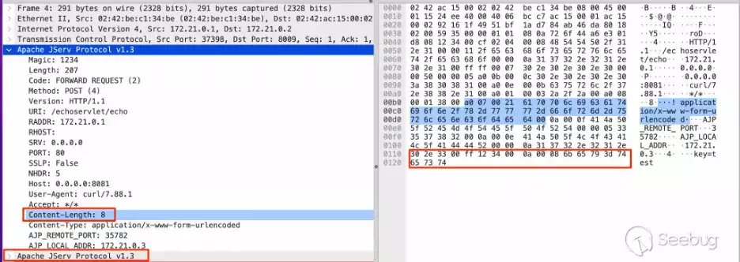

图 10：发送到服务器的两条 AJP 消息代表 HTTP Post 请求

请注意消息中的“Content-Length”值，以及底部的 Apache JServ 协议消息，它是 POST 主体内容的数据包。

负责 AJP 消息处理的代码位于[AjpProcessor 实现](https://github.com/apache/tomcat/blob/8.5.x/java/org/apache/coyote/ajp/AjpProcessor.java)中，如图 11 所示。


图 11：AJP 处理器中的服务方法

该服务方法从套接字连接读取消息。当它看到“Content-Length”标头时，会设置“contentLengthSet”变量，并注意到在处理过程中需要读取主体内容（参见图 12）。


图 12：处理 AJP 消息时检查 Content-Length 标头

最终，主体内容被读取并进行处理，它直接从套接字连接中获取（如上文的第二个消息，在图 13 中再次显示）。


图 13：预期 POST 主体数据 AJP 消息

### 走私 AJP 进程

当对 Apache httpd 服务的原始请求包含值为“chunked, chunked”的“Transfer-Encoding”标头时，会出现 CVE-2022-26377。值“chunked, chunked”是有效的“Transfer-Encoding”标头。当[Apache](https://github.com/apache/httpd/blob/trunk/modules/http/http_core.c)接收到同时包含"Transfer-Encoding"和"Content-Length"标头的请求时，它会从发送给后端 AJP 服务器的请求中移除"Content-Length"头，如图 14 所示。

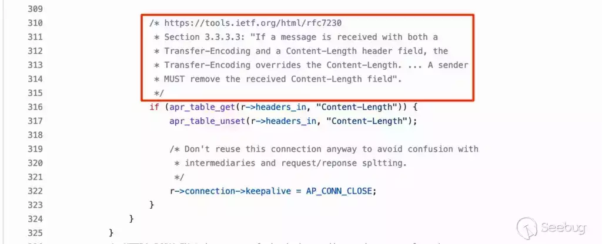

图 14：Apache 处理“Content-Length”和“Transfer-Encoding”标头

因此，转发到[Apache mod\_proxy\_ajp](https://github.com/apache/httpd/blob/2.4.50/modules/proxy/mod_proxy_ajp.c)的请求不包含“Content-Length”标头。首先，httpd AJP 处理器将请求及其标头发送到后端。然后[mod\_proxy\_ajp](https://github.com/apache/httpd/blob/2.4.50/modules/proxy/mod_proxy_ajp.c)检查检查是否存在"Transfer-Encoding"头，以及它是否完全匹配"chunked"（请参见图 15）。由于它正在处理的标头的“chunked, chunked”值不匹配，因此会继续执行 else 分支的剩余部分，并将 POST 主体内容作为 AJP 数据包直接发送到后端服务器（见图 16）。


图 15：Apache httpd mod\_proxy\_ajp 将“Transfer-Encoding”值与“chunked”进行比较


图 16：走私的 AJP 消息

在 httpd 服务遇到"chunked, chunked" Transfer-Encoding 后，它发送了图 17 和图 18 中的两条消息。注意，Data Length 是攻击者控制的 POST 主体的长度，并且 POST 主体就是攻击者控制的 POST 主体。


图 17：发送走私请求时的第一个 AJP 数据包


图 18：发送走私请求时的第二个 AJP 数据包

处理消息的 Tomcat AJP 服务在图 19 中接收到第一条消息：


图 19：第一个收到的 AJP 数据包消息

但是，正如我们之前引用的 Wireshark 截图所示，AJP 消息不包含“Content-Length”标头。Tomcat 服务器不会读取任何帖子 POST 主体数据，而 httpd 发送的第二条消息仍然位于套接字上。处理完第一条消息后，整个循环继续，并从套接字中读取另一条消息（见图 20）。

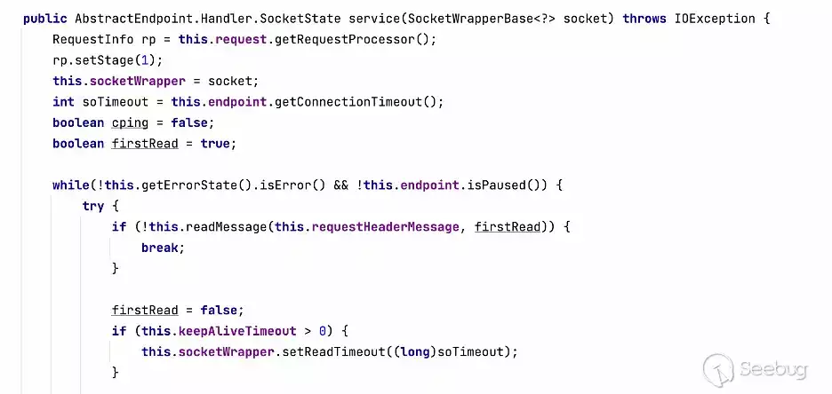

图 20：AJP 处理程序中的处理循环

AJP 处理程序读取的下一条（走私）消息与发送该消息的 httpd 服务消息类似（参见图 21）：


图 21：httpd 服务器认为它正在作为 AJP 消息发送的内容

但 Tomcat AJP 处理器会消耗攻击者控制的消息，如图 22 所示。


图 22：AJP 处理器对走私的 AJP 消息解释

这种混淆导致了 CVE-2022-26377 的产生。如果我们提交一条 POST 主体长度为 0x204 的消息（0x2 是 FORWARD\_REQUEST 代码，0x4 是 HTTP POST 方法），那么 Tomcat AJP 监听器会将相应的数据解释为 AJP POST 请求，并发送到我们想要的位置。这种混淆会导致请求走私，其中一个限制是消息长度必须恰好为 0x204 才能被解释为 POST 请求，图 23 说明了新的流程。

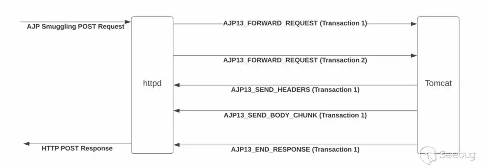

图 23：走私的 AJP 请求流程

## 消息走私处理

那么，通过发送任意 AJP 数据包，我们到底可以做些什么呢？Tomcat AJP 连接器是一种将 Web 请求内容定向到后端 Java servlet 的机制。这些 servlet 包含常规的后端处理逻辑。他们期望 HttpServletRequest 对象包含有关请求的所有信息，并使用 HttpServletResponse 对象将响应信息写入其中。

在标准用例中，AJP 会使用 Apache 填充的属性填充 HttpServletRequest 对象的内容。其中包括有关 Apache 验证的用户、请求包含的标头以及提供的参数等信息，AJP 还包含用户提供的请求 URI。Tomcat 使用此 URI 来执行请求映射并确定要调用哪个 HttpServlet 实现。

可以从 F5-BIGIP 的 Tomcat 安装中提取的反编译的 tmui.jar 中看到更具体例子，如图 24 所示：


图 24：控制 servlet 的 doGet 逻辑

通常情况下，`username`字符串是根据 Apache 在验证用户凭据后设置的属性来填充的，例如`request.getRemoteUser()`。然而，在发送一个欺骗的 AJP 数据包的情况下，我们可以在没有进行身份验证的情况下控制`username`的值。

如果我们能够将任意数据作为 AJP 数据包发送，那么就可以调用任意带有完全任意内容的 Servlet。假设我们欺骗的应用程序具有对服务器的完全管理员权限，这将足以威胁到 F5-BIGIP 设备的安全。然而，由于走私的工作方式，我们在发送请求时遇到了一些限制。

### 局限性

首先，POST 请求必须恰好为 0x204 字节 (518 字节)。如果要发送的数据较少，我们可以通过填充来达到指定长度，但我们无法发送超过 0x204 字节的内容。此外，我们实际上无法发送任何 POST 主体内容。尝试找到绕过此限制的方法，但未成功。破坏 Apache 前端和 Tomcat 后端之间的控制流意味着我们无法让前端等待`AJP_SEND_BODY`消息。最后，只能路由到“/tmui”API 中的端点。我们无法将请求走私到运行任意命令的“/mgmt/tm/util/bash”端点。

我们花了一些时间检查“/tmui”代码中是否存在我们可以利用的漏洞来执行代码。虽然确定了一些有趣的攻击面，例如一些经典 Java 反序列化攻击的潜在路径，但由于缺乏发送 POST 主体的能力，无法到达这些代码路径（见图 25）。


图 25：希望触发的这个潜在的反序列化路径

最终，我们意识到为自己创建一个用户可能会更容易。

## 创建用户 Creating a User

在审查 Burp 中的代理请求时，我们注意到创建用户工作流程向“/tmui”API 发送了一个请求，如图 26 所示。通过 AJP 请求走私，我们可以向“/tmui”API 发送请求，因此我们决定进一步了解该请求的具体内容。

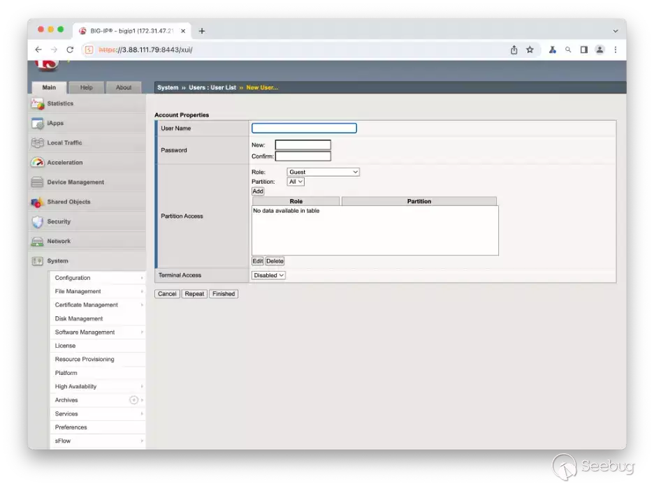

图 26：创建用户用户界面

在系统管理选项卡中创建了一个新用户来观察相应的 API 调用。查看 Burp 代理历史记录后，发现了一个发送到“/tmui/Control/form”的 POST 请求，并且似乎包含新用户请求的相关参数（用户名、密码、权限）。由于请求发送到“/tmui...”，因此能够走私请求到相关的处理程序，如图 27 所示。

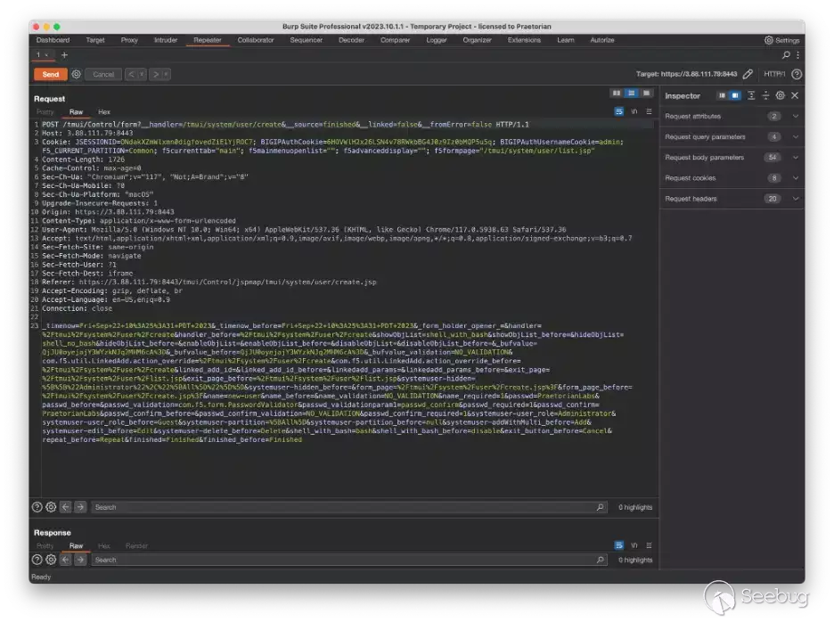

图 27：创建用户 POST 请求

### 克服三个障碍

验证了该请求是否在后端创建了一个新的管理员用户，并发送了另一个请求以确保它是唯一需要的请求。然而，我们注意到了几个重要的属性，这些属性将阻止我们复制和走私相同的请求到后端。首先，内容本身作为 POST 主体发送，走私的 AJP 请求将无法正确发送 POST 主体内容。其次，该请求包含一个在我们登录应用程序后设置的 Cookie，因此我们需要确定是否有其他方法可以在没有该 Cookie 的情况下对代码的相关部分进行身份验证。最后，POST 主体 Content-Length 为 1726 字节，这远远大于我们严格的 518 字节要求（该字节数还必须包括所有相关的 HTTP 标头）。

##### 一：发送没有主体的 POST

为了解决数据发送在 POST 主体中的问题，我们使用 Burp 的“更改请求方法”功能将 POST 请求转换为 GET 请求

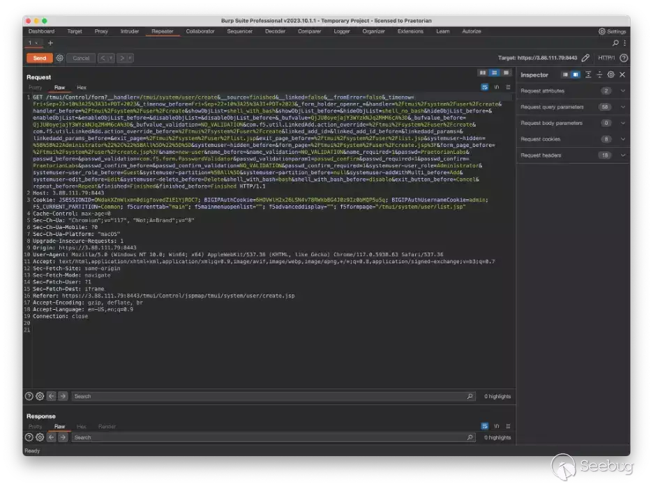

图 28：将 POST 请求更改为 GET 请求

直接将其作为 GET 请求发送不起作用，因为服务器返回了 404 响应。但我们可以简单地将其更改回 POST 请求，并使用请求查询参数而不是请求正文参数。尝试了这个方法，并且后端服务器成功处理了它。因此，将 POST 主体内容作为请求查询参数发送确实起到了作用，并解决了以上三个问题中的第一个问题。

##### 二：成为管理员

当 F5 Java servlet 处理传入的 POST 请求时（在 com.f5.controller 的 doGet 方法中），它处理了一个由走私的 AJP 消息构造的请求。[这些 AJP 属性](https://tomcat.apache.org/tomcat-3.3-doc/AJPv13.html#prefix-codes)之一是“remote\_user”，它直接编码在 AJP 请求中。将该属性设置为“admin”，因此图 29（第二个亮点）中的“request.getRemoteUser()”调用返回“admin”。


图 29：相关 TMUI AJP 处理程序的 doGet 实现

然而，仅仅设置这个 AJP 属性是不足够的，让请求被处理为管理员请求。在 doGet 方法中，通过 User(username, headers) 调用构造一个新的用户对象。查看该函数的实现，看到它有一个 REMOTEROLE 标头，其值被分配为创建的用户的用户角色。如果标头不存在，应用程序将检查“auth.override\_role”属性。因为 F5 实例默认情况下并没有定义该自定义属性的值，走私请求失败。所以为了成功创建用户，我们只需要向走私的 AJP 请求中添加一个值为“0”的“REMOTEROLE”头，如图 30 所示。

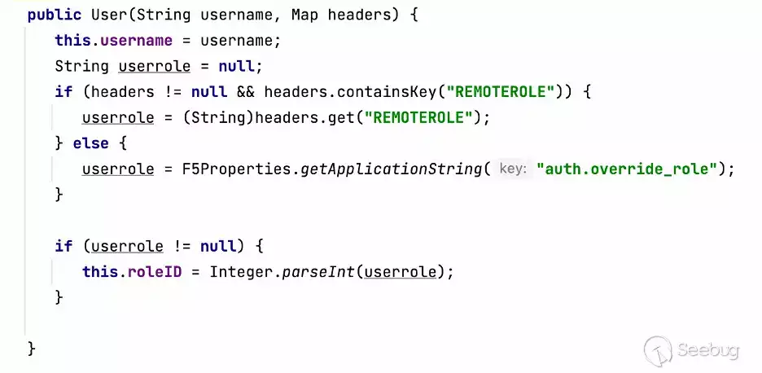

图 30：检查 REMOTEROLE 标头的用户创建函数

通过将 AJP 请求中的“remote\_user”属性和 REMOTEROLE 头的值正确设置，后端 TMUI 处理程序将走私的请求作为管理员用户处理。这解决了我们三个限制中的第二个问题。

##### 三：在 518 字节内容纳一个请求

现在，只剩下第三个限制，即请求大小的问题。回想一下，为了让系统将走私请求作为 POST 进行处理，其长度必须恰好为 518 字节。Burp 显示，当在用户界面中创建新用户时发送的创建用户请求的正文长度为 1726 字节，大大超出了的可用容量。当我们将 POST 正文转换为请求查询参数时，长度为 2022 字节。

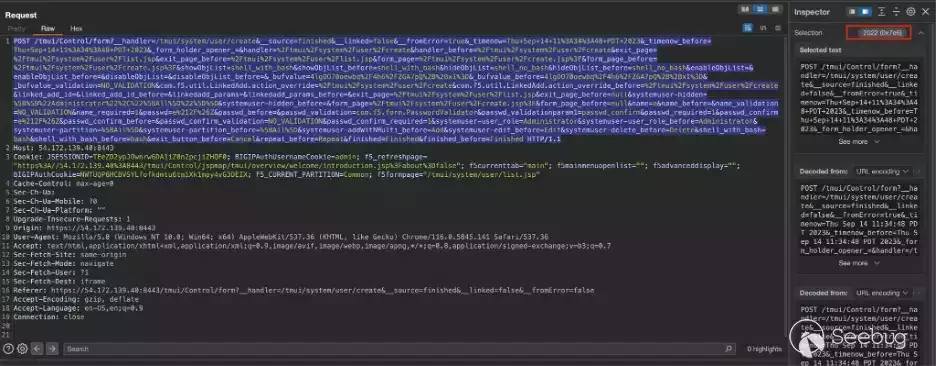

图 31：需要修剪的请求

我们逐步删除一些参数，例如“exit\_button\_before”和“enableObjList”。删除它们后，重新发送请求并检查它是否仍然创建了新用户，然后再次重复这个过程。我们发现某些参数是必需的，但处理代码只检查它们的存在与否，从未读取值。在这些情况下，我们将值减少为单个字符以节省空间。经过一些试错，能够将请求的大小减少到大约 400 字节。

我们对 400 字节的 AJP POST 请求进行了适当的编码（包括前面一节中提到的标头，以及 CSRF 保护所需的其他一些标头），并且所有这些都符合 518 的限制。事实上，我们最终需要将请求填充到 518 字节。现在，有了一个请求，可以发送并创建具有我们提供的凭据的新管理员用户。

## 执行命令

发送走私请求以创建有效的管理员凭据后，我们可以使用标准身份验证流程对 F5 系统进行身份验证，并通过“mgmt”API 运行任意命令。最简单的方法是使用以下 [F5 支持文章中](https://community.f5.com/t5/technical-forum/native-tmsh-bash-commands-via-rest-api/td-p/118662)描述的简单 curl 请求。

```bash
curl -sk -u 'USER:PASS' -H 'Content-Type: application/json' -X POST \
-d '{"command": "run", "utilCmdArgs": "-c \"whoami\""}'  \
https://$IP:8443/mgmt/tm/util/bash
```

## 结论

一个看似影响较低的请求走私漏洞，在两个不同的服务将身份验证责任交给对方时可能会变成严重问题。向“后端”服务发送请求，而该服务假设“前端”已处理了身份验证，可能导致某些有趣的行为。如果对这些请求走私漏洞感兴趣，可点击文章：第一个[严重风险问题](https://www.praetorian.com/blog/qlik-sense-technical-exploit/)和[补丁绕过](https://www.praetorian.com/blog/doubleqlik-bypassing-the-original-fix-for-cve-2023-41265/)。

- - -

 本文由 Seebug Paper 发布，如需转载请注明来源。本文地址：[https://paper.seebug.org/3066/](https://paper.seebug.org/3066/)
