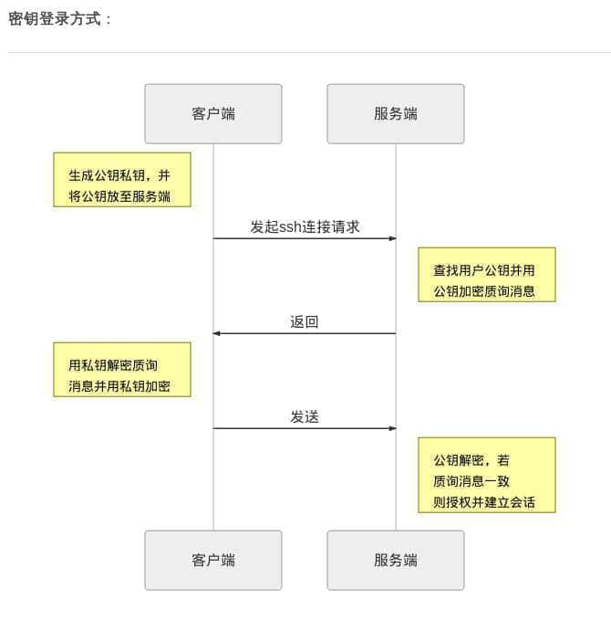

# [Linux - SSH 服务](https://www.raingray.com/archives/2359.html)

## 目录

-   [目录](#%E7%9B%AE%E5%BD%95)
-   [SSH 连接过程](#SSH+%E8%BF%9E%E6%8E%A5%E8%BF%87%E7%A8%8B)
-   [公钥登录](#%E5%85%AC%E9%92%A5%E7%99%BB%E5%BD%95)
-   [日志](#%E6%97%A5%E5%BF%97)
-   [配置文件](#%E9%85%8D%E7%BD%AE%E6%96%87%E4%BB%B6)
-   [SSH 安全防护](#SSH+%E5%AE%89%E5%85%A8%E9%98%B2%E6%8A%A4)
-   [参考链接](#%E5%8F%82%E8%80%83%E9%93%BE%E6%8E%A5)

## SSH 连接过程

连接会服务端会将公钥指纹信息显示让你确认是否要连，因为你无法确认对方服务器公钥是不是被调包，输入 yes 就会把服务端公钥写到用户家目录中 `~/.ssh/known_hosts` 这个文件里，下次再登录就不会警告了，之后就是输入密码进行登录。

如果服务端系统重装或者它 IP 交给其他机器使用，本地就会连接不上服务端，因为服务端私钥解不开本机公钥连接时传输的加密信息，这种情况直接把 known\_hosts 清空就好了，因为你不知道那条才是服务端对应的公钥。


```bash
ssh -l user -p prot
root@gbb:~# ssh 192.168.1.152
The authenticity of host '192.168.1.152 (192.168.1.152)' can't be established.
ECDSA key fingerprint is SHA256:H1Ix1eEHkMrbGCT1blsjIIFhOqTIOlmcP2jIyN7QU2k.
Are you sure you want to continue connecting (yes/no)? yes
Warning: Permanently added '192.168.1.152' (ECDSA) to the list of known hosts.
root@192.168.1.152's password: 
Last login: Tue Mar 26 15:52:20 2019 from 192.168.1.85
[root@centos7 ~]# 
```

## 公钥登录

1.申请公私钥

```bash
root@gbb:~/.ssh# ssh-keygen
Generating public/private rsa key pair.
Enter file in which to save the key (/root/.ssh/id_rsa): #输入秘钥目录，默认在 /root/.ssh/
Enter passphrase (empty for no passphrase): #输入私钥密码，不需要密码就回车
Enter same passphrase again: #重复刚才输入密码，前面没有设置，就默认回车为空。
Your identification has been saved in /root/.ssh/id_rsa. #私钥路径
Your public key has been saved in /root/.ssh/id_rsa.pub. #公钥路径
The key fingerprint is:
SHA256:CgCEnFhKBqOKLaySSTaEsFdodRC8NcsTV2JfrbyjfnI root@gbb
The key's randomart image is:
+---[RSA 2048]----+
|@=o+=o. o.. ..   |
|OBo...+..o .  .  |
|=oo  + =  .. .   |
|=o .. +     o    |
|+=. .  .S    .   |
|++.  . .    o    |
|=     .    . .   |
|.         o E    |
|         ..+     |
+----[SHA256]-----+
root@gbb:~/.ssh# ls # id_rsa 是私钥  id_rsa.pub 是公钥
id_rsa  id_rsa.pub
```

2.复制公钥到服务器上

申请完公私钥后，把 .ssh/id\_rsa.pub 公钥内容放服务器用户家目录下 `.ssh/authorized_keys` 文件中，没有 `.ssh` 目录就建一个。公钥在哪个用户家目录就能免密码登录，系统上每个用户都可以设置公钥登录。

为什么要放在 .ssh/authorized\_keys 中，是 /etc/ssh/sshd\_config 配置文件中要求这样写。

```bash
AuthorizedKeysFile      .ssh/authorized_keys
```

将文件 ~/.ssh/id\_rsa.pub 复制到 `/<username>/.ssh/` 目录下命名为 authorized\_keys 文件，如果目标 authorized\_keys 文件存在可能出现问题。

```bash
scp ~/.ssh/id_rsa.pub user@address:/root/authorized_keys
chmod 700 .ssh/authorized_keys # 不能让其他人查看文件只能是用户自己可以读写，如果有问题也要改。
```

这是条更优雅的写法。

```bash
ssh user@host 'mkdir -p .ssh && cat >> .ssh/authorized_keys' < ~/.ssh/id_rsa.pub
```

因为 `cat >> .ssh/authorized_keys` 会直接从标准输入设备中获取内容，这时候把它从标准输入重定向到文件上，就说数据从 `.ssh/authorized_keys' < ~/.ssh/id_rsa.pub` 来，就相当于 `cat ~/.ssh/id_rsa.pub >> ssh/authorized_keys`。

使用 `ssh-copy-id` 会自己在服务端创建目录 (如果没有的话) 和更改文件名。

输入 `ssh-copy-id` 和地址会让你输入密码，如果用户有权限写到目录中就能连接。

```bash
ssh-copy-id [-p] username@address
```

连接直接输入用户名。

```bash
PS C:\Users\gbb> ssh root@www.example.com
root@www.example.com's password:
Activate the web console with: systemctl enable --now cockpit.socket

Last failed login: Sat Mar 11 23:50:54 CST 2023 from 111.194.223.198 on ssh:notty
There were 2 failed login attempts since the last successful login.
Last login: Sat Mar 11 23:40:39 2023 from 111.194.223.198
ubuntu@TeamServer:~$
```

还有种更简单的方式，可以直接输入别名就登录。需要在 .ssh/config 文件中添加如下配置。

```bash
Host c2
    HostName www.example.com
    User ubuntu
```

后续连接直接输入别名 c2 即可连接。

```bash
PS C:\Users\gbb> ssh c2
ubuntu@TeamServer:~$
```



## 日志

登录日志 `/var/log/secure`。

登录失败：

```bash
Apr 10 21:15:39 [localhost] sshd[31487]: pam_unix(sshd:auth): authentication failure; logname= uid=0 euid=0 tty=ssh ruser= rhost=192.168.4.7  user=root
Apr 10 21:15:39 [localhost] sshd[31487]: pam_succeed_if(sshd:auth): requirement "uid >= 1000" not met by user "root"
Apr 10 21:15:41 [localhost] sshd[31487]: Failed password for root from 192.168.4.7 port 38674 ssh2
```

日志格式是

```bash
|     时间      |   主机    |   进程号    |    连接信息    | 
```

登录成功：

接受来自 192.168.4.7 端口 38674 的密码，并为 root 开启了会话。

```bash
Apr 10 21:16:38 [localhost] sshd[31487]: Accepted password for root from 192.168.4.7 port 38674 ssh2
Apr 10 21:16:38 [localhost] sshd[31487]: pam_unix(sshd:session): session opened for user root by (uid=0)
```

## 配置文件

sshd 配置文件路径 `/etc/ssh/sshd_config`：

```bash
Port 12351 #配置端口默认是 22
PermitRootLogin yes #是否拒绝 root 登录，默认是 no
PasswordAuthentication no #配置不允许用密码登录，默认设置为 yes
PubkeyAuthentication yes #默认允许公钥连接(无需密码)
```

## SSH 安全防护

SSH 安全防护思路分为自身安全配置和其他措施。

SSH 可能存在的安全状况：

1.  账户存在弱口令被爆破
2.  出现 MS-17010 这种直接秒系统的 N Day。

基于这两点来做防护，首先要考虑 SSH 有没必要使用密码登陆，要是需要使用密码，那你的密码强度必须到位，除了强度到位后，还需要调整下面几项增加安全性。

1.  `PermitRootLogin` 设为 No，在生产环境中一般不需要 root 用户登陆，通过配置 `/etc/sudoers` 来提升权限进行操作。
2.  `MaxAuthTries` 设为 5，在尝试多次认证失败后后需要临时禁止这个地址再连接我们将。
3.  `PermitEmptyPasswords` 设为 No，避免账户不需要密码直接 Enter 登陆服务器。
4.  `LoginGraceTime` 设为 30，在登陆界面无操作或是登陆失败设置一个时间就断开与服务器的连接。
5.  `Port` 将 SSH 默认 22 端口替换为其他端口提高攻击时间成本——扫描识别 Banner 也需要时间的嘛。

要完全杜绝被爆破可使用私钥登录服务器，另外你这个私钥需要保存好，不允许随意传输，私钥也要要定期更换，防止泄露增加安全风险。

爆破层面可以基本保证相对安全，我们接着看其他措施有些什么：

1.  经由堡垒机的 SSH 去连接到服务器进行操作；堡垒机可以配置权限，限制危险指令执行，执行的指令会被记录下来，方便出事审计。
2.  通过系统自带的防火墙对公司出口地址加白名单。
3.  通过自身搭建的日志分析系统或购买线上 ECS 配套态势感知服务，及时告警快速响应。
4.  保证程序安全，及时更新版本。

## 参考链接

-   [linux 上 ssh 免密登录原理及实现](https://segmentfault.com/a/1190000018330563)
-   [OpenSSH security and hardening](https://linux-audit.com/audit-and-harden-your-ssh-configuration/)

最近更新：2023 年 03 月 11 日 23:54:29

发布时间：2020 年 01 月 28 日 13:26:00
