# [](#ntlm-relay)NTLM Relay

## [](#1-ntlm-%E5%8D%8F%E8%AE%AE)1 NTLM 协议

### [](#11-%E7%AE%80%E4%BB%8B)1.1 简介

NTLM 协议是一个在微软环境中使用的认证协议。该协议允许用户向服务器证明其身份，以便使用该服务器提供的服务。


有两种认证的场景：

-   工作组环境
    -   用户使用服务器本地帐户的密钥。由于服务器在其本地数据库中拥有用户的密钥，能够对用户进行身份验证；
-   域环境
    -   在 Active Directory 环境中，用户在身份验证期间使用域帐户，在这种情况下，服务器将向域控发送用户的认证信息。

在这两种情况下，NTLM 认证始于客户和服务器之间的「挑战/响应」机制。

### [](#12-%E6%8C%91%E6%88%98---%E5%93%8D%E5%BA%94%E8%AE%A4%E8%AF%81%E6%9C%BA%E5%88%B6)1.2 挑战 - 响应认证机制

挑战/响应机制的目的是为了让服务器验证用户的身份，且不通过网络传输用户密码。整个认证过程有三步。

-   **协商 - Negotiation - type1**
    
    -   客户端向服务端发送认证请求 ([NEGOTIATE\_MESSAGE](https://docs.microsoft.com/en-us/openspecs/windows_protocols/ms-nlmp/b34032e5-3aae-4bc6-84c3-c6d80eadf7f2))
-   **挑战 - Challenge - type2**
    
    -   服务端向客户端发送 64 位的随机值 ([CHALLENGE\_MESSAGE](https://docs.microsoft.com/en-us/openspecs/windows_protocols/ms-nlmp/801a4681-8809-4be9-ab0d-61dcfe762786))
-   **响应 - Response - type3**
    
    -   客户端使用其用户的 NT Hash 值对 Challenge 进行加密，并将结果返回给服务端


下图为 1 次 NTLM 认证过程：


为了完成身份验证，服务器只需要检查客户端发送的响应的有效性。

### [](#13-%E8%AE%A4%E8%AF%81)1.3 认证

NT Hash 的计算：

1.  先将用户密码转换为十六进制格式。
2.  将十六进制格式的密码进行 Unicode 编码。
3.  使用 MD4 摘要算法对 Unicode 编码数据进行 Hash 计算

|     |     |     |
| --- | --- | --- |
| ```bash<br>1<br>``` | ```python<br>python2 -c 'import hashlib,binascii; print binascii.hexlify(hashlib.new("md4", "p@Assword!123".encode("utf-16le")).digest())'<br>``` |

如前文所述，NTLM 认证有两种不同的场景。

#### [](#131-%E6%9C%AC%E5%9C%B0%E8%B4%A6%E6%88%B7)1.3.1 本地账户

在使用本地帐户完成身份验证的场景下，服务器使用用户的密钥或用户密钥的 MD4 散列 (NT Hash) 对其发送给客户端的 Challenge 进行加密。然后它会检查它的操作结果是否等于客户端的响应，证明用户身份。

服务器需要存储本地用户及其密码的哈希值。此数据库的名称是 SAM（安全帐户管理器）。SAM 可以在注册表中找到，可以使用 psexec 以 SYSTEM 身份打开它：

|     |     |     |
| --- | --- | --- |
| ```bash<br>1<br>``` | ```bash<br>psexec.exe -i -s regedit.exe<br>``` |

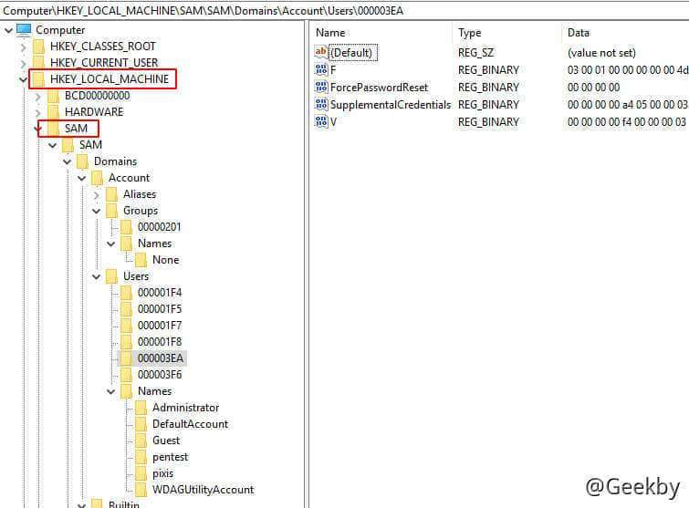

在 `C:\Windows\System32\SAM` 下也有一份拷贝。

总结下工作组下的认证流程：

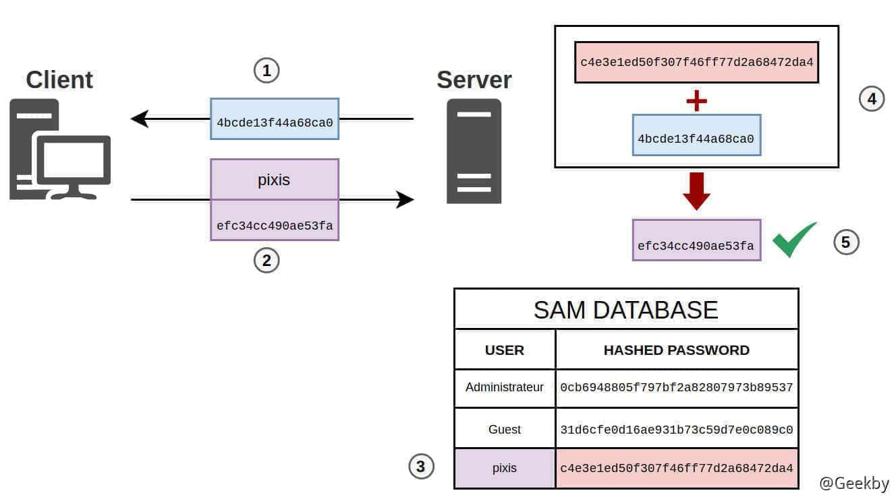

服务器发送一个 Challenge **(1)** 并且客户端使用其密钥的哈希值加密该质询，然后使用其用户对应的 NT Hash 加密 Challenge 并将其发送回服务器 **(2)**。服务器将在其 SAM 中查找用户密码的哈希值 **(3)**，并加密之前用这个散列发送的 Challenge **(4)**，并将其结果与用户返回的结果进行比较。如果相同 **(5)** 则用户已通过身份验证，否则，认证失败。

#### [](#132-%E5%9F%9F%E8%B4%A6%E6%88%B7)1.3.2 域账户

当用域帐户进行认证时，用户的 NT Hash 不再存储在服务器上，而是存储在域控制器上。用户要认证的服务器会收到客户端对 Challenge 加密的响应报文，但它不能检查该响应是否有效，因此，服务端需要把验证身份的任务委托给域控制器。

为此，在服务端与域控进行通信时，使用了 `Netlogon` 服务，该服务能够与域控制器建立安全会话，被称为安全通道 (`Secure Channel`)。由于服务器知道自己的密钥，而域控制器知道服务器密钥的哈希，服务端与域控之间可以交换会话密钥并安全地通信。

客户端向域控发送 [NETLOGON\_NETWORK\_INFO](https://docs.microsoft.com/en-us/openspecs/windows_protocols/ms-nrpc/e17b03b8-c1d2-43a1-98db-cf8d05b9c6a8)，其中主要包括：

|     |     |     |
| --- | --- | --- |
| ```bash<br>1<br>2<br>3<br>4<br>5<br>6<br>7<br>``` | ```c<br>typedef struct _NETLOGON_NETWORK_INFO {<br>   NETLOGON_LOGON_IDENTITY_INFO Identity;<br>   LM_CHALLENGE LmChallenge;<br>   STRING NtChallengeResponse;<br>   STRING LmChallengeResponse;<br> } NETLOGON_NETWORK_INFO,<br>  *PNETLOGON_NETWORK_INFO;<br>``` |

-   客户端用户名 (Identity)
-   服务端向客户端发送的 Challenge (LmChallenge)
-   客户端向服务端发送的 Response (NtChallengeResponse)

域控将在其数据库中查找对应用户的 NT Hash。对于域控制器，用户的数据被存储在 `NTDS.DIT` 的文件中。一旦检索到 NT Hash，计算 Challenge 的加密值，并将此结果与客户端的响应进行比较。

总结下域环境下的认证流程：

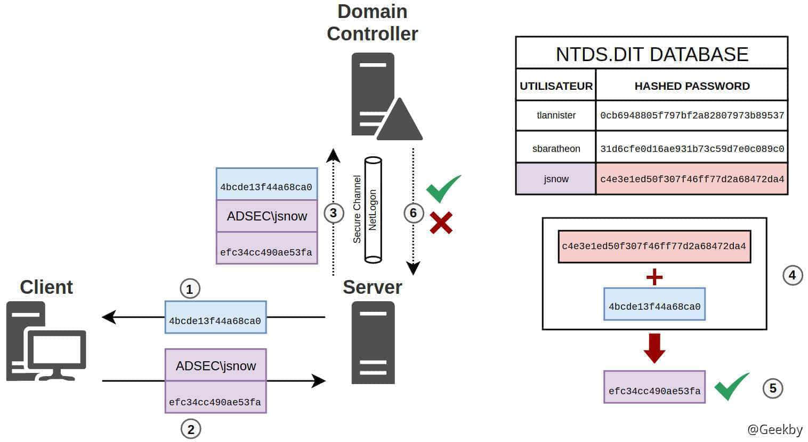

和之前的情况类似，服务器发送一个挑战 **(1)**，客户端 jsnow 用 NT Hash 加密，并将它连同它的用户名和域名 **(2)** 一起发送回服务器。服务器将使用 Netlogon 服务 **(3)** 将此信息发送到安全通道中的域控制器。域控制器在其 NTDS.DIT 数据库 **(4)** 中找到用户散列来加密 Challenge，然后将两个结果进行比较。如果是相同的 **(5)**，则用户已通过身份验证。否则认证失败。在这两种情况下，域控制器都会将信息传输到服务器 **(6)**。

## [](#2-ntlm-relay)2 NTLM Relay

### [](#21-%E5%87%A0%E7%A7%8D-hash)2.1 几种 Hash

为了避免混淆，总结下相关 Hash 的名词：

-   `NT Hash` 和 `LM Hash` 是用户密码的散列版本。 `LM Hash` 已经完全过时，本文不再讨论。`NT Hash` 通常又被称为 `NTLM Hash`。此名称与协议名称 NTLM 存在混淆。因此，当谈论用户的密码哈希时，将其称为 `NT Hash`。
-   NTLM 是身份验证协议的名称。目前有两个版本的 NTLM 协议。
-   `NTLMv1` 响应和 `NTLMv2` 响应将是用于指代客户端发送的 Challenge 响应的术语，适用于 NTLM 协议的版本 1 和 2。
-   `Net-NTLMv1` 和 `Net-NTLMv2` 是当 `NT Hash` 称为 `NTLM` 哈希时使用的伪新术语，用于将 `NTLM Hash`与协议区分开来。由于我们不使用 `NTLM Hash` 术语，因此不会使用这两个术语。
-   `Net-NTLMv1 Hash` 和 `Net-NTLMv2 Hash` 也是避免混淆的术语，但也不会在本文中使用。

### [](#22-%E7%AE%80%E4%BB%8B)2.2 简介

顾名思义，NTLM Relay 攻击依赖于 NTLM 身份验证。攻击存在下面的场景中：攻击者设法在客户端和服务器之间处于中间人的位置，并简单地将信息从一端转发到另一端。

中间人的位置意味着：从客户端的角度来看，攻击者的机器是他想要认证的服务器，而从服务器的角度来看，攻击者是一个像其他想要认证访问资源的客户端。

当然，攻击者并不只是想对目标服务器进行认证，而是伪造成受害的用户身份来控制服务端。但是，由于攻击者不知道用户的密钥，即使他监听了对话，由于这个密钥从未在网络上传输，攻击者也无法提取任何信息。那么，它是如何工作的呢？

### [](#23-%E6%B6%88%E6%81%AF%E4%B8%AD%E7%BB%A7)2.3 消息中继

在 NTLM 认证过程中，客户用其 NT Hash 加密服务器提供的 Challenge 来向服务器证明其身份。因此，攻击者唯一要做的就是让客户端做好加密，并把信息从客户端传给服务器，以及把服务器的回复传给客户端。

客户端向服务器发送的所有信息，攻击者都会收到，并把信息重放给真正的服务器。而服务器向客户发送的所有信息，攻击者也会收到，并将其原封不动的转发给客户端。

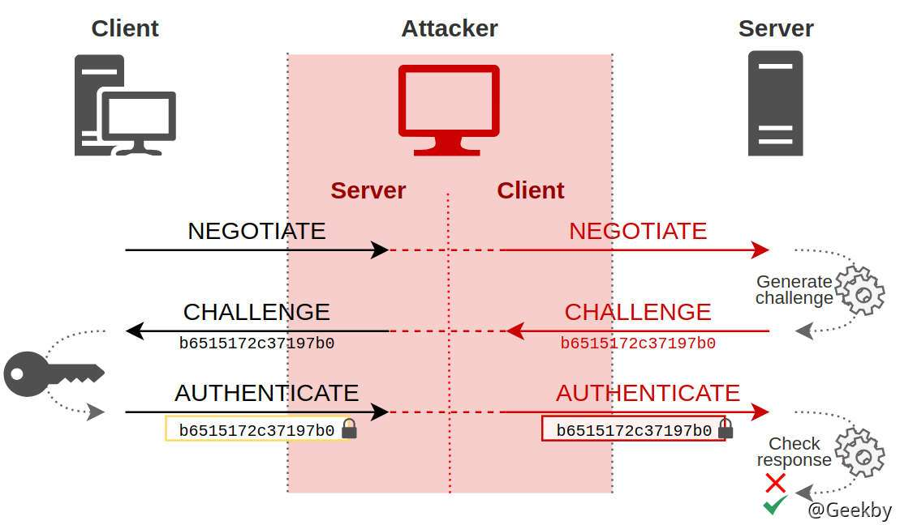

实际上，从客户的角度来看，在图的左侧，攻击者和它之间进行了 NTLM 身份验证。客户端在其第一条消息中发送协商请求，攻击者以 Challenge 回复该请求。收到此 Challenge 后，客户端使用其密钥构建 Response，并最终发送包含加密质询的最后一条身份验证消息。

但是，攻击者不能用这个交换做任何事情。因此，需要思路转向上图的右半边。实际上，从服务器的角度来看，攻击者是一个和其它用户一样的客户端。它发送了第一条消息要求认证，而服务器用挑战来回应。由于**攻击者向真正的客户发送了这个同样的 Challenge**，真正的客户端**用它的密钥对这个挑战进行了加密**，并以一个**有效的响应**进行回复。因此，攻击者可以向服务器发送这个有效的响应。

这就是攻击的点所在。从服务器的角度来看，它不知道攻击者正在向客户重放其信息。

因此，从服务器的角度来看，这就是所发生的事情：

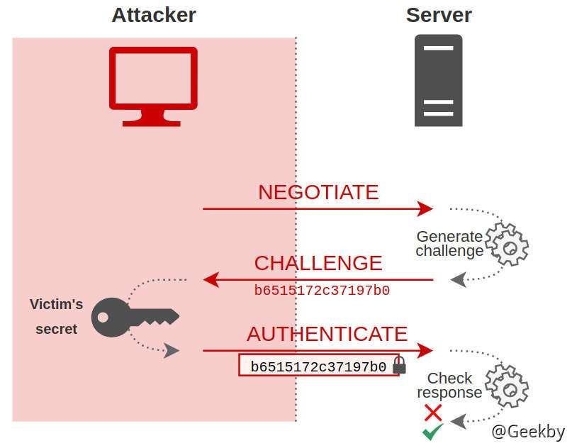

在这些交换结束时，攻击者在服务器上使用客户端的凭据进行身份验证。

### [](#24-net-ntlmv1-and-net-ntlmv2)2.4 Net-NTLMv1 and Net-NTLMv2

攻击者在 type 3 中转发的这个有效响应，通常称为 Net-NTLMv1 Hash 或 Net-NTLMv2 Hash。但在本文中，它将被称为 `NTLMv1 响应`或 `NTLMv2 响应`，如前文所述。

确切地说，这并不是 Challenge 的加密版本，而是使用客户端密钥计算出的哈希值。以 [NTLMv2](https://docs.microsoft.com/en-us/openspecs/windows_protocols/ms-nlmp/5e550938-91d4-459f-b67d-75d70009e3f3) 为例，**NTLMv2 Hash** = `HMAC-MD5(unicode(hex(upper(username+domain))), NT Hash)`，这种类型的哈希只能用暴力破解。

## [](#3-%E5%AE%9E%E6%88%98)3 实战

IP 地址为 `192.168.56.221` 的 DESKTOP01 客户端和 IP 地址为 `192.168.56.211` 的 WEB01 服务器。IP 地址为 `192.168.56.1` 为中间人。攻击场景如下：

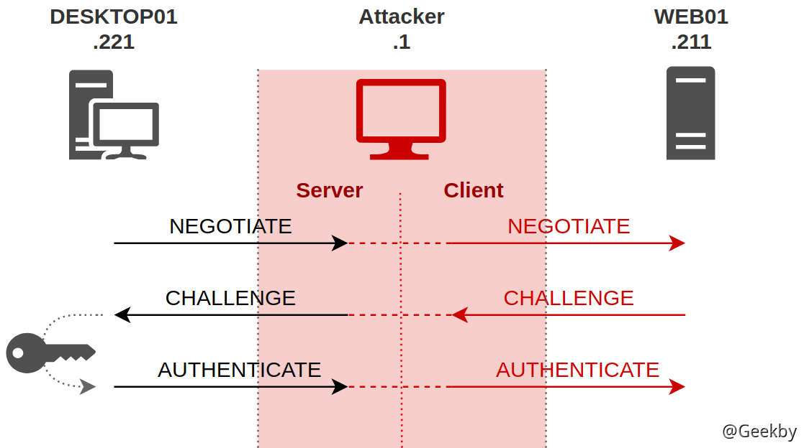

使用 impacket 包中的 ntlmrelayx 进行攻击。

|     |     |     |
| --- | --- | --- |
| ```bash<br>1<br>``` | ```python<br>python ntlmrelayx.py -t 192.168.56.221<br>``` |

网络流量如下：


绿色的是 DESKTOP01 客户端和攻击者之间的流量，红色是攻击者和 WEB01 服务器之间的流量。可以清楚地看到 DESKTOP01 和攻击者之间以及攻击者和 WEB01 服务器之间的 3 条 NTLM 消息。

为了理解中继的概念，通过验证当 WEB01 向攻击者发送质询时，攻击者向 DESKTOP01 发送回完全相同的内容。

这是 WEB01 向攻击者发送的 Challenge：


当攻击者收到这个挑战时，它不加任何修改地将其发送到 DESKTOP01。在上面的过程中，Challenge 值是 `b6515172c37197b0`。

然后客户端将使用它的密钥来计算响应，将计算好的响应值连同用户名 (jsnow)、主机名 (DESKTOP01) 一起发送，在这个例子中是一个域用户，因此主机名是本域的域名 (ADSEC)。

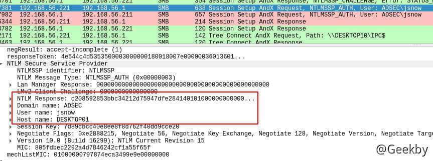

得到 Response 的攻击者将完全相同的信息发送到服务器。于是中间人冒充了 `DESKTOP01` 上的 `jsnow`，是 `ADSEC` 域的域用户，它还发送了客户端计算出来的响应，在这些截图中称为 NTLM 响应。将此响应称为 `NTLMv2 Hash`。

从流量上可以看到，攻击者只是在转发数据。它只是将客户端的信息转发给服务器，反之亦然，只不过最后服务器认为攻击者认证成功，然后攻击者就可以代表 `ADSEC\jsnow` 在服务器上执行操作。

## [](#4-%E8%AE%A4%E8%AF%81%E4%B8%8E%E4%BC%9A%E8%AF%9D)4 认证与会话

上文阐述了 NTLM 中继的基本原理，接下来出现的问题是，在中继 NTLM 身份验证后，如何在目标服务器上执行具体地操作？

要回答这个问题，必须首先澄清一个基本的事实。当客户端向服务器进行身份验证以执行某些操作时，必须区分两件事：

-   身份验证 (Authentication)，允许服务器验证客户端是它声称的身份。
-   会话 (Session)，在此期间客户端将能够执行操作。

如果客户端通过了正确的身份验证，那么它将能够访问服务器提供的资源，例如网络共享、对 LDAP 目录的访问、HTTP 服务器或 SQL 数据库等等。

为了管理这两个步骤，所使用的协议必须能够封装身份验证，从而交换 NTLM 消息。

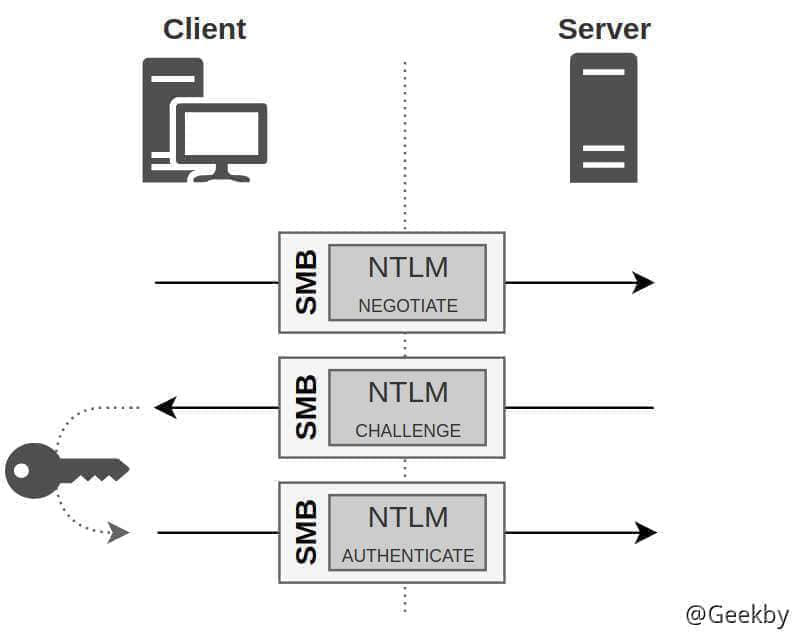

如果所有协议都集成 NTLM 技术细节，是不符合软件工程中的解耦思想的。因此，微软提供了一个接口来处理身份验证，并且专门开发了包来处理不同类型的身份验证。

### [](#41-sspi--ntlnssp)4.1 SSPI & NTLNSSP

SSPI 接口 (Security Support Provider Interface) 是 Microsoft 提出的用于标准化身份验证的接口，不同的协议都可以使用这个接口来处理不同类型的身份验证过程。在 NTLM 认证中，使用的是 `NTLMSSP`（NTLM 安全支持提供程序）。

SSPI 接口提供了几个函数，包括 `AcquireCredentialsHandle`、`InitializeSecurityContext` 和 `AcceptSecurityContext`。在 NTLM 身份验证期间，客户端和服务器都会使用到这些函数。简述这些步骤：

1.  客户端调用 `AcquireCredentialsHandle` 获得对用户凭据的间接访问。
2.  客户端然后调用 `InitializeSecurityContext`，该函数在第一次调用时将创建类型为 `NEGOTIATE` 的 type 1 消息。对于研发来说，这条消息是什么并不重要，重要的是将它发送到服务器。
3.  服务器在收到消息时调用 `AcceptSecurityContext` 函数。这个函数然后将创建类型为 `Challange` 的 type 2 数据。
4.  收到此消息时，客户端将再次调用 `InitializeSecurityContext`，但这次将 `CHALLENGE` 作为参数传递。 `NTLMSSP` 负责通过加密 `Challenge` 来计算响应的内容，并生成最后的 `AUTHENTICATE` 消息。
5.  服务器收到该消息后，也会再次调用 `AcceptSecurityContext`，自动进行鉴权验证。

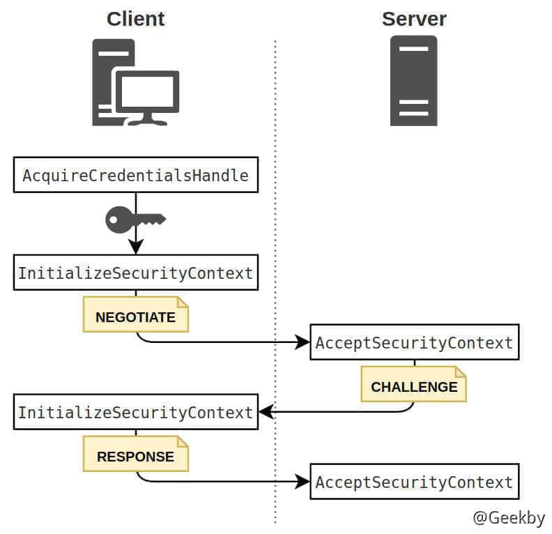

这意味着这 5 个步骤完全独立于客户端的类型或服务器的类型。无论使用何种协议，只要该协议具有允许这种不透明结构，以一种或另一种方式从客户端交换到服务器的内容，它们就可以工作。


因此，协议通过将 `NTLMSSP`、`Kerberos` 或其他身份验证结构放入特定字段，如果客户端或服务器看到该字段中有数据，它只会将其传递给 `InitializeSecurityContext` 或 `AcceptSecurityContext`。

应用层（HTTP、SMB、SQL 等）完全独立于身份验证层（NTLM、Kerberos 等）。因此，认证层和应用层都需要安全措施。

通过 SMB 和 HTTP 的两个示例帮助读者更好地理解。其它协议也十分相似。

### [](#42-http--ntlm)4.2 HTTP & NTLM

一个 HTTP 的基本请求：

|     |     |     |
| --- | --- | --- |
| ```bash<br>1<br>2<br>3<br>4<br>5<br>``` | ```http<br>GET /index.html HTTP/1.1<br>Host: www.geekby.site<br>User-Agent: Mozilla/5.0<br>Accept: text/html<br>Accept-Language: zh-cn<br>``` |

此示例中的必需元素是 HTTP 动词 (**GET**)、请求页面的路径 (**/index.html**)、协议版本 (**HTTP/1.1**) 或主机标头 (**Host: beta.hackndo.com**)。

但是可以还添加其它的 HTTP 头。最好的情况是，服务器知道这些标头会存在，并且知道如何处理。最坏的情况是直接忽略。

正是 HTTP 的此项特性，能够将 NTLM 的相关信息从客户端传输到服务器。即在客户端添加 `Authorization` 的 HTTP 头，在服务端添加一个 `WWW-Authenticate` 的头。如果客户端尝试访问需要身份验证的网站，服务器将通过添加 `WWW-Authenticate` 标头来响应，内容包含其支持的不同身份验证机制。如对于 NTLM，返回：`WWW-Authenticate: NTLM`。

客户端知道需要 NTLM 身份验证，将发送 `Authorization` 头中的第一条消息，并 base64 编码 (因为该消息仅包含不可打印的字符)。服务器将在 `WWW-Authenticate` 填充 `Challenge`，客户端将计算响应并将其放到 `Authorization` 头中。如果认证成功，服务器通常会返回 200 返回码。

|     |     |     |
| --- | --- | --- |
| ```bash<br> 1<br> 2<br> 3<br> 4<br> 5<br> 6<br> 7<br> 8<br> 9<br>10<br>11<br>12<br>13<br>14<br>15<br>16<br>17<br>18<br>19<br>20<br>21<br>22<br>23<br>24<br>25<br>26<br>27<br>28<br>29<br>30<br>31<br>32<br>33<br>34<br>35<br>``` | ```fallback<br>> GET /index.html HTTP/1.1<br>> Host: www.geekby.site<br>> User-Agent: Mozilla/5.0<br>> Accept: text/html<br>> Accept-Language: en<br><br>  < HTTP/1.1 401 Unauthorized<br>  < WWW-Authenticate: NTLM<br>  < Content type: text/html<br>  < Content-Length: 0<br><br>> GET /index.html HTTP/1.1<br>> Host: www.geekby.site<br>> User-Agent: Mozilla/5.0<br>> Accept: text/html<br>> Accept-Language: zh-ch<br>=> Authorization: NTLM <NEGOTIATE in base64><br><br>  < HTTP/1.1 401 Unauthorized<br>  => WWW-Authenticate: NTLM <CHALLENGE in base64><br>  < Content type: text/html<br>  < Content-Length: 0<br><br>> GET /index.html HTTP/1.1<br>> Host: www.geekby.site<br>> User-Agent: Mozilla/5.0<br>> Accept: text/html<br>> Accept-Language: zh-cn<br>=> Authorization: NTLM <RESPONSE in base64><br><br>  < HTTP/1,200 OKAY.<br>  < WWW-Authenticate: NTLM<br>  < Content type: text/html<br>  < Content-Length: 0<br>  < Connection: close<br>``` |

只要 TCP 会话处于打开状态，身份验证就会有效。然而，一旦会话关闭，服务器将不再拥有客户端的安全上下文，并且必须进行新的身份验证。由于 Microsoft 的 SSO（单点登录）机制，整个过程对用户是透明的。

### [](#43-smb--ntlm)4.3 SMB & NTLM

再举一个 SMB 协议的例子。SMB 协议，通常用于访问网络共享。

SMB 协议通过使用命令来工作 ([Microsoft 定义的相关文档](https://docs.microsoft.com/en-us/openspecs/windows_protocols/ms-cifs/5cd5747f-fe0b-40a6-89d0-d67f751f8232))，例如，有 `SMB_COM_OPEN`、`SMB_COM_CLOSE` 或 `SMB_COM_READ`，用于打开、关闭或读取文件的命令。

SMB 还有一个专门用于配置 SMB 会话的命令，`SMB_COM_SESSION_SETUP_ANDX`。此命令中有两个字段专用于 NTLM 认证的字段。

-   LM/LMv2 认证：OEMPassword
-   NTLM/NTLMv2 认证：UnicodePassword

下图是一个 SMB 数据包的样例，其中包含服务器对身份验证的响应。

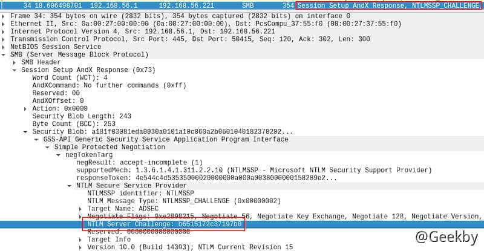

这两个示例表明 NTLM 的内容与协议无关。它可以包含在任何支持它的协议中。

然后，将`身份验证部分`与`应用程序会话部分`做区分。会话部分是通过客户端身份验证后使用的协议进行的交换的延续，例如通过 HTTP 浏览网站，使用 SMB 访问网络共享上的文件。

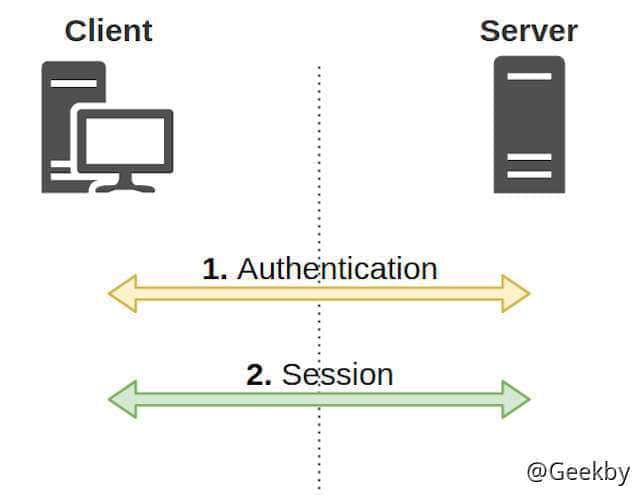

由于认证和会话过程彼此的信息是独立的，这意味着中间人很可能会通过 HTTP 接收身份验证，并将其中继到服务器但使用 SMB，称为跨协议中继。

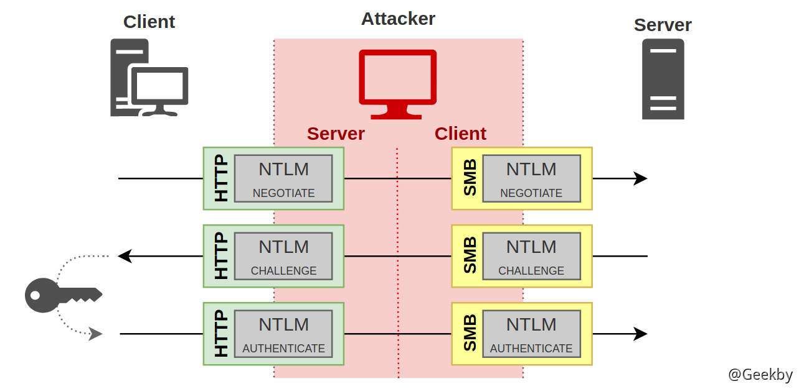

考虑到所有这些因素，下一章节将重点介绍已经各种存在风险的点，以及用于解决这些问题所引入的安全机制。

## [](#5-%E4%BC%9A%E8%AF%9D%E7%AD%BE%E5%90%8D)5 会话签名

### [](#51-%E5%8E%9F%E7%90%86)5.1 原理

签名是一种验证真实性的方法，它确保数据在发送和接收之间没有被篡改。例如，如果用户 `jdoe` 发送文本 `Hello World`，并对该文档进行数字签名，那么任何收到此文档并签名的人都可以验证是 `jdoe` 编辑它，并且可以确定这句话是他写的，因为签名保证文档没有被修改。

签名原理可以应用于信息交换。例如，`SMB`、`LDAP` 甚至 `HTTP` 协议。但是，在实践中，很少实现 HTTP 消息的签名。

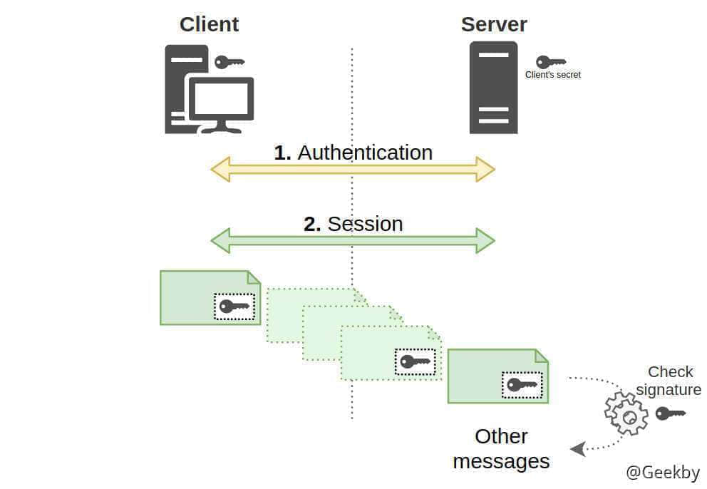

但是，对包签名有什么意义呢？如前所述，会话和身份验证是两个独立的步骤，由于攻击者可以处于中间人位置并中继身份验证消息，因此它可以冒充客户端。

这就是签名发挥作用的地方。即使攻击者已设法以客户端身份向服务器进行身份验证，但无论身份验证的结果如何，由于没有用户的密钥，都无法对数据包进行签名。因此接收数据包的服务器将看到签名失效在或不存在，会拒绝攻击者的请求。


所以签名值防止 NTLM 中继攻击非常有效的措施。但是客户端和服务器如何就是否签署数据包达成一致呢？

有两件事在这里起作用：

1.  一是标识是否**支持签名**。这是在 NTLM 协商期间完成的。
2.  二是允许指示签名是**必需的**、**可选的**还是**禁用的**。这是在客户端和服务器级别完成的设置。

### [](#52-ntlm-%E5%8D%8F%E5%95%86%E8%BF%87%E7%A8%8B)5.2 NTLM 协商过程

NTLM Negotiation 阶段使得客户端或服务器了解是否支持签名，并在 NTLM 交换期间完成。事实上，在 NTLM 消息中，除了要交换的质询和响应之外，还有 **Negotiate Flags**。


当 Negotiate Sign flag 为 1 时，表明客户端支持签名。但是并不意味着签名是必要的，只是说明客户端有签名的能力。同理，服务端也是类似的。

因此，协商过程允许客户端和服务器两方中的每一方向另一方表明它是否能够对数据包进行签名。对于某些协议，即使客户端和服务器都支持签名，这并不一定意味着数据包会被签名。

### [](#53-%E5%AE%9E%E7%8E%B0)5.3 实现

根据协议的不同，通常可以设置 2 个甚至 3 个选项来决定是否强制执行签名。3 个选项是：

-   **Disabled**：禁用签名
-   **Enabled**：可以在需要时处理签名，但不强制签名。
-   **Mandatory**：表明不仅支持签名，而且必须对数据包进行签名才能继续会话。

下文将以 SMB 和 LDAP 两个协议为例。

#### [](#531-smb)5.3.1 SMB

##### [](#5311-%E7%AD%BE%E5%90%8D%E7%9F%A9%E9%98%B5)5.3.1.1 签名矩阵

微软的[相关文档](https://docs.microsoft.com/fr-fr/archive/blogs/josebda/the-basics-of-smb-signing-covering-both-smb1-and-smb2)中提供了一个矩阵，以确定是否基于客户端和服务器端设置对 SMB 数据包进行签名。但是，对于 SMBv2 及更高版本，必须处理签名，Disabled 参数不再存在。

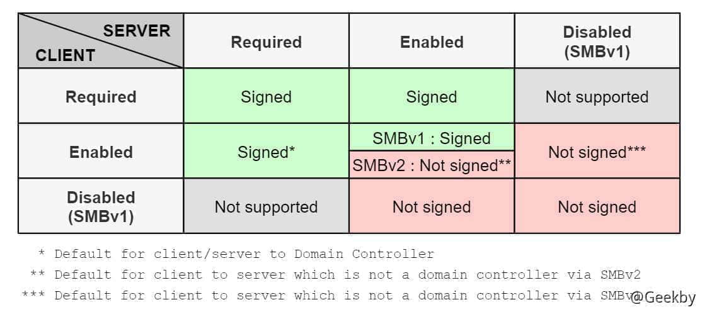

当客户端和服务器具有 `Enabled` 设置时会有所不同。在 `SMBv1` 中，服务器的默认设置为 `Disabled`。防止服务器在每次发送 SMB 数据包时计算签名来避免服务器过载，因此，客户端和服务器之间的所有 SMB 流量都未签名。由于 `SMBv2` 不再存在禁用状态，并且服务器现在默认启用，为了保持这种负载节省，在这种情况下也是不需要签名。只有客户端或服务器启用 Require 参数才对 SMB 数据包进行签名。

##### [](#5312-%E8%AE%BE%E7%BD%AE)5.3.1.2 设置

为了更改服务器上的默认签名设置，必须在注册表项`HKEY_LOCAL_MACHINE\System\CurrentControlSet\Services\LanmanServer\Parameters` 中更改 `EnableSecuritySignature` 和 `RequireSecuritySignature` 项。


在域控制器上，默认情况下，当客户端对其进行身份验证时，域控制器需要 SMB 签名。下图为应用于域控制器的组策略配置：


另外，在上图中可以看到，`Microsoft network client` 选项未设置 Enable 参数。因此，当域控制器充当 SMB 服务器时，需要 SMB 签名，但如果连接来自域控制器到其它服务器，则不需要 SMB 签名。

##### [](#5313-%E6%B5%81%E7%A8%8B)5.3.1.3 流程

在了解 SMB 签名的配置位置之后，可以看到在 NTLM 协议通信期间应用的这个选项，它是在身份验证之前完成的。当客户端连接到 SMB 服务器时，步骤如下：

1.  协商 SMB 版本和签名要求
2.  验证
3.  具有协商参数的 SMB 会话

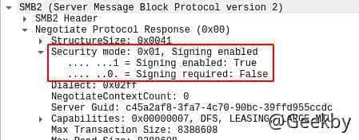

上图中可以看到，来自服务器的响应表明它具有 `Enable` 参数，但不需要签名。

总而言之，协商 / 身份验证 / 会话的流程如下：

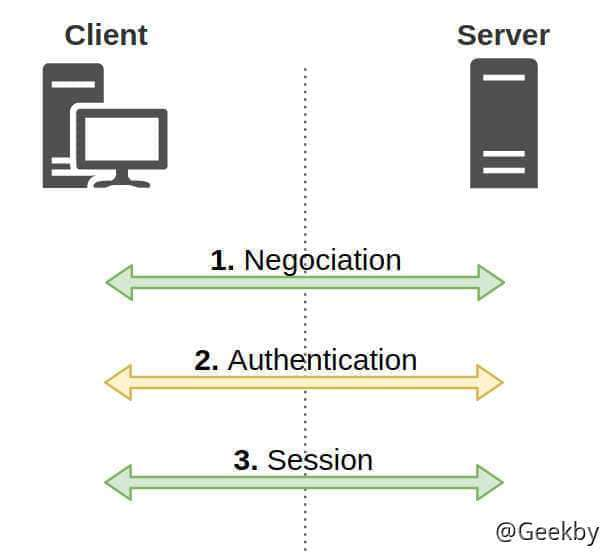

1.  在协商阶段，双方提出要求：其中之一是否需要签名？
2.  在认证阶段，双方表明他们支持什么。它们有能力签名么？
3.  在会话阶段，如果能力和要求兼容，则按照协商的内容进行会话。

例如，如果 `DESKTOP01` 客户端要与 `DC01` 域控制器通信，则 `DESKTOP01` 表示它不需要签名，但是可以处理带签名的数据包。

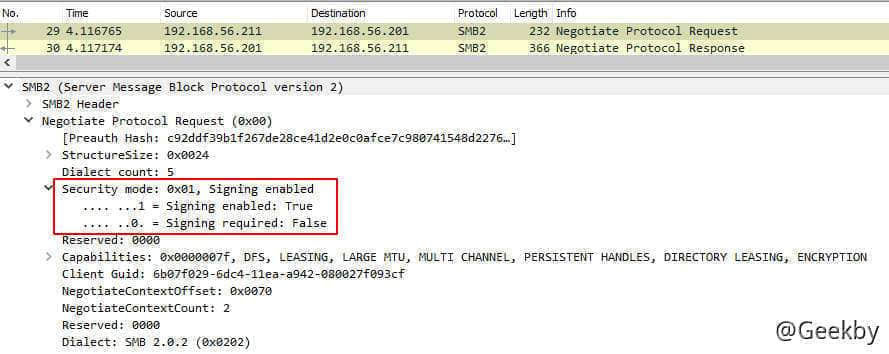

`DC01` 表示不仅支持签名，而且需要签名：


在协商阶段，客户端和服务器将 `NEGOTIATE_SIGN` 标志设置为 1，表示它们都支持签名。


身份验证完成后，会话将继续，SMB 数据包将被签名。


#### [](#532-ldap)5.3.2 LDAP

##### [](#5321-%E7%AD%BE%E5%90%8D%E7%9F%A9%E9%98%B5)5.3.2.1 签名矩阵

对于 LDAP 协议来说，有三个等级：

-   Disabled：不支持数据包签名。
-   Negotiated：表示可以处理签名，如果与之通信的机器也可以处理签名的话，那么后续的数据将被签名。
-   Required：表示不仅支持签名，而且必须对数据包进行签名才能继续会话。

在中间层，`Negotiated Signing` 与 `SMBv2` 的情况不同。如果客户端和服务器能够对数据包进行签名，那么它们就会签名。而对于 SMBv2，只有在至少一个实体开启 `Require` 时才对数据包进行签名。

所以对于 LDAP，有一个类似于 SMBv1 的矩阵：

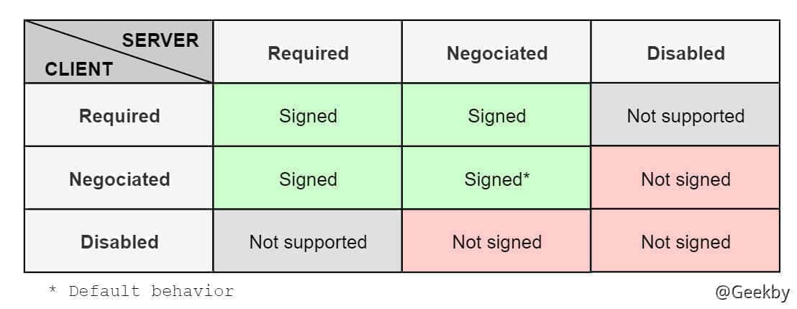

另外，与 SMB 不同的是，在 Active Directory 域中，所有主机都能自行配置 `Negotiated Signing`。域控制器不强制签名。

##### [](#5322-%E8%AE%BE%E7%BD%AE)5.3.2.2 设置

对于域控制器，`ldapserverintegrity` 注册表项位于 `HKEY_LOCAL_MACHINE\System\CurrentControlSet\Services\NTDS\Parameters hive` 中，并且可以是 0、1 或 2，具体取决于级别。默认情况下，它在域控制器上设置为 1。

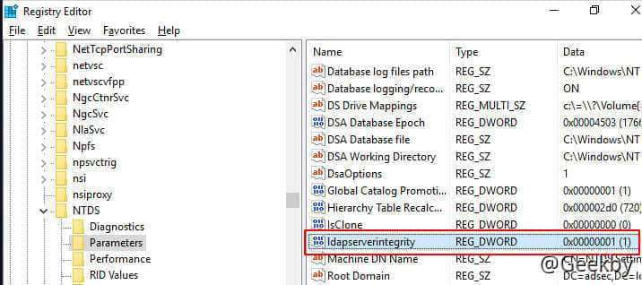

对于客户端，此注册表项位于 `HKEY_LOCAL_MACHINE\System\CurrentControlSet\Services\ldap`


对于客户端，它也设置为 1。由于所有客户端和域控制器都默认配置了 `Negotiated`，因此默认情况下所有 LDAP 数据包都进行签名。

##### [](#5323-%E6%B5%81%E7%A8%8B)5.3.2.3 流程

与 SMB 不同，LDAP 中没有指示是否对数据包进行签名的标志。但是，LDAP 使用与 NTLM 协商中相同的 flag 标志位。在客户端和服务器都支持 LDAP 签名的情况下，将设置 `NEGOTIATE_SIGN` 标志并对数据包进行签名。

如果一方要求签名，而另一方不支持，则会话根本不会开始。需要签名的一方将忽略未签名的数据包。

所以与 SMB 相反，如果攻击者在客户端和服务器之间，并且想使用 LDAP 将身份验证中继到服务器，需要满足两个条件：

1.  服务器必须不需要数据包签名，默认情况下所有机器都是这种情况
2.  客户端不得将 NEGOTIATE\_SIGN 标志设置为 1。如果他这样做了，那么服务器将需要签名，并且由于我们不知道用户的密钥，就无法对伪造的 LDAP 数据包进行签名。

关于要求 2，有时客户端不设置此标志，但是，Windows SMB 客户端设置了该参数，默认情况下，无法将 SMB 身份验证中继到 LDAP。

那么为什么不直接更改 `NEGOTIATE_FLAG` 标志并将其设置为 0？这就是我们将在下一节中要阐述的内容。

## [](#6-%E8%AE%A4%E8%AF%81%E7%AD%BE%E5%90%8Dmic)6 认证签名 (MIC)

上文中以 SMB、LDAP 两个协议为例，阐述了如何保护会话免受中间人攻击。为了进一步阐述 MIC 的作用，再举一个具体的案例。

### [](#61-%E7%BB%8F%E5%85%B8%E6%A1%88%E4%BE%8B)6.1 经典案例

假设攻击者设法将自己置于中间人位置，并且通过 SMB 接收身份验证请求。知道域控制器需要 SMB 签名，攻击者不可能通过 SMB 中继进行攻击。另一方面，正如前文所述，由于身份验证和会话相互独立，因此中继攻击时可以更改协议的，并且攻击者决定中继到 LDAPS 协议。

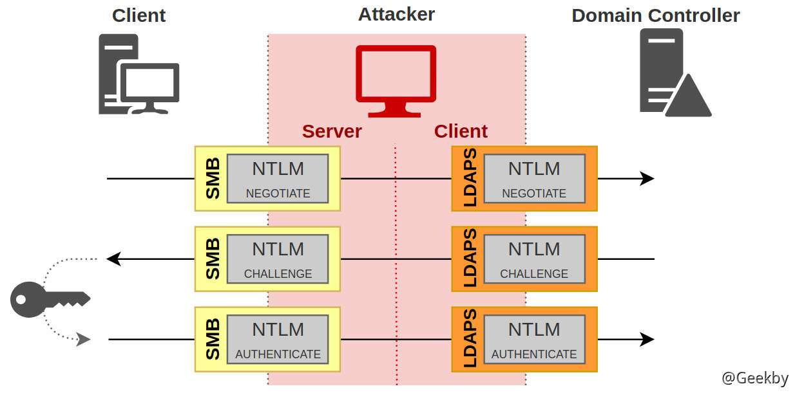

在身份验证数据中存在 `NEGOTIATE_SIGN` 标志，该标志仅用于指示客户端和服务器是否支持签名。但在某些情况下，这个标志会被考虑在内，如上文中描述的 LDAP 协议那样。

对于 LDAPS，服务器也会同样使用此标志位。LDAPS 是基于 TLS 的 LDAP，**TLS 负责处理数据包签名**（和加密）的。因此，如果服务器收到 `NEGOTIATE_SIGN` 标志设置为 1 的身份验证请求，LDAPS 客户端没有理由表明它可以签名数据包，因此，服务端将拒绝身份验证。

在上面设想的攻击流程中，客户端想要通过 SMB 进行身份验证，它支持数据包签名，并将 `NEGOTIATE_SIGN` 标志设置为 1。但是如果我们中继其身份验证，而无需更改任何内容，通过 LDAPS，然后 LDAPS 服务器将看到此标志，并会终止身份验证。

可以简单地修改 NTLM 消息并删除标志么？如果可以，上面的攻击场景就成立。但是，除了在 NTLM 级别的签名外，还有另一个签名。该签名称为 `MIC`，或**消息完整性代码**。

### [](#62-mic---message-integrity-code)6.2 MIC - Message Integrity Code

MIC 是仅在 NTLM 身份验证的最后一条消息 `AUTHENTICATE` 消息中发送的签名。该签名在计算时会包含 NTLM 认证的 3 条消息。MIC 使用 `HMAC_MD5` 函数计算，密钥为基于用户密钥生成的密钥，称为会话密钥 (**Session Key**)。

|     |     |     |
| --- | --- | --- |
| ```bash<br>1<br>``` | ```fallback<br>HMAC_MD5(Session key, NEGOTIATE_MESSAGE + CHALLENGE_MESSAGE + AUTHENTICATE_MESSAGE)<br>``` |

重要的是会话密钥取决于用户的密钥，因此攻击者无法重新计算 MIC。

下图为 MIC 的样例：


因此，如果 3 个消息中只要有一个被修改，则 MIC 将不再有效。所以不能像直接更改 `NEGOTIATE_SIGN` 标志。

由于 MIC 是可选的，如果只是移除 MIC 呢？但是，这样做并不会有效果。因为还有另一个标志位表明 MIC 将出现，即 `msAvFlags`。它也存在于 NTLM 响应中，如果它是 `0x00000002`，则向服务器表名必须存在 MIC。因此，如果服务器没有看到 MIC，它就会终止身份验证。


如果将 `msAcFlags` 设置为 0，然后再移除 MIC 呢？

事实证明，**NTLMv2 Hash**，即客户端对 Challenge 的响应，它不仅考虑了 Challenge，而且还考虑了响应的所有标志。表示 MIC 存在的标志是此响应的一部分。

更改或删除此标志将使 NTLMv2 Hash 失效，因为数据将被修改。

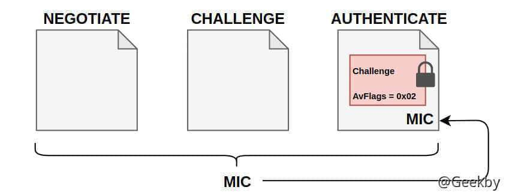

MIC 保护 3 条消息的完整性，`msAvFlags` 保护 MIC 的存在，NTLMv2 哈希保护标志的存在。攻击者不知道用户的密钥，也无法重新计算这个哈希。

### [](#63-drop-the-mic)6.3 Drop the MIC

**CVE-2019-1040**：Drop the MIC 漏洞。该漏洞指出：如果直接移除 MIC，即使该标志表明其存在，服务器也会接受身份验证。

可以使用 ntlmrelayx 工具中的 `--remove-mic` 参数来删除 MIC。

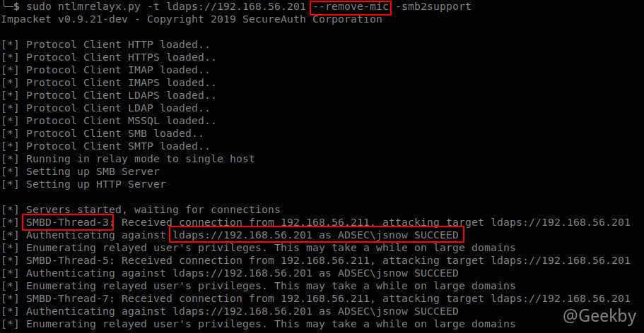

## [](#7-session-key)7 Session Key

在前文阐述了会话签名和身份认证签名，提及到要签名时需要获得用户的密钥。在关于 MIC 的小节中也提到过，实际上使用的并不完全是用户的密钥，而是 Session Key，它基于用户密钥生成。

以下是为 NTLMv1 和 NTLMv2 计算 Session Key 的方法：

|     |     |     |
| --- | --- | --- |
| ```bash<br>1<br>2<br>3<br>4<br>5<br>6<br>``` | ```fallback<br># For NTLMv1<br>Key = MD4(NT Hash)<br><br># For NTLMv2<br>NTLMv2 Hash = HMAC_MD5(NT Hash, Uppercase(Username) + UserDomain)<br>Key = HMAC_MD5(NTLMv2 Hash, HMAC_MD5(NTLMv2 Hash, NTLMv2 Response + Challenge))<br>``` |

有了这些算法，客户端可以完成 Session Key 的计算。但是，在域环境中，服务器由于没有用户密钥不能独立完成。对于本地身份验证，是没有问题的。

因此，对于域帐户的身份验证，服务器会让域控制器为它计算 Session Key，然后将其返回。服务器以 `NETLOGON_NETWORK_INFO` 结构向域控制器发送请求，域控制器以 `NETLOGON_VALIDATION_SAM_INFO4` 结构响应。如果身份验证成功，会话密钥将在域控制器的此响应中发送。

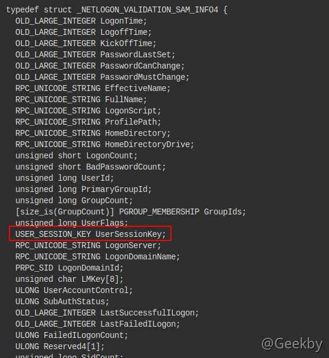

那么问题就出现了，如果攻击者构造出与目标服务器向域控制器发出的相同请求，就同样可以获得 Session Key，即：CVE-2015-005。

> 域控制器没有验证正在发送的身份验证信息是否实际上是针对请求此操作的加入域的机器（例如 NetrLogonSamLogonWithFlags()）。这意味着任何加入域的机器都可以验证针对域控制器的任何传递身份验证，并获取域内任何会话的 Session Key。

所以，微软已经修复了这个 BUG。为了验证只有用户进行身份验证的服务器有权请求会话密钥，域控制器将验证 `AUTHENTICATE` 响应中的目标计算机与发出 `NetLogon` 请求的主机相同。

在 `AUTHENTICATE` 响应中，我们详细说明了 `msAvFlags` 的存在是为了表明 MIC 是否存在。但还有其它信息，例如目标机器的 `Netbios` 名称。


这是与发出 `NetLogon` 请求的主机进行比较的机器名称。因此，如果攻击者尝试对 DC 进行 `NetLogon` 请求，由于攻击者的名称与 NTLM 响应中的目标主机名不匹配，域控制器将拒绝该请求。

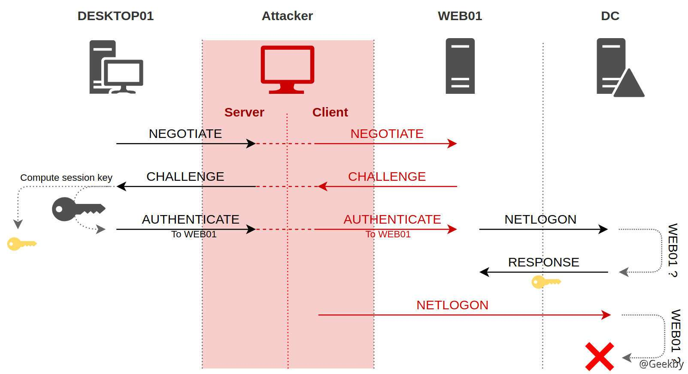

最后，与 `msAvFlags` 一样，在计算 NTLMv2 Hash 时，包含了机器名称，因此，不能在 NTLM 响应中修改机器名称。

## [](#8-channel-binding)8 Channel Binding

本节将讨论最后一个概念。本文反复提到过，身份验证层，即 NTLM 消息，几乎独立于应用层使用的协议（SMB、LDAP 等）。说「几乎」是因为已经看到一些协议使用 NTLM 消息标志来表明会话是否必须签名。

在任何情况下，就目前而言，攻击者很有可能从协议 A 中检索 NTLM 消息，然后使用协议 B 将其发回，称为跨协议中继。


因此，存在一种新的保护措施来对抗这种攻击。这称为通道绑定 (**Channel Binding**)，或 EPA（增强型身份验证保护）。这种保护的原则是将身份验证层与使用中的协议绑定，即使存在 TLS 层（例如 LDAPS 或 HTTPS）。总体思路是，在最后一条 `NTLM AUTHENTICATE` 消息中，有一条信息放在那里，攻击者无法修改。此信息指示所需的服务，以及可能包含目标服务器证书哈希的另一个信息。

### [](#81-service-binding)8.1 Service binding

第一类保护方法很容易理解。如果客户端希望对服务器进行身份验证以使用特定服务，则会在 NTLM 响应中添加标识该服务的信息。

这样，当服务器收到这个认证后，就可以看到客户端请求的服务，如果与实际请求的不一样，就不会同意提供该服务。

由于服务名称在 NTLM 响应中，因此它受到 `NtProofStr` 响应的保护，该响应是此信息、质询和其他信息（例如 `msAvFlags`）的 `HMAC_MD5`。它是用客户端的密钥计算的。

在上图的示例中，客户端尝试通过 HTTP 向服务器验证自己的身份。除了服务器是攻击者，并且攻击者将此身份验证重放到服务器，以访问网络共享 (SMB)。

除了客户端在他的 NTLM 响应中指明了他想要使用的服务，并且由于攻击者无法修改服务信息，攻击者只能按原样重放它。服务器然后接收到最后一条消息，将攻击者（SMB）请求的服务与 NTLM 消息（HTTP）中指定的服务进行比较，拒绝连接，发现两个服务不匹配。


具体来说，所谓的服务其实就是 SPN (**Service Principal Name**)。下图是客户端在其 NTLM 响应中发送 SPN 的数据包。


可以看到它表示客户端将使用 CIFS 服务。将此信息中继到 LDAP 服务器将导致服务器拒绝访问。

同时，该属性不仅有服务名称 (CIFS)，还有目标名称或 IP 地址。这意味着如果攻击者将此消息中继到服务器，服务器也会检查 IP 等字符串，不一致会拒绝连接。

### [](#82-tls-binding)8.2 TLS binding

TLS binging 此保护的目的是将身份验证层（即 NTLM 消息）链接到可能使用的 TLS 层。

如果客户端想要使用封装在 TLS 中的协议（例如 HTTPS、LDAPS），它将与服务器建立 TLS 会话，并计算服务器证书哈希。此哈希称为通道绑定令牌 (**CBT**)。计算完成后，客户端会将这个哈希值放入其 NTLM 响应中。然后，服务器将在身份验证结束时接收 NTLM 消息，读取提供的哈希值，并将其与其证书的真实哈希值进行比较。如果不同，则表示不是 NTLM 信息的原始接收者。

同样，由于此散列在 NTLM 响应中，因此它受 `NtProofStr` 响应的保护，就像服务绑定的 SPN 一样。

由于存在这种类型的保护，以下两种攻击场景就不可能再发生：

1.  如果攻击者想从使用不带 TLS 层的协议的客户端中继到带 TLS 层的协议（例如 HTTP 到 LDAPS），则攻击者由于不能更新 NtProofStr，导致无法将来自目标服务器的证书哈希添加到 NTLM 响应。
2.  如果攻击者想从一个带有 TLS 的协议中继到另一个带有 TLS 的协议（例如 HTTPS 到 LDAPS），在客户端和攻击者之间建立 TLS 会话时，攻击者将无法提供服务器证书，因为它不匹配攻击者的身份。因此，它必须提供伪造的自签证书，以识别攻击者。客户端然后会散列这个证书，当攻击者将 NTLM 响应中继到合法服务器时，响应中的证书 Hash 与真实证书的 Hash 不同，服务器将拒绝身份验证。

下面是说明该种方式的示意图。


图中体现了两个 TLS 会话的建立。一种介于客户端和攻击者之间（红色），一种介于攻击者和服务器之间（蓝色）。客户端将接收攻击者的证书，并计算一个哈希值，即红色的证书哈希值。

在 NTLM 交换结束时，此散列将添加到 NTLM 响应中，并且将受到保护。服务器收到这个 hash 后，会 hash 自己的证书，结果不一样，拒绝连接。

## [](#9-%E5%8F%AF%E4%BB%A5%E8%B7%A8%E5%8D%8F%E8%AE%AE-relay-%E7%9A%84%E5%9C%BA%E6%99%AF)9 可以跨协议 Relay 的场景

有了这些信息，就能够知道哪些协议可以中继到哪些协议。例如，已经阐述了不可能从 SMB 中继到 LDAP 或 LDAPS。另外，客户端如果没有设置 `NEGOTIATE_SIGN` 标志位，且不需要签名，或者 LDAPS 未开启通道绑定，都可以 relay 到 LDAP。

由于案例很多，这里有一个表格总结了其中的一些。

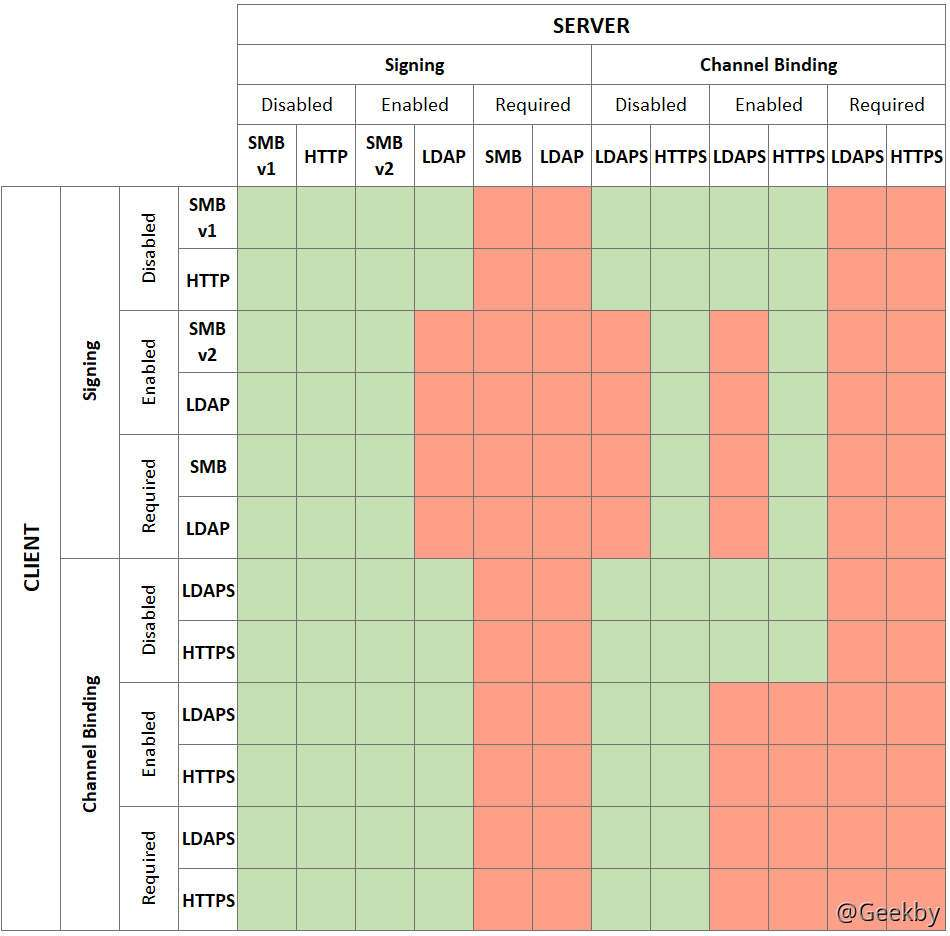

## [](#%E5%8F%82%E8%80%83)参考

-   [Pass the Hash](https://en.hackndo.com/pass-the-hash/#protocol-ntlm)
-   [NTLM Relay](https://en.hackndo.com/ntlm-relay/)
