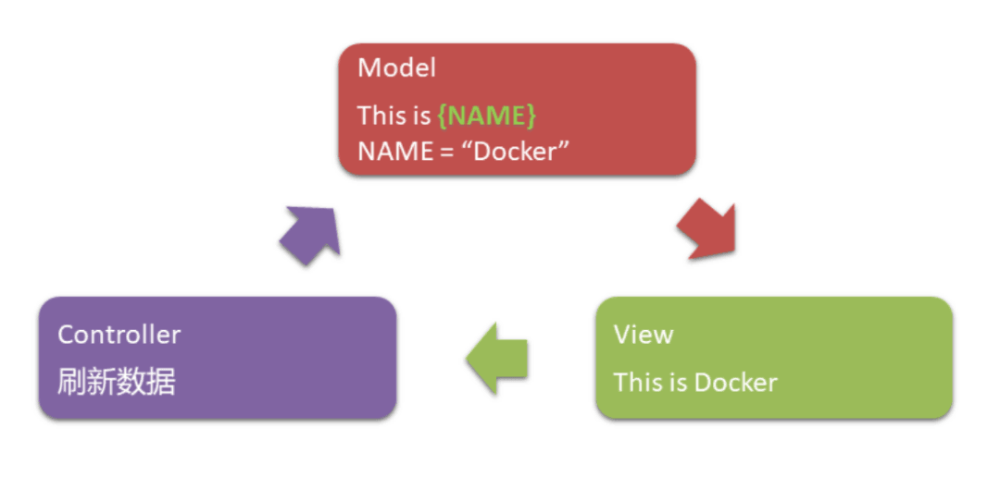

# docker inspect -f(--format) 命令


"大家好，我是幽灵代笔，这篇文章主要介绍`Docker inspect -f(--format)` 命令的实战应用，`docker --format`其实是提供了基于 Go 模板 的日志格式化输出辅助功能，并提供了一些内置的增强函数，这篇文章原文来自博客园 `散尽浮华` 博主，再次基础上增添了命令场景应用案例。"



MVC 框架

## 1\. 什么是模板

上图是大家熟悉的 MVC 框架（Model View Controller）： `Model（模型，通常在服务端）用于处理数据、View（视图，客户端代码）用于展现结果、Controller（控制器）`用于控制数据流，确保 M 和 V 的同步，即一旦 M 改变，V 也应该同步更新。而对于 View 端的处理，在很多动态语言中是通过在静态 HTML 代码中插入动态数据来实现的。例如 JSP 的 `<%=....=%>` 和 PHP 的 `<?php.....?>` 语法。

由于最终展示给用户的信息大部分是静态不变的，只有少部分数据会根据用户的不同而动态生成。比如，对于 docker ls 的输出信息会根据附加参数的不同而不同，但其表头信息是固定的。所以，将静态信息固化为模板可以复用代码，提高展示效率。

## 2\. Go 模板语法

格式： `{{/*注释内容*/}}`

```plain
$ docker network inspect --format='{{/*查看容器的默认网关*/}}{{range .IPAM.Config}}{{.Gateway}}{{end}}' $INSTANCE_ID
```

## 3\. 变量

### 3.1 系统变量 {{.}}

点号表示当前对象及上下文，和 Java、C++ 中的 this 类似。可以直接通过{{.}}获取当前对象。另外，如果返回结果也是一个 Struct 对象（Json 中以花括号/大括号包含），则可以直接通过点号级联调用，获取子对象的指定属性值。

```plain
#可以通过级联调用直接读取子对象 State 的 Status 属性，以获取容器的状态信息：
$ docker inspect --format '{{/*读取容器状态*/}}{{.State.Status}}' $INSTANCE_ID   
```

> **注意**：如果需要获取的属性名称包含点号（比如下列示例数据）或者以数字开头，则不能直接通过级联调用获取信息。因为属性名称中的点号会被解析成级联信息，进而导致返回错误结果。即便使用引号将其包含也会提示语法格式错误。此时，需要通过 `index` 来读取指定属性信息。

```plain
"Options": {
            "com.docker.network.bridge.default_bridge": "true",
            "com.docker.network.bridge.enable_icc": "true",
            "com.docker.network.bridge.enable_ip_masquerade": "true",
            "com.docker.network.bridge.host_binding_ipv4": "0.0.0.0",
            "com.docker.network.bridge.name": "docker0",
            "com.docker.network.driver.mtu": "1500"
        },
```

```plain
# 直接级联调用会提示找不到数据：
$ docker inspect --format '{{.Options.com.docker.network.driver.mtu}}' bridge
<no value>
 
# 用引号括起来会提示语法错误：
$ docker inspect --format '{{.Options."com.docker.network.driver.mtu"}}' bridge
Template parsing error: template: :1: bad character U+0022 '"'
 
# 正确的用法，必须用 index 读取指定属性名称的属性值：
$ docker inspect --format '{{/*读取网络在 hosts 上的名称*/}}{{index .Options "com.docker.network.bridge.name"}}' bridge
docker0
```

实例：

1.  1. 获取容器 ID
    

```plain
$  docker inspect -f '{{.Id}}' prometheus 
9094fdeb64edf75d52189e1b985d0926cf4e6d53880a8f09ab30fc2d6c8a0908
```

1.  1. 获取容器 Name
    

```plain
$ docker inspect --format='{{.Name}}' cadvisor
/cadvisor

$ docker inspect --format='{{.Name}}' cadvisor |cut -d"/" -f2
cadvisor

$ docker inspect --format='{{.Name}}' $(docker ps -aq)  |cut -d"/" -f2
cadvisor
node_exporter
qingscan
mysqlser
```

1.  1. 获取容器 Hostname
    

```plain
$ docker inspect --format '{{ .Config.Hostname }}' cadvisor
681a3c5206b1
```

1.  1. 获取容器镜像名字
    

```plain
$ docker inspect --format='{{.Config.Image}}' cadvisor
google/cadvisor:latest
```

1.  1. 获取容器状态
    

```plain
$ docker inspect -f '{{.State.Status}}' prometheus 
running

$ docker inspect -f '{{"status:"}}{{.State.Status}}' prometheus 
status:running

$ docker inspect -f '{{"status:"}}{{index .State.Status}}' prometheus 
status:running
```

1.  1. 获取容器的`log path`
    

```plain
$ docker inspect --format='{{.LogPath}}' `docker ps -a -q`
/data/docker/containers/681a3c5206b106463a3f4f65a2c44e6ecfe14ff0bc22ee76a153ebdf5e3d4084/681a3c5206b106463a3f4f65a2c44e6ecfe14ff0bc22ee76a153ebdf5e3d4084-json.log
/data/docker/containers/ac80df13976f7cb17ce54768adafdea14a6845c0f7d127b7d146adf52c50c788/ac80df13976f7cb17ce54768adafdea14a6845c0f7d127b7d146adf52c50c788-json.log
/data/docker/containers/6cac92ad7938c33f67f94524ca27caa7c670cb9a19871dcab7af8c6435b557d4/6cac92ad7938c33f67f94524ca27caa7c670cb9a19871dcab7af8c6435b557d4-json.log
/data/docker/containers/e311bdc95cf25fa80962a86e8047b60ec09eabb9db02cbdfa51efd444b3382d2/e311bdc95cf25fa80962a86e8047b60ec09eabb9db02cbdfa51efd444b3382d2-json.log
```

### 3.2 自定义变量

可以在处理过程中设置自定义变量，然后结合自定义变量做更复杂的处理。如果自定义变量的返回值是对象，则可以通过点号进一步级联访问其属性。比如 `{{$Myvar.Field1}}`。

```plain
# 结合变量的使用，对输出结果进行组装展现，以输出容器的所有绑定端口列表：
$ docker inspect --format '{{/*通过变量组合展示容器绑定端口列表*/}}已绑定端口列表：{{println}}{{range $p,$conf := .NetworkSettings.Ports}}{{$p}} -> {{(index $conf 0).HostPort}}{{println}}{{end}}' Web_web_1
 
# 示例输出信息
已绑定端口列表：
80/tcp -> 32770
8081/tcp -> 8081
```

### 3.3 遍历（循环）：range

格式：

```plain
{{range pipeline}}{{.}}{{end}}
{{range pipeline}}{{.}}{{else}}{{.}}{{end}}
```

range 用于遍历结构内返回值的所有数据。支持的类型包括 `array`, `slice`, `map` 和 `channel`。使用要点：

-   • 对应的值长度为 0 时，range 不会执行。
    
-   • 结构内部如要使用外部的变量，需要在前面加 引用，比如 Var2。
    
-   • range 也支持 else 操作。效果是：当返回值为空或长度为 0 时执行 else 内的内容。
    

查看容器网络下已挂载的所有容器名称，如果没有挂载任何容器，则输出 "`With No Containers`"

```plain

        "NetworkSettings": {
            "Bridge": "",
            "SandboxID": "a4ae52dfb055599b4b582d4c91f5a38d297bbed30f3e1d698f1c199be572c1e3",
            "HairpinMode": false,
            "LinkLocalIPv6Address": "",
            "LinkLocalIPv6PrefixLen": 0,
            "Ports": {
                "9090/tcp": [
                    {
                        "HostIp": "0.0.0.0",
                        "HostPort": "9090"
                    }
                ]
            },
            "SandboxKey": "/var/run/docker/netns/a4ae52dfb055",
            "SecondaryIPAddresses": null,
            "SecondaryIPv6Addresses": null,
            "EndpointID": "16dbaea3aef149379a83673284c9adb843dab363246e6eb3255e40b149003580",
            "Gateway": "172.17.0.1",
            "GlobalIPv6Address": "",
            "GlobalIPv6PrefixLen": 0,
            "IPAddress": "172.17.0.2",
            "IPPrefixLen": 16,
            "IPv6Gateway": "",
            "MacAddress": "02:42:ac:11:00:02",
            "Networks": {
                "bridge": {
                    "IPAMConfig": null,
                    "Links": null,
                    "Aliases": null,
                    "NetworkID": "2045baaf0ce3f404298a1a57035b6cc6c91ebd4ee05ce219b818f255c198b44b",
                    "EndpointID": "16dbaea3aef149379a83673284c9adb843dab363246e6eb3255e40b149003580",
                    "Gateway": "172.17.0.1",
                    "IPAddress": "172.17.0.2",
                    "IPPrefixLen": 16,
                    "IPv6Gateway": "",
                    "GlobalIPv6Address": "",
                    "GlobalIPv6PrefixLen": 0,
                    "MacAddress": "02:42:ac:11:00:02"
                }
            }
        }
    }
]
```

实例

1.  1. 获取容器 IP 地址
    

```plain
$ docker inspect --format='{{range .NetworkSettings.Networks}}{{.IPAddress}}{{end}}' prometheus
172.17.0.2

$ docker inspect --format='{{range .NetworkSettings.Networks}}{{.IPAddress}}{{end}}' $(docker ps -q)
172.17.0.3
172.17.0.2
```

1.  1. 获取容器端口映射
    

```plain
$ docker inspect --format='{{range $p, $conf := .NetworkSettings.Ports}} {{$p}} -> {{(index $conf 0).HostPort}} {{end}}' prometheus
 9090/tcp -> 9090 
```

1.  1. 获取容器 MacAddress
    

```plain
$ docker inspect --format='{{range .NetworkSettings.Networks}}{{.MacAddress}}{{end}}' $(docker ps -a -q)
02:42:ac:11:00:03
02:42:ac:11:00:02
02:42:ac:14:00:02
```

1.  1. 获取 Hostname Name IP
    

```plain
$ docker inspect --format 'Hostname:{{ .Config.Hostname }}  Name:{{.Name}} IP:{{range .NetworkSettings.Networks}}{{.IPAddress}}{{end}}' $(docker ps -q)
Hostname:681a3c5206b1  Name:/cadvisor IP:172.17.0.3
Hostname:ac80df13976f  Name:/node_exporter IP:172.17.0.2
```

## 4\. index

如果返回结果是一个 map, slice, array 或 string，则可以使用 index 加索引序号（从零开始计数）来读取属性值。

```plain
$ docker inspect --format='{{(index (index .NetworkSettings.Ports "9090/tcp") 0).HostPort}}'  prometheus
9090
```

## 5\. 判断

### 5.1 not

返回单一参数的布尔否定值，即返回输入参数的否定值。

```plain
# 如果容器的 restarting 设置为 false，则返回信息“容器没有配置重启策略”
$ docker inspect --format '{{if not .State.Restarting}}容器没有配置重启策略{{end}}' $(docker ps -q)
容器没有配置重启策略
```

### 5.2 or

-   • `{{or x y}}`: 表示如果 x 为真返回 x，否则返回 y。
    
-   • `{{or x y z}}`：后面跟多个参数时会逐一判断每个参数，并返回第一个非空的参数。如果都为 false，则返回最后一个参数。
    
-   • 除了 null（空）和 false 被识别为 false，其它值（字符串、数字、对象等）均被识别为 true。
    

示例：

```plain
$ docker inspect --format '{{or .State.Status .State.Restarting}}' $(docker ps -q)
running
```

### 5.3 判断条件

判断语句通常需要结合判断条件一起使用，使用格式基本相同：

```plain
{{if 判断条件 .Var1 .Var2}}{{end}}
```

go 模板支持如下判断方式：

1.  1. `eq`: 相等，即 arg1 == arg2。比较特殊的是，它支持多个参数进行与比较，此时，它会将第一个参数和其余参数依次比较，返回下式的结果：
    

```plain
{{if eq true .Var1 .Var2 .Var3}}{{end}}
```

效果等同于：

```plain
arg1==arg2 || arg1==arg3 || arg1==arg4 ...
2) ne: 不等，即 arg1 != arg2。
3) lt: 小于，即 arg1 < arg2。
4) le: 小于等于，即 arg1 <= arg2。
5) gt: 大于，即 arg1 > arg2。
6) ge: 大于等于，即 arg1 >= arg2。
```

### 5.4 判断示例

```plain
{{if pipeline}}{{end}}
{{if pipeline}}{{else}}{{if pipeline}}{{end}}{{end}}
{{if pipeline}}{{else if pipeline}}{{else}}{{end}}
```

```plain
# 输出所有已停止的容器名称：
$ docker inspect --format '{{if ne 0.0 .State.ExitCode}}{{.Name}}{{end}}' $(docker ps -aq)
$ docker inspect --format '{{if ne 0.0 .State.ExitCode}}{{.Name}}{{else}}该容器还在运行{{end}}' $(docker ps -aq)
$ docker inspect --format '{{if ne 0.0 .State.ExitCode}}{{.Name}}{{else if .}}该容器还在运行{{end}}' $(docker ps -aq)
 
# 输出所有已停止或配置了 Restarting 策略的容器名称
$ docker inspect --format '{{if ne 0.0 .State.ExitCode}}{{.Name}}{{else if eq .State.Restarting true}}容器{{.Name}}配置了 Restarting 策略.{{else}}{{end}}' $(docker ps -aq)
```

## 6\. 打印信息

`docker --format` 默认调用 go 语言的 print 函数对模板中的字符串进行输出。而 go 语言还有另外 2 种相似的内置函数，对比说明如下：

-   • `print`：将传入的对象转换为字符串并写入到标准输出中。如果后跟多个参数，输出结果之间会自动填充空格进行分隔。
    
-   • `println`: 功能和 print 类似，但会在结尾添加一个换行符。也可以直接使用 {{println}} 来换行。
    
-   • `printf`: 与 shell 等环境一致，可配合占位符用于格式化输出。
    

```plain
$ docker inspect --format '{{.State.Pid}}{{.State.ExitCode}}' $INSTANCE_ID
240390
 
$ docker inspect --format '{{print .State.Pid .State.ExitCode}}' $INSTANCE_ID
24039 0
 
$ docker inspect --format '{{.State.Pid}}{{println " 从这换行"}}{{.State.ExitCode}}' $INSTANCE_ID
24039 从这换行
0
 
$ docker inspect --format '{{printf "Pid:%d ExitCode:%d" .State.Pid .State.ExitCode}}' $INSTANCE_ID
Pid:24039 ExitCode:0
```

## 9\. 管道

管道 即 `pipeline` ，与 shell 中类似，可以是上下文的变量输出，也可以是函数通过管道传递的返回值。

```plain
{{.Con | markdown | addlinks}}
{{.Name | printf "%s"}}
```

## 10\. 内置函数 len

内置函数 len 返回相应对象的长度

```plain
$ docker inspect --format '{{len .Name}}' prometheus 
11
```

## 11\. Docker 增强模板及函数

Docker 基于 go 模板的基础上，构建了一些内置函数。

### 11.1 json

Docker 默认以字符串显示返回结果。而该函数可以将结果格式化为压缩后的 json 格式数据。示例：

```plain
$ docker inspect nginx -f '{{json .State}}' | jq
{
  "Status": "running",
  "Running": true,
  "Paused": false,
  "Restarting": false,
  "OOMKilled": false,
  "Dead": false,
  "Pid": 23773,
  "ExitCode": 0,
  "Error": "",
  "StartedAt": "2021-08-04T09:27:06.018089509Z",
  "FinishedAt": "0001-01-01T00:00:00Z"
}
```

### 11.2 join

用指定的字符串将返回结果连接后一起展示。操作对象必须是字符串数组。

```plain
# 查看容器的 Entrypoint 命令
$ docker ps --no-trunc
CONTAINER ID                                                       IMAGE                              COMMAND                                                                                                                                           CREATED      STATUS      PORTS                                       NAMES
681a3c5206b106463a3f4f65a2c44e6ecfe14ff0bc22ee76a153ebdf5e3d4084   google/cadvisor:latest             "/usr/bin/cadvisor -logtostderr"                                                                                                                  9 days ago   Up 9 days   0.0.0.0:8080->8080/tcp, :::8080->8080/tcp   cadvisor


# 输出容器配置的所有 Entrypoint 参数，以 " , " 分隔：
$ docker inspect --format '{{join .Config.Entrypoint ","}}' cadvisor 
/usr/bin/cadvisor,-logtostderr

$ docker inspect --format '{{join .Config.Entrypoint " "}}' cadvisor 
/usr/bin/cadvisor -logtostderr
```

### 11.3 lower

将返回结果中的字母全部转换为小写。操作对象必须是字符串。

```plain
$ docker inspect --format "{{lower .Name}}" cadvisor 
/cadvisor
```

### 11.4 upper

将返回结果中的字母全部转换为大写。操作对象必须是字符串。

```plain
$ docker inspect --format "{{upper .Name}}" cadvisor 
/CADVISOR
```

### 11.5 title

将返回结果的首字母转换为大写。操作对象必须是字符串，而且不能是纯数字。

```plain
$ docker inspect --format "{{title .State.Status}}"  cadvisor
Running
```

### 11.6 split

**使用指定分隔符将返回结果拆分为字符串列表**。操作对象必须是字符串且不能是纯数字。同时，字符串中必须包含相应的分隔符，否则会直接忽略操作。

```plain
$ docker inspect --format '{{split .HostsPath "/"}}' cadvisor 
[ data docker containers 681a3c5206b106463a3f4f65a2c44e6ecfe14ff0bc22ee76a153ebdf5e3d4084 hosts]
```

"谢谢坚持看能到最后，由于本人能力水平有限，文章或许存在错误、不足，希望大家可以后台留言。最后，本公众号文章的梳理归纳主要目的不仅仅是与大家一起成长、积累知识，而且还有应急之需便于查询。"

参考：

-   • What to Inspect When You're Inspecting\[1\]
    
-   • Docker 格式化输出命令："docker inspect --format" 学习笔记\[2\]
    

#### 引用链接

`[1]` What to Inspect When You're Inspecting: *https://www.ctl.io/developers/blog/post/what-to-inspect-when-youre-inspecting*  
`[2]` Docker 格式化输出命令："docker inspect --format" 学习笔记: *https://www.cnblogs.com/kevingrace/p/6424476.html*