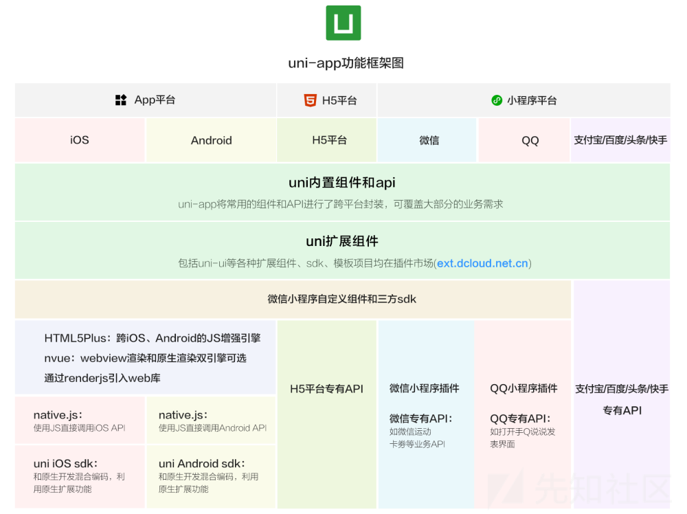
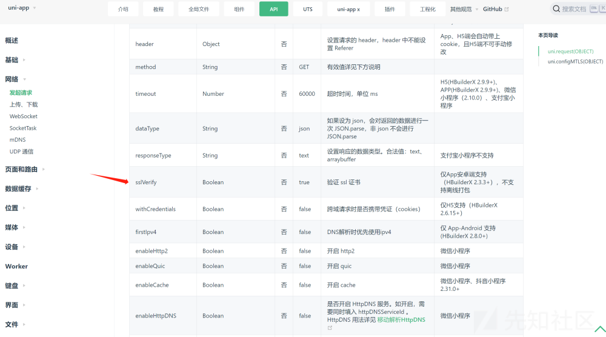
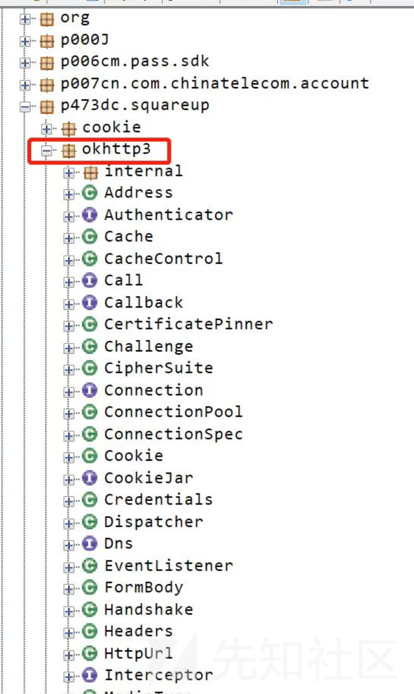
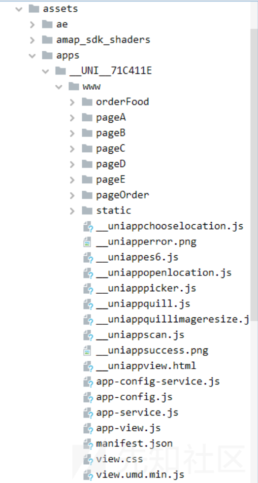
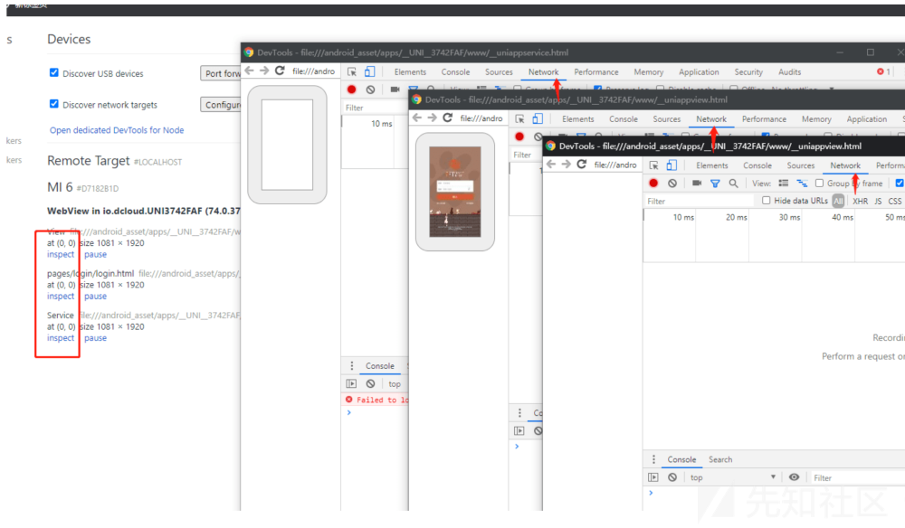

# uni-app开发框架抓包 - 先知社区

uni-app开发框架抓包

- - -

# 1、前言

作为应用移动框架开发，uni-app与React Native和Flutter等移动开发框架具有很强的市场性。出现了很多app都有其身影，因此借遇到的uni-app框架的app并研究其抓流量的手法。  
uni-app 是一个使用 Vue.js 开发所有前端应用的框架，开发者编写一套代码，可发布到iOS、Android、Web（响应式）、以及各种小程序（微信/支付宝/百度/头条/飞书/QQ/快手/钉钉/淘宝）、快应用等多个平台。

# 2、uni-app框架

如图所示  
[](https://xzfile.aliyuncs.com/media/upload/picture/20231101130426-2135e5a0-7874-1.png)  
从图中可以找到uni-app大部分在开发的时候都使用了js去直接调用Android或IOS的API，在运行时分成了视图层和逻辑层，业务代码的执行最终会直接调用Android或IOS的原生API实现。正因为该快应用框架都基于js去调用api从而实现功能，所以关注点可以在业务js上。  
在官网的开发文档中可以得知uni-app是通过uni.request(OBJECT)发起请求，利用sslVerify参数去验证ssl证书，实现应用对ssl证书的校验。  
[](https://xzfile.aliyuncs.com/media/upload/picture/20231101131828-174881b8-7876-1.png)

# 3、手法

## 1、Hook bypass ssl pinning

利用frida去hook掉其证书的校验，对于常规针对使用证书校验的思路来说，这个方法是可行。但是如果存在其他的认证的手法，像本地的证书校验等也会导致失效，具体情况具体分析。大部分的情况下是通用的。

## 2、hook网络请求框架

通过逆向确定网络请求框架，对网络请求框架进行分析，利用hook网络请求框架中的关键函数，打印请求报文和相应报文。  
像比较流行的okhttp网络框架，特点为  
[](https://xzfile.aliyuncs.com/media/upload/picture/20231101133554-86c2ca7e-7878-1.png)  
该框架支持异步和同步请求，无论是异步还是同步请求，都需要调用OkHttpClient对象的newCall(Request)方法，而newCall方法最终会调用RealCall的newRealCall方法获取到一个RealCall对象，异步请求对应RealCall的enqueue方法，而同步请求则对应execute方法，如果继续阅读OkHttp框架源码不难发现enqueue最终还是会回到execute。可以对RealCall这个类的getResponseWithInterceptorChain方法进行Hook，通过反射获取到Request对象originalRequest，然后通过getResult获取到返回值，也就是Reponse对象，后面就是报文的打印。

# 4、案例

某个app用postern抓不到包同时存在加密情况。看到资源文件中的www文件夹联想到是uni-app的框架，直接hook okhttp3。如下

```plain
function main(){
  Java.perform(function () {

    var RequestBody = Java.use("dc.squareup.okhttp3.RequestBody");
    RequestBody["create"].overload('dc.squareup.okhttp3.MediaType', 'java.lang.String').implementation = function (mediaType, str) {
      console.log(str);
      var ret2 = this.create(mediaType, str);
      return ret2;
    };


  });
}
setImmediate(main);
```

[](https://xzfile.aliyuncs.com/media/upload/picture/20231101133803-d3382aac-7878-1.png)  
其加密的内容可以通过js中去寻找答案，即  
[](https://xzfile.aliyuncs.com/media/upload/picture/20231101133947-1158d4f8-7879-1.png)  
根据MVC规范，对数据的加密方法一般在app-config.js或app-server.js里。

## 其他

另外对于app的传输过程中的加密，一是可能存在于app-config或app-server中，二是可以通过js调试即将其变换为h5页面去调试抓包，利用usb和chrome浏览器可做到调试，如图  
[](https://xzfile.aliyuncs.com/media/upload/picture/20231101134113-44e5155c-7879-1.png)
