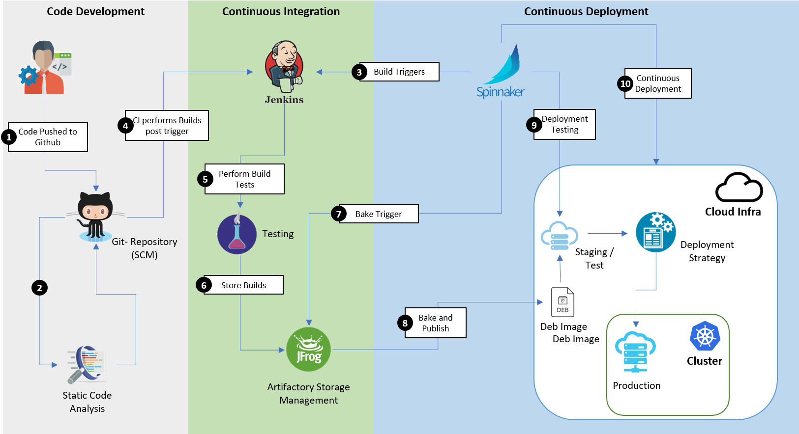
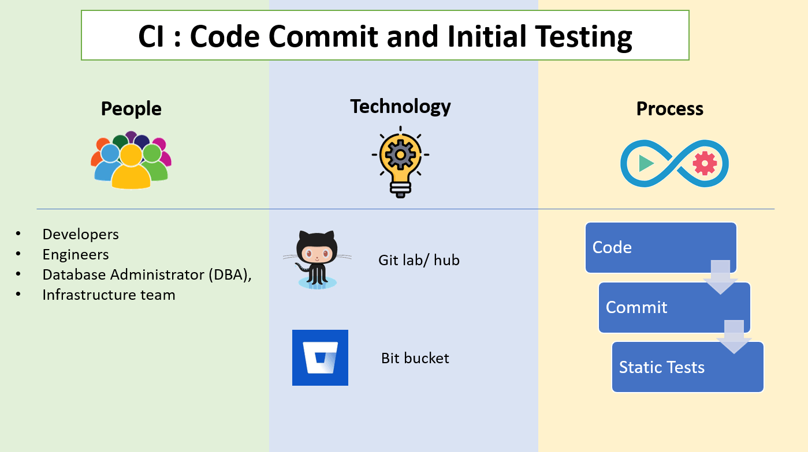
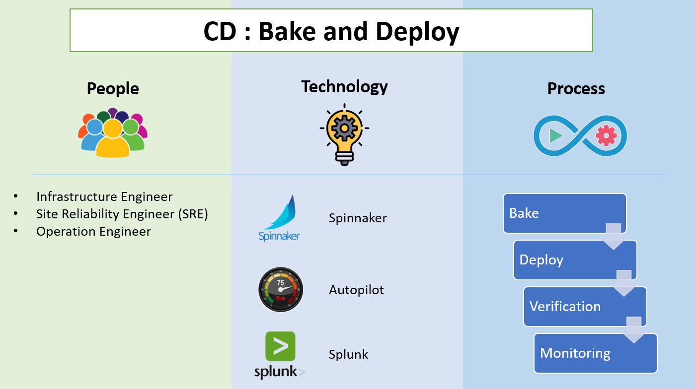
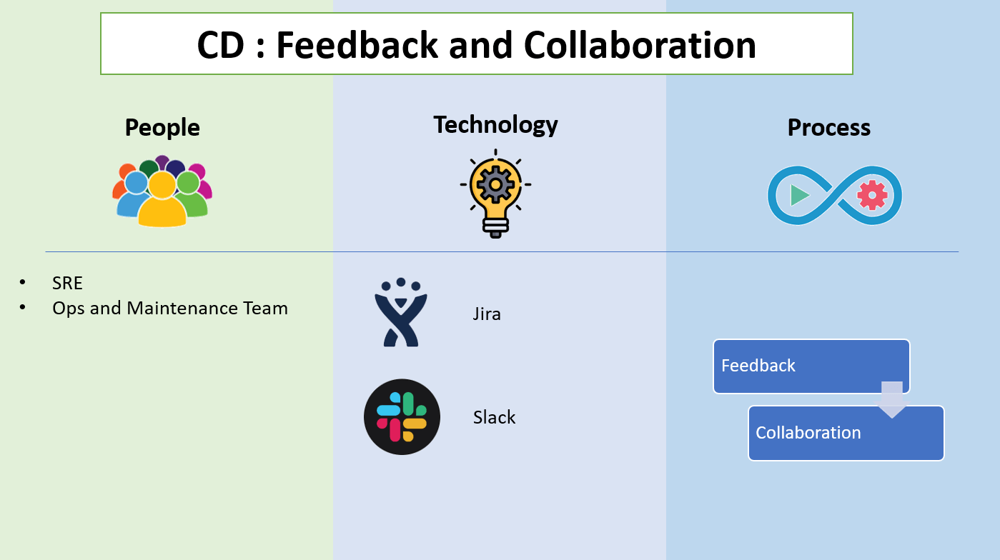

# 一篇文章了解 CI/CD 管道全流程

从 CI/CD 过程开始，包含所有阶段并负责创建自动化和无缝的软件交付的一系列步骤称为 CI/CD 管道工作流。使用 CI/CD 管道，软件发布工件可以从代码提交阶段到测试、构建、部署和生产阶段在管道中移动和前进。这个概念非常强大，因为一旦指定了一个管道，它的一部分或全部就可以实现自动化，从而加快流程并减少错误。换句话说，CI/CD 管道使企业更容易一天自动多次交付软件。  
  
DevOps 工程师经常会因为 CI/CD 中各个阶段的自动化而与 CI/CD 管道混淆。虽然不同的工具可以使 CI/CD 中的各个复杂阶段实现自动化，但由于人工干预，CI/CD 的整个软件供应链仍然可能被打破。那么，就首先了解 CI/CD 过程中的各个阶段，以及 CI/CD 管道为什么对于组织快速、大规模地交付代码至关重要。  
  

### CI/CD 阶段：了解人员、过程和技术

企业应用程序开发团队通常由开发人员、测试人员 / QA 工程师、运营工程师和 SRE（站点可靠性工程师）或 IT 运营团队组成。他们紧密合作，将高质量的软件交付给客户。CI/CD 是两个独立过程的组合：持续集成和持续部署。下面列出了其中的主要步骤。

### CI 持续集成

持续集成 (CI) 是构建软件并完成初始测试的过程。持续部署 (CD) 是将代码与基础设施结合起来的过程，确保完成所有测试并遵循策略，然后将代码部署到预期的环境中。当然，许多公司都有自己的流程，但主要步骤如下。

#### CI：代码提交

人员：开发人员和工程师、数据库管理员（DBA）、基础架构团队  
技术：GitHub、Gitlab、BitBucket  
过程：代码提交阶段也称为版本控制。提交是将开发人员编写的最新更改发送到存储库的操作。开发人员编写的代码的每个版本都被无限期地存储。在与合作者讨论和审查变更之后，开发人员将编写代码，并在软件需求、功能增强、bug 修复或变更请求完成后提交。管理编辑和提交变更的存储库被称为源代码管理（SCM 工具）。在开发人员提交代码（代码推送请求）后，代码更改被合并到存储在中央存储库（如 GitHub）中的基本代码分支中。

#### CI：静态代码分析

人员：开发人员和工程师、数据库管理员（DBA）、基础设施团队、测试人员  
技术：GitHub、Gitlab、BitBucket  
过程：一旦开发人员编写了代码并将其推送到存储库，系统就会自动触发，开始下一个代码分析过程。想象一下这样一个步骤：提交的代码直接进行构建，但在构建或部署过程中失败了。就资源利用率而言，无论是机器还是人力，这都是一个缓慢而昂贵的过程。必须检查代码的静态策略。SAST（Static Application Security Test）：SAST 是一种白盒测试方法，使用 SonarQube、Veracode、Appscan 等 SAST 工具从内部检查代码，以发现软件缺陷、漏洞和弱点（如 SQL 注入等）。这是一个快速检查过程，检查代码是否有语法错误。虽然此阶段缺少检查运行时错误的功能，但这将在稍后的阶段执行。  
  
将附加的策略检查放到自动化管道中可以显著减少稍后在该过程中发现的错误数。

#### CI：build

人员：开发人员和工程师  
技术：Jenkins,、Bamboo CI、Circle CI、Travis CI、Maven、Azure DevOps  
过程：持续集成流程的目标是接受常规的代码提交，并持续构建二进制工件。持续集成过程通过检查添加的新模块是否与现有模块配合良好，有助于更快地发现 bug。这有助于减少验证新代码更改的时间。构建工具有助于编译和创建可执行文件或包（.exe、。dll， .jar 等）取决于用于编写源代码的编程语言。在构建过程中，还会生成 SQL 脚本，然后与基础设施配置文件一起测试。简而言之，构建阶段是编译应用程序的阶段。构建过程的其他子活动包括工件存储、构建验证和单元测试。

#### CI：测试阶段

人员：测试人员和 QA 工程师  
技术：Selenium、Appium、Jmeter、SOAP UI、Tarantula  
过程：发布一个构建过程一系列自动化测试来验证代码的准确性。这一阶段有助于防止错误到达产品。根据构建的大小，此检查可以持续数秒到数小时。对于由多个团队提交和构建代码的大型组织，这些检查将在并行环境中运行，以节省宝贵的时间并尽早将 Bug 通知给开发人员。  
  
这些自动化测试是由测试人员（或者称为 QA 工程师）建立的，他们已经根据用户故事建立了测试用例和场景。他们进行回归分析，压力测试，以检查与预期产出的偏差。测试中涉及的活动有健全性测试、集成测试和压力测试。这是一个非常先进的测试水平。在这里会发现开发代码的开发人员可能不知道的问题。  
  
**集成测试：**  
集成测试是使用 Cucumber、Selenium 等工具来执行的，其中各个应用程序模块作为一个组进行组合和测试，同时评估是否符合指定的功能需求。在集成测试之后，需要有人批准将该组中的更新集移动到下一阶段，这通常是性能测试。这个验证过程可能很麻烦，但它是整个过程的重要组成部分。核查过程中出现了一些新的解决办法。  
  
**负载和压力测试：**  
负载平衡和压力测试也使用自动化测试工具（如 Selenium、JMeter 等）来执行，以检查应用程序在高流量环境下是否稳定和性能良好。此测试通常不会在每个更新上运行，因为完整的压力测试是长期运行的。在发布主要的新功能时，将对多个更新进行分组，并完成完整的性能测试。在单个更新被转移到下一个阶段的情况下，管道可能包括金丝雀测试作为替代方案。

### 持续部署：bake 和部署

人员：基础设施工程师、现场可靠性工程师（SRE）、运维工程师  
技术：Spinnaker、Argo CD、Tekton CD  
过程：测试阶段完成后，清除了标准的代码就可以部署到服务器中，在那里它们将与主应用程序集成。在部署到生产环境之前，它们将被部署到产品团队内部使用的测试 / 暂存或 beta 环境中。在将构建移动到这些环境之前，构建必须经过两个子阶段 Bake 和 Deploy。这两个阶段都是 Spinnaker 固有的。

#### CD：Bake

Bake 是指从源代码中创建一个不可变的映像实例，该实例在生产环境中具有当前配置。这些配置可能是数据库更改和其他基础设施更新之类的内容。Spinnaker 可以触发 Jenkins 来执行这个任务，有些组织更喜欢使用 Packer。

#### CD：部署

Spinnaker 将自动将烘焙的映像传递到部署阶段。这是将服务器组设置为部署到集群的位置。与上述测试过程类似，在部署阶段执行功能相同的过程。部署首先转移到测试、阶段，最后转移到生产环境，然后进行批准和检查。整个过程由 Spinnaker 之类的工具处理。

#### CD：验证

这也是团队优化整个 CI/CD 流程的关键所在。因为现在已经进行了很多测试，所以失败应该很少。但此时的任何故障都需要尽快解决，以便将对最终客户的影响降到最低。团队也应该考虑自动化这部分流程。  
  
部署到生产环境是使用部署策略（如蓝绿部署、金丝雀分析、滚动更新等）执行的。在部署阶段，将监视正在运行的应用程序，以验证当前部署是否正确或是否需要回滚。

#### CD：监控

人员：SRE，运维团队  
技术：Zabbix、Nagios、Prometheus、Elastic Search、Splunk、Appdynamics、Tivoli  
过程：要使一个软件发行版具有故障安全性和健壮性，在生产环境中跟踪发行版的运行状况是至关重要的。应用程序监控工具将跟踪 CPU 利用率和发布延迟等性能指标。日志分析器将扫描底层中间件和操作系统产生的日志流，以识别行为并跟踪问题的来源。在生产过程中出现任何问题时，都会通知相关人员，以确保生产环境的安全性和可靠性。此外，监视阶段帮助企业收集有关新软件更改如何为收入做出贡献的信息，并帮助基础架构团队跟踪系统行为趋势和进行容量规划。

### 持续部署：反馈和协作工具

人员：SRE、Ops 和维护团队  
技术：禅道、ServiceNow、Slack、Email、Hipchat  
DevOps 团队的目标是更迅速、持续地发布，然后不断减少错误和性能问题。这是通过 slack 或电子邮件频繁地向开发人员和项目经理反馈新版本的质量和性能，并在 ITSM 工具中及时提高票价来实现的。通常，反馈系统是整个软件交付过程的一部分；因此交付过程中的任何更改都会频繁地记录到系统中，以便交付团队可以对其采取行动。  
  
企业必须评估一个整体的持续交付解决方案，它可以自动化或促进上述阶段的自动化。
