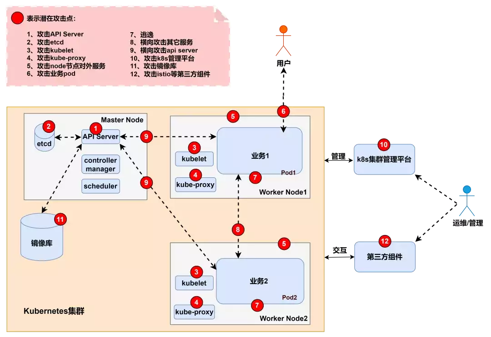

# 【云攻防系列】从攻击者视角聊聊 K8S 集群安全（上）

**前言**

  

作为云原生管理与编排系统的代表，Kubernetes（简称 K8S）正受到越来越多的关注，有报告\[1\]显示，96% 的组织正在使用或评估 K8S，其在生产环境下的市场占有率可见一斑。

K8S 的功能十分强大，其系统复杂性也同样较高，一般而言，程序越复杂则越容易存在安全问题，自然而然地，K8S 集群也同样面临着严重的安全威胁，如 K8S 组件的未授权访问、容器逃逸和横向攻击等。我们说攻和防是相互促进、相伴而生的，作为相关安全人员首先应该从整体上把握业务架构可能面临的安全威胁才有可能做好防护。**本文就以攻击者的视角来聊一聊在 K8S 集群架构下可能存在哪些可攻击的点。**

根据以往的渗透测试经验，我们梳理了 K8S 集群架构下可能存在的安全问题，并在如图 1 的 K8S 集群基础架构图中标注了潜在的攻击点：

  

图 1- K8S 集群攻击点

  

本文共分为上、下两篇，本篇为上篇，主要介绍对 K8S 组件、节点对外服务、业务 pod 的攻击，以及容器逃逸，即对应图 1 的攻击点 1~7。其余内容将在下篇介绍。

**K8S 集群攻击点（1~7）**

**1\. 攻击点 1~4：攻击 K8S 组件**

K8S 组件的问题主要是指各组件的不安全配置，攻击点 1~4 罗列了 4 个比较有代表性的组件问题，即 API Server 未授权访问、etcd 未授权访问、kubelet 未授权访问、kube-proxy 不安全配置。  

  

  

表 1 搜集了各个组件存在隐患的默认端口，供参考：

  

|     |     |
| --- | --- |
| **组件名称** | **默认端口** |
| api server | 8080/6443 |
| dashboard | 8001 |
| kubelet | 10250/10255 |
| etcd | 2379 |
| kube-proxy | 8001 |
| docker | 2375 |
| kube-scheduler | 10251 |
| kube-controller-manager | 10252 |

表 1- K8S 各组件默认端口

**2\. 攻击点 5：攻击节点对外服务**

除了正常的对外业务，可能还会有一些“隐藏”的对外开放服务，这些服务本不该暴露在外网，这种情况或是管理员疏忽所致，亦或是为了方便管理而故意留的一些接口，总之也是一个潜在的攻击点。  

  

说到对 Mysql 的攻击，我们在之前的渗透测试过程中总结了三条 Mysql 的攻击路径可供参考，如图 2：

图 2- Mysql 攻击路径

  

  

2\. 攻击应用程序，获取 pod 的 shell，在 pod 内通过环境变量发现 Mysql 服务的内网地址，然后尝试通过弱口令登录；（对应图 2 中步骤 2-1、2-2）

  

3\. 攻击应用程序，获取 pod 的 shell，并成功逃逸到节点，利用 docker inspect 查看或直接进入当前节点运行的 Mysql 容器，可以看到其环境变量保存着数据库名、root 密码和数据库的登录地址等信息（前提是 Mysql 容器要和应用容器部署在同一节点上，另外环境变量中是否会保存数据库密码等敏感信息取决于 Mysql 容器的具体配置）。（对应图 2 中步骤 3-1、3-2、3-3）

**3\. 攻击点 6：攻击业务 pod**

在云原生环境下，上层应用程序对攻击者来说就像是集群的一个个入口，攻击应用程序的目标就是突破入口，拿到业务环境也就是业务所在 pod 的 shell。  

  

  

尽管进入 pod 后的权限仍然是受限的，但总算是进入了集群内部，接下来可以通过尝试更多攻击手法，比如横向、逃逸等，逐步扩大战果，直至控制整个集群。在那之前，我们对 pod 本地也可以实施一些攻击，如信息搜集、提权、拒绝服务。

**3.1 信息搜集**

  

  

**一是搜集环境信息**，为后续攻击做准备。如下是一些比较有价值的信息，可供参考：

-   OS、Kernel、User 基本信息
    
-   可用的 Capabilities
    
-   可用的 Linux 命令
    
-   挂载情况
    
-   网络情况
    
-   云厂商的 metadata API 信息
    

  

**二是敏感服务发现和敏感信息扫描。**敏感服务发现可以通过扫描内网指定网段的端口，除了 K8S 组件的端口外，还有如下的常见服务端口：

-   ssh：22
    
-   http：80/8080
    
-   https：443/8443
    
-   mysql：3306
    
-   cAdvisor：4194
    
-   nodeport-service：30000-32767
    

  

敏感信息则包括业务相关的敏感文件（比如代码、数据库、业务涉及的 AK/secret 或者重要的配置文件等）、环境变量（可能暴露一些敏感服务信息）、K8S 的 ServiceAccount 信息（默认保存在 /run/secrets/kubernetes.io/serviceaccount/ 目录下）、进程信息（有无敏感服务）等。

  

**3.2 提权**

  

K8S 中有两种提权，一种是 pod 内提权，一种是 K8S 提权。

  

**（一）Pod 内提权**

pod 内提权和传统 Linux 提权差不多，就是将 pod 内普通用户的 shell 提升为 root 权限的 shell。一般来讲，即使拿到了 pod 的 shell 也只能拥有普通用户的权限，此时能做的事情依旧十分有限，所以需要利用提权漏洞拿到 root 权限。提权的方式有很多，比如内核漏洞提权、sudo 提权、suid 提权、cronjob 提权等。

  

值得一提的是，有些内核漏洞也可以用于容器逃逸，比如著名的 DirtyCow（CVE-2016-5195）、DirtyPipe（CVE-2022-0847）等，这在下文的“容器逃逸”部分还会提到。

  

**（二）K8S 提权**

K8S 提权的方式和场景有很多，比如 RBAC 提权\[2\]，还有一些用于 K8S 提权的 Nday，比如 CVE-2018-1002105、CVE-2020-8559 等。

  

**3.3 拒绝服务**

拒绝服务（Denial of Service，DOS）攻击可以从三个层面来看：业务、pod、集群。

  

对业务和 pod 的 DOS 攻击可以通过使用一些压力测试工具或方法进行，主要可从 CPU、内存、存储、网络等方面进行资源耗尽型攻击。在集群外部或 pod 内都有相应的工具或方法，读者可自行搜索。

  

在集群层面的 DOS 攻击主要可以利用 K8S 集群的软件漏洞，如 CVE-2019-11253、CVE-2019-9512、CVE-2019-9514 等。

**4.****攻击点 7：容器逃逸**

在云攻防中，拿到容器/ pod 的 shell 往往只是攻击成功的第一步，因为容器本质上就是 Linux 中的一个进程，但是因为受到了 Namespace 和 Cgroup 等机制的诸多限制导致容器内的进程权限是非常低的，容器逃逸就是为了突破这些限制，所以其实容器逃逸也可以认为是一种提权。导致容器逃逸的原因总结起来可分为如下三类：容器不安全配置，相关组件漏洞和内核漏洞。

  

容器不安全配置分为两种情况，第一种情况是赋予了容器危险权限，第二种情况是容器挂载了危险目录。具体如表 2 所示：

  

|     |     |
| --- | --- |
| **类别** | **不安全配置** |
| 危险权限 | 特权容器 |
|     | cap\_sys\_admin |
|     | cap\_dac\_read\_search |
|     | cap\_sys\_module |
|     | cap\_sys\_ptrace && --pid=host |
| 危险挂载 | 挂载 docker.sock |
|     | 挂载 procfs |
|     | 挂载/、/root、/etc 等文件目录 |
|     | 以 rw 方式挂载 lxcfs |
|     | pod 挂载/var/log |

表 2-容器不安全配置

  

  

危险权限指的是 privileged 权限（特权容器）和危险的 Capabilities 权限（如 cap\_sys\_admin，cap\_sys\_module，cap\_sys\_dac\_search 等），这些都可以在容器启动时通过启动参数设置。如前文所述，容器本质上是一个受限的进程，除了通过 Namespace 和 Cgroup 限制了命名空间和资源外，还有 Capabilities、Apparmor、Seccomp 等安全机制限制了容器内进程的权限，如果容器被赋予了以上的危险权限，相当于限制容器的安全机制被打破，这就给攻击者打开了方便之门。

容器挂载危险目录会导致容器文件系统隔离被打破，进而获得特权。比如如果挂载了 /var/run/docker.sock，那么在容器内就能与 docker 守护进程通信，攻击者就可以创建一个特权容器然后逃逸。

  

这里提到的是容器逃逸攻击手法中最常见的一些不安全配置，此外 CIS Docker Benchmark\[3\] 针对 docker 容器提出的安全配置基准多达上百条，如此多的安全配置要求也导致了相比于漏洞防护，安全配置的问题往往更容易被忽略。而对攻击者而言，容器的不安全配置往往比下文将要提到的相关程序漏洞和内核漏洞更容易检测和利用。

  

**（2）相关组件漏洞**

容器集群环境中包含了非常多的组件程序，它们相互协作，共同构成了庞大的容器服务生态，这些组件包括但不仅限于 runc、containerd、docker、kubelet 等。任何程序都会有漏洞，容器相关的组件程序也不例外，但是这些漏洞和容器不安全配置相比，大多数利用起来都比较困难，例如 CVE-2019-5736 就需要宿主机和容器交互才会触发，而且该漏洞是“一次性使用”的并且容易暴露，因为它会破坏 runc。

  

表 3 总结了一些相关组件的常见漏洞：

  

|     |     |
| --- | --- |
| **组件** | **漏洞** |
| runc | CVE-2019-5736 |
|     | CVE-2019-16884 |
|     | CVE-2021-30465 |
| containerd | CVE-2020-15257 |
|     | CVE-2022-23648 |
| CRI-O | CVE-2022-0811 |
| docker | CVE-2018-15664 |
|     | CVE-2019-14271 |
| kubectl | CVE-2018-1002100 |
|     | CVE-2019-1002101 |
|     | CVE-2019-11246 |
|     | CVE-2019-11249 |
|     | CVE-2019-11251 |
| kubelet | CVE-2017-1002101 |
|     | CVE-2021-25741 |

表 3-容器相关组件的常见漏洞

  

容器和虚拟机最大的不同就是容器和宿主机共享内核，如果宿主机的内核存在漏洞，那么该主机上的所有容器都会受到影响。然而并非所有的内核漏洞都可以用于容器逃逸，下面是一些目前已知的可以用于容器逃逸的内核漏洞：

-   CVE-2016-5195
    
-   CVE-2017-1000112
    
-   CVE-2017-7308
    
-   CVE-2020-14386
    
-   CVE-2021-22555
    
-   CVE-2022-0185
    
-   CVE-2022-0492
    
-   CVE-2022-0847
    

  

同样地，内核漏洞的 EXP 利用起来也有风险，如果盲目尝试甚至有可能会导致目标系统崩溃（如果是在内部渗透测试或对系统进行安全检查时尤其需要注意）。

**总结**

**本篇总结和分享了在 K8S 集群中对 K8S 组件、节点对外服务、业务 pod 进行攻击时和进行容器逃逸时的方法和经验，即图 1 的攻击点 1~7。**在下篇中我们将继续聊一聊图 1 中的攻击点 8~12，包括横向攻击，以及对 K8S 管理平台、镜像库和第三方组件的攻击。

**参考链接**

  

1. https://www.cncf.io/wp-content/uploads/2022/02/CNCF-Annual-Survey-2021.pdf
2. https://published-prd.lanyonevents.com/published/rsaus20/sessionsFiles/18100/2020\_USA20\_DSO-W01\_01\_Compromising%20Kubernetes%20Cluster%20by%20Exploiting%20RBAC%20Permissions.pdf
3. https://github.com/dev-sec/cis-docker-benchmark
4. https://github.com/cdk-team/CDK
5. https://mp.weixin.qq.com/s/WaRECg79Nxx08iekakrlMA