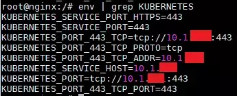
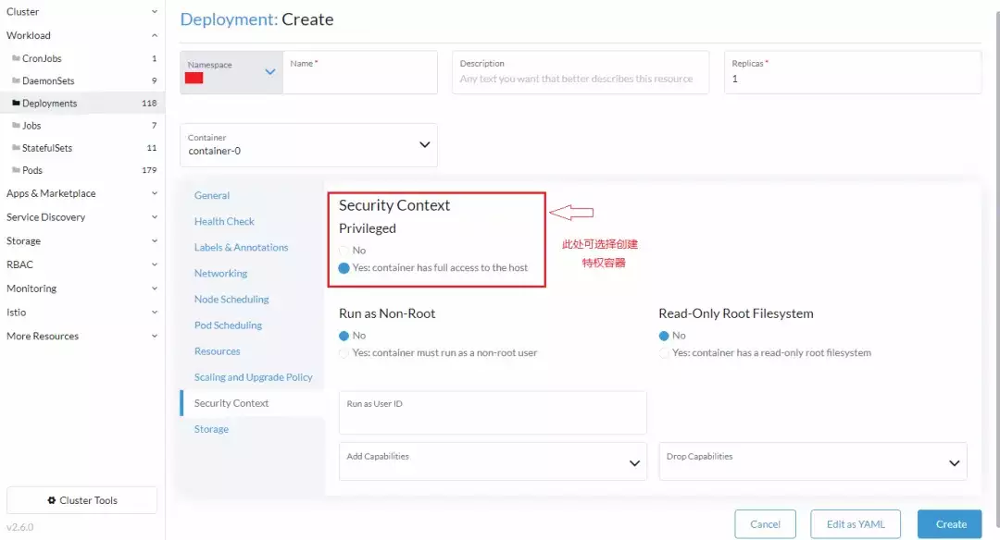

# 【云攻防系列】从攻击者视角聊聊 K8S 集群安全（下）

**前言**

  

[攻击者视角聊聊 K8S 集群安全（上）](http://mp.weixin.qq.com/s?__biz=MzI4NjE2NjgxMQ==&mid=2650263324&idx=1&sn=d5ee820ae70b919fbabc34049780950b&chksm=f3e27568c495fc7edf1a793cbf69a5f5c45378bf06455cc7834ecc9c57862763ddee5f718101&scene=21#wechat_redirect)中总结了在 K8S 集群中对 K8S 组件、节点对外服务、业务 pod 的攻击方法，以及容器逃逸的方法，对应图 1 的攻击点 1~7。**本篇将继续介绍图 1 中攻击点 8~12，即横向攻击、对 K8S 管理平台的攻击、对镜像库的攻击以及对第三方组件的攻击。**  


图 1- K8S 集群攻击点

**K8S 集群攻击点（8~12）**


**攻击点 8~9：横向攻击**

#### **1 攻击其他服务**

  

集群中往往会有一些通过 ClusterIP 暴露在内部的 Service，这些服务在集群外部是扫描不到的，但是在内部 pod 中通过前文提到的信息搜集方法就有可能发现一些敏感服务，比如通过扫描端口或查看环境变量等。

早些时候，我们在一次内部渗透测试中就在目标 pod 的环境变量中发现了 mysql 服务的地址，如图 2：

  


图 2-pod 环境变量中的 Mysql 信息

  

并通过尝试弱口令成功登入了 mysql 数据库：

  


图 3-弱口令登入 Mysql 数据库

####   

#### **2 攻击 API Server**

K8S 集群的 pod 和 API Server 通信是通过 ServiceAccount 的 token 验证身份的，这里存在一个攻击点就是如果 pod 的 ServiceAccount 权限过大，便可以以高权限和 API Server 通信，则有可能查看集群的一些敏感信息或者执行高权限操作，甚至进一步控制集群。

  

token 默认保存在 pod 的 /run/secrets/kubernetes.io/serviceaccount/token 文件，在实际攻击中，API Server 的地址一般可以在 pod 内通过环境变量直接查看，如图 4：

  



图 4-pod 环境变量中的 API Server 信息

  

说到内网 ip 地址，另外补充一下，如果要在 pod 内攻击当前节点的 kubelet，ip 地址一般可以直接用 docker0 网桥的 ip：172.17.0.1。图 5 演示了在 pod 内访问当前节点 kubelet 的 10250 端口：

  


图 5-pod 内访问当前节点 kubelet 的 10250 端口

  

#### **3 中间人攻击**

中间人攻击是一种经典的攻击方式，我们知道在 K8S 集群中 pod 之间也需要通过网络插件如 Flannel、Calico 和 Cilium 等实现网络通信，那么 K8S 集群内部的网络通信有没有可能存在中间人攻击呢？答案是有可能的。

  

在默认配置下的 K8S 集群中，如果攻击者拿到了某个 pod 的权限，接下来就有可能通过中间人攻击，对其他 pod 实现 DNS 劫持\[1\]。

  

另外，早些年 K8S 也曝出过中间人攻击的漏洞，比如 CVE-2020-8554、CVE-2020-10749。


**攻击点 10：攻击 K8S 管理平台**

#### 除了官方推出的 Dashboard，还有很多 K8S 管理平台，比如 Rancher、KubeSphere、KubeOperator 等，K8S 管理平台可攻击的点除了最常见的 Dashboard 未授权访问，还有弱口令登录。  

  

如图 6 是 Rancher 的管理界面，若通过弱口令成功登录到管理后台，后续和 Dashboard 未授权一样，可以通过创建特权容器然后逃逸。

  



图 6-通过 Rancher 创建特权容器

  

Rancher 等管理平台是直接控制着整个集群的，一旦出现安全问题，危害十分严重。从安全的角度讲，管理平台应该尽量避免暴露在外网。


**攻击点 11：攻击镜像库**

####   

#### **1 上传恶意镜像**

上传恶意镜像也叫镜像投毒，指的是攻击者通过上传恶意镜像到公开仓库或受害者本地仓库，然后将恶意镜像伪装成正常镜像以引导受害者使用该镜像创建容器，从而实现入侵。根据入侵的目的一般可将恶意镜像分为两种：入侵容器的恶意后门镜像和入侵宿主机的恶意 EXP 镜像。

  

这类恶意镜像主要是为了控制容器，一般是在受害者使用镜像启动容器后，就会向攻击者反弹一个容器的 shell。这种情况下攻击者可能是为了部署挖矿程序或者攻击容器内运行的业务。

  

（二）恶意 EXP 镜像

这类恶意镜像已经不满足于只入侵容器，因为藏在其中的 Exploit 往往是为了利用容器逃逸漏洞的，其意在获得宿主机的控制权。

#### **2 利用 Nday 攻击镜像库**

这里指的是攻击受害者本地的镜像仓库，如 Harbor、Nexus 等。Harbor 镜像库曾经就存在提权漏洞，危害十分严重。

  

以下是网上\[2\]统计的 Harbor 自发布以来的 6 年时间里曝出的漏洞，供参考：

  

|     |     |     |
| --- | --- | --- |
| **CVE 编号** | **类型** | **风险级别** |
| CVE-2019-16097 | 提权  | 中危  |
| CVE-2019-16919 | 提权  | 中危  |
| CVE-2019-3990 | 用户名枚举 | 中危  |
| CVE-2019-19025 | CSRF | 中危  |
| CVE-2019-19026 | SQL 注入 | 中危  |
| CVE-2019-19029 | SQL 注入 | 中危  |
| CVE-2020-13788 | SSRF | 中危  |
| CVE-2020-13794 | 用户名枚举 | 中危  |
| CVE-2020-29662 | 未授权访问 | 中危  |
| CVE-2019-19023 | 提权  | 中危  |
| CVE-2019-19030 | 枚举  | 低危  |

表 1-Harbor 漏洞

  

其中 CVE-2020-13794 可以枚举用户信息，黑客进一步可以进行暴力破解，虽然不算高危漏洞，但却被认为是影响面最大的漏洞\[2\]，巧的是，我们之前的一次渗透测试中就遇到了存在 CVE-2020-13794 的 Harbor 镜像库。

  

下面简单演示一下该漏洞的验证：

1.先在 Harbor 上注册两个账户 cstest 和 cstest2，

2.然后在本地攻击机执行如下命令：

```plain
curl -X GET "http://[victim-ip]/api/users/search?username=_" -H "accept: application/json" --user cstest:Test123456
```

3\. 看到返回了所有用户的 id 及 username：

  


图 7-CVE-2020-13794 演示


**攻击点 12：攻击第三方组件**

K8S 生态中还会使用一些第三方组件，比如服务网格、API 网关等，这些组件也有可能存在漏洞，比如开源 API 网关 Apache APISIX 的 RCE 漏洞、服务网格 Istio 的未授权访问或 RCE 漏洞等。本文篇幅有限，不再详细讨论，感兴趣的读者可自行去了解。

**总结**

目前云原生攻防技术及产品处于快速发展阶段，社区中已经涌现出很多非常优秀的利用工具和检测工具，这些工具的出现极大地降低了攻击的门槛，且随着云安全受到更多人的关注，也出现了越来越多新的攻击技术，如何保障云上安全成为了业界普遍关心的问题。

  

  


**参考链接**

1.https://github.com/danielsagi/kube-dnsspoof

2.http://blog.nsfocus.net/harbor-2/