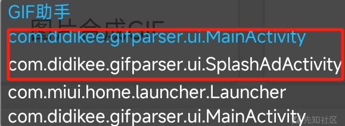
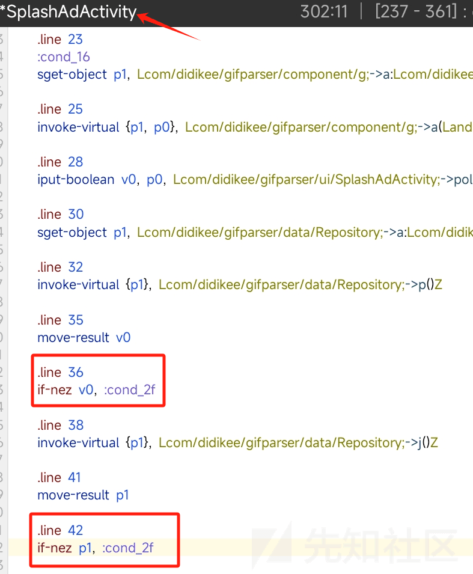
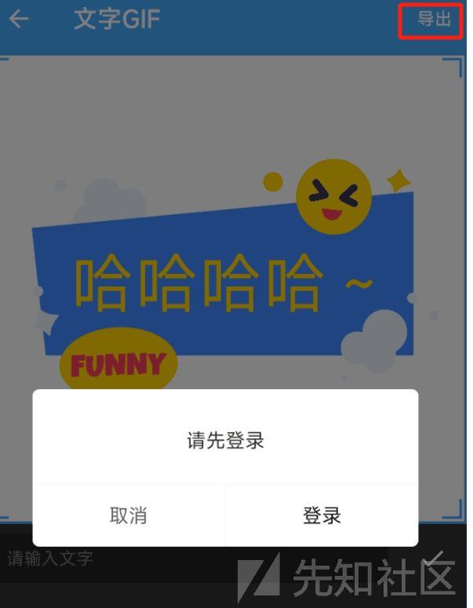
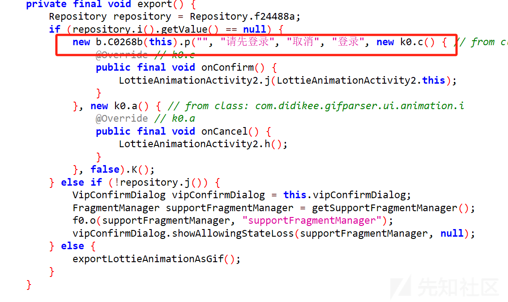
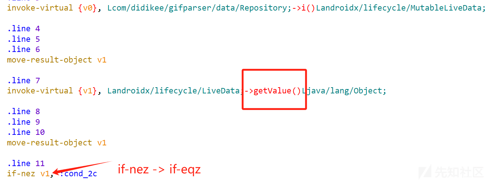
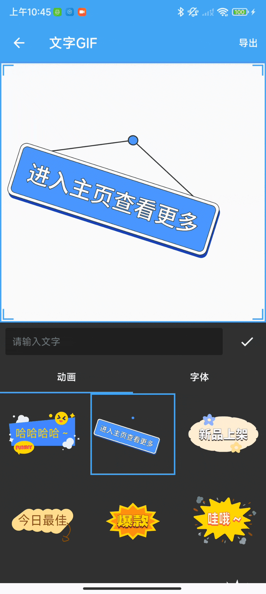
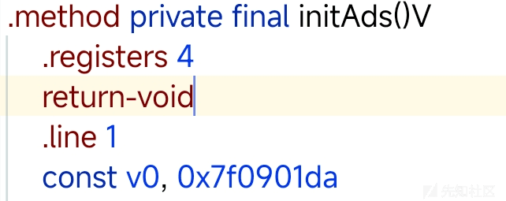

# APK 逆向分析 - 以某 GIF 工具为例 - 先知社区

APK 逆向分析 - 以某 GIF 工具为例

- - -

在之前的文章中，经常用到 MP4 转 GIF，因为很多需要视频展示效果的地方只能转为 GIF 显示在文章中，发现一个 GIF 工具，但是有些功能需要 VIP，所以才有了这篇分享。

## 安装 APP

-   首先用 MT 管理器查看一些信息，发现没有加固。
-   打开应用会出现启动广告，接下来首先要去广告。  
    [](https://xzfile.aliyuncs.com/media/upload/picture/20240125215521-61296f94-bb89-1.png)
-   打开 Activity 记录器，查看 Activity 的跳转情况，可以看出应用启动 Activity 是 SplashAdActivity，然后才是 MainActivity。  
    [](https://xzfile.aliyuncs.com/media/upload/picture/20240125215715-a525253a-bb89-1.png)
-   进入 SplashAdActivity 看一下代码逻辑。其中也有关于用户隐私的代码，可以从下图看出，当同意一次后，就不再显示，相关遍历存储在本地 SharedPreferences 中。好，接着找启动广告的代码。  
    [](https://xzfile.aliyuncs.com/media/upload/picture/20240125221306-dc2f194e-bb8b-1.png)
-   开始找了一圈，发现都是关于 Policy 的函数，没发现关于 AD 的函数，再仔细过一遍，发现关键代码：private final com.ad.topon.kt.g topOnSplash = new com.ad.topon.kt.g();经过查询，发现这是移动广告平台 TopOn 的 SDK，那关于广告的肯定和这个有关，继续找和 topOnSplash 有关的代码。  
    [](https://xzfile.aliyuncs.com/media/upload/picture/20240125222817-faf580b4-bb8d-1.png)
-   从上面的代码可以猜测 com.ad.topon.kt.g gVar = this.topOnSplash 及其后面的代码都是和显示启动广告有关的代码，那可以直接 if (repository.p() && repository.j()) 跳转到 MainActivity 吗？我们接着看这个判断语句。
-   先用 Frida 看一下这两个函数返回的结果。即 repository.p() 和 repository.j() 的结果。一定要在 adb shell 打开 frida 服务器。然后使用**frida-ps -U**命令找到应用名，使用 Attach 模型 hook。也可以使用 Spawn 模式利用包名进行 hook。  
    [](https://xzfile.aliyuncs.com/media/upload/picture/20240125224858-df17331c-bb90-1.png)
-   Frida 代码如下。
    
    ```bash
    function carhook3(){
      let Repository = Java.use("com.didikee.gifparser.data.Repository");
      Repository["p"].implementation = function () {
      console.log('p is called');
      let ret = this.p();
      console.log('p ret value is ' + ret);
      return ret;
    };
    };
    function carhook4(){
      let Repository = Java.use("com.didikee.gifparser.data.Repository");
      Repository["j"].implementation = function () {
      console.log('j is called');
      let ret = this.j();
      console.log('j ret value is ' + ret);
      return ret;
    };
    };
    ```
    
-   Frida hook 的结果如下图所示，但是此时只有 p 函数返回 false，尝试 hook j 函数，发现并没有被调用，此时就想到了**短路求值**的语言特性即对于逻辑与运算符 &&，如果第一个条件为 false，整个表达式的结果已经确定为 false，因此不会再求值后续的条件。当然验证也是比较简单的，即将 p 函数的返回值改为 true，再 hook j 函数。  
    [](https://xzfile.aliyuncs.com/media/upload/picture/20240125225653-fa32b788-bb91-1.png)
-   将 p 函数的返回值改为 true。可以在将 v0 判断前复制为 0x1，也可以将 if-eqz 改为 if-nez.  
    [](https://xzfile.aliyuncs.com/media/upload/picture/20240125230205-b423693a-bb92-1.png)
-   此时 j 函数可以被调用，而且也是返回 false，这下就证明之前的结论是对的。  
    [](https://xzfile.aliyuncs.com/media/upload/picture/20240125230600-4005a9ae-bb93-1.png)
-   接着之前的思路，将 j 的判断条件也取反或者判断前赋值为 0x1.  
    [](https://xzfile.aliyuncs.com/media/upload/picture/20240125230708-689e4ad8-bb93-1.png)  
    [](https://xzfile.aliyuncs.com/media/upload/picture/20240125230857-a9ab22ee-bb93-1.png)
-   保存、编译、签名、重新安装。跳过广告成功，直接进入 MainActivity。下面的 git 是在没有任何后台的情况下首次打开 app，没有启动广告，直接进入。  
    [](https://xzfile.aliyuncs.com/media/upload/picture/20240125231333-4e302de6-bb94-1.gif)

### 会员功能

-   有些功能需要开通会员使用，比如文字 GIF 这一功能。当选择导出的时候会提示先登录，然后登录的账号要是会员。  
    [](https://xzfile.aliyuncs.com/media/upload/picture/20240126100207-e8c9d712-bbee-1.png)
-   使用 Activity 记录器查看当前 Activity，导出文字 git 的 Activity 是 com.didikee.gifparser.ui.animation.LottieAnimationActivity2.进入代码中查看具体逻辑。其实从之前的分析可以看出这个 app 是使用 Kotlin 写的。
-   根据弹窗的关键词“登录”可以找到下面这个关键函数。  
    [](https://xzfile.aliyuncs.com/media/upload/picture/20240126101240-61e47d5e-bbf0-1.png)
-   根据上下文，b.C0268b 应该是个 Dialog 类，用了创建对话框。点击确认后 LottieAnimationActivity2.j(LottieAnimationActivity2.this);其中 j 函数会跳转到 Loginactivity。点击取消，调用 h 函数，函数具体定义为空，和 app 逻辑一直，取消后关闭 Dialog，并无其他操作。
-   从下面的具体函数可以看出，导出后要经过两个判断才会进入真实的导出 gif 函数，repository.j() 函数在之前的 hook 中已经得出会返回 false，而根据后面的代码逻辑中带有 VIP 字样的函数中可以看出，repository.j() 函数是用来判断是否是 VIP。  
    [](https://xzfile.aliyuncs.com/media/upload/picture/20240126102846-a1bb08f6-bbf2-1.png)
-   所以这里我们要进行两个判断条件的修改，看一下具体的 smali 代码。  
    [](https://xzfile.aliyuncs.com/media/upload/picture/20240126104023-4170ca7e-bbf4-1.png)  
    [](https://xzfile.aliyuncs.com/media/upload/picture/20240126104120-633067fa-bbf4-1.png)
-   使用 Np 管理器进行上述修改。修改，打包，签名，安装，测试。结果如下面的 gif 所示，导出直接可以进行，没再弹出要求登录或者开通会员的 Dialog。[](https://xzfile.aliyuncs.com/media/upload/picture/20240126104813-590944bc-bbf5-1.gif)
-   其他功能的修改逻辑如上。都是修改判断条件。
-   针对是否是会员的 repository.j() 函数，也有一个一劳永逸的方法，就是在 j 函数内部，修改其返回值固定位 true。从下面的 j 函数看出，一共有 3 个 return false 的分支，这里就改这三个分支的 smali 代码。
    
    ```bash
    public final boolean j() {
          Object obj;
          o.c value = f24491d.getValue();
          if (value == null) {
              try {
                  obj = com.blankj.utilcode.util.f0.h(g().decodeString(a.f24521c), o.c.class);
              } catch (Exception unused) {
                  obj = null;
              }
              value = (o.c) obj;
              if (value == null) {
                  **return false**;
              }
          }
          if (f0.g(value.l0(), Boolean.TRUE)) {
              return true;
          }
          Long b02 = value.b0();
          if (b02 == null) {
              **return false**;
          }
          if (System.currentTimeMillis() > b02.longValue() * 1000) {            **return false;**
          }
          return true;
      }
    ```
    
-   具体修改如下，经过验证，此方法可以再绕开登录后绕开会会员的限制。  
    [](https://xzfile.aliyuncs.com/media/upload/picture/20240126105723-a162c57a-bbf6-1.png)

### 应用内广告

-   导出后的界面又遇到了应用内广告这个问题。可以看出在导出完成的界面，下面依旧存在广告，接着探索如何去除此类广告。  
    [](https://xzfile.aliyuncs.com/media/upload/picture/20240126105832-ca14bda2-bbf6-1.png)
-   根据 Activity 记录，当前 Activity 为 com.didikee.gifparser.ui.ResultShareActivity,，而且是其他功能在完成后也会进入这个界面，供用于分享或者进行其他操作。
-   和广告有关的函数只有下面这个，该函数是广告初始化的操作，  
    [](https://xzfile.aliyuncs.com/media/upload/picture/20240126110634-e99eb960-bbf7-1.png)
-   查看广告初始化函数的调用，可以发现调用全在 startFlow() 函数中，这里如果修改每次调用的话有多次，那能不能换种思路，直接在 initAds() 函数开始之处就 return 出来，不进行后序的初始化功能。  
    [](https://xzfile.aliyuncs.com/media/upload/picture/20240126110827-2ccb0432-bbf8-1.png)
-   在 initAds 函数开始加 return-void，return-void 指令直接在函数的开头被使用，表示立即返回。这将导致函数执行到此处时立即结束，不会执行后续的任何代码。  
    [](https://xzfile.aliyuncs.com/media/upload/picture/20240126111311-d612a34c-bbf8-1.png)
-   修改如下，保存，打包，签名，安装，验证。  
    [](https://xzfile.aliyuncs.com/media/upload/picture/20240126111545-32477610-bbf9-1.png)
-   效果如下，应用内广告已经没了。  
    [](https://xzfile.aliyuncs.com/media/upload/picture/20240126111742-7789cd18-bbf9-1.png)

### 总结

-   在本文中，我们关闭了应用启动广告和应用内其他广告，并且饶过了登录和解锁了需要会员才可以使用的功能。
-   以上内容仅供学习使用
