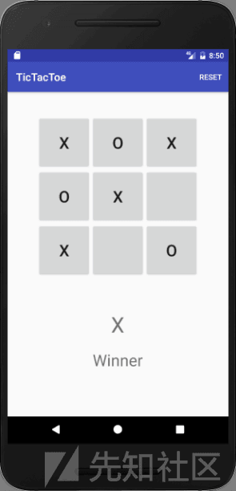
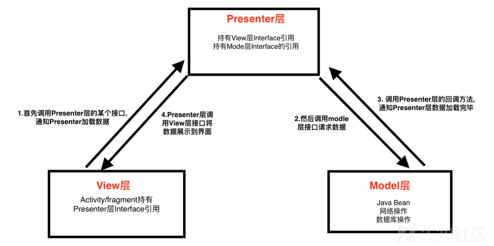
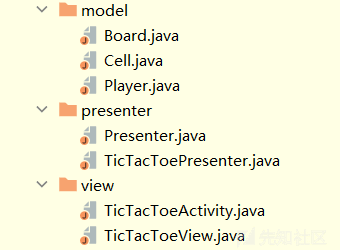
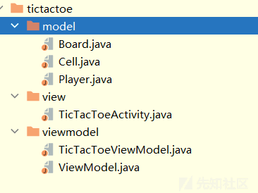

# Android 常用开发架构（附带真实代码） - 先知社区

Android 常用开发架构（附带真实代码）

- - -

> 开发架构是指在软件开发中，将应用程序组织成不同组件的方式和规范。它帮助开发人员更好地组织代码、提高可维护性和可扩展性，并促进团队合作。

-   在分析某 app 的时候，对其使用的 MVP 架构不熟悉，造成了一定的阅读困难和分析障碍，就想着总结一下常用的几个开发架构，并利用真实的 apk 分析一下每个架构的代码逻辑。  
    \## MVC
    
-   MVC 架构将应用程序分为三个主要组件：模型（Model）、视图（View）和控制器（Controller），每个组件都有自己的职责和功能。
    
    -   Model：模型代表应用程序的数据和业务逻辑。它负责处理数据的获取、存储、更新和验证，以及执行与数据相关的业务操作。模型是独立于用户界面的，它不直接与视图进行交互，而是通过控制器来更新和传递数据。
    -   View：视图是用户界面的可视部分，它负责展示数据给用户，并接收用户的输入。视图通常是被动的，它根据模型的状态来更新自己的展示内容。在 Android 中，视图可以是 Activity、Fragment、布局文件等。
    -   Controller：控制器是模型和视图之间的协调者。它接收来自视图的用户输入，并根据输入的类型和内容来更新模型的状态。控制器还负责将更新后的数据传递给视图，以便视图可以更新自己的展示内容。在 Android 中，控制器可以是 Activity、Fragment 等。  
        [](https://xzfile.aliyuncs.com/media/upload/picture/20231109100053-d09b3b32-7ea3-1.png)  
        \### MVC 具体代码逻辑  
        [](https://xzfile.aliyuncs.com/media/upload/picture/20231109100131-e6e7afce-7ea3-1.png)
-   下图为 apk 的文件架构，xml 文件作为 View 模块。  
    [](https://xzfile.aliyuncs.com/media/upload/picture/20231109100510-69b304f8-7ea4-1.png)
-   Controller。其中**`TicTacToeActivity` 就相当于常见的 MainActivity，作为这个小程序的主控制器。接着看一下这个 MainActivity 详细的设计。**
    
    -   初始化
        
        ```bash
        protected void onCreate(Bundle savedInstanceState) {
              super.onCreate(savedInstanceState);
              setContentView(R.layout.tictactoe);
              winnerPlayerLabel = (TextView) findViewById(R.id.winnerPlayerLabel);
              winnerPlayerViewGroup = findViewById(R.id.winnerPlayerViewGroup);
              buttonGrid = (ViewGroup) findViewById(R.id.buttonGrid);
        
              model = new Board();
          }
        /*
        该方法 Activity 创建时设置了布局、获取了界面中的视图对象，
        并创建了一个游戏棋盘的模型对象，为后续的界面操作和游戏逻辑提供基础。
        */
        ```
        
    -   点击落棋
        
        ```bash
        public void onCellClicked(View v) {
        
              Button button = (Button) v;
        
              String tag = button.getTag().toString();
              int row = Integer.valueOf(tag.substring(0,1));
              int col = Integer.valueOf(tag.substring(1,2));
              Log.i(TAG, "Click Row: [" + row + "," + col + "]");
        
              Player playerThatMoved = model.mark(row, col);//调用 model 中下棋的函数，并返回一个 Player 对象
        
              if(playerThatMoved != null) {//判断是否移动了棋子
                  button.setText(playerThatMoved.toString());//棋子是 X or O
                  if (model.getWinner() != null) {//调用 model 中的检查是否有胜者的函数
                      winnerPlayerLabel.setText(playerThatMoved.toString());//显示有了胜者
                      winnerPlayerViewGroup.setVisibility(View.VISIBLE);
                  }
              }
        
          }
        ```
        
-   Model
    
    -   先看一下在控制权中 Click 函数中主要调用的 Board.mark 函数。
        
        ```bash
        /**
        * 标记指定行和列的格子，并返回进行移动的玩家。
        * 
        * @param row 格子所在的行
        * @param col 格子所在的列
        * @return 进行移动的玩家，如果移动无效则返回 null
        */
        public Player mark(int row, int col) {
          Player playerThatMoved = null;
        
          // 检查移动是否有效
          if (isValid(row, col)) {
              // 设置格子的值为当前轮到的玩家
              cells[row][col].setValue(currentTurn);
              playerThatMoved = currentTurn;
        
              // 检查是否是当前玩家的胜利移动
              if (isWinningMoveByPlayer(currentTurn, row, col)) {
                  state = GameState.FINISHED;
                  winner = currentTurn;
              } else {
                  // 切换当前轮到的玩家并继续游戏
                  flipCurrentTurn();
              }
          }
        
          return playerThatMoved;
        }
        
        /**
        * 重新开始游戏，重置格子状态、胜利者、轮到的玩家和游戏状态。
        */
        public void restart() {
          clearCells(); // 清空所有格子的状态
          winner = null; // 重置胜利者
          currentTurn = Player.X; // 将轮到的玩家设置为 X 玩家
          state = GameState.IN_PROGRESS; // 将游戏状态设置为进行中
        }
        
        /**
        * 切换当前轮到的玩家。
        * 如果当前轮到的玩家是 X，则切换为 O；如果是 O，则切换为 X。因为 Play.java 类是只有 X 和 O 的枚举
        */
        private void flipCurrentTurn() {
          currentTurn = (currentTurn == Player.X) ? Player.O : Player.X;
        }
        ```
        
    -   上面是进行标记和切换 Player 的主要函数，一些检测坐标是否越界类似的函数就没放上。Model 中的类进行完棋子的处理后返回给 Controller 一个 Play 类的对象（X or O），然后控制器获取到值后赋值给当前点击的 Button，也就是改变了 View 的值。这样对应了 MVC 架构的一个特性：Model 是独立于用户界面的，它不直接与视图进行交互，而是通过控制器来更新和传递数据。
        
    -   每次落棋后，并从 Model 获取 Play 的值后给 View 中的 Button 赋值后，就会检测是否有胜者，这里也是同样的逻辑：Activity 中调用 Model 中的 getWinner（）函数，或者一个是否有胜者的布尔值，然后根据这个布尔值改变 View 中的组件的值，完成整个游戏。
    -   同时要重置游戏（清空 View 中 9 个 Button 的值），也是与上面的一样的逻辑。这里就不再赘述。

### MVC 的不足

-   视图（View）和控制器（Controller）之间的耦合度较高。
-   View 既是用户界面的显示层，又负责处理用户输入和交互逻辑。这导致视图对象的职责过重，难以维护和测试。同时，控制器也承担了过多的责任，负责处理视图的交互和业务逻辑，导致控制器变得臃肿和难以管理。
-   界面逻辑（即视图和控制器）与业务逻辑（即模型）通常耦合在一起。

## MVP

-   MVP 架构将应用程序分为三个主要组件：模型（Model）、视图（View）和表示器（Presenter）。
-   MVP 的改进
    
    -   MVP 明确划分了视图、业务逻辑和逻辑控制层（Presenter）的责任，使代码更清晰、可维护性更高。
    -   MVP 通过接口将视图和 Presenter 解耦，减少了它们之间的直接依赖，使得各个组件更独立、可重用性更好。
    -   MVP 使得业务逻辑由 Presenter 负责处理，视图只负责展示和用户交互，使得单元测试更容易进行，提高了代码的可测试性。
    -   MVP 将业务逻辑从视图中分离出来，使得业务逻辑更集中、易于管理，提高了代码的可维护性和可扩展性。  
        [](https://xzfile.aliyuncs.com/media/upload/picture/20231109100620-933211b6-7ea4-1.png)  
        \### MVP 具体代码逻辑
-   文件架构  
    [](https://xzfile.aliyuncs.com/media/upload/picture/20231109100733-bed84bdc-7ea4-1.png)
    
-   View 层（Activity/frament 持有 Presenter 层 Interface 引用）
    
    -   初始化函数
        
        ```bash
        protected void onCreate(Bundle savedInstanceState) {
          super.onCreate(savedInstanceState);
          setContentView(R.layout.tictactoe);
        
          // 初始化视图元素
          winnerPlayerLabel = (TextView) findViewById(R.id.winnerPlayerLabel);
          winnerPlayerViewGroup = findViewById(R.id.winnerPlayerViewGroup);
          buttonGrid = (ViewGroup) findViewById(R.id.buttonGrid);
        
          // 创建 Presenter 并进行初始化
          presenter.onCreate();
        }
        ```
        
    -   点击按钮和改变按钮值的函数
        
        -   `onCellClicked` 和`setButtonText`
            
            ```bash
            public void onCellClicked(View v) {
                  // 获取点击的按钮
                  Button button = (Button) v;
                  // 获取按钮的 tag，即按钮在网格中的位置信息
                  String tag = button.getTag().toString();
                  // 提取行和列的索引
                  int row = Integer.valueOf(tag.substring(0,1));
                  int col = Integer.valueOf(tag.substring(1,2));
                  Log.i(TAG, "Click Row: [" + row + "," + col + "]");
            
                  // 调用 Presenter 的方法，通知按钮被选中
                  presenter.onButtonSelected(row, col);
              }
            
              @Override
              public void setButtonText(int row, int col, String text) {
                  // 根据行和列的索引，找到对应的按钮
                  Button btn = (Button) buttonGrid.findViewWithTag("" + row + col);
                  if(btn != null) {
                      // 设置按钮的文本
                      btn.setText(text);
                  }
              }
            ```
            
-   Presenter 层。
    
    -   `onButtonSelected`函数，在 View 中被调用的函数。
        
        ```bash
        public void onButtonSelected(int row, int col) {
          // 在模型中标记玩家的移动，并获取执行移动的玩家
          Player playerThatMoved = model.mark(row, col);
        
          // 如果玩家移动成功
          if(playerThatMoved != null) {
              // 在视图中设置按钮的文本
              view.setButtonText(row, col, playerThatMoved.toString());
        
              // 检查是否有获胜者
              if (model.getWinner() != null) {
                  // 在视图中显示获胜者信息
                  view.showWinner(playerThatMoved.toString());
              }
          }
        }
        ```
        
    -   其中函数调用了 View 中的函数 setButtonText 和 showWinner。其中为了避免将 Activity 与 Presenter 紧密耦合，我们创建了一个接口，由 Activity 实现该接口。在测试中，我们可以基于这个接口创建一个模拟对象，用于测试 Presenter 与视图之间的交互。
        
        ```bash
        public interface TicTacToeView {
          void showWinner(String winningPlayerDisplayLabel);
          void clearWinnerDisplay();
          void clearButtons();
          void setButtonText(int row, int col, String text);
        }
        ```
        
    -   onButtonSelected 函数还调用了 Model 层的函数
        
        -   `model.mark(row, col)`和`model.getWinner() != **null`\*\*
        -   这两个函数和 MVC 中的作用相同，这里不再赘述。
    -   Presenter 层类获取到 Model 层的返回后，直接调用 View 层的接口对视图进行一系列改变。
-   总结
    -   视图层（View）的职责分离：在 MVP 架构中，视图层负责处理用户界面的展示和用户交互，例如在`setButtonText`方法中设置按钮的文本。而 MVC 架构中，视图层通常包含了视图展示和用户交互的逻辑，同时也负责处理部分业务逻辑。
    -   逻辑控制层（Presenter/Controller）的引入：MVP 架构引入了逻辑控制层，即 Presenter，它负责处理业务逻辑，连接视图和模型。在上述代码中，`onButtonSelected`方法就是 Presenter 中的逻辑处理方法。而 MVC 架构中，控制器（Controller）通常负责处理用户的输入和请求，并更新模型和视图。
    -   模型层（Model）的独立性：MVP 架构中的模型层独立于视图和逻辑控制层。在上述代码中，模型层的功能由`model`对象实现，包括标记玩家移动、获取获胜者等操作。而在 MVC 架构中，模型通常由模型对象（Model）表示，并与视图和控制器进行交互。
    -   接口的引入：在 MVP 架构中，通常会使用接口来定义视图和 Presenter 之间的交互契约。上述代码中并未显示接口的定义，但提到了通过接口来解耦 Activity 和 Presenter 的方式。而在 MVC 架构中，通常不需要显式定义接口，视图和控制器之间的交互通过约定和直接调用实现。

### MVP 的不足

-   在 MVP 架构中，视图和 Presenter 之间需要手动进行数据的同步和状态的更新。这意味着开发人员需要编写额外的代码来确保视图与 Presenter 之间的一致性，这可能会导致代码冗余和维护复杂性。
-   在复杂的场景下，Presenter 可能会变得臃肿，因为它负责处理大量的业务逻辑和视图交互。这可能导致 Presenter 变得难以理解和维护。
-   在 MVP 架构中，通常是由视图主动调用 Presenter 的方法来触发相应的逻辑处理。这种单向通信模式在某些情况下可能不够灵活，特别是当需要频繁地进行视图更新时，可能需要额外的代码来处理不同的视图状态。

## MVVM

-   为了解决一些 MVP 架构的缺点，MVVM（Model-View-ViewModel）架构被引入。MVVM 架构引入了 ViewModel 层，它负责管理视图的状态和逻辑，并与视图进行双向绑定。这样可以减少视图和逻辑控制层之间的手动同步，并提供更灵活的视图更新机制。此外，MVVM 架构还支持数据驱动的开发方式，使得程序猿可以更专注于数据的处理和逻辑，而不必过多关注视图的操作。
-   MVVM 由模型层（Model），视图层（View）和 ViewModel 层组成。
    
    -   Model：负责处理数据和业务逻辑。它可以是从网络获取的数据、数据库中的数据或其他数据源。Model 层通常是独立于界面的，可以在多个界面之间共享。（与 MVC 架构中的 Model 作用类似）
    -   View：负责展示数据和与用户进行交互。它可以是 Activity、Fragment、View 等。View 层主要负责 UI 的展示和用户输入的响应。
    -   ViewModel：连接 View 和 Model，作为 View 和 Model 之间的桥梁。它负责从 Model 中获取数据，并将数据转换为 View 层可以直接使用的形式。ViewModel 还负责监听 Model 的数据变化，并通知 View 进行更新。ViewModel 通常是与 View 一一对应的，每个 View 都有一个对应的 ViewModel。  
        [](https://xzfile.aliyuncs.com/media/upload/picture/20231109100823-dc42cf6c-7ea4-1.png)  
        \### MVVM 具体代码逻辑
-   代码架构  
    [](https://xzfile.aliyuncs.com/media/upload/picture/20231109100912-f9d23c84-7ea4-1.png)
    
-   MVVM 架构需要 Data Binding，要在 build.gradle 文件添加以下配置启用 Data Binding。配置成功并在布局文件中正确绑定后重新编译项目将生成与布局文件关联的绑定类，也就是`TictactoeBinding` 。

```bash
android {
    ...
    dataBinding {
        enabled = true
    }
}

//还需要在 xml 布局文件中正确绑定 ViewModel
<data>
    <import type="android.view.View" />
    <variable name="viewModel" type="com.acme.tictactoe.viewmodel.TicTacToeViewModel" />
</data>
```

-   View 层
    
    -   onCreate()
        
        ```bash
        protected void onCreate(Bundle savedInstanceState) {
          super.onCreate(savedInstanceState);
          // 创建 TictactoeBinding 对象并将当前 Activity 的布局与之绑定
          TictactoeBinding binding = DataBindingUtil.setContentView(this, R.layout.tictactoe);
          // 将 ViewModel 对象设置为绑定对象的数据绑定变量
          binding.setViewModel(viewModel);
          // 调用 ViewModel 的 onCreate 方法，执行相关初始化逻辑
          viewModel.onCreate();
        }
        ```
        
    -   在典型的 MVVM（Model-View-ViewModel）模式中，ViewModel 负责处理与视图相关的操作逻辑和数据处理。它充当了视图（Activity 或 Fragment）与数据模型（Model）之间的中间层。所以和之前两个架构不同的是，操作逻辑放在了 ViewModel 中。
        
-   ViewModel
    
    -   `onClickedCellAt`
        
        ```bash
        public void onClickedCellAt(int row, int col) {
          // 用户点击了指定位置的单元格后，触发的点击事件处理函数
        
          // 调用 ViewModel 的方法来处理用户点击事件，并获取移动的玩家
          Player playerThatMoved = model.mark(row, col);
        
          // 更新视图中单元格的状态，将玩家标记放入相应的单元格
          cells.put("" + row + col, playerThatMoved == null ? null : playerThatMoved.toString());
        
          // 更新视图中的胜利者状态，将胜利者信息设置为 ViewModel 中计算得到的胜利者
          winner.set(model.getWinner() == null ? null : model.getWinner().toString());
        }
        ```
        
-   Model 层
    
    -   mark 函数
        
        ```bash
        public Player mark(int row, int col) {
          // 在指定的行和列上标记玩家移动，并返回移动的玩家
        
          Player playerThatMoved = null;
        
          if (isValid(row, col)) {
              // 如果指定的位置有效，则进行标记
        
              // 将当前回合的玩家标记放入对应的单元格
              cells[row][col].setValue(currentTurn);
              playerThatMoved = currentTurn;
        
              if (isWinningMoveByPlayer(currentTurn, row, col)) {
                  // 如果玩家的移动导致胜利，则将游戏状态设置为已结束，并将胜利者设置为当前回合的玩家
                  state = GameState.FINISHED;
                  winner = currentTurn;
              } else {
                  // 如果玩家的移动没有导致胜利，则翻转当前回合的玩家，并继续游戏
                  flipCurrentTurn();
              }
          }
        
          return playerThatMoved;
        }
        ```
        
-   由于代码比较简单，也不好看出 MVVM 架构的特色的优势，这里简单总结一下 MVVM 架构的代码逻辑
    
    -   View 层逻辑：
        -   View 层负责显示和渲染用户界面，并捕获用户的交互事件。
        -   当用户在特定位置的单元格上点击时，触发 `onClickedCellAt()` 函数。
        -   `onClickedCellAt()` 函数将用户的点击事件传递给 ViewModel 层进行处理，并更新视图中的单元格状态和胜利者状态。
    -   ViewModel 层逻辑：
        -   ViewModel 层负责处理与视图相关的操作逻辑和数据处理。
        -   当 `onClickedCellAt()` 函数被调用时，ViewModel 的方法被调用来处理用户点击事件。
        -   ViewModel 的 `mark()` 方法被调用，将用户的点击事件传递给 Model 层进行处理。
        -   ViewModel 接收从 Model 层返回的移动的玩家，并将其转发给 View 层以更新视图中的单元格状态和胜利者状态。
    -   Model 层逻辑：
        -   Model 层负责处理游戏的核心逻辑和数据存储。
        -   在 `mark()` 方法中，Model 层接收到来自 ViewModel 层的用户点击事件，并在指定的行和列上标记玩家的移动。
        -   如果玩家的移动导致胜利，Model 层将游戏状态设置为已结束，并将胜利者设置为当前回合的玩家。
        -   如果玩家的移动没有导致胜利，Model 层翻转当前回合的玩家，并继续游戏。
        -   Model 层返回移动的玩家给 ViewModel 层，供其更新视图中的单元格状态和胜利者状态。
    -   总结：View 层负责显示和渲染界面，捕获用户交互事件并调用 ViewModel 层的方法；ViewModel 层负责处理用户交互事件，并将其传递给 Model 层进行处理；Model 层负责处理核心逻辑和数据存储，并返回处理结果给 ViewModel 层，最终更新视图中的状态。

### MVVM 的不足

-   MVVM 框架通常依赖于数据绑定来实现视图和 ViewModel 之间的自动同步。然而，过度使用数据绑定可能导致代码变得复杂和难以调试。在某些情况下，手动更新视图或处理特定的用户交互可能更加直观和可控。
-   在 MVVM 框架中，ViewModel 层负责管理视图的状态和逻辑。但是，如果 ViewModel 层设计得过于复杂或包含过多的业务逻辑，可能会导致 ViewModel 变得臃肿和难以维护。因此，需要仔细设计和划分 ViewModel 的职责，以确保代码的可读性和可维护性。
-   MVVM 框架中的双向数据绑定机制可以实现视图和 ViewModel 之间的自动更新，但这可能会带来一些性能问题。当数据量较大或频繁更新时，双向绑定可能会带来额外的开销和性能影响。在这种情况下，需要谨慎使用双向绑定，或者进行性能优化和限制。
-   使用 MVVM 框架通常需要引入特定的框架或库，这可能导致项目的依赖性增加。同时，某些框架可能会对代码结构和组织方式有一定的限制，需要按照框架的规范进行开发。这可能会对项目的灵活性和自由度产生一定的影响。这一点不知道是不是劣势，对于使用其他架构开发了很久的开发者接触到新的 MVVM 架构可能受限制较大，缺少一定的自由度，但是统一的规范也提高了，有益于团队之间的合作。对应这种规范性强的框架，新手学起来更有利于好的开发习惯的养成吧。

## 源码

-   [https://www.123pan.com/s/Ysofjv-6cNHA.html](https://www.123pan.com/s/Ysofjv-6cNHA.html)
