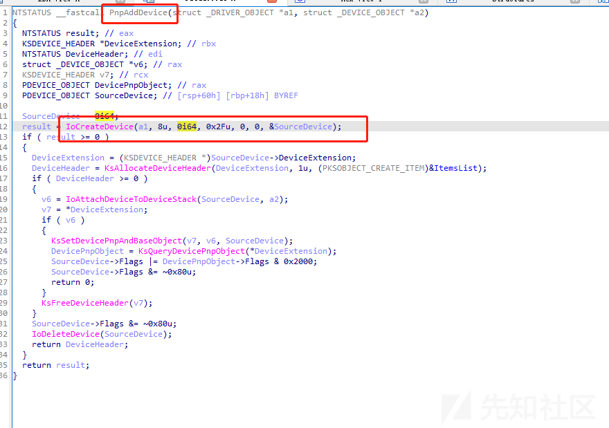
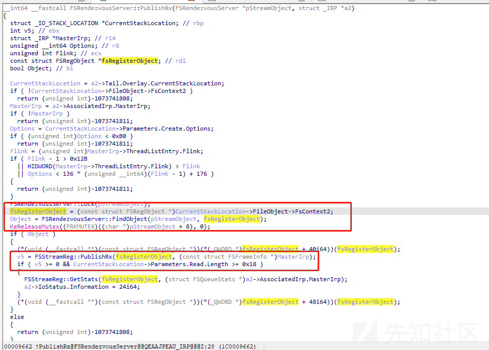
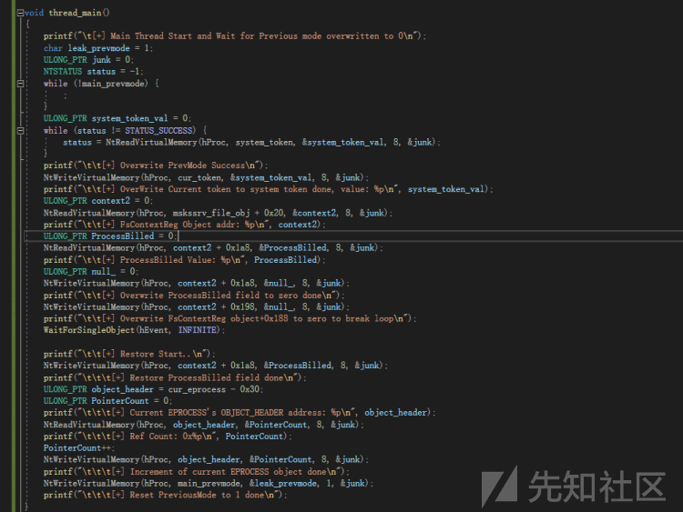
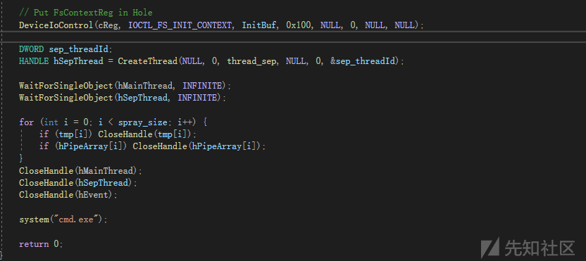
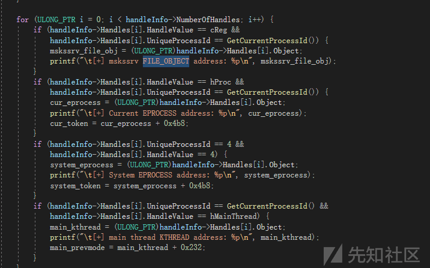
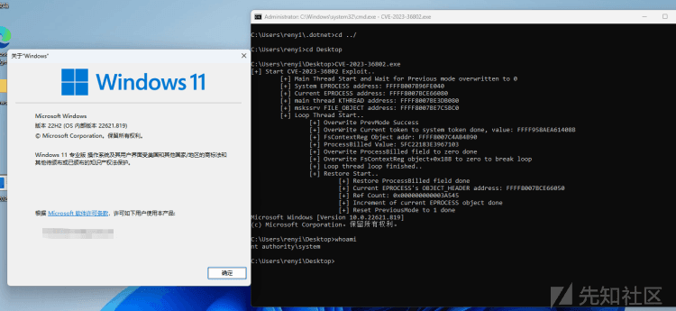

# CVE-2023-36802 漏洞和 exp 分析 - 先知社区

CVE-2023-36802 漏洞和 exp 分析

- - -

**前言 - 分析**：  
此漏洞是 Microsoft Streaming Service Proxy 服务产生的，此服务的文件路径如下

[](https://xzfile.aliyuncs.com/media/upload/picture/20240122230634-d54cbd76-b937-1.png)

[](https://xzfile.aliyuncs.com/media/upload/picture/20240122230646-dc71a6fc-b937-1.png)

根据官方文档也可以知道，此服务的核心代理组件在 mskssrv.sys 中。而且这是一个内核的组件  
漏洞触发的话，需要与驱动程序进行通信，以触发其漏洞。就像之前的 CVE-2023-21768 Windows AFD 一样，都是需要 DeviceIoControl 函数去触发的。  
这就是设计到和驱动程序通信了，windows 上驱动通信首先是需要创建设备对象，然后驱动程序在注册的过程中和 I/O 管理器通信，这时候用户模式下应用程序一般是通过调用 CreateFile 这类函数去打开设备，获取设备的句柄，然后通过文件句柄进行 I/O 请求，通常使用 DeviceIoControl 函数向设备发送 IOCTL（I/O Control Code)  
请求，这时 I/O 请求通过系统调用传递到内核模式下，然后驱动程序通过传递过来的 IRP 实现相应的 IRP 处理例程，根据请求的类型进行处理。像 IOCTL 就使用 IRP\_MJ\_DEVICE\_CONTROL，驱动程序在内核模式下处理 IRP 请求，执行对应的操作，并且与其他系统组件或者硬件进行交互。  
通过 DeviceIoControl 函数触发想要的功能，这时候需要了解一下 DeviceIoControl 函数

```bash
DeviceIoControl(h, IOCTL_FRAMESERVER_INIT_CONTEXT, &buf, sizeof(buf), &buf, sizeof(buf), &bytesReturned, 0);
BOOL DeviceIoControl(
  [in]                HANDLE       hDevice,
  [in]                DWORD        dwIoControlCode,
  [in, optional]      LPVOID       lpInBuffer,
  [in]                DWORD        nInBufferSize,
  [out, optional]     LPVOID       lpOutBuffer,
  [in]                DWORD        nOutBufferSize,
  [out, optional]     LPDWORD      lpBytesReturned,
  [in, out, optional] LPOVERLAPPED lpOverlapped
);
```

首先，从用户模式下的应用程序去访问驱动程序，我们需要 DeviceIoControl 函数而且还需要向驱动程序发送 IOCTL 来去访问它，那么前提上述介绍中也提到了首先还是用通过 CreateFile 来获得驱动程序设备。在 mskssrv. sys 中的函数 PnpAddDevice 可以知道，这是一个 pnp 设备，所以访问这类设备，通常是需要设备的接口路径。  
然后 PnpAddDevice 函数中又调用 IoCreateDevice 函数了。

```bash
NTSTATUS IoCreateDevice(
  IN     PDRIVER_OBJECT DriverObject,
  IN     ULONG          DeviceExtensionSize,
  IN OPT PUNICODE_STRING DeviceName,
  IN     DEVICE_TYPE    DeviceType,
  IN     ULONG          DeviceCharacteristics,
  IN     BOOLEAN        Exclusive,
  OUT    PDEVICE_OBJECT *DeviceObject
);
```

IoCreateDevice 用于创建设备对象。这个函数通常在驱动程序的 DriverEntry 入口点中被调用，用于初始化设备对象，根据参数我们可以知道在 PnpAddDevice 函数中 DeviceName 是 0。（如果 DeviceName 为 NULL，操作系统将为设备生成一个默认名称）

[](https://xzfile.aliyuncs.com/media/upload/picture/20240122230737-fa8e816e-b937-1.png)

在 mskssrv.sys 中当设备创建时，调用驱动程序的 PnpAddDevice，然后我们就可以发送 ioctl 来与将在驱动程序的调度控制函数中执行的设备进行通信。在此之前，我们还需要获取到设备接口，微软文档提供了枚举已经安装的设备接口的方法了。也可以通过下述代码来获取，总之这一点并不费劲。方法很多

[](https://xzfile.aliyuncs.com/media/upload/picture/20240122230752-03921e06-b938-1.png)

```bash
#include <Windows.h>
#include <stdio.h>
#include <cfgmgr32.h>

int main(int argc, char** argv)
{
    GUID class_guid = { 0x3c0d501a, 0x140b, 0x11d1, {0xb4, 0xf, 0x0, 0xa0, 0xc9, 0x22, 0x31, 0x96} };

    WCHAR interface_list[1024] = { 0 };
    CONFIGRET status = CM_Get_Device_Interface_ListW(&class_guid, NULL, interface_list, 1024, CM_GET_DEVICE_INTERFACE_LIST_ALL_DEVICES);
    if (status != CR_SUCCESS) {
        printf("fail to get path\n");
        return -1;
    }
    WCHAR* currInterface = interface_list;
    while (*currInterface) {
        printf("%ls\n", currInterface);
        currInterface += wcslen(currInterface) + 1;
    }
}
```

我们还需要了解一下 DispatchDeviceControl 和 DispatchInternalDeviceControl  
驱动程序的调度例程 (查看 DRIVER\_DISPATCH) 处理 I/O 函数代码分别为 IRP\_MJ\_DEVICE\_CONTROL 和 IRP\_MJ\_INTERNAL\_DEVICE\_CONTROL 的 I/O。  
驱动程序通过调用 IoBuildDeviceIoControlRequest 为基础设备驱动程序创建 IRP。通过调用函数 DeviceIoControl 后者又调用系统服务。I/O 管理器设置 IRP，并将主要函数代码 IRP\_MJ\_DEVICE\_CONTROL 和给定的 I/O 控制代码存储在 Parameters.DeviceIoControl.IoControlCode 的 IO\_STACK\_LOCATION 结构中。然后，I/O 管理器调用链中最高级别驱动程序的 DispatchDeviceControl 例程。对于某些旨在与新驱动程序互操作和支持新驱动程序的系统提供的驱动程序，操作系统还为 IRP\_MJ\_INTERNAL\_DEVICE\_CONTROL 请求定义了一组 I/O 控制代码。

这样就可以通过发送对应的 ioctl 再通过 DispatchDeviceControl 定义的去处理，就可以去触发其中的函数了。  
因为这个驱动就 100 多个函数，所以去查找可以通过 ioctl 去使用的并不费劲如下。  
FSRendezvousServer::InitializeContext  
FSRendezvousServer::InitializeStream  
FSRendezvousServer::RegisterContext  
FSRendezvousServer::RegisterStream  
FSRendezvousServer::DrainTx  
FSRendezvousServer::NotifyContext  
FSRendezvousServer::PublishTx  
FSRendezvousServer::PublishRx  
FSRendezvousServer::ConsumeTx  
FSRendezvousServer::ConsumeRx

这里来看一下漏洞点的 FSRendezvousServer::PublishRx 函数，

[](https://xzfile.aliyuncs.com/media/upload/picture/20240122230832-1bacdee0-b938-1.png)

首先要知道 mskssrv.sys 驱动程序有两个对象：分别为 FSContextReg 对象和 FSStreamReg 对象。  
PublishRx 函数首先从 FsContext2 中拿到流对象 FSRegObject \*fsRegisterObject 之后 -- > 调用函数 FSRendezvousServer::FindObject 来验证指针是否匹配 FSRendezvousServer 存储的两个列表中找到的对象。  
然后再往下进行，流程将会走到 FSStreamReg::PublishRx 函数，而其中的参数是 pStreamObject 和 fsRegisterObject。  
但是 FSRendezvousServer::FindObject 函数检查中确实检测了是否存在 FSStreamReg 对象，随后 fsRegisterObject 对象最后又走到了 FSStreamReg::PublishRx 函数中，但这里却没有检查作为参数接收的对象的类型。所以在 FSRendezvousServer::FindObject 函数这里就会出现类型混淆漏洞。这就会导致我们可以使用 FSContextReg 对象参数去调用 FSStreamReg::PublishRx 函数。

[](https://xzfile.aliyuncs.com/media/upload/picture/20240122230843-21d9493e-b938-1.png)

然后走到 FSStreamReg::PublishRx 函数调用中，这时候参数正常接收到的对象是 FSStreamReg \*fsRegisterObject，但我们修改导致传入的是 FSContextReg 对象，那么就会发生越界（Out of Bound）操作。  
所以 我们使用 DeviceIoControl --> IOCTL\_FRAMESERVER\_PUBLISH\_RX IOCTL 去跟 msrv 通信时，调用过程为：FSRendezvousServer::PublishRx() -->FSRendezvousServer::FindObject--> FSStreamReg::PublishRx()  
最后在 PublishRx() 函数中会处理 FILE\_OBJECT 的 FsContext2 字段中的任何内容，并将用于 FSStreamReg 对象。  
这样最后 FSStreamReg::PublishRx() 函数就会对它认为是 FSStreamReg 对象去进行处理，就会导致越界写等漏洞的产生。  
**Exp 分析**：  
这里采用的主要 Spray the pool 技术。调用 NtFsControlFile 向池喷射大小为 0x80 的对象。

[](https://xzfile.aliyuncs.com/media/upload/picture/20240122230853-280614f4-b938-1.png)

然后我们知道可以常用的利用方法是通过 NtQuerySystemInformation 函数去泄露相关内核对象的地址。  
这样就可以泄露出 KTHREAD 地址 (PreviousMode 的地址)，当前进程和系统进程的 EPROCESS 地址 (当前进程和系统进程的 Token 地址，用作替换完成提权操作)，

[](https://xzfile.aliyuncs.com/media/upload/picture/20240122230941-4493e236-b938-1.png)  
然后漏洞利用是通过 ObfDereferenceObject 函数将 KTHREAD 的 PreviousMode 字段从 1 减少到 0，这样如果 PreviousMode 为 0，就是内核模式，则可以通过 NtReadVirtualMemory 函数和 NtWriteVirtualMemory 函数读写内核地址了。然后 thread\_main 函数里边就是进行内存读写的操作。

[](https://xzfile.aliyuncs.com/media/upload/picture/20240122230949-497b361e-b938-1.png)

而在随后的 thread\_sep 函数，这里就用到了之前提到的 DeviceIoControl 去进行通信，并且设置了 IOCTL 为 IOCTL\_PUBLISH\_RX。这样就可以去调用 FSStreamReg::PublishRx 函数了。  
代码中在一个单独的线程 thread\_sep 中调用 ioctl: 这将调用 FSRendezvousServer::PublishRx 和随后的 FSStreamReg::PublishRx  
然后 FSStreamReg::PublishRx 将在 FsContext2 字段中是一个 FSStreamReg 对象，它是 0x1d8 字节大，而实际上存在一个较小的 FsContextReg 对象，与受控数据相邻，具体内存布局的情况就是下图

[](https://xzfile.aliyuncs.com/media/upload/picture/20240122231000-4fc83652-b938-1.png)

然后，FSStreamReg::PublishRx 将调用 ObfDereferenceObject 对从相邻对象中取出的超出边界的字段。这样再去把当前线程的 PreviousMode 地址放在那，当调用 ObfDereferenceObject 时候就会使主线程的 PreviousMode 减为 0。然后另一个线程就会调用内核地址上的 NtReadVirtualMemory 和 ntwritvirtualmemory 去替换 token 了。

```bash
void thread_sep()
{
    printf("\t[+] Loop Thread Start..\n");
    ULONG_PTR InBuf[0x20] = { 0 };
    InBuf[4] = 0x100000001;
    DeviceIoControl(cReg, IOCTL_PUBLISH_RX, InBuf, 0x100, NULL, 0, NULL, NULL);
    printf("\t\t[+] Loop thread loop finished..\n");
    SetEvent(hEvent);
}
```

[](https://xzfile.aliyuncs.com/media/upload/picture/20240122231020-5bdd46da-b938-1.png)

然后在一组喷射对象中创建一些（Holes）

[](https://xzfile.aliyuncs.com/media/upload/picture/20240122231029-60f38b16-b938-1.png)

执行 IOCTL 操作：通过 DeviceIoControl 执行 IOCTL\_FS\_INIT\_CONTEXT 操作，将 FsContextReg 对象放置在喷射对象的 hole 中，上述内存布局中提到过。

[](https://xzfile.aliyuncs.com/media/upload/picture/20240122231037-65fc62c2-b938-1.png)

从 FILE\_OBJECT 中读取 FsContext2 字段的值，以获得 FsContextReg 对象的地址。读取并将相邻池块头中的 processbilling 覆盖为 NULL。

[](https://xzfile.aliyuncs.com/media/upload/picture/20240122231100-73e49986-b938-1.png)

通过 CreateFileA 函数中拿到设备接口从而去获取到句柄。并且使用 CreateThread 创建两个线程，还使用 WaitForSingleObject 等待这两个线程的结束。线程分别是 thread\_main 和 thread\_sep。  
一个线程 thread\_main 就是使用 NtReadVirtualMemory 读取系统进程令牌，直到读取成功。然后当另一个线程成功覆盖 PreviousMode 之后，thread\_main 就完成读取操作随后使用 NtWriteVirtualMemory 将 System-token 写入当前进程的 EPROCESS。

[](https://xzfile.aliyuncs.com/media/upload/picture/20240122231110-79d984d2-b938-1.png)

[](https://xzfile.aliyuncs.com/media/upload/picture/20240122231114-7c1d5e58-b938-1.png)

这样最后用替换好的 system-token 调用 system 函数执行 cmd 命令。复现成功 如下图所示

[](https://xzfile.aliyuncs.com/media/upload/picture/20240122231124-823f9e40-b938-1.png)

参考： 
[https://cwresearchlab.co.kr/entry/Microsoft-Streaming-Service-Proxy-Elevation-of-Privilege-Vulnerability-CVE-2023-36802](https://cwresearchlab.co.kr/entry/Microsoft-Streaming-Service-Proxy-Elevation-of-Privilege-Vulnerability-CVE-2023-36802)
