# Javascript 逆向：穿越前端保护机制 - 先知社区

Javascript 逆向：穿越前端保护机制

- - -

# Javascript 介绍

Javascript 作为一种用于网页交互的脚本语言而开发的，用于在网页上实现动态效果和用户交互。通过逆向，我们可以深入研究网页代码的安全性，并找出可能存在的问题。

# Console 控制台

consol 是 JavaScript 内的一个原生对象，内部存储的方法大部分都是在浏览器控制台输出一些内容，并且还提供了很多的辅助方法。

## console

**console** 的功能主要在于控制台打印，它可以打印任何字符、对象、甚至 DOM 元素和系统信息

```bash
console.log( ) | info( ) | debug( ) | warn( ) | error( )
#直接打印字符，区别在于展示形态的不同

console.log('console.log');
console.info('console.info');
console.debug('console.debug');
console.warn('consolole.warn');
console.error('console.error');
```

[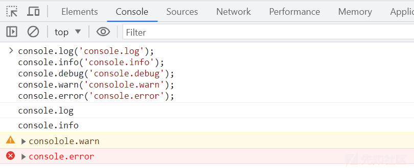](https://xzfile.aliyuncs.com/media/upload/picture/20231108180655-8b909d82-7e1e-1.png)  
可以将打印信息分类：  
[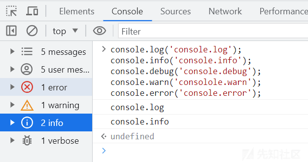](https://xzfile.aliyuncs.com/media/upload/picture/20231108180733-a2377f56-7e1e-1.png)  
log() 与 info() 都对应 info，warn() 对应 warning，error() 对应 error，而 debug() 对应 verbose，因此建议在合适的场景使用合适的打印习惯，这样排查问题时也可以有针对性的筛选。  
比如调试信息可以用 console.debug 仅在调试环境下输出，调试者即便开启了调试参数也不会影响正常 info 的查看，因为调试信息都输出在 verbose 中。

## 占位符

● %o — 对象  
● %s — 字符串  
● %d — 数字  
如下所示，可通过占位符在一行中插入不同类型的值：  
[](https://xzfile.aliyuncs.com/media/upload/picture/20231108195716-f63dab20-7e2d-1.png)  
添加 **CSS** 样式

```bash
console.log('%c hello word','color:blue; font-size: 21px');
```

[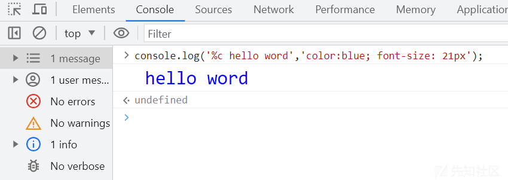](https://xzfile.aliyuncs.com/media/upload/picture/20231108200016-61ce1f32-7e2e-1.png)  
可以看出，console 支持输出复杂的内容，其输出能力堪比 HTML，但输入能力太弱，仅为字符串，因此采用了占位符 + 多入参修饰的设计模式解决这个问题。

**console.dir()**  
按 JSON 模式输出。补充一句：console.log() 会自动判断类型，如果内容是 DOM 属性，则输出 DOM 树，但 console.dir 会强制以 JSON 模式输出，用在 DOM 对象时可强制转换为 JSON 输出。  
[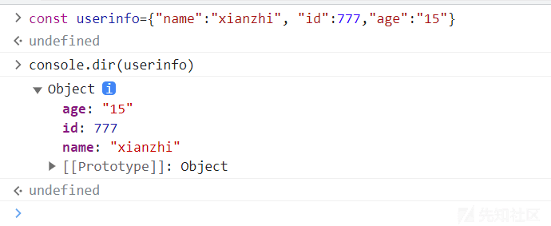](https://xzfile.aliyuncs.com/media/upload/picture/20231108200327-d3a27928-7e2e-1.png)

## for 循环

```bash
for (let i=0; i < 11; i++){
clonse.log(i);
}
```

[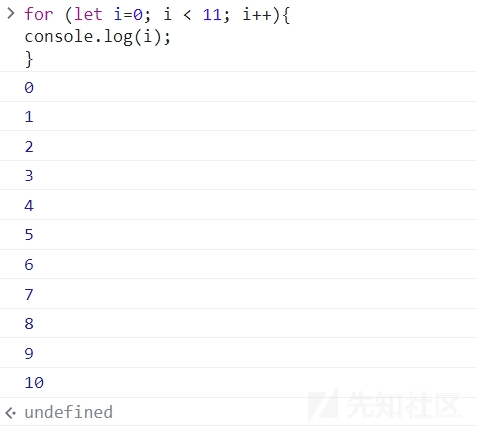](https://xzfile.aliyuncs.com/media/upload/picture/20231108210505-6fd2839e-7e37-1.png)  
**console.count()**  
count() 用来打印调用次数，一般用在循环或递归函数中。接收一个 label 参数以定制输出，默认直接输出 1 2 3 数字  
[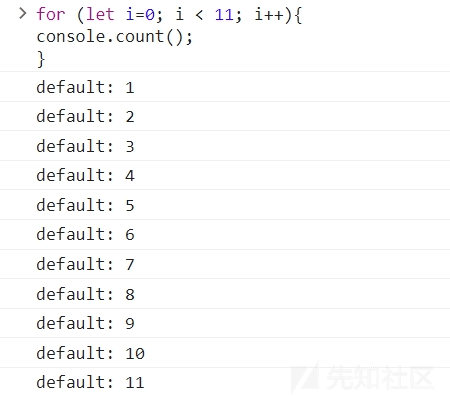](https://xzfile.aliyuncs.com/media/upload/picture/20231108210536-81c45c76-7e37-1.png)

**console.memory**  
打印内存使用情况  
[](https://xzfile.aliyuncs.com/media/upload/picture/20231108210710-b9d7f726-7e37-1.png)

# Javascript 速成

## Javascript 特点

1) 解释型  
2) 弱类型  
3) 区分大小写  
4) 忽略换行和多余空格 (分号;代表语句结束)  
在 retrun 和后面的表达式直接不能有换行  
Javascript 会自动补全分号  
return  
true; 会解析成 return;true;  
内部的 JS：<script> JavaScript </script>  
外部的 JS：<script src="script.js" </script>  
内联 JS：<button onclick="createParagraph()"></button>

```bash
console.log("hello".length) //控制台输出内容（取字符串长度）
"hello".charAt(0)   //得到字符串第一个字符
"hello".replace('h','a')  //a 替换为 h【a 支持正则表达式】
"hello".toUpperCase()  //转换为大写

&& 逻辑与 判断前后是否都为真
|| 逻辑或 判断前后是否有一个为真
!false = true   !true = false

const pi = 3.14  //定义常量
var name = 111  //定义变量 没有作用域，如果在 if 里面，外部也可访问
let name = 222  //定义变量 有作用域，如果在 if 里面，则外部无法访问
```

**变量可以更改，重新定义即可，常量不可改变**

```bash
3+5=8  "3"+4+5=345  3+4+"5"=75
//如果开头为字符串，则全部转换为字符串 如果开头为整数型，则先相加，再转换

123=="123" 返回 true  两个==会自动进行强制类型转换
123==="123" 返回 false  三个===直接比较，比较数字和类型是否相等
```

## 条件语句

```bash
if(条件){
    语句
}else{
    语句
}

while(条件){
    语句
}

do(条件){
    语句
}

for(var name=0;name<5;name++){
    console.log(name)
}
```

[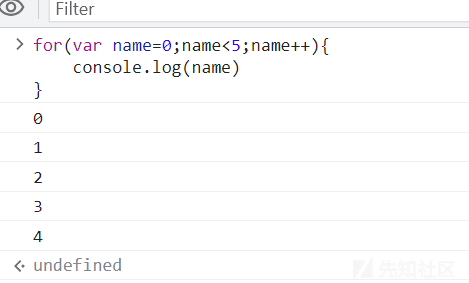](https://xzfile.aliyuncs.com/media/upload/picture/20231109155230-ef063136-7ed4-1.png)

## 三元运算符

条件 ? "yes" : "no" // 条件满足时返回 yes，不满足返回 no

```bash
switch(name){
    case '1':
console.log('2')
    case '2':
    console.log('2')
default:
    console.log('no')
}
```

**对象：**

```bash
var obj = new Object()  //新建对象
var obj2 = {}    //新建对象

obj = {
    name:'xiaochen',
    age:'20',
}

obj.name  obj['name'] //两种调用方法
obj.name = "abc"   //修改对象的值
obj.phone = "88888888"  //添加对象的内容
```

**数组：**

```bash
var name = new Array()  //新建数组
var name = []    //新建数组

name[0] = "xiaochen"  //数组添加内容
name[5] = "20"   //可直接在索引 5 的位置添加内容
name.push["sleep"]   //在末尾添加 sleep 内容
name.pop()    //从末尾删除一个
name.reverse()   //把顺序改为倒序
name.shift()    //删除第一个
name.unshift('lion')   //在第一个位置添加

for(let i=0;i<a.length;i++){
    console.log(a[i])
} //遍历数组：

for(let i in a){
    console.log(a[i])
} //遍历数组（如果索引有空值，则不输出，仅输出存在的值）
```

**函数：**

```bash
function add(a,b){
    c = a+b
    return c
}
add(1,2) //返回 3

document.write('123') 当前页面输出内容
documnet.location  输出当前 url
documnet.cookie  获取当前 cookie
location.href='https://xz.aliyun.com/' URL 跳转
```

[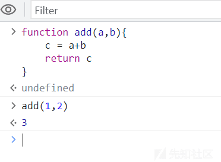](https://xzfile.aliyuncs.com/media/upload/picture/20231109155909-dcd211a0-7ed5-1.png)

# 前端加密 JS 定位

## onClick 定位法

有时候在触发提交表单的标签中会存在一个 onClik 属性，该属性的值正好是一个 js 函数。而这个函数往往就是我们要找的数据加密函数，我们只需要找到它定义的地方即可。Ps：如果需要调试，我们直接可以在控制台进行调试函数，这也就是前面所讲 Console 控制台和 javascript 的原因。

[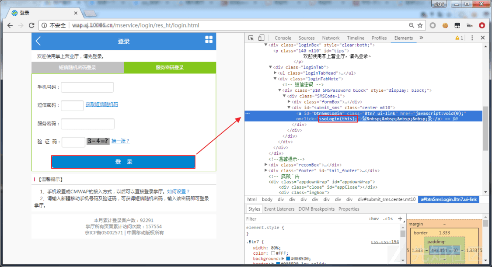](https://xzfile.aliyuncs.com/media/upload/picture/20231110152518-4ca9a74e-7f9a-1.png)

有了加密数据的方法名之后，再找一下该方法在那个 js 文件中定义，就可以定位到相关位置。

[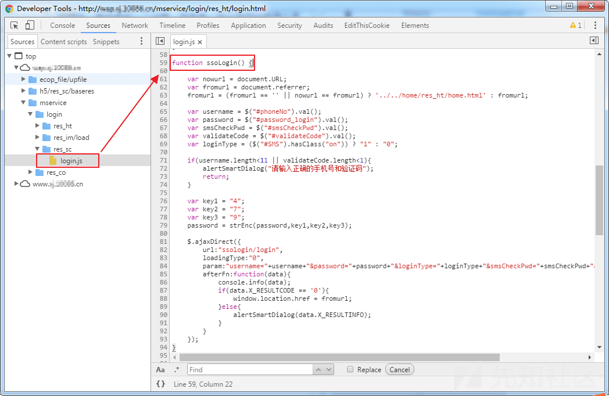](https://xzfile.aliyuncs.com/media/upload/picture/20231110152603-67735782-7f9a-1.png)

## Event Listeners 定位法

F12 打开开发者工具，然后使用选择箭头选择目标标签，最后打开开发者工具 Event Listeners 面板。就能显示该标签对应的额事件了，只需要关注 click 点击事件。  
[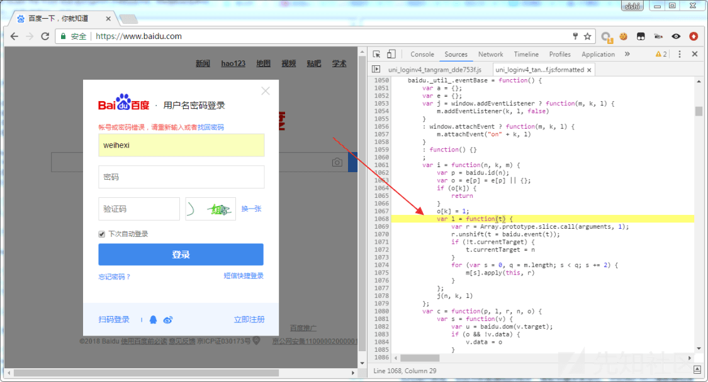](https://xzfile.aliyuncs.com/media/upload/picture/20231110153046-108680ce-7f9b-1.png)  
ps:有时候标签是有绑定方法的，但看到 Event Listeners 面板却是空的。猜测是因为浏览器它没有加载完全所有的数据，导致无法分析出各个元素绑定的方法。这时我们可以进行将登录整个流程走一遍，多次刷新页面，甚至可以 ctrl+s 将网页保存到本地等操作，总之只为一个目的：间接告诉浏览器赶紧将一些网页资源保存下来，以供 Event Listeners 分析出 click 事件对应的方法。

## 搜索定位法

如果遇到的情况很糟糕，页面没有指定 onClick 方法，Event Listeners 怎么操作都是空白一片，Visual Event 也是半死不活的时候。这是我们就只能自己动手，丰衣足食了。当然我承认这种情况基本不可能发生。然而谁还没有个万一呢？  
先将页面 ctrl+s，保存起来。然后使用 notepad++ 搜索保存目录下所有内容。这时我们就要考虑寻找搜索关键字了。搜索操作过程虽然有点繁琐，但很简单。这里我挑比较有意思的选择搜索关键字的思考跟大家分享一下。  
例如：查看到源码中淘宝的登录按钮标签 id 值为 J\_SubmitStatic，于是我以#J\_SubmitStatic 作为关键字开始定位。  
[](https://xzfile.aliyuncs.com/media/upload/picture/20231110153431-96af1eb8-7f9b-1.png)

## 调试法

首选我们在定位的方法中打一个断点，然后在表单输入账号密码，最后点击提交。就可以进入调试模式了。进入调式模式，我们可以单步执行，梳理加密处理的每一步，找到相关的加密函数，编写脚本。  
[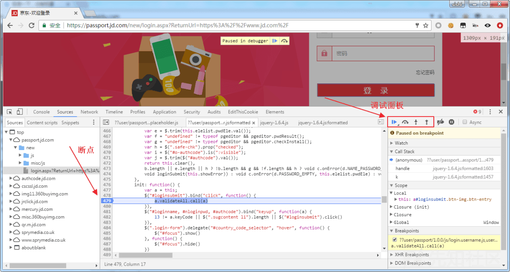](https://xzfile.aliyuncs.com/media/upload/picture/20231110153617-d58f8bb8-7f9b-1.png)

# 实战 1、\*\*视频登录 js 解密

登录地址：[https://domain/login?sourceid=203021&apptype=2&forceAuthn=true&isPassive=false&authType=&display=&nodeId=70027513&relayState=login&weibo=1&callbackURL=http%3A%2F%2Fdomain%2Fmgs%2Fwebsite%2Fprd%2Findex.html%3FisIframe%3Dweb](https://domain/login?sourceid=203021&apptype=2&forceAuthn=true&isPassive=false&authType=&display=&nodeId=70027513&relayState=login&weibo=1&callbackURL=http%3A%2F%2Fdomain%2Fmgs%2Fwebsite%2Fprd%2Findex.html%3FisIframe%3Dweb)

参数名称：enpassword  
如果名字没有定位到 js，那么 class 就可以定位到 js  
[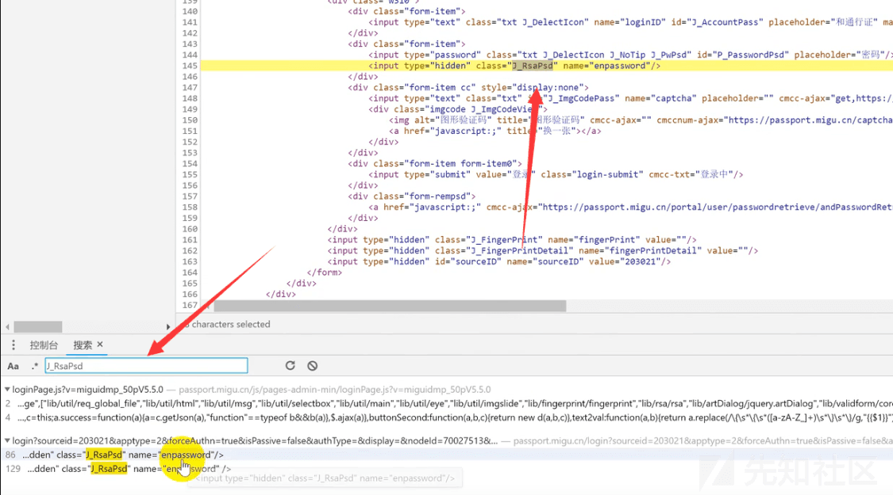](https://xzfile.aliyuncs.com/media/upload/picture/20231110153754-0f8b3362-7f9c-1.png)  
控制台下断点后再运行 按 F10 F11 进入  
一个文件一个文件查看，一个文件全部定位的参数都下定点  
[](https://xzfile.aliyuncs.com/media/upload/picture/20231110153812-1a2ec694-7f9c-1.png)  
选中 b.val 即可查看内容 为刚才提交的密码 222222  
加密完成后的内容为 c.encrypt(b.val())，接着复制这段代码，我们自己构造一个函数，此时的 b.val() 就相当于我们提交的 pwd  
[](https://xzfile.aliyuncs.com/media/upload/picture/20231110153836-28a27d92-7f9c-1.png)  
其中 a.result.modulus 和 a.result.publicExponent 就是从网页返回的值，我们去寻找这个值  
寻找 result，接着我们再去定义一个 a 数组  
[](https://xzfile.aliyuncs.com/media/upload/picture/20231110153929-4826bc32-7f9c-1.png)  
这个时候我们运行，发现 RSAKey 没有被定义，也就是说我们需要再去网页寻找加密的方法  
[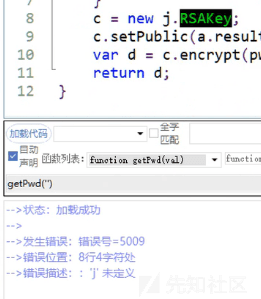](https://xzfile.aliyuncs.com/media/upload/picture/20231110153942-4ff84638-7f9c-1.png)  
选中 j.RSAKey 进入所在的代码块  
[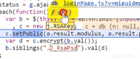](https://xzfile.aliyuncs.com/media/upload/picture/20231110153947-52ef203c-7f9c-1.png)  
[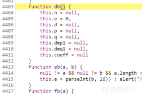](https://xzfile.aliyuncs.com/media/upload/picture/20231110154033-6e434728-7f9c-1.png)  
[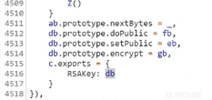](https://xzfile.aliyuncs.com/media/upload/picture/20231110154041-72c8eba4-7f9c-1.png)  
可以看到定位到 db 函数，而 db 就是 RSAKey 的导出函数  
选中最后一个 } 看最上方从哪里开始，全部复制，我们进行改写一下  
[](https://xzfile.aliyuncs.com/media/upload/picture/20231110154113-86040212-7f9c-1.png)  
提示没有，我们直接删除，结尾的括号也一样删除  
[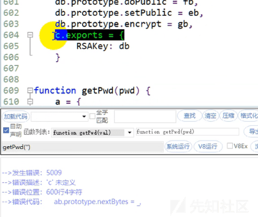](https://xzfile.aliyuncs.com/media/upload/picture/20231110154123-8bfb9004-7f9c-1.png)  
再运行，我们发现 c 没有定义，我们也不需要 c 所以直接删除  
[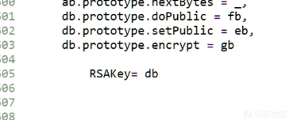](https://xzfile.aliyuncs.com/media/upload/picture/20231110154139-959210a2-7f9c-1.png)  
我们直接调用 RSAKey，把 j 删掉，因为上面我们已经修改定义了 RSAKey=db  
[](https://xzfile.aliyuncs.com/media/upload/picture/20231110154332-d8f4e4aa-7f9c-1.png)  
加载函数，即可看到加密后的值  
[](https://xzfile.aliyuncs.com/media/upload/picture/20231110154346-e15fd172-7f9c-1.png)

# 实战 2、\*天下登录 js 解密

登录地址：[https://domain/](https://domain/)  
常见关键函数：entry() RSAKey()，加密字段参数 pwd  
[](https://xzfile.aliyuncs.com/media/upload/picture/20231110155315-3418bb62-7f9e-1.png)  
可以看到 pwd 直接进行的加密，我们可以直接拿来用  
[](https://xzfile.aliyuncs.com/media/upload/picture/20231110155344-4578f3c2-7f9e-1.png)  
修改后，去寻找 key\_to\_encode  
[](https://xzfile.aliyuncs.com/media/upload/picture/20231110155353-4ac0ef60-7f9e-1.png)  
[](https://xzfile.aliyuncs.com/media/upload/picture/20231110155358-4dda914c-7f9e-1.png)  
接着去寻找 encryptedString 函数  
[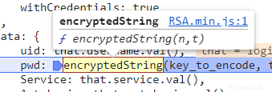](https://xzfile.aliyuncs.com/media/upload/picture/20231110155408-54213a92-7f9e-1.png)  
改后发现缺少 RSAKeyPair，发现这个参数也在刚才的 js 里面  
[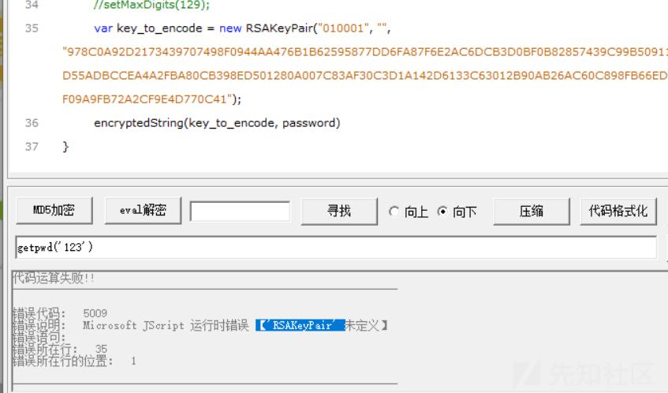](https://xzfile.aliyuncs.com/media/upload/picture/20231110160216-771cc54c-7f9f-1.png)  
我们直接把全部 js 复制，不调用的函数直接删掉  
ok，解密成功  
[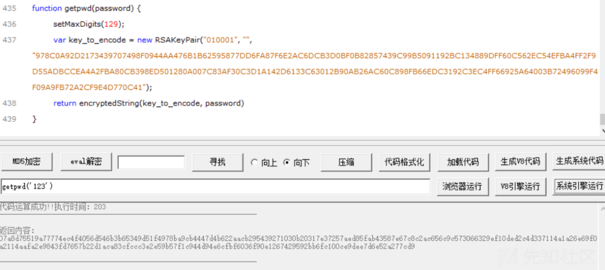](https://xzfile.aliyuncs.com/media/upload/picture/20231110160235-8263847c-7f9f-1.png)
