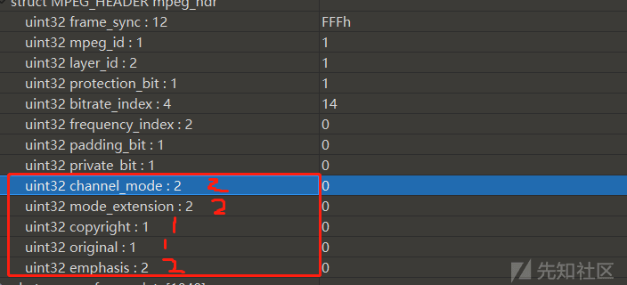

# MP3 の private_bit - 先知社区

MP3 の private\_bit

- - -

# MP3 private\_bit 隐写

# 基础知识

```bash
typedef FrameHeader

{// 类型     字段名:bit 数
unsigned int sync:12;                        //同步信息
unsigned int version:2;                      //版本
unsigned int layer: 2;                       //层
unsigned int error protection:1;             //CRC 校验
unsigned int bitrate_index:4;                //位率
unsigned int sampling_frequency:2;           //采样频率
unsigned int padding:1;                      //帧长调节
unsigned int private:1;                      //保留字【通常藏有 flag】
unsigned int mode:2;                         //声道模式
unsigned int mode extension:2;               //扩充模式
unsigned int copyright:1;                    //版权【通常藏有 flag】
unsigned int original:1;                     //原版标志
unsigned int emphasis:2;                     //强调模式
}
```

-   帧长度是压缩时每一帧的长度， `包括帧头` 的 4 个字节（32bit）。它将填充的空位也计算在内。
-   **padding** 的值会影响**每一帧的长度**（具体分析见下面的题目），因为只有 1 位，因此长度也只限于在 0 和 1 之间变化

# 例题

## mf 数组根据 private\_bit 数据

下载附件，直接 010 看一下

[](https://xzfile.aliyuncs.com/media/upload/picture/20240208222303-91923076-c68d-1.png)

基本上都由**mf\[\]数组**组成，具体看一下

[](https://xzfile.aliyuncs.com/media/upload/picture/20240208222308-94a1bad4-c68d-1.png)

这里可以看到一个**mf\[\]数组**一共由 4 个字节 (32bit) 组成，我们所需要的 private\_bit 在第 3 个字节，我们可以构造数组通过对于第三个字节的倒数第一个数据进行提取从而获得我们的 private\_bit

但是每一个 mf\[\]数组的大小是不同的，是根据**padding 的值**进行判断**mf\[\]数组的大小**

[](https://xzfile.aliyuncs.com/media/upload/picture/20240208222312-97402cda-c68d-1.png)

[](https://xzfile.aliyuncs.com/media/upload/picture/20240208222316-9956ca38-c68d-1.png)

exp:

```bash
#coding=utf-8
import re

n=0x399D0+2#这里是mf数组的起始地址,加2是因为下面会利用seek()直接跳过前2个字节

private_bit=''
flag=''
target_bit=''
file=open('1.mp3','rb')#以二进制文件形式读取

while n <=0x294c6b:
    file.seek(n,0) #跳过前 2 个字节
    byte=file.read(1) #读取下一个字节，也就是目标字节
    padding='{:08b}'.format(ord(byte))[-2] #8 个一组，以二进制的形式 (且高位补 0) 提取 padding，这里不用拼接是因为下面要进行判断
    target_bit +='{:08b}'.format(ord(byte))[-1]#同理，不过这里需要拼接，为了方便后面我们进行归为数组进行转化

    if padding =='1':
        n += 0x1A2
    else:
        n += 0x1A1
    #这里是根据大小进行分别添加大小
    print(target_bit)


text=re.findall(r'\d{8}',target_bit)#利用正则匹配，将 target_bit 8 位一组进行分类成数组
print(text)

for i in text:
    flag += chr(int(i,2))
    print(flag)#将二进制转为字符串
```

[](https://xzfile.aliyuncs.com/media/upload/picture/20240208222324-9e6db202-c68d-1.png)

### 常用正则 (补充)

①**显示不可打印的字符**

| 字符  | 含义  |
| --- | --- |
| \\a | 报警  |
| \\b | 退格  |
| \\f | 换页  |
| \\n | 换行  |
| \\r | 回车  |
| \\t | 字表符 |

②**指定预定义的字符集**

| 字符  | 含义  |
| --- | --- |
| \\d | 任意一个十进制数字 \[0-9\] |
| \\D | 任意一个非十进制数字 |
| \\s | 任意一个空白字符 (空格、换行符、换页符、回车符、字表符) |
| \\S | 任意一个非空白字符 |
| \\w | 任意一个单词字符 |
| \\W | 任意个非单词字符 |

③**限定符 (？\*+{n，m}.)**  
限定符主要是用来限定每个字符串出现的次数。

| 限定字符 | 含义  |
| --- | --- |
| ？   | 零次或一次 |
| \*  | 零次或多次 |
| +   | 一次或多次 |
|     | n 次 |
|     | 至少 n 次 |
|     | n 到 m 次 |
| .   | 匹配任意一个字符（不包含换行符） |

## mf 数组根据 copyright 数据

下载附件，和上题一样，发现有很多 mf 数组，但是大体看了一下，发现 private\_bit 的值都一样，但是 copyright 的值有问题

[](https://xzfile.aliyuncs.com/media/upload/picture/20240208222332-a30ac9a8-c68d-1.png)

大小还是通过 padding 控制的，

[](https://xzfile.aliyuncs.com/media/upload/picture/20240208222337-a5df090a-c68d-1.png)

exp:

```bash
import re

n=0xF05A4+2
copy_right=''
flag=''
padding=''

file=open('2.mp3','rb')#以二进制数据打开 2.mp3

while n <0xC1218E:
    file.seek(n,0)#跳过前 2 个字节
    byte=file.read(1)#读取下一个字节
    padding='{:08b}'.format(ord(byte))[-2]#padding 是倒数第 2 个 bit
    file.seek(n+1,0)
    byte=file.read(1)
    copy_right +='{:08b}'.format(ord(byte))[-4]#copy_right 是倒数第 4 个 bit
    if padding=='0':
        n += 0x414
    else:
        n += 0x415
    print(copy_right)

text=re.findall(r'\d{8}',copy_right)
print(text)

for i in text:
    flag=chr(int(i,2))
    print(flag,end='')
```

[](https://xzfile.aliyuncs.com/media/upload/picture/20240208222343-a9b87944-c68d-1.png)

# 参考

[Misc——私有 bit 隐写 | My Violet Eva Garden (kiyomijin.github.io)](https://kiyomijin.github.io/2022/09/17/CTF%E5%B0%8F%E8%AE%AD/Misc/Misc%E2%80%94%E2%80%94%E7%A7%81%E6%9C%89bit%E9%9A%90%E5%86%99/)
