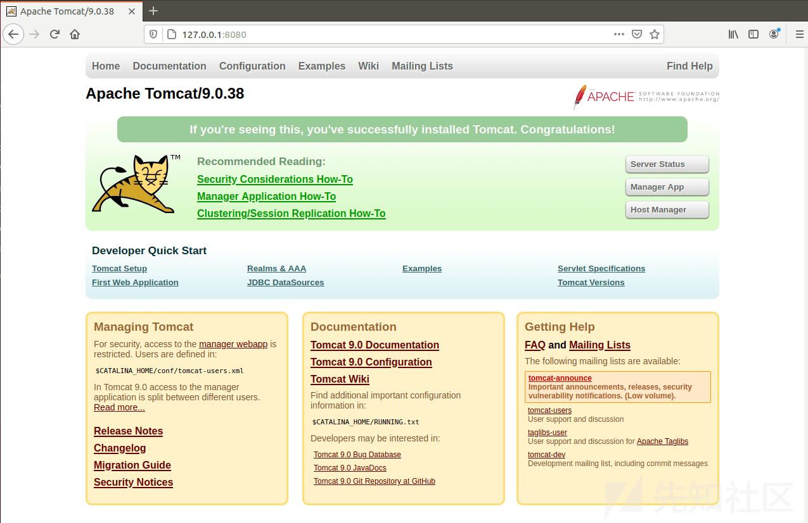

Tomcat 进程注入技术复现

- - -

# Tomcat 进程注入技术复现

最近学习了一下 tomcat 进程注入技术，其原理在于 Java 在 Java SE5 后引入了 Java Instrumentation，该功能指的是可以用独立于应用程序之外的代理程序来监测和协助包括但不限于获取 JVM 运行时状态，替换和修改类定义等。这里主要利用 GitHub 上 rebeyond 的[memShell](https://github.com/rebeyond/memShell)工程对该技术进行复现。

## 技术关键点

我们希望通过访问 web 服务器上的任意一个 url，无论该 url 是静态资源抑或 jsp 文件，无论是原生 servlet 还是 struts action，甚至无论它是否存在，只要我们传递请求给 tomcat，tomcat 就能响应我们的指令。要实现这一目的，必须找到一个关键的类，这个类要尽可能在 http 请求调用栈的上方，又不能与具体的 URL 有耦合，且还能接受客户端 request 中的数据。分析后发现，org.apache.catalina.core.ApplicationFilterChain 类的 internalDoFilter 方法最符合要求，internalDoFilter 方法的原型如下：

```bash
private void internalDoFilter(ServletRequest request, ServletResponse response)
        throws IOException, ServletException {}
```

该方法有 ServletRequest 和 ServletResponse 两个参数，里面封装了用户请求的 request 和 response，同时 internalDoFilter 方法也是自定义 filter 的入口：

```bash
private void internalDoFilter(ServletRequest request, ServletResponse response)
        throws IOException, ServletException {

        //Call the next filter if there is one
        if (pos < n) {
            ApplicationFilterConfig filterConfig = filters[pos++];
            Filter filter = null;
            try {
                filter = filterConfig.getFilter();
                support.fireInstanceEvent(InstanceEvent.BEFORE_FILTER_EVENT,
                                          filter, request, reponse);

                ...

                if ( Global.IS_SECURITY_ENABLED ) {
                    final ServletRequest req = request;
                    final ServletResponse res = response;
                    Principal principal = 
                        ((HttpServletRequest) req).getUserPrincipal();

                    Object[] args = new Object[]{req, res, this};
                    SecurityUtil.doAsPrivilege
                        ("doFilter", filter, classType, args, principal);

                } else {
                    filter.doFilter(request, response, this);
                }
                ...
            ...
```

所以要实现内存注入就需要对该方法插入我们定制的代码段（具体代码可在 memShell 工程中找到）

## 复现环境搭建

### 1\. Java 环境搭建

首先去[官网](https://www.oracle.com/java/technologies/javase/javase-jdk8-downloads.html)下载 jdk 文件，本次复现过程在 Ubuntu 虚拟机中实现，因此下载 Linux 版本的 jdk 文件，然后将下载的压缩包解压：

[](https://xzfile.aliyuncs.com/media/upload/picture/20201013133931-77f69cb2-0d16-1.png)

然后设置环境变量：

`vi /etc/profile`

这里我将 jdk 文件夹放到了`/usr/local`文件夹中，所以在文件末尾加入以下语句：

```bash
export JAVA_HOME=/usr/local/jdk1.8.0_261s
export JRE_HOME=${JAVA_HOME}/jre
export CLASSPATH=.:${JAVA_HOME}/lib:${JRE_HOME}/lib
export PATH=.:${JAVA_HOME}/bin:$PATH
```

然后使配置生效：

`source /etc/profile`

输入命令`java -version`检查配置是否生效：

[](https://xzfile.aliyuncs.com/media/upload/picture/20201013134005-8c54b356-0d16-1.png)

### 2\. 下载安装 tomcat

首先去[官网](https://tomcat.apache.org/)下载 tomcat，这里选择了 tomcat9，将压缩包放置于`/usr/local`文件夹下解压：

`tar zxvf apache-tomcat-9.0.38`

`sudo mv apache-tomcat-9.0.38 tomcat9`

然后配置 tomcat，并新建用户以非 root 用户来启动 tomcat

```bash
# 进入 Tomcat 安装目录下的 bin 目录
cd usr/local/tomcat9/bin
# 解压 commons-daemon-native.tar.gz
tar zxvf commons-daemon-native.tar.gz
cd commons-daemon-1.2.2-native-src/unix/
# 使 java 配置生效
source /etc/profile
# 编译
./configure
make
# make 后，会在当前文件夹下生成一个名为 jsvc 的文件，将其复制到$CATALINA_HOME/bin 目录
cp ../..
# 添加一个用来运行 Tomcat 的用户
sudo adduser tomcat（根据提示设置密码）
# 回到$CATALINA_HOME/bin 目录下
cd ../../
# 设置$CATALINE_HOME 文件夹及其所有子文件 Owner 为 tomcat
sudo chown -R tomcat:tomcat /usr/local/tomcat9
# 认证 tomcat 用户
su tomcat
# 启动 tomcat
./daemon.sh start
```

访问 127.0.0.1:8080，页面如下：

[](https://xzfile.aliyuncs.com/media/upload/picture/20201013134057-ab04011c-0d16-1.png)

### 3\. 使用 memShell 工程文件对 tomcat 进行内存注入

将 memShell 文件上传到 tomcat 服务器文件夹任意位置，然后执行命令

`java -jar inject.jar pppd`

执行成功后，在 url 后加上`anyurl?pass_the_word=pppd`，即得到帮助信息：

[](https://xzfile.aliyuncs.com/media/upload/picture/20201013134136-c20df5de-0d16-1.png)

执行 whoami 获取用户名：

[](https://xzfile.aliyuncs.com/media/upload/picture/20201013134153-cc6aee74-0d16-1.png)

其他功能参考帮助信息。

## 后记

本文主要以 Java+tomcat 为例进行了 tomcat 进程注入技术复现，该工程仅对内存 webshell 进行了技术实现，此外还可以通过修改源代码来实现其它功能，同时对于其他容器如 JBOSS 和 WebLogic，只是“定位关键类”那一步稍有不同，其他环节都是一般化的工作，理论上也可以实现类似功能。

## Reference

[利用“进程注入”实现无文件复活 WebShell](https://www.cnblogs.com/h2zZhou/p/9114743.html)

[Ubuntu 下配置 Tomcat 以指定（非 root）身份运行](https://blog.csdn.net/geekdonie/article/details/24896363)
