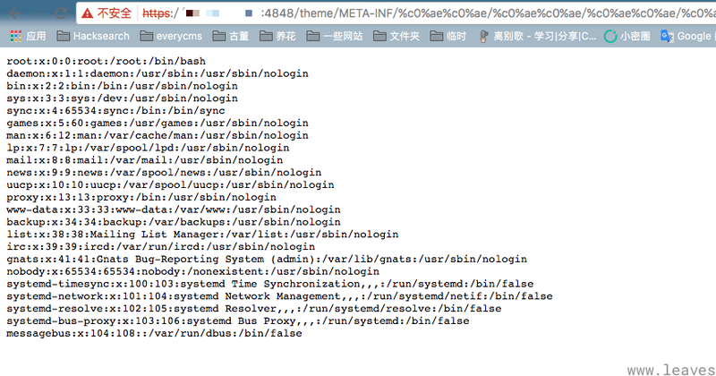

# UTF-8 Overlong Encoding 导致的安全问题

「代码审计」知识星球中@1ue 发表了一篇有趣的文章《[探索 Java 反序列化绕 WAF 新姿势](https://t.zsxq.com/17LkqCzk8)》，深入研究了一下其中的原理，我发现这是一个对我来说很“新”，但实际上年纪已经很大的 Trick。

## [0x01 UTF-8 编码原理](#0x01-utf-8)

UTF-8 是现在最流行的编码方式，它可以将 unicode 码表里的所有字符，用某种计算方式转换成长度是 1 到 4 位字节的字符。

参考这个表格，我们就可以很轻松地将 unicode 码转换成 UTF-8 编码：

| First code point | Last code point | Byte 1 | Byte 2 | Byte 3 | Byte 4 |
| --- | --- | --- | --- | --- | --- |
| U+0000 | U+007F | 0xxxxxxx |     |     |     |
| U+0080 | U+07FF | 110xxxxx | 10xxxxxx |     |     |
| U+0800 | U+FFFF | 1110xxxx | 10xxxxxx | 10xxxxxx |     |
| U+10000 | U+10FFFF | 11110xxx | 10xxxxxx | 10xxxxxx | 10xxxxxx |

举个例子，欧元符号€的 unicode 编码是 U+20AC，按照如下方法将其转换成 UTF-8 编码：

-   首先，因为 U+20AC 位于 U+0800 和 U+FFFF 之间，所以按照上表可知其 UTF-8 编码长度是 3
-   0x20AC 的二进制是`10 0000 1010 1100`，将所有位数从左至右按照 4、6、6 分成三组，第一组长度不满 4 前面补 0：`0010`，`000010`，`101100`
-   分别给这三组增加前缀`1110`、`10`和`10`，结果是`11100010`、`10000010`、`10101100`，对应的就是`\xE2\x82\xAC`
-   `\xE2\x82\xAC`即为欧元符号€的 UTF-8 编码

[](https://www.leavesongs.com/media/attachment/2024/02/23/293d0319-00d8-4e5b-b7c6-f659cf1c114d.png)

## [0x02 Overlong Encoding 是什么问题？](#0x02-overlong-encoding)

那么，了解了 UTF-8 的编码过程，我们就可以很容易理解 Overlong Encoding 是什么问题了。

Overlong Encoding 就是将 1 个字节的字符，按照 UTF-8 编码方式强行编码成 2 位以上 UTF-8 字符的方法。

仍然举例说明，比如点号`.`，其 unicode 编码和 ascii 编码一致，均为`0x2E`。按照上表，它只能被编码成单字节的 UTF-8 字符，但我按照下面的方法进行转换：

-   `0x2E`的二进制是`10 1110`，我给其前面补 5 个 0，变成`00000101110`
-   将其分成 5 位、6 位两组：`00000`，`101110`
-   分别给这两组增加前缀`110`，`10`，结果是`11000000`，`10101110`，对应的是`\xC0AE`

`0xC0AE`并不是一个合法的 UTF-8 字符，但我们确实是按照 UTF-8 编码方式将其转换出来的，这就是 UTF-8 设计中的一个缺陷。

按照 UTF-8 的规范来说，我们应该使用字符可以对应的最小字节数来表示这个字符。那么对于点号来说，就应该是 0x2e。但 UTF-8 编码转换的过程中，并没有限制往前补 0，导致转换出了非法的 UTF-8 字符。

**这种攻击方式就叫“Overlong Encoding”。**

Overlong Encoding 实际上很早就被提出了，早到那时候我还没开始学安全。很多语言在实现 UTF-8 的转换时，会对这个攻击方式做一定检查。比如，Python 中如果你想将`0xC0AE`转换成点号，就会抛出异常：

```bash
b'\xC0\xAE'.decode()
```

[](https://www.leavesongs.com/media/attachment/2024/02/23/d31b9858-211b-4da0-81c7-1b36349b3b30.png)

但我们质朴刚健的 Java 生态，在很多地方是没有对其进行防御的，这就导致了一些安全问题。

## [0x03 GlassFish 任意文件读取漏洞](#0x03-glassfish)

如果对安全熟悉的读者，看到前面的`0xC0AE`，其实应该很快想起来一个经典漏洞——[GlassFish 任意文件读取漏洞](https://github.com/vulhub/vulhub/tree/master/glassfish/4.1.0)。

这个漏洞就是在 URL 中使用`%C0%AE`来代替点号`.`，绕过目录穿越的限制，导致任意文件读取漏洞：

[](https://www.leavesongs.com/media/attachment/2024/02/23/3e3cafef-0c37-4a15-9784-fa01a083ed3a.png)

其原理就是 GlassFish 在路径解码时使用 UTF-8 编码，很典型的 Overlong Encoding 利用。

## [0x04 利用 Overlong Encoding 绕过 WAF](#0x04-overlong-encodingwaf)

回到本文开头的文章，其实@1ue 是完全在分析反序列化代码的时候发现了这个问题，换句话说，就等于把 Overlong Encoding 攻击重新发现了一遍，还是挺厉害的。

Java 在反序列化时使用`ObjectInputStream`类，这个类实现了`DataInput`接口，这个接口定义了读取字符串的方法`readUTF`。在解码中，Java 实际实现的是一个魔改过的 UTF-8 编码，名为“Modified UTF-8”。

参考其[文档](https://docs.oracle.com/javase%2F8%2Fdocs%2Fapi%2F%2F/java/io/DataInput.html)可以发现，“Modified UTF-8”类似于 MySQL 中的 UTF8，只使用三个字节来表示：

[](https://www.leavesongs.com/media/attachment/2024/02/23/3cefeabe-9827-407f-b740-76ac14602eee.png)

但其三字节以内的转换过程是和 UTF-8 相同的，所以仍然继承了“Overlong Encoding”缺陷。

攻击者可以将反序列化字节流里一些字符按照“Overlong Encoding”的方法转换成非法 UTF-8 字符，用来绕过一些基于流量的防御方法。

我写了一个简单的 Python 函数，用于将一个 ASCII 字符串转换成 Overlong Encoding 的 UTF-8 编码：

```bash
def convert_int(i: int) -> bytes:
    b1 = ((i >> 6) & 0b11111) | 0b11000000
    b2 = (i & 0b1111111) | 0b10000000
    return bytes([b1, b2])


def convert_str(s: str) -> bytes:
    bs = b''
    for ch in s.encode():
        bs += convert_int(ch)

    return bs


if __name__ == '__main__':
    print(convert_str('.')) # b'\xc0\xae'
    print(convert_str('org.example.Evil')) # b'\xc1\xef\xc1\xf2\xc1\xe7\xc0\xae\xc1\xe5\xc1\xf8\xc1\xe1\xc1\xed\xc1\xf0\xc1\xec\xc1\xe5\xc0\xae\xc1\xc5\xc1\xf6\xc1\xe9\xc1\xec'
```

参考链接：

-   [https://t.zsxq.com/17LkqCzk8](https://t.zsxq.com/17LkqCzk8)
-   [https://capec.mitre.org/data/definitions/80.html](https://capec.mitre.org/data/definitions/80.html)
-   [https://en.wikipedia.org/wiki/UTF-8#Overlong\_encodings](https://en.wikipedia.org/wiki/UTF-8#Overlong_encodings)
-   [https://utf8-chartable.de/unicode-utf8-table.pl](https://utf8-chartable.de/unicode-utf8-table.pl)
-   [https://github.com/vulhub/vulhub/tree/master/glassfish/4.1.0](https://github.com/vulhub/vulhub/tree/master/glassfish/4.1.0)
-   [https://docs.oracle.com/javase%2F8%2Fdocs%2Fapi%2F%2F/java/io/DataInput.html](https://docs.oracle.com/javase%2F8%2Fdocs%2Fapi%2F%2F/java/io/DataInput.html)
